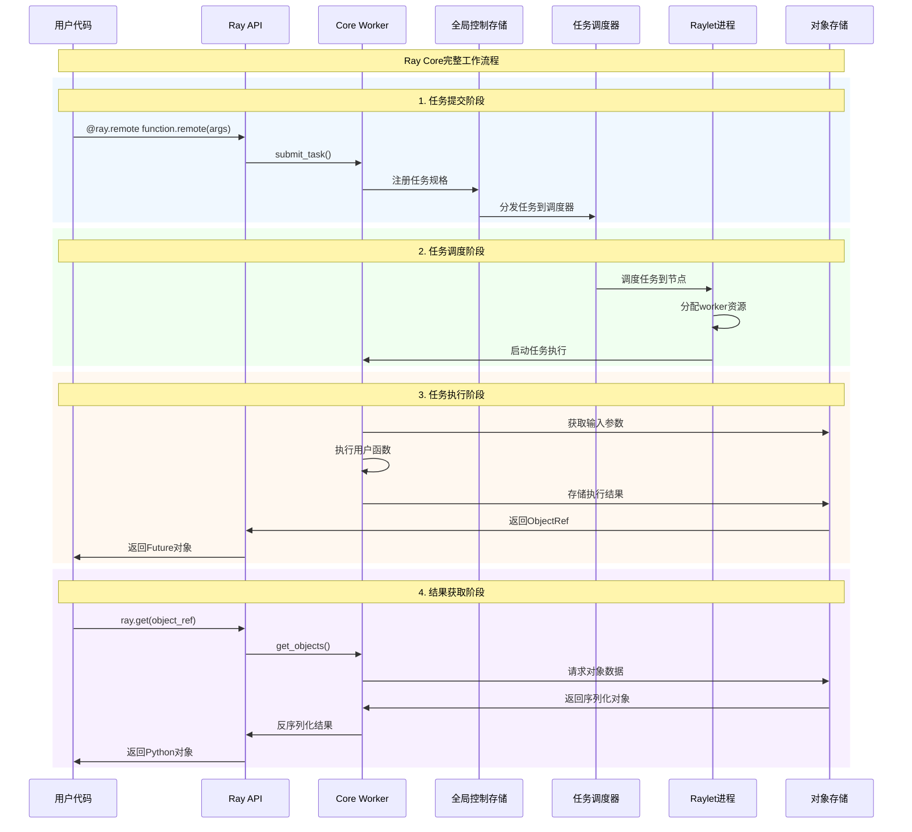
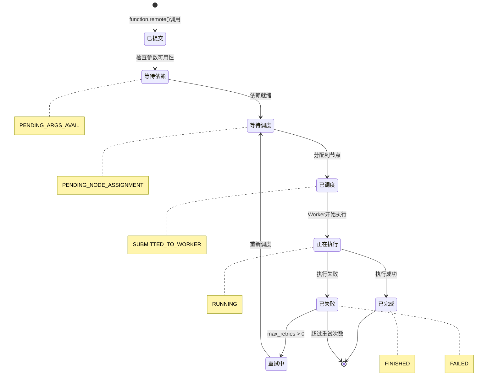
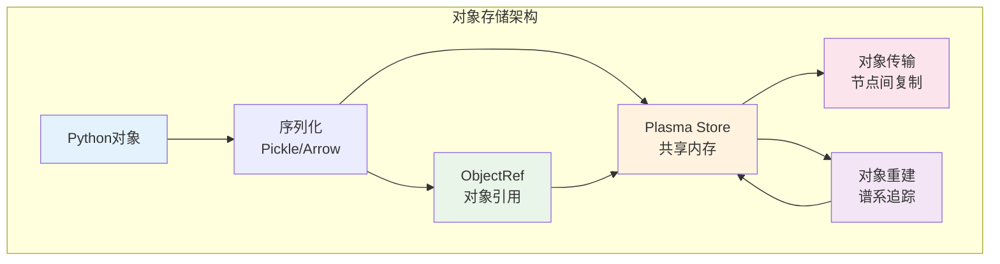
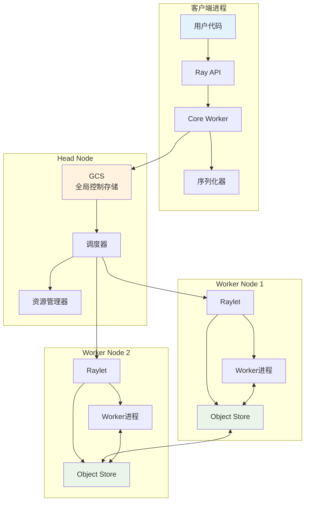
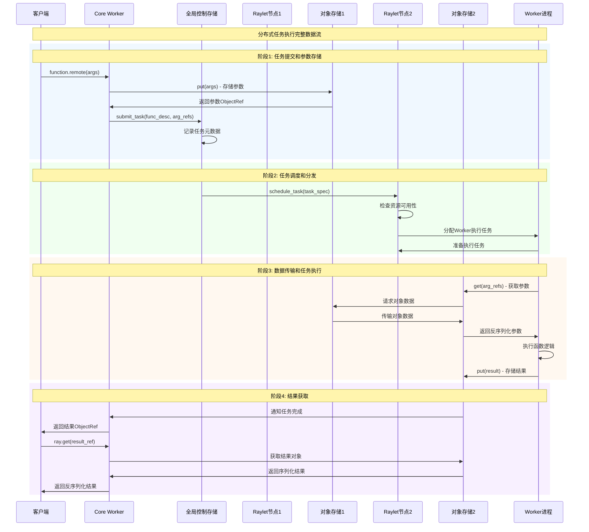
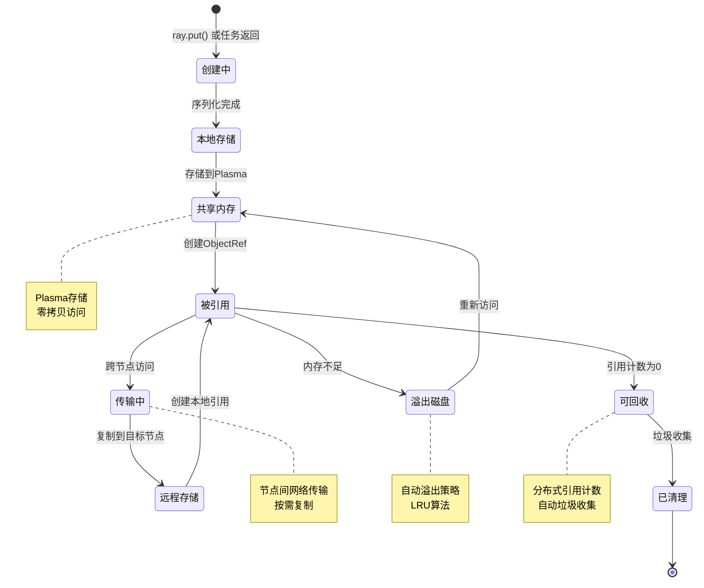
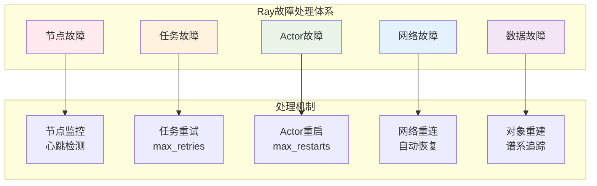

# Ray Core 模块深度剖析

## 目录
- [1. Ray Core概述](#1-ray-core概述)
- [2. Tasks任务系统](#2-tasks任务系统)
- [3. Actors有状态计算](#3-actors有状态计算)
- [4. Objects对象存储](#4-objects对象存储)
- [5. 核心数据流](#5-核心数据流)
- [6. 资源管理](#6-资源管理)
- [7. 故障处理](#7-故障处理)

---

## 1. Ray Core概述

Ray Core是Ray分布式计算框架的基础层，提供三个核心原语：**Tasks**（无状态函数）、**Actors**（有状态进程）和**Objects**（不可变对象）。这些原语共同构成了Ray分布式编程的基础抽象。

### 1.1 Ray Core架构图

```mermaid
graph TB
    subgraph "Python应用层"
        A[用户应用代码]
        B[@ray.remote装饰器]
        C[ray.get/put API]
    end
    
    subgraph "Ray Core API层"
        D[RemoteFunction<br/>远程函数]
        E[ActorClass<br/>Actor类]
        F[ObjectRef<br/>对象引用]
    end
    
    subgraph "Core Worker层"
        G[任务提交<br/>submit_task]
        H[Actor管理<br/>ActorManager]
        I[对象获取<br/>get_objects]
        J[序列化管理<br/>Serialization]
    end
    
    subgraph "集群服务层"
        K[GCS<br/>全局控制存储]
        L[Raylet<br/>节点管理器]
        M[Object Store<br/>Plasma存储]
        N[Task Scheduler<br/>任务调度器]
    end
    
    A --> B
    A --> C
    B --> D
    B --> E
    C --> F
    
    D --> G
    E --> H
    F --> I
    G --> J
    H --> J
    I --> J
    
    G --> N
    H --> L
    I --> M
    J --> K
    
    style A fill:#e3f2fd
    style D fill:#e8f5e8
    style G fill:#fff3e0
    style K fill:#fce4ec
```

### 1.2 Ray Core工作流程



---

## 2. Tasks任务系统

### 2.1 Tasks系统架构

Ray Tasks是无状态的远程函数调用，是Ray中最基础的并行原语。每个Task在独立的Worker进程中执行，执行完成后进程可以被回收用于执行其他Tasks。

```mermaid
graph LR
    subgraph "Task生命周期"
        A[任务创建<br/>@ray.remote]
        B[任务提交<br/>function.remote()]
        C[任务调度<br/>Scheduler]
        D[任务执行<br/>Worker Process]
        E[结果存储<br/>Object Store]
        F[结果获取<br/>ray.get()]
    end
    
    A --> B
    B --> C
    C --> D
    D --> E
    E --> F
    
    style A fill:#e3f2fd
    style B fill:#e8f5e8
    style C fill:#fff3e0
    style D fill:#fce4ec
    style E fill:#f3e5f5
    style F fill:#e8eaf6
```

### 2.2 RemoteFunction实现分析

```python
# 位置: python/ray/remote_function.py:41-190
@PublicAPI
class RemoteFunction:
    """
    远程函数的核心实现类
    
    职责：
    1. 函数元数据管理和序列化
    2. 任务提交和资源需求配置
    3. 运行时环境设置
    4. 调用接口封装(.remote()方法)
    """
    
    def __init__(self, language, function, function_descriptor, task_options):
        """
        初始化远程函数
        
        核心处理流程：
        1. 验证和设置任务选项（CPU、GPU、资源需求）
        2. 处理运行时环境配置
        3. 设置函数元数据（模块名、函数名等）
        4. 创建.remote()方法代理
        
        参数说明：
            language: 目标语言类型（Python/Java/C++）
            function: 原始Python函数对象
            function_descriptor: 函数描述符，用于跨进程传输
            task_options: 任务配置选项字典
                - num_cpus: CPU核心数需求，默认1
                - num_gpus: GPU数量需求，默认0
                - num_returns: 返回值数量，默认1
                - max_retries: 最大重试次数，默认3
                - resources: 自定义资源需求字典
                - runtime_env: 运行时环境配置
                - scheduling_strategy: 调度策略
        """
        # 验证任务选项的有效性
        ray_option_utils.validate_task_options(task_options, in_options=False)
        
        # 设置默认选项
        self._default_options = {}
        self._default_options.update(task_options)
        
        # 设置默认资源需求
        if "num_cpus" not in self._default_options:
            self._default_options["num_cpus"] = 1  # 默认需要1个CPU
        if "num_returns" not in self._default_options:
            self._default_options["num_returns"] = 1  # 默认返回1个对象
        
        # 处理运行时环境序列化
        self._runtime_env = self._default_options.get("runtime_env")
        if self._runtime_env:
            self._serialized_base_runtime_env_info = get_runtime_env_info(
                self._runtime_env,
                is_job_runtime_env=False,
                serialize=True,
            )
        
        # 设置函数基本属性
        self._language = language
        self._is_generator = inspect.isgeneratorfunction(function)
        self._function = function
        self._function_name = function.__module__ + "." + function.__name__
        self._function_descriptor = function_descriptor
        
        # 创建.remote()方法代理
        @wraps(function)
        def _remote_proxy(*args, **kwargs):
            """
            .remote()方法的实际实现
            
            功能：将用户的远程函数调用转换为任务提交
            """
            return self._remote(
                serialized_runtime_env_info=self._serialized_base_runtime_env_info,
                args=args,
                kwargs=kwargs,
                **self._default_options,
            )
        
        self.remote = _remote_proxy
    
    def _remote(self, args, kwargs, **task_options):
        """
        任务提交的核心实现
        
        处理流程：
        1. 参数验证和序列化
        2. 资源需求计算
        3. 调用CoreWorker的submit_task
        4. 返回ObjectRef异步引用
        """
        worker = ray._private.worker.global_worker
        worker.check_connected()
        
        # 获取当前任务上下文
        current_task_id = worker.get_current_task_id()
        
        # 调用底层的任务提交接口
        return worker.core_worker.submit_task(
            language=self._language,
            function_descriptor=self._function_descriptor,
            args=args,
            kwargs=kwargs,
            **task_options
        )
```

### 2.3 任务提交submit_task实现

```python
# 位置: python/ray/_raylet.pyx:3727-3811
def submit_task(self,
                Language language,
                FunctionDescriptor function_descriptor,
                args,
                c_string name,
                int num_returns,
                resources,
                int max_retries,
                c_bool retry_exceptions,
                retry_exception_allowlist,
                scheduling_strategy,
                c_string debugger_breakpoint,
                c_string serialized_runtime_env_info,
                int64_t generator_backpressure_num_objects,
                c_bool enable_task_events,
                labels,
                label_selector):
    """
    任务提交的底层实现（Cython代码）
    
    核心功能：
    1. 参数序列化和资源准备
    2. 创建任务规格(TaskSpec)
    3. 调用C++层的SubmitTask
    4. 返回ObjectRef列表
    
    实现步骤：
    """
    cdef:
        # 定义C++层数据结构
        unordered_map[c_string, double] c_resources
        unordered_map[c_string, c_string] c_labels
        CRayFunction ray_function
        CTaskOptions task_options
        c_vector[unique_ptr[CTaskArg]] args_vector
        c_vector[CObjectReference] return_refs
        CSchedulingStrategy c_scheduling_strategy
        c_vector[CObjectID] incremented_put_arg_ids
        c_string call_site
    
    # 1. 转换调度策略到C++格式
    self.python_scheduling_strategy_to_c(
        scheduling_strategy, &c_scheduling_strategy)
    
    # 2. 序列化重试异常白名单
    serialized_retry_exception_allowlist = serialize_retry_exception_allowlist(
        retry_exception_allowlist, function_descriptor)
    
    # 3. 记录调用栈信息（用于调试）
    if RayConfig.instance().record_task_actor_creation_sites():
        call_site = ''.join(traceback.format_stack())
    
    with self.profile_event(b"submit_task"):
        # 4. 准备资源需求和标签
        prepare_resources(resources, &c_resources)
        prepare_labels(labels, &c_labels)
        prepare_label_selector(label_selector, &c_label_selector)
        
        # 5. 创建Ray函数对象
        ray_function = CRayFunction(
            language.lang, function_descriptor.descriptor)
        
        # 6. 序列化参数并放入对象存储
        prepare_args_and_increment_put_refs(
            self, language, args, &args_vector, function_descriptor,
            &incremented_put_arg_ids)
        
        # 7. 创建任务选项对象
        task_options = CTaskOptions(
            name, num_returns, c_resources,
            b"",  # placement_options
            generator_backpressure_num_objects,
            serialized_runtime_env_info,
            enable_task_events,
            c_labels,
            c_label_selector,
            TENSOR_TRANSPORT_OBJECT_STORE  # 默认使用对象存储传输张量
        )
        
        # 8. 调用C++核心的任务提交
        current_c_task_id = current_task.native()
        with nogil:  # 释放GIL进行C++调用
            return_refs = CCoreWorkerProcess.GetCoreWorker().SubmitTask(
                ray_function, 
                args_vector, 
                task_options,
                max_retries, 
                retry_exceptions,
                c_scheduling_strategy,
                debugger_breakpoint,
                serialized_retry_exception_allowlist,
                call_site,
                current_c_task_id,
            )
    
    # 9. 清理临时引用计数
    for put_arg_id in incremented_put_arg_ids:
        self.core_worker.remove_object_ref_reference(put_arg_id)
    
    # 10. 转换返回的ObjectRef到Python对象
    return self._make_object_refs(return_refs)
```

### 2.4 任务状态管理



### 2.5 Task资源调度

```python
"""
Task资源调度策略详解

Ray支持多种调度策略来控制任务的执行位置：
"""

from ray.util.scheduling_strategies import (
    PlacementGroupSchedulingStrategy,
    NodeAffinitySchedulingStrategy,
    NodeLabelSchedulingStrategy
)

# 1. 默认调度策略 - 混合调度
@ray.remote
def default_task():
    """
    使用默认调度策略：
    - 优先本地执行（减少数据传输）
    - 考虑资源可用性
    - 负载均衡
    """
    return "default"

# 2. 展开调度策略 - 尽量分散
@ray.remote(scheduling_strategy="SPREAD")
def spread_task():
    """
    展开调度策略：
    - 尽量在不同节点执行
    - 提高并行度
    - 增加容错性
    """
    return "spread"

# 3. 放置组调度策略 - 资源组管理
import ray
pg = ray.util.placement_group([{"CPU": 1}] * 4, strategy="STRICT_PACK")

@ray.remote(
    scheduling_strategy=PlacementGroupSchedulingStrategy(
        placement_group=pg,
        placement_group_bundle_index=0
    )
)
def placement_group_task():
    """
    放置组调度策略：
    - 在特定资源组内执行
    - 保证资源隔离
    - 支持Gang Scheduling
    """
    return "placement_group"

# 4. 节点亲和性调度 - 指定节点
@ray.remote(
    scheduling_strategy=NodeAffinitySchedulingStrategy(
        node_id="node_1",
        soft=False  # 硬性要求在指定节点执行
    )
)
def node_affinity_task():
    """
    节点亲和性调度：
    - 在指定节点执行
    - 适用于数据本地性优化
    - soft=True时为软约束
    """
    return "node_affinity"

# 5. 标签选择调度 - 基于节点标签
@ray.remote(
    scheduling_strategy=NodeLabelSchedulingStrategy(
        hard={"instance-type": "gpu"},  # 硬性要求
        soft={"zone": "us-west"}        # 软性偏好
    )
)
def label_selector_task():
    """
    标签选择调度：
    - 基于节点标签选择
    - 支持硬性和软性约束
    - 适用于异构集群
    """
    return "label_selector"
```

---

## 3. Actors有状态计算

### 3.1 Actor系统架构

Ray Actors是有状态的远程对象，每个Actor运行在独立的Worker进程中，可以维护内部状态并处理多个方法调用。

```mermaid
graph TB
    subgraph "Actor生命周期"
        A[Actor创建<br/>@ray.remote class]
        B[Actor实例化<br/>Class.remote()]
        C[Actor调度<br/>节点分配]
        D[Actor启动<br/>进程初始化]
        E[方法调用<br/>actor.method.remote()]
        F[状态维护<br/>内部状态更新]
        G[Actor终止<br/>ray.kill() or GC]
    end
    
    A --> B
    B --> C
    C --> D
    D --> E
    E --> F
    F --> E
    E --> G
    
    style A fill:#e3f2fd
    style B fill:#e8f5e8
    style D fill:#fff3e0
    style E fill:#fce4ec
    style F fill:#f3e5f5
    style G fill:#ffebee
```

### 3.2 ActorClass实现分析

```python
# 位置: python/ray/actor.py:1181-1849
@PublicAPI
class ActorClass(Generic[T]):
    """
    Actor类的远程版本封装
    
    核心功能：
    1. Actor类的元数据管理
    2. Actor实例创建接口
    3. 资源需求配置
    4. 生命周期管理
    """
    
    def __init__(self, modified_class, class_id, actor_options):
        """
        初始化Actor类
        
        参数说明：
            modified_class: 修改后的Python类（添加了Ray特定方法）
            class_id: 全局唯一的类ID
            actor_options: Actor配置选项
                - num_cpus: CPU需求，默认1（调度用）+ 0（运行用）
                - num_gpus: GPU需求，默认0
                - max_restarts: 最大重启次数，默认0
                - max_task_retries: 方法调用重试次数，默认0
                - resources: 自定义资源需求
                - runtime_env: 运行时环境
                - lifetime: Actor生命周期策略
        """
        self._modified_class = modified_class
        self._class_id = class_id
        self._default_options = actor_options.copy()
        
        # 设置Actor类元数据
        self._class_name = modified_class.__name__
        self._module_name = modified_class.__module__
        
        # 处理方法签名和元数据
        self._method_signatures = {}
        self._method_num_returns = {}
        self._method_is_generator = {}
        
        for method_name in dir(modified_class):
            if not method_name.startswith('_'):
                method = getattr(modified_class, method_name)
                if callable(method):
                    self._method_signatures[method_name] = inspect.signature(method)
                    self._method_is_generator[method_name] = inspect.isgeneratorfunction(method)
    
    def remote(self, *args, **kwargs) -> ActorHandle[T]:
        """
        创建Actor实例的远程调用
        
        处理流程：
        1. 验证初始化参数
        2. 创建Actor创建任务
        3. 提交到调度器
        4. 返回ActorHandle
        """
        worker = ray._private.worker.global_worker
        worker.check_connected()
        
        # 创建Actor创建任务
        creation_task_spec = self._create_actor_creation_task(args, kwargs)
        
        # 提交Actor创建任务
        actor_id = worker.core_worker.create_actor(
            function_descriptor=creation_task_spec.function_descriptor,
            args=creation_task_spec.args,
            kwargs=creation_task_spec.kwargs,
            actor_creation_options=creation_task_spec.options
        )
        
        # 创建并返回ActorHandle
        return ActorHandle(
            language=Language.PYTHON,
            actor_id=actor_id,
            method_signatures=self._method_signatures,
            method_num_returns=self._method_num_returns,
            method_is_generator=self._method_is_generator,
            actor_creation_function_descriptor=creation_task_spec.function_descriptor,
            original_handle=True  # 标记为原始句柄
        )
    
    def _create_actor_creation_task(self, args, kwargs):
        """
        创建Actor创建任务规格
        
        返回：TaskSpec对象，描述Actor创建任务的所有信息
        """
        function_descriptor = PythonFunctionDescriptor(
            module_name=self._module_name,
            class_name=self._class_name,
            function_name="__init__",
            function_hash=""
        )
        
        return TaskSpec(
            task_id=TaskID.generate(),
            function_descriptor=function_descriptor,
            args=args,
            kwargs=kwargs,
            num_returns=1,  # Actor创建任务返回ActorHandle
            resources=self._default_options.get("resources", {}),
            runtime_env=self._default_options.get("runtime_env"),
            scheduling_strategy=self._default_options.get("scheduling_strategy"),
            max_retries=0,  # Actor创建不重试
            options=self._default_options
        )
```

### 3.3 ActorHandle实现分析

```python
# 位置: python/ray/actor.py:1851-2360
@PublicAPI
class ActorHandle(Generic[T]):
    """
    Actor实例的分布式句柄
    
    核心功能：
    1. Actor方法调用代理
    2. Actor状态查询
    3. Actor生命周期管理
    4. 序列化和反序列化支持
    
    重要属性：
        _ray_actor_id: 全局唯一Actor ID
        _ray_original_handle: 是否为原始句柄（影响GC行为）
        _ray_weak_ref: 是否为弱引用（不计入引用计数）
        _ray_method_signatures: 方法签名字典
        _ray_method_num_returns: 方法返回值数量
        _ray_allow_out_of_order_execution: 是否允许乱序执行
    """
    
    def __init__(self, 
                 language,
                 actor_id,
                 method_signatures,
                 method_num_returns,
                 method_is_generator,
                 actor_creation_function_descriptor,
                 original_handle=False,
                 weak_ref=False,
                 **kwargs):
        """
        初始化Actor句柄
        
        参数说明：
            actor_id: Actor的全局唯一标识符
            original_handle: 是否为原始句柄（第一个创建的句柄）
            weak_ref: 是否为弱引用句柄
        """
        self._ray_actor_id = actor_id
        self._ray_actor_language = language
        self._ray_original_handle = original_handle
        self._ray_weak_ref = weak_ref
        
        # 方法元数据
        self._ray_method_signatures = method_signatures
        self._ray_method_num_returns = method_num_returns
        self._ray_method_is_generator = method_is_generator
        
        # Actor配置
        self._ray_allow_out_of_order_execution = kwargs.get(
            "allow_out_of_order_execution", True)
        
        # 创建函数描述符
        self._ray_actor_creation_function_descriptor = actor_creation_function_descriptor
    
    def __getattr__(self, item: str) -> "ActorMethod":
        """
        动态创建Actor方法调用对象
        
        当访问Actor的方法时，返回ActorMethod对象
        ActorMethod封装了远程方法调用的逻辑
        """
        if item.startswith("_ray_"):
            raise AttributeError(f"'{type(self).__name__}' object has no attribute '{item}'")
        
        # 检查方法是否存在
        if item not in self._ray_method_signatures:
            raise AttributeError(f"Actor '{self.__class__.__name__}' has no method '{item}'")
        
        # 创建并返回ActorMethod对象
        return ActorMethod(
            method_name=item,
            actor_handle=self,
            method_signature=self._ray_method_signatures[item],
            num_returns=self._ray_method_num_returns.get(item, 1),
            is_generator=self._ray_method_is_generator.get(item, False)
        )
    
    def _actor_method_call(self, method_name: str, args, kwargs, **options):
        """
        Actor方法调用的核心实现
        
        处理流程：
        1. 构建方法调用任务
        2. 提交到Actor所在节点
        3. 返回ObjectRef
        """
        worker = ray._private.worker.global_worker
        worker.check_connected()
        
        # 构建Actor任务选项
        task_options = {
            "num_returns": options.get("num_returns", 1),
            "resources": options.get("resources", {}),
            "scheduling_strategy": "ACTOR",  # Actor方法使用Actor调度策略
        }
        
        # 调用底层的Actor任务提交
        return worker.core_worker.submit_actor_task(
            actor_id=self._ray_actor_id,
            method_name=method_name,
            args=args,
            kwargs=kwargs,
            **task_options
        )
    
    def __del__(self):
        """
        Actor句柄析构函数
        
        功能：
        1. 如果是原始句柄且非弱引用，则终止Actor
        2. 清理资源引用
        """
        if (self._ray_original_handle and 
            not self._ray_weak_ref and
            hasattr(self, '_ray_actor_id')):
            try:
                worker = ray._private.worker.global_worker
                if worker and hasattr(worker, 'core_worker'):
                    worker.core_worker.remove_actor_handle_reference(
                        self._ray_actor_id)
            except:
                # 在析构函数中忽略异常
                pass
```

### 3.4 ActorMethod实现

```python
# 位置: python/ray/actor.py:583-780
class ActorMethod:
    """
    Actor方法调用的封装类
    
    功能：
    1. 提供.remote()调用接口
    2. 处理方法参数和返回值
    3. 支持方法级别的配置覆盖
    """
    
    def __init__(self, method_name, actor_handle, method_signature, 
                 num_returns, is_generator):
        """
        初始化Actor方法对象
        
        参数：
            method_name: 方法名称
            actor_handle: 所属的ActorHandle
            method_signature: 方法签名信息
            num_returns: 返回值数量
            is_generator: 是否为生成器方法
        """
        self._method_name = method_name
        self._actor_handle = actor_handle
        self._method_signature = method_signature
        self._num_returns = num_returns
        self._is_generator = is_generator
        
        # 默认选项
        self._default_options = {
            "num_returns": num_returns,
            "is_generator": is_generator,
        }
    
    def remote(self, *args, **kwargs):
        """
        Actor方法的远程调用接口
        
        示例：
            actor_handle.method_name.remote(arg1, arg2)
        
        返回：ObjectRef或ObjectRef列表
        """
        return self._actor_handle._actor_method_call(
            self._method_name,
            args,
            kwargs,
            **self._default_options
        )
    
    def options(self, **options):
        """
        创建带有新选项的ActorMethod副本
        
        支持的选项：
            num_returns: 覆盖返回值数量
            resources: 方法级别的资源需求
        
        示例：
            actor_handle.method.options(num_returns=2).remote()
        """
        new_options = self._default_options.copy()
        new_options.update(options)
        
        new_method = ActorMethod(
            self._method_name,
            self._actor_handle,
            self._method_signature,
            new_options.get("num_returns", self._num_returns),
            self._is_generator
        )
        new_method._default_options = new_options
        return new_method
    
    def __call__(self, *args, **kwargs):
        """
        禁止直接调用Actor方法
        必须使用.remote()接口
        """
        raise TypeError(
            f"Actor methods cannot be called directly. "
            f"Instead of running '{self._method_name}()', "
            f"try '{self._method_name}.remote()'."
        )
```

### 3.5 Actor容错机制

```python
"""
Actor容错机制详解

Ray提供多层次的Actor容错支持：
1. Actor重启 (max_restarts)
2. 方法重试 (max_task_retries)  
3. 健康检查和监控
"""

import ray
import time

# 1. 自动重启Actor
@ray.remote(max_restarts=3)  # 最多重启3次
class FaultTolerantActor:
    def __init__(self):
        """
        Actor初始化
        
        重启行为：
        - Actor崩溃时自动重启
        - 重新执行__init__方法
        - 状态会丢失，需要手动恢复
        """
        self.state = {}
        print(f"Actor启动，PID: {os.getpid()}")
    
    def crash(self):
        """模拟Actor崩溃"""
        import os
        os._exit(1)  # 强制退出，触发重启
    
    def get_pid(self):
        """获取进程ID"""
        import os
        return os.getpid()

# 2. 方法级重试
@ray.remote(max_task_retries=2)  # 方法失败时重试2次
class RetryActor:
    def __init__(self):
        self.attempt_count = 0
    
    def unreliable_method(self):
        """
        不可靠的方法，可能失败
        
        重试行为：
        - 系统错误（如网络问题）触发重试
        - Python异常不触发重试
        - 重试在同一Actor实例上进行
        """
        self.attempt_count += 1
        if self.attempt_count <= 2:
            raise RuntimeError("模拟系统错误")
        return f"成功，尝试次数: {self.attempt_count}"

# 3. 状态检查点和恢复
@ray.remote(max_restarts=5)
class CheckpointActor:
    def __init__(self, checkpoint_interval=10):
        """
        支持检查点的Actor
        
        功能：
        - 定期保存状态到外部存储
        - 重启时从检查点恢复
        - 实现更强的容错性
        """
        self.state = {}
        self.checkpoint_interval = checkpoint_interval
        self.operation_count = 0
        
        # 尝试从检查点恢复
        self._restore_from_checkpoint()
    
    def update_state(self, key, value):
        """
        更新状态并可能触发检查点
        """
        self.state[key] = value
        self.operation_count += 1
        
        # 定期保存检查点
        if self.operation_count % self.checkpoint_interval == 0:
            self._save_checkpoint()
        
        return f"State updated: {key} = {value}"
    
    def _save_checkpoint(self):
        """保存状态到外部存储"""
        import pickle
        import tempfile
        
        checkpoint_data = {
            'state': self.state,
            'operation_count': self.operation_count,
            'timestamp': time.time()
        }
        
        # 实际实现中应使用云存储或分布式文件系统
        with tempfile.NamedTemporaryFile(mode='wb', delete=False) as f:
            pickle.dump(checkpoint_data, f)
            print(f"Checkpoint saved to {f.name}")
    
    def _restore_from_checkpoint(self):
        """从检查点恢复状态"""
        # 实际实现中应从云存储读取
        try:
            # 简化的恢复逻辑
            print("Attempting to restore from checkpoint...")
            # 恢复逻辑...
        except Exception as e:
            print(f"No checkpoint found: {e}")

# 使用示例
def test_actor_fault_tolerance():
    """测试Actor容错机制"""
    
    # 测试自动重启
    fault_tolerant_actor = FaultTolerantActor.remote()
    original_pid = ray.get(fault_tolerant_actor.get_pid.remote())
    
    # 触发崩溃
    try:
        ray.get(fault_tolerant_actor.crash.remote())
    except ray.exceptions.RayActorError:
        pass  # 预期的错误
    
    # 检查是否重启（新的PID）
    new_pid = ray.get(fault_tolerant_actor.get_pid.remote())
    print(f"Original PID: {original_pid}, New PID: {new_pid}")
    
    # 测试方法重试
    retry_actor = RetryActor.remote()
    result = ray.get(retry_actor.unreliable_method.remote())
    print(f"Retry result: {result}")
```

---

## 4. Objects对象存储

### 4.1 对象存储系统架构

Ray的对象存储系统基于Apache Arrow Plasma构建，为分布式计算提供高效的共享内存对象存储。



### 4.2 ObjectRef实现分析

```python
# 位置: python/ray/includes/object_ref.pxi:37-90
cdef class ObjectRef(BaseID):
    """
    分布式对象的异步引用
    
    核心功能：
    1. 异步对象访问接口
    2. 对象生命周期管理
    3. 分布式垃圾收集
    4. 序列化和传输支持
    
    重要属性：
        id: 对象的全局唯一标识符（20字节）
        owner_addr: 对象所有者地址
        call_site_data: 创建对象的调用栈信息
        in_core_worker: 是否在CoreWorker上下文中
    """
    
    def __init__(self, id, owner_addr="", call_site_data="",
                 skip_adding_local_ref=False, tensor_transport_val=0):
        """
        初始化对象引用
        
        参数说明：
            id: 对象ID（bytes类型，20字节）
            owner_addr: 对象所有者的地址信息
            call_site_data: 调用栈信息，用于调试
            skip_adding_local_ref: 是否跳过本地引用计数
            tensor_transport_val: 张量传输配置值
        
        功能：
        1. 设置对象ID和元数据
        2. 向CoreWorker注册引用计数
        3. 初始化对象传输配置
        """
        self._set_id(id)
        self.owner_addr = owner_addr
        self.call_site_data = call_site_data
        self.tensor_transport_val = tensor_transport_val
        self.in_core_worker = False
        
        # 获取全局Worker实例
        worker = ray._private.worker.global_worker
        
        # 检查是否在CoreWorker上下文中
        if hasattr(worker, "core_worker"):
            if not skip_adding_local_ref:
                # 向CoreWorker添加本地引用计数
                # 这确保对象在被使用期间不会被垃圾收集
                worker.core_worker.add_object_ref_reference(self)
            self.in_core_worker = True
    
    def __dealloc__(self):
        """
        对象引用析构函数
        
        功能：
        1. 从CoreWorker移除引用计数
        2. 触发分布式垃圾收集检查
        3. 处理异常情况
        
        注意：这个函数在Python垃圾收集时调用
        """
        if self.in_core_worker:
            try:
                worker = ray._private.worker.global_worker
                # 移除本地引用计数
                worker.core_worker.remove_object_ref_reference(self)
            except Exception as e:
                # 在析构函数中忽略异常
                # 这是因为析构可能在程序关闭时调用，
                # 此时全局状态可能不一致
                pass
    
    def binary(self):
        """
        获取对象ID的二进制表示
        
        返回：20字节的对象ID
        """
        return self.data.Binary()
    
    def hex(self):
        """
        获取对象ID的十六进制表示
        
        返回：40字符的十六进制字符串
        """
        return decode(self.data.Hex())
    
    def is_nil(self):
        """
        检查是否为空引用
        
        返回：布尔值，True表示空引用
        """
        return self.data.IsNil()
    
    def __hash__(self):
        """
        计算对象引用的哈希值
        
        用于：
        1. 在字典中使用ObjectRef作为键
        2. 在集合中存储ObjectRef
        3. 对象去重操作
        """
        return self.data.Hash()
    
    def __eq__(self, other):
        """
        比较两个对象引用是否相等
        
        比较基于对象ID，而不是对象内容
        """
        if not isinstance(other, ObjectRef):
            return False
        return self.data == other.data
    
    def __repr__(self):
        """
        对象引用的字符串表示
        
        格式：ObjectRef(hex_id)
        """
        return f"ObjectRef({self.hex()})"
```

### 4.3 ray.get()实现分析

```python
# 位置: python/ray/_private/worker.py:2851-2991
@PublicAPI
@client_mode_hook
def get(object_refs, *, timeout=None, _tensor_transport=None):
    """
    从对象存储获取对象的同步接口
    
    核心功能：
    1. 阻塞等待对象可用
    2. 从共享内存读取对象数据
    3. 反序列化对象
    4. 异常处理和重建
    
    参数：
        object_refs: ObjectRef或ObjectRef列表
        timeout: 超时时间（秒），None表示无限等待
        _tensor_transport: 张量传输方式
    
    返回：
        Python对象或对象列表
    """
    worker = global_worker
    worker.check_connected()
    
    # 处理单个ObjectRef的情况
    is_individual_id = isinstance(object_refs, ray.ObjectRef)
    if is_individual_id:
        object_refs = [object_refs]
    
    # 验证输入参数
    if not isinstance(object_refs, list):
        raise ValueError(
            f"Invalid type of object refs, {type(object_refs)}, is given. "
            "'object_refs' must either be an ObjectRef or a list of ObjectRefs."
        )
    
    # 调用底层获取对象的方法
    with profiling.profile("ray.get"):
        values, debugger_breakpoint = worker.get_objects(
            object_refs, 
            timeout=timeout, 
            _tensor_transport=_tensor_transport
        )
    
    # 处理获取到的对象
    for i, value in enumerate(values):
        if isinstance(value, RayError):
            # 处理各种错误类型
            if isinstance(value, ray.exceptions.ObjectLostError):
                # 对象丢失，记录内存使用情况
                worker.core_worker.log_plasma_usage()
            if isinstance(value, RayTaskError):
                # 任务错误，抛出原始异常
                raise value.as_instanceof_cause()
            else:
                # 其他Ray错误
                raise value
    
    # 处理调试断点
    if debugger_breakpoint != b"":
        # 设置调试器断点
        frame = sys._getframe().f_back
        rdb = ray.util.pdb._connect_ray_pdb(
            host=None,
            port=None,
            patch_stdstreams=False,
            quiet=None,
            breakpoint_uuid=(
                debugger_breakpoint.decode() if debugger_breakpoint else None
            ),
            debugger_external=worker.ray_debugger_external,
        )
        rdb.set_trace(frame=frame)
    
    # 返回结果
    if is_individual_id:
        return values[0]
    return values

def get_objects(self, object_refs, timeout=None, return_exceptions=False,
                skip_deserialization=False, _tensor_transport=None):
    """
    Worker类的get_objects方法实现
    
    核心处理流程：
    1. 参数验证和类型转换
    2. 调用CoreWorker获取序列化数据
    3. 反序列化对象
    4. 错误处理
    """
    # 验证所有对象引用类型
    for object_ref in object_refs:
        if not isinstance(object_ref, ObjectRef):
            raise TypeError(
                f"Attempting to call `get` on the value {object_ref}, "
                "which is not an ray.ObjectRef."
            )
    
    # 设置张量传输方式
    tensor_transport = TensorTransportEnum.OBJECT_STORE
    if _tensor_transport:
        if _tensor_transport.upper() == "NCCL":
            tensor_transport = TensorTransportEnum.NCCL
        elif _tensor_transport.upper() == "GLOO":
            tensor_transport = TensorTransportEnum.GLOO
    
    # 调用CoreWorker获取序列化对象
    serialized_objects = self.core_worker.get_objects(
        [obj_ref.binary() for obj_ref in object_refs],
        current_task_id=self.current_task_id.binary(),
        timeout_ms=int(timeout * 1000) if timeout else -1,
        tensor_transport=tensor_transport
    )
    
    if skip_deserialization:
        # 跳过反序列化，直接返回序列化数据
        return serialized_objects, b""
    
    # 反序列化对象
    results = self.deserialize_objects(
        serialized_objects, 
        object_refs,
        tensor_transport_hint=tensor_transport
    )
    
    # 处理异常
    if not return_exceptions:
        for result in results:
            if isinstance(result, Exception):
                raise result
    
    return results, b""  # 第二个返回值为调试器断点信息
```

### 4.4 ray.put()实现分析

```python
# 位置: python/ray/_private/worker.py:2996-3060
@PublicAPI
@client_mode_hook
def put(value, *, _owner=None, _tensor_transport="object_store"):
    """
    将Python对象存储到对象存储系统
    
    核心功能：
    1. 序列化Python对象
    2. 存储到共享内存
    3. 返回ObjectRef引用
    4. 支持大对象优化
    
    参数：
        value: 要存储的Python对象
        _owner: 对象所有者（Actor句柄）
        _tensor_transport: 张量传输方式
    
    返回：
        ObjectRef: 对象的异步引用
    """
    worker = global_worker
    worker.check_connected()
    
    # 检查对象大小
    if hasattr(value, '__sizeof__'):
        size = value.__sizeof__()
        if size > OBJECT_TRANSFER_WARNING_SIZE:  # 2GB
            logger.warning(
                f"Storing object of size {size / (1024**3):.2f} GB. "
                "Consider using ray.put() to store large objects efficiently."
            )
    
    # 序列化对象
    try:
        serialized_value = self._serialize_to_plasma(value)
    except Exception as e:
        raise RuntimeError(f"Failed to serialize object: {e}")
    
    # 存储到对象存储
    object_ref = worker.core_worker.put_object(
        value=serialized_value,
        owner_address=_owner._ray_actor_id.binary() if _owner else b"",
        tensor_transport=_tensor_transport
    )
    
    return object_ref

def _serialize_to_plasma(self, value):
    """
    序列化对象以存储到Plasma
    
    处理步骤：
    1. 选择序列化器（Pickle/Arrow）
    2. 处理特殊类型（NumPy数组、Tensor等）
    3. 优化大对象存储
    4. 生成元数据
    """
    # 检查是否为特殊类型
    if isinstance(value, np.ndarray):
        # NumPy数组使用Arrow序列化，零拷贝
        return self._serialize_numpy_array(value)
    elif hasattr(value, '__tensor_protocol__'):
        # 支持张量协议的对象
        return self._serialize_tensor(value)
    else:
        # 普通对象使用Pickle序列化
        return self._serialize_with_pickle(value)

def _serialize_numpy_array(self, array):
    """
    NumPy数组的优化序列化
    
    优势：
    1. 零拷贝存储（直接使用内存缓冲区）
    2. 类型信息保留
    3. 多维数组支持
    4. 大数组内存效率高
    """
    # 创建Arrow缓冲区
    import pyarrow as pa
    
    # 将NumPy数组转换为Arrow数组
    arrow_array = pa.array(array.flatten())
    
    # 保存形状和数据类型信息
    metadata = {
        'shape': array.shape,
        'dtype': str(array.dtype),
        'array_type': 'numpy'
    }
    
    return {
        'data': arrow_array.buffers(),
        'metadata': metadata
    }

def _serialize_with_pickle(self, value):
    """
    使用Pickle进行通用序列化
    
    特点：
    1. 支持任意Python对象
    2. 保持对象引用关系
    3. 自定义类序列化支持
    4. 相对较慢但通用性强
    """
    import cloudpickle
    
    try:
        serialized_data = cloudpickle.dumps(value, protocol=5)
        return {
            'data': serialized_data,
            'metadata': {'serializer': 'cloudpickle'},
            'size': len(serialized_data)
        }
    except Exception as e:
        raise RuntimeError(f"Failed to pickle object: {e}")
```

### 4.5 对象存储优化策略

```python
"""
Ray对象存储优化策略详解

Ray提供多种优化策略来提高对象存储的性能：
"""

import ray
import numpy as np
import time

# 1. 大对象存储优化
def optimize_large_objects():
    """
    大对象存储优化策略
    
    建议：
    - 使用ray.put()预先存储大对象
    - 避免重复传输相同的大对象
    - 利用零拷贝特性
    """
    
    # 创建大型NumPy数组
    large_array = np.random.random((10000, 10000))  # 约800MB
    
    # 不好的做法：每次传递都会序列化
    @ray.remote
    def bad_approach(array):
        return np.sum(array)
    
    start_time = time.time()
    futures = [bad_approach.remote(large_array) for _ in range(5)]
    results = ray.get(futures)
    bad_time = time.time() - start_time
    
    # 好的做法：预先存储到对象存储
    array_ref = ray.put(large_array)
    
    @ray.remote
    def good_approach(array_ref):
        array = ray.get(array_ref)  # 零拷贝获取
        return np.sum(array)
    
    start_time = time.time()
    futures = [good_approach.remote(array_ref) for _ in range(5)]
    results = ray.get(futures)
    good_time = time.time() - start_time
    
    print(f"Bad approach time: {bad_time:.2f}s")
    print(f"Good approach time: {good_time:.2f}s")
    print(f"Speedup: {bad_time/good_time:.2f}x")

# 2. 对象共享和重用
@ray.remote
class DataCache:
    """
    数据缓存Actor - 优化数据共享
    
    功能：
    - 缓存经常访问的数据
    - 减少重复序列化
    - 支持数据预加载
    """
    
    def __init__(self):
        self.cache = {}
        self.access_count = {}
    
    def store(self, key, value):
        """存储数据到缓存"""
        object_ref = ray.put(value)
        self.cache[key] = object_ref
        self.access_count[key] = 0
        return object_ref
    
    def get(self, key):
        """从缓存获取数据"""
        if key in self.cache:
            self.access_count[key] += 1
            return self.cache[key]
        return None
    
    def stats(self):
        """获取缓存统计信息"""
        return {
            'cached_objects': len(self.cache),
            'access_counts': self.access_count.copy()
        }

# 3. 内存使用监控
def monitor_object_store():
    """
    监控对象存储使用情况
    
    功能：
    - 跟踪内存使用量
    - 识别内存泄漏
    - 优化对象生命周期
    """
    
    # 获取对象存储状态
    cluster_resources = ray.cluster_resources()
    available_resources = ray.available_resources()
    
    print("Cluster Resources:", cluster_resources)
    print("Available Resources:", available_resources)
    
    # 创建一些对象来演示监控
    refs = []
    for i in range(10):
        data = np.random.random((1000, 1000))
        ref = ray.put(data)
        refs.append(ref)
    
    # 检查对象存储中的对象
    print(f"Created {len(refs)} objects")
    
    # 清理对象（删除引用）
    del refs  # 这会触发垃圾收集
    
    # 手动触发垃圾收集
    import gc
    gc.collect()

# 4. 对象溢出策略
def configure_object_spilling():
    """
    配置对象溢出策略
    
    当内存不足时，Ray会将对象溢出到磁盘：
    - 自动选择最少使用的对象
    - 透明的溢出和恢复
    - 可配置溢出目录和策略
    """
    
    # 在ray.init()时配置溢出
    ray.init(
        object_spill_config={
            "type": "filesystem",
            "params": {
                "directory_path": "/tmp/ray_spill",
                "buffer_size": 100 * 1024 * 1024,  # 100MB缓冲区
            }
        }
    )
    
    # 创建大量对象以触发溢出
    refs = []
    for i in range(100):
        # 创建50MB的数组
        data = np.random.random((6250000,))  # 约50MB
        ref = ray.put(data)
        refs.append(ref)
        
        if i % 10 == 0:
            print(f"Created {i+1} objects")
    
    print("All objects created, some may have been spilled to disk")
    
    # 访问溢出的对象（自动从磁盘恢复）
    result = ray.get(refs[0])
    print(f"Successfully retrieved spilled object: shape={result.shape}")

# 使用示例
if __name__ == "__main__":
    ray.init()
    
    # 演示大对象优化
    optimize_large_objects()
    
    # 演示数据缓存
    cache = DataCache.remote()
    data_ref = ray.get(cache.store.remote("dataset1", np.random.random((1000, 1000))))
    cached_ref = ray.get(cache.get.remote("dataset1"))
    stats = ray.get(cache.stats.remote())
    print("Cache stats:", stats)
    
    # 监控对象存储
    monitor_object_store()
    
    ray.shutdown()
```

---

## 5. 核心数据流

### 5.1 端到端数据流架构



### 5.2 任务执行数据流时序图



### 5.3 对象生命周期管理



---

## 6. 资源管理

### 6.1 资源类型和调度

Ray支持多种资源类型的管理和调度：

```python
"""
Ray资源管理系统详解

Ray提供了灵活的资源管理机制，支持CPU、GPU和自定义资源：
"""

import ray

# 1. 基础资源类型
@ray.remote(num_cpus=2)  # 需要2个CPU核心
def cpu_intensive_task():
    """CPU密集型任务"""
    import time
    time.sleep(1)  # 模拟计算
    return "CPU task completed"

@ray.remote(num_gpus=1)  # 需要1个GPU
def gpu_task():
    """GPU任务"""
    import torch
    if torch.cuda.is_available():
        device = torch.cuda.current_device()
        return f"GPU task completed on device {device}"
    return "No GPU available"

@ray.remote(memory=1000 * 1024 * 1024)  # 需要1GB内存
def memory_intensive_task():
    """内存密集型任务"""
    import numpy as np
    # 创建大数组
    data = np.random.random((10000, 10000))
    return f"Memory task completed, array shape: {data.shape}"

# 2. 自定义资源
@ray.remote(resources={"special_gpu": 1})
def special_gpu_task():
    """需要特殊GPU资源的任务"""
    return "Special GPU task completed"

@ray.remote(resources={"database_connection": 0.5})
def database_task():
    """需要数据库连接资源的任务"""
    return "Database task completed"

# 3. 资源组合
@ray.remote(
    num_cpus=2,
    num_gpus=1,
    memory=2000 * 1024 * 1024,
    resources={"ssd_storage": 1}
)
def complex_task():
    """复杂任务，需要多种资源"""
    return "Complex task completed"

# 4. 动态资源调整
@ray.remote(num_cpus=1)
def adaptive_task():
    """可以动态调整资源需求的任务"""
    return "Adaptive task completed"

# 在运行时调整资源需求
adapted_task = adaptive_task.options(num_cpus=4, num_gpus=1)

# 5. Actor资源管理
@ray.remote(
    num_cpus=2,
    num_gpus=1,
    max_concurrency=4  # 最大并发任务数
)
class ResourceManagedActor:
    """资源管理的Actor"""
    
    def __init__(self):
        self.task_count = 0
    
    def process(self, data):
        """处理数据的方法"""
        self.task_count += 1
        return f"Processed data, task count: {self.task_count}"

# 使用示例
def demonstrate_resource_management():
    """演示资源管理功能"""
    
    # 启动Ray时指定总资源
    ray.init(
        num_cpus=8,
        num_gpus=2,
        resources={"special_gpu": 4, "database_connection": 10}
    )
    
    # 提交不同资源需求的任务
    cpu_future = cpu_intensive_task.remote()
    gpu_future = gpu_task.remote()
    memory_future = memory_intensive_task.remote()
    special_future = special_gpu_task.remote()
    
    # 等待任务完成
    results = ray.get([cpu_future, gpu_future, memory_future, special_future])
    
    for result in results:
        print(result)
    
    # 创建资源管理的Actor
    actor = ResourceManagedActor.remote()
    
    # 并发调用Actor方法（受max_concurrency限制）
    futures = [actor.process.remote(f"data_{i}") for i in range(10)]
    results = ray.get(futures)
    
    for result in results:
        print(result)
```

### 6.2 Placement Groups - 资源分组

```python
"""
Placement Groups - Ray的资源分组机制

Placement Groups允许将相关的任务和Actor放置在一起，
实现更好的性能和资源利用率。
"""

import ray
from ray.util.placement_group import placement_group, remove_placement_group
from ray.util.scheduling_strategies import PlacementGroupSchedulingStrategy

# 1. 创建Placement Group
def create_placement_groups():
    """创建和管理Placement Groups"""
    
    # 创建紧密打包的资源组
    pg_tight = placement_group([
        {"CPU": 2, "GPU": 1},  # Bundle 0: 2 CPU + 1 GPU
        {"CPU": 2},            # Bundle 1: 2 CPU
        {"CPU": 1, "memory": 1000 * 1024 * 1024}  # Bundle 2: 1 CPU + 1GB内存
    ], strategy="STRICT_PACK")  # 严格打包在同一节点
    
    # 创建分散的资源组
    pg_spread = placement_group([
        {"CPU": 1} for _ in range(4)  # 4个单CPU bundle
    ], strategy="STRICT_SPREAD")  # 严格分散到不同节点
    
    # 等待Placement Group创建完成
    ray.get(pg_tight.ready())
    ray.get(pg_spread.ready())
    
    return pg_tight, pg_spread

# 2. 在Placement Group中运行任务
@ray.remote(num_cpus=2, num_gpus=1)
def gpu_training_task(data):
    """GPU训练任务"""
    import torch
    print(f"Training on GPU: {torch.cuda.current_device()}")
    return f"Training completed for {data}"

@ray.remote(num_cpus=2)
def data_preprocessing_task(data):
    """数据预处理任务"""
    print("Preprocessing data...")
    return f"Preprocessed {data}"

@ray.remote(num_cpus=1)
def result_aggregation_task(results):
    """结果聚合任务"""
    print("Aggregating results...")
    return f"Aggregated {len(results)} results"

def run_ml_pipeline():
    """运行机器学习管道示例"""
    
    # 创建Placement Group用于ML管道
    ml_pg = placement_group([
        {"CPU": 2, "GPU": 1},  # 训练节点
        {"CPU": 2},            # 数据处理节点
        {"CPU": 1},            # 结果聚合节点
    ], strategy="STRICT_PACK")
    
    ray.get(ml_pg.ready())
    
    # 在不同bundle中运行任务
    training_future = gpu_training_task.options(
        scheduling_strategy=PlacementGroupSchedulingStrategy(
            placement_group=ml_pg,
            placement_group_bundle_index=0
        )
    ).remote("dataset_1")
    
    preprocessing_future = data_preprocessing_task.options(
        scheduling_strategy=PlacementGroupSchedulingStrategy(
            placement_group=ml_pg,
            placement_group_bundle_index=1
        )
    ).remote("raw_data")
    
    # 等待训练和预处理完成
    training_result = ray.get(training_future)
    preprocessing_result = ray.get(preprocessing_future)
    
    # 运行结果聚合
    aggregation_future = result_aggregation_task.options(
        scheduling_strategy=PlacementGroupSchedulingStrategy(
            placement_group=ml_pg,
            placement_group_bundle_index=2
        )
    ).remote([training_result, preprocessing_result])
    
    final_result = ray.get(aggregation_future)
    print(f"Pipeline result: {final_result}")
    
    # 清理Placement Group
    remove_placement_group(ml_pg)

# 3. Actor与Placement Group
@ray.remote(num_cpus=1)
class DistributedWorker:
    """分布式Worker Actor"""
    
    def __init__(self, worker_id):
        self.worker_id = worker_id
        import os
        self.pid = os.getpid()
        print(f"Worker {worker_id} started, PID: {self.pid}")
    
    def process_task(self, task_id):
        """处理任务"""
        return f"Worker {self.worker_id} processed task {task_id}"
    
    def get_info(self):
        """获取Worker信息"""
        import ray
        return {
            "worker_id": self.worker_id,
            "pid": self.pid,
            "node_id": ray.get_runtime_context().node_id
        }

def create_distributed_actors():
    """创建分布式Actor集群"""
    
    # 创建跨节点的Placement Group
    distributed_pg = placement_group([
        {"CPU": 1} for _ in range(6)  # 6个Worker
    ], strategy="SPREAD")  # 尽量分散到不同节点
    
    ray.get(distributed_pg.ready())
    
    # 在不同bundle中创建Actor
    workers = []
    for i in range(6):
        worker = DistributedWorker.options(
            scheduling_strategy=PlacementGroupSchedulingStrategy(
                placement_group=distributed_pg,
                placement_group_bundle_index=i
            )
        ).remote(worker_id=i)
        workers.append(worker)
    
    # 获取Worker信息，验证分布情况
    worker_infos = ray.get([worker.get_info.remote() for worker in workers])
    
    print("Worker distribution:")
    for info in worker_infos:
        print(f"Worker {info['worker_id']}: Node {info['node_id'][:8]}, PID {info['pid']}")
    
    # 分发任务到所有Worker
    futures = []
    for i, worker in enumerate(workers):
        for task_id in range(3):  # 每个Worker处理3个任务
            future = worker.process_task.remote(f"{i}_{task_id}")
            futures.append(future)
    
    # 等待所有任务完成
    results = ray.get(futures)
    print(f"Processed {len(results)} tasks across {len(workers)} workers")
    
    # 清理资源
    remove_placement_group(distributed_pg)

# 使用示例
if __name__ == "__main__":
    ray.init(num_cpus=8, num_gpus=2)
    
    try:
        # 演示Placement Groups
        run_ml_pipeline()
        create_distributed_actors()
    finally:
        ray.shutdown()
```

---

## 7. 故障处理

### 7.1 故障类型和处理策略



### 7.2 任务故障处理

```python
"""
Ray任务故障处理机制详解

Ray提供多层次的故障处理机制：
1. 任务级重试
2. 异常处理和传播
3. 故障隔离
4. 资源清理
"""

import ray
import time
import random

# 1. 基本任务重试
@ray.remote(max_retries=3)
def unreliable_task(task_id, failure_rate=0.5):
    """
    模拟不可靠的任务
    
    故障处理行为：
    - 系统故障（如Worker崩溃）会触发重试
    - Python异常默认不触发重试
    - 重试在不同Worker上执行
    """
    print(f"Task {task_id} starting...")
    
    # 模拟随机故障
    if random.random() < failure_rate:
        # 模拟系统故障（Worker崩溃）
        import os
        print(f"Task {task_id} simulating worker crash")
        os._exit(1)  # 强制退出，触发重试
    
    print(f"Task {task_id} completed successfully")
    return f"Result from task {task_id}"

# 2. 异常重试策略
@ray.remote(max_retries=2, retry_exceptions=[ConnectionError, TimeoutError])
def network_task(endpoint):
    """
    网络任务，支持特定异常重试
    
    配置说明：
    - retry_exceptions=True: 重试所有异常
    - retry_exceptions=[Exception1, Exception2]: 只重试指定异常
    - retry_exceptions=False: 不重试任何异常（默认）
    """
    import requests
    import random
    
    # 模拟网络问题
    if random.random() < 0.3:
        raise ConnectionError("Network connection failed")
    
    if random.random() < 0.3:
        raise TimeoutError("Request timeout")
    
    # 模拟其他异常（不会重试）
    if random.random() < 0.1:
        raise ValueError("Invalid endpoint")
    
    return f"Data from {endpoint}"

# 3. 故障恢复策略
@ray.remote
class FaultTolerantProcessor:
    """
    容错数据处理器
    
    特性：
    - 检查点机制
    - 状态恢复
    - 进度跟踪
    """
    
    def __init__(self, checkpoint_interval=100):
        self.processed_count = 0
        self.checkpoint_interval = checkpoint_interval
        self.results = []
        self.checkpoint_data = {}
        
        # 尝试从检查点恢复
        self._restore_from_checkpoint()
    
    def process_batch(self, batch_data, batch_id):
        """
        处理数据批次，支持故障恢复
        """
        try:
            # 检查是否已处理过此批次
            if batch_id in self.checkpoint_data.get('completed_batches', set()):
                return f"Batch {batch_id} already processed (recovered)"
            
            # 处理数据
            result = self._process_data(batch_data)
            self.results.append(result)
            self.processed_count += 1
            
            # 定期保存检查点
            if self.processed_count % self.checkpoint_interval == 0:
                self._save_checkpoint()
            
            # 记录完成的批次
            if 'completed_batches' not in self.checkpoint_data:
                self.checkpoint_data['completed_batches'] = set()
            self.checkpoint_data['completed_batches'].add(batch_id)
            
            return f"Batch {batch_id} processed successfully"
            
        except Exception as e:
            print(f"Error processing batch {batch_id}: {e}")
            # 记录错误但不阻塞其他批次
            return f"Batch {batch_id} failed: {e}"
    
    def _process_data(self, data):
        """实际的数据处理逻辑"""
        # 模拟处理时间
        time.sleep(0.1)
        
        # 模拟偶发故障
        if random.random() < 0.05:
            raise RuntimeError("Processing error")
        
        return sum(data) if isinstance(data, list) else len(str(data))
    
    def _save_checkpoint(self):
        """保存检查点"""
        self.checkpoint_data.update({
            'processed_count': self.processed_count,
            'results_count': len(self.results),
            'timestamp': time.time()
        })
        print(f"Checkpoint saved: {self.processed_count} items processed")
    
    def _restore_from_checkpoint(self):
        """从检查点恢复状态"""
        # 在实际应用中，这里会从持久化存储读取
        print("Attempting to restore from checkpoint...")
        # 模拟恢复逻辑
        
    def get_status(self):
        """获取处理状态"""
        return {
            'processed_count': self.processed_count,
            'results_count': len(self.results),
            'checkpoint_data': self.checkpoint_data
        }

# 4. 故障检测和处理
def handle_task_failures():
    """处理任务故障的完整示例"""
    
    print("Testing task failure handling...")
    
    # 提交可能失败的任务
    futures = []
    for i in range(10):
        future = unreliable_task.remote(i, failure_rate=0.3)
        futures.append(future)
    
    # 处理任务结果和异常
    for i, future in enumerate(futures):
        try:
            result = ray.get(future, timeout=10)
            print(f"Task {i} succeeded: {result}")
        except ray.exceptions.WorkerCrashedError as e:
            print(f"Task {i} failed after retries: Worker crashed")
        except ray.exceptions.RayTaskError as e:
            print(f"Task {i} failed with exception: {e}")
        except Exception as e:
            print(f"Task {i} failed with unexpected error: {e}")

def test_network_task_retry():
    """测试网络任务重试机制"""
    
    print("Testing network task retry...")
    
    endpoints = ["api1", "api2", "api3", "api4", "api5"]
    futures = [network_task.remote(ep) for ep in endpoints]
    
    for i, future in enumerate(futures):
        try:
            result = ray.get(future)
            print(f"Network task {i} succeeded: {result}")
        except Exception as e:
            print(f"Network task {i} failed: {e}")

def test_fault_tolerant_processing():
    """测试容错数据处理"""
    
    print("Testing fault-tolerant processing...")
    
    # 创建容错处理器
    processor = FaultTolerantProcessor.remote(checkpoint_interval=5)
    
    # 提交多个批次处理
    batch_futures = []
    for i in range(20):
        batch_data = [random.randint(1, 100) for _ in range(10)]
        future = processor.process_batch.remote(batch_data, batch_id=i)
        batch_futures.append(future)
    
    # 收集结果
    results = ray.get(batch_futures)
    for i, result in enumerate(results):
        print(f"Batch {i}: {result}")
    
    # 获取最终状态
    status = ray.get(processor.get_status.remote())
    print(f"Final status: {status}")

# 5. 集群级故障处理
def monitor_cluster_health():
    """监控集群健康状态"""
    
    print("Monitoring cluster health...")
    
    # 获取集群状态
    cluster_resources = ray.cluster_resources()
    available_resources = ray.available_resources()
    
    print("Cluster Resources:", cluster_resources)
    print("Available Resources:", available_resources)
    
    # 检查节点状态
    nodes = ray.nodes()
    print(f"Active nodes: {len([n for n in nodes if n['Alive']])}")
    print(f"Dead nodes: {len([n for n in nodes if not n['Alive']])}")
    
    # 获取任务状态统计
    try:
        from ray.util.state import list_tasks
        tasks = list_tasks(filters=[("state", "=", "FAILED")], limit=10)
        print(f"Recent failed tasks: {len(tasks)}")
    except Exception as e:
        print(f"Could not get task status: {e}")

# 使用示例
if __name__ == "__main__":
    ray.init(ignore_reinit_error=True)
    
    try:
        # 测试各种故障处理机制
        handle_task_failures()
        test_network_task_retry()
        test_fault_tolerant_processing()
        monitor_cluster_health()
        
    finally:
        ray.shutdown()
```

---

## 总结

Ray Core模块通过Tasks、Actors和Objects三大原语，为分布式计算提供了强大而灵活的基础设施：

### 关键设计原则：
1. **简化API**: 通过装饰器隐藏分布式复杂性
2. **零拷贝优化**: Plasma对象存储支持高效数据共享
3. **自动容错**: 多层次故障检测和恢复机制
4. **灵活调度**: 支持多种资源管理和调度策略
5. **性能优化**: 从序列化到传输的全链路优化

### 核心优势：
- **统一编程模型**: 无状态Tasks和有状态Actors的完美结合
- **高性能对象存储**: 基于共享内存的零拷贝数据访问
- **智能资源调度**: 自动负载均衡和资源分配
- **强大的容错性**: 自动故障检测、重试和恢复
- **可扩展性**: 从单机到大规模集群的无缝扩展

Ray Core为上层AI库提供了坚实的基础，使得复杂的分布式机器学习工作负载能够以简单直观的方式实现和扩展。
