- [1. Ray Data概述](#1-ray-data概述)
- [2. 核心架构设计](#2-核心架构设计)
- [3. Dataset API详解](#3-dataset-api详解)
- [4. 执行引擎剖析](#4-执行引擎剖析)
- [5. 数据分区机制](#5-数据分区机制)
- [6. 数据源系统](#6-数据源系统)
- [7. 使用示例与最佳实践](#7-使用示例与最佳实践)

---

## 1. Ray Data概述

Ray Data是Ray生态系统中的分布式数据处理库，专为机器学习工作负载的数据预处理、特征工程和批量推理而设计。它提供了类似Spark的分布式数据处理能力，但更紧密地集成到Ray生态系统中。

### 1.1 核心特性


### 1.2 Ray Data在ML工作流中的位置


---

## 2. 核心架构设计

### 2.1 整体架构图


### 2.2 Dataset生命周期


---

## 3. Dataset API详解

### 3.1 Dataset类核心实现

```python
# 位置: python/ray/data/dataset.py:167-292
@PublicAPI
class Dataset:
    """
    分布式数据集合，Ray Data的核心抽象
    
    核心职责：

    1. 数据的逻辑表示和操作
    2. 延迟计算的计划构建
    3. 数据转换操作的API
    4. 与执行引擎的接口
    
    关键属性：
        _plan: ExecutionPlan - 物理执行计划
        _logical_plan: LogicalPlan - 逻辑计划
        _current_executor: Executor - 当前执行器
    """
    
    def __init__(self, plan: ExecutionPlan, logical_plan: LogicalPlan):
        """
        初始化Dataset实例
        
        参数说明：
            plan: 物理执行计划，定义具体的执行策略
            logical_plan: 逻辑计划，定义数据操作的语义
        
        功能：
        1. 建立计划之间的链接关系
        2. 初始化执行状态
        3. 注册统计信息收集
        """
        assert isinstance(plan, ExecutionPlan), type(plan)
        
        self._plan = plan
        self._logical_plan = logical_plan
        self._plan.link_logical_plan(logical_plan)
        
        # 当前运行的执行器句柄
        self._current_executor: Optional["Executor"] = None
        
        # 设置唯一标识符用于统计
        self._set_uuid(StatsManager.get_dataset_id_from_stats_actor())
    
    def map_batches(
        self,
        fn: Union[CallableClass, Callable],
        *,
        batch_size: Union[int, Literal["default"]] = "default",
        compute: Union[str, ComputeStrategy] = None,
        **kwargs
    ) -> "Dataset":
        """
        对数据批次应用用户定义的函数
        
        核心功能：
        1. 批量数据处理的主要接口
        2. 支持CPU和GPU计算
        3. 自动批次大小优化
        4. Actor池和任务池两种执行模式
        
        参数说明：
            fn: 用户定义的处理函数
                输入：Dict[str, np.ndarray] 或 pd.DataFrame
                输出：处理后的批次数据
            batch_size: 批次大小，"default"为自动调整
            compute: 计算策略，"tasks"或"actors"
        
        实现原理：
        1. 构建MapBatches逻辑操作符
        2. 根据compute策略选择物理操作符
        3. 添加到逻辑计划中
        """
        # 验证函数签名和参数
        if not callable(fn):
            raise ValueError("fn must be callable")
        
        # 构建批处理转换器
        map_transformer = BatchMapTransformer(
            fn=fn,
            batch_size=batch_size,
            **kwargs
        )
        
        # 创建逻辑操作符
        logical_op = MapBatches(
            input_op=self._logical_plan.dag,
            map_transformer=map_transformer,
            compute_strategy=compute
        )
        
        # 构建新的逻辑计划
        new_logical_plan = LogicalPlan(logical_op, self._plan._context)
        
        # 创建新的Dataset实例
        return Dataset(
            plan=self._plan.copy(),
            logical_plan=new_logical_plan
        )
    
    def filter(self, fn: Union[CallableClass, Callable]) -> "Dataset":
        """
        根据谓词函数过滤数据
        
        功能：
        1. 行级别的数据过滤
        2. 支持复杂的过滤逻辑
        3. 自动优化谓词推断
        """
        filter_transformer = RowFilterTransformer(fn)
        
        logical_op = Filter(
            input_op=self._logical_plan.dag,
            filter_transformer=filter_transformer
        )
        
        return self._create_new_dataset_from_logical_op(logical_op)
    
    def groupby(self, key: Union[str, List[str]]) -> "GroupedData":
        """
        按指定键分组数据
        
        返回GroupedData对象，支持聚合操作：
        - sum(), mean(), max(), min()
        - count(), std()
        - 自定义聚合函数
        """
        return GroupedData(self, key)

```

### 3.2 数据读取API实现

```python
# 位置: python/ray/data/read_api.py
@PublicAPI
def read_parquet(
    paths: Union[str, List[str]],
    *,
    filesystem: Optional["pyarrow.fs.FileSystem"] = None,
    columns: Optional[List[str]] = None,
    parallelism: int = -1,
    **kwargs
) -> Dataset:
    """
    读取Parquet文件创建Dataset
    
    核心实现流程：

    1. 路径解析和文件发现
    2. 并行度计算和任务分割  
    3. 创建读取任务
    4. 构建执行计划
    
    优化特性：
    - 列剪枝（Projection Pushdown）
    - 谓词下推（Predicate Pushdown）
    - 自动并行度检测
    - 元数据缓存
    """
    
    # 1. 创建Parquet数据源
    datasource = ParquetDatasource(
        paths=paths,
        filesystem=filesystem,
        columns=columns,
        **kwargs
    )
    
    # 2. 调用通用读取接口
    return read_datasource(
        datasource,
        parallelism=parallelism,
        **kwargs
    )

def read_datasource(datasource: Datasource, **kwargs) -> Dataset:
    """
    通用数据源读取实现
    
    处理流程：

    1. 数据源能力检查
    2. 并行度自动检测
    3. 读取任务生成
    4. 执行计划构建
    """
    
    # 获取数据上下文
    ctx = DataContext.get_current()
    
    # 自动检测最优并行度
    requested_parallelism, _, _ = _autodetect_parallelism(
        parallelism=kwargs.get('parallelism', -1),
        target_max_block_size=ctx.target_max_block_size,
        data_context=ctx,
        datasource_or_reader=datasource
    )
    
    # 生成读取任务
    read_tasks = datasource.get_read_tasks(requested_parallelism)
    
    # 创建读取操作符
    read_op = Read(
        datasource=datasource,
        parallelism=requested_parallelism,
        num_outputs=len(read_tasks)
    )
    
    # 构建逻辑和物理计划
    logical_plan = LogicalPlan(read_op, ctx)
    execution_plan = ExecutionPlan(
        stats=DatasetStats(metadata={"Read": read_tasks}, parent=None),
        context=ctx
    )
    
    return Dataset(
        plan=execution_plan,
        logical_plan=logical_plan
    )

```

---

## 4. 执行引擎剖析

### 4.1 StreamingExecutor架构


### 4.2 StreamingExecutor核心实现

```python
# 位置: python/ray/data/_internal/execution/streaming_executor.py
class StreamingExecutor(Executor, threading.Thread):
    """
    流式数据集执行器
    
    核心特性：

    1. 全流式执行策略 - 数据以流的方式在操作符间传递
    2. 资源感知调度 - 根据集群资源动态调整任务
    3. 背压控制机制 - 防止内存溢出
    4. 并发执行控制 - 在独立线程中运行控制循环
    
    架构组件：
    - Topology: 操作符拓扑结构
    - ResourceManager: 资源分配和管理
    - BackpressurePolicy: 背压策略控制
    - ProgressBar: 执行进度监控
    """
    
    def __init__(self, data_context: DataContext, dataset_id: str = "unknown_dataset"):
        """
        初始化流式执行器
        
        参数：
            data_context: 数据上下文配置
            dataset_id: 数据集唯一标识符
        """
        self._data_context = data_context
        self._dataset_id = dataset_id
        
        # 执行状态管理
        self._shutdown_lock = threading.RLock()
        self._execution_started = False
        self._shutdown = False
        
        # 核心执行组件
        self._topology: Optional[Topology] = None
        self._resource_manager: Optional[ResourceManager] = None
        self._backpressure_policies: List[BackpressurePolicy] = []
        
        # 性能监控
        self._start_time: Optional[float] = None
        self._global_info: Optional[ProgressBar] = None
        
        # 启动守护线程
        threading.Thread.__init__(self, daemon=True, name=f"StreamingExecutor-{dataset_id}")
    
    def execute(self, dag: PhysicalOperator, initial_stats: Optional[DatasetStats] = None) -> OutputIterator:
        """
        执行数据处理DAG
        
        实现流式执行策略的核心方法：
        1. 构建流式拓扑
        2. 启动执行器线程
        3. 设置资源管理
        4. 返回输出迭代器
        
        参数：
            dag: 物理操作符DAG
            initial_stats: 初始统计信息
            
        返回：
            OutputIterator: 结果数据迭代器
        """
        self._initial_stats = initial_stats
        self._start_time = time.perf_counter()
        
        # 1. 初始化进度条
        if not isinstance(dag, InputDataBuffer):
            self._global_info = ProgressBar(
                "Running",
                dag.num_output_rows_total(),
                unit="row"
            )
        
        # 2. 构建流式拓扑
        self._topology, _ = build_streaming_topology(dag, self._options)
        
        # 3. 初始化资源管理器
        self._resource_manager = ResourceManager(
            topology=self._topology,
            options=self._options,
            get_cluster_resources=lambda: self._cluster_autoscaler.get_total_resources(),
            data_context=self._data_context
        )
        
        # 4. 设置背压策略
        self._backpressure_policies = get_backpressure_policies(self._options)
        
        # 5. 启动执行线程
        self.start()
        
        # 6. 返回输出迭代器
        return DatasetIterator(
            executor=self,
            base_iterator=self._get_output_iterator()
        )
    
    def run(self):
        """
        执行器主循环 - 在独立线程中运行
        
        核心调度逻辑：
        1. 事件驱动的调度策略
        2. 使用ray.wait()等待任务完成
        3. 更新操作符状态
        4. 分发新任务
        5. 处理背压控制
        """
        try:
            while not self._shutdown:
                # 1. 等待任务完成事件
                completed_tasks = self._wait_for_task_completion()
                
                # 2. 处理完成的任务
                for task in completed_tasks:
                    self._process_completed_task(task)
                
                # 3. 更新操作符状态
                self._update_operator_states()
                
                # 4. 应用背压策略
                self._apply_backpressure_policies()
                
                # 5. 调度新任务
                self._schedule_new_tasks()
                
                # 6. 更新进度信息
                self._update_progress()
                
        except Exception as e:
            logger.error(f"StreamingExecutor error: {e}")
            self._shutdown_with_error(e)
    
    def _schedule_new_tasks(self):
        """
        调度新任务的核心逻辑
        
        策略：
        1. 选择准备就绪的操作符
        2. 检查资源可用性
        3. 提交新的数据处理任务
        4. 更新资源分配状态
        """
        # 选择下一个要运行的操作符
        op_to_run = select_operator_to_run(
            topology=self._topology,
            resource_manager=self._resource_manager,
            execution_id=self._dataset_id
        )
        
        if op_to_run is None:
            return  # 暂时没有可运行的操作符
        
        op, op_state = op_to_run
        
        # 尝试为操作符分配资源并提交任务
        if op_state.can_add_input() and self._resource_manager.can_run(op):
            # 获取输入数据束
            input_bundle = op_state.get_next_input()
            if input_bundle:
                # 分配执行资源
                resources = self._resource_manager.acquire_resources(op)
                
                # 提交任务到操作符
                op.add_input(input_bundle, resources)
                
                # 更新操作符状态
                op_state.increment_running_tasks()

```

---

## 5. 数据分区机制

### 5.1 Block抽象层设计

```mermaid
classDiagram
    class Block {
        <<abstract>>
        +data: Any
        +metadata: BlockMetadata
    }
    
    class ArrowBlock {
        +table: pyarrow.Table
        +to_pandas() pandas.DataFrame
        +slice(start, end) ArrowBlock
    }
    
    class PandasBlock {
        +dataframe: pandas.DataFrame
        +to_arrow() pyarrow.Table
        +select_columns(cols) PandasBlock
    }
    
    class BlockAccessor {
        <<interface>>
        +num_rows() int
        +size_bytes() int
        +schema() Schema
        +slice(start, end) Block
        +take(indices) Block
        +filter(predicate) Block
    }
    
    class RefBundle {
        +blocks: List[ObjectRef[Block]]
        +metadata: List[BlockMetadata]
        +schema: Schema
        +owns_blocks: bool
    }
    
    Block <|-- ArrowBlock
    Block <|-- PandasBlock
    Block --> BlockAccessor
    RefBundle --> Block
    
    note for Block "数据块的基础抽象\n支持多种数据格式"
    note for RefBundle "数据块引用的集合\n管理分布式数据块"
```



### 5.2 RefBundle实现详解

```python
# 位置: python/ray/data/_internal/execution/interfaces/ref_bundle.py
@dataclass
class RefBundle:
    """
    数据块引用的集合，操作符间数据传递的基本单位
    
    核心概念：

    1. 数据块的逻辑分组 - 通常包含一个或多个Block
    2. 所有权语义 - 支持共享和独占所有权
    3. 元数据管理 - 包含大小、模式等信息
    4. 位置感知 - 跟踪数据在集群中的位置
    
    应用场景：
    - 操作符间的数据传递
    - 批处理的数据单元
    - 内存管理和垃圾回收的粒度
    """
    
    # 数据块和元数据的元组列表
    blocks: Tuple[Tuple[ObjectRef[Block], BlockMetadata], ...]
    
    # 数据块的统一模式
    schema: Optional["Schema"]
    
    # 所有权标志 - 是否可以安全销毁数据块
    owns_blocks: bool
    
    # 输出分割索引（用于split操作符）
    output_split_idx: Optional[int] = None
    
    def __post_init__(self):
        """初始化后处理，验证数据完整性"""
        if not isinstance(self.blocks, tuple):
            # 确保blocks是不可变的元组
            self.blocks = tuple(self.blocks)
        
        # 验证元数据一致性
        for block_ref, metadata in self.blocks:
            assert isinstance(block_ref, ObjectRef)
            assert isinstance(metadata, BlockMetadata)
    
    @property
    def size_bytes(self) -> int:
        """计算RefBundle的总字节数"""
        return sum(metadata.size_bytes for _, metadata in self.blocks)
    
    @property
    def num_rows(self) -> Optional[int]:
        """计算RefBundle的总行数"""
        total = 0
        for _, metadata in self.blocks:
            if metadata.num_rows is None:
                return None
            total += metadata.num_rows
        return total
    
    def get_cached_object_meta(self) -> Dict[ObjectRef, "_ObjectMetadata"]:
        """
        获取缓存的对象元数据
        
        功能：
        - 对象位置信息
        - 内存使用情况
        - 溢出状态
        """
        if self._cached_object_meta is None:
            self._cached_object_meta = {}
            for block_ref, _ in self.blocks:
                # 获取对象的Ray内部元数据
                meta = ray.experimental.get_object_locations([block_ref])[block_ref]
                self._cached_object_meta[block_ref] = meta
        
        return self._cached_object_meta
    
    def get_preferred_locations(self) -> Dict[NodeIdStr, int]:
        """
        获取数据块的首选位置
        
        策略：
        - 基于数据大小计算权重
        - 优先选择数据最多的节点
        - 支持数据本地性优化
        """
        if self._cached_preferred_locations is None:
            location_weights = defaultdict(int)
            object_meta = self.get_cached_object_meta()
            
            for block_ref, block_metadata in self.blocks:
                if block_ref in object_meta:
                    meta = object_meta[block_ref]
                    for node_id in meta.locations:
                        # 按数据大小加权
                        location_weights[node_id] += block_metadata.size_bytes
            
            self._cached_preferred_locations = dict(location_weights)
        
        return self._cached_preferred_locations
    
    def destroy_if_owned(self):
        """
        如果拥有所有权，则销毁数据块
        
        优化：
        - 提前释放内存，不等待Python GC
        - 减少内存占用峰值
        - 提高整体执行效率
        """
        if self.owns_blocks:
            for block_ref, _ in self.blocks:
                # 手动删除对象引用，触发Ray GC
                try:
                    ray._private.worker.global_worker.core_worker.remove_object_ref_reference(block_ref)
                except Exception:
                    pass  # 忽略删除时的异常

```

### 5.3 数据分区和重分区策略

```python
"""
Ray Data数据分区策略详解

数据分区是Ray Data性能优化的关键：

1. 影响并行度和资源利用率
2. 决定内存使用模式
3. 影响网络传输开销
4. 关联数据本地性优化

"""

import ray

# 1. 自动分区策略
@ray.data.range(10000)
def demonstrate_auto_partitioning():
    """
    自动分区演示
    
    Ray Data的智能分区策略：

    - 基于目标块大小(target_max_block_size)
    - 考虑集群资源和节点数
    - 平衡并行度和内存使用
    """
    # 读取大文件时自动分区
    ds = ray.data.read_parquet("s3://bucket/large_file.parquet")
    
    # Ray会自动将大文件分成多个块
    print(f"自动分区结果: {ds.num_blocks()} blocks")
    print(f"每个块的平均大小: {ds.size_bytes() / ds.num_blocks() / 1024 / 1024:.2f} MB")
    
    return ds

# 2. 手动重分区
def demonstrate_repartitioning():
    """
    手动重分区策略
    
    重分区时机：

    - 数据倾斜严重
    - 块大小不均匀
    - 改变并行度需求
    """
    ds = ray.data.range(100000)
    
    # 增加分区数（提高并行度）
    ds_more_partitions = ds.repartition(num_blocks=20)
    
    # 减少分区数（减少调度开销）
    ds_fewer_partitions = ds.repartition(num_blocks=4)
    
    # 按大小重分区（平衡块大小）
    ds_balanced = ds.repartition(num_blocks=ds.num_blocks(),
                                 shuffle=True)  # 随机重新分布
    
    print(f"原始: {ds.num_blocks()} blocks")
    print(f"增加分区: {ds_more_partitions.num_blocks()} blocks")
    print(f"减少分区: {ds_fewer_partitions.num_blocks()} blocks")

# 3. 数据本地性优化
def demonstrate_locality_optimization():
    """
    数据本地性优化
    
    策略：

    - 尽量在数据所在节点执行计算
    - 减少网络传输开销
    - 提高缓存命中率
    """
    
    # 读取分布式存储的数据
    ds = ray.data.read_parquet("s3://bucket/partitioned_data/")
    
    # 应用保持数据本地性的转换
    def cpu_intensive_transform(batch):
        # CPU密集型处理
        import pandas as pd
        return pd.DataFrame({
            'processed': batch['raw_data'] * 2 + 1
        })
    
    # 使用preserve_order保持数据本地性
    transformed = ds.map_batches(
        cpu_intensive_transform,
        batch_size=1000,
        compute="tasks",  # 使用任务而非actor
        preserve_order=True  # 保持块的顺序和位置
    )
    
    return transformed

# 4. 内存优化的分区策略
def demonstrate_memory_efficient_partitioning():
    """
    内存优化的分区策略
    
    原则：

    - 控制单个块的大小
    - 避免内存溢出
    - 优化垃圾回收
    """
    
    # 设置目标块大小（128MB）
    ray.data.DataContext.get_current().target_max_block_size = 128 * 1024 * 1024
    
    # 读取大数据集
    ds = ray.data.read_csv("s3://bucket/large_dataset/")
    
    # 内存友好的处理
    def memory_efficient_process(batch):
        """
        内存效率优化：
        - 及时释放临时变量
        - 使用生成器减少内存峰值
        - 避免不必要的数据复制
        """
        import pandas as pd
        import gc
        
        # 处理数据
        result = pd.DataFrame()
        for chunk in pd.read_csv(batch, chunksize=1000):
            processed_chunk = chunk.groupby('category').sum()
            result = pd.concat([result, processed_chunk])
            
            # 手动触发垃圾回收
            del chunk
            gc.collect()
        
        return result
    
    # 使用较小的批次大小
    processed = ds.map_batches(
        memory_efficient_process,
        batch_size=512,  # 较小的批次
        num_cpus=1,      # 限制并发度
    )
    
    return processed

```

---

## 6. 数据源系统

### 6.1 数据源架构设计


### 6.2 Datasource接口实现

```python
# 位置: python/ray/data/datasource/datasource.py:28-70
@PublicAPI
class Datasource:
    """
    自定义数据源的基础接口
    
    核心职责：

    1. 定义数据读取的抽象接口
    2. 支持元数据推断和大小估计
    3. 提供读取任务的生成逻辑
    4. 支持列剪枝等优化
    """
    
    def get_name(self) -> str:
        """
        返回数据源的人可读名称
        用作读取任务的名称标识
        """
        name = type(self).__name__
        if name.endswith("Datasource"):
            name = name[:-len("Datasource")]
        return name
    
    def estimate_inmemory_data_size(self) -> Optional[int]:
        """
        估计内存中的数据大小
        
        重要性：
        - 用于并行度的自动检测
        - 内存使用的预估和规划
        - 任务调度的依据
        
        注意：内存大小可能大于磁盘大小
        """
        raise NotImplementedError("子类必须实现此方法")
    
    def get_read_tasks(
        self,
        parallelism: int,
        per_task_row_limit: Optional[int] = None
    ) -> List["ReadTask"]:
        """
        生成读取任务列表
        
        核心功能：
        1. 根据并行度分割数据
        2. 生成独立的读取任务
        3. 支持行数限制
        4. 优化读取性能
        
        参数：
            parallelism: 期望的并行度
            per_task_row_limit: 每个任务的最大行数
            
        返回：
            ReadTask列表，每个任务可独立执行
        """
        raise NotImplementedError("子类必须实现此方法")
    
    def apply_projection(self, columns: List[str]) -> "Datasource":
        """
        应用列投影（列剪枝）
        
        优化：
        - 减少I/O开销
        - 降低内存使用
        - 提高处理速度
        
        默认实现返回self（不支持投影）
        """
        return self

# Parquet数据源的具体实现示例
class ParquetDatasource(FileBasedDatasource):
    """
    Parquet文件数据源实现
    
    特性：

    - 支持列投影和谓词下推
    - 自动模式推断
    - 并行读取优化
    - 支持分区表
    """
    
    def __init__(
        self,
        paths: Union[str, List[str]],
        filesystem: Optional["pyarrow.fs.FileSystem"] = None,
        columns: Optional[List[str]] = None,
        filter: Optional["pyarrow.compute.Expression"] = None,
        **kwargs
    ):
        """
        初始化Parquet数据源
        
        参数：
            paths: 文件路径或路径列表
            filesystem: PyArrow文件系统对象
            columns: 要读取的列列表（列投影）
            filter: PyArrow过滤表达式（谓词下推）
        """
        super().__init__(paths, filesystem, **kwargs)
        self._columns = columns
        self._filter = filter
        self._kwargs = kwargs
    
    def estimate_inmemory_data_size(self) -> Optional[int]:
        """
        估计Parquet数据的内存大小
        
        策略：
        1. 读取文件元数据
        2. 根据列类型估算
        3. 考虑压缩比的影响
        """
        try:
            import pyarrow.parquet as pq
            
            total_size = 0
            for path in self._paths:
                # 读取Parquet文件元数据
                parquet_file = pq.ParquetFile(path, filesystem=self._filesystem)
                
                # 计算未压缩大小
                schema = parquet_file.schema
                num_rows = parquet_file.metadata.num_rows
                
                # 估算每行大小
                row_size = self._estimate_row_size(schema)
                
                # 如果有列投影，按比例缩放
                if self._columns:
                    selected_columns = len(self._columns)
                    total_columns = len(schema)
                    row_size = row_size * selected_columns / total_columns
                
                total_size += num_rows * row_size
            
            return total_size
            
        except Exception:
            return None  # 无法估算时返回None
    
    def get_read_tasks(
        self,
        parallelism: int,
        per_task_row_limit: Optional[int] = None
    ) -> List[ReadTask]:
        """
        生成Parquet读取任务
        
        优化策略：
        1. 基于行组(RowGroup)分割
        2. 平衡任务大小
        3. 考虑文件大小分布
        """
        import pyarrow.parquet as pq
        
        read_tasks = []
        
        for path in self._paths:
            parquet_file = pq.ParquetFile(path, filesystem=self._filesystem)
            
            # 获取行组信息
            row_groups = []
            for i in range(parquet_file.num_row_groups):
                row_group = parquet_file.metadata.row_group(i)
                row_groups.append({
                    'index': i,
                    'num_rows': row_group.num_rows,
                    'total_byte_size': row_group.total_byte_size
                })
            
            # 根据并行度分配行组
            tasks_per_file = max(1, parallelism // len(self._paths))
            row_groups_per_task = max(1, len(row_groups) // tasks_per_file)
            
            for i in range(0, len(row_groups), row_groups_per_task):
                task_row_groups = row_groups[i:i + row_groups_per_task]
                
                # 创建读取任务
                def create_read_task(path, row_group_indices):
                    def read_fn():
                        return pq.read_table(
                            path,
                            filesystem=self._filesystem,
                            columns=self._columns,
                            filters=self._filter,
                            use_threads=False,
                            row_groups=row_group_indices
                        )
                    return read_fn
                
                read_task = ReadTask(
                    read_fn=create_read_task(path, [rg['index'] for rg in task_row_groups]),
                    metadata=BlockMetadata(
                        num_rows=sum(rg['num_rows'] for rg in task_row_groups),
                        size_bytes=sum(rg['total_byte_size'] for rg in task_row_groups),
                        schema=parquet_file.schema,
                        input_files=[path]
                    )
                )
                
                read_tasks.append(read_task)
        
        return read_tasks

```

---

## 7. 使用示例与最佳实践

### 7.1 典型ML工作流示例

```python
"""
Ray Data在机器学习工作流中的完整示例
"""

import ray
import numpy as np
import pandas as pd

# 1. 数据读取和预处理
def ml_data_preprocessing_pipeline():
    """
    机器学习数据预处理流水线
    
    步骤：

    1. 读取原始数据
    2. 数据清洗和验证  
    3. 特征工程
    4. 数据分割
    5. 格式转换
    """
    
    # 读取原始数据
    raw_data = ray.data.read_parquet("s3://bucket/ml-dataset/")
    
    # 数据清洗
    def clean_data(batch):
        """数据清洗函数"""
        df = pd.DataFrame(batch)
        
        # 处理缺失值
        df = df.dropna()
        
        # 移除异常值
        for col in df.select_dtypes(include=[np.number]).columns:
            Q1 = df[col].quantile(0.25)
            Q3 = df[col].quantile(0.75)
            IQR = Q3 - Q1
            df = df[~((df[col] < (Q1 - 1.5 * IQR)) | (df[col] > (Q3 + 1.5 * IQR)))]
        
        return df
    
    cleaned_data = raw_data.map_batches(clean_data, batch_size=1000)
    
    # 特征工程
    def feature_engineering(batch):
        """特征工程函数"""
        df = pd.DataFrame(batch)
        
        # 数值特征归一化
        numeric_cols = df.select_dtypes(include=[np.number]).columns
        df[numeric_cols] = (df[numeric_cols] - df[numeric_cols].mean()) / df[numeric_cols].std()
        
        # 类别特征编码
        categorical_cols = df.select_dtypes(include=['object']).columns
        for col in categorical_cols:
            df[f"{col}_encoded"] = pd.Categorical(df[col]).codes
        
        # 创建交互特征
        if 'feature1' in df.columns and 'feature2' in df.columns:
            df['feature1_x_feature2'] = df['feature1'] * df['feature2']
        
        return df
    
    processed_data = cleaned_data.map_batches(feature_engineering)
    
    return processed_data

# 2. 分布式模型训练数据准备
def prepare_training_data(processed_data):
    """
    为分布式训练准备数据
    """
    
    # 数据分割
    train_data, test_data = processed_data.train_test_split(test_size=0.2, shuffle=True)
    
    # 转换为训练格式
    def to_training_format(batch):
        """转换为模型训练格式"""
        df = pd.DataFrame(batch)
        
        # 分离特征和标签
        feature_cols = [col for col in df.columns if col != 'label']
        X = df[feature_cols].values
        y = df['label'].values
        
        return {'features': X, 'labels': y}
    
    train_dataset = train_data.map_batches(to_training_format)
    test_dataset = test_data.map_batches(to_training_format)
    
    return train_dataset, test_dataset

# 3. 批量推理示例
def batch_inference_pipeline():
    """
    大规模批量推理流水线
    """
    
    # 读取推理数据
    inference_data = ray.data.read_json("s3://bucket/inference-data/")
    
    # 加载预训练模型
    def load_model():
        """加载模型（在每个worker上执行一次）"""
        import joblib
        return joblib.load("s3://bucket/models/trained_model.pkl")
    
    # 批量推理函数
    def batch_predict(batch):
        """批量预测函数"""
        # 获取模型（每个actor只加载一次）
        if not hasattr(batch_predict, 'model'):
            batch_predict.model = load_model()
        
        df = pd.DataFrame(batch)
        
        # 特征预处理（与训练时保持一致）
        features = df[['feature1', 'feature2', 'feature3']].values
        
        # 批量预测
        predictions = batch_predict.model.predict(features)
        
        # 添加预测结果
        df['prediction'] = predictions
        df['prediction_confidence'] = batch_predict.model.predict_proba(features).max(axis=1)
        
        return df
    
    # 执行批量推理
    predictions = inference_data.map_batches(
        batch_predict,
        batch_size=1000,
        compute="actors",  # 使用actor池重用模型
        num_cpus=1,
        concurrency=8  # 8个并发actor
    )
    
    # 保存推理结果
    predictions.write_parquet("s3://bucket/predictions/")
    
    return predictions

# 4. 数据验证和质量检查
def data_quality_pipeline(dataset):
    """
    数据质量检查流水线
    """
    
    # 基本统计信息
    def compute_stats(batch):
        """计算统计信息"""
        df = pd.DataFrame(batch)
        
        stats = {
            'num_rows': len(df),
            'num_columns': len(df.columns),
            'null_counts': df.isnull().sum().to_dict(),
            'data_types': df.dtypes.to_dict(),
            'memory_usage': df.memory_usage(deep=True).sum()
        }
        
        return pd.DataFrame([stats])
    
    # 聚合统计信息
    stats = dataset.map_batches(compute_stats).reduce(
        lambda x, y: pd.concat([x, y], ignore_index=True)
    )
    
    # 数据质量检查
    def quality_checks(batch):
        """数据质量检查"""
        df = pd.DataFrame(batch)
        
        checks = {
            'duplicate_rows': df.duplicated().sum(),
            'missing_values_pct': df.isnull().mean().mean() * 100,
            'unique_values': {col: df[col].nunique() for col in df.columns},
            'outliers_detected': 0  # 简化示例
        }
        
        return pd.DataFrame([checks])
    
    quality_report = dataset.map_batches(quality_checks)
    
    return stats, quality_report

# 5. 性能优化最佳实践
def optimized_processing_example():
    """
    性能优化的最佳实践示例
    """
    
    # 设置优化的数据上下文
    ctx = ray.data.DataContext.get_current()
    ctx.target_max_block_size = 256 * 1024 * 1024  # 256MB块大小
    ctx.use_push_based_shuffle = True  # 使用推送式shuffle
    ctx.enable_auto_log_stats = True   # 启用自动日志统计
    
    # 读取数据时的优化
    dataset = ray.data.read_parquet(
        "s3://bucket/large-dataset/",
        parallelism=200,  # 高并行度读取
        use_threads=True,  # 使用多线程
        columns=['feature1', 'feature2', 'label']  # 列投影
    )
    
    # 内存高效的处理
    def memory_efficient_transform(batch):
        """内存高效的转换"""
        # 使用迭代器处理大批次
        def process_chunk(chunk):
            return chunk * 2  # 简单的转换
        
        # 分块处理避免内存峰值
        result = []
        chunk_size = 1000
        
        for i in range(0, len(batch['feature1']), chunk_size):
            chunk = {k: v[i:i+chunk_size] for k, v in batch.items()}
            processed_chunk = process_chunk(chunk)
            result.append(processed_chunk)
        
        # 合并结果
        return {k: np.concatenate([r[k] for r in result]) for k in result[0].keys()}
    
    # 使用优化的计算策略
    processed = dataset.map_batches(
        memory_efficient_transform,
        batch_size=2000,     # 较大的批次大小提高吞吐
        compute="actors",    # 使用actor池提高效率
        num_cpus=2,         # 每个actor使用2个CPU
        concurrency=10,     # 10个并发actor
        max_restarts=3      # 容错重启
    )
    
    return processed

# 使用示例
if __name__ == "__main__":
    # 初始化Ray
    ray.init()
    
    try:
        # 1. 数据预处理
        print("开始数据预处理...")
        processed_data = ml_data_preprocessing_pipeline()
        
        # 2. 准备训练数据
        print("准备训练数据...")
        train_data, test_data = prepare_training_data(processed_data)
        
        # 3. 批量推理
        print("执行批量推理...")
        predictions = batch_inference_pipeline()
        
        # 4. 数据质量检查
        print("数据质量检查...")
        stats, quality_report = data_quality_pipeline(processed_data)
        
        print("Ray Data工作流执行完成！")
        
    finally:
        ray.shutdown()
```

### 7.2 性能优化技巧总结

```python
"""
Ray Data性能优化实用技巧
"""

# 1. 合理设置块大小
def optimize_block_size():
    """
    块大小优化策略
    
    原则：

    - CPU密集型任务：较大块（256MB+）
    - I/O密集型任务：较小块（64MB-128MB）
    - GPU任务：考虑GPU内存限制
    """
    ctx = ray.data.DataContext.get_current()
    
    # 针对不同场景设置
    if "cpu_intensive":
        ctx.target_max_block_size = 512 * 1024 * 1024  # 512MB
    elif "io_intensive":
        ctx.target_max_block_size = 64 * 1024 * 1024   # 64MB
    elif "gpu_processing":
        ctx.target_max_block_size = 128 * 1024 * 1024  # 128MB

# 2. 选择合适的计算策略
def choose_compute_strategy():
    """
    计算策略选择指南
    
    - tasks: 简单、无状态操作
    - actors: 复杂、有状态操作（如模型推理）
    """
    dataset = ray.data.range(10000)
    
    # 简单转换 - 使用tasks
    simple_transform = dataset.map_batches(
        lambda x: x * 2,
        compute="tasks"  # 默认选择
    )
    
    # 复杂模型推理 - 使用actors
    model_inference = dataset.map_batches(
        complex_model_inference,
        compute="actors",
        num_cpus=2,
        concurrency=4  # 4个actor并发
    )

# 3. 内存管理最佳实践
def memory_management_tips():
    """
    内存管理优化技巧
    """
    
    # 及时释放不需要的中间结果
    dataset = ray.data.read_parquet("large_file.parquet")
    
    # 链式操作避免存储中间结果
    result = (dataset
              .filter(lambda row: row['value'] > 0)
              .map_batches(transform_function)
              .write_parquet("output/"))  # 直接写入，不缓存
    
    # 使用流式迭代器
    for batch in dataset.iter_batches(batch_size=1000):
        process_batch(batch)
        # batch会自动释放

# 4. I/O优化策略
def io_optimization():
    """
    I/O性能优化
    """
    
    # 列投影减少I/O
    dataset = ray.data.read_parquet(
        "data.parquet",
        columns=['col1', 'col2']  # 只读需要的列
    )
    
    # 谓词下推
    filtered_dataset = ray.data.read_parquet(
        "data.parquet",
        filter=pyarrow.compute.greater(pyarrow.compute.field('value'), 100)
    )
    
    # 并行读取优化
    dataset = ray.data.read_parquet(
        "s3://bucket/data/",
        parallelism=200,  # 高并行度
        use_threads=True   # 启用多线程
    )
```

---

## 总结

Ray Data作为Ray生态系统中的分布式数据处理引擎，提供了以下核心价值：

### 关键特性
1. **统一的数据API** - 支持多种数据格式和存储系统
2. **延迟计算模型** - 优化执行计划和资源使用
3. **流式执行引擎** - 高效的内存管理和任务调度
4. **ML工作流集成** - 与Ray Train/Serve/Tune深度集成

### 技术优势
- **高性能**: 零拷贝操作、智能缓存、并行优化
- **可扩展性**: 从单机到千节点集群的线性扩展
- **易用性**: Pandas/Spark风格API，降低学习成本
- **容错性**: 自动重试、检查点、故障恢复

Ray Data为大规模机器学习数据处理提供了强大而灵活的基础设施，是构建端到端ML系统的重要组件。
