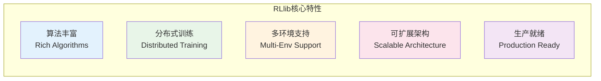
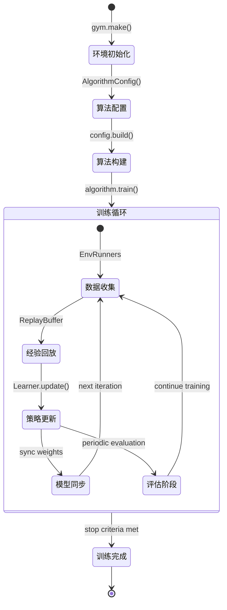
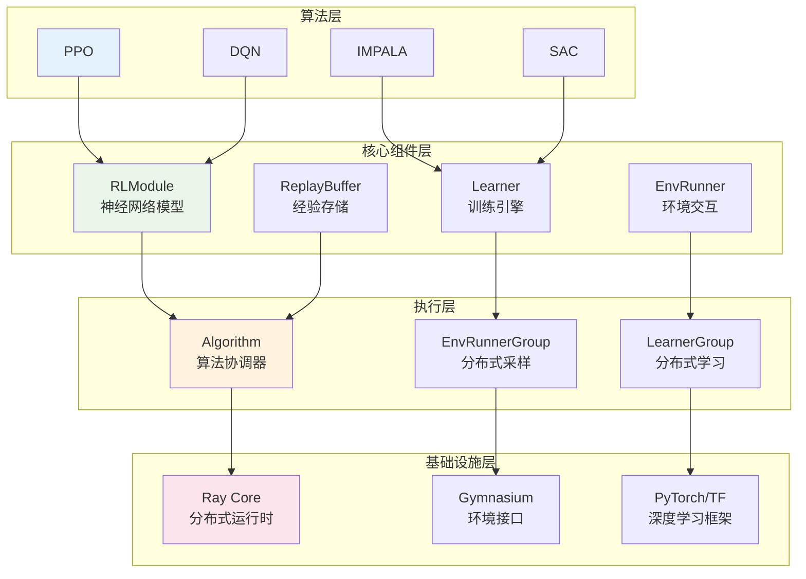
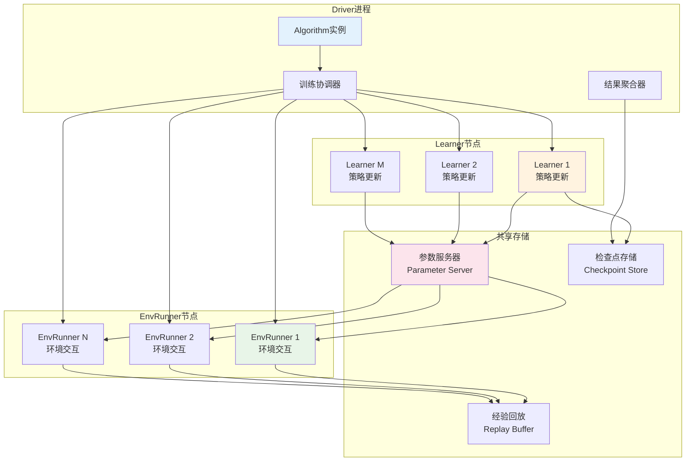

# RLlib 强化学习库深度剖析

## 目录
- [1. RLlib概述](#1-rllib概述)
- [2. 核心架构设计](#2-核心架构设计)
- [3. 算法体系详解](#3-算法体系详解)
- [4. 分布式训练架构](#4-分布式训练架构)
- [5. 环境交互系统](#5-环境交互系统)
- [6. 使用示例与最佳实践](#6-使用示例与最佳实践)

---

## 1. RLlib概述

RLlib是Ray生态系统中的分布式强化学习库，提供可扩展、高性能的强化学习算法实现。它支持多种算法、环境和分布式训练模式，是工业级强化学习应用的首选框架。

### 1.1 核心特性



### 1.2 强化学习训练流程



---

## 2. 核心架构设计

### 2.1 RLlib整体架构



### 2.2 RLModule核心实现

```python
# 位置: rllib/core/rl_module/rl_module.py:256-402
@PublicAPI(stability="beta")
class RLModule(Checkpointable, abc.ABC):
    """
    RLlib模型的基础类
    
    核心职责：
    1. 定义神经网络模型结构
    2. 实现前向传播逻辑
    3. 管理模型状态和检查点
    4. 支持多智能体场景
    
    前向传播模式：
    - forward_inference: 推理模式（确定性策略）
    - forward_exploration: 探索模式（随机策略）
    - forward_train: 训练模式（计算损失）
    """
    
    def __init__(
        self,
        observation_space: gym.spaces.Space,
        action_space: gym.spaces.Space,
        inference_only: bool = False,
        learner_only: bool = False,
        model_config: Optional[Dict] = None,
        **kwargs
    ):
        """
        初始化RLModule
        
        参数说明：
            observation_space: 观测空间定义
            action_space: 动作空间定义
            inference_only: 是否仅用于推理
            learner_only: 是否仅用于学习（不在EnvRunner上构建）
            model_config: 模型配置字典
        """
        self.observation_space = observation_space
        self.action_space = action_space
        self.inference_only = inference_only
        self.learner_only = learner_only
        self.model_config = model_config or {}
        
        # 动作分布类（用于采样动作）
        self.action_dist_cls = None
        
        # 模型组件初始化标志
        self._is_setup = False
    
    @abc.abstractmethod
    def _forward_inference(self, batch: Dict[str, TensorType]) -> Dict[str, TensorType]:
        """
        推理前向传播（抽象方法）
        
        用途：在环境中执行策略，生成确定性动作
        
        参数：
            batch: 包含观测数据的字典
                - "obs": 观测数据张量
                
        返回：
            包含动作分布参数的字典
                - "action_dist_inputs": 动作分布的输入参数
        """
        pass
    
    @abc.abstractmethod
    def _forward_exploration(self, batch: Dict[str, TensorType]) -> Dict[str, TensorType]:
        """
        探索前向传播（抽象方法）
        
        用途：在训练期间进行探索，生成随机策略动作
        
        与forward_inference的区别：
        - 可能包含噪声或随机性
        - 用于数据收集阶段
        - 可能使用不同的网络分支
        """
        pass
    
    @abc.abstractmethod
    def _forward_train(self, batch: Dict[str, TensorType]) -> Dict[str, TensorType]:
        """
        训练前向传播（抽象方法）
        
        用途：计算损失函数所需的输出
        
        参数：
            batch: 训练批次数据
                - "obs": 观测数据
                - "actions": 历史动作（用于计算动作概率）
                - "rewards": 奖励信号
                - "next_obs": 下一状态观测
                
        返回：
            训练所需的输出
                - "action_dist_inputs": 动作分布参数
                - "vf_preds": 价值函数预测（Actor-Critic算法）
        """
        pass
    
    def get_inference_action_dist_cls(self):
        """获取推理时使用的动作分布类"""
        return self.action_dist_cls
    
    def get_exploration_action_dist_cls(self):
        """获取探索时使用的动作分布类"""
        return self.action_dist_cls
    
    def get_train_action_dist_cls(self):
        """获取训练时使用的动作分布类"""
        return self.action_dist_cls

# PPO算法的RLModule实现示例
class PPOTorchRLModule(RLModule):
    """
    PPO算法的PyTorch实现
    
    模型结构：
    - 共享编码器网络
    - 策略头（输出动作分布参数）
    - 价值头（输出状态价值估计）
    """
    
    def __init__(self, **kwargs):
        super().__init__(**kwargs)
        
        # 构建网络结构
        self._build_networks()
    
    def _build_networks(self):
        """构建PPO网络结构"""
        import torch.nn as nn
        
        # 共享编码器
        obs_dim = self.observation_space.shape[0]
        hidden_sizes = self.model_config.get("fcnet_hiddens", [256, 256])
        
        encoder_layers = []
        prev_size = obs_dim
        
        for hidden_size in hidden_sizes:
            encoder_layers.extend([
                nn.Linear(prev_size, hidden_size),
                nn.ReLU(),
            ])
            prev_size = hidden_size
        
        self.encoder = nn.Sequential(*encoder_layers)
        
        # 策略头
        if isinstance(self.action_space, gym.spaces.Discrete):
            # 离散动作空间
            self.policy_head = nn.Linear(prev_size, self.action_space.n)
            from ray.rllib.models.torch.torch_action_dist import TorchCategorical
            self.action_dist_cls = TorchCategorical
        else:
            # 连续动作空间
            action_dim = self.action_space.shape[0]
            self.policy_mean = nn.Linear(prev_size, action_dim)
            self.policy_logstd = nn.Parameter(torch.zeros(action_dim))
            from ray.rllib.models.torch.torch_action_dist import TorchDiagGaussian
            self.action_dist_cls = TorchDiagGaussian
        
        # 价值头
        self.value_head = nn.Linear(prev_size, 1)
    
    def _forward_inference(self, batch):
        """PPO推理前向传播"""
        obs = batch["obs"]
        
        # 编码器前向传播
        encoded = self.encoder(obs)
        
        # 策略输出
        if isinstance(self.action_space, gym.spaces.Discrete):
            action_logits = self.policy_head(encoded)
            return {"action_dist_inputs": action_logits}
        else:
            action_mean = self.policy_mean(encoded)
            action_logstd = self.policy_logstd.expand_as(action_mean)
            return {"action_dist_inputs": torch.cat([action_mean, action_logstd], dim=-1)}
    
    def _forward_exploration(self, batch):
        """PPO探索前向传播（与推理相同）"""
        return self._forward_inference(batch)
    
    def _forward_train(self, batch):
        """PPO训练前向传播"""
        obs = batch["obs"]
        
        # 编码器前向传播
        encoded = self.encoder(obs)
        
        # 策略输出
        action_dist_inputs = self._compute_action_dist_inputs(encoded)
        
        # 价值函数输出
        value_predictions = self.value_head(encoded).squeeze(-1)
        
        return {
            "action_dist_inputs": action_dist_inputs,
            "vf_preds": value_predictions,
        }
    
    def _compute_action_dist_inputs(self, encoded):
        """计算动作分布输入"""
        if isinstance(self.action_space, gym.spaces.Discrete):
            return self.policy_head(encoded)
        else:
            action_mean = self.policy_mean(encoded)
            action_logstd = self.policy_logstd.expand_as(action_mean)
            return torch.cat([action_mean, action_logstd], dim=-1)
```

---

## 3. 算法体系详解

### 3.1 Algorithm基类实现

```python
# 位置: rllib/algorithms/algorithm.py:207-241
@PublicAPI
class Algorithm(Checkpointable, Trainable):
    """
    RLlib算法的基础类
    
    核心功能：
    1. 算法生命周期管理
    2. 训练循环协调
    3. 评估和检查点管理
    4. 分布式训练支持
    
    重要属性：
        config: AlgorithmConfig实例
        env_runner_group: 环境交互的运行组
        eval_env_runner_group: 评估专用运行组
        learner_group: 学习者组（用于分布式学习）
    """
    
    def __init__(self, config: AlgorithmConfig, env: Optional[EnvType] = None, **kwargs):
        """
        初始化算法实例
        
        初始化流程：
        1. 验证和设置配置
        2. 创建环境交互组件
        3. 构建模型和学习器
        4. 设置分布式训练
        """
        super().__init__()
        
        self.config = config
        self._env_id = config.env
        
        # 创建度量记录器
        self.metrics = MetricsLogger()
        
        # 初始化训练组件
        self._setup_training_components(env)
        
        # 设置评估
        if config.evaluation_interval > 0:
            self._setup_evaluation_components()
    
    def _setup_training_components(self, env):
        """设置训练组件"""
        
        # 1. 创建环境运行组
        self.env_runner_group = EnvRunnerGroup(
            env_creator=lambda: env or gym.make(self._env_id),
            default_policy_class=self.get_default_policy_class(),
            config=self.config,
            num_workers=self.config.num_env_runners,
            local_worker=True,
        )
        
        # 2. 创建学习器组
        if self.config.enable_rl_module_and_learner:
            self.learner_group = LearnerGroup(
                config=self.config,
                module_spec=self._get_rl_module_spec(),
                num_learners=self.config.num_learners,
            )
        
        # 3. 创建经验回放缓冲区（如果需要）
        if self.config.replay_buffer_config:
            self.replay_buffer = ReplayBuffer(
                capacity=self.config.replay_buffer_config["capacity"],
                storage_unit=self.config.replay_buffer_config.get("storage_unit", "timesteps")
            )
    
    def train(self) -> ResultDict:
        """
        执行一次训练迭代
        
        标准训练流程：
        1. 数据收集（环境交互）
        2. 策略更新（梯度计算和应用）
        3. 模型同步（分布式场景）
        4. 指标收集和报告
        """
        with self.metrics.timer("train_time_ms"):
            # 1. 执行算法特定的训练步骤
            train_results = self.training_step()
            
            # 2. 更新全局步数
            self._iteration += 1
            
            # 3. 同步模型权重（如果使用分布式）
            if self.config.enable_rl_module_and_learner:
                self._sync_weights_to_env_runners()
            
            # 4. 执行定期评估
            if (self.config.evaluation_interval > 0 and 
                self._iteration % self.config.evaluation_interval == 0):
                eval_results = self.evaluate()
                train_results.update(eval_results)
            
            # 5. 保存检查点（如果需要）
            if (self.config.checkpoint_frequency > 0 and
                self._iteration % self.config.checkpoint_frequency == 0):
                self.save_checkpoint()
            
            return train_results
    
    @abc.abstractmethod
    def training_step(self) -> ResultDict:
        """
        算法特定的训练步骤（抽象方法）
        
        子类必须实现此方法，定义：
        1. 如何收集训练数据
        2. 如何更新策略参数
        3. 如何计算和报告指标
        """
        pass
    
    def evaluate(self) -> ResultDict:
        """
        执行策略评估
        
        评估流程：
        1. 使用当前策略在评估环境中运行
        2. 收集性能指标
        3. 计算平均奖励、成功率等
        """
        if not hasattr(self, 'eval_env_runner_group'):
            return {}
        
        # 同步最新权重到评估运行器
        self._sync_weights_to_eval_env_runners()
        
        # 执行评估回合
        eval_results = self.eval_env_runner_group.sample()
        
        # 处理评估指标
        eval_metrics = {
            "evaluation": {
                "episode_reward_mean": np.mean([ep.get_return() for ep in eval_results]),
                "episode_len_mean": np.mean([ep.length for ep in eval_results]),
                "episodes_this_iter": len(eval_results),
            }
        }
        
        return eval_metrics

# PPO算法的具体实现示例
class PPO(Algorithm):
    """
    PPO算法实现
    
    PPO特点：
    1. On-policy策略梯度算法
    2. 使用clipped surrogate objective
    3. Actor-Critic架构
    4. 适合并行数据收集
    """
    
    def training_step(self) -> ResultDict:
        """
        PPO训练步骤实现
        
        PPO训练流程：
        1. 使用当前策略收集轨迹数据
        2. 计算GAE优势估计
        3. 多次更新策略和价值网络
        4. 应用PPO损失函数（clipped objective）
        """
        train_results = {}
        
        # 1. 数据收集阶段
        with self.metrics.timer("sample_time_ms"):
            # 从所有EnvRunner收集数据
            sample_batches = self.env_runner_group.sample()
            
            # 合并批次数据
            combined_batch = SampleBatch.concat_samples(sample_batches)
            
            # 计算GAE优势
            combined_batch = compute_gae_for_sample_batch(
                batch=combined_batch,
                last_r=0.0,
                gamma=self.config.gamma,
                lambda_=self.config.lambda_,
                use_gae=self.config.use_gae,
            )
        
        # 2. 策略更新阶段
        with self.metrics.timer("learn_time_ms"):
            if self.config.enable_rl_module_and_learner:
                # 使用新的Learner API
                learn_results = self.learner_group.update_from_batch(
                    batch=combined_batch,
                    minibatch_size=self.config.train_batch_size,
                    num_iters=self.config.num_sgd_iter,
                )
                train_results.update(learn_results)
            else:
                # 使用传统Policy API
                for _ in range(self.config.num_sgd_iter):
                    # 随机打乱数据
                    shuffled_batch = combined_batch.shuffle()
                    
                    # 分批更新
                    for minibatch in shuffled_batch.timeslices(self.config.train_batch_size):
                        policy_loss, value_loss, entropy = self._update_policy(minibatch)
                        
                        train_results.update({
                            "policy_loss": policy_loss,
                            "value_loss": value_loss,
                            "entropy": entropy,
                        })
        
        # 3. 收集训练指标
        train_results.update({
            "episodes_this_iter": len(sample_batches),
            "num_env_steps_sampled": combined_batch.count(),
            "num_env_steps_trained": combined_batch.count(),
            "learner": self.learner_group.get_stats() if hasattr(self, 'learner_group') else {},
        })
        
        return train_results
    
    def _update_policy(self, batch: SampleBatch) -> Tuple[float, float, float]:
        """
        单次策略更新
        
        PPO损失函数：
        1. Clipped surrogate objective
        2. 价值函数损失
        3. 熵正则化项
        """
        # 计算策略比率
        curr_action_logp = self.get_policy().compute_log_likelihoods(
            actions=batch["actions"],
            obs_batch=batch["obs"]
        )
        old_action_logp = batch["action_logp"]
        ratio = torch.exp(curr_action_logp - old_action_logp)
        
        # PPO clipped objective
        advantages = batch["advantages"]
        unclipped_loss = ratio * advantages
        clipped_loss = torch.clamp(
            ratio, 
            1 - self.config.clip_param, 
            1 + self.config.clip_param
        ) * advantages
        
        policy_loss = -torch.mean(torch.min(unclipped_loss, clipped_loss))
        
        # 价值函数损失
        value_predictions = self.get_policy().model.value_function()
        value_targets = batch["value_targets"]
        value_loss = torch.mean((value_predictions - value_targets) ** 2)
        
        # 熵损失
        action_dist = self.get_policy().dist_class(curr_action_logp)
        entropy = torch.mean(action_dist.entropy())
        
        # 总损失
        total_loss = (
            policy_loss + 
            self.config.vf_loss_coeff * value_loss - 
            self.config.entropy_coeff * entropy
        )
        
        # 反向传播和参数更新
        self.get_policy().optimizer.zero_grad()
        total_loss.backward()
        
        # 梯度裁剪
        if self.config.grad_clip:
            torch.nn.utils.clip_grad_norm_(
                self.get_policy().model.parameters(),
                self.config.grad_clip
            )
        
        self.get_policy().optimizer.step()
        
        return policy_loss.item(), value_loss.item(), entropy.item()
```

---

## 4. 分布式训练架构

### 4.1 分布式组件交互



### 4.2 EnvRunner实现

```python
"""
EnvRunner - 环境交互组件

负责与环境交互，收集训练数据
"""

class EnvRunner:
    """
    环境运行器 - 负责策略与环境的交互
    
    核心功能：
    1. 环境管理和重置
    2. 策略执行和动作采样
    3. 经验数据收集
    4. 轨迹处理和格式化
    
    支持的模式：
    - 单环境模式
    - 向量化环境模式
    - 异步环境模式
    """
    
    def __init__(
        self,
        env_creator: Callable,
        policy_config: Dict,
        rollout_fragment_length: int,
        batch_mode: str = "truncate_episodes",
    ):
        """
        初始化环境运行器
        
        参数：
            env_creator: 环境创建函数
            policy_config: 策略配置
            rollout_fragment_length: 单次rollout的长度
            batch_mode: 批次模式（truncate_episodes/complete_episodes）
        """
        # 创建环境
        self.env = env_creator()
        
        # 初始化策略
        self.policy = self._create_policy(policy_config)
        
        # 配置参数
        self.rollout_fragment_length = rollout_fragment_length
        self.batch_mode = batch_mode
        
        # 状态管理
        self._episode_id = 0
        self._agent_id = 0
        self._current_obs = None
        self._episode_reward = 0
        self._episode_length = 0
    
    def sample(self) -> SampleBatch:
        """
        采样一个训练批次
        
        采样流程：
        1. 环境重置（如果需要）
        2. 策略执行和动作采样
        3. 环境步进和奖励收集
        4. 经验存储和批次构建
        """
        batch_builder = SampleBatchBuilder()
        
        steps_collected = 0
        
        while steps_collected < self.rollout_fragment_length:
            # 环境重置（如果episode结束）
            if self._current_obs is None:
                self._current_obs = self.env.reset()
                self._episode_reward = 0
                self._episode_length = 0
                self._episode_id += 1
            
            # 策略决策
            action, action_logp, state_out = self.policy.compute_action(
                obs=self._current_obs,
                state=self.policy.get_initial_state(),
                explore=True  # 训练时启用探索
            )
            
            # 环境步进
            next_obs, reward, terminated, truncated, info = self.env.step(action)
            done = terminated or truncated
            
            # 存储经验
            batch_builder.add_values(
                obs=self._current_obs,
                actions=action,
                rewards=reward,
                dones=done,
                action_logp=action_logp,
                next_obs=next_obs,
                infos=info,
            )
            
            # 更新状态
            self._current_obs = next_obs if not done else None
            self._episode_reward += reward
            self._episode_length += 1
            steps_collected += 1
            
            # Episode结束处理
            if done:
                self._log_episode_end()
        
        # 构建并返回SampleBatch
        return batch_builder.build_and_reset()
    
    def _create_policy(self, config: Dict):
        """创建策略实例"""
        policy_class = config["policy_class"]
        return policy_class(
            observation_space=self.env.observation_space,
            action_space=self.env.action_space,
            config=config
        )
    
    def _log_episode_end(self):
        """记录episode结束信息"""
        self.metrics.log_value(
            "episode_reward", self._episode_reward
        )
        self.metrics.log_value(
            "episode_length", self._episode_length
        )

class EnvRunnerGroup:
    """
    环境运行器组 - 管理多个EnvRunner的协调器
    
    功能：
    1. 分布式环境交互
    2. 并行数据收集
    3. 故障恢复和弹性扩展
    4. 负载均衡
    """
    
    def __init__(
        self,
        env_creator: Callable,
        policy_class: Type,
        config: AlgorithmConfig,
        num_workers: int = 0,
        local_worker: bool = True,
    ):
        """
        初始化运行器组
        
        参数：
            env_creator: 环境创建函数
            policy_class: 策略类
            config: 算法配置
            num_workers: 远程worker数量
            local_worker: 是否包含本地worker
        """
        self.config = config
        self.num_workers = num_workers
        
        # 创建本地worker
        self.local_worker = None
        if local_worker:
            self.local_worker = EnvRunner(
                env_creator=env_creator,
                policy_config=config.to_dict(),
                rollout_fragment_length=config.rollout_fragment_length,
            )
        
        # 创建远程workers
        self.remote_workers = []
        if num_workers > 0:
            RemoteEnvRunner = ray.remote(EnvRunner)
            
            for i in range(num_workers):
                worker = RemoteEnvRunner.remote(
                    env_creator=env_creator,
                    policy_config=config.to_dict(),
                    rollout_fragment_length=config.rollout_fragment_length,
                )
                self.remote_workers.append(worker)
    
    def sample(self) -> List[SampleBatch]:
        """
        并行采样训练数据
        
        并行策略：
        1. 所有worker同时采样
        2. 异步收集结果
        3. 处理worker故障
        """
        # 启动远程采样
        remote_futures = []
        for worker in self.remote_workers:
            future = worker.sample.remote()
            remote_futures.append(future)
        
        # 本地采样
        local_batch = None
        if self.local_worker:
            local_batch = self.local_worker.sample()
        
        # 收集远程结果
        remote_batches = ray.get(remote_futures)
        
        # 合并所有批次
        all_batches = []
        if local_batch:
            all_batches.append(local_batch)
        all_batches.extend(remote_batches)
        
        return all_batches
    
    def sync_weights(self, weights: Dict):
        """同步模型权重到所有worker"""
        # 同步到本地worker
        if self.local_worker:
            self.local_worker.set_weights(weights)
        
        # 同步到远程workers
        if self.remote_workers:
            ray.get([
                worker.set_weights.remote(weights) 
                for worker in self.remote_workers
            ])
```

---

## 5. 环境交互系统

### 5.1 多环境支持架构

```python
"""
RLlib多环境支持系统

支持的环境类型：
1. Gymnasium环境
2. Unity ML-Agents
3. 自定义环境
4. 多智能体环境
5. 向量化环境
"""

import gymnasium as gym
from ray.rllib.env.base_env import BaseEnv
from ray.rllib.env.multi_agent_env import MultiAgentEnv

# 1. 自定义环境示例
class CustomTradingEnv(gym.Env):
    """
    自定义交易环境示例
    
    功能：
    - 模拟股票交易环境
    - 支持连续动作空间
    - 提供复杂奖励函数
    """
    
    def __init__(self, config: Dict):
        """
        初始化交易环境
        
        参数：
            config: 环境配置字典
        """
        super().__init__()
        
        # 配置参数
        self.initial_balance = config.get("initial_balance", 10000)
        self.transaction_cost = config.get("transaction_cost", 0.001)
        self.max_steps = config.get("max_steps", 1000)
        
        # 动作空间：[-1, 1]表示卖出到买入的比例
        self.action_space = gym.spaces.Box(
            low=-1, high=1, shape=(1,), dtype=np.float32
        )
        
        # 观测空间：价格历史、技术指标、持仓信息
        self.observation_space = gym.spaces.Box(
            low=-np.inf, high=np.inf, shape=(50,), dtype=np.float32
        )
        
        # 环境状态
        self.current_step = 0
        self.balance = self.initial_balance
        self.position = 0  # 当前持仓
        self.price_history = []
        
        # 加载历史价格数据
        self.price_data = self._load_price_data()
    
    def reset(self, seed=None, options=None):
        """重置环境到初始状态"""
        super().reset(seed=seed)
        
        self.current_step = 0
        self.balance = self.initial_balance
        self.position = 0
        self.price_history = []
        
        # 随机选择起始位置
        self.start_idx = np.random.randint(50, len(self.price_data) - self.max_steps)
        
        return self._get_observation(), {}
    
    def step(self, action):
        """执行动作，返回下一状态"""
        action = action[0]  # 提取标量动作
        
        # 获取当前价格
        current_price = self.price_data[self.start_idx + self.current_step]
        
        # 执行交易
        if action > 0:
            # 买入操作
            buy_amount = min(action * self.balance / current_price, 
                           self.balance / current_price)
            cost = buy_amount * current_price * (1 + self.transaction_cost)
            
            if cost <= self.balance:
                self.balance -= cost
                self.position += buy_amount
        
        elif action < 0:
            # 卖出操作
            sell_amount = min(-action * self.position, self.position)
            revenue = sell_amount * current_price * (1 - self.transaction_cost)
            
            self.balance += revenue
            self.position -= sell_amount
        
        # 更新状态
        self.current_step += 1
        self.price_history.append(current_price)
        
        # 计算奖励
        portfolio_value = self.balance + self.position * current_price
        reward = self._calculate_reward(portfolio_value, action)
        
        # 检查终止条件
        terminated = (
            self.current_step >= self.max_steps or
            portfolio_value <= 0
        )
        
        return self._get_observation(), reward, terminated, False, {}
    
    def _get_observation(self):
        """构建观测向量"""
        # 价格特征
        recent_prices = self.price_history[-20:] if len(self.price_history) >= 20 else \
                       [self.price_data[self.start_idx]] * 20
        
        # 技术指标
        sma_5 = np.mean(recent_prices[-5:])
        sma_20 = np.mean(recent_prices)
        rsi = self._calculate_rsi(recent_prices)
        
        # 账户状态
        current_price = self.price_data[self.start_idx + self.current_step] \
                       if self.current_step < len(self.price_data) - self.start_idx else 0
        portfolio_value = self.balance + self.position * current_price
        
        # 构建观测向量
        obs = np.array([
            # 归一化的价格历史（20维）
            *(np.array(recent_prices) / recent_prices[-1] - 1),
            # 技术指标（3维）
            sma_5 / current_price - 1,
            sma_20 / current_price - 1,
            rsi / 100 - 0.5,
            # 账户状态（7维）
            self.balance / self.initial_balance - 1,
            self.position * current_price / self.initial_balance,
            portfolio_value / self.initial_balance - 1,
            self.current_step / self.max_steps,
            # 填充到50维
            *np.zeros(20),
        ], dtype=np.float32)
        
        return obs[:50]  # 确保维度正确

# 2. 多智能体环境
class MultiAgentTradingEnv(MultiAgentEnv):
    """
    多智能体交易环境
    
    场景：多个智能体在同一市场中竞争交易
    """
    
    def __init__(self, config: Dict):
        super().__init__()
        
        self.num_agents = config.get("num_agents", 3)
        self.market_impact = config.get("market_impact", True)
        
        # 每个智能体的独立环境
        self.agents = {f"agent_{i}": CustomTradingEnv(config) for i in range(self.num_agents)}
        
        # 共享市场状态
        self.market_state = MarketState()
    
    def reset(self, *, seed=None, options=None):
        """重置所有智能体"""
        observations = {}
        
        for agent_id, agent_env in self.agents.items():
            obs, info = agent_env.reset(seed=seed)
            observations[agent_id] = obs
        
        return observations, {}
    
    def step(self, action_dict):
        """执行多智能体动作"""
        observations = {}
        rewards = {}
        terminateds = {}
        truncateds = {}
        infos = {}
        
        # 市场影响建模
        total_market_action = sum(action_dict.values())
        market_pressure = self._calculate_market_pressure(total_market_action)
        
        # 各智能体并行执行
        for agent_id, action in action_dict.items():
            # 考虑市场影响的修正动作
            adjusted_action = self._adjust_action_for_market_impact(action, market_pressure)
            
            obs, reward, terminated, truncated, info = self.agents[agent_id].step([adjusted_action])
            
            observations[agent_id] = obs
            rewards[agent_id] = reward
            terminateds[agent_id] = terminated
            truncateds[agent_id] = truncated
            infos[agent_id] = info
        
        # 检查全局终止条件
        terminateds["__all__"] = all(terminateds.values())
        truncateds["__all__"] = all(truncateds.values())
        
        return observations, rewards, terminateds, truncateds, infos
    
    def _calculate_market_pressure(self, total_action):
        """计算市场压力"""
        return np.tanh(total_action * 0.1)  # 简化的市场影响模型
    
    def _adjust_action_for_market_impact(self, action, market_pressure):
        """根据市场影响调整动作"""
        if market_pressure > 0:  # 买方压力
            return action * (1 - 0.1 * market_pressure)  # 买入成本增加
        else:  # 卖方压力
            return action * (1 + 0.1 * abs(market_pressure))  # 卖出收益减少
```

---

## 6. 使用示例与最佳实践

### 6.1 PPO算法完整训练示例

```python
"""
使用RLlib训练PPO算法的完整示例
"""

import ray
from ray import tune
from ray.rllib.algorithms.ppo import PPOConfig
from ray.rllib.env.wrappers.atari_wrappers import wrap_atari_for_new_api_stack

# 1. 环境配置和包装
def create_atari_env(config):
    """创建Atari游戏环境"""
    import gymnasium as gym
    
    env = gym.make("ALE/Breakout-v5")
    # 应用Atari特定的预处理
    env = wrap_atari_for_new_api_stack(env, framestack=4)
    
    return env

# 2. 算法配置
def configure_ppo_algorithm():
    """配置PPO算法"""
    
    config = (
        PPOConfig()
        .environment(
            env="ALE/Breakout-v5",
            clip_rewards=True,  # Atari奖励裁剪
        )
        .framework("torch")
        .training(
            # PPO特定参数
            lr=0.0001,
            num_sgd_iter=10,       # SGD迭代次数
            sgd_minibatch_size=500, # 小批次大小
            train_batch_size=5000,  # 训练批次大小
            clip_param=0.2,         # PPO裁剪参数
            entropy_coeff=0.01,     # 熵系数
            vf_loss_coeff=0.5,      # 价值函数损失系数
            gamma=0.99,             # 折扣因子
            lambda_=0.95,           # GAE参数
            use_gae=True,           # 使用GAE
            
            # 模型架构
            model={
                "conv_filters": [
                    [32, [8, 8], 4],
                    [64, [4, 4], 2], 
                    [64, [3, 3], 1],
                ],
                "fcnet_hiddens": [512],
                "fcnet_activation": "relu",
            }
        )
        .resources(
            num_gpus=1,                    # 学习器GPU
            num_cpus_per_worker=1,         # 每个worker的CPU
            num_gpus_per_worker=0,         # 每个worker的GPU
        )
        .env_runners(
            num_env_runners=8,             # 环境运行器数量
            num_envs_per_env_runner=1,     # 每个运行器的环境数
            rollout_fragment_length=200,   # rollout长度
        )
        .learners(
            num_learners=1,                # 学习器数量
            num_cpus_per_learner=4,        # 每个学习器的CPU
            num_gpus_per_learner=1,        # 每个学习器的GPU
        )
        .evaluation(
            evaluation_interval=20,        # 评估间隔
            evaluation_duration=10,        # 评估episode数
            evaluation_parallel_to_training=True,  # 并行评估
        )
        .reporting(
            min_sample_timesteps_per_iteration=5000,  # 最小采样步数
        )
    )
    
    return config

# 3. 分布式训练
def run_distributed_ppo():
    """运行分布式PPO训练"""
    
    # 初始化Ray
    ray.init(address="ray://head-node:10001")  # 连接到Ray集群
    
    # 配置算法
    config = configure_ppo_algorithm()
    
    # 构建算法实例
    algorithm = config.build()
    
    try:
        # 训练循环
        for iteration in range(1000):
            # 执行训练步骤
            train_results = algorithm.train()
            
            # 打印训练进度
            if iteration % 10 == 0:
                print(f"Iteration {iteration}:")
                print(f"  Episode reward mean: {train_results['env_runners']['episode_reward_mean']:.2f}")
                print(f"  Policy loss: {train_results.get('learner', {}).get('policy_loss', 0):.4f}")
                print(f"  Value loss: {train_results.get('learner', {}).get('vf_loss', 0):.4f}")
            
            # 保存检查点
            if iteration % 100 == 0:
                checkpoint_path = algorithm.save_to_path(f"./checkpoints/ppo_iteration_{iteration}")
                print(f"Checkpoint saved: {checkpoint_path}")
            
            # 检查停止条件
            if train_results['env_runners']['episode_reward_mean'] > 400:
                print("Training completed - target reward reached!")
                break
    
    finally:
        algorithm.stop()
        ray.shutdown()

# 4. 超参数调优集成
def hyperparameter_tuning_with_tune():
    """使用Ray Tune进行RLlib超参数调优"""
    
    def train_function(config):
        """训练函数，接收超参数配置"""
        # 基础PPO配置
        ppo_config = (
            PPOConfig()
            .environment("CartPole-v1")
            .framework("torch")
            .training(
                lr=config["lr"],
                num_sgd_iter=config["num_sgd_iter"],
                sgd_minibatch_size=config["sgd_minibatch_size"],
                clip_param=config["clip_param"],
                entropy_coeff=config["entropy_coeff"],
                vf_loss_coeff=config["vf_loss_coeff"],
            )
            .env_runners(
                num_env_runners=4,
                rollout_fragment_length=config["rollout_fragment_length"],
            )
        )
        
        # 构建算法
        algorithm = ppo_config.build()
        
        try:
            # 训练循环
            for i in range(100):
                result = algorithm.train()
                
                # 报告给Ray Tune
                tune.report(
                    episode_reward_mean=result['env_runners']['episode_reward_mean'],
                    policy_loss=result.get('learner', {}).get('policy_loss', 0),
                    training_iteration=i,
                )
        
        finally:
            algorithm.stop()
    
    # 定义超参数搜索空间
    search_space = {
        "lr": tune.loguniform(1e-5, 1e-3),
        "num_sgd_iter": tune.choice([5, 10, 20]),
        "sgd_minibatch_size": tune.choice([128, 256, 512]),
        "clip_param": tune.uniform(0.1, 0.3),
        "entropy_coeff": tune.loguniform(1e-5, 1e-2),
        "vf_loss_coeff": tune.uniform(0.1, 1.0),
        "rollout_fragment_length": tune.choice([200, 400, 800]),
    }
    
    # 运行超参数优化
    tuner = tune.Tuner(
        train_function,
        param_space=search_space,
        tune_config=tune.TuneConfig(
            metric="episode_reward_mean",
            mode="max",
            num_samples=50,
        ),
        run_config=tune.RunConfig(
            name="ppo_hyperparameter_tuning",
            stop={"training_iteration": 100},
        )
    )
    
    results = tuner.fit()
    best_result = results.get_best_result()
    
    print(f"Best configuration: {best_result.config}")
    print(f"Best reward: {best_result.metrics['episode_reward_mean']}")
    
    return best_result

# 5. 自定义算法实现
class CustomPPOAlgorithm(PPO):
    """
    自定义PPO算法实现
    
    扩展功能：
    - 自定义损失函数
    - 特殊的奖励处理
    - 额外的正则化项
    """
    
    def training_step(self) -> ResultDict:
        """覆盖训练步骤，添加自定义逻辑"""
        
        # 1. 执行标准PPO训练步骤
        train_results = super().training_step()
        
        # 2. 添加自定义指标计算
        custom_metrics = self._compute_custom_metrics()
        train_results.update(custom_metrics)
        
        # 3. 执行自定义的后处理
        self._custom_post_processing(train_results)
        
        return train_results
    
    def _compute_custom_metrics(self) -> Dict:
        """计算自定义指标"""
        # 获取最新的策略参数
        policy_weights = self.get_policy().get_weights()
        
        # 计算参数统计
        param_stats = {}
        for name, param in policy_weights.items():
            if isinstance(param, np.ndarray):
                param_stats[f"{name}_mean"] = np.mean(param)
                param_stats[f"{name}_std"] = np.std(param)
                param_stats[f"{name}_max"] = np.max(param)
                param_stats[f"{name}_min"] = np.min(param)
        
        return {"custom_metrics": param_stats}
    
    def _custom_post_processing(self, train_results: Dict):
        """自定义后处理逻辑"""
        # 例如：动态调整学习率
        current_performance = train_results.get('env_runners', {}).get('episode_reward_mean', 0)
        
        if hasattr(self, '_last_performance'):
            improvement = current_performance - self._last_performance
            
            if improvement < 0.1:  # 性能改善缓慢
                # 降低学习率
                current_lr = self.config.lr
                new_lr = current_lr * 0.95
                self.config.lr = max(1e-6, new_lr)
                
                print(f"Performance plateau detected, reducing LR to {new_lr}")
        
        self._last_performance = current_performance

# 使用示例
def main():
    """主函数"""
    
    ray.init()
    
    try:
        # 1. 基础PPO训练
        print("Starting basic PPO training...")
        run_distributed_ppo()
        
        # 2. 超参数调优
        print("Starting hyperparameter tuning...")
        best_config = hyperparameter_tuning_with_tune()
        
        # 3. 使用最佳配置进行最终训练
        print("Training with best configuration...")
        final_config = configure_ppo_algorithm()
        final_config.update_from_dict(best_config.config)
        
        final_algorithm = final_config.build()
        
        # 训练更多轮次
        for i in range(500):
            result = final_algorithm.train()
            
            if i % 50 == 0:
                print(f"Final training iteration {i}: "
                      f"reward = {result['env_runners']['episode_reward_mean']:.2f}")
        
        # 保存最终模型
        final_checkpoint = final_algorithm.save_to_path("./final_model")
        print(f"Final model saved: {final_checkpoint}")
        
    finally:
        ray.shutdown()

if __name__ == "__main__":
    main()
```

---

## 总结

RLlib作为Ray生态系统中的强化学习引擎，提供了完整的分布式强化学习解决方案：

### 核心架构优势
1. **模块化设计** - RLModule、Learner、EnvRunner的清晰分离
2. **分布式优先** - 原生支持大规模分布式训练
3. **算法丰富** - 涵盖主流强化学习算法
4. **高度可扩展** - 易于添加新算法和自定义组件

### 关键特性
- **多环境支持**: Gymnasium、Unity、自定义环境
- **分布式训练**: 并行环境交互和策略更新
- **容错机制**: 自动故障恢复和重启
- **超参数优化**: 与Ray Tune的无缝集成
- **生产部署**: 检查点管理和模型服务支持

RLlib为强化学习从研究到生产部署提供了完整的工具链，显著降低了分布式强化学习的实现复杂度。
