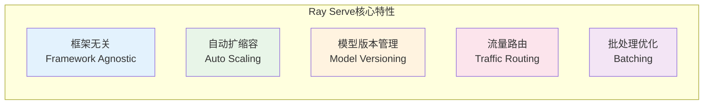
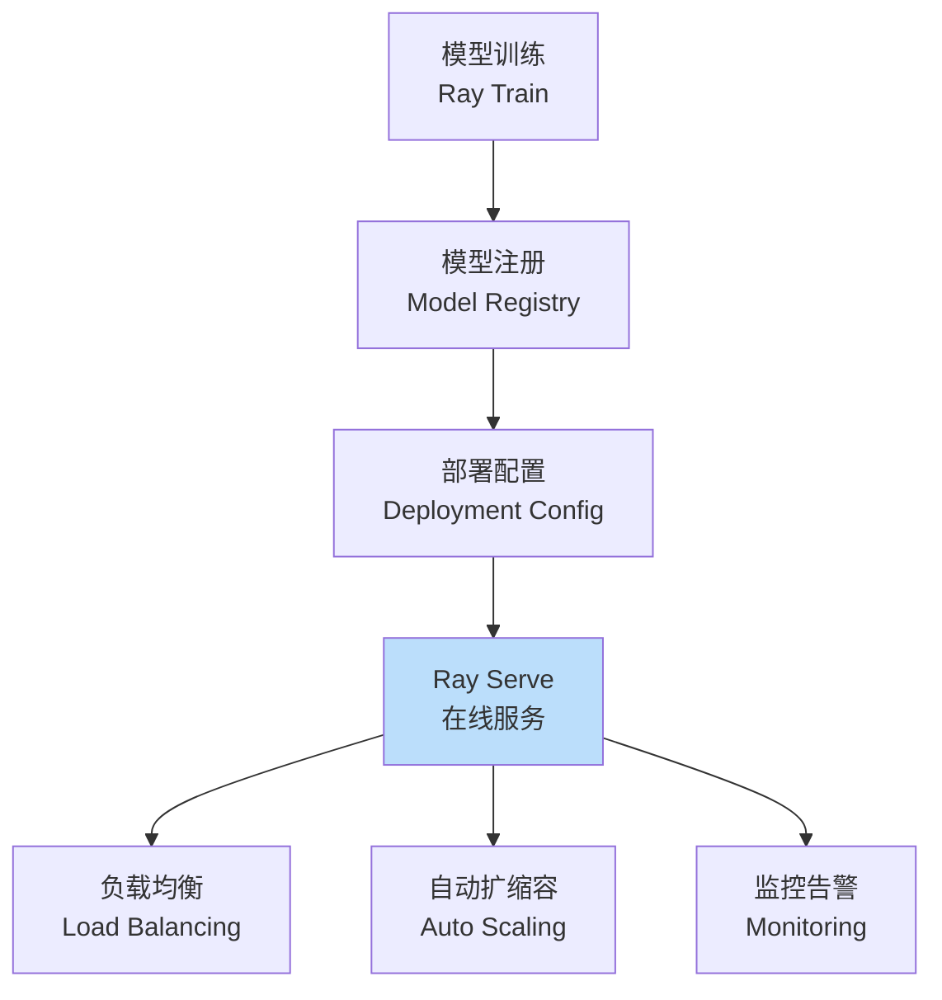
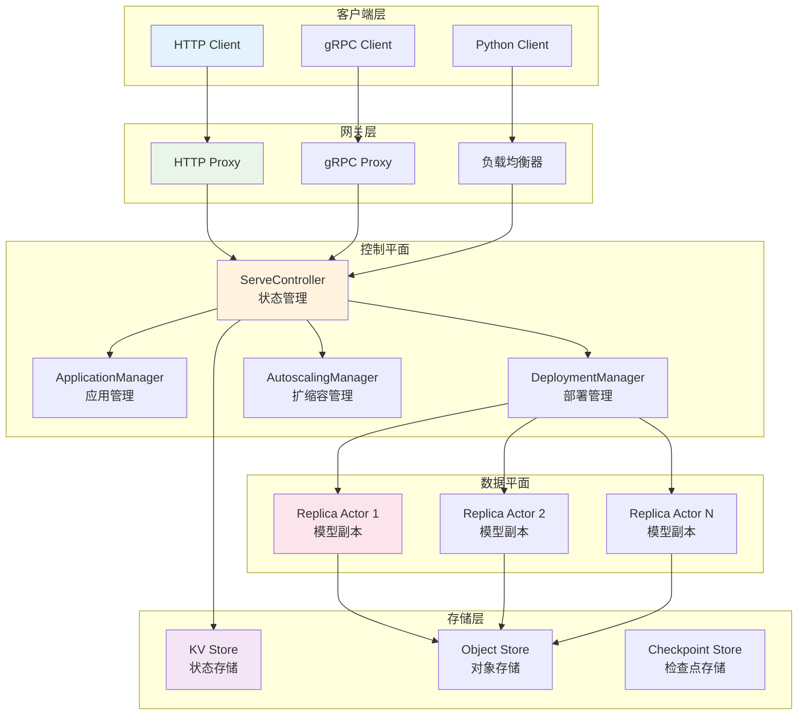
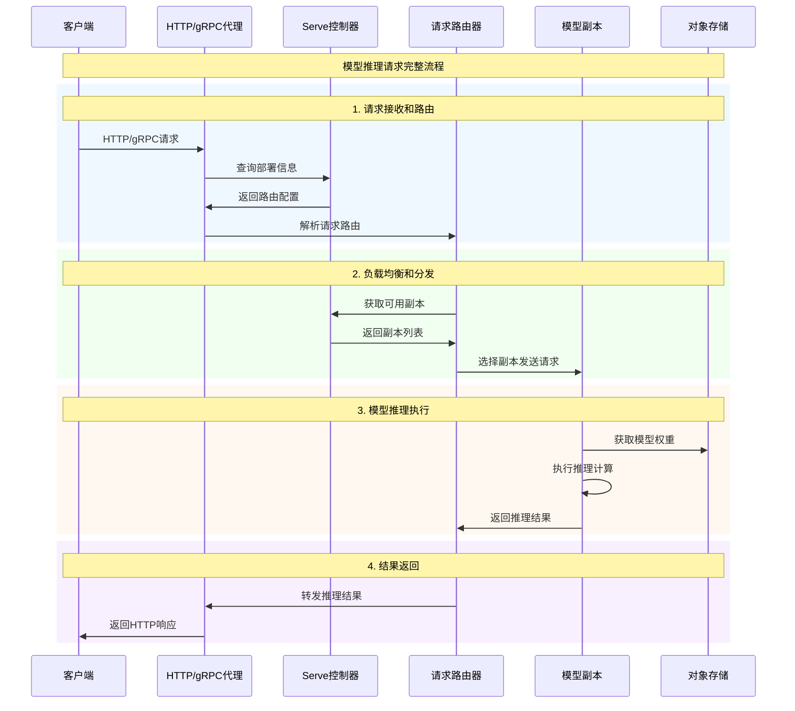
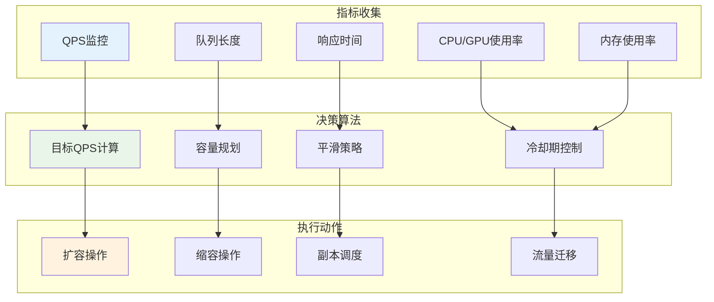

- [1. Ray Serve概述](#1-ray-serve概述)
- [2. 核心架构设计](#2-核心架构设计)
- [3. 部署系统详解](#3-部署系统详解)
- [4. 控制平面剖析](#4-控制平面剖析)
- [5. 自动扩缩容机制](#5-自动扩缩容机制)
- [6. 使用示例与最佳实践](#6-使用示例与最佳实践)

---

## 1. Ray Serve概述

Ray Serve是Ray生态系统中专门用于模型服务的框架，提供可扩展、高性能的机器学习模型在线推理服务。它支持多种模型框架，具备自动扩缩容、A/B测试、流量路由等企业级特性。

### 1.1 核心特性



### 1.2 在ML部署流程中的位置



---

## 2. 核心架构设计

### 2.1 Ray Serve整体架构



### 2.2 请求处理流程



---

## 3. 部署系统详解

### 3.1 @serve.deployment装饰器实现

```python
# 位置: python/ray/serve/api.py:333-523
@PublicAPI(stability="stable")
def deployment(
    _func_or_class: Optional[Callable] = None,
    name: str = None,
    num_replicas: Optional[Union[int, str]] = None,
    route_prefix: Union[str, None] = None,
    ray_actor_options: Dict = None,
    user_config: Optional[Any] = None,
    max_ongoing_requests: int = None,
    autoscaling_config: Union[Dict, AutoscalingConfig, None] = None,
    **kwargs
) -> Callable[[Callable], Deployment]:
    """
    部署装饰器 - 将Python类转换为可服务的部署
    
    核心功能：
    1. 模型封装和生命周期管理
    2. 副本扩展和负载均衡
    3. 请求路由和处理
    4. 健康检查和监控
    
    关键参数：
        name: 部署的唯一名称标识
        num_replicas: 副本数量，支持固定数量或"auto"
        ray_actor_options: Ray Actor的资源配置
        user_config: 用户自定义配置，支持动态更新
        max_ongoing_requests: 每个副本的最大并发请求
        autoscaling_config: 自动扩缩容配置
    
    使用示例：
        @serve.deployment(num_replicas=3, ray_actor_options={"num_gpus": 1})
        class ModelDeployment:
            def __init__(self, model_path):
                self.model = load_model(model_path)
            
            def __call__(self, request):
                return self.model.predict(request)
    """
    
    def decorator(func_or_class):
        """装饰器的实际实现"""
        
        # 1. 创建副本配置
        replica_config = ReplicaConfig.create(
            deployment_def=func_or_class,
            init_args=None,
            init_kwargs=None,
            ray_actor_options=ray_actor_options,
            placement_group_bundles=placement_group_bundles,
            placement_group_strategy=placement_group_strategy,
            max_replicas_per_node=max_replicas_per_node,
        )
        
        # 2. 创建部署配置
        deployment_config = DeploymentConfig.from_default(
            num_replicas=num_replicas if num_replicas is not None else 1,
            user_config=user_config,
            max_ongoing_requests=max_ongoing_requests,
            autoscaling_config=autoscaling_config,
            graceful_shutdown_wait_loop_s=graceful_shutdown_wait_loop_s,
            graceful_shutdown_timeout_s=graceful_shutdown_timeout_s,
            health_check_period_s=health_check_period_s,
            health_check_timeout_s=health_check_timeout_s,
            logging_config=logging_config,
        )
        
        # 3. 创建Deployment对象
        return Deployment(
            name=name if name is not None else func_or_class.__name__,
            deployment_config=deployment_config,
            replica_config=replica_config,
            version=version,
            route_prefix=route_prefix,
            _internal=True,
        )
    
    # 处理参数化和非参数化使用
    return decorator(func_or_class) if callable(func_or_class) else decorator

class Deployment:
    """
    部署类 - 管理模型服务的生命周期
    
    核心职责：
    1. 副本创建和管理
    2. 配置更新和热重载
    3. 流量路由和负载均衡
    4. 健康监控和故障恢复
    """
    
    def __init__(
        self,
        name: str,
        deployment_config: DeploymentConfig,
        replica_config: ReplicaConfig,
        version: Optional[str] = None,
        route_prefix: Optional[str] = None,
        **kwargs
    ):
        """
        初始化部署对象
        
        参数：
            name: 部署名称
            deployment_config: 部署级配置
            replica_config: 副本级配置
            version: 版本标识
            route_prefix: HTTP路由前缀
        """
        self._name = name
        self._deployment_config = deployment_config
        self._replica_config = replica_config
        self._version = version
        self._route_prefix = route_prefix
        
        # 绑定状态
        self._is_bound = False
        self._bound_args = None
        self._bound_kwargs = None
    
    def bind(self, *args, **kwargs) -> "Application":
        """
        绑定部署参数，创建应用程序
        
        功能：
        1. 设置部署的初始化参数
        2. 创建可运行的应用程序对象
        3. 准备部署到集群
        
        返回：Application对象，表示完整的可部署应用
        """
        if self._is_bound:
            raise RuntimeError("Deployment已经被绑定")
        
        # 创建绑定的部署副本
        bound_deployment = Deployment(
            name=self._name,
            deployment_config=self._deployment_config,
            replica_config=self._replica_config.with_args(args, kwargs),
            version=self._version,
            route_prefix=self._route_prefix,
        )
        
        bound_deployment._is_bound = True
        bound_deployment._bound_args = args
        bound_deployment._bound_kwargs = kwargs
        
        # 创建应用程序对象
        return Application(bound_deployment)
    
    def options(self, **config_options) -> "Deployment":
        """
        创建带有新配置的部署副本
        
        支持动态配置：
        - num_replicas: 副本数量调整
        - user_config: 用户配置更新
        - autoscaling_config: 扩缩容策略调整
        - ray_actor_options: 资源需求更新
        """
        # 合并新配置
        new_deployment_config = self._deployment_config.copy_and_update(**config_options)
        
        return Deployment(
            name=self._name,
            deployment_config=new_deployment_config,
            replica_config=self._replica_config,
            version=self._version,
            route_prefix=self._route_prefix,
        )
```

### 3.2 ReplicaActor实现分析

```python
# 位置: python/ray/serve/_private/replica.py:1094-1148
class ReplicaActor:
    """
    副本Actor - 执行实际模型推理的工作单元
    
    核心功能：
    1. 用户模型的封装和管理
    2. 请求处理和并发控制
    3. 健康检查和状态报告
    4. 资源使用监控
    
    生命周期：
    1. 初始化 - 加载模型和配置
    2. 就绪 - 开始接受请求
    3. 运行 - 处理推理请求
    4. 停止 - 优雅关闭和资源清理
    """
    
    async def __init__(
        self,
        replica_id: ReplicaID,
        serialized_deployment_def: bytes,
        serialized_init_args: bytes,
        serialized_init_kwargs: bytes,
        deployment_config_proto_bytes: bytes,
        version: DeploymentVersion,
        ingress: bool,
        route_prefix: str,
        rank: int,
    ):
        """
        初始化副本Actor
        
        参数说明：
            replica_id: 副本的唯一标识符
            serialized_deployment_def: 序列化的部署定义（模型类）
            serialized_init_args/kwargs: 序列化的初始化参数
            deployment_config_proto_bytes: 部署配置的protobuf字节
            version: 部署版本
            ingress: 是否为入口部署
            route_prefix: HTTP路由前缀
            rank: 副本在部署中的排名
        
        初始化流程：
        1. 反序列化部署定义和配置
        2. 创建用户模型实例
        3. 设置请求处理管道
        4. 初始化健康检查
        """
        # 1. 反序列化配置
        deployment_config = DeploymentConfig.from_proto_bytes(
            deployment_config_proto_bytes
        )
        
        # 2. 反序列化部署定义
        deployment_def = cloudpickle.loads(serialized_deployment_def)
        if isinstance(deployment_def, str):
            # 如果是导入路径，动态加载
            deployment_def = _load_deployment_def_from_import_path(deployment_def)
        
        # 3. 创建副本实现
        self._replica_impl: ReplicaBase = create_replica_impl(
            replica_id=replica_id,
            deployment_def=deployment_def,
            init_args=cloudpickle.loads(serialized_init_args),
            init_kwargs=cloudpickle.loads(serialized_init_kwargs),
            deployment_config=deployment_config,
            version=version,
            ingress=ingress,
            route_prefix=route_prefix,
            rank=rank,
        )
        
        # 4. 初始化完成，标记为就绪
        self._is_ready = True
    
    async def handle_request(
        self,
        pickled_request_metadata: bytes,
        *request_args,
        **request_kwargs
    ) -> Any:
        """
        处理推理请求的核心方法
        
        处理流程：
        1. 反序列化请求元数据
        2. 执行前处理（如批处理聚合）
        3. 调用用户模型进行推理
        4. 执行后处理和格式化
        5. 返回推理结果
        """
        # 反序列化请求元数据
        request_metadata = pickle.loads(pickled_request_metadata)
        
        # 委托给副本实现处理
        return await self._replica_impl.handle_request(
            request_metadata, *request_args, **request_kwargs
        )
    
    def get_num_ongoing_requests(self) -> int:
        """
        获取当前正在处理的请求数量
        
        用途：
        1. 负载均衡决策
        2. 自动扩缩容指标
        3. 监控和告警
        
        实现：独立线程执行，不被用户代码阻塞
        """
        return self._replica_impl.get_num_ongoing_requests()
    
    async def check_health(self) -> None:
        """
        健康检查方法
        
        健康检查策略：
        1. 默认：简单的Actor调用检查
        2. 自定义：用户定义的check_health方法
        3. 周期性执行，检测副本状态
        
        失败处理：
        - 连续失败达到阈值后标记不健康
        - 触发副本重启或替换
        - 从负载均衡中移除
        """
        await self._replica_impl.check_health()
    
    async def reconfigure(self, user_config: Any) -> None:
        """
        动态重配置副本
        
        功能：
        1. 不重启副本的配置更新
        2. 模型热重载
        3. 超参数调整
        
        典型场景：
        - A/B测试参数调整
        - 模型版本热更新
        - 性能参数优化
        """
        await self._replica_impl.reconfigure(user_config)
    
    async def prepare_for_shutdown(self) -> None:
        """
        准备关闭副本
        
        优雅关闭流程：
        1. 停止接受新请求
        2. 等待现有请求完成
        3. 清理模型资源
        4. 释放GPU内存等
        """
        await self._replica_impl.prepare_for_shutdown()

def create_replica_impl(
    replica_id: ReplicaID,
    deployment_def: Callable,
    init_args: Tuple,
    init_kwargs: Dict,
    deployment_config: DeploymentConfig,
    version: DeploymentVersion,
    ingress: bool,
    route_prefix: str,
    rank: int,
) -> ReplicaBase:
    """
    创建副本实现的工厂函数
    
    功能：
    1. 根据部署类型选择实现
    2. 初始化用户模型实例
    3. 设置请求处理包装器
    """
    # 创建用户模型实例
    user_callable = deployment_def(*init_args, **init_kwargs)
    
    # 创建用户调用包装器
    user_callable_wrapper = UserCallableWrapper(
        user_callable=user_callable,
        deployment_config=deployment_config,
    )
    
    # 创建副本实现
    return Replica(
        replica_id=replica_id,
        user_callable_wrapper=user_callable_wrapper,
        deployment_config=deployment_config,
        version=version,
    )

class UserCallableWrapper:
    """
    用户模型调用的包装器
    
    功能：
    1. 统一不同类型模型的调用接口
    2. 处理批处理聚合
    3. 异常处理和错误传播
    4. 性能监控和指标收集
    """
    
    def __init__(self, user_callable, deployment_config: DeploymentConfig):
        self.user_callable = user_callable
        self.deployment_config = deployment_config
        
        # 检测调用方式
        if hasattr(user_callable, '__call__'):
            self.call_method = user_callable.__call__
        elif hasattr(user_callable, 'predict'):
            self.call_method = user_callable.predict
        else:
            raise ValueError("用户模型必须实现__call__或predict方法")
        
        # 批处理配置
        self._batch_config = getattr(user_callable, '_batch_config', None)
    
    async def call_user_method(self, request_args, request_kwargs):
        """
        调用用户模型方法
        
        处理流程：
        1. 请求预处理
        2. 批处理聚合（如果配置）
        3. 模型推理调用
        4. 结果后处理
        """
        try:
            # 同步调用转异步
            if asyncio.iscoroutinefunction(self.call_method):
                result = await self.call_method(*request_args, **request_kwargs)
            else:
                result = self.call_method(*request_args, **request_kwargs)
            
            return result
            
        except Exception as e:
            # 错误处理和传播
            logger.exception(f"User callable error: {e}")
            raise
```

---

## 4. 控制平面剖析

### 4.1 ServeController架构

```python
# 位置: python/ray/serve/_private/controller.py:103-213
class ServeController:
    """
    Serve控制器 - 管理整个服务系统的状态
    
    核心职责：
    1. 应用程序和部署的生命周期管理
    2. 副本调度和资源分配
    3. 自动扩缩容决策
    4. 系统状态持久化和恢复
    5. 代理配置和管理
    
    组件架构：
    - ApplicationStateManager: 应用程序状态管理
    - DeploymentStateManager: 部署状态管理
    - AutoscalingStateManager: 自动扩缩容管理
    - ProxyStateManager: 代理状态管理
    - EndpointState: 端点状态管理
    """
    
    async def __init__(
        self,
        *,
        http_options: HTTPOptions,
        global_logging_config: LoggingConfig,
        grpc_options: Optional[gRPCOptions] = None,
    ):
        """
        初始化Serve控制器
        
        启动流程：
        1. 初始化存储后端
        2. 设置长轮询机制
        3. 创建状态管理器
        4. 恢复持久化状态
        5. 启动控制循环
        """
        # 1. 初始化存储和通信
        self.kv_store = RayInternalKVStore(namespace=SERVE_NAMESPACE)
        self.long_poll_host = LongPollHost()
        self.gcs_client = GcsClient(address=ray.get_runtime_context().gcs_address)
        
        # 2. 初始化集群信息缓存
        self.cluster_node_info_cache = create_cluster_node_info_cache(self.gcs_client)
        self.cluster_node_info_cache.update()
        
        # 3. 创建代理状态管理器
        self.proxy_state_manager = ProxyStateManager(
            http_options=http_options,
            head_node_id=self._controller_node_id,
            cluster_node_info_cache=self.cluster_node_info_cache,
            logging_config=global_logging_config,
            grpc_options=grpc_options,
        )
        
        # 4. 创建端点状态管理
        self.endpoint_state = EndpointState(self.kv_store, self.long_poll_host)
        
        # 5. 创建自动扩缩容管理器
        self.autoscaling_state_manager = AutoscalingStateManager()
        
        # 6. 创建部署状态管理器
        self.deployment_state_manager = DeploymentStateManager(
            kv_store=self.kv_store,
            long_poll_host=self.long_poll_host,
            all_current_actor_names=self._get_all_serve_actors(),
            all_current_placement_group_names=self._get_all_placement_groups(),
            cluster_node_info_cache=self.cluster_node_info_cache,
            autoscaling_state_manager=self.autoscaling_state_manager,
        )
        
        # 7. 创建应用程序状态管理器
        self.application_state_manager = ApplicationStateManager(
            deployment_state_manager=self.deployment_state_manager,
            endpoint_state=self.endpoint_state,
            kv_store=self.kv_store,
            global_logging_config=global_logging_config,
        )
        
        # 8. 启动控制循环
        asyncio.create_task(self._control_loop())
    
    async def _control_loop(self):
        """
        控制器主循环
        
        执行周期性任务：
        1. 更新集群节点信息
        2. 检查部署健康状态
        3. 执行自动扩缩容决策
        4. 处理故障恢复
        5. 更新代理配置
        """
        while True:
            try:
                loop_start_time = time.time()
                
                # 1. 更新集群状态
                self.cluster_node_info_cache.update()
                
                # 2. 运行部署状态管理器
                self.deployment_state_manager.update()
                
                # 3. 运行应用程序状态管理器
                self.application_state_manager.update()
                
                # 4. 运行代理状态管理器
                self.proxy_state_manager.update()
                
                # 5. 执行自动扩缩容
                self._run_autoscaling()
                
                # 6. 处理健康检查
                self._process_health_checks()
                
                # 7. 保存检查点
                await self._save_checkpoint_if_needed()
                
                # 8. 等待下一个控制周期
                loop_duration = time.time() - loop_start_time
                sleep_time = max(0, CONTROL_LOOP_INTERVAL_S - loop_duration)
                await asyncio.sleep(sleep_time)
                
            except Exception as e:
                logger.error(f"Control loop error: {e}")
                await asyncio.sleep(1)  # 错误恢复延迟
    
    async def deploy_application(self, config: ServeApplicationSchema) -> None:
        """
        部署应用程序
        
        部署流程：
        1. 验证应用程序配置
        2. 创建或更新部署
        3. 启动副本actors
        4. 配置路由规则
        5. 更新代理设置
        """
        app_name = config.name
        
        # 1. 解析应用程序图
        deployments = self._parse_deployment_graph(config.import_path)
        
        # 2. 更新应用程序状态
        await self.application_state_manager.deploy_application(
            app_name=app_name,
            deployments=deployments,
            runtime_env=config.runtime_env
        )
        
        # 3. 触发状态更新
        await self._trigger_deployment_updates()
    
    def _run_autoscaling(self):
        """
        执行自动扩缩容逻辑
        
        决策流程：
        1. 收集指标数据（QPS、队列长度、CPU/GPU使用率）
        2. 应用扩缩容算法
        3. 计算目标副本数量
        4. 触发副本创建或销毁
        """
        # 获取所有需要自动扩缩容的部署
        autoscaling_deployments = self.deployment_state_manager.get_autoscaling_deployments()
        
        for deployment_id, deployment_state in autoscaling_deployments.items():
            # 收集指标
            metrics = self._collect_autoscaling_metrics(deployment_id)
            
            # 计算目标副本数
            target_replicas = self.autoscaling_state_manager.get_decision(
                deployment_id=deployment_id,
                current_replicas=deployment_state.num_replicas,
                current_metrics=metrics
            )
            
            # 应用扩缩容决策
            if target_replicas != deployment_state.num_replicas:
                self.deployment_state_manager.update_deployment_target_replicas(
                    deployment_id, target_replicas
                )
```

---

## 5. 自动扩缩容机制

### 5.1 自动扩缩容算法



### 5.2 扩缩容配置和实现

```python
"""
Ray Serve自动扩缩容详解

自动扩缩容是Ray Serve的核心特性之一，
能够根据实时负载动态调整副本数量。
"""

from ray.serve.config import AutoscalingConfig

# 1. 自动扩缩容配置
@serve.deployment(
    autoscaling_config=AutoscalingConfig(
        min_replicas=1,           # 最小副本数
        max_replicas=10,          # 最大副本数
        target_ongoing_requests=5, # 目标并发请求数
        upscale_delay_s=30.0,     # 扩容延迟
        downscale_delay_s=600.0,  # 缩容延迟（更保守）
        metrics_interval_s=10.0,  # 指标收集间隔
        look_back_period_s=30.0,  # 指标回看周期
        smoothing_factor=1.0,     # 平滑因子
        upscale_smoothing_factor=1.0,   # 扩容平滑
        downscale_smoothing_factor=0.5, # 缩容平滑（更保守）
    )
)
class AutoScalingModel:
    """
    支持自动扩缩容的模型部署
    
    扩缩容策略：
    1. 基于ongoing_requests指标
    2. 考虑请求队列长度
    3. 结合资源使用情况
    4. 应用平滑和冷却机制
    """
    
    def __init__(self, model_path: str):
        """
        初始化模型
        
        注意：
        - 模型加载应该在__init__中完成
        - 避免在推理函数中重复加载
        - 考虑内存使用优化
        """
        import joblib
        self.model = joblib.load(model_path)
        self.request_count = 0
        
        # 预热模型（避免首次推理延迟）
        dummy_input = self._create_dummy_input()
        self.model.predict(dummy_input)
        
        print(f"Model loaded and warmed up")
    
    def __call__(self, request):
        """
        推理调用方法
        
        自动扩缩容考虑因素：
        1. 请求处理时间影响ongoing_requests
        2. 异常会影响成功率指标
        3. 资源使用会影响调度决策
        """
        import time
        import threading
        
        self.request_count += 1
        start_time = time.time()
        
        try:
            # 模拟推理计算
            result = self.model.predict(request["data"])
            
            # 记录处理时间
            processing_time = time.time() - start_time
            
            return {
                "prediction": result.tolist(),
                "request_id": self.request_count,
                "processing_time_ms": processing_time * 1000,
                "replica_id": ray.get_runtime_context().actor_id,
            }
            
        except Exception as e:
            # 异常处理不影响扩缩容
            logger.error(f"Prediction error: {e}")
            raise
    
    def reconfigure(self, config: Dict):
        """
        动态重配置方法
        
        支持的配置更新：
        - 模型参数调整
        - 批处理大小变更
        - 超参数更新
        """
        if "batch_size" in config:
            self._batch_size = config["batch_size"]
            print(f"Batch size updated to {self._batch_size}")
        
        if "model_path" in config:
            # 热重载模型
            self.model = joblib.load(config["model_path"])
            print(f"Model reloaded from {config['model_path']}")
    
    def check_health(self):
        """
        自定义健康检查
        
        健康检查失败会影响：
        - 副本从负载均衡中移除
        - 触发副本重启
        - 影响扩缩容决策
        """
        try:
            # 检查模型状态
            if self.model is None:
                raise RuntimeError("Model not loaded")
            
            # 执行简单推理测试
            dummy_input = self._create_dummy_input()
            result = self.model.predict(dummy_input)
            
            if result is None:
                raise RuntimeError("Model prediction failed")
            
            print("Health check passed")
            
        except Exception as e:
            print(f"Health check failed: {e}")
            raise

# 2. 自定义扩缩容策略
class CustomAutoscalingConfig(AutoscalingConfig):
    """
    自定义扩缩容配置
    
    支持更复杂的扩缩容逻辑：
    - 基于业务指标
    - 时间段感知
    - 成本优化
    """
    
    def __init__(self, **kwargs):
        super().__init__(**kwargs)
        
        # 自定义指标权重
        self.qps_weight = 0.6
        self.latency_weight = 0.3
        self.resource_weight = 0.1
    
    def calculate_target_replicas(
        self, 
        current_replicas: int,
        current_qps: float,
        avg_latency_ms: float,
        cpu_utilization: float,
        queue_length: int
    ) -> int:
        """
        自定义副本数计算逻辑
        
        算法：
        1. 综合考虑多个指标
        2. 应用权重和平滑
        3. 考虑业务约束
        """
        # 基于QPS的需求
        qps_target_replicas = max(1, int(current_qps / self.target_qps_per_replica))
        
        # 基于延迟的需求
        if avg_latency_ms > self.target_latency_ms:
            latency_scaling_factor = avg_latency_ms / self.target_latency_ms
            latency_target_replicas = int(current_replicas * latency_scaling_factor)
        else:
            latency_target_replicas = current_replicas
        
        # 基于资源的需求
        if cpu_utilization > 0.8:
            resource_target_replicas = int(current_replicas * 1.5)
        elif cpu_utilization < 0.3:
            resource_target_replicas = max(1, int(current_replicas * 0.8))
        else:
            resource_target_replicas = current_replicas
        
        # 加权平均
        target_replicas = int(
            qps_target_replicas * self.qps_weight +
            latency_target_replicas * self.latency_weight +
            resource_target_replicas * self.resource_weight
        )
        
        # 应用边界约束
        target_replicas = max(self.min_replicas, 
                            min(self.max_replicas, target_replicas))
        
        return target_replicas

# 3. 批处理优化
@serve.batch(max_batch_size=32, batch_wait_timeout_s=0.1)
async def batched_model_deployment(requests: List[Dict]) -> List[Dict]:
    """
    批处理模型部署
    
    批处理优势：
    1. 提高GPU利用率
    2. 减少推理开销
    3. 优化内存使用
    4. 提升整体吞吐量
    
    配置说明：
        max_batch_size: 最大批次大小
        batch_wait_timeout_s: 批次等待超时
    """
    import numpy as np
    
    # 提取批次数据
    batch_data = [req["data"] for req in requests]
    batch_input = np.array(batch_data)
    
    # 批量推理
    batch_results = model.predict(batch_input)
    
    # 拆分结果
    results = []
    for i, result in enumerate(batch_results):
        results.append({
            "prediction": result.tolist(),
            "request_index": i,
            "batch_size": len(requests)
        })
    
    return results

# 4. 模型组合部署
@serve.deployment(name="ensemble_model", num_replicas=2)
class EnsembleModel:
    """
    集成模型部署
    
    功能：
    1. 多模型组合推理
    2. 模型版本管理
    3. A/B测试支持
    4. 故障隔离
    """
    
    def __init__(self, model_configs: List[Dict]):
        """
        初始化集成模型
        
        参数：
            model_configs: 模型配置列表
        """
        self.models = {}
        self.model_weights = {}
        
        # 加载所有子模型
        for config in model_configs:
            model_name = config["name"]
            model_path = config["path"]
            weight = config.get("weight", 1.0)
            
            self.models[model_name] = self._load_model(model_path)
            self.model_weights[model_name] = weight
            
        print(f"Loaded {len(self.models)} models for ensemble")
    
    async def __call__(self, request):
        """
        集成推理方法
        
        策略：
        1. 并行调用所有模型
        2. 加权平均结果
        3. 异常隔离处理
        """
        model_futures = {}
        
        # 并行调用所有模型
        for model_name, model in self.models.items():
            future = asyncio.create_task(
                self._call_model_async(model, request)
            )
            model_futures[model_name] = future
        
        # 收集结果
        results = {}
        failed_models = []
        
        for model_name, future in model_futures.items():
            try:
                result = await future
                results[model_name] = result
            except Exception as e:
                logger.error(f"Model {model_name} failed: {e}")
                failed_models.append(model_name)
        
        # 计算加权平均（排除失败的模型）
        if not results:
            raise RuntimeError("All models failed")
        
        weighted_result = self._compute_weighted_average(results)
        
        return {
            "prediction": weighted_result,
            "successful_models": list(results.keys()),
            "failed_models": failed_models,
            "ensemble_size": len(results)
        }
    
    async def _call_model_async(self, model, request):
        """异步调用单个模型"""
        # 在线程池中执行同步推理
        loop = asyncio.get_event_loop()
        return await loop.run_in_executor(
            None, model.predict, request["data"]
        )
    
    def _compute_weighted_average(self, results: Dict) -> float:
        """计算加权平均结果"""
        total_weight = 0
        weighted_sum = 0
        
        for model_name, result in results.items():
            weight = self.model_weights[model_name]
            weighted_sum += result * weight
            total_weight += weight
        
        return weighted_sum / total_weight if total_weight > 0 else 0
```

---

## 6. 使用示例与最佳实践

### 6.1 完整的模型服务示例

```python
"""
Ray Serve模型服务完整示例
演示从模型加载到生产部署的完整流程
"""

import asyncio
import numpy as np
import joblib
from typing import Dict, List

import ray
from ray import serve
from ray.serve.config import AutoscalingConfig

# 1. 简单模型服务
@serve.deployment(
    name="simple_classifier",
    num_replicas=2,
    ray_actor_options={"num_cpus": 1, "memory": 1000 * 1024 * 1024}  # 1GB内存
)
class SimpleClassifier:
    """
    简单分类器部署示例
    
    特性：
    - 固定副本数量
    - 同步推理
    - 基础监控
    """
    
    def __init__(self, model_path: str):
        """加载预训练模型"""
        self.model = joblib.load(model_path)
        self.version = "1.0.0"
        print(f"Model {self.version} loaded")
    
    def __call__(self, request: Dict) -> Dict:
        """推理接口"""
        data = np.array(request["features"])
        prediction = self.model.predict([data])[0]
        confidence = self.model.predict_proba([data])[0].max()
        
        return {
            "prediction": int(prediction),
            "confidence": float(confidence),
            "model_version": self.version
        }

# 2. GPU加速模型服务  
@serve.deployment(
    name="gpu_model",
    num_replicas="auto",  # 自动扩缩容
    autoscaling_config=AutoscalingConfig(
        min_replicas=1,
        max_replicas=4,
        target_ongoing_requests=2,  # GPU模型并发度较低
    ),
    ray_actor_options={"num_gpus": 1}  # 每个副本需要1个GPU
)
class GPUAcceleratedModel:
    """
    GPU加速的深度学习模型部署
    
    特性：
    - GPU资源管理
    - 批处理优化
    - 异步推理
    - 内存管理
    """
    
    def __init__(self, model_name: str):
        """初始化GPU模型"""
        import torch
        
        # 检查GPU可用性
        if not torch.cuda.is_available():
            raise RuntimeError("GPU not available")
        
        # 设置设备
        self.device = torch.device("cuda")
        
        # 加载模型到GPU
        self.model = self._load_model(model_name)
        self.model.to(self.device)
        self.model.eval()
        
        print(f"GPU model loaded on device: {self.device}")
    
    def _load_model(self, model_name):
        """加载模型的具体实现"""
        import torchvision.models as models
        
        if model_name == "resnet50":
            return models.resnet50(pretrained=True)
        elif model_name == "vgg16":
            return models.vgg16(pretrained=True)
        else:
            raise ValueError(f"Unsupported model: {model_name}")
    
    async def __call__(self, request: Dict) -> Dict:
        """异步推理接口"""
        import torch
        
        # 数据预处理
        image_data = np.array(request["image"])
        tensor = torch.FloatTensor(image_data).unsqueeze(0).to(self.device)
        
        # GPU推理
        with torch.no_grad():
            output = self.model(tensor)
            probabilities = torch.softmax(output, dim=1)
            prediction = torch.argmax(probabilities, dim=1).item()
            confidence = probabilities[0][prediction].item()
        
        return {
            "prediction": prediction,
            "confidence": confidence,
            "gpu_memory_used": torch.cuda.memory_allocated(self.device)
        }

# 3. 批处理优化模型
@serve.deployment(
    name="batch_model",
    autoscaling_config=AutoscalingConfig(min_replicas=1, max_replicas=3)
)
class BatchOptimizedModel:
    """
    批处理优化的模型部署
    
    优势：
    - 提高GPU利用率
    - 减少推理延迟
    - 优化内存使用
    """
    
    def __init__(self):
        self.model = self._load_model()
    
    @serve.batch(max_batch_size=16, batch_wait_timeout_s=0.05)
    async def handle_batch(self, requests: List[Dict]) -> List[Dict]:
        """
        批处理推理方法
        
        批处理策略：
        1. 累积请求到批次大小
        2. 超时后处理不完整批次
        3. 并行处理提高吞吐量
        """
        # 提取批次输入
        batch_inputs = [req["input"] for req in requests]
        batch_array = np.array(batch_inputs)
        
        # 批量推理
        batch_predictions = self.model.predict(batch_array)
        
        # 构造批次响应
        responses = []
        for i, prediction in enumerate(batch_predictions):
            responses.append({
                "prediction": prediction.tolist(),
                "batch_index": i,
                "batch_size": len(requests)
            })
        
        return responses
    
    async def __call__(self, request: Dict) -> Dict:
        """单个请求的接口，内部使用批处理"""
        batch_results = await self.handle_batch(request)
        return batch_results[0]  # 返回单个结果

# 4. 应用程序组合
@serve.deployment(name="preprocessor")
class DataPreprocessor:
    """数据预处理服务"""
    
    def __call__(self, request: Dict) -> Dict:
        """数据预处理逻辑"""
        raw_data = request["raw_data"]
        
        # 标准化处理
        processed_data = (np.array(raw_data) - np.mean(raw_data)) / np.std(raw_data)
        
        return {"processed_data": processed_data.tolist()}

@serve.deployment(name="model_inference")  
class ModelInference:
    """模型推理服务"""
    
    def __init__(self, model_path: str):
        self.model = joblib.load(model_path)
    
    def __call__(self, request: Dict) -> Dict:
        """推理逻辑"""
        data = np.array(request["processed_data"])
        prediction = self.model.predict([data])[0]
        
        return {"prediction": prediction}

@serve.deployment(name="ml_pipeline")
class MLPipeline:
    """
    机器学习推理流水线
    
    组合多个服务：
    1. 数据预处理
    2. 模型推理
    3. 结果后处理
    """
    
    def __init__(self):
        # 获取下游服务的句柄
        self.preprocessor = serve.get_deployment("preprocessor").get_handle()
        self.model = serve.get_deployment("model_inference").get_handle()
    
    async def __call__(self, request: Dict) -> Dict:
        """流水线推理"""
        # 1. 数据预处理
        preprocess_result = await self.preprocessor.remote(request)
        
        # 2. 模型推理
        inference_result = await self.model.remote(preprocess_result)
        
        # 3. 结果后处理
        final_result = {
            "prediction": inference_result["prediction"],
            "pipeline_version": "1.0",
            "processing_steps": ["preprocess", "inference", "postprocess"]
        }
        
        return final_result

# 5. 多版本模型管理
class ModelVersionManager:
    """
    模型版本管理器
    
    功能：
    - A/B测试
    - 金丝雀发布
    - 回滚机制
    """
    
    @staticmethod
    def deploy_model_versions():
        """部署多个模型版本"""
        
        # 主版本模型（90%流量）
        main_model = SimpleClassifier.options(
            name="model_v1",
            user_config={"version": "1.0", "traffic_weight": 0.9}
        ).bind("model_v1.pkl")
        
        # 新版本模型（10%流量，A/B测试）
        canary_model = SimpleClassifier.options(
            name="model_v2", 
            user_config={"version": "2.0", "traffic_weight": 0.1}
        ).bind("model_v2.pkl")
        
        # 流量分发器
        @serve.deployment(name="traffic_splitter")
        class TrafficSplitter:
            def __init__(self):
                self.v1_handle = serve.get_deployment("model_v1").get_handle()
                self.v2_handle = serve.get_deployment("model_v2").get_handle()
            
            async def __call__(self, request):
                import random
                
                # 按权重分发流量
                if random.random() < 0.9:
                    result = await self.v1_handle.remote(request)
                    result["model_version"] = "v1"
                else:
                    result = await self.v2_handle.remote(request)
                    result["model_version"] = "v2"
                
                return result
        
        # 部署所有组件
        serve.run(main_model, name="model_v1")
        serve.run(canary_model, name="model_v2") 
        serve.run(TrafficSplitter.bind(), name="traffic_splitter")

# 6. 监控和可观测性
@serve.deployment(name="monitored_model")
class MonitoredModel:
    """
    带监控的模型部署
    
    监控维度：
    - 请求QPS和延迟
    - 模型准确率
    - 资源使用情况
    - 错误率统计
    """
    
    def __init__(self, model_path: str):
        self.model = joblib.load(model_path)
        
        # 监控指标
        self.request_count = 0
        self.error_count = 0
        self.total_latency = 0.0
        
        # 性能统计
        self.start_time = time.time()
    
    def __call__(self, request: Dict) -> Dict:
        """带监控的推理接口"""
        import time
        
        start_time = time.time()
        self.request_count += 1
        
        try:
            # 执行推理
            data = np.array(request["features"])
            prediction = self.model.predict([data])[0]
            confidence = self.model.predict_proba([data])[0].max()
            
            # 记录延迟
            latency = time.time() - start_time
            self.total_latency += latency
            
            # 构造响应
            response = {
                "prediction": int(prediction),
                "confidence": float(confidence),
                "latency_ms": latency * 1000,
                "request_id": self.request_count
            }
            
            # 记录性能指标
            self._record_metrics(response, success=True)
            
            return response
            
        except Exception as e:
            self.error_count += 1
            self._record_metrics({"error": str(e)}, success=False)
            raise
    
    def _record_metrics(self, response: Dict, success: bool):
        """记录性能指标"""
        uptime = time.time() - self.start_time
        qps = self.request_count / uptime if uptime > 0 else 0
        avg_latency = self.total_latency / self.request_count if self.request_count > 0 else 0
        error_rate = self.error_count / self.request_count if self.request_count > 0 else 0
        
        # 定期打印统计信息
        if self.request_count % 100 == 0:
            print(f"Stats - QPS: {qps:.2f}, Avg Latency: {avg_latency*1000:.2f}ms, "
                  f"Error Rate: {error_rate:.2%}")
    
    def get_stats(self) -> Dict:
        """获取统计信息的API"""
        uptime = time.time() - self.start_time
        return {
            "uptime_s": uptime,
            "request_count": self.request_count,
            "error_count": self.error_count,
            "qps": self.request_count / uptime if uptime > 0 else 0,
            "avg_latency_ms": (self.total_latency / self.request_count * 1000) if self.request_count > 0 else 0,
            "error_rate": self.error_count / self.request_count if self.request_count > 0 else 0,
        }

# 7. 部署和管理
def deploy_and_manage():
    """部署管理示例"""
    
    # 初始化Ray和Serve
    ray.init()
    serve.start()
    
    try:
        # 1. 部署简单模型
        simple_app = SimpleClassifier.bind("simple_model.pkl")
        serve.run(simple_app, name="simple_service")
        
        # 2. 部署GPU模型
        gpu_app = GPUAcceleratedModel.bind("resnet50")
        serve.run(gpu_app, name="gpu_service") 
        
        # 3. 部署批处理模型
        batch_app = BatchOptimizedModel.bind()
        serve.run(batch_app, name="batch_service")
        
        # 4. 部署流水线
        # 先部署组件
        preprocessor_app = DataPreprocessor.bind()
        serve.run(preprocessor_app, name="preprocessor")
        
        inference_app = ModelInference.bind("inference_model.pkl")
        serve.run(inference_app, name="model_inference")
        
        # 再部署流水线
        pipeline_app = MLPipeline.bind()
        serve.run(pipeline_app, name="ml_pipeline")
        
        # 5. 获取服务句柄进行测试
        simple_handle = serve.get_deployment("simple_service").get_handle()
        
        # 测试推理
        test_request = {"features": [1.0, 2.0, 3.0, 4.0]}
        result = ray.get(simple_handle.remote(test_request))
        print(f"Inference result: {result}")
        
        # 6. 动态配置更新
        # 更新副本数量
        serve.get_deployment("simple_service").options(num_replicas=4).deploy()
        
        # 更新用户配置
        serve.get_deployment("simple_service").options(
            user_config={"threshold": 0.8}
        ).deploy()
        
        print("All services deployed successfully!")
        
    finally:
        # 清理资源
        serve.shutdown()
        ray.shutdown()

# 8. 性能测试和压力测试
async def performance_testing():
    """模型服务性能测试"""
    import aiohttp
    import asyncio
    import time
    
    async def send_request(session, url, data):
        """发送单个请求"""
        async with session.post(url, json=data) as response:
            return await response.json()
    
    async def load_test(url: str, num_requests: int = 1000, concurrency: int = 50):
        """负载测试"""
        start_time = time.time()
        
        async with aiohttp.ClientSession() as session:
            # 创建并发请求
            semaphore = asyncio.Semaphore(concurrency)
            
            async def bounded_request(request_id):
                async with semaphore:
                    test_data = {"features": [1.0, 2.0, 3.0, 4.0]}
                    return await send_request(session, url, test_data)
            
            # 执行所有请求
            tasks = [bounded_request(i) for i in range(num_requests)]
            results = await asyncio.gather(*tasks, return_exceptions=True)
            
            # 统计结果
            successful_requests = [r for r in results if not isinstance(r, Exception)]
            failed_requests = [r for r in results if isinstance(r, Exception)]
            
            total_time = time.time() - start_time
            qps = len(successful_requests) / total_time
            
            print(f"Load test results:")
            print(f"  Total requests: {num_requests}")
            print(f"  Successful: {len(successful_requests)}")
            print(f"  Failed: {len(failed_requests)}")
            print(f"  QPS: {qps:.2f}")
            print(f"  Total time: {total_time:.2f}s")
            
            return {
                "qps": qps,
                "success_rate": len(successful_requests) / num_requests,
                "total_time": total_time
            }
    
    # 运行负载测试
    test_url = "http://localhost:8000/simple_service"
    results = await load_test(test_url, num_requests=1000, concurrency=100)
    
    return results

# 使用示例
if __name__ == "__main__":
    # 部署服务
    deploy_and_manage()
    
    # 运行性能测试
    # asyncio.run(performance_testing())
```

### 6.2 生产环境最佳实践

```python
"""
Ray Serve生产环境最佳实践
"""

# 1. 生产级部署配置
def production_deployment_config():
    """生产环境部署配置"""
    
    @serve.deployment(
        name="production_model",
        # 资源配置
        ray_actor_options={
            "num_cpus": 2,
            "num_gpus": 0.5,  # 共享GPU
            "memory": 4 * 1024 * 1024 * 1024,  # 4GB内存
            "runtime_env": {
                "pip": ["torch==1.13.1", "transformers==4.21.0"],
                "env_vars": {"OMP_NUM_THREADS": "1"}
            }
        },
        # 自动扩缩容
        autoscaling_config=AutoscalingConfig(
            min_replicas=3,      # 最小副本保证可用性
            max_replicas=20,     # 最大副本控制成本
            target_ongoing_requests=8,
            upscale_delay_s=30.0,    # 较快扩容
            downscale_delay_s=300.0, # 保守缩容
        ),
        # 健康检查
        health_check_period_s=30.0,
        health_check_timeout_s=10.0,
        # 优雅关闭
        graceful_shutdown_wait_loop_s=5.0,
        graceful_shutdown_timeout_s=30.0,
        # 并发控制
        max_ongoing_requests=10,
        # 日志配置
        logging_config={
            "log_level": "INFO",
            "logs_dir": "/var/log/ray_serve/",
        }
    )
    class ProductionModel:
        pass

# 2. 错误处理和重试
@serve.deployment(name="resilient_model")
class ResilientModel:
    """容错模型部署"""
    
    def __init__(self):
        self.model = self._load_model_with_retry()
        self.fallback_model = self._load_fallback_model()
    
    def _load_model_with_retry(self, max_retries=3):
        """带重试的模型加载"""
        for attempt in range(max_retries):
            try:
                return joblib.load("primary_model.pkl")
            except Exception as e:
                if attempt == max_retries - 1:
                    raise
                time.sleep(2 ** attempt)  # 指数退避
    
    def __call__(self, request):
        """容错推理接口"""
        try:
            # 尝试主模型
            return self.model.predict(request["data"])
        except Exception as e:
            logger.warning(f"Primary model failed: {e}, using fallback")
            # 降级到备用模型
            return self.fallback_model.predict(request["data"])

# 3. 监控和告警
@serve.deployment(name="monitored_production_model")
class MonitoredProductionModel:
    """生产级监控模型"""
    
    def __init__(self):
        self.model = joblib.load("production_model.pkl")
        
        # 监控指标
        self.metrics = {
            "requests_total": 0,
            "requests_failed": 0,
            "latency_sum": 0.0,
            "latency_count": 0,
            "predictions_by_class": {},
        }
    
    def __call__(self, request):
        """带监控的推理"""
        import time
        from prometheus_client import Counter, Histogram, Gauge
        
        start_time = time.time()
        self.metrics["requests_total"] += 1
        
        try:
            # 执行推理
            prediction = self.model.predict([request["data"]])[0]
            
            # 记录成功指标
            latency = time.time() - start_time
            self.metrics["latency_sum"] += latency
            self.metrics["latency_count"] += 1
            
            # 统计预测分布
            pred_class = str(prediction)
            self.metrics["predictions_by_class"][pred_class] = \
                self.metrics["predictions_by_class"].get(pred_class, 0) + 1
            
            return {"prediction": prediction, "latency_ms": latency * 1000}
            
        except Exception as e:
            self.metrics["requests_failed"] += 1
            logger.error(f"Prediction failed: {e}")
            raise
    
    def get_metrics(self):
        """获取监控指标API"""
        avg_latency = (self.metrics["latency_sum"] / self.metrics["latency_count"]
                      if self.metrics["latency_count"] > 0 else 0)
        
        return {
            "requests_total": self.metrics["requests_total"],
            "requests_failed": self.metrics["requests_failed"],
            "success_rate": (self.metrics["requests_total"] - self.metrics["requests_failed"]) / 
                           self.metrics["requests_total"] if self.metrics["requests_total"] > 0 else 1.0,
            "avg_latency_ms": avg_latency * 1000,
            "predictions_distribution": self.metrics["predictions_by_class"]
        }
```

---

## 总结

Ray Serve作为Ray生态系统中的模型服务引擎，提供了企业级的在线推理服务能力：

### 核心架构优势
1. **分离的控制平面和数据平面** - 高可用性和可扩展性
2. **Actor-based副本管理** - 利用Ray的容错和资源管理
3. **智能负载均衡** - 基于实时指标的请求分发
4. **无缝集成** - 与Ray Train/Tune/Data的原生集成

### 关键特性
- **零停机部署**: 支持滚动更新和版本管理
- **自动扩缩容**: 基于负载的智能资源调整
- **批处理优化**: 提高GPU利用率和推理吞吐量
- **多协议支持**: HTTP、gRPC、Python原生调用
- **生产就绪**: 完整的监控、日志、健康检查

Ray Serve简化了从研究原型到生产部署的过程，为AI应用提供了可靠、高性能的服务基础设施。
