- [1. Ray Train概述](#1-ray-train概述)
- [2. 核心架构设计](#2-核心架构设计)
- [3. 训练器体系](#3-训练器体系)
- [4. 执行引擎剖析](#4-执行引擎剖析)
- [5. 分布式训练协调](#5-分布式训练协调)
- [6. 使用示例与最佳实践](#6-使用示例与最佳实践)

---

## 1. Ray Train概述

Ray Train是Ray生态系统中专门用于分布式机器学习训练的库，提供统一的分布式训练接口，支持PyTorch、TensorFlow、Horovod、XGBoost等多种深度学习和机器学习框架。

### 1.1 核心特性


### 1.2 分布式训练模式


---

## 2. 核心架构设计

### 2.1 整体架构图


### 2.2 训练生命周期

```mermaid
stateDiagram-v2
    [*] --> 初始化: trainer.fit()
    初始化 --> 资源分配: ScalingConfig
    资源分配 --> 工作节点启动: WorkerGroup.start()
    工作节点启动 --> 后端初始化: Backend.setup()
    后端初始化 --> 数据分发: Dataset.shard()
    数据分发 --> 训练执行: train_loop_per_worker()
    训练执行 --> 指标报告: train.report()
    指标报告 --> 训练执行: 继续训练
    训练执行 --> 训练完成: 达到终止条件
    训练完成 --> 资源清理: WorkerGroup.shutdown()
    资源清理 --> [*]
    
    note right of 训练执行: 分布式同步<br/>梯度聚合<br/>参数更新
```



---

## 3. 训练器体系

### 3.1 BaseTrainer基础接口

```python
# 位置: python/ray/train/base_trainer.py:127-227
@DeveloperAPI
class BaseTrainer(abc.ABC):
    """
    分布式训练的基础接口定义
    
    核心职责：

    1. 定义训练的标准流程
    2. 提供序列化和远程执行支持
    3. 管理训练配置和元数据
    4. 协调训练生命周期
    
    工作流程：
    1. trainer.__init__() - 本地初始化，轻量级设置
    2. trainer.fit() - 序列化并复制到远程Ray actor
    3. trainer.setup() - 远程actor上的重量级设置
    4. trainer.training_loop() - 执行主要训练逻辑
    5. 返回Result对象，包含指标和检查点
    """
    
    def __init__(
        self,
        scaling_config: Optional[ScalingConfig] = None,
        run_config: Optional[RunConfig] = None,
        datasets: Optional[Dict[str, Dataset]] = None,
        metadata: Optional[Dict[str, Any]] = None,
        resume_from_checkpoint: Optional[Checkpoint] = None,
    ):
        """
        初始化训练器
        
        参数说明：
            scaling_config: 分布式扩展配置
            run_config: 运行时配置（检查点、日志等）
            datasets: 训练数据集字典
            metadata: 用户自定义元数据
            resume_from_checkpoint: 恢复训练的检查点
        """
        self.scaling_config = scaling_config or ScalingConfig()
        self.run_config = run_config or RunConfig()
        self.datasets = datasets or {}
        self.metadata = metadata or {}
        self.resume_from_checkpoint = resume_from_checkpoint
        
        # 验证配置参数
        self._validate_config()
    
    @abc.abstractmethod
    def setup(self) -> None:
        """
        训练器的重量级初始化
        
        在远程actor上执行，用于：
        - 模型初始化
        - 优化器创建
        - 数据加载器设置
        - GPU资源分配
        """
        raise NotImplementedError
    
    @abc.abstractmethod
    def training_loop(self) -> None:
        """
        主要训练逻辑
        
        在此方法中：
        - 执行训练循环
        - 调用train.report()报告进度
        - 管理检查点保存
        - 处理早停逻辑
        """
        raise NotImplementedError
    
    def fit(self) -> Result:
        """
        启动分布式训练
        
        执行流程：
        1. 创建训练coordinator actor
        2. 序列化训练器到远程节点
        3. 调用setup()和training_loop()
        4. 收集训练结果
        5. 清理资源
        """
        # 创建训练协调器
        coordinator = _TrainCoordinator.remote(
            config=self._get_config(),
            trainer_cls=self.__class__,
            metadata=self.metadata
        )
        
        # 启动训练并返回结果
        return ray.get(coordinator.run.remote())

# 训练协调器函数
def _train_coordinator_fn(
    config: dict,
    trainer_cls: Type["BaseTrainer"],
    metadata: dict
):
    """
    训练协调器的执行函数
    
    功能：

    1. 重建训练器实例
    2. 调用setup()进行初始化
    3. 执行training_loop()
    4. 处理异常和清理
    """
    # 从配置重建训练器
    trainer = trainer_cls._from_config(config)
    
    # 设置运行时上下文
    train_context = {
        "world_rank": 0,
        "local_rank": 0,
        "world_size": 1,
        "datasets": trainer.datasets,
        "metadata": metadata
    }
    
    try:
        # 执行训练器生命周期
        trainer.setup()
        trainer.training_loop()
        
        # 收集训练结果
        return _collect_training_results()
        
    except Exception as e:
        logger.error(f"Training failed: {e}")
        raise
    finally:
        # 清理资源
        _cleanup_training_resources()

```

### 3.2 DataParallelTrainer数据并行实现

```python
# 位置: python/ray/train/data_parallel_trainer.py:26-209
@DeveloperAPI
class DataParallelTrainer(BaseTrainer):
    """
    数据并行训练器 - SPMD模式实现
    
    核心概念：

    1. SPMD (Single Program, Multiple Data) - 相同程序，不同数据
    2. 多个worker并行执行相同的训练函数
    3. 数据自动分片到各个worker
    4. 支持分布式梯度同步
    
    适用场景：
    - 数据并行训练
    - 大规模深度学习模型
    - 需要梯度聚合的训练任务
    """
    
    def __init__(
        self,
        train_loop_per_worker: Union[Callable[[], None], Callable[[Dict], None]],
        *,
        train_loop_config: Optional[Dict] = None,
        backend_config: Optional[BackendConfig] = None,
        scaling_config: Optional[ScalingConfig] = None,
        dataset_config: Optional[DataConfig] = None,
        **kwargs
    ):
        """
        初始化数据并行训练器
        
        参数说明：
            train_loop_per_worker: 每个worker执行的训练函数
            train_loop_config: 传递给训练函数的配置
            backend_config: 分布式后端配置（如PyTorch DDP）
            scaling_config: 扩展配置（worker数量、GPU使用等）
            dataset_config: 数据分片配置
        """
        super().__init__(scaling_config=scaling_config, **kwargs)
        
        self.train_loop_per_worker = train_loop_per_worker
        self.train_loop_config = train_loop_config or {}
        self.backend_config = backend_config or BackendConfig()
        self.dataset_config = dataset_config or DataConfig()
        
        # 验证训练函数签名
        self._validate_train_loop_signature()
    
    def setup(self) -> None:
        """
        数据并行训练器的设置
        
        职责：
        1. 初始化Backend执行器
        2. 配置worker组
        3. 设置数据分片
        4. 初始化分布式后端
        """
        # 创建Backend执行器
        self.backend_executor = BackendExecutor(
            backend_config=self.backend_config,
            num_workers=self.scaling_config.num_workers,
            resources_per_worker=self.scaling_config.resources_per_worker,
            max_retries=self.scaling_config.max_retries
        )
        
        # 启动worker组
        self.backend_executor.start(
            initialization_hook=self._initialization_hook,
            placement_group=self._get_placement_group()
        )
    
    def training_loop(self) -> None:
        """
        数据并行训练主循环
        
        执行步骤：
        1. 启动所有worker的训练
        2. 协调分布式训练过程
        3. 收集训练结果和指标
        4. 处理检查点保存
        """
        # 启动分布式训练
        self.backend_executor.start_training(
            train_func=self.train_loop_per_worker,
            datasets=self.datasets,
            metadata=self.metadata,
            data_config=self.dataset_config,
            storage=self._get_storage_context(),
            checkpoint=self.resume_from_checkpoint
        )
        
        # 训练结果收集循环
        while True:
            # 获取下一批训练结果
            results = self.backend_executor.get_next_results()
            
            if results is None:
                # 训练完成
                break
            
            # 处理训练结果
            for result in results:
                if result.checkpoint:
                    self._save_checkpoint(result.checkpoint)
                
                if result.metrics:
                    self._log_metrics(result.metrics)
    
    def _validate_train_loop_signature(self):
        """验证训练循环函数的签名"""
        sig = inspect.signature(self.train_loop_per_worker)
        params = list(sig.parameters.keys())
        
        if len(params) == 0:
            # 无参数函数
            self._use_config_in_training = False
        elif len(params) == 1:
            # 单参数函数，传入config
            self._use_config_in_training = True
        else:
            raise ValueError(
                f"train_loop_per_worker can only take 0 or 1 arguments, "
                f"got {len(params)}"
            )

```

### 3.3 TorchTrainer实现示例

```python
# 位置: python/ray/train/torch/torch_trainer.py:11-191
@PublicAPI(stability="stable")
class TorchTrainer(DataParallelTrainer):
    """
    PyTorch分布式训练器
    
    特性：

    1. 自动设置PyTorch分布式环境
    2. 支持NCCL/Gloo通信后端
    3. 集成PyTorch DDP
    4. 支持混合精度训练
    
    工作流程：
    1. 启动多个worker进程
    2. 初始化PyTorch分布式组
    3. 分发数据到各worker
    4. 执行分布式训练循环
    """
    
    def __init__(
        self,
        train_loop_per_worker: Union[Callable[[], None], Callable[[Dict], None]],
        *,
        torch_config: Optional[TorchConfig] = None,
        **kwargs
    ):
        """
        初始化PyTorch训练器
        
        参数：
            torch_config: PyTorch特定配置
                - backend: 通信后端 ("nccl", "gloo")
                - init_method: 初始化方法
                - timeout: 超时设置
        """
        # 设置默认的PyTorch配置
        if torch_config is None:
            torch_config = TorchConfig(
                backend="nccl" if kwargs.get('scaling_config', {}).get('use_gpu') else "gloo"
            )
        
        super().__init__(
            train_loop_per_worker=train_loop_per_worker,
            backend_config=torch_config,
            **kwargs
        )

# PyTorch配置类
@dataclass
class TorchConfig(BackendConfig):
    """
    PyTorch分布式训练配置
    
    配置项：
        backend: 通信后端选择
        init_method: 进程组初始化方法  
        timeout: 通信超时时间
        set_cuda_device: 是否自动设置CUDA设备
    """
    backend: str = "nccl"  # "nccl", "gloo", "mpi"
    init_method: str = "env://"
    timeout_s: int = 1800  # 30分钟超时
    set_cuda_device: bool = True
    
    def backend_cls(self):
        """返回对应的Backend实现类"""
        return TorchBackend

# PyTorch后端实现
class TorchBackend(Backend):
    """PyTorch分布式后端实现"""
    
    def on_start(self, worker_group: WorkerGroup, backend_config: TorchConfig):
        """
        启动时的初始化逻辑
        
        功能：

        1. 设置环境变量
        2. 初始化分布式进程组
        3. 配置CUDA设备
        """
        def setup_torch_process_group(
            world_rank: int,
            local_rank: int,
            world_size: int,
            init_method: str,
            backend: str
        ):
            """在每个worker上设置PyTorch分布式"""
            import torch
            import torch.distributed as dist
            
            # 设置环境变量
            os.environ["RANK"] = str(world_rank)
            os.environ["LOCAL_RANK"] = str(local_rank)
            os.environ["WORLD_SIZE"] = str(world_size)
            
            # 初始化进程组
            if not dist.is_initialized():
                dist.init_process_group(
                    backend=backend,
                    init_method=init_method,
                    world_size=world_size,
                    rank=world_rank,
                    timeout=timedelta(seconds=backend_config.timeout_s)
                )
            
            # 设置CUDA设备
            if backend_config.set_cuda_device and torch.cuda.is_available():
                torch.cuda.set_device(local_rank)
        
        # 在所有worker上执行设置
        worker_group.execute(
            setup_torch_process_group,
            world_rank=worker_group.world_rank,
            local_rank=worker_group.local_rank,
            world_size=worker_group.world_size,
            init_method=backend_config.init_method,
            backend=backend_config.backend
        )
    
    def on_shutdown(self, worker_group: WorkerGroup, backend_config: TorchConfig):
        """清理分布式资源"""
        def cleanup_torch():
            import torch.distributed as dist
            if dist.is_initialized():
                dist.destroy_process_group()
        
        worker_group.execute(cleanup_torch)

```

---

## 4. 执行引擎剖析

### 4.1 BackendExecutor核心实现

```python
# 位置: python/ray/train/_internal/backend_executor.py:73-589
class BackendExecutor:
    """
    训练后端的主要执行类
    
    核心职责：

    1. 管理worker组生命周期
    2. 执行分布式训练函数
    3. 收集训练中间结果
    4. 处理故障恢复
    
    架构组件：
        - WorkerGroup: 管理多个训练worker
        - Backend: 特定框架的分布式设置
        - Session: 训练会话和状态管理
    """
    
    def __init__(
        self,
        backend_config: BackendConfig,
        num_workers: int = 1,
        resources_per_worker: Optional[Dict[str, float]] = None,
        max_retries: int = 3,
    ):
        """
        初始化后端执行器
        
        参数：
            backend_config: 后端配置（如TorchConfig）
            num_workers: worker数量
            resources_per_worker: 每个worker的资源需求
            max_retries: 最大重试次数
        """
        self._backend_config = backend_config
        self._backend = backend_config.backend_cls()
        self._num_workers = num_workers
        self._resources_per_worker = resources_per_worker or {"CPU": 1}
        self._max_failures = max_retries if max_retries >= 0 else float("inf")
        
        # 初始化工作组为非活跃状态
        self.worker_group = InactiveWorkerGroup()
        
        # 故障处理状态
        self._num_failures = 0
        self._last_failure = None
    
    def start(
        self,
        initialization_hook: Optional[Callable] = None,
        placement_group: Optional[PlacementGroup] = None
    ) -> None:
        """
        启动worker组和分布式后端
        
        执行步骤：
        1. 创建Placement Group（资源分组）
        2. 启动Ray actor workers
        3. 初始化分布式后端
        4. 执行用户初始化hook
        """
        # 1. 创建资源组
        if placement_group is None:
            placement_group = self._create_placement_group()
        
        self._placement_group = placement_group
        
        # 2. 启动worker组
        self.worker_group = self._create_worker_group()
        self.worker_group.start(placement_group=placement_group)
        
        # 3. 初始化后端（如PyTorch DDP）
        self._backend.on_start(self.worker_group, self._backend_config)
        
        # 4. 执行用户初始化逻辑
        if initialization_hook:
            self.worker_group.execute(initialization_hook)
    
    def start_training(
        self,
        train_func: Callable,
        datasets: Dict[str, Dataset],
        metadata: Dict[str, Any],
        data_config: DataConfig,
        storage: StorageContext,
        checkpoint: Optional[Checkpoint] = None,
    ) -> None:
        """
        启动分布式训练过程
        
        核心流程：
        1. 数据分片到各个worker
        2. 在每个worker上初始化训练会话
        3. 启动并发训练执行
        4. 设置结果收集机制
        """
        # 1. 数据分片
        self.dataset_shards = self._shard_datasets(datasets, data_config)
        
        # 2. 计算分布式训练参数
        world_size = len(self.worker_group)
        local_rank_map = self._compute_local_ranks()
        node_rank_map = self._compute_node_ranks()
        local_world_size_map = self._compute_local_world_sizes()
        
        # 3. 在每个worker上初始化训练会话
        initialization_futures = []
        for worker_idx in range(world_size):
            future = self.worker_group.execute_single_async(
                worker_idx,
                initialize_session,
                world_rank=worker_idx,
                local_rank=local_rank_map[worker_idx],
                node_rank=node_rank_map[worker_idx],
                local_world_size=local_world_size_map[worker_idx],
                world_size=world_size,
                train_func=train_func,
                dataset_shard=self.dataset_shards[worker_idx],
                metadata=metadata,
                checkpoint=checkpoint,
                storage=storage,
            )
            initialization_futures.append(future)
        
        # 4. 等待所有worker初始化完成
        self.get_with_failure_handling(initialization_futures)
        
        # 5. 调用后端训练开始回调
        self._backend.on_training_start(self.worker_group, self._backend_config)
        
        # 6. 启动异步训练执行
        def start_training_async():
            session = get_session()
            session.start()
        
        self.worker_group.execute_async(start_training_async)
    
    def get_next_results(self) -> Optional[List[_TrainingResult]]:
        """
        获取下一批训练结果
        
        功能：
        1. 从所有worker收集训练指标
        2. 处理检查点数据
        3. 检测训练完成状态
        4. 处理训练异常
        """
        # 从训练会话收集结果
        results = []
        session = get_session()
        
        try:
            # 获取所有worker的结果
            worker_results = session.get_next()
            
            if worker_results is None:
                # 训练已完成
                return None
            
            # 处理每个worker的结果
            for worker_result in worker_results:
                if worker_result.checkpoint or worker_result.metrics:
                    results.append(_TrainingResult(
                        checkpoint=worker_result.checkpoint,
                        metrics=worker_result.metrics
                    ))
            
            return results
            
        except Exception as e:
            # 处理训练异常
            self._handle_training_failure(e)
            raise
    
    def _create_worker_group(self) -> WorkerGroup:
        """创建worker组"""
        return WorkerGroup(
            num_workers=self._num_workers,
            resources_per_worker=self._resources_per_worker,
            actor_cls=RayTrainWorker,
            placement_group=self._placement_group
        )
    
    def _shard_datasets(
        self,
        datasets: Dict[str, Dataset],
        data_config: DataConfig
    ) -> List[Dict[str, Dataset]]:
        """
        将数据集分片到各个worker
        
        分片策略：
        - "train"数据集：按worker数量均匀分片
        - 其他数据集：每个worker获得完整副本
        """
        shards = [{} for _ in range(self._num_workers)]
        
        for dataset_name, dataset in datasets.items():
            if dataset_name == "train":
                # 训练数据分片
                dataset_shards = dataset.split(self._num_workers, equal=True)
                for i, shard in enumerate(dataset_shards):
                    shards[i][dataset_name] = shard
            else:
                # 其他数据集复制到所有worker
                for i in range(self._num_workers):
                    shards[i][dataset_name] = dataset
        
        return shards

```

---

## 5. 分布式训练协调

### 5.1 训练会话管理

```python
# 位置: python/ray/train/_internal/session.py:113-778
@DeveloperAPI
class _TrainSession:
    """
    训练会话 - 管理单个worker的训练状态
    
    核心功能：

    1. 维护训练上下文信息
    2. 处理指标报告和检查点
    3. 协调分布式训练同步
    4. 管理训练生命周期
    """
    
    def __init__(
        self,
        training_func: Callable,
        world_rank: int,
        local_rank: int,
        world_size: int,
        dataset_shard: Optional[Dict[str, Dataset]] = None,
        metadata: Dict[str, Any] = None,
        checkpoint: Optional[Checkpoint] = None,
        storage: Optional[StorageContext] = None,
        **kwargs
    ):
        """
        初始化训练会话
        
        参数：
            training_func: 用户定义的训练函数
            world_rank: 全局worker排名
            local_rank: 本地worker排名  
            world_size: 总worker数量
            dataset_shard: 分配给此worker的数据分片
            checkpoint: 恢复训练的检查点
            storage: 存储上下文
        """
        # 分布式训练参数
        self.world_rank = world_rank
        self.local_rank = local_rank
        self.world_size = world_size
        
        # 训练数据和元数据
        self.dataset_shard = dataset_shard or {}
        self.metadata = metadata or {}
        
        # 存储和检查点
        self.storage = storage
        self.checkpoint = checkpoint
        
        # 训练状态
        self.training_func = training_func
        self.iteration = 0
        self.time_total = 0.0
        self.last_report_time = time.time()
        
        # 结果收集队列
        self._result_queue = queue.Queue()
        self._training_thread = None
    
    def start(self) -> None:
        """
        启动训练会话
        
        在独立线程中运行训练函数，
        主线程负责收集结果和协调
        """
        def training_thread_func():
            try:
                # 设置训练上下文
                self._setup_training_context()
                
                # 执行用户训练函数
                if self._accepts_config():
                    self.training_func(self.train_loop_config)
                else:
                    self.training_func()
                    
            except Exception as e:
                # 将异常传递到主线程
                self._result_queue.put(("error", e))
            finally:
                # 标记训练完成
                self._result_queue.put(("done", None))
        
        # 启动训练线程
        self._training_thread = threading.Thread(target=training_thread_func)
        self._training_thread.start()
    
    def get_next(self) -> Optional[_TrainingResult]:
        """
        获取下一个训练结果
        
        返回：
            TrainingResult: 包含指标和检查点
            None: 训练已完成
        """
        try:
            # 从结果队列获取数据
            result_type, data = self._result_queue.get(timeout=1.0)
            
            if result_type == "report":
                # 训练指标报告
                return _TrainingResult(
                    metrics=data.get("metrics"),
                    checkpoint=data.get("checkpoint")
                )
            elif result_type == "done":
                # 训练完成
                return None
            elif result_type == "error":
                # 训练异常
                raise data
                
        except queue.Empty:
            # 暂无结果，继续等待
            return None
    
    def _setup_training_context(self):
        """设置训练上下文环境"""
        # 设置全局训练会话
        _session = self
        
        # 注册数据集分片
        for name, dataset in self.dataset_shard.items():
            register_dataset_shard(name, dataset)
        
        # 设置检查点
        if self.checkpoint:
            set_checkpoint(self.checkpoint)

# 训练API函数
@PublicAPI(stability="stable")
def report(
    metrics: Dict,
    *,
    checkpoint: Optional[Checkpoint] = None,
) -> None:
    """
    报告训练指标和检查点
    
    功能：

    1. 收集分布式训练指标
    2. 保存和同步检查点
    3. 触发回调和日志记录
    4. 支持早停和调度决策
    
    分布式行为：
    - 只有rank 0的指标被跟踪
    - 所有worker的检查点都会合并
    - 自动处理worker间同步
    """
    session = get_session()
    if not session:
        raise RuntimeError("train.report() called outside of training context")
    
    # 增加迭代计数
    session.iteration += 1
    
    # 添加自动填充的指标
    auto_filled_metrics = {
        "training_iteration": session.iteration,
        "time_total_s": time.time() - session.start_time,
        "timestamp": int(time.time()),
        "hostname": socket.gethostname(),
        "pid": os.getpid(),
        "node_ip": session.local_ip,
    }
    
    # 合并用户指标和自动指标
    final_metrics = {**auto_filled_metrics, **metrics}
    
    # 处理检查点
    processed_checkpoint = None
    if checkpoint:
        processed_checkpoint = session._process_checkpoint(checkpoint)
    
    # 将结果放入队列
    session._result_queue.put(("report", {
        "metrics": final_metrics,
        "checkpoint": processed_checkpoint
    }))

@PublicAPI(stability="stable")
def get_dataset_shard(dataset_name: str) -> Dataset:
    """
    获取分配给当前worker的数据分片
    
    参数：
        dataset_name: 数据集名称
        
    返回：
        Dataset: 分配给当前worker的数据分片
    """
    session = get_session()
    if not session:
        raise RuntimeError("get_dataset_shard() called outside of training context")
    
    if dataset_name not in session.dataset_shard:
        raise KeyError(f"Dataset '{dataset_name}' not found in worker shard")
    
    return session.dataset_shard[dataset_name]

@PublicAPI(stability="stable")
def get_context() -> TrainContext:
    """
    获取当前训练上下文
    
    返回：
        TrainContext: 包含分布式训练信息

            - world_rank: 全局排名
            - local_rank: 本地排名
            - world_size: 总worker数
            - metadata: 用户元数据
    """
    session = get_session()
    if not session:
        raise RuntimeError("get_context() called outside of training context")
    
    return TrainContext(
        world_rank=session.world_rank,
        local_rank=session.local_rank,
        world_size=session.world_size,
        metadata=session.metadata
    )

```

---

## 6. 使用示例与最佳实践

### 6.1 PyTorch分布式训练完整示例

```python
"""
PyTorch分布式训练完整示例
演示Ray Train的核心功能和最佳实践
"""

import os
import tempfile
import torch
import torch.nn as nn
import torch.nn.functional as F
from torch.utils.data import DataLoader, DistributedSampler
from torch.nn.parallel import DistributedDataParallel as DDP

import ray
from ray import train
from ray.train import Checkpoint, CheckpointConfig, RunConfig, ScalingConfig
from ray.train.torch import TorchTrainer, prepare_model, prepare_data_loader

# 1. 定义模型
class ConvNet(nn.Module):
    """简单的卷积神经网络"""
    
    def __init__(self):
        super(ConvNet, self).__init__()
        self.conv1 = nn.Conv2d(1, 32, 3, 1)
        self.conv2 = nn.Conv2d(32, 64, 3, 1)
        self.dropout1 = nn.Dropout(0.25)
        self.dropout2 = nn.Dropout(0.5)
        self.fc1 = nn.Linear(9216, 128)
        self.fc2 = nn.Linear(128, 10)
    
    def forward(self, x):
        x = self.conv1(x)
        x = F.relu(x)
        x = self.conv2(x)
        x = F.relu(x)
        x = F.max_pool2d(x, 2)
        x = self.dropout1(x)
        x = torch.flatten(x, 1)
        x = self.fc1(x)
        x = F.relu(x)
        x = self.dropout2(x)
        x = self.fc2(x)
        return F.log_softmax(x, dim=1)

# 2. 训练函数
def train_loop_per_worker(config):
    """
    每个worker执行的训练函数
    
    核心特性：

    1. 自动分布式数据并行
    2. 检查点保存和恢复
    3. 指标报告和监控
    4. 故障容错处理
    """
    
    # 获取配置参数
    batch_size = config["batch_size"]
    lr = config["lr"]
    epochs = config["epochs"]
    
    # 获取分布式训练上下文
    train_context = train.get_context()
    world_rank = train_context.get_world_rank()
    world_size = train_context.get_world_size()
    
    print(f"Worker {world_rank}/{world_size} starting training")
    
    # 1. 获取数据分片
    train_dataset = train.get_dataset_shard("train")
    
    # 2. 创建数据加载器
    train_loader = train_dataset.iter_torch_batches(
        batch_size=batch_size,
        dtypes=torch.float32,
        device="cuda" if torch.cuda.is_available() else "cpu"
    )
    
    # 3. 初始化模型
    model = ConvNet()
    device = torch.device("cuda" if torch.cuda.is_available() else "cpu")
    model.to(device)
    
    # 4. 使用Ray Train包装模型（自动DDP）
    model = prepare_model(model)
    
    # 5. 定义损失函数和优化器
    criterion = nn.NLLLoss()
    optimizer = torch.optim.Adadelta(model.parameters(), lr=lr)
    
    # 6. 检查点恢复
    start_epoch = 0
    checkpoint = train.get_checkpoint()
    if checkpoint:
        with checkpoint.as_directory() as checkpoint_dir:
            checkpoint_data = torch.load(
                os.path.join(checkpoint_dir, "checkpoint.pt"),
                map_location=device
            )
            model.load_state_dict(checkpoint_data["model_state_dict"])
            optimizer.load_state_dict(checkpoint_data["optimizer_state_dict"])
            start_epoch = checkpoint_data["epoch"] + 1
            print(f"Resuming from epoch {start_epoch}")
    
    # 7. 训练循环
    for epoch in range(start_epoch, epochs):
        model.train()
        epoch_loss = 0.0
        epoch_accuracy = 0.0
        num_batches = 0
        
        for batch in train_loader:
            # 获取数据和标签
            data, target = batch["image"], batch["label"]
            data, target = data.to(device), target.to(device)
            
            # 前向传播
            optimizer.zero_grad()
            output = model(data)
            loss = criterion(output, target)
            
            # 反向传播
            loss.backward()
            optimizer.step()
            
            # 计算准确率
            pred = output.argmax(dim=1, keepdim=True)
            accuracy = pred.eq(target.view_as(pred)).sum().item() / len(target)
            
            epoch_loss += loss.item()
            epoch_accuracy += accuracy
            num_batches += 1
        
        # 计算平均指标
        avg_loss = epoch_loss / num_batches
        avg_accuracy = epoch_accuracy / num_batches
        
        # 8. 保存检查点（仅在rank 0）
        checkpoint_data = None
        if world_rank == 0:
            # 获取原始模型（去除DDP包装）
            model_to_save = model.module if hasattr(model, 'module') else model
            
            # 创建检查点目录
            with tempfile.TemporaryDirectory() as temp_checkpoint_dir:
                torch.save({
                    "epoch": epoch,
                    "model_state_dict": model_to_save.state_dict(),
                    "optimizer_state_dict": optimizer.state_dict(),
                    "loss": avg_loss,
                    "accuracy": avg_accuracy,
                }, os.path.join(temp_checkpoint_dir, "checkpoint.pt"))
                
                checkpoint_data = Checkpoint.from_directory(temp_checkpoint_dir)
        
        # 9. 报告指标（所有worker）
        metrics = {
            "epoch": epoch,
            "loss": avg_loss,
            "accuracy": avg_accuracy,
            "learning_rate": optimizer.param_groups[0]["lr"]
        }
        
        train.report(metrics, checkpoint=checkpoint_data)
        
        print(f"Epoch {epoch}: Loss={avg_loss:.4f}, Accuracy={avg_accuracy:.4f}")

# 3. 数据准备
def prepare_data():
    """准备训练数据"""
    from torchvision import datasets, transforms
    
    # 数据变换
    transform = transforms.Compose([
        transforms.ToTensor(),
        transforms.Normalize((0.1307,), (0.3081,))
    ])
    
    # 下载MNIST数据集
    train_dataset = datasets.MNIST(
        root="./data",
        train=True,
        download=True,
        transform=transform
    )
    
    # 转换为Ray Dataset
    def to_dict(item):
        image, label = item
        return {"image": image.numpy(), "label": label}
    
    # 创建Ray Dataset
    train_data = ray.data.from_torch(train_dataset).map(to_dict)
    
    return train_data

# 4. 主函数
def main():
    """主训练函数"""
    
    # 初始化Ray
    ray.init()
    
    try:
        # 准备数据
        print("Preparing data...")
        train_dataset = prepare_data()
        
        # 配置参数
        train_loop_config = {
            "batch_size": 128,
            "lr": 1.0,
            "epochs": 10,
        }
        
        # 扩展配置
        scaling_config = ScalingConfig(
            num_workers=4,  # 4个worker并行训练
            use_gpu=torch.cuda.is_available(),  # 如果有GPU就使用
            resources_per_worker={"CPU": 2, "GPU": 0.25},  # 每个worker的资源
        )
        
        # 运行配置
        run_config = RunConfig(
            checkpoint_config=CheckpointConfig(
                num_to_keep=2,  # 保留最近2个检查点
                checkpoint_score_attribute="accuracy",
                checkpoint_score_order="max",  # 保留准确率最高的
            ),
            # 失败重试配置
            failure_config=FailureConfig(max_failures=2),
            # 存储配置
            storage_path="/tmp/ray_train_results"
        )
        
        # 创建训练器
        trainer = TorchTrainer(
            train_loop_per_worker=train_loop_per_worker,
            train_loop_config=train_loop_config,
            scaling_config=scaling_config,
            run_config=run_config,
            datasets={"train": train_dataset},
        )
        
        # 开始训练
        print("Starting distributed training...")
        result = trainer.fit()
        
        # 打印结果
        print("Training completed!")
        print(f"Final accuracy: {result.metrics['accuracy']:.4f}")
        print(f"Best checkpoint path: {result.checkpoint}")
        
        # 加载最佳模型进行推理
        if result.checkpoint:
            print("Loading best model for inference...")
            with result.checkpoint.as_directory() as checkpoint_dir:
                checkpoint_data = torch.load(
                    os.path.join(checkpoint_dir, "checkpoint.pt")
                )
                print(f"Best model from epoch {checkpoint_data['epoch']}")
    
    finally:
        ray.shutdown()

# 5. 高级特性示例
def advanced_training_example():
    """高级训练特性示例"""
    
    # 混合精度训练
    def mixed_precision_train_loop(config):
        from torch.cuda.amp import GradScaler, autocast
        
        # ... 模型初始化 ...
        
        scaler = GradScaler()
        
        for batch in train_loader:
            optimizer.zero_grad()
            
            with autocast():
                output = model(data)
                loss = criterion(output, target)
            
            scaler.scale(loss).backward()
            scaler.step(optimizer)
            scaler.update()
    
    # 学习率调度
    def lr_scheduler_train_loop(config):
        from torch.optim.lr_scheduler import StepLR
        
        # ... 模型和优化器初始化 ...
        
        scheduler = StepLR(optimizer, step_size=1, gamma=0.7)
        
        for epoch in range(epochs):
            # ... 训练循环 ...
            
            scheduler.step()
            
            # 报告当前学习率
            current_lr = scheduler.get_last_lr()[0]
            train.report({"lr": current_lr, "loss": loss})
    
    # 早停机制
    def early_stopping_train_loop(config):
        best_loss = float('inf')
        patience_counter = 0
        patience = config.get("patience", 5)
        
        for epoch in range(epochs):
            # ... 训练和验证 ...
            
            if val_loss < best_loss:
                best_loss = val_loss
                patience_counter = 0
            else:
                patience_counter += 1
            
            train.report({"val_loss": val_loss})
            
            if patience_counter >= patience:
                print(f"Early stopping at epoch {epoch}")
                break

if __name__ == "__main__":
    main()
```

### 6.2 性能优化最佳实践

```python
"""
Ray Train性能优化最佳实践
"""

# 1. 数据加载优化
def optimize_data_loading():
    """数据加载性能优化"""
    
    # 使用Ray Data进行分布式数据预处理
    dataset = ray.data.read_parquet("s3://bucket/data/")
    
    # 预处理流水线
    preprocessed = dataset.map_batches(
        preprocess_function,
        batch_size=1000,
        compute="actors",  # 使用actor池
        num_cpus=2,
        concurrency=4
    )
    
    # 缓存预处理结果
    cached_dataset = preprocessed.materialize()
    
    return cached_dataset

# 2. GPU利用率优化
def optimize_gpu_utilization():
    """GPU利用率优化策略"""
    
    scaling_config = ScalingConfig(
        # 根据GPU显存调整worker数量
        num_workers=8,  # 每个GPU 2个worker
        use_gpu=True,
        resources_per_worker={
            "CPU": 4,    # 足够的CPU避免数据加载瓶颈
            "GPU": 0.5,  # 2个worker共享1个GPU
        },
        placement_strategy="SPREAD"  # 分散到不同节点
    )

# 3. 内存使用优化
def optimize_memory_usage():
    """内存使用优化"""
    
    # 梯度累积减少显存使用
    def gradient_accumulation_train_loop(config):
        accumulation_steps = config["accumulation_steps"]
        
        for batch_idx, batch in enumerate(train_loader):
            output = model(batch)
            loss = criterion(output, target) / accumulation_steps
            loss.backward()
            
            if (batch_idx + 1) % accumulation_steps == 0:
                optimizer.step()
                optimizer.zero_grad()
    
    # 动态批量大小
    def adaptive_batch_size_train_loop(config):
        base_batch_size = config["batch_size"]
        world_size = train.get_context().get_world_size()
        
        # 根据worker数量调整批量大小
        effective_batch_size = base_batch_size * world_size
        per_worker_batch_size = base_batch_size
        
        train_loader = train.get_dataset_shard("train").iter_torch_batches(
            batch_size=per_worker_batch_size
        )

# 4. 通信优化
def optimize_communication():
    """分布式通信优化"""
    
    # 使用适当的通信后端
    torch_config = TorchConfig(
        backend="nccl" if torch.cuda.is_available() else "gloo",
        timeout_s=3600,  # 增加超时时间
        init_method="env://",
    )
    
    # 梯度压缩
    def compressed_gradients_train_loop(config):
        import torch.distributed as dist
        
        # 启用梯度压缩
        model = DDP(
            model,
            find_unused_parameters=False,
            gradient_as_bucket_view=True,
            static_graph=True  # 静态计算图优化
        )

# 5. 监控和调试
def monitoring_and_debugging():
    """训练监控和调试"""
    
    def monitored_train_loop(config):
        import psutil
        
        for epoch in range(epochs):
            start_time = time.time()
            
            # 训练一个epoch
            for batch in train_loader:
                # ... 训练逻辑 ...
                pass
            
            # 收集系统指标
            metrics = {
                "epoch_time": time.time() - start_time,
                "memory_percent": psutil.virtual_memory().percent,
                "cpu_percent": psutil.cpu_percent(),
                "gpu_memory": torch.cuda.memory_allocated() if torch.cuda.is_available() else 0,
            }
            
            train.report(metrics)
```

---

## 总结

Ray Train作为Ray生态系统中的分布式训练引擎，提供了以下核心价值：

### 关键特性
1. **框架无关性** - 支持PyTorch、TensorFlow、XGBoost等多种框架
2. **简化API** - 最小化分布式训练的复杂性
3. **自动化管理** - 自动处理数据分片、通信设置、故障恢复
4. **弹性扩展** - 支持动态资源调整和容错训练

### 技术优势
- **统一接口**: 不同框架使用相同的训练模式
- **高效通信**: 原生集成各框架的分布式通信
- **智能调度**: 基于Ray Core的资源管理和任务调度
- **生产就绪**: 完整的检查点、监控、故障恢复机制

Ray Train显著降低了分布式训练的门槛，使开发者能够专注于模型设计而非分布式系统的复杂性，是构建可扩展ML系统的重要组件。
