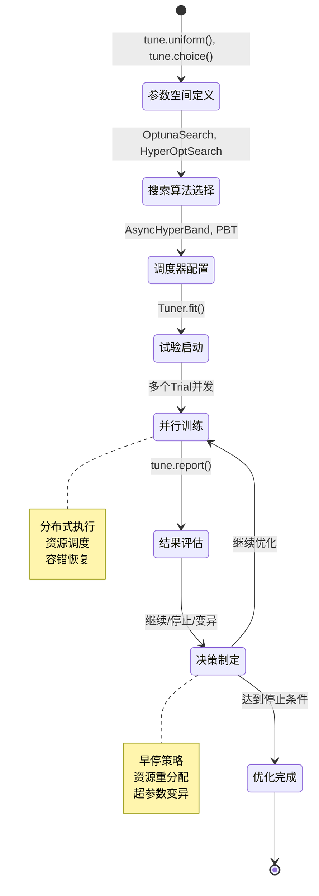
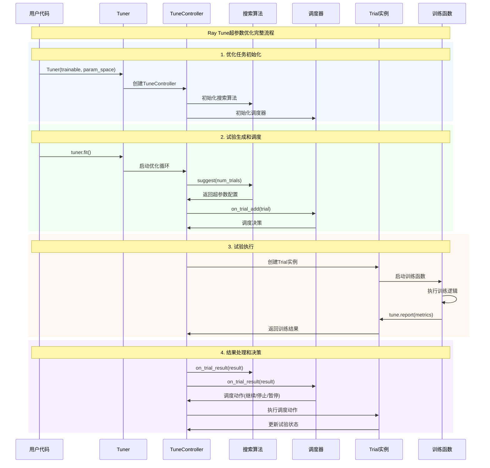

# Ray Tune 超参数优化模块深度剖析

## 目录
- [1. Ray Tune概述](#1-ray-tune概述)
- [2. 核心架构设计](#2-核心架构设计)
- [3. 搜索算法体系](#3-搜索算法体系)
- [4. 试验调度系统](#4-试验调度系统)
- [5. 超参数空间定义](#5-超参数空间定义)
- [6. 使用示例与最佳实践](#6-使用示例与最佳实践)

---

## 1. Ray Tune概述

Ray Tune是Ray生态系统中专门用于超参数优化的库，提供可扩展的超参数搜索和试验管理能力。它支持多种优化算法，能够高效地搜索大规模超参数空间，并与各种机器学习框架集成。

### 1.1 核心特性


### 1.2 超参数优化生命周期



---

## 2. 核心架构设计

### 2.1 Ray Tune整体架构

```mermaid
graph TB
    subgraph "用户接口层"
        A1[Tuner类]
        A2[tune.run()函数]
        A3[参数空间定义]
    end
    
    subgraph "优化算法层"
        B1[SearchAlgorithm<br/>搜索算法]
        B2[TrialScheduler<br/>试验调度器]
        B3[Stopper<br/>停止条件]
    end
    
    subgraph "执行管理层"
        C1[TuneController<br/>优化控制器]
        C2[TrialExecutor<br/>试验执行器]
        C3[ActorManager<br/>Actor管理器]
    end
    
    subgraph "试验运行层"
        D1[Trial实例]
        D2[Trainable类]
        D3[TrainableWrapper]
    end
    
    subgraph "存储管理层"
        E1[CheckpointManager<br/>检查点管理]
        E2[ResultLogger<br/>结果记录]
        E3[ExperimentAnalysis<br/>结果分析]
    end
    
    A1 --> B1
    A2 --> B2
    A3 --> B3
    
    B1 --> C1
    B2 --> C1
    B3 --> C1
    
    C1 --> C2
    C1 --> C3
    
    C2 --> D1
    C3 --> D2
    D1 --> D3
    
    D1 --> E1
    D2 --> E2
    D3 --> E3
    
    style A1 fill:#e3f2fd
    style B1 fill:#e8f5e8
    style C1 fill:#fff3e0
    style D1 fill:#fce4ec
    style E1 fill:#f3e5f5
```

### 2.2 优化流程时序图



---

## 3. 搜索算法体系

### 3.1 搜索算法接口设计

```python
# 搜索算法的基础接口
class SearchAlgorithm:
    """
    超参数搜索算法的基础接口
    
    核心职责：
    1. 生成新的超参数配置
    2. 根据历史结果优化搜索策略
    3. 管理搜索状态和收敛
    4. 支持并发试验建议
    """
    
    def suggest(self, trial_id: str) -> Optional[Dict]:
        """
        建议下一组超参数配置
        
        参数：
            trial_id: 试验的唯一标识符
            
        返回：
            Dict: 超参数配置字典，None表示搜索完成
        """
        raise NotImplementedError
    
    def on_trial_result(self, trial_id: str, result: Dict) -> None:
        """
        接收试验结果，更新搜索状态
        
        参数：
            trial_id: 试验标识符
            result: 包含指标的结果字典
        """
        raise NotImplementedError
    
    def on_trial_complete(
        self, 
        trial_id: str, 
        result: Optional[Dict] = None,
        error: bool = False
    ) -> None:
        """
        处理试验完成事件
        
        功能：
        1. 更新搜索算法的内部状态
        2. 为后续建议提供依据
        3. 检查收敛条件
        """
        raise NotImplementedError

# 贝叶斯优化搜索算法示例
class BayesianOptimizationSearch(SearchAlgorithm):
    """
    贝叶斯优化搜索算法
    
    原理：
    1. 构建目标函数的概率模型（高斯过程）
    2. 使用采集函数平衡探索和利用
    3. 迭代优化找到最优超参数
    
    优势：
    - 样本效率高
    - 适合昂贵的目标函数
    - 提供不确定性量化
    """
    
    def __init__(
        self,
        space: Dict,
        metric: str = "episode_reward_mean",
        mode: str = "max",
        utility_kwargs: Dict = None,
        random_state: int = None,
        **kwargs
    ):
        """
        初始化贝叶斯优化搜索
        
        参数：
            space: 超参数搜索空间
            metric: 优化目标指标
            mode: 优化方向（max/min）
            utility_kwargs: 采集函数参数
            random_state: 随机种子
        """
        from skopt import gp_minimize
        from skopt.space import Real, Integer, Categorical
        
        self._space = space
        self._metric = metric
        self._mode = mode
        self._random_state = random_state
        
        # 转换搜索空间到skopt格式
        self._skopt_space = self._convert_search_space(space)
        
        # 历史数据存储
        self._trials_completed = 0
        self._X = []  # 历史超参数配置
        self._y = []  # 历史目标函数值
        
        # 高斯过程模型
        self._gp_model = None
    
    def suggest(self, trial_id: str) -> Optional[Dict]:
        """
        使用贝叶斯优化建议下一组超参数
        
        算法流程：
        1. 如果历史数据不足，随机采样
        2. 否则使用采集函数找到最有前景的点
        3. 转换回原始参数格式
        """
        if self._trials_completed < 2:
            # 初始随机采样
            return self._random_suggest()
        
        # 使用贝叶斯优化
        from skopt import gp_minimize
        
        # 拟合高斯过程模型
        result = gp_minimize(
            func=lambda x: 0,  # 占位函数
            dimensions=self._skopt_space,
            n_calls=1,
            x0=self._X,
            y0=self._y,
            acq_func="EI",  # Expected Improvement
            random_state=self._random_state
        )
        
        # 获取建议的超参数
        suggested_params = result.x_iters[-1]
        
        # 转换回原始格式
        config = self._convert_to_original_space(suggested_params)
        
        return config
    
    def on_trial_result(self, trial_id: str, result: Dict):
        """更新贝叶斯优化模型"""
        if self._metric in result:
            # 暂存结果，等待试验完成
            self._pending_results[trial_id] = result[self._metric]
    
    def on_trial_complete(self, trial_id: str, result: Dict = None, error: bool = False):
        """完成试验，更新模型"""
        if not error and trial_id in self._pending_results:
            metric_value = self._pending_results[trial_id]
            
            # 转换目标值（最小化统一）
            if self._mode == "max":
                metric_value = -metric_value
            
            # 添加到历史数据
            config = self._trial_configs[trial_id]
            params = self._convert_to_skopt_space(config)
            
            self._X.append(params)
            self._y.append(metric_value)
            self._trials_completed += 1
            
            # 清理临时数据
            del self._pending_results[trial_id]
            del self._trial_configs[trial_id]

# 种群进化搜索算法
class EvolutionarySearch(SearchAlgorithm):
    """
    进化算法搜索
    
    原理：
    1. 维护一个超参数配置的种群
    2. 通过选择、交叉、变异操作进化
    3. 保留适应度高的个体
    """
    
    def __init__(
        self,
        space: Dict,
        population_size: int = 20,
        mutation_rate: float = 0.1,
        crossover_rate: float = 0.8,
        **kwargs
    ):
        self._space = space
        self._population_size = population_size
        self._mutation_rate = mutation_rate
        self._crossover_rate = crossover_rate
        
        # 种群状态
        self._population = []
        self._fitness_scores = []
        self._generation = 0
    
    def suggest(self, trial_id: str) -> Optional[Dict]:
        """基于进化算法建议超参数"""
        if len(self._population) < self._population_size:
            # 初始化种群
            return self._random_individual()
        
        # 选择、交叉、变异
        parent1 = self._tournament_selection()
        parent2 = self._tournament_selection()
        
        if random.random() < self._crossover_rate:
            offspring = self._crossover(parent1, parent2)
        else:
            offspring = parent1.copy()
        
        if random.random() < self._mutation_rate:
            offspring = self._mutate(offspring)
        
        return offspring
    
    def _tournament_selection(self) -> Dict:
        """锦标赛选择"""
        tournament_size = min(3, len(self._population))
        candidates = random.sample(
            list(zip(self._population, self._fitness_scores)), 
            tournament_size
        )
        
        # 选择适应度最高的个体
        best_individual, _ = max(candidates, key=lambda x: x[1])
        return best_individual.copy()
    
    def _crossover(self, parent1: Dict, parent2: Dict) -> Dict:
        """交叉操作"""
        offspring = {}
        
        for key in parent1.keys():
            if random.random() < 0.5:
                offspring[key] = parent1[key]
            else:
                offspring[key] = parent2[key]
        
        return offspring
    
    def _mutate(self, individual: Dict) -> Dict:
        """变异操作"""
        mutated = individual.copy()
        
        # 随机选择一个参数进行变异
        param_to_mutate = random.choice(list(mutated.keys()))
        
        # 根据参数类型进行变异
        if isinstance(mutated[param_to_mutate], float):
            # 高斯噪声变异
            noise = random.gauss(0, 0.1)
            mutated[param_to_mutate] *= (1 + noise)
        elif isinstance(mutated[param_to_mutate], int):
            # 整数随机变异
            mutated[param_to_mutate] += random.randint(-2, 2)
        
        return mutated
```

---

## 4. 试验调度系统

### 4.1 AsyncHyperBand调度器

```python
"""
AsyncHyperBand - 异步超参数调度算法

基于HyperBand算法的异步实现，能够：
1. 早停表现不佳的试验
2. 动态分配计算资源
3. 支持并发试验执行
"""

from ray.tune.schedulers import AsyncHyperBandScheduler

class AsyncHyperBandScheduler(TrialScheduler):
    """
    异步HyperBand调度器实现
    
    核心算法：
    1. 连续减半策略 - 逐步淘汰表现差的试验
    2. 异步执行 - 不等待所有试验完成
    3. 资源重分配 - 将资源从被停止的试验转移
    
    参数说明：
        time_attr: 时间属性（如training_iteration）
        metric: 优化目标指标
        mode: 优化方向（max/min）
        max_t: 每个试验的最大时间/迭代数
        reduction_factor: 减半因子，默认4
        brackets: 并发bracket数量
    """
    
    def __init__(
        self,
        time_attr: str = "training_iteration",
        metric: Optional[str] = None,
        mode: Optional[str] = None,
        max_t: int = 81,
        reduction_factor: float = 4,
        brackets: int = 1,
        grace_period: int = 1,
        stop_last_trials: bool = True,
    ):
        """
        初始化AsyncHyperBand调度器
        
        算法参数：
            max_t: 单个试验最大运行时间
            reduction_factor: 每轮淘汰的比例倒数
            brackets: 同时运行的bracket数量
            grace_period: 保护期，试验在此期间不会被停止
        """
        self._time_attr = time_attr
        self._metric = metric
        self._mode = mode
        self._max_t = max_t
        self._reduction_factor = reduction_factor
        self._brackets = brackets
        self._grace_period = grace_period
        
        # HyperBand bracket管理
        self._hyperbands = [
            _HyperBandState(
                max_t=max_t,
                reduction_factor=reduction_factor,
                s=s
            ) for s in range(brackets)
        ]
        
        # 试验状态跟踪
        self._trial_to_bracket = {}
        self._bracket_to_trials = defaultdict(set)
    
    def on_trial_add(self, trial: Trial) -> TrialSchedulerDecision:
        """
        添加新试验到调度器
        
        决策逻辑：
        1. 选择合适的bracket
        2. 分配资源预算
        3. 设置停止条件
        """
        # 选择负载最轻的bracket
        bracket_idx = self._select_bracket()
        bracket = self._hyperbands[bracket_idx]
        
        # 添加试验到bracket
        bracket.add_trial(trial)
        self._trial_to_bracket[trial] = bracket_idx
        self._bracket_to_trials[bracket_idx].add(trial)
        
        return TrialSchedulerDecision.CONTINUE
    
    def on_trial_result(self, trial: Trial, result: Dict) -> TrialSchedulerDecision:
        """
        处理试验结果，决定继续或停止
        
        决策流程：
        1. 检查是否达到当前阶段的预算
        2. 与同bracket其他试验比较
        3. 决定是否进入下一阶段
        """
        bracket_idx = self._trial_to_bracket[trial]
        bracket = self._hyperbands[bracket_idx]
        
        # 更新bracket状态
        decision = bracket.on_result(trial, result)
        
        if decision == TrialSchedulerDecision.STOP:
            # 试验被停止，释放资源
            self._bracket_to_trials[bracket_idx].remove(trial)
            del self._trial_to_bracket[trial]
        
        return decision
    
    def on_trial_complete(self, trial: Trial, result: Dict) -> None:
        """试验完成处理"""
        if trial in self._trial_to_bracket:
            bracket_idx = self._trial_to_bracket[trial]
            self._bracket_to_trials[bracket_idx].discard(trial)
            del self._trial_to_bracket[trial]

class _HyperBandState:
    """
    单个HyperBand bracket的状态管理
    
    功能：
    1. 管理连续减半的轮次
    2. 跟踪每轮的预算分配
    3. 执行淘汰决策
    """
    
    def __init__(self, max_t: int, reduction_factor: float, s: int):
        """
        初始化bracket状态
        
        参数：
            max_t: 最大时间预算
            reduction_factor: 减半因子
            s: bracket配置参数
        """
        self.max_t = max_t
        self.reduction_factor = reduction_factor
        self.s = s
        
        # 计算每轮的配置
        self.rounds = []
        r = s
        while r >= 0:
            n_configs = int(math.ceil(reduction_factor ** r))
            budget = max_t * (reduction_factor ** (-r))
            self.rounds.append({
                'n_configs': n_configs,
                'budget': budget,
                'trials': set()
            })
            r -= 1
        
        self.current_round = 0
    
    def add_trial(self, trial: Trial):
        """添加试验到当前轮次"""
        if self.current_round < len(self.rounds):
            self.rounds[self.current_round]['trials'].add(trial)
            trial._hyperband_bracket = self.s
            trial._hyperband_round = self.current_round
    
    def on_result(self, trial: Trial, result: Dict) -> TrialSchedulerDecision:
        """
        处理试验结果，决定调度动作
        
        算法逻辑：
        1. 检查是否达到当前轮次预算
        2. 如果达到，进行排序和淘汰
        3. 晋级的试验进入下一轮
        """
        round_idx = trial._hyperband_round
        current_round = self.rounds[round_idx]
        
        # 检查是否达到当前轮次预算
        time_used = result.get(self._time_attr, 0)
        if time_used >= current_round['budget']:
            # 达到预算，检查是否需要晋级
            return self._promote_or_stop_trial(trial, result)
        
        return TrialSchedulerDecision.CONTINUE
    
    def _promote_or_stop_trial(self, trial: Trial, result: Dict) -> TrialSchedulerDecision:
        """决定试验晋级或停止"""
        round_idx = trial._hyperband_round
        
        # 收集同轮次所有试验的性能
        round_trials = list(self.rounds[round_idx]['trials'])
        round_results = []
        
        for t in round_trials:
            if hasattr(t, '_latest_result'):
                round_results.append((t, t._latest_result.get(self._metric, 0)))
        
        # 排序选择前1/reduction_factor的试验
        round_results.sort(key=lambda x: x[1], reverse=(self._mode == "max"))
        
        n_promote = max(1, len(round_results) // self.reduction_factor)
        promoted_trials = [t for t, _ in round_results[:n_promote]]
        
        if trial in promoted_trials and round_idx + 1 < len(self.rounds):
            # 晋级到下一轮
            self.rounds[round_idx + 1]['trials'].add(trial)
            trial._hyperband_round = round_idx + 1
            return TrialSchedulerDecision.CONTINUE
        else:
            # 被淘汰
            return TrialSchedulerDecision.STOP
```

### 4.2 PopulationBasedTraining实现

```python
# 位置: python/ray/tune/schedulers/pbt.py:233-375
@PublicAPI
class PopulationBasedTraining(FIFOScheduler):
    """
    基于种群的训练（PBT）调度器
    
    核心思想：
    1. 并行训练一个模型种群
    2. 周期性地让表现差的模型复制表现好的模型
    3. 对复制的模型进行超参数变异
    4. 实现超参数的在线优化
    
    优势：
    - 训练和搜索同时进行
    - 能发现动态超参数调度
    - 对资源利用率高
    - 适合长时间训练的任务
    """
    
    def __init__(
        self,
        time_attr: str = "time_total_s",
        metric: Optional[str] = None,
        mode: Optional[str] = None,
        perturbation_interval: float = 60.0,
        burn_in_period: float = 0.0,
        hyperparam_mutations: Dict = None,
        quantile_fraction: float = 0.25,
        resample_probability: float = 0.25,
        perturbation_factors: Tuple[float, float] = (1.2, 0.8),
        custom_explore_fn: Optional[Callable] = None,
        log_config: bool = True,
        require_attrs: bool = True,
        synch: bool = False,
    ):
        """
        初始化PBT调度器
        
        核心参数：
            perturbation_interval: 扰动间隔（秒或迭代数）
            burn_in_period: 预热期，在此期间不进行扰动
            hyperparam_mutations: 可变异的超参数定义
            quantile_fraction: 前/后百分比，用于选择复制源和目标
            resample_probability: 重新采样的概率
            perturbation_factors: 连续参数的扰动因子
        """
        super().__init__()
        
        self._time_attr = time_attr
        self._metric = metric
        self._mode = mode
        self._perturbation_interval = perturbation_interval
        self._burn_in_period = burn_in_period
        self._hyperparam_mutations = hyperparam_mutations or {}
        self._quantile_fraction = quantile_fraction
        self._resample_probability = resample_probability
        self._perturbation_factors = perturbation_factors
        self._custom_explore_fn = custom_explore_fn
        
        # PBT状态管理
        self._population_history = []
        self._last_perturbation_time = 0
        
        # 验证配置
        self._validate_config()
    
    def on_trial_result(self, trial: Trial, result: Dict) -> TrialSchedulerDecision:
        """
        处理试验结果，决定是否执行PBT操作
        
        PBT决策流程：
        1. 检查是否到达扰动间隔
        2. 评估当前种群的性能分布
        3. 选择表现差的试验进行exploit
        4. 选择表现好的试验作为复制源
        5. 执行复制和变异操作
        """
        time_value = result.get(self._time_attr, 0)
        
        # 检查是否在预热期
        if time_value < self._burn_in_period:
            return TrialSchedulerDecision.CONTINUE
        
        # 检查是否到达扰动间隔
        if time_value - self._last_perturbation_time < self._perturbation_interval:
            return TrialSchedulerDecision.CONTINUE
        
        # 执行PBT扰动
        decision = self._maybe_exploit_and_explore(trial, result)
        
        if decision == TrialSchedulerDecision.STOP_AND_RESTART:
            self._last_perturbation_time = time_value
        
        return decision
    
    def _maybe_exploit_and_explore(self, trial: Trial, result: Dict) -> TrialSchedulerDecision:
        """
        PBT的exploit和explore阶段
        
        Exploit阶段：
        1. 识别表现差的试验（bottom quantile）
        2. 选择表现好的试验作为复制源（top quantile）
        3. 复制模型状态和超参数
        
        Explore阶段：
        1. 对复制的超参数进行变异
        2. 应用自定义探索函数
        3. 生成新的配置
        """
        # 获取当前种群状态
        population = self._get_live_population()
        
        if len(population) < 2:
            return TrialSchedulerDecision.CONTINUE
        
        # 按性能排序
        sorted_population = self._sort_population_by_performance(population)
        
        # 计算分位数
        bottom_quantile_size = max(1, int(len(population) * self._quantile_fraction))
        top_quantile_size = max(1, int(len(population) * self._quantile_fraction))
        
        bottom_trials = sorted_population[-bottom_quantile_size:]
        top_trials = sorted_population[:top_quantile_size]
        
        # 检查当前试验是否在bottom quantile
        if trial not in [t for t, _ in bottom_trials]:
            return TrialSchedulerDecision.CONTINUE
        
        # 选择复制源（从top quantile随机选择）
        source_trial, _ = random.choice(top_trials)
        
        # 执行exploit和explore
        new_config = self._exploit_and_explore(trial, source_trial)
        
        # 更新试验配置
        trial.config.update(new_config)
        
        # 标记需要重启（从新检查点开始）
        return TrialSchedulerDecision.STOP_AND_RESTART
    
    def _exploit_and_explore(self, target_trial: Trial, source_trial: Trial) -> Dict:
        """
        执行exploit（复制）和explore（变异）
        
        步骤：
        1. 复制源试验的检查点到目标试验
        2. 复制超参数配置
        3. 对超参数进行变异
        """
        # 1. 复制检查点
        source_checkpoint = source_trial.checkpoint_manager.newest_checkpoint
        if source_checkpoint:
            target_trial.restore_from_checkpoint(source_checkpoint)
        
        # 2. 复制超参数配置
        new_config = source_trial.config.copy()
        
        # 3. 变异超参数
        for param_name, mutation_spec in self._hyperparam_mutations.items():
            if param_name in new_config:
                new_config[param_name] = self._mutate_parameter(
                    param_name, 
                    new_config[param_name], 
                    mutation_spec
                )
        
        # 4. 应用自定义探索函数
        if self._custom_explore_fn:
            new_config = self._custom_explore_fn(new_config)
        
        # 5. 记录变异日志
        self._log_perturbation(target_trial, source_trial, new_config)
        
        return new_config
    
    def _mutate_parameter(self, param_name: str, current_value: Any, mutation_spec: Any) -> Any:
        """
        变异单个超参数
        
        变异策略：
        1. 重新采样（按resample_probability概率）
        2. 扰动当前值（连续参数）
        3. 选择相邻值（离散参数）
        """
        if random.random() < self._resample_probability:
            # 重新采样
            if callable(mutation_spec):
                return mutation_spec()
            elif isinstance(mutation_spec, list):
                return random.choice(mutation_spec)
            elif hasattr(mutation_spec, 'sample'):
                return mutation_spec.sample()
        
        # 扰动当前值
        if isinstance(current_value, (int, float)):
            # 连续参数扰动
            factor = random.choice(self._perturbation_factors)
            return current_value * factor
        elif isinstance(mutation_spec, list):
            # 离散参数选择相邻值
            try:
                current_idx = mutation_spec.index(current_value)
                # 选择相邻的值
                if current_idx > 0 and current_idx < len(mutation_spec) - 1:
                    return random.choice([
                        mutation_spec[current_idx - 1],
                        mutation_spec[current_idx + 1]
                    ])
                elif current_idx == 0:
                    return mutation_spec[1]
                else:
                    return mutation_spec[current_idx - 1]
            except ValueError:
                # 当前值不在列表中，随机选择
                return random.choice(mutation_spec)
        
        return current_value
    
    def _sort_population_by_performance(self, population: List[Trial]) -> List[Tuple[Trial, float]]:
        """按性能排序种群"""
        trial_performances = []
        
        for trial in population:
            if hasattr(trial, '_latest_result') and self._metric in trial._latest_result:
                performance = trial._latest_result[self._metric]
                trial_performances.append((trial, performance))
        
        # 按指标排序（mode="max"时降序，mode="min"时升序）
        reverse = (self._mode == "max")
        trial_performances.sort(key=lambda x: x[1], reverse=reverse)
        
        return trial_performances
```

---

## 5. 超参数空间定义

### 5.1 搜索空间API

```python
"""
Ray Tune超参数空间定义API

提供了丰富的搜索空间定义方式：
1. 连续分布：uniform, loguniform, normal
2. 离散分布：choice, randint, lograndint  
3. 网格搜索：grid_search
4. 条件搜索：sample_from
"""

import ray.tune as tune
import numpy as np

# 1. 基础分布类型
def basic_search_spaces():
    """基础搜索空间定义"""
    
    search_space = {
        # 连续uniform分布
        "learning_rate": tune.uniform(0.001, 0.1),
        
        # 对数uniform分布（适合跨几个数量级的参数）
        "lr_log": tune.loguniform(1e-5, 1e-1),
        
        # 正态分布
        "momentum": tune.normal(0.9, 0.05),
        
        # 离散选择
        "optimizer": tune.choice(["adam", "sgd", "rmsprop"]),
        
        # 随机整数
        "batch_size": tune.randint(16, 256),
        
        # 对数随机整数  
        "hidden_size": tune.lograndint(32, 1024, base=2),
        
        # 网格搜索
        "activation": tune.grid_search(["relu", "tanh", "sigmoid"]),
        
        # 条件参数
        "dropout_rate": tune.sample_from(
            lambda spec: 0.0 if spec.config.optimizer == "adam" else tune.uniform(0.1, 0.5)
        ),
    }
    
    return search_space

# 2. 嵌套和条件搜索空间
def nested_search_spaces():
    """嵌套和条件搜索空间"""
    
    def get_model_config(spec):
        """条件模型配置"""
        model_type = spec.config["model_type"]
        
        if model_type == "cnn":
            return {
                "conv_layers": tune.randint(2, 5),
                "conv_filters": tune.choice([32, 64, 128]),
                "kernel_size": tune.choice([3, 5]),
            }
        elif model_type == "rnn":
            return {
                "rnn_type": tune.choice(["lstm", "gru"]),
                "hidden_size": tune.randint(64, 512),
                "num_layers": tune.randint(1, 4),
            }
        else:  # mlp
            return {
                "hidden_layers": tune.randint(2, 6),
                "hidden_size": tune.randint(128, 1024),
            }
    
    search_space = {
        # 主要模型类型
        "model_type": tune.choice(["cnn", "rnn", "mlp"]),
        
        # 条件模型配置
        "model_config": tune.sample_from(get_model_config),
        
        # 嵌套配置
        "optimizer_config": {
            "type": tune.choice(["adam", "sgd"]),
            "lr": tune.loguniform(1e-5, 1e-1),
            "weight_decay": tune.uniform(0, 0.01),
        },
        
        # 数据增强配置
        "augmentation": {
            "enabled": tune.choice([True, False]),
            "rotation": tune.uniform(0, 30),
            "brightness": tune.uniform(0.8, 1.2),
        }
    }
    
    return search_space

# 3. 自定义分布
class CustomDistribution:
    """自定义超参数分布"""
    
    @staticmethod
    def beta_distribution(alpha: float, beta: float):
        """Beta分布采样"""
        def sample_fn(spec):
            return np.random.beta(alpha, beta)
        return tune.sample_from(sample_fn)
    
    @staticmethod
    def mixture_distribution(distributions: List[Tuple[float, Any]]):
        """混合分布采样"""
        def sample_fn(spec):
            # 按权重选择分布
            weights = [w for w, _ in distributions]
            chosen_dist = np.random.choice(
                [d for _, d in distributions], 
                p=weights / np.sum(weights)
            )
            
            if callable(chosen_dist):
                return chosen_dist()
            elif hasattr(chosen_dist, 'sample'):
                return chosen_dist.sample()
            else:
                return chosen_dist
        
        return tune.sample_from(sample_fn)
    
    @staticmethod
    def conditional_lr_schedule():
        """条件学习率调度"""
        def lr_schedule_fn(spec):
            optimizer = spec.config.get("optimizer", "adam")
            
            if optimizer == "adam":
                return tune.loguniform(1e-4, 1e-2)
            elif optimizer == "sgd":
                return tune.loguniform(1e-3, 1e-1)
            else:
                return tune.uniform(1e-4, 1e-1)
        
        return tune.sample_from(lr_schedule_fn)

# 4. 搜索空间优化技巧
class SearchSpaceOptimization:
    """搜索空间优化技巧"""
    
    @staticmethod
    def hierarchical_search():
        """分层搜索策略"""
        
        # 第一阶段：粗粒度搜索
        coarse_space = {
            "lr": tune.loguniform(1e-5, 1e-1),
            "batch_size": tune.choice([32, 64, 128, 256]),
            "hidden_size": tune.choice([128, 256, 512]),
        }
        
        # 第二阶段：细粒度搜索（基于第一阶段结果）
        def fine_space_from_coarse_results(best_config):
            """基于粗搜索结果定义细搜索空间"""
            best_lr = best_config["lr"]
            best_batch_size = best_config["batch_size"]
            
            return {
                "lr": tune.uniform(best_lr * 0.5, best_lr * 2.0),
                "batch_size": tune.choice([
                    max(16, best_batch_size // 2),
                    best_batch_size,
                    min(512, best_batch_size * 2)
                ]),
                "lr_schedule": tune.choice(["constant", "cosine", "exponential"]),
                "warmup_steps": tune.randint(0, 1000),
            }
        
        return coarse_space, fine_space_from_coarse_results
    
    @staticmethod
    def constraint_based_search():
        """约束导向的搜索空间"""
        
        def constrained_sample(spec):
            """带约束的采样函数"""
            # 确保batch_size * num_workers 不超过内存限制
            max_total_batch = 2048
            num_workers = spec.config.get("num_workers", 1)
            max_batch_per_worker = max_total_batch // num_workers
            
            return tune.randint(16, min(256, max_batch_per_worker))
        
        search_space = {
            "num_workers": tune.choice([1, 2, 4, 8]),
            "batch_size": tune.sample_from(constrained_sample),
            
            # GPU内存约束
            "model_size": tune.sample_from(
                lambda spec: "large" if spec.config.get("num_gpus", 0) > 1 else tune.choice(["small", "medium"])
            ),
        }
        
        return search_space
```

---

## 6. 使用示例与最佳实践

### 6.1 完整超参数优化示例

```python
"""
Ray Tune超参数优化完整示例
演示从搜索空间定义到结果分析的完整流程
"""

import time
import torch
import torch.nn as nn
import torch.optim as optim

import ray
from ray import tune
from ray.tune.schedulers import AsyncHyperBandScheduler, PopulationBasedTraining
from ray.tune.search.optuna import OptunaSearch
from ray.tune.search.hyperopt import HyperOptSearch

# 1. 定义训练函数
def train_mnist(config):
    """
    MNIST分类模型训练函数
    
    超参数：
    - learning_rate: 学习率
    - batch_size: 批量大小
    - hidden_size: 隐藏层大小
    - num_layers: 层数
    - dropout_rate: Dropout比率
    """
    
    # 获取超参数
    lr = config["learning_rate"]
    batch_size = config["batch_size"] 
    hidden_size = config["hidden_size"]
    num_layers = config["num_layers"]
    dropout_rate = config["dropout_rate"]
    
    # 数据加载
    train_loader, test_loader = load_mnist_data(batch_size)
    
    # 模型定义
    class MLP(nn.Module):
        def __init__(self, input_size, hidden_size, num_layers, num_classes, dropout_rate):
            super(MLP, self).__init__()
            
            layers = []
            layers.append(nn.Linear(input_size, hidden_size))
            layers.append(nn.ReLU())
            layers.append(nn.Dropout(dropout_rate))
            
            for _ in range(num_layers - 1):
                layers.append(nn.Linear(hidden_size, hidden_size))
                layers.append(nn.ReLU())
                layers.append(nn.Dropout(dropout_rate))
            
            layers.append(nn.Linear(hidden_size, num_classes))
            
            self.network = nn.Sequential(*layers)
        
        def forward(self, x):
            return self.network(x.view(x.size(0), -1))
    
    # 初始化模型和优化器
    device = torch.device("cuda" if torch.cuda.is_available() else "cpu")
    model = MLP(28*28, hidden_size, num_layers, 10, dropout_rate).to(device)
    
    optimizer_type = config.get("optimizer", "adam")
    if optimizer_type == "adam":
        optimizer = optim.Adam(model.parameters(), lr=lr)
    elif optimizer_type == "sgd":
        optimizer = optim.SGD(model.parameters(), lr=lr, momentum=0.9)
    
    criterion = nn.CrossEntropyLoss()
    
    # 训练循环
    num_epochs = config.get("num_epochs", 10)
    
    for epoch in range(num_epochs):
        # 训练阶段
        model.train()
        train_loss = 0.0
        train_correct = 0
        train_total = 0
        
        for batch_idx, (data, target) in enumerate(train_loader):
            data, target = data.to(device), target.to(device)
            
            optimizer.zero_grad()
            output = model(data)
            loss = criterion(output, target)
            loss.backward()
            optimizer.step()
            
            train_loss += loss.item()
            _, predicted = output.max(1)
            train_total += target.size(0)
            train_correct += predicted.eq(target).sum().item()
        
        # 验证阶段
        model.eval()
        test_loss = 0.0
        test_correct = 0
        test_total = 0
        
        with torch.no_grad():
            for data, target in test_loader:
                data, target = data.to(device), target.to(device)
                output = model(data)
                loss = criterion(output, target)
                
                test_loss += loss.item()
                _, predicted = output.max(1)
                test_total += target.size(0)
                test_correct += predicted.eq(target).sum().item()
        
        # 计算指标
        train_accuracy = 100.0 * train_correct / train_total
        test_accuracy = 100.0 * test_correct / test_total
        
        # 报告中间结果
        tune.report(
            epoch=epoch,
            train_loss=train_loss / len(train_loader),
            train_accuracy=train_accuracy,
            test_loss=test_loss / len(test_loader),
            test_accuracy=test_accuracy,
        )

# 2. 多算法比较示例
def compare_optimization_algorithms():
    """比较不同优化算法的性能"""
    
    # 定义搜索空间
    search_space = {
        "learning_rate": tune.loguniform(1e-5, 1e-1),
        "batch_size": tune.choice([32, 64, 128, 256]),
        "hidden_size": tune.choice([128, 256, 512, 1024]),
        "num_layers": tune.randint(2, 6),
        "dropout_rate": tune.uniform(0.1, 0.5),
        "optimizer": tune.choice(["adam", "sgd", "rmsprop"]),
    }
    
    algorithms_to_test = [
        {
            "name": "Random Search",
            "search_alg": None,  # 默认随机搜索
            "scheduler": None,
            "num_samples": 100,
        },
        {
            "name": "Optuna (TPE)",
            "search_alg": OptunaSearch(metric="test_accuracy", mode="max"),
            "scheduler": AsyncHyperBandScheduler(
                metric="test_accuracy", 
                mode="max",
                max_t=10,
                grace_period=2
            ),
            "num_samples": 50,
        },
        {
            "name": "HyperOpt",
            "search_alg": HyperOptSearch(
                metric="test_accuracy", 
                mode="max",
                points_to_evaluate=[{
                    "learning_rate": 0.01,
                    "batch_size": 128,
                    "hidden_size": 256,
                    "num_layers": 3,
                    "dropout_rate": 0.3,
                    "optimizer": "adam"
                }]  # 预设的好配置
            ),
            "scheduler": AsyncHyperBandScheduler(
                metric="test_accuracy",
                mode="max", 
                max_t=10,
                grace_period=2
            ),
            "num_samples": 50,
        },
        {
            "name": "Population Based Training",
            "search_alg": None,
            "scheduler": PopulationBasedTraining(
                time_attr="epoch",
                metric="test_accuracy",
                mode="max",
                perturbation_interval=3,
                hyperparam_mutations={
                    "learning_rate": tune.loguniform(1e-5, 1e-1),
                    "dropout_rate": tune.uniform(0.1, 0.5),
                    "batch_size": [32, 64, 128, 256],
                }
            ),
            "num_samples": 20,  # PBT种群大小
        }
    ]
    
    results = {}
    
    for alg_config in algorithms_to_test:
        print(f"Testing {alg_config['name']}...")
        
        tuner = tune.Tuner(
            train_mnist,
            param_space=search_space,
            tune_config=tune.TuneConfig(
                metric="test_accuracy",
                mode="max",
                search_alg=alg_config["search_alg"],
                scheduler=alg_config["scheduler"],
                num_samples=alg_config["num_samples"],
            ),
            run_config=tune.RunConfig(
                name=f"mnist_optimization_{alg_config['name'].lower().replace(' ', '_')}",
                stop={"epoch": 10},
                storage_path="./tune_results",
            )
        )
        
        result = tuner.fit()
        results[alg_config['name']] = result
        
        # 分析结果
        best_result = result.get_best_result()
        print(f"{alg_config['name']} - Best accuracy: {best_result.metrics['test_accuracy']:.4f}")
        print(f"Best config: {best_result.config}")
    
    return results

# 3. 高级优化策略
def advanced_optimization_strategies():
    """高级优化策略示例"""
    
    # 1. 多目标优化
    def multi_objective_trainable(config):
        """多目标优化的训练函数"""
        # ... 训练逻辑 ...
        
        # 报告多个目标指标
        tune.report(
            accuracy=accuracy,
            inference_time=inference_time,  # 推理速度
            model_size=model_size,          # 模型大小
            memory_usage=memory_usage,      # 内存使用
        )
    
    # 定义多目标搜索
    multi_objective_space = {
        "learning_rate": tune.loguniform(1e-5, 1e-1),
        "model_complexity": tune.uniform(0.1, 1.0),  # 控制模型复杂度
        "compression_ratio": tune.uniform(0.1, 1.0), # 模型压缩比例
    }
    
    # 2. 预算感知优化
    def budget_aware_optimization():
        """预算感知的超参数优化"""
        
        # 定义多保真度训练函数
        def multi_fidelity_trainable(config):
            max_epochs = config.get("max_epochs", 100)
            checkpoint_freq = max(1, max_epochs // 10)
            
            for epoch in range(max_epochs):
                # ... 训练逻辑 ...
                
                # 定期报告和检查点
                if epoch % checkpoint_freq == 0:
                    with tune.checkpoint_dir(epoch) as checkpoint_dir:
                        # 保存模型状态
                        torch.save(model.state_dict(), 
                                 os.path.join(checkpoint_dir, "model.pth"))
                    
                    tune.report(
                        epoch=epoch,
                        accuracy=current_accuracy,
                        should_checkpoint=True
                    )
        
        # 使用ASHA调度器进行多保真度优化
        asha_scheduler = AsyncHyperBandScheduler(
            time_attr="epoch",
            metric="accuracy",
            mode="max",
            max_t=100,        # 最大训练轮数
            reduction_factor=3,
            grace_period=10,  # 保护期
        )
        
        # 配置预算感知的搜索
        budget_aware_space = {
            "learning_rate": tune.loguniform(1e-5, 1e-1),
            "batch_size": tune.choice([32, 64, 128]),
            # 最大训练轮数作为超参数
            "max_epochs": tune.choice([20, 50, 100]),
        }
        
        return multi_fidelity_trainable, asha_scheduler, budget_aware_space
    
    # 3. 自适应搜索策略
    def adaptive_search_strategy():
        """自适应搜索策略"""
        
        class AdaptiveSearchAlgorithm(tune.search.SearchAlgorithm):
            """自适应搜索算法"""
            
            def __init__(self, initial_space, adaptation_interval=10):
                self.current_space = initial_space
                self.adaptation_interval = adaptation_interval
                self.trials_since_adaptation = 0
                self.performance_history = []
            
            def suggest(self, trial_id):
                # 检查是否需要适应搜索空间
                if self.trials_since_adaptation >= self.adaptation_interval:
                    self._adapt_search_space()
                    self.trials_since_adaptation = 0
                
                # 从当前搜索空间采样
                config = {}
                for param, space in self.current_space.items():
                    config[param] = space.sample()
                
                self.trials_since_adaptation += 1
                return config
            
            def _adapt_search_space(self):
                """根据历史性能调整搜索空间"""
                if len(self.performance_history) < self.adaptation_interval:
                    return
                
                # 分析最近的性能趋势
                recent_performance = self.performance_history[-self.adaptation_interval:]
                
                if self._is_performance_improving(recent_performance):
                    # 性能提升，缩小搜索空间
                    self._narrow_search_space()
                else:
                    # 性能停滞，扩大搜索空间
                    self._expand_search_space()
            
            def _narrow_search_space(self):
                """缩小搜索空间，细化搜索"""
                # 基于最佳配置缩小范围
                best_configs = self._get_top_configs(k=5)
                
                for param in self.current_space:
                    values = [config[param] for config in best_configs]
                    if isinstance(values[0], (int, float)):
                        min_val = min(values)
                        max_val = max(values)
                        margin = (max_val - min_val) * 0.2
                        
                        self.current_space[param] = tune.uniform(
                            max(0, min_val - margin),
                            max_val + margin
                        )
            
            def _expand_search_space(self):
                """扩大搜索空间，增加探索"""
                # 恢复到初始搜索空间或扩大范围
                pass
        
        return AdaptiveSearchAlgorithm

# 4. 分布式超参数优化
def distributed_hyperparameter_optimization():
    """分布式超参数优化"""
    
    # 启动Ray集群
    ray.init(address="ray://head-node:10001")  # 连接到Ray集群
    
    # 定义资源感知的搜索空间
    def resource_aware_config(spec):
        """资源感知的配置生成"""
        available_gpus = ray.cluster_resources().get("GPU", 0)
        
        if available_gpus >= 8:
            # 高资源配置
            return {
                "model_size": "large",
                "batch_size": tune.choice([128, 256, 512]),
                "num_workers": tune.choice([4, 8]),
            }
        elif available_gpus >= 4:
            # 中等资源配置
            return {
                "model_size": "medium", 
                "batch_size": tune.choice([64, 128, 256]),
                "num_workers": tune.choice([2, 4]),
            }
        else:
            # 低资源配置
            return {
                "model_size": "small",
                "batch_size": tune.choice([32, 64]),
                "num_workers": 1,
            }
    
    search_space = {
        "learning_rate": tune.loguniform(1e-5, 1e-1),
        "resource_config": tune.sample_from(resource_aware_config),
    }
    
    # 配置分布式调度
    tuner = tune.Tuner(
        tune.with_resources(
            train_mnist,
            resources={"cpu": 4, "gpu": 1}  # 每个trial的资源需求
        ),
        param_space=search_space,
        tune_config=tune.TuneConfig(
            metric="test_accuracy",
            mode="max",
            num_samples=100,
            max_concurrent_trials=10,  # 最大并发trial数
        ),
        run_config=tune.RunConfig(
            name="distributed_optimization",
            storage_path="/shared/storage/tune_results",  # 共享存储
        )
    )
    
    results = tuner.fit()
    return results

# 5. 实验结果分析
def analyze_optimization_results(results):
    """分析优化结果"""
    
    # 获取最佳结果
    best_result = results.get_best_result()
    print(f"Best trial config: {best_result.config}")
    print(f"Best trial final accuracy: {best_result.metrics['test_accuracy']}")
    
    # 参数重要性分析
    df = results.get_dataframe()
    
    # 计算参数相关性
    import pandas as pd
    import matplotlib.pyplot as plt
    import seaborn as sns
    
    # 选择数值参数进行分析
    numeric_params = ['learning_rate', 'batch_size', 'hidden_size', 'dropout_rate']
    correlation_data = df[numeric_params + ['test_accuracy']].corr()
    
    # 可视化相关性热图
    plt.figure(figsize=(10, 8))
    sns.heatmap(correlation_data, annot=True, cmap='coolwarm', center=0)
    plt.title('Hyperparameter Correlation Analysis')
    plt.tight_layout()
    plt.savefig('hyperparameter_correlation.png')
    
    # 参数分布分析
    fig, axes = plt.subplots(2, 2, figsize=(15, 10))
    
    for i, param in enumerate(numeric_params):
        ax = axes[i//2, i%2]
        
        # 散点图：参数值 vs 性能
        ax.scatter(df[param], df['test_accuracy'], alpha=0.6)
        ax.set_xlabel(param)
        ax.set_ylabel('Test Accuracy')
        ax.set_title(f'{param} vs Performance')
    
    plt.tight_layout()
    plt.savefig('parameter_analysis.png')
    
    # Top-K配置分析
    top_k = 10
    top_trials = df.nlargest(top_k, 'test_accuracy')
    
    print(f"\nTop {top_k} configurations:")
    for idx, (_, trial) in enumerate(top_trials.iterrows()):
        print(f"{idx+1}. Accuracy: {trial['test_accuracy']:.4f}")
        print(f"   Config: {trial[numeric_params].to_dict()}")
    
    return {
        "best_config": best_result.config,
        "best_accuracy": best_result.metrics['test_accuracy'],
        "correlation_analysis": correlation_data,
        "top_configs": top_trials[numeric_params + ['test_accuracy']].to_dict('records')
    }

# 6. 主函数
def main():
    """主优化函数"""
    
    ray.init()
    
    try:
        print("Starting hyperparameter optimization...")
        
        # 运行多算法比较
        algorithm_results = compare_optimization_algorithms()
        
        # 分析最佳算法的结果
        best_algorithm = max(algorithm_results.items(), 
                           key=lambda x: x[1].get_best_result().metrics['test_accuracy'])
        
        print(f"Best algorithm: {best_algorithm[0]}")
        
        # 详细分析最佳结果
        analysis = analyze_optimization_results(best_algorithm[1])
        
        print(f"Optimization completed!")
        print(f"Best configuration found: {analysis['best_config']}")
        print(f"Best test accuracy: {analysis['best_accuracy']:.4f}")
        
        return analysis
        
    finally:
        ray.shutdown()

if __name__ == "__main__":
    main()
```

---

## 总结

Ray Tune作为Ray生态系统中的超参数优化引擎，提供了强大而灵活的超参数搜索能力：

### 核心架构优势
1. **统一的优化框架** - 支持多种搜索算法和调度策略
2. **分布式执行** - 充分利用集群资源进行并行搜索
3. **智能调度** - 早停和资源重分配提高效率
4. **状态管理** - 完整的检查点和恢复机制

### 关键特性
- **算法丰富性**: 支持贝叶斯优化、进化算法、PBT等
- **调度智能化**: AsyncHyperBand、ASHA等高效调度器
- **易用性**: 声明式搜索空间定义和简单API
- **可扩展性**: 从单机到大规模集群的线性扩展
- **生产就绪**: 完整的实验管理和结果分析

Ray Tune显著降低了超参数优化的复杂性和成本，为机器学习模型的性能提升提供了强大的工具支持。
