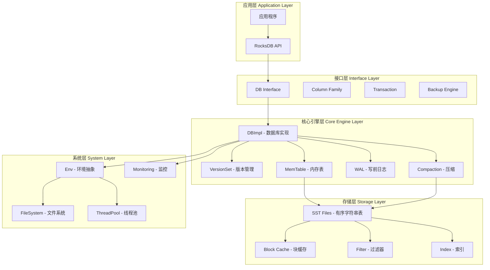
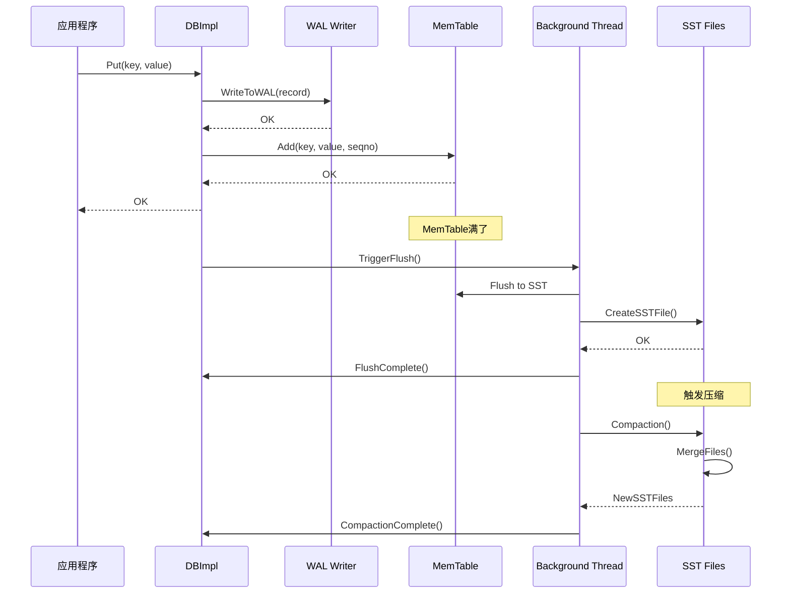
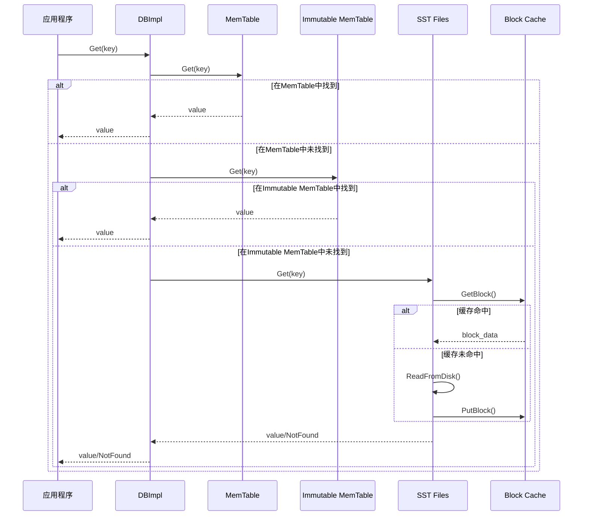
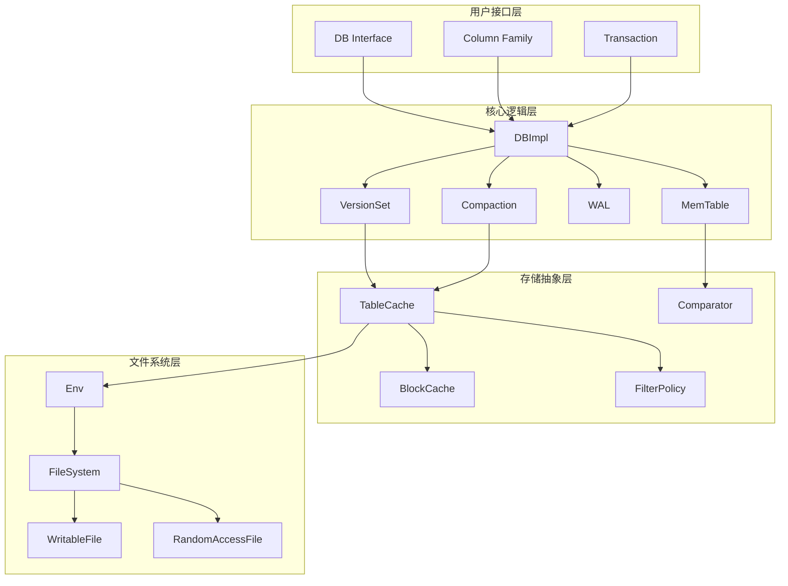

# RocksDB 整体架构深度剖析

## 1. 架构概述

RocksDB是一个基于LSM-Tree（Log-Structured Merge Tree）架构的高性能键值存储引擎。它继承了LevelDB的设计理念，并在此基础上进行了大量优化和扩展。

### 1.1 核心设计理念

- **写优化**：通过LSM-Tree架构，将随机写转换为顺序写
- **多线程**：支持多线程压缩和并发读写
- **可配置**：提供丰富的配置选项以适应不同场景
- **持久化**：数据持久化存储，支持故障恢复

## 2. 整体架构图



## 3. 核心组件详解

### 3.1 DBImpl - 数据库实现核心

**位置**: `db/db_impl/db_impl.h` 和 `db/db_impl/db_impl.cc`

```cpp
// DBImpl是RocksDB的核心实现类，继承自DB接口
// 它是整个RocksDB引擎的入口点
class DBImpl : public DB {
 public:
  // 构造函数：初始化数据库实例
  // @param options: 数据库配置选项
  // @param dbname: 数据库名称/路径
  // @param seq_per_batch: 是否每个批次使用独立序列号
  // @param batch_per_txn: 是否每个事务使用独立批次
  // @param read_only: 是否为只读模式
  DBImpl(const DBOptions& options, const std::string& dbname,
         const bool seq_per_batch = false, const bool batch_per_txn = true,
         bool read_only = false);
         
  // 禁止拷贝构造和赋值
  DBImpl(const DBImpl&) = delete;
  void operator=(const DBImpl&) = delete;
  
  // 核心写入操作实现
  Status Put(const WriteOptions& options,
             ColumnFamilyHandle* column_family, 
             const Slice& key,
             const Slice& value) override;
             
  // 核心读取操作实现  
  Status Get(const ReadOptions& options,
             ColumnFamilyHandle* column_family,
             const Slice& key, 
             PinnableSlice* value) override;
             
  // 删除操作实现
  Status Delete(const WriteOptions& options,
                ColumnFamilyHandle* column_family,
                const Slice& key) override;
```

**功能说明**：
- **写入路径管理**：协调MemTable写入、WAL记录、批量写入
- **读取路径管理**：从MemTable、Immutable MemTable、SST文件中查找数据
- **压缩调度**：管理后台压缩任务的调度和执行
- **版本管理**：维护数据库的版本信息和元数据
- **错误处理**：处理各种异常情况和故障恢复

### 3.2 MemTable - 内存表

**位置**: `db/memtable.h` 和 `db/memtable.cc`

MemTable是RocksDB中的内存数据结构，用于缓存最近的写入操作。

```cpp
// MemTable实现了一个内存中的有序键值存储
// 支持高效的插入、查找和迭代操作
class MemTable {
 public:
  // 构造函数：创建内存表
  // @param cmp: 键比较器
  // @param ioptions: 不可变选项
  // @param mutable_cf_options: 可变列族选项
  // @param write_buffer_manager: 写缓冲区管理器
  // @param largest_seqno: 最大序列号
  // @param column_family_id: 列族ID
  explicit MemTable(const InternalKeyComparator& cmp,
                    const ImmutableOptions& ioptions,
                    const MutableCFOptions& mutable_cf_options,
                    WriteBufferManager* write_buffer_manager,
                    SequenceNumber largest_seqno,
                    uint32_t column_family_id);
                    
  // 添加键值对到内存表
  // @param s: 序列号
  // @param type: 值类型（Put/Delete/Merge等）
  // @param key: 用户键
  // @param value: 值
  // @param kv_prot_info: 键值保护信息
  // @return: 操作状态
  Status Add(SequenceNumber s, ValueType type,
             const Slice& key, const Slice& value,
             const ProtectionInfoKVOS64* kv_prot_info = nullptr);
             
  // 从内存表获取值
  // @param lkey: 查找键
  // @param value: 输出值
  // @param s: 状态
  // @param merge_context: 合并上下文
  // @param range_del_agg: 范围删除聚合器
  // @param seq: 序列号
  // @param read_opts: 读取选项
  // @param callback: 读取回调
  // @param is_blob_index: 是否为Blob索引
  // @return: 是否找到
  bool Get(const LookupKey& lkey, std::string* value, Status* s,
           MergeContext* merge_context,
           RangeDelAggregator* range_del_agg, SequenceNumber* seq,
           const ReadOptions& read_opts, ReadCallback* callback = nullptr,
           bool* is_blob_index = nullptr);
```

**架构特点**：
- **跳表实现**：默认使用跳表（SkipList）作为底层数据结构
- **内存管理**：通过WriteBufferManager控制内存使用
- **并发安全**：支持多线程并发读取，单线程写入
- **序列号**：每个操作都有唯一的序列号，支持MVCC

### 3.3 SST文件 - 持久化存储

**位置**: `table/` 目录下的相关文件

SST（Sorted String Table）文件是RocksDB的持久化存储格式。

```cpp
// SST文件写入器，用于创建SST文件
class SstFileWriter {
 public:
  // 构造函数
  // @param env_options: 环境选项
  // @param options: 数据库选项
  // @param comparator: 比较器
  // @param column_family: 列族句柄
  // @param invalidate_page_cache: 是否使页面缓存失效
  // @param io_priority: IO优先级
  // @param skip_filters: 是否跳过过滤器
  SstFileWriter(const EnvOptions& env_options, const Options& options,
                const Comparator* comparator = nullptr,
                ColumnFamilyHandle* column_family = nullptr,
                bool invalidate_page_cache = true,
                Env::IOPriority io_priority = Env::IO_TOTAL,
                bool skip_filters = false);
                
  // 打开文件进行写入
  // @param file_path: 文件路径
  // @return: 操作状态
  Status Open(const std::string& file_path);
  
  // 添加键值对
  // @param key: 键
  // @param value: 值  
  // @return: 操作状态
  Status Put(const Slice& key, const Slice& value);
  
  // 完成文件写入
  // @param sync: 是否同步
  // @return: 操作状态
  Status Finish(ExternalSstFileInfo* file_info = nullptr);
```

**文件结构**：
```
SST文件结构:
┌─────────────────┐
│   Data Block 1  │ ← 存储实际的键值对数据
├─────────────────┤
│   Data Block 2  │
├─────────────────┤
│      ...        │
├─────────────────┤
│   Data Block N  │
├─────────────────┤
│  Filter Block   │ ← 布隆过滤器，加速查找
├─────────────────┤
│  Index Block    │ ← 索引块，指向数据块
├─────────────────┤
│   Footer        │ ← 文件尾部，包含元信息
└─────────────────┘
```

### 3.4 压缩机制 - Compaction

**位置**: `db/compaction/` 目录

压缩是LSM-Tree架构的核心机制，用于合并和整理数据。

```cpp
// 压缩作业类，负责执行具体的压缩操作
class CompactionJob {
 public:
  // 构造函数
  // @param job_id: 作业ID
  // @param compaction: 压缩配置
  // @param db_options: 数据库选项
  // @param env_options: 环境选项
  // @param versions: 版本集合
  // @param shutting_down: 是否正在关闭
  // @param preserve_deletes_seqnum: 保留删除的序列号
  // @param log_buffer: 日志缓冲区
  // @param directories: 目录列表
  // @param progress: 进度回调
  // @param paranoid_file_checks: 是否进行文件检查
  // @param measure_io_stats: 是否测量IO统计
  // @param dbname: 数据库名称
  // @param compaction_job_stats: 压缩作业统计
  // @param thread_pri: 线程优先级
  // @param io_tracer: IO跟踪器
  // @param db_id: 数据库ID
  // @param db_session_id: 数据库会话ID
  // @param full_history_ts_low: 完整历史时间戳下界
  // @param trim_ts: 修剪时间戳
  // @param blob_callback: Blob回调
  CompactionJob(
      int job_id, Compaction* compaction, const ImmutableDBOptions& db_options,
      const MutableDBOptions& mutable_db_options, const FileOptions& file_options,
      VersionSet* versions, const std::atomic<bool>* shutting_down,
      SequenceNumber preserve_deletes_seqnum, LogBuffer* log_buffer,
      FSDirectory* db_directory, FSDirectory* output_directory,
      FSDirectory* blob_output_directory, Statistics* stats,
      InstrumentedMutex* db_mutex, ErrorHandler* db_error_handler,
      std::vector<SequenceNumber> existing_snapshots,
      SequenceNumber earliest_write_conflict_snapshot,
      const SnapshotChecker* snapshot_checker, JobContext* job_context,
      std::shared_ptr<Cache> table_cache, EventLogger* event_logger,
      bool paranoid_file_checks, bool measure_io_stats, const std::string& dbname,
      CompactionJobStats* compaction_job_stats, Env::Priority thread_pri,
      const std::shared_ptr<IOTracer>& io_tracer,
      const std::atomic<bool>* manual_compaction_paused,
      const std::atomic<bool>* manual_compaction_canceled,
      const std::string& db_id, const std::string& db_session_id,
      std::string full_history_ts_low, std::string trim_ts,
      BlobFileCompletionCallback* blob_callback = nullptr);
      
  // 运行压缩作业
  // @return: 操作状态
  Status Run();
  
  // 安装压缩结果
  // @return: 操作状态  
  Status Install(const MutableCFOptions& mutable_cf_options);
```

**压缩策略**：
- **Level压缩**：数据按层级组织，上层数据合并到下层
- **Universal压缩**：所有数据在同一层，定期全量合并
- **FIFO压缩**：先进先出，删除最老的文件

## 4. 系统交互时序图

### 4.1 写入操作时序图



### 4.2 读取操作时序图



## 5. 模块间依赖关系



## 6. 关键数据流

### 6.1 写入数据流

1. **应用写入** → DBImpl::Put()
2. **WAL记录** → WAL::AddRecord()
3. **MemTable写入** → MemTable::Add()
4. **后台刷新** → FlushJob::Run()
5. **SST文件生成** → TableBuilder::Finish()
6. **版本更新** → VersionSet::LogAndApply()

### 6.2 读取数据流

1. **应用读取** → DBImpl::Get()
2. **MemTable查找** → MemTable::Get()
3. **SST文件查找** → TableCache::Get()
4. **块缓存查找** → BlockCache::Lookup()
5. **磁盘读取** → RandomAccessFile::Read()
6. **结果返回** → 应用程序

## 7. 性能优化要点

### 7.1 写入优化
- **批量写入**：使用WriteBatch减少WAL同步次数
- **异步写入**：设置sync=false提高写入吞吐量
- **MemTable大小**：合理设置write_buffer_size
- **并行刷新**：启用多个MemTable并行刷新

### 7.2 读取优化
- **块缓存**：合理设置block_cache大小
- **布隆过滤器**：减少不必要的磁盘读取
- **前缀查找**：使用prefix_extractor优化范围查询
- **压缩算法**：选择合适的压缩算法平衡空间和性能

### 7.3 压缩优化
- **压缩策略**：根据工作负载选择Level或Universal压缩
- **压缩线程**：设置合适的max_background_compactions
- **压缩触发**：调整level0_file_num_compaction_trigger
- **压缩优先级**：设置compaction_pri控制压缩顺序

## 8. 架构优势与特点

### 8.1 高性能
- **LSM-Tree架构**：将随机写转换为顺序写
- **多线程支持**：并行压缩和刷新操作
- **内存优化**：高效的内存管理和缓存机制

### 8.2 高可靠性
- **WAL机制**：写前日志保证数据持久性
- **快照隔离**：支持一致性读取
- **故障恢复**：完善的错误处理和恢复机制

### 8.3 高扩展性
- **列族支持**：逻辑分区和独立配置
- **插件架构**：可扩展的过滤器、压缩器等
- **多语言绑定**：支持多种编程语言

这个整体架构为RocksDB提供了强大的性能和灵活性，使其能够适应各种不同的应用场景和工作负载。
