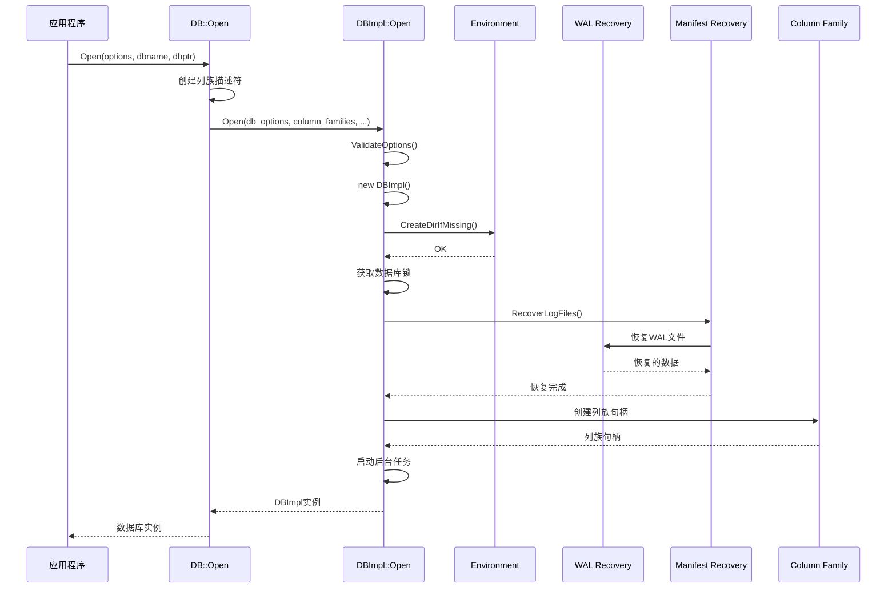
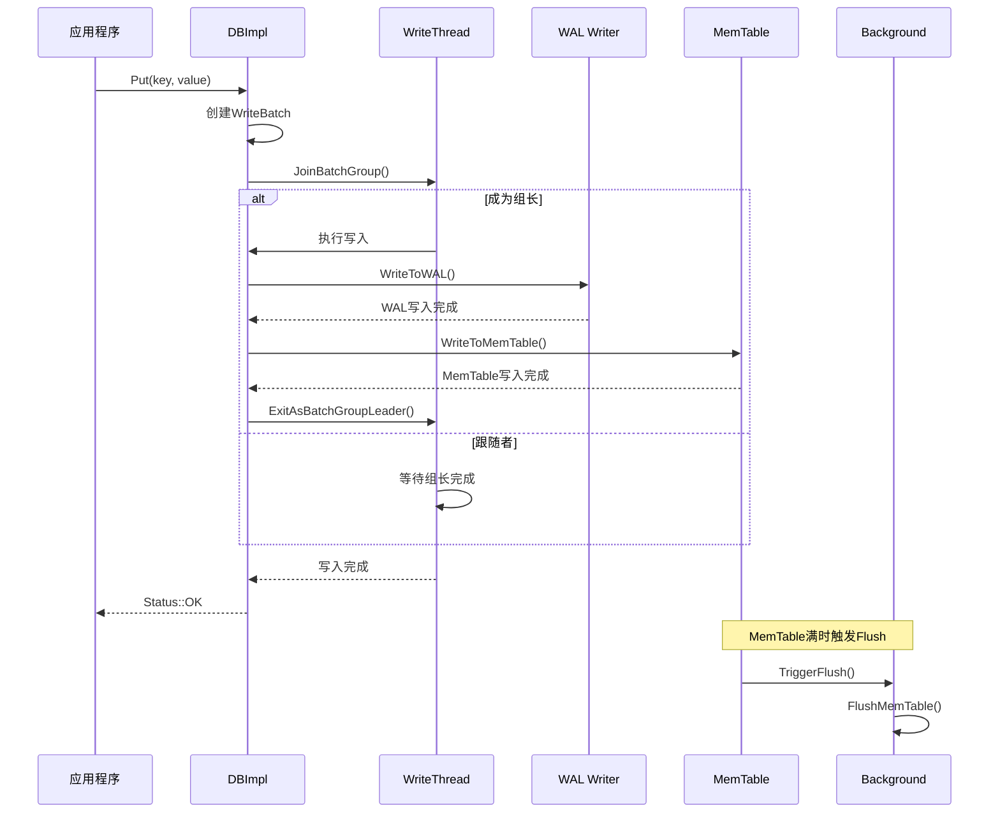
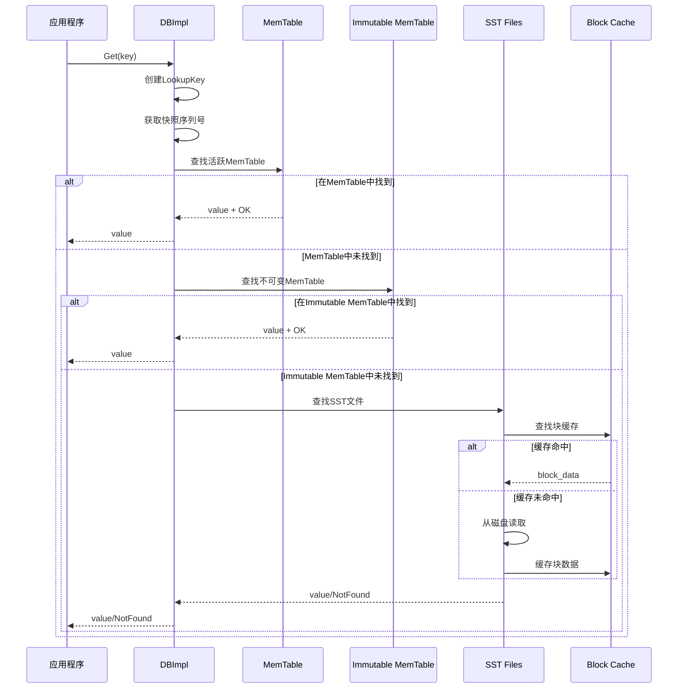

## 1. API概述

RocksDB提供了丰富的API接口，主要分为以下几个层次：
- **C++ API**: 核心的C++接口，提供完整功能
- **C API**: C语言绑定接口，便于其他语言调用
- **Java API**: Java语言绑定
- **Python API**: Python语言绑定

本文档主要分析C++ API的核心接口及其实现。

## 2. 核心API接口分析

### 2.1 数据库打开接口 - DB::Open

#### 2.1.1 接口定义

**位置**: `include/rocksdb/db.h`

```cpp
// 基础打开接口：打开单个列族的数据库
// @param options: 数据库配置选项，包含所有配置参数
// @param name: 数据库路径，指定数据库文件存储位置
// @param dbptr: 输出参数，返回数据库实例的智能指针
// @return: 操作状态，OK表示成功，其他表示失败原因
static Status Open(const Options& options, 
                   const std::string& name,
                   std::unique_ptr<DB>* dbptr);

// 多列族打开接口：打开包含多个列族的数据库
// @param db_options: 数据库级别的配置选项
// @param name: 数据库路径
// @param column_families: 列族描述符向量，包含所有列族的名称和选项
// @param handles: 输出参数，返回列族句柄向量
// @param dbptr: 输出参数，返回数据库实例
// @return: 操作状态
static Status Open(const DBOptions& db_options, 
                   const std::string& name,
                   const std::vector<ColumnFamilyDescriptor>& column_families,
                   std::vector<ColumnFamilyHandle*>* handles,
                   std::unique_ptr<DB>* dbptr);
```

#### 2.1.2 实现入口函数

**位置**: `db/db_impl/db_impl_open.cc:2197`

```cpp
// DB::Open的基础实现，处理单列族情况
Status DB::Open(const Options& options, const std::string& dbname,
                std::unique_ptr<DB>* dbptr) {
  // 将Options分解为DBOptions和ColumnFamilyOptions
  DBOptions db_options(options);
  ColumnFamilyOptions cf_options(options);
  
  // 创建列族描述符向量，包含默认列族
  std::vector<ColumnFamilyDescriptor> column_families;
  column_families.emplace_back(kDefaultColumnFamilyName, cf_options);
  
  // 如果启用了统计信息持久化，添加统计列族
  if (db_options.persist_stats_to_disk) {
    column_families.emplace_back(kPersistentStatsColumnFamilyName, cf_options);
  }
  
  // 调用多列族版本的Open函数
  std::vector<ColumnFamilyHandle*> handles;
  Status s = DB::Open(db_options, dbname, column_families, &handles, dbptr);
  
  // 清理临时的列族句柄（DBImpl内部持有引用）
  if (s.ok()) {
    if (db_options.persist_stats_to_disk) {
      assert(handles.size() == 2);
      if (handles[1] != nullptr) {
        delete handles[1];  // 删除统计列族句柄
      }
    } else {
      assert(handles.size() == 1);
    }
    delete handles[0];  // 删除默认列族句柄
  }
  return s;
}
```

#### 2.1.3 核心实现函数

**位置**: `db/db_impl/db_impl_open.cc:2224`

```cpp
// 多列族Open的实现入口
Status DB::Open(const DBOptions& db_options, const std::string& dbname,
                const std::vector<ColumnFamilyDescriptor>& column_families,
                std::vector<ColumnFamilyHandle*>* handles,
                std::unique_ptr<DB>* dbptr) {
  const bool kSeqPerBatch = true;   // 每批次独立序列号
  const bool kBatchPerTxn = true;   // 每事务独立批次
  
  // 设置线程状态跟踪
  ThreadStatusUtil::SetEnableTracking(db_options.enable_thread_tracking);
  ThreadStatusUtil::SetThreadOperation(ThreadStatus::OperationType::OP_DBOPEN);
  
  bool can_retry = false;
  Status s;
  
  // 重试机制：某些错误情况下可以重试打开
  do {
    s = DBImpl::Open(db_options, dbname, column_families, handles, dbptr,
                     !kSeqPerBatch, kBatchPerTxn, can_retry, &can_retry);
  } while (!s.ok() && can_retry);
  
  ThreadStatusUtil::ResetThreadStatus();
  return s;
}
```

#### 2.1.4 DBImpl::Open实现

**位置**: `db/db_impl/db_impl_open.cc:2380`

```cpp
// DBImpl的核心Open实现
Status DBImpl::Open(const DBOptions& db_options, const std::string& dbname,
                    const std::vector<ColumnFamilyDescriptor>& column_families,
                    std::vector<ColumnFamilyHandle*>* handles,
                    std::unique_ptr<DB>* dbptr,
                    bool seq_per_batch, bool batch_per_txn, bool first_time,
                    bool* can_retry) {
  const WriteOptions write_options(Env::IOActivity::kDBOpen);
  const ReadOptions read_options(Env::IOActivity::kDBOpen);

  // 1. 验证配置选项
  Status s = ValidateOptionsByTable(db_options, column_families);
  if (!s.ok()) return s;
  
  s = ValidateOptions(db_options, column_families);
  if (!s.ok()) return s;

  // 2. 初始化输出参数
  *dbptr = nullptr;
  assert(handles);
  handles->clear();

  // 3. 计算最大写缓冲区大小
  size_t max_write_buffer_size = 0;
  MinAndMaxPreserveSeconds preserve_info;
  for (const auto& cf : column_families) {
    max_write_buffer_size = 
        std::max(max_write_buffer_size, cf.options.write_buffer_size);
    preserve_info.Combine(cf.options);
  }

  // 4. 创建DBImpl实例
  auto impl = std::make_unique<DBImpl>(db_options, dbname, seq_per_batch,
                                       batch_per_txn);
  
  // 5. 检查日志创建状态
  if (!impl->immutable_db_options_.info_log) {
    s = impl->init_logger_creation_s_;
    return s;
  }

  // 6. 创建必要的目录
  s = impl->env_->CreateDirIfMissing(impl->immutable_db_options_.GetWalDir());
  if (s.ok()) {
    // 创建数据库路径和列族路径
    std::vector<std::string> paths;
    for (auto& db_path : impl->immutable_db_options_.db_paths) {
      paths.emplace_back(db_path.path);
    }
    for (auto& cf : column_families) {
      for (auto& cf_path : cf.options.cf_paths) {
        paths.emplace_back(cf_path.path);
      }
    }
    
    for (const auto& path : paths) {
      s = impl->env_->CreateDirIfMissing(path);
      if (!s.ok()) break;
    }

    // 启用自动恢复（仅单路径情况）
    if (paths.size() <= 1) {
      impl->error_handler_.EnableAutoRecovery();
    }
  }

  // 7. 创建归档目录
  if (s.ok()) {
    s = impl->CreateArchivalDirectory();
  }
  
  if (!s.ok()) return s;

  // 8. 设置WAL路径标志
  impl->wal_in_db_path_ = impl->immutable_db_options_.IsWalDirSameAsDBPath();
  
  // 9. 获取锁并开始恢复过程
  RecoveryContext recovery_ctx;
  impl->options_mutex_.Lock();
  impl->mutex_.Lock();

  // 10. 处理create_if_missing和error_if_exists选项
  uint64_t recovered_seq(kMaxSequenceNumber);
  bool save_current_options = false;
  bool log_dir_synced = false;
  
  // ... 恢复过程的详细实现
  // 包括WAL恢复、Manifest恢复、列族创建等
  
  // 11. 启动后台任务
  if (s.ok()) {
    s = impl->StartPeriodicTaskScheduler();
  }
  if (s.ok()) {
    s = impl->RegisterRecordSeqnoTimeWorker();
  }
  
  impl->options_mutex_.Unlock();
  
  // 12. 返回结果
  if (s.ok()) {
    *dbptr = std::move(impl);
  } else {
    // 清理失败情况下的资源
    for (auto* h : *handles) {
      delete h;
    }
    handles->clear();
  }
  
  return s;
}
```

#### 2.1.5 调用链路时序图



### 2.2 写入接口 - Put/Delete/Merge

#### 2.2.1 Put接口定义

**位置**: `include/rocksdb/db.h`

```cpp
// 基础Put接口：向默认列族写入键值对
// @param options: 写入选项，控制同步、WAL等行为
// @param key: 键，用户定义的键值
// @param value: 值，与键关联的数据
// @return: 操作状态
virtual Status Put(const WriteOptions& options, const Slice& key,
                   const Slice& value) {
  return Put(options, DefaultColumnFamily(), key, value);
}

// 列族Put接口：向指定列族写入键值对
// @param options: 写入选项
// @param column_family: 目标列族句柄
// @param key: 键
// @param value: 值
// @return: 操作状态
virtual Status Put(const WriteOptions& options,
                   ColumnFamilyHandle* column_family, 
                   const Slice& key,
                   const Slice& value) = 0;

// 带时间戳的Put接口：支持用户定义时间戳
// @param options: 写入选项
// @param column_family: 列族句柄
// @param key: 键
// @param ts: 时间戳
// @param value: 值
// @return: 操作状态
virtual Status Put(const WriteOptions& options,
                   ColumnFamilyHandle* column_family, 
                   const Slice& key,
                   const Slice& ts, 
                   const Slice& value) = 0;
```

#### 2.2.2 DBImpl::Put实现

**位置**: `db/db_impl/db_impl.h:212`

```cpp
// DBImpl中Put接口的声明
Status Put(const WriteOptions& options, ColumnFamilyHandle* column_family,
           const Slice& key, const Slice& value) override;
Status Put(const WriteOptions& options, ColumnFamilyHandle* column_family,
           const Slice& key, const Slice& ts, const Slice& value) override;
```

**位置**: `db/db_impl/db_impl_write.cc:2786`

```cpp
// DB基类中Put的默认实现（通过WriteBatch）
Status DB::Put(const WriteOptions& opt, ColumnFamilyHandle* column_family,
               const Slice& key, const Slice& value) {
  // 获取默认列族的比较器信息
  ColumnFamilyHandle* default_cf = DefaultColumnFamily();
  assert(default_cf);
  const Comparator* const default_cf_ucmp = default_cf->GetComparator();
  assert(default_cf_ucmp);
  
  // 创建WriteBatch进行批量写入
  WriteBatch batch(0 /* reserved_bytes */, 0 /* max_bytes */,
                   opt.protection_bytes_per_key,
                   default_cf_ucmp->timestamp_size());
  
  // 将Put操作添加到批次中
  Status s = batch.Put(column_family, key, value);
  if (!s.ok()) {
    return s;
  }
  
  // 执行批量写入
  return Write(opt, &batch);
}
```

#### 2.2.3 核心写入实现 - DBImpl::WriteImpl

**位置**: `db/db_impl/db_impl_write.cc`

```cpp
// DBImpl的核心写入实现函数
// @param write_options: 写入选项
// @param my_batch: 要写入的批次
// @param callback: 写入回调函数
// @param log_used: 输出参数，返回使用的日志序号
// @param log_ref: 日志引用
// @param disable_memtable: 是否禁用MemTable写入
// @param seq_used: 输出参数，返回使用的序列号
// @param batch_cnt: 批次计数
// @param pre_release_callback: 预释放回调
// @param write_after_commit_callback: 提交后写入回调
// @return: 操作状态
Status DBImpl::WriteImpl(const WriteOptions& write_options,
                         WriteBatch* my_batch, 
                         UserWriteCallback* callback,
                         uint64_t* log_used, 
                         uint64_t log_ref,
                         bool disable_memtable, 
                         uint64_t* seq_used,
                         size_t batch_cnt,
                         PreReleaseCallback* pre_release_callback,
                         WriteAfterCommitCallback* write_after_commit_callback) {
  
  // 1. 检查数据库状态
  if (write_options.sync && write_options.disableWAL) {
    return Status::InvalidArgument("Sync writes has to enable WAL.");
  }
  
  if (two_write_queues_ && immutable_db_options_.enable_pipelined_write) {
    return Status::NotSupported(
        "pipelined_write is not compatible with concurrent_prepare");
  }

  // 2. 创建写入组
  WriteThread::Writer w(write_options, my_batch, callback, log_ref,
                        disable_memtable, batch_cnt, pre_release_callback,
                        write_after_commit_callback);

  // 3. 进入写入队列
  if (!write_options.disableWAL) {
    RecordTick(stats_, WRITE_WITH_WAL);
  }

  StopWatch write_sw(immutable_db_options_.clock, stats_, DB_WRITE);

  write_thread_.JoinBatchGroup(&w);
  
  // 4. 如果是组长，执行实际写入
  if (w.state == WriteThread::STATE_GROUP_LEADER) {
    // 获取写入组
    WriteContext write_context;
    WriteThread::WriteGroup write_group;
    bool in_parallel_group = false;
    uint64_t last_sequence = versions_->LastSequence();
    
    write_thread_.EnterAsBatchGroupLeader(&w, &write_group);
    
    // 5. 执行写入操作
    Status status = WriteToWAL(write_group, &log_used, &write_context);
    
    if (status.ok() && !write_options.disableWAL) {
      status = WriteToMemTable(write_group, &write_context, seq_used);
    }
    
    // 6. 完成写入组
    write_thread_.ExitAsBatchGroupLeader(write_group, status);
  }
  
  // 7. 等待写入完成
  if (w.state == WriteThread::STATE_PARALLEL_MEMTABLE_WRITER) {
    // 并行MemTable写入
    assert(w.ShouldWriteToMemTable());
    ColumnFamilyMemTablesImpl column_family_memtables(
        versions_->GetColumnFamilySet());
    w.status = WriteBatchInternal::InsertInto(
        &w, w.sequence, &column_family_memtables, &flush_scheduler_,
        &trim_history_scheduler_, write_options.ignore_missing_column_families,
        0 /*recovery_log_number*/, this, true /*concurrent_memtable_writes*/,
        seq_per_batch_, w.batch_cnt, batch_per_txn_,
        write_options.memtable_insert_hint_per_batch);
    
    if (write_thread_.CompleteParallelMemTableWriter(&w)) {
      // 最后一个并行写入者负责清理
      MemTableInsertStatusCheck(w.status);
      versions_->SetLastSequence(w.write_group->last_sequence);
      write_thread_.ExitAsMemTableWriter(&w, *w.write_group);
    }
  }
  
  // 8. 等待最终完成
  if (w.state == WriteThread::STATE_COMPLETED) {
    if (log_used != nullptr) {
      *log_used = w.log_used;
    }
    if (seq_used != nullptr) {
      *seq_used = w.sequence;
    }
  }
  
  assert(w.state == WriteThread::STATE_COMPLETED);
  return w.FinalStatus();
}
```

#### 2.2.4 写入操作时序图



### 2.3 读取接口 - Get

#### 2.3.1 Get接口定义

**位置**: `include/rocksdb/db.h`

```cpp
// 基础Get接口：从默认列族读取
// @param options: 读取选项，控制快照、缓存等行为
// @param key: 要查找的键
// @param value: 输出参数，返回找到的值
// @return: 操作状态，NotFound表示键不存在
virtual Status Get(const ReadOptions& options, const Slice& key,
                   std::string* value) {
  return Get(options, DefaultColumnFamily(), key, value);
}

// 列族Get接口：从指定列族读取
// @param options: 读取选项
// @param column_family: 目标列族句柄
// @param key: 键
// @param value: 输出值
// @return: 操作状态
virtual Status Get(const ReadOptions& options,
                   ColumnFamilyHandle* column_family, const Slice& key,
                   std::string* value) {
  PinnableSlice pinnable_val(value);
  assert(!pinnable_val.IsPinned());
  auto s = Get(options, column_family, key, &pinnable_val);
  if (s.ok() && pinnable_val.IsPinned()) {
    value->assign(pinnable_val.data(), pinnable_val.size());
  }
  return s;
}

// PinnableSlice版本：避免不必要的内存拷贝
// @param options: 读取选项
// @param column_family: 列族句柄
// @param key: 键
// @param pinnable_val: 可固定的值切片，避免拷贝
// @param timestamp: 输出参数，返回时间戳（如果启用）
// @return: 操作状态
virtual Status Get(const ReadOptions& options,
                   ColumnFamilyHandle* column_family, const Slice& key,
                   PinnableSlice* pinnable_val, std::string* timestamp) = 0;
```

#### 2.3.2 DBImpl::Get实现

**位置**: `db/db_impl/db_impl.h:264`

```cpp
// DBImpl中Get接口的实现
Status Get(const ReadOptions& _read_options,
           ColumnFamilyHandle* column_family, const Slice& key,
           PinnableSlice* value, std::string* timestamp) override;
```

**位置**: `db/db_impl/db_impl.cc`

```cpp
// DBImpl::Get的核心实现
Status DBImpl::Get(const ReadOptions& read_options,
                   ColumnFamilyHandle* column_family, const Slice& key,
                   PinnableSlice* pinnable_val, std::string* timestamp) {
  // 1. 验证参数
  assert(pinnable_val != nullptr);
  
  // 获取列族数据
  auto cfh = static_cast<ColumnFamilyHandleImpl*>(column_family);
  auto cfd = cfh->cfd();
  
  if (tracer_) {
    // 记录跟踪信息
    InstrumentedMutexLock lock(&trace_mutex_);
    if (tracer_) {
      tracer_->Get(column_family, key);
    }
  }

  // 2. 调用GetImpl执行实际读取
  GetImplOptions get_impl_options;
  get_impl_options.column_family = column_family;
  get_impl_options.value = pinnable_val;
  get_impl_options.timestamp = timestamp;
  get_impl_options.get_value = true;
  
  return GetImpl(read_options, key, get_impl_options);
}
```

#### 2.3.3 核心读取实现 - DBImpl::GetImpl

**位置**: `db/db_impl/db_impl.cc`

```cpp
// DBImpl的核心读取实现
// @param read_options: 读取选项
// @param key: 查找的键
// @param get_impl_options: 获取实现选项
// @return: 操作状态
Status DBImpl::GetImpl(const ReadOptions& read_options, const Slice& key,
                       GetImplOptions& get_impl_options) {
  
  // 1. 准备读取上下文
  assert(get_impl_options.value != nullptr ||
         get_impl_options.merge_operands != nullptr);
  
  StopWatch sw(immutable_db_options_.clock, stats_, DB_GET);
  PERF_TIMER_GUARD(get_snapshot_time);

  auto cfh = static_cast<ColumnFamilyHandleImpl*>(
      get_impl_options.column_family);
  auto cfd = cfh->cfd();

  // 2. 获取快照
  SequenceNumber snapshot;
  if (read_options.snapshot != nullptr) {
    snapshot = read_options.snapshot->GetSequenceNumber();
  } else {
    snapshot = versions_->LastSequence();
  }

  // 3. 创建查找键
  LookupKey lkey(key, snapshot, read_options.timestamp);
  
  // 4. 准备合并上下文
  MergeContext merge_context;
  RangeDelAggregator range_del_agg(&cfd->internal_comparator(), snapshot);
  
  Status s;
  bool done = false;
  
  // 5. 从MemTable查找
  {
    PERF_TIMER_GUARD(get_from_memtable_time);
    
    // 5.1 从活跃MemTable查找
    SuperVersion* sv = GetAndRefSuperVersion(cfd);
    bool skip_memtable = (read_options.read_tier == kPersistedTier &&
                         has_unpersisted_data_.load(std::memory_order_relaxed));
    
    if (!skip_memtable) {
      // 查找活跃MemTable
      if (sv->mem->Get(lkey, get_impl_options.value->GetSelf(), &s,
                       &merge_context, &range_del_agg, &seq,
                       read_options, get_impl_options.callback,
                       get_impl_options.is_blob_index)) {
        done = true;
        get_impl_options.value->PinSelf();
        RecordTick(stats_, MEMTABLE_HIT);
      } else if ((s.ok() || s.IsMergeInProgress()) &&
                 !range_del_agg.IsEmpty()) {
        // 检查范围删除
        done = true;
        s = Status::NotFound();
      }
      
      // 5.2 从不可变MemTable查找
      if (!done && !s.IsNotFound() && sv->imm->Get(
              lkey, get_impl_options.value->GetSelf(), &s, &merge_context,
              &range_del_agg, &seq, read_options, get_impl_options.callback,
              get_impl_options.is_blob_index)) {
        done = true;
        get_impl_options.value->PinSelf();
        RecordTick(stats_, MEMTABLE_HIT);
      }
    }
    
    ReturnAndCleanupSuperVersion(cfd, sv);
  }
  
  // 6. 从SST文件查找
  if (!done) {
    PERF_TIMER_GUARD(get_from_output_files_time);
    sv = GetAndRefSuperVersion(cfd);
    
    s = sv->current->Get(read_options, lkey, get_impl_options.value,
                        get_impl_options.timestamp, &s, &merge_context,
                        &range_del_agg, get_impl_options.callback,
                        get_impl_options.is_blob_index,
                        get_impl_options.value_found);
    
    ReturnAndCleanupSuperVersion(cfd, sv);
    RecordTick(stats_, MEMTABLE_MISS);
  }
  
  // 7. 处理合并操作
  if (s.ok() && get_impl_options.get_value && !done) {
    if (!get_impl_options.value->empty()) {
      // 处理Merge操作的结果
      s = MergeHelper::TimedFullMerge(
          merge_operator, key, get_impl_options.value,
          merge_context.GetOperands(), get_impl_options.value->GetSelf(),
          immutable_db_options_.info_log.get(), statistics_.get(),
          immutable_db_options_.clock, nullptr /* result_operand */,
          true);
    }
  }

  // 8. 更新统计信息
  if (s.ok()) {
    get_impl_options.value->PinSelf();
    RecordTick(stats_, NUMBER_KEYS_READ);
    size_t size = get_impl_options.value->size();
    RecordTick(stats_, BYTES_READ, size);
    MeasureTime(stats_, BYTES_PER_READ, size);
  }
  RecordTick(stats_, NUMBER_DB_SEEK);

  return s;
}
```

#### 2.3.4 读取操作时序图



### 2.4 批量操作接口 - WriteBatch

#### 2.4.1 WriteBatch接口定义

**位置**: `include/rocksdb/write_batch.h`

```cpp
// WriteBatch类：用于批量写入操作
// 支持原子性地执行多个写入操作
class WriteBatch : public WriteBatchBase {
 public:
  // 构造函数
  // @param reserved_bytes: 预留字节数，用于优化内存分配
  // @param max_bytes: 最大字节数限制
  // @param protection_bytes_per_key: 每个键的保护字节数
  // @param default_cf_ts_sz: 默认列族时间戳大小
  explicit WriteBatch(size_t reserved_bytes = 0, size_t max_bytes = 0,
                      size_t protection_bytes_per_key = 0,
                      size_t default_cf_ts_sz = 0);

  // 添加Put操作到批次
  // @param column_family: 目标列族
  // @param key: 键
  // @param value: 值
  // @return: 操作状态
  Status Put(ColumnFamilyHandle* column_family, const Slice& key,
             const Slice& value) override;

  // 添加Delete操作到批次
  // @param column_family: 目标列族
  // @param key: 要删除的键
  // @return: 操作状态
  Status Delete(ColumnFamilyHandle* column_family, const Slice& key) override;

  // 添加Merge操作到批次
  // @param column_family: 目标列族
  // @param key: 键
  // @param value: 要合并的值
  // @return: 操作状态
  Status Merge(ColumnFamilyHandle* column_family, const Slice& key,
               const Slice& value) override;

  // 清空批次内容
  void Clear() override;

  // 获取批次中的操作数量
  int Count() const override;

  // 获取批次的数据大小
  size_t GetDataSize() const override;

  // 检查批次是否有Put操作
  bool HasPut() const override;

  // 检查批次是否有Delete操作
  bool HasDelete() const override;

  // 检查批次是否有Merge操作
  bool HasMerge() const override;
};
```

#### 2.4.2 WriteBatch实现示例

**位置**: `db/write_batch.cc`

```cpp
// WriteBatch::Put的实现
Status WriteBatch::Put(ColumnFamilyHandle* column_family, const Slice& key,
                       const Slice& value) {
  // 1. 获取列族ID
  uint32_t cf_id = GetColumnFamilyID(column_family);
  
  // 2. 检查键值大小限制
  if (key.size() > port::kMaxUint32) {
    return Status::InvalidArgument("key is too large");
  }
  if (value.size() > port::kMaxUint32) {
    return Status::InvalidArgument("value is too large");
  }

  // 3. 计算所需空间
  size_t key_size = key.size();
  size_t value_size = value.size();
  size_t cf_id_size = WriteBatchInternal::GetColumnFamilyIdSize(cf_id);
  size_t internal_key_size = key_size + 8;  // key + sequence + type
  size_t total_size = WriteBatchInternal::kHeader + cf_id_size + 
                     WriteBatchInternal::GetVarint32Size(internal_key_size) +
                     internal_key_size + 
                     WriteBatchInternal::GetVarint32Size(value_size) + 
                     value_size;

  // 4. 检查批次大小限制
  if (max_bytes_ > 0 && GetDataSize() + total_size > max_bytes_) {
    return Status::MemoryLimit("Write batch size limit exceeded");
  }

  // 5. 写入操作记录
  WriteBatchInternal::SetCount(this, Count() + 1);
  
  // 写入操作类型
  rep_.push_back(static_cast<char>(kTypeValue));
  
  // 写入列族ID
  if (cf_id != 0) {
    PutVarint32(&rep_, cf_id);
  }
  
  // 写入键长度和键数据
  PutVarint32(&rep_, static_cast<uint32_t>(key_size));
  rep_.append(key.data(), key_size);
  
  // 写入值长度和值数据
  PutVarint32(&rep_, static_cast<uint32_t>(value_size));
  rep_.append(value.data(), value_size);

  // 6. 更新保护信息（如果启用）
  if (prot_info_ != nullptr) {
    prot_info_->entries_.emplace_back(ProtectionInfo64()
        .ProtectKVO(key, value, kTypeValue)
        .ProtectC(cf_id));
  }

  return Status::OK();
}
```

### 2.5 迭代器接口 - Iterator

#### 2.5.1 Iterator接口定义

**位置**: `include/rocksdb/iterator.h`

```cpp
// Iterator抽象基类：用于遍历数据库内容
class Iterator : public Cleanable {
 public:
  Iterator() {}
  virtual ~Iterator() {}

  // 检查迭代器是否有效
  // @return: true表示迭代器指向有效的键值对
  virtual bool Valid() const = 0;

  // 移动到第一个键
  virtual void SeekToFirst() = 0;

  // 移动到最后一个键
  virtual void SeekToLast() = 0;

  // 定位到大于等于target的第一个键
  // @param target: 目标键
  virtual void Seek(const Slice& target) = 0;

  // 定位到小于target的最后一个键
  // @param target: 目标键
  virtual void SeekForPrev(const Slice& target) = 0;

  // 移动到下一个键
  virtual void Next() = 0;

  // 移动到前一个键
  virtual void Prev() = 0;

  // 获取当前键
  // @return: 当前键的切片，仅在Valid()为true时有效
  virtual Slice key() const = 0;

  // 获取当前值
  // @return: 当前值的切片，仅在Valid()为true时有效
  virtual Slice value() const = 0;

  // 获取迭代器状态
  // @return: 操作状态，OK表示正常
  virtual Status status() const = 0;

  // 刷新迭代器状态（用于快照一致性）
  virtual Status Refresh() { return Status::NotSupported("Refresh"); }

  // 获取属性值
  // @param prop_name: 属性名称
  // @param prop: 输出参数，返回属性值
  // @return: 是否成功获取属性
  virtual bool GetProperty(std::string prop_name, std::string* prop) {
    return false;
  }
};
```

#### 2.5.2 创建迭代器

**位置**: `include/rocksdb/db.h`

```cpp
// 创建迭代器的接口
class DB {
 public:
  // 为默认列族创建迭代器
  // @param options: 读取选项
  // @return: 迭代器指针，使用完毕后需要删除
  virtual Iterator* NewIterator(const ReadOptions& options) {
    return NewIterator(options, DefaultColumnFamily());
  }

  // 为指定列族创建迭代器
  // @param options: 读取选项
  // @param column_family: 目标列族
  // @return: 迭代器指针
  virtual Iterator* NewIterator(const ReadOptions& options,
                                ColumnFamilyHandle* column_family) = 0;

  // 创建多个列族的迭代器
  // @param options: 读取选项
  // @param column_families: 列族句柄向量
  // @param iterators: 输出参数，返回迭代器向量
  // @return: 操作状态
  virtual Status NewIterators(
      const ReadOptions& options,
      const std::vector<ColumnFamilyHandle*>& column_families,
      std::vector<Iterator*>* iterators) = 0;
};
```

## 3. API使用示例

### 3.1 基础使用示例

```cpp
#include <iostream>
#include <string>
#include "rocksdb/db.h"
#include "rocksdb/options.h"

using namespace ROCKSDB_NAMESPACE;

int main() {
  // 1. 配置数据库选项
  Options options;
  options.create_if_missing = true;           // 数据库不存在时创建
  options.write_buffer_size = 64 * 1024 * 1024; // 64MB写缓冲区
  options.max_write_buffer_number = 3;        // 最多3个写缓冲区
  options.target_file_size_base = 64 * 1024 * 1024; // 64MB目标文件大小
  
  // 2. 打开数据库
  DB* db;
  Status s = DB::Open(options, "/tmp/testdb", &db);
  if (!s.ok()) {
    std::cerr << "无法打开数据库: " << s.ToString() << std::endl;
    return -1;
  }

  // 3. 写入数据
  WriteOptions write_opts;
  write_opts.sync = true;  // 同步写入，确保持久性
  
  s = db->Put(write_opts, "key1", "value1");
  if (!s.ok()) {
    std::cerr << "写入失败: " << s.ToString() << std::endl;
  }

  // 4. 读取数据
  ReadOptions read_opts;
  std::string value;
  s = db->Get(read_opts, "key1", &value);
  if (s.ok()) {
    std::cout << "key1 = " << value << std::endl;
  } else if (s.IsNotFound()) {
    std::cout << "key1 未找到" << std::endl;
  } else {
    std::cerr << "读取失败: " << s.ToString() << std::endl;
  }

  // 5. 批量操作
  WriteBatch batch;
  batch.Put("key2", "value2");
  batch.Put("key3", "value3");
  batch.Delete("key1");
  
  s = db->Write(write_opts, &batch);
  if (!s.ok()) {
    std::cerr << "批量写入失败: " << s.ToString() << std::endl;
  }

  // 6. 迭代器遍历
  Iterator* it = db->NewIterator(read_opts);
  for (it->SeekToFirst(); it->Valid(); it->Next()) {
    std::cout << it->key().ToString() << " = " 
              << it->value().ToString() << std::endl;
  }
  
  if (!it->status().ok()) {
    std::cerr << "迭代器错误: " << it->status().ToString() << std::endl;
  }
  
  delete it;

  // 7. 关闭数据库
  delete db;
  return 0;
}
```

### 3.2 列族使用示例

```cpp
#include "rocksdb/db.h"
#include "rocksdb/options.h"

using namespace ROCKSDB_NAMESPACE;

int main() {
  // 1. 配置数据库选项
  DBOptions db_options;
  db_options.create_if_missing = true;
  db_options.create_missing_column_families = true;

  // 2. 配置列族
  std::vector<ColumnFamilyDescriptor> column_families;
  
  // 默认列族
  ColumnFamilyOptions default_cf_options;
  column_families.emplace_back(kDefaultColumnFamilyName, default_cf_options);
  
  // 用户数据列族
  ColumnFamilyOptions user_cf_options;
  user_cf_options.write_buffer_size = 32 * 1024 * 1024; // 32MB
  column_families.emplace_back("users", user_cf_options);
  
  // 日志数据列族
  ColumnFamilyOptions log_cf_options;
  log_cf_options.write_buffer_size = 16 * 1024 * 1024; // 16MB
  log_cf_options.compression = kLZ4Compression;
  column_families.emplace_back("logs", log_cf_options);

  // 3. 打开数据库
  std::vector<ColumnFamilyHandle*> handles;
  DB* db;
  Status s = DB::Open(db_options, "/tmp/multi_cf_db", 
                      column_families, &handles, &db);
  if (!s.ok()) {
    std::cerr << "打开数据库失败: " << s.ToString() << std::endl;
    return -1;
  }

  // 4. 获取列族句柄
  ColumnFamilyHandle* default_cf = handles[0];
  ColumnFamilyHandle* users_cf = handles[1];
  ColumnFamilyHandle* logs_cf = handles[2];

  // 5. 向不同列族写入数据
  WriteOptions write_opts;
  
  // 用户数据
  s = db->Put(write_opts, users_cf, "user:1001", 
              R"({"name":"Alice","age":25})");
  s = db->Put(write_opts, users_cf, "user:1002", 
              R"({"name":"Bob","age":30})");
  
  // 日志数据
  s = db->Put(write_opts, logs_cf, "log:20231201:001", 
              "User Alice logged in");
  s = db->Put(write_opts, logs_cf, "log:20231201:002", 
              "User Bob updated profile");

  // 6. 从不同列族读取数据
  ReadOptions read_opts;
  std::string value;
  
  // 读取用户数据
  s = db->Get(read_opts, users_cf, "user:1001", &value);
  if (s.ok()) {
    std::cout << "用户1001: " << value << std::endl;
  }
  
  // 读取日志数据
  s = db->Get(read_opts, logs_cf, "log:20231201:001", &value);
  if (s.ok()) {
    std::cout << "日志: " << value << std::endl;
  }

  // 7. 清理资源
  for (auto handle : handles) {
    delete handle;
  }
  delete db;
  
  return 0;
}
```

### 3.3 事务使用示例

```cpp
#include "rocksdb/db.h"
#include "rocksdb/utilities/transaction_db.h"
#include "rocksdb/utilities/transaction.h"

using namespace ROCKSDB_NAMESPACE;

int main() {
  // 1. 配置事务数据库选项
  Options options;
  options.create_if_missing = true;
  
  TransactionDBOptions txn_db_options;
  
  // 2. 打开事务数据库
  TransactionDB* txn_db;
  Status s = TransactionDB::Open(options, txn_db_options, 
                                 "/tmp/txn_db", &txn_db);
  if (!s.ok()) {
    std::cerr << "打开事务数据库失败: " << s.ToString() << std::endl;
    return -1;
  }

  // 3. 创建事务
  WriteOptions write_opts;
  ReadOptions read_opts;
  TransactionOptions txn_opts;
  
  Transaction* txn = txn_db->BeginTransaction(write_opts, txn_opts);

  // 4. 在事务中执行操作
  std::string value;
  
  // 读取账户余额
  s = txn->Get(read_opts, "account:alice", &value);
  int alice_balance = s.ok() ? std::stoi(value) : 0;
  
  s = txn->Get(read_opts, "account:bob", &value);
  int bob_balance = s.ok() ? std::stoi(value) : 0;
  
  // 转账操作：Alice向Bob转账100
  if (alice_balance >= 100) {
    alice_balance -= 100;
    bob_balance += 100;
    
    s = txn->Put("account:alice", std::to_string(alice_balance));
    if (s.ok()) {
      s = txn->Put("account:bob", std::to_string(bob_balance));
    }
    
    if (s.ok()) {
      // 5. 提交事务
      s = txn->Commit();
      if (s.ok()) {
        std::cout << "转账成功" << std::endl;
      } else {
        std::cerr << "提交失败: " << s.ToString() << std::endl;
      }
    } else {
      std::cerr << "写入失败: " << s.ToString() << std::endl;
      txn->Rollback();
    }
  } else {
    std::cout << "余额不足" << std::endl;
    txn->Rollback();
  }

  // 6. 清理资源
  delete txn;
  delete txn_db;
  
  return 0;
}
```

## 4. API调用链路总结

### 4.1 写入路径调用链

```
应用程序
  ↓ Put(key, value)
DB::Put()
  ↓ 创建WriteBatch
DBImpl::Write()
  ↓ 加入写入队列
WriteThread::JoinBatchGroup()
  ↓ 组长执行写入
DBImpl::WriteImpl()
  ├─ WriteToWAL()          // WAL写入
  │   └─ WALWriter::AddRecord()
  └─ WriteToMemTable()     // MemTable写入
      └─ MemTable::Add()
```

### 4.2 读取路径调用链

```
应用程序
  ↓ Get(key)
DBImpl::Get()
  ↓ 创建LookupKey
DBImpl::GetImpl()
  ├─ MemTable::Get()       // 活跃MemTable查找
  ├─ MemTableList::Get()   // 不可变MemTable查找
  └─ Version::Get()        // SST文件查找
      └─ TableCache::Get()
          └─ BlockBasedTable::Get()
              └─ BlockCache::Lookup()
```

### 4.3 数据库打开调用链

```
应用程序
  ↓ DB::Open()
DB::Open()
  ↓ 创建列族描述符
DBImpl::Open()
  ├─ ValidateOptions()     // 验证选项
  ├─ new DBImpl()          // 创建实例
  ├─ RecoverLogFiles()     // 恢复WAL
  ├─ RecoverManifest()     // 恢复Manifest
  └─ StartBackgroundWork() // 启动后台任务
```

这些API接口构成了RocksDB的核心功能，通过合理使用这些接口，可以构建高性能的存储应用。每个接口都经过精心设计，既保证了功能的完整性，又提供了良好的性能特征。
