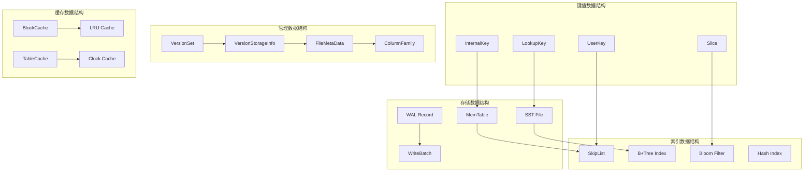
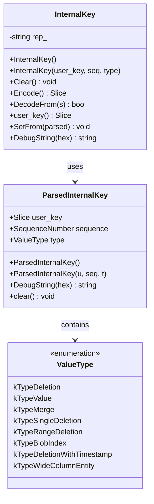
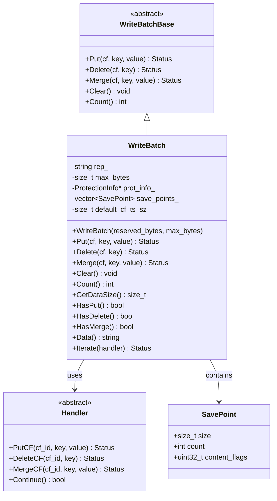
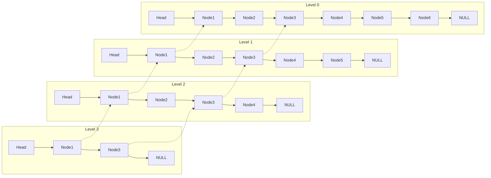
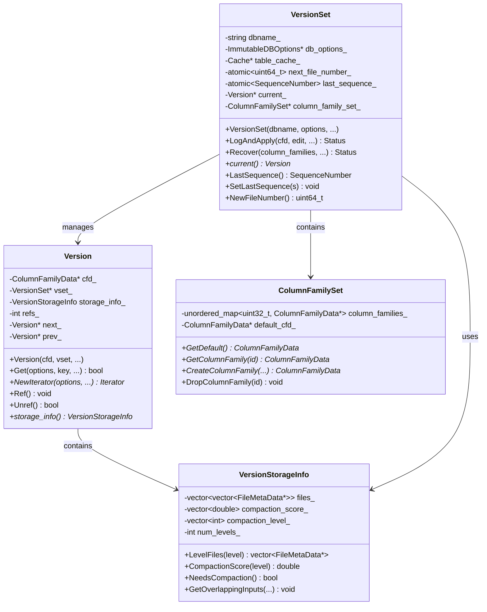
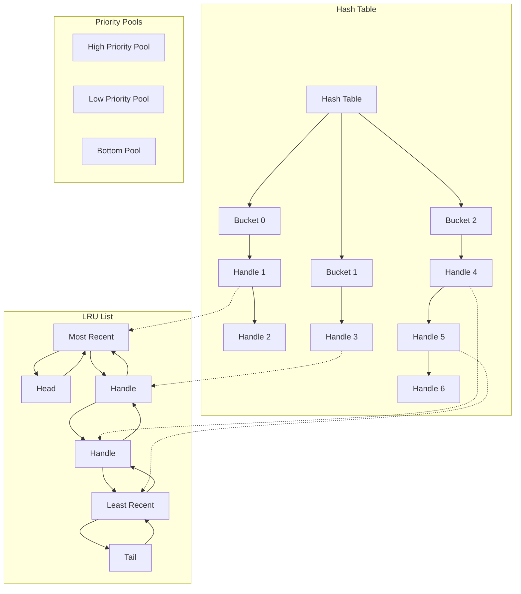
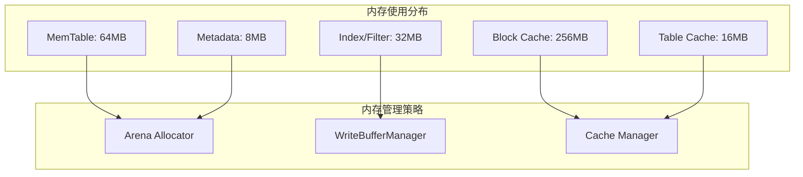

## 1. 概述

RocksDB作为一个复杂的存储引擎，包含了众多精心设计的数据结构。这些数据结构不仅支撑着RocksDB的核心功能，也是其高性能的关键所在。本文档将深入分析RocksDB中的关键数据结构，包括其设计理念、内存布局、操作算法和性能特征。

## 2. 核心数据结构概览

### 2.1 数据结构分类



## 3. 键值数据结构

### 3.1 InternalKey - 内部键

**位置**: `db/dbformat.h`

InternalKey是RocksDB内部使用的键格式，包含用户键、序列号和值类型。

```cpp
// InternalKey：RocksDB内部键格式
// 格式：| user_key | sequence_number (7 bytes) | value_type (1 byte) |
class InternalKey {
 public:
  // 默认构造函数
  InternalKey() {}
  
  // 从用户键、序列号和值类型构造
  // @param user_key: 用户键
  // @param s: 序列号，用于MVCC版本控制
  // @param t: 值类型（Put/Delete/Merge等）
  InternalKey(const Slice& user_key, SequenceNumber s, ValueType t) {
    AppendInternalKey(&rep_, ParsedInternalKey(user_key, s, t));
  }

  // 从ParsedInternalKey构造
  // @param parsed_key: 解析后的内部键
  explicit InternalKey(const ParsedInternalKey& parsed_key) {
    AppendInternalKey(&rep_, parsed_key);
  }

  // 清空内部键
  void Clear() { rep_.clear(); }

  // 获取内部键的字符串表示
  // @return: 内部键的Slice视图
  const Slice& Encode() const {
    assert(!rep_.empty());
    return rep_;
  }

  // 从编码的内部键解码
  // @param s: 编码的内部键
  // @return: 是否解码成功
  bool DecodeFrom(const Slice& s) {
    rep_.assign(s.data(), s.size());
    return !rep_.empty();
  }

  // 获取用户键部分
  // @return: 用户键的Slice
  Slice user_key() const {
    return ExtractUserKey(rep_);
  }

  // 设置内部键内容
  // @param user_key: 用户键
  // @param s: 序列号
  // @param t: 值类型
  void SetFrom(const ParsedInternalKey& p) {
    rep_.clear();
    AppendInternalKey(&rep_, p);
  }

  // 获取调试字符串
  // @param hex: 是否使用十六进制格式
  // @return: 调试字符串
  std::string DebugString(bool hex = false) const;

 private:
  std::string rep_;  // 内部键的编码表示
};

// ParsedInternalKey：解析后的内部键结构
struct ParsedInternalKey {
  Slice user_key;        // 用户键
  SequenceNumber sequence; // 序列号
  ValueType type;        // 值类型

  // 构造函数
  ParsedInternalKey() {}
  ParsedInternalKey(const Slice& u, const SequenceNumber& seq, ValueType t)
      : user_key(u), sequence(seq), type(t) {}

  // 获取调试字符串
  std::string DebugString(bool hex = false) const;

  // 清空内容
  void clear() {
    user_key.clear();
    sequence = 0;
    type = kTypeValue;
  }
};

// 值类型枚举
enum ValueType : unsigned char {
  kTypeDeletion = 0x0,           // 删除标记
  kTypeValue = 0x1,              // 普通值
  kTypeMerge = 0x2,              // 合并操作
  kTypeLogData = 0x3,            // WAL专用
  kTypeSingleDeletion = 0x7,     // 单点删除
  kTypeRangeDeletion = 0xF,      // 范围删除
  kTypeBlobIndex = 0x11,         // Blob索引
  kTypeDeletionWithTimestamp = 0x14, // 带时间戳的删除
  kTypeWideColumnEntity = 0x16,  // 宽列实体
  kTypeTimedPut = 0x17,          // 带时间的Put
  // ... 更多类型
};
```

#### 3.1.1 InternalKey UML图



### 3.2 LookupKey - 查找键

**位置**: `db/lookup_key.h`

LookupKey用于在MemTable和SST文件中查找数据，包含了查找所需的所有信息。

```cpp
// LookupKey：用于查找操作的键结构
// 包含用户键和序列号，用于在MemTable和SST文件中查找
class LookupKey {
 public:
  // 构造函数
  // @param user_key: 用户键
  // @param sequence: 查找的序列号（用于MVCC）
  // @param ts: 用户定义的时间戳（可选）
  LookupKey(const Slice& user_key, SequenceNumber sequence,
            const Slice* ts = nullptr);

  // 析构函数
  ~LookupKey();

  // 获取MemTable查找键
  // 格式：| key_length | user_key | sequence_number | value_type |
  // @return: MemTable查找键的Slice
  Slice memtable_key() const {
    return Slice(start_, static_cast<size_t>(end_ - start_));
  }

  // 获取内部键
  // 格式：| user_key | sequence_number | value_type |
  // @return: 内部键的Slice
  Slice internal_key() const {
    return Slice(kstart_, static_cast<size_t>(end_ - kstart_));
  }

  // 获取用户键
  // @return: 用户键的Slice
  Slice user_key() const {
    return Slice(kstart_, static_cast<size_t>(klength_));
  }

 private:
  // 我们构造一个char数组，包含以下内容：
  //    klength  varint32               <-- start_
  //    userkey  char[klength]          <-- kstart_
  //    tag      uint64
  //                                    <-- end_
  // 数组是一个合适大小的堆栈分配数组。
  // 对于较大的键，我们使用malloc分配的数组。
  const char* start_;   // MemTable键的开始位置
  const char* kstart_;  // 用户键的开始位置
  const char* end_;     // 键的结束位置
  size_t klength_;      // 用户键的长度
  char space_[200];     // 避免小键的分配开销

  // 禁止拷贝
  LookupKey(const LookupKey&) = delete;
  LookupKey& operator=(const LookupKey&) = delete;
};

// LookupKey的构造实现
LookupKey::LookupKey(const Slice& user_key, SequenceNumber s,
                     const Slice* ts) {
  size_t usize = user_key.size();
  size_t ts_sz = ts ? ts->size() : 0;
  size_t needed = usize + ts_sz + 13;  // 保守估计

  char* dst;
  if (needed <= sizeof(space_)) {
    dst = space_;
  } else {
    dst = new char[needed];
  }
  start_ = dst;
  
  // 编码键长度
  dst = EncodeVarint32(dst, static_cast<uint32_t>(usize + ts_sz + 8));
  kstart_ = dst;
  
  // 复制用户键
  std::memcpy(dst, user_key.data(), usize);
  dst += usize;
  
  // 复制时间戳（如果有）
  if (ts) {
    std::memcpy(dst, ts->data(), ts_sz);
    dst += ts_sz;
  }
  klength_ = usize + ts_sz;
  
  // 编码序列号和类型
  EncodeFixed64(dst, PackSequenceAndType(s, kValueTypeForSeek));
  dst += 8;
  end_ = dst;
}
```

### 3.3 Slice - 字符串切片

**位置**: `include/rocksdb/slice.h`

Slice是RocksDB中最基础的数据结构，用于高效地表示字符串数据而不进行拷贝。

```cpp
// Slice：轻量级的字符串视图
// 不拥有数据，只是指向现有数据的指针和长度
class Slice {
 public:
  // 创建空的slice
  Slice() : data_(""), size_(0) {}

  // 从C字符串创建slice
  // @param s: C字符串
  Slice(const char* s) : data_(s), size_(strlen(s)) {}

  // 从字符指针和长度创建slice
  // @param s: 字符指针
  // @param n: 长度
  Slice(const char* s, size_t n) : data_(s), size_(n) {}

  // 从std::string创建slice
  // @param s: std::string引用
  Slice(const std::string& s) : data_(s.data()), size_(s.size()) {}

  // 从字符指针创建slice（指定长度）
  // @param s: 字符指针
  // @param n: 长度
  Slice(const char* s, size_t n) : data_(s), size_(n) {}

  // 拷贝构造函数
  Slice(const Slice& s) : data_(s.data_), size_(s.size_) {}

  // 赋值操作符
  Slice& operator=(const Slice& s) {
    data_ = s.data_;
    size_ = s.size_;
    return *this;
  }

  // 获取数据指针
  // @return: 数据指针
  const char* data() const { return data_; }

  // 获取大小
  // @return: 数据大小
  size_t size() const { return size_; }

  // 检查是否为空
  // @return: 是否为空
  bool empty() const { return size_ == 0; }

  // 获取指定位置的字符
  // @param n: 位置索引
  // @return: 字符
  char operator[](size_t n) const {
    assert(n < size());
    return data_[n];
  }

  // 清空slice
  void clear() {
    data_ = "";
    size_ = 0;
  }

  // 移除前缀
  // @param n: 要移除的字符数
  void remove_prefix(size_t n) {
    assert(n <= size());
    data_ += n;
    size_ -= n;
  }

  // 移除后缀
  // @param n: 要移除的字符数
  void remove_suffix(size_t n) {
    assert(n <= size());
    size_ -= n;
  }

  // 转换为std::string
  // @return: std::string对象
  std::string ToString() const {
    return std::string(data_, size_);
  }

  // 比较操作
  // @param b: 另一个slice
  // @return: 比较结果（<0, 0, >0）
  int compare(const Slice& b) const;

  // 检查是否以指定前缀开始
  // @param x: 前缀slice
  // @return: 是否以x开始
  bool starts_with(const Slice& x) const {
    return ((size_ >= x.size_) && (memcmp(data_, x.data_, x.size_) == 0));
  }

  // 检查是否以指定后缀结束
  // @param x: 后缀slice
  // @return: 是否以x结束
  bool ends_with(const Slice& x) const {
    return ((size_ >= x.size_) &&
            (memcmp(data_ + size_ - x.size_, x.data_, x.size_) == 0));
  }

  // 获取十六进制字符串表示
  // @param max_len: 最大长度限制
  // @return: 十六进制字符串
  std::string ToString(bool hex) const;

 private:
  const char* data_;  // 数据指针
  size_t size_;       // 数据大小
};

// 比较操作符重载
inline bool operator==(const Slice& x, const Slice& y) {
  return ((x.size() == y.size()) &&
          (memcmp(x.data(), y.data(), x.size()) == 0));
}

inline bool operator!=(const Slice& x, const Slice& y) {
  return !(x == y);
}

// Slice比较实现
inline int Slice::compare(const Slice& b) const {
  const size_t min_len = (size_ < b.size_) ? size_ : b.size_;
  int r = memcmp(data_, b.data_, min_len);
  if (r == 0) {
    if (size_ < b.size_)
      r = -1;
    else if (size_ > b.size_)
      r = +1;
  }
  return r;
}
```

## 4. 存储数据结构

### 4.1 WriteBatch - 写入批次

**位置**: `include/rocksdb/write_batch.h`

WriteBatch用于批量写入操作，保证原子性。

```cpp
// WriteBatch：批量写入操作容器
// 支持原子性地执行多个写入操作（Put/Delete/Merge等）
class WriteBatch : public WriteBatchBase {
 public:
  // 构造函数
  // @param reserved_bytes: 预留字节数，用于优化内存分配
  // @param max_bytes: 最大字节数限制，0表示无限制
  // @param protection_bytes_per_key: 每个键的保护字节数，用于数据完整性
  // @param default_cf_ts_sz: 默认列族时间戳大小
  explicit WriteBatch(size_t reserved_bytes = 0, size_t max_bytes = 0,
                      size_t protection_bytes_per_key = 0,
                      size_t default_cf_ts_sz = 0);

  // 拷贝构造函数
  WriteBatch(const WriteBatch& src);

  // 移动构造函数
  WriteBatch(WriteBatch&& src) noexcept;

  // 赋值操作符
  WriteBatch& operator=(const WriteBatch& src);
  WriteBatch& operator=(WriteBatch&& src);

  // 析构函数
  ~WriteBatch() override;

  // 使用WriteBatchBase的Put方法
  using WriteBatchBase::Put;
  
  // 添加Put操作
  // @param column_family: 目标列族句柄
  // @param key: 键
  // @param value: 值
  // @return: 操作状态
  Status Put(ColumnFamilyHandle* column_family, const Slice& key,
             const Slice& value) override;

  // 带时间戳的Put操作
  // @param column_family: 目标列族句柄
  // @param key: 键
  // @param ts: 时间戳
  // @param value: 值
  // @return: 操作状态
  Status Put(ColumnFamilyHandle* column_family, const Slice& key,
             const Slice& ts, const Slice& value) override;

  // 使用WriteBatchBase的Delete方法
  using WriteBatchBase::Delete;
  
  // 添加Delete操作
  // @param column_family: 目标列族句柄
  // @param key: 要删除的键
  // @return: 操作状态
  Status Delete(ColumnFamilyHandle* column_family, const Slice& key) override;

  // 带时间戳的Delete操作
  // @param column_family: 目标列族句柄
  // @param key: 要删除的键
  // @param ts: 时间戳
  // @return: 操作状态
  Status Delete(ColumnFamilyHandle* column_family, const Slice& key,
                const Slice& ts) override;

  // 使用WriteBatchBase的Merge方法
  using WriteBatchBase::Merge;
  
  // 添加Merge操作
  // @param column_family: 目标列族句柄
  // @param key: 键
  // @param value: 要合并的值
  // @return: 操作状态
  Status Merge(ColumnFamilyHandle* column_family, const Slice& key,
               const Slice& value) override;

  // 清空批次内容
  void Clear() override;

  // 获取批次中的操作数量
  // @return: 操作数量
  int Count() const override;

  // 获取批次的数据大小
  // @return: 数据大小（字节）
  size_t GetDataSize() const override;

  // 检查批次是否有Put操作
  // @return: 是否包含Put操作
  bool HasPut() const override;

  // 检查批次是否有Delete操作
  // @return: 是否包含Delete操作
  bool HasDelete() const override;

  // 检查批次是否有SingleDelete操作
  // @return: 是否包含SingleDelete操作
  bool HasSingleDelete() const override;

  // 检查批次是否有DeleteRange操作
  // @return: 是否包含DeleteRange操作
  bool HasDeleteRange() const override;

  // 检查批次是否有Merge操作
  // @return: 是否包含Merge操作
  bool HasMerge() const override;

  // 获取WriteBatch的字符串表示
  // @return: 内容的字符串表示
  std::string Data() const { return rep_; }

  // 获取WriteBatch内容的大小
  // @return: 内容大小
  size_t GetWriteBatchSize() const { return rep_.size(); }

  // 从字符串赋值WriteBatch内容
  // @param src: 源字符串
  // @return: 操作状态
  Status Assign(const WriteBatch& src);

  // 追加另一个WriteBatch的内容
  // @param src: 源WriteBatch
  // @return: 操作状态
  Status Append(const WriteBatch& src);

  // 遍历WriteBatch中的所有操作
  // @param handler: 处理器，用于处理每个操作
  // @return: 操作状态
  Status Iterate(Handler* handler) const;

  // 保存点相关操作（用于事务）
  void SetSavePoint() override;
  Status RollbackToSavePoint() override;
  Status PopSavePoint() override;

  // 获取最大字节数限制
  // @return: 最大字节数
  size_t GetMaxBytes() const { return max_bytes_; }

 private:
  friend class WriteBatchInternal;
  friend class LocalSavePoint;

  // WriteBatch的内部表示
  std::string rep_;  // 序列化的操作数据
  
  // 大小限制
  size_t max_bytes_;
  
  // 保护信息（用于数据完整性检查）
  std::unique_ptr<WriteBatch::ProtectionInfo> prot_info_;
  
  // 保存点栈
  std::vector<SavePoint> save_points_;
  
  // 默认列族时间戳大小
  size_t default_cf_ts_sz_;
};

// WriteBatch内部格式：
// WriteBatch ::= sequence(8) count(4) data*
// data ::= record+
// record ::=
//   kTypeValue varstring varstring
//   kTypeDeletion varstring
//   kTypeSingleDeletion varstring
//   kTypeMerge varstring varstring
//   kTypeColumnFamilyValue varint32 varstring varstring
//   kTypeColumnFamilyDeletion varint32 varstring varstring
//   kTypeColumnFamilySingleDeletion varint32 varstring
//   kTypeColumnFamilyMerge varint32 varstring varstring
// varstring ::= len(varint32) data(len)
```

#### 4.1.1 WriteBatch UML图



### 4.2 SST文件格式

**位置**: `table/format.h`

SST文件是RocksDB的持久化存储格式，采用分块结构设计。

```cpp
// SST文件格式结构
// +-------------+
// | Data Block  |  <- 存储实际的键值对数据
// +-------------+
// | Data Block  |
// +-------------+
// |     ...     |
// +-------------+
// | Data Block  |
// +-------------+
// |Filter Block |  <- 布隆过滤器，加速查找
// +-------------+
// |Index Block  |  <- 索引块，指向数据块
// +-------------+
// | Footer      |  <- 文件尾部，包含元信息
// +-------------+

// BlockHandle：块句柄，用于定位文件中的块
class BlockHandle {
 public:
  // 最大编码长度
  enum { kMaxEncodedLength = 10 + 10 };

  BlockHandle();
  BlockHandle(uint64_t offset, uint64_t size);

  // 获取块在文件中的偏移量
  // @return: 偏移量
  uint64_t offset() const { return offset_; }
  
  // 设置偏移量
  // @param offset: 偏移量
  void set_offset(uint64_t offset) { offset_ = offset; }

  // 获取块的大小
  // @return: 块大小
  uint64_t size() const { return size_; }
  
  // 设置块大小
  // @param size: 块大小
  void set_size(uint64_t size) { size_ = size; }

  // 编码到字符串
  // @param dst: 目标字符串
  void EncodeTo(std::string* dst) const;

  // 从Slice解码
  // @param input: 输入数据
  // @return: 解码状态
  Status DecodeFrom(Slice* input);

  // 获取编码后的大小
  // @return: 编码大小
  size_t EncodedSize() const {
    return VarintLength(offset_) + VarintLength(size_);
  }

  // 调试字符串
  // @return: 调试信息
  std::string ToString() const;

 private:
  uint64_t offset_;  // 块偏移量
  uint64_t size_;    // 块大小
};

// Footer：SST文件尾部结构
class Footer {
 public:
  // Footer的固定大小
  enum {
    kEncodedLength = 48,  // Footer编码长度
  };

  Footer() {}
  Footer(uint64_t table_magic_number, uint32_t version);

  // 获取索引块句柄
  // @return: 索引块句柄
  const BlockHandle& index_handle() const { return index_handle_; }
  
  // 设置索引块句柄
  // @param h: 块句柄
  void set_index_handle(const BlockHandle& h) { index_handle_ = h; }

  // 获取过滤器块句柄
  // @return: 过滤器块句柄
  const BlockHandle& filter_handle() const { return filter_handle_; }
  
  // 设置过滤器块句柄
  // @param h: 块句柄
  void set_filter_handle(const BlockHandle& h) { filter_handle_ = h; }

  // 编码到字符串
  // @param dst: 目标字符串
  void EncodeTo(std::string* dst) const;

  // 从Slice解码
  // @param input: 输入数据
  // @return: 解码状态
  Status DecodeFrom(Slice* input);

  // 获取表格式版本
  // @return: 版本号
  uint32_t version() const { return version_; }

  // 获取魔数
  // @return: 魔数
  uint64_t table_magic_number() const { return table_magic_number_; }

 private:
  BlockHandle index_handle_;   // 索引块句柄
  BlockHandle filter_handle_;  // 过滤器块句柄
  uint32_t version_;           // 版本号
  uint64_t table_magic_number_; // 魔数
};

// Block：数据块结构
class Block {
 public:
  // 构造函数
  // @param contents: 块内容
  // @param checksum_type: 校验和类型
  // @param block_contents_pinned: 内容是否被固定
  explicit Block(BlockContents&& contents, 
                 ChecksumType checksum_type,
                 bool block_contents_pinned = false);

  // 析构函数
  ~Block();

  // 获取块大小
  // @return: 块大小
  size_t size() const { return size_; }

  // 获取块数据
  // @return: 块数据指针
  const char* data() const { return data_; }

  // 创建迭代器
  // @param comparator: 比较器
  // @param iter: 现有迭代器（可复用）
  // @param for_compaction: 是否用于压缩
  // @return: 块迭代器
  Iter* NewIterator(const Comparator* comparator,
                    BlockIter* iter = nullptr,
                    bool for_compaction = false);

  // 获取重启点数量
  // @return: 重启点数量
  uint32_t NumRestarts() const;

 private:
  const char* data_;           // 块数据
  size_t size_;               // 块大小
  uint32_t restart_offset_;   // 重启点偏移
  std::unique_ptr<char[]> heap_allocated_; // 堆分配的数据
  bool own_bytes_;            // 是否拥有数据
  ChecksumType checksum_type_; // 校验和类型

  // 禁止拷贝
  Block(const Block&) = delete;
  Block& operator=(const Block&) = delete;
};
```

## 5. 索引数据结构

### 5.1 SkipList - 跳表

**位置**: `memtable/skiplist.h`

跳表是MemTable的默认实现，提供O(log n)的查找性能。

```cpp
// SkipList：概率性数据结构，提供O(log n)的查找、插入性能
// 通过多层链表结构实现快速查找
template <typename Key, class Comparator>
class SkipList {
 private:
  struct Node;

 public:
  // 构造函数
  // @param cmp: 比较器
  // @param allocator: 内存分配器
  // @param max_height: 最大高度，默认12层
  // @param branching_factor: 分支因子，默认4
  explicit SkipList(Comparator cmp, Allocator* allocator,
                    int32_t max_height = 12, int32_t branching_factor = 4);

  // 禁止拷贝
  SkipList(const SkipList&) = delete;
  void operator=(const SkipList&) = delete;

  // 插入键
  // @param key: 要插入的键
  // 要求：当前列表中没有相等的键
  void Insert(const Key& key);

  // 检查是否包含键
  // @param key: 要查找的键
  // @return: 是否包含该键
  bool Contains(const Key& key) const;

  // 估算指定范围内的条目数量
  // @param start_ikey: 起始键
  // @param end_ikey: 结束键
  // @return: 估算的条目数量
  uint64_t ApproximateNumEntries(const Slice& start_ikey,
                                 const Slice& end_ikey) const;

  // 获取近似内存使用量
  // @return: 内存使用字节数
  size_t ApproximateMemoryUsage() const;

  // 迭代器类
  class Iterator {
   public:
    // 构造函数
    // @param list: 跳表指针
    explicit Iterator(const SkipList* list);

    // 检查迭代器是否有效
    // @return: 是否指向有效节点
    bool Valid() const;

    // 获取当前键
    // @return: 当前键
    const Key& key() const;

    // 移动到下一个节点
    void Next();

    // 移动到前一个节点
    void Prev();

    // 定位到大于等于target的第一个节点
    // @param target: 目标键
    void Seek(const Key& target);

    // 定位到小于target的最后一个节点
    // @param target: 目标键
    void SeekForPrev(const Key& target);

    // 移动到第一个节点
    void SeekToFirst();

    // 移动到最后一个节点
    void SeekToLast();

   private:
    const SkipList* list_;  // 跳表指针
    Node* node_;           // 当前节点
  };

 private:
  // 跳表节点结构
  struct Node {
    explicit Node(const Key& k) : key(k) {}

    Key const key;  // 节点键

    // 获取指定层级的下一个节点
    // @param n: 层级
    // @return: 下一个节点指针
    Node* Next(int n) {
      assert(n >= 0);
      return next_[n].load(std::memory_order_acquire);
    }

    // 设置指定层级的下一个节点
    // @param n: 层级
    // @param x: 节点指针
    void SetNext(int n, Node* x) {
      assert(n >= 0);
      next_[n].store(x, std::memory_order_release);
    }

    // 无屏障版本的Next（用于性能优化）
    // @param n: 层级
    // @return: 下一个节点指针
    Node* NoBarrier_Next(int n) {
      assert(n >= 0);
      return next_[n].load(std::memory_order_relaxed);
    }

    // 无屏障版本的SetNext
    // @param n: 层级
    // @param x: 节点指针
    void NoBarrier_SetNext(int n, Node* x) {
      assert(n >= 0);
      next_[n].store(x, std::memory_order_relaxed);
    }

   private:
    // 下一个节点指针数组（变长数组）
    std::atomic<Node*> next_[1];
  };

  // 查找大于等于key的第一个节点
  // @param key: 查找键
  // @param prev: 输出参数，返回每层的前驱节点
  // @return: 找到的节点或nullptr
  Node* FindGreaterOrEqual(const Key& key, Node** prev) const;

  // 查找小于key的最后一个节点
  // @param key: 查找键
  // @return: 找到的节点或nullptr
  Node* FindLessThan(const Key& key) const;

  // 查找最后一个节点
  // @return: 最后一个节点或nullptr
  Node* FindLast() const;

  // 生成随机高度
  // @return: 随机高度值
  int RandomHeight();

  // 检查键是否在指定节点之后
  // @param key: 键
  // @param n: 节点
  // @return: 是否在节点之后
  bool KeyIsAfterNode(const Key& key, Node* n) const;

  // 创建节点
  // @param key: 键
  // @param height: 节点高度
  // @return: 创建的节点
  Node* NewNode(const Key& key, int height);

  // 获取最大高度
  // @return: 当前最大高度
  int GetMaxHeight() const {
    return max_height_.load(std::memory_order_relaxed);
  }

  // 比较器
  Comparator const compare_;
  
  // 内存分配器
  Allocator* const allocator_;
  
  // 头节点（哨兵节点）
  Node* const head_;

  // 最大允许高度
  const int32_t max_height_;
  
  // 分支因子（用于随机高度生成）
  const int32_t branching_factor_;

  // 当前最大高度
  std::atomic<int> max_height_atomic_;

  // 随机数生成器
  Random rnd_;
};
```

#### 5.1.1 SkipList结构图



### 5.2 Bloom Filter - 布隆过滤器

**位置**: `util/bloom.cc`

布隆过滤器用于快速判断键是否可能存在，减少不必要的磁盘读取。

```cpp
// BloomFilterPolicy：布隆过滤器实现
// 用于快速判断键是否可能存在于SST文件中
class BloomFilterPolicy : public FilterPolicy {
 public:
  // 构造函数
  // @param bits_per_key: 每个键的位数，影响误判率
  // @param use_block_based_builder: 是否使用基于块的构建器
  explicit BloomFilterPolicy(int bits_per_key, bool use_block_based_builder);

  // 析构函数
  ~BloomFilterPolicy() override;

  // 获取过滤器名称
  // @return: 过滤器名称
  const char* Name() const override { return "rocksdb.BuiltinBloomFilter"; }

  // 创建过滤器
  // @param keys: 键列表
  // @param n: 键的数量
  // @param dst: 输出缓冲区
  void CreateFilter(const Slice* keys, int n, std::string* dst) const override;

  // 检查键是否可能存在
  // @param key: 要检查的键
  // @param filter: 过滤器数据
  // @return: 是否可能存在（true可能存在，false一定不存在）
  bool KeyMayMatch(const Slice& key, const Slice& filter) const override;

  // 创建过滤器构建器
  // @return: 过滤器构建器
  FilterBitsBuilder* GetFilterBitsBuilder() const override;

  // 创建过滤器读取器
  // @param contents: 过滤器内容
  // @return: 过滤器读取器
  FilterBitsReader* GetFilterBitsReader(const Slice& contents) const override;

 private:
  int bits_per_key_;              // 每个键的位数
  int k_;                         // 哈希函数数量
  bool use_block_based_builder_;  // 是否使用基于块的构建器
};

// FullFilterBitsBuilder：完整布隆过滤器构建器
class FullFilterBitsBuilder : public FilterBitsBuilder {
 public:
  // 构造函数
  // @param bits_per_key: 每个键的位数
  // @param num_probes: 探测次数（哈希函数数量）
  explicit FullFilterBitsBuilder(const int bits_per_key, const int num_probes);

  // 析构函数
  ~FullFilterBitsBuilder() override;

  // 添加键
  // @param key: 要添加的键
  void AddKey(const Slice& key) override;

  // 获取键的数量
  // @return: 键的数量
  size_t NumAdded() const override { return num_added_; }

  // 完成构建
  // @param dst: 输出缓冲区
  // @return: 过滤器数据
  Slice Finish(std::unique_ptr<const char[]>* buf) override;

  // 计算空间使用量
  // @return: 空间使用字节数
  size_t ApproximateNumEntries(size_t bytes) override;

 private:
  int bits_per_key_;      // 每个键的位数
  int num_probes_;        // 探测次数
  std::vector<uint32_t> hash_entries_;  // 哈希值列表
  size_t num_added_;      // 已添加的键数量
};

// FullFilterBitsReader：完整布隆过滤器读取器
class FullFilterBitsReader : public FilterBitsReader {
 public:
  // 构造函数
  // @param contents: 过滤器内容
  explicit FullFilterBitsReader(const Slice& contents);

  // 析构函数
  ~FullFilterBitsReader() override;

  // 检查键是否可能匹配
  // @param key: 要检查的键
  // @return: 是否可能匹配
  bool MayMatch(const Slice& key) override;

  // 批量检查键是否可能匹配
  // @param num_keys: 键的数量
  // @param keys: 键数组
  // @param may_match: 输出结果数组
  void MayMatch(int num_keys, Slice** keys, bool* may_match) override;

 private:
  const char* data_;      // 过滤器数据
  size_t len_;           // 数据长度
  int num_probes_;       // 探测次数
  int log2_cache_line_size_;  // 缓存行大小的对数
};

// 布隆过滤器哈希函数
inline uint32_t BloomHash(const Slice& key) {
  return Hash(key.data(), key.size(), 0xbc9f1d34);
}

// 双重哈希函数
inline void DoubleHash(uint32_t h, uint32_t* h1, uint32_t* h2) {
  *h1 = h;
  *h2 = h >> 17 | h << 15;  // 循环右移17位
}
```

## 6. 管理数据结构

### 6.1 VersionSet - 版本管理

**位置**: `db/version_set.h`

VersionSet管理数据库的版本信息，支持MVCC和并发访问。

```cpp
// VersionSet：管理数据库的版本信息
// 支持MVCC（多版本并发控制）和原子更新
class VersionSet {
 public:
  // 构造函数
  // @param dbname: 数据库名称
  // @param db_options: 数据库选项
  // @param file_options: 文件选项
  // @param table_cache: 表缓存
  // @param write_buffer_manager: 写缓冲区管理器
  // @param write_controller: 写控制器
  // @param block_cache_tracer: 块缓存跟踪器
  // @param io_tracer: IO跟踪器
  // @param db_id: 数据库ID
  // @param db_session_id: 数据库会话ID
  // @param daily_offpeak_time_utc: 每日非高峰时间
  // @param error_handler: 错误处理器
  // @param read_only: 是否只读
  VersionSet(const std::string& dbname, const ImmutableDBOptions* db_options,
             const FileOptions& file_options, Cache* table_cache,
             WriteBufferManager* write_buffer_manager,
             WriteController* write_controller,
             BlockCacheTracer* const block_cache_tracer,
             const std::shared_ptr<IOTracer>& io_tracer, const std::string& db_id,
             const std::string& db_session_id,
             const std::string& daily_offpeak_time_utc,
             ErrorHandler* error_handler, const bool read_only = false);

  // 析构函数
  ~VersionSet();

  // 应用版本编辑
  // @param column_family_data: 列族数据
  // @param mutable_cf_options: 可变列族选项
  // @param read_options: 读取选项
  // @param write_options: 写入选项
  // @param edit: 版本编辑
  // @param mu: 互斥锁
  // @param directory: 目录
  // @param new_descriptor_log: 是否创建新的描述符日志
  // @param cf_options: 列族选项
  // @param manifest_write_cb: Manifest写入回调
  // @return: 操作状态
  Status LogAndApply(
      ColumnFamilyData* column_family_data,
      const MutableCFOptions& mutable_cf_options, const ReadOptions& read_options,
      const WriteOptions& write_options, VersionEdit* edit,
      InstrumentedMutex* mu, FSDirectory* directory = nullptr,
      bool new_descriptor_log = false,
      const ColumnFamilyOptions* cf_options = nullptr,
      const std::function<void(const Status&)>& manifest_write_cb = {});

  // 恢复数据库状态
  // @param column_families: 列族描述符列表
  // @param read_only: 是否只读
  // @param db_paths: 数据库路径列表
  // @param flush_reason: 刷新原因
  // @return: 操作状态
  Status Recover(const std::vector<ColumnFamilyDescriptor>& column_families,
                 bool read_only = false,
                 const std::vector<DbPath>& db_paths = {},
                 FlushReason flush_reason = FlushReason::kErrorRecovery);

  // 获取当前版本
  // @return: 当前版本指针
  Version* current() const { return current_; }

  // 获取最后序列号
  // @return: 最后序列号
  SequenceNumber LastSequence() const {
    return last_sequence_.load(std::memory_order_acquire);
  }

  // 设置最后序列号
  // @param s: 序列号
  void SetLastSequence(SequenceNumber s) {
    assert(s >= last_sequence_);
    last_sequence_.store(s, std::memory_order_release);
  }

  // 获取下一个文件号
  // @return: 下一个文件号
  uint64_t NewFileNumber() { return next_file_number_.fetch_add(1); }

  // 获取当前文件号
  // @return: 当前文件号
  uint64_t current_next_file_number() const { return next_file_number_.load(); }

  // 获取Manifest文件号
  // @return: Manifest文件号
  uint64_t manifest_file_number() const { return manifest_file_number_; }

  // 获取列族集合
  // @return: 列族集合指针
  ColumnFamilySet* GetColumnFamilySet() { return column_family_set_.get(); }

  // 获取表缓存
  // @return: 表缓存指针
  Cache* GetTableCache() { return table_cache_; }

 private:
  class Builder;
  struct ManifestWriter;

  friend class Version;
  friend class DBImpl;

  // 应用版本编辑到构建器
  // @param builder: 构建器
  // @param edit: 版本编辑
  // @param mu: 互斥锁
  // @return: 操作状态
  Status ApplyOneVersionEdit(Builder& builder, VersionEdit* edit,
                             InstrumentedMutex* mu);

  // 写入快照
  // @param log: 日志写入器
  // @return: 操作状态
  Status WriteSnapshot(log::Writer* log);

  // 数据库名称
  const std::string dbname_;
  
  // 数据库选项
  const ImmutableDBOptions* const db_options_;
  
  // 文件选项
  const FileOptions file_options_;
  
  // 表缓存
  Cache* const table_cache_;
  
  // 写缓冲区管理器
  WriteBufferManager* const write_buffer_manager_;
  
  // 写控制器
  WriteController* const write_controller_;

  // 下一个文件号
  std::atomic<uint64_t> next_file_number_;
  
  // 最后序列号
  std::atomic<SequenceNumber> last_sequence_;
  
  // Manifest文件号
  uint64_t manifest_file_number_;

  // 当前版本
  Version* current_;
  
  // 列族集合
  std::unique_ptr<ColumnFamilySet> column_family_set_;

  // Manifest写入器列表
  std::deque<ManifestWriter*> manifest_writers_;

  // 错误处理器
  ErrorHandler* error_handler_;
};

// Version：数据库的一个版本快照
class Version {
 public:
  // 构造函数
  // @param cfd: 列族数据
  // @param vset: 版本集合
  // @param file_indexer: 文件索引器
  // @param creation_time: 创建时间
  Version(ColumnFamilyData* cfd, VersionSet* vset,
          const FileIndexer& file_indexer,
          uint64_t version_number = 0);

  // 析构函数
  ~Version();

  // 获取操作
  // @param read_options: 读取选项
  // @param lkey: 查找键
  // @param value: 输出值
  // @param timestamp: 输出时间戳
  // @param status: 输出状态
  // @param merge_context: 合并上下文
  // @param range_del_agg: 范围删除聚合器
  // @param value_found: 是否找到值
  // @param read_callback: 读取回调
  // @param is_blob: 是否为Blob
  // @param do_merge: 是否执行合并
  // @return: 是否找到
  bool Get(const ReadOptions& read_options, const LookupKey& lkey,
           PinnableSlice* value, std::string* timestamp, Status* status,
           MergeContext* merge_context,
           RangeDelAggregator* range_del_agg, bool* value_found = nullptr,
           bool* key_exists = nullptr, SequenceNumber* seq = nullptr,
           ReadCallback* callback = nullptr, bool* is_blob = nullptr,
           bool do_merge = true);

  // 创建迭代器
  // @param read_options: 读取选项
  // @param cf_options: 列族选项
  // @param mutable_cf_options: 可变列族选项
  // @param range_del_agg: 范围删除聚合器
  // @param arena: 内存分配器
  // @param skip_filters: 是否跳过过滤器
  // @param level: 层级
  // @param max_file_size_for_l0_meta_pin: L0元数据固定的最大文件大小
  // @return: 迭代器
  InternalIterator* NewIterator(const ReadOptions& read_options,
                                const MutableCFOptions& mutable_cf_options,
                                RangeDelAggregator* range_del_agg,
                                Arena* arena, bool skip_filters = false,
                                int level = -1,
                                size_t max_file_size_for_l0_meta_pin = 0);

  // 增加引用计数
  void Ref();
  
  // 减少引用计数
  bool Unref();

  // 获取存储信息
  // @return: 版本存储信息
  VersionStorageInfo* storage_info() { return &storage_info_; }

 private:
  friend class VersionSet;

  // 列族数据
  ColumnFamilyData* cfd_;
  
  // 版本集合
  VersionSet* vset_;
  
  // 版本存储信息
  VersionStorageInfo storage_info_;
  
  // 引用计数
  int refs_;
  
  // 版本链表
  Version* next_;
  Version* prev_;
};
```

#### 6.1.1 VersionSet UML图



## 7. 缓存数据结构

### 7.1 LRU Cache - 最近最少使用缓存

**位置**: `cache/lru_cache.h`

LRU Cache是RocksDB的默认缓存实现，用于缓存数据块和索引块。

```cpp
// LRUCache：最近最少使用缓存实现
// 使用哈希表+双向链表实现O(1)的插入、删除和查找
class LRUCache : public ShardedCache {
 public:
  // 构造函数
  // @param capacity: 缓存容量
  // @param num_shard_bits: 分片位数
  // @param strict_capacity_limit: 是否严格容量限制
  // @param high_pri_pool_ratio: 高优先级池比例
  // @param low_pri_pool_ratio: 低优先级池比例
  // @param use_adaptive_mutex: 是否使用自适应互斥锁
  // @param metadata_charge_policy: 元数据收费策略
  // @param allocator: 内存分配器
  LRUCache(size_t capacity, int num_shard_bits, bool strict_capacity_limit,
           double high_pri_pool_ratio, double low_pri_pool_ratio,
           bool use_adaptive_mutex, CacheMetadataChargePolicy metadata_charge_policy,
           std::shared_ptr<MemoryAllocator> allocator = nullptr);

  // 析构函数
  ~LRUCache() override;

  // 获取缓存名称
  // @return: 缓存名称
  const char* Name() const override { return "LRUCache"; }

  // 插入缓存项
  // @param key: 键
  // @param value: 值
  // @param charge: 收费（内存使用量）
  // @param deleter: 删除器
  // @param handle: 输出句柄
  // @param priority: 优先级
  // @return: 操作状态
  Status Insert(const Slice& key, void* value, size_t charge,
                void (*deleter)(const Slice& key, void* value),
                Handle** handle = nullptr,
                Priority priority = Priority::LOW) override;

  // 查找缓存项
  // @param key: 键
  // @param stats: 统计信息
  // @return: 缓存句柄
  Handle* Lookup(const Slice& key, Statistics* stats = nullptr) override;

  // 删除缓存项
  // @param key: 键
  // @return: 是否成功删除
  bool Erase(const Slice& key) override;

  // 释放句柄
  // @param handle: 缓存句柄
  // @param useful: 是否有用（影响优先级）
  // @param erase_if_last_ref: 如果是最后引用是否删除
  // @return: 是否删除了缓存项
  bool Release(Handle* handle, bool useful = true,
               bool erase_if_last_ref = false) override;

  // 获取使用量
  // @param handle: 缓存句柄
  // @return: 使用量
  size_t GetUsage(Handle* handle) const override;

  // 获取总使用量
  // @return: 总使用量
  size_t GetUsage() const override;

  // 获取固定使用量
  // @return: 固定使用量
  size_t GetPinnedUsage() const override;

  // 获取容量
  // @return: 容量
  size_t GetCapacity() const override;

  // 设置容量
  // @param capacity: 新容量
  void SetCapacity(size_t capacity) override;

  // 设置严格容量限制
  // @param strict_capacity_limit: 是否严格限制
  void SetStrictCapacityLimit(bool strict_capacity_limit) override;

  // 删除未引用的条目
  void EraseUnRefEntries() override;

 private:
  // LRU缓存分片
  class LRUCacheShard;
  
  // 分片数组
  std::unique_ptr<LRUCacheShard[]> shards_;
  
  // 分片数量
  int num_shards_;
};

// LRUHandle：LRU缓存句柄
struct LRUHandle {
  void* value;              // 缓存值
  void (*deleter)(const Slice&, void*);  // 删除器
  LRUHandle* next_hash;     // 哈希链表下一个节点
  LRUHandle* next;          // LRU链表下一个节点
  LRUHandle* prev;          // LRU链表前一个节点
  size_t charge;            // 内存使用量
  size_t key_length;        // 键长度
  uint32_t refs;            // 引用计数
  uint32_t hash;            // 哈希值
  Cache::Priority priority; // 优先级
  bool in_cache;            // 是否在缓存中
  bool is_high_pri;         // 是否高优先级
  bool is_low_pri;          // 是否低优先级
  char key_data[1];         // 键数据（变长）

  // 获取键
  // @return: 键的Slice
  Slice key() const {
    assert(next != this);
    return Slice(key_data, key_length);
  }

  // 获取总大小
  // @return: 总大小
  size_t CalcTotalCharge(CacheMetadataChargePolicy metadata_charge_policy) {
    size_t meta_charge = 0;
    if (metadata_charge_policy == kFullCharge) {
      meta_charge += sizeof(LRUHandle) - 1 + key_length;
    }
    return charge + meta_charge;
  }
};

// LRUCacheShard：LRU缓存分片实现
class LRUCacheShard final : public CacheShard {
 public:
  // 构造函数
  // @param capacity: 分片容量
  // @param strict_capacity_limit: 是否严格容量限制
  // @param high_pri_pool_pct: 高优先级池百分比
  // @param low_pri_pool_pct: 低优先级池百分比
  // @param use_adaptive_mutex: 是否使用自适应互斥锁
  // @param metadata_charge_policy: 元数据收费策略
  // @param allocator: 内存分配器
  LRUCacheShard(size_t capacity, bool strict_capacity_limit,
                double high_pri_pool_pct, double low_pri_pool_pct,
                bool use_adaptive_mutex,
                CacheMetadataChargePolicy metadata_charge_policy,
                std::shared_ptr<MemoryAllocator> allocator);

  // 析构函数
  ~LRUCacheShard() override;

  // 实现CacheShard接口
  Status Insert(const Slice& key, uint32_t hash, void* value, size_t charge,
                void (*deleter)(const Slice& key, void* value),
                Cache::Handle** handle, Cache::Priority priority) override;

  Cache::Handle* Lookup(const Slice& key, uint32_t hash) override;
  bool Erase(const Slice& key, uint32_t hash) override;
  bool Release(Cache::Handle* handle, bool useful, bool erase_if_last_ref) override;

  // 获取使用量和容量
  size_t GetUsage() const override;
  size_t GetPinnedUsage() const override;
  size_t GetCapacity() const override;
  void SetCapacity(size_t capacity) override;
  void SetStrictCapacityLimit(bool strict_capacity_limit) override;

 private:
  // 从LRU链表中移除节点
  // @param e: 要移除的节点
  void LRU_Remove(LRUHandle* e);

  // 添加节点到LRU链表
  // @param e: 要添加的节点
  void LRU_Append(LRUHandle* e);

  // 引用节点
  // @param e: 节点
  void Ref(LRUHandle* e);

  // 取消引用节点
  // @param e: 节点
  // @return: 是否应该删除
  bool Unref(LRUHandle* e);

  // 维护池大小
  void MaintainPoolSize();

  // 哈希表
  LRUHandleTable table_;

  // 互斥锁
  mutable port::RWMutex mutex_;

  // LRU链表（虚拟头节点）
  LRUHandle lru_;
  LRUHandle* lru_low_pri_;  // 低优先级分界点
  LRUHandle* lru_bottom_;   // 底部分界点

  // 容量和使用量
  size_t capacity_;
  size_t usage_;
  size_t lru_usage_;
  size_t high_pri_pool_usage_;
  size_t high_pri_pool_capacity_;
  size_t low_pri_pool_usage_;
  size_t low_pri_pool_capacity_;

  // 配置选项
  bool strict_capacity_limit_;
  double high_pri_pool_ratio_;
  double low_pri_pool_ratio_;
};
```

#### 7.1.1 LRU Cache结构图



## 8. 数据结构性能特征

### 8.1 时间复杂度对比

| 数据结构 | 插入 | 查找 | 删除 | 遍历 | 空间复杂度 |
|---------|------|------|------|------|-----------|
| SkipList | O(log n) | O(log n) | O(log n) | O(n) | O(n) |
| Hash Table | O(1) | O(1) | O(1) | O(n) | O(n) |
| B+ Tree | O(log n) | O(log n) | O(log n) | O(n) | O(n) |
| Bloom Filter | O(1) | O(1) | N/A | N/A | O(m) |
| LRU Cache | O(1) | O(1) | O(1) | O(n) | O(n) |

### 8.2 内存使用特征



## 9. 最佳实践

### 9.1 数据结构选择指南

1. **MemTable实现选择**：
   - **SkipList**：通用场景，平衡读写性能
   - **HashSkipList**：点查询频繁的场景
   - **HashLinkList**：写入密集的场景

2. **缓存策略选择**：
   - **LRU Cache**：通用场景，简单有效
   - **Clock Cache**：高并发场景，减少锁竞争

3. **过滤器选择**：
   - **Bloom Filter**：减少读放大，适合大多数场景
   - **Ribbon Filter**：更高的空间效率

### 9.2 性能优化建议

1. **内存优化**：
   - 合理设置MemTable大小
   - 配置适当的缓存大小
   - 使用Arena分配器减少碎片

2. **并发优化**：
   - 使用分片减少锁竞争
   - 合理设置线程数量
   - 避免热点数据竞争

3. **存储优化**：
   - 选择合适的压缩算法
   - 配置适当的块大小
   - 使用前缀压缩减少空间

这些数据结构的精心设计和优化，使得RocksDB能够在各种工作负载下都表现出色，是其成为高性能存储引擎的重要基础。

