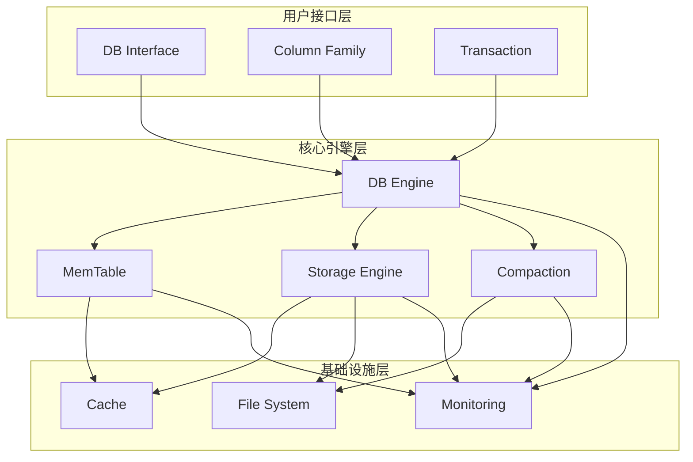

# RocksDB 核心模块深度分析

本目录包含RocksDB各个核心模块的详细分析文档，每个模块都包含架构图、时序图、关键函数源码分析和功能说明。

## 模块列表

### [1. 数据库引擎模块 (DB Engine)](./db-engine.md)
- DBImpl核心实现
- 数据库生命周期管理
- 事务处理机制
- 错误处理和恢复

### [2. 内存表模块 (MemTable)](./memtable.md)
- MemTable架构设计
- 跳表实现原理
- 哈希跳表优化
- 内存管理机制

### [3. 存储引擎模块 (Storage Engine)](./storage-engine.md)
- SST文件格式
- 表构建器实现
- 块缓存机制
- 索引和过滤器

### [4. 压缩模块 (Compaction)](./compaction.md)
- LSM-Tree压缩策略
- Level压缩实现
- Universal压缩实现
- FIFO压缩实现

### [5. 缓存模块 (Cache)](./cache.md)
- LRU缓存实现
- Clock缓存实现
- 分片缓存设计
- 缓存策略优化

### [6. 文件系统模块 (File System)](./file-system.md)
- 环境抽象层
- 文件操作接口
- WAL日志管理
- 目录管理

### [7. 监控模块 (Monitoring)](./monitoring.md)
- 统计信息收集
- 性能监控
- 事件监听器
- 线程状态跟踪

## 阅读指南

1. **按依赖顺序阅读**：建议先阅读基础模块（文件系统、缓存），再阅读核心模块（内存表、存储引擎），最后阅读高级模块（压缩、监控）

2. **结合源码阅读**：每个模块文档都包含关键源码片段，建议结合实际源码文件一起阅读

3. **关注架构图**：每个模块都提供了详细的架构图和时序图，有助于理解模块间的交互关系

4. **实践验证**：文档中的示例代码可以直接运行，建议动手实践加深理解

## 模块间关系图



## 性能关键路径

### 写入路径
```
应用 → DB Engine → MemTable → WAL → Background Flush → Storage Engine
```

### 读取路径
```
应用 → DB Engine → MemTable → Storage Engine → Cache → File System
```

### 压缩路径
```
Background Thread → Compaction → Storage Engine → File System
```

每个模块的详细分析请参考对应的文档文件。
