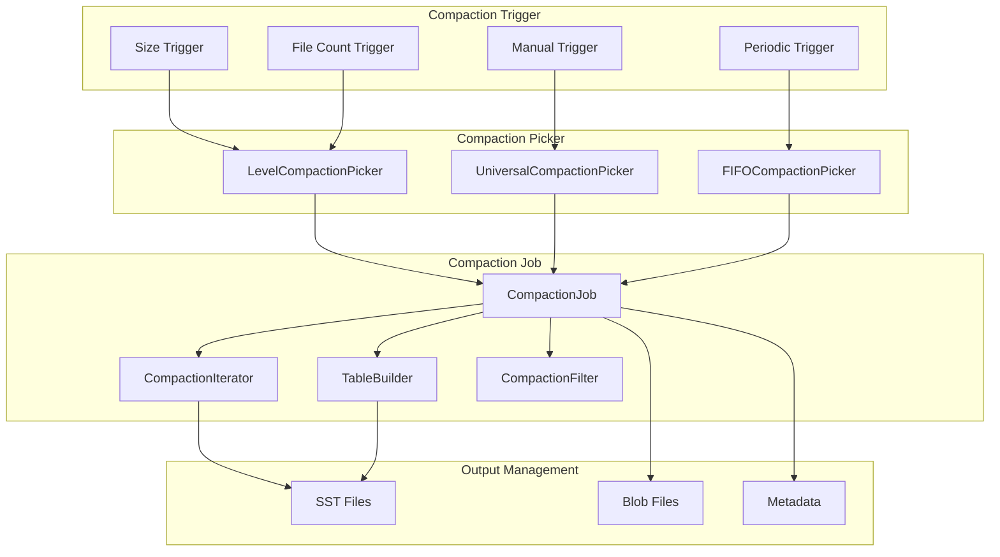
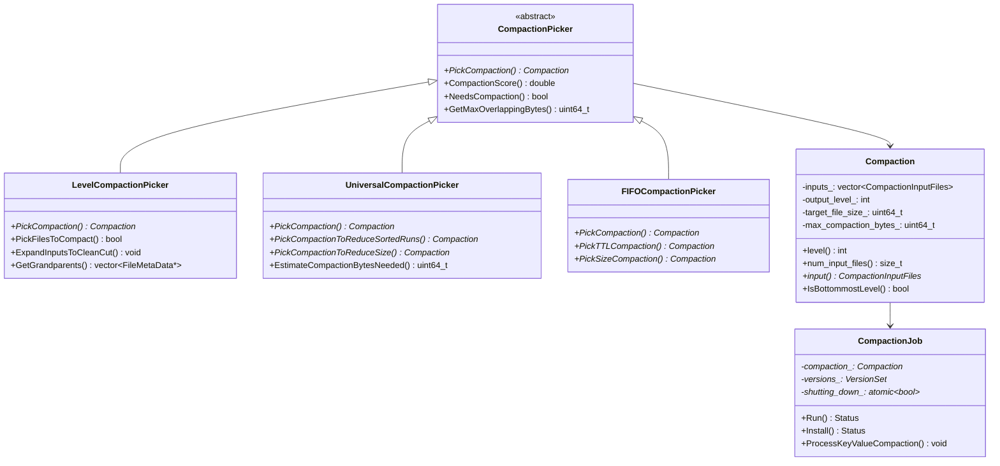
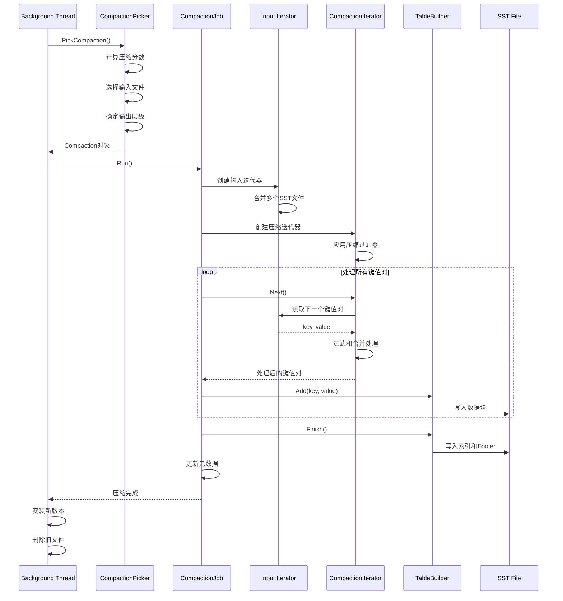
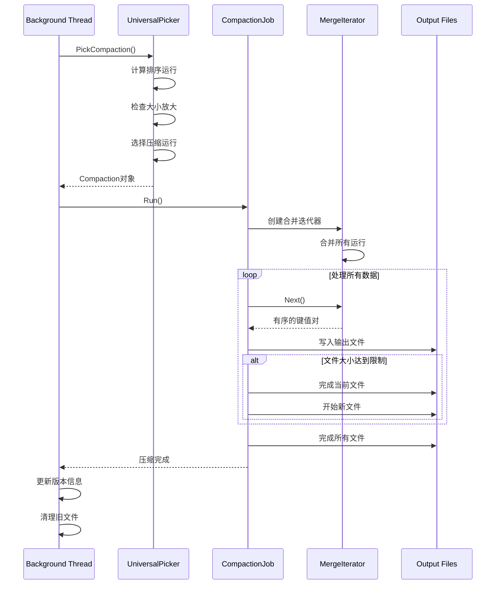

# Compaction 压缩模块深度分析

## 1. 模块概述

Compaction（压缩）是LSM-Tree架构的核心机制，负责将多个层级的SST文件合并和整理，以维护数据的有序性、去除重复和删除的数据、控制读放大。RocksDB支持多种压缩策略，每种策略都针对不同的工作负载进行了优化。

### 1.1 主要功能

- **数据合并**：将多个SST文件合并为更少的文件
- **垃圾回收**：删除过期和被覆盖的数据
- **层级管理**：维护LSM-Tree的层级结构
- **空间回收**：回收删除数据占用的空间
- **性能优化**：减少读放大，优化查询性能

### 1.2 压缩策略

- **Level Compaction**：分层压缩，数据按层级组织
- **Universal Compaction**：通用压缩，所有数据在同一层
- **FIFO Compaction**：先进先出压缩，适合时序数据

## 2. 架构设计

### 2.1 整体架构图



### 2.2 类层次结构



## 3. Level Compaction 实现分析

### 3.1 Level Compaction 策略

Level Compaction是RocksDB的默认压缩策略，将数据组织成多个层级，每个层级的数据大小呈指数增长。

**位置**: `db/compaction/compaction_picker_level.cc`

```cpp
// LevelCompactionPicker：Level压缩策略实现
class LevelCompactionPicker : public CompactionPicker {
 public:
  // 选择压缩任务
  // @param cf_name: 列族名称
  // @param mutable_cf_options: 可变列族选项
  // @param mutable_db_options: 可变数据库选项
  // @param vstorage: 版本存储信息
  // @param log_buffer: 日志缓冲区
  // @param max_output_level: 最大输出层级
  // @return: 压缩任务对象或nullptr
  Compaction* PickCompaction(const std::string& cf_name,
                             const MutableCFOptions& mutable_cf_options,
                             const MutableDBOptions& mutable_db_options,
                             VersionStorageInfo* vstorage,
                             LogBuffer* log_buffer,
                             int max_output_level = -1) override;

 private:
  // 选择Level 0到Level 1的压缩
  // @param vstorage: 版本存储信息
  // @param mutable_cf_options: 可变列族选项
  // @param start_level_inputs: 输出参数，起始层级的输入文件
  // @return: 是否成功选择
  bool PickCompactionBySize(VersionStorageInfo* vstorage,
                            const MutableCFOptions& mutable_cf_options,
                            CompactionInputFiles* start_level_inputs);

  // 选择需要压缩的文件
  // @param vstorage: 版本存储信息
  // @param level: 层级
  // @param output_level: 输出层级
  // @param inputs: 输出参数，选择的输入文件
  // @param parent_index: 父文件索引
  // @param base_index: 基础文件索引
  // @return: 是否成功选择
  bool PickFileToCompact(VersionStorageInfo* vstorage, int level,
                         int output_level, CompactionInputFiles* inputs,
                         int* parent_index, int* base_index);

  // 扩展输入文件以确保干净的切割
  // @param cf_name: 列族名称
  // @param vstorage: 版本存储信息
  // @param inputs: 输入输出参数，要扩展的文件列表
  // @param output_level: 输出层级
  // @return: 是否成功扩展
  bool ExpandInputsToCleanCut(const std::string& cf_name,
                              VersionStorageInfo* vstorage,
                              CompactionInputFiles* inputs,
                              int output_level);

  // 获取祖父级文件（用于限制压缩输出大小）
  // @param vstorage: 版本存储信息
  // @param inputs: 输入文件
  // @param output_level: 输出层级
  // @param grandparents: 输出参数，祖父级文件列表
  void GetGrandparents(VersionStorageInfo* vstorage,
                       const CompactionInputFiles& inputs,
                       int output_level,
                       std::vector<FileMetaData*>* grandparents);

  // 设置其他输入文件（Level n+1的文件）
  // @param cf_name: 列族名称
  // @param mutable_cf_options: 可变列族选项
  // @param vstorage: 版本存储信息
  // @param c: 压缩对象
  void SetupOtherInputs(const std::string& cf_name,
                        const MutableCFOptions& mutable_cf_options,
                        VersionStorageInfo* vstorage,
                        Compaction* c);
};

// Level压缩的核心选择逻辑
Compaction* LevelCompactionPicker::PickCompaction(
    const std::string& cf_name, const MutableCFOptions& mutable_cf_options,
    const MutableDBOptions& mutable_db_options, VersionStorageInfo* vstorage,
    LogBuffer* log_buffer, int max_output_level) {
  
  int level = -1;
  int output_level = -1;
  int parent_index = -1;
  int base_index = -1;
  CompactionInputFiles start_level_inputs;
  double start_level_score;
  CompactionReason compaction_reason = CompactionReason::kUnknown;

  // 1. 检查是否有手动压缩请求
  if (vstorage->compaction_picker_fifo()->HasCompactionRequest()) {
    // 处理手动压缩请求
    return PickManualCompaction(cf_name, mutable_cf_options, vstorage, 
                                log_buffer);
  }

  // 2. 选择需要压缩的层级
  // 优先选择分数最高的层级
  for (int i = 0; i < vstorage->num_levels() - 1; i++) {
    double score = vstorage->CompactionScore(i);
    if (score > 1.0) {
      level = i;
      start_level_score = score;
      compaction_reason = vstorage->CompactionReason(i);
      break;
    }
  }

  if (level == -1) {
    // 没有需要压缩的层级
    return nullptr;
  }

  // 3. 确定输出层级
  if (level == 0) {
    // Level 0的文件可能重叠，需要特殊处理
    output_level = vstorage->base_level();
  } else {
    output_level = level + 1;
  }

  // 4. 选择输入文件
  if (level == 0) {
    // Level 0压缩：选择所有重叠的文件
    if (!PickCompactionBySize(vstorage, mutable_cf_options, 
                              &start_level_inputs)) {
      return nullptr;
    }
  } else {
    // 其他层级压缩：选择单个文件
    if (!PickFileToCompact(vstorage, level, output_level, 
                           &start_level_inputs, &parent_index, &base_index)) {
      return nullptr;
    }
  }

  // 5. 创建压缩对象
  std::vector<CompactionInputFiles> inputs{start_level_inputs};
  if (output_level > level) {
    CompactionInputFiles output_level_inputs;
    output_level_inputs.level = output_level;
    inputs.push_back(output_level_inputs);
  }

  auto c = new Compaction(
      vstorage, ioptions_, mutable_cf_options, mutable_db_options,
      std::move(inputs), output_level,
      MaxFileSizeForLevel(mutable_cf_options, output_level,
                          compaction_style_, vstorage->base_level(),
                          ioptions_.level_compaction_dynamic_level_bytes),
      mutable_cf_options.max_compaction_bytes, GetPathId(ioptions_, 
                                                          mutable_cf_options, 
                                                          output_level),
      GetCompressionType(vstorage, mutable_cf_options, output_level,
                         vstorage->base_level()),
      GetCompressionOptions(mutable_cf_options, vstorage, output_level),
      Temperature::kUnknown,
      mutable_cf_options.max_subcompactions,
      /* grandparents */ {}, /* is_manual */ false, start_level_score,
      /* deletion_compaction */ false, /* l0_files_might_overlap */ true,
      compaction_reason);

  // 6. 设置其他输入文件
  SetupOtherInputs(cf_name, mutable_cf_options, vstorage, c);

  return c;
}
```

### 3.2 文件选择算法

```cpp
// 选择需要压缩的文件
bool LevelCompactionPicker::PickFileToCompact(
    VersionStorageInfo* vstorage, int level, int output_level,
    CompactionInputFiles* inputs, int* parent_index, int* base_index) {
  
  const std::vector<FileMetaData*>& level_files = vstorage->LevelFiles(level);
  const std::vector<FileMetaData*>& output_level_files = 
      vstorage->LevelFiles(output_level);

  // 1. 优先选择压缩优先级高的文件
  for (size_t i = 0; i < level_files.size(); i++) {
    FileMetaData* f = level_files[i];
    
    // 跳过正在压缩的文件
    if (f->being_compacted) {
      continue;
    }

    // 检查文件是否需要压缩
    if (f->compensated_file_size > 
        mutable_cf_options.target_file_size_base) {
      
      // 2. 检查与输出层级的重叠
      std::vector<FileMetaData*> overlapping_files;
      vstorage->GetOverlappingInputs(output_level, &f->smallest, &f->largest,
                                     &overlapping_files);

      // 3. 计算压缩收益
      uint64_t overlapping_bytes = 0;
      for (auto* overlapping_file : overlapping_files) {
        overlapping_bytes += overlapping_file->compensated_file_size;
      }

      // 4. 检查是否值得压缩
      if (overlapping_bytes < mutable_cf_options.max_compaction_bytes) {
        inputs->level = level;
        inputs->files.push_back(f);
        *base_index = static_cast<int>(i);
        return true;
      }
    }
  }

  // 5. 如果没有找到合适的文件，选择最老的文件
  if (!level_files.empty()) {
    FileMetaData* f = level_files[0];  // 最老的文件
    if (!f->being_compacted) {
      inputs->level = level;
      inputs->files.push_back(f);
      *base_index = 0;
      return true;
    }
  }

  return false;
}
```

## 4. Universal Compaction 实现分析

### 4.1 Universal Compaction 策略

Universal Compaction将所有数据保持在同一层级，通过定期的全量合并来维护数据的有序性。

**位置**: `db/compaction/compaction_picker_universal.cc`

```cpp
// UniversalCompactionPicker：通用压缩策略实现
class UniversalCompactionPicker : public CompactionPicker {
 public:
  // 选择压缩任务
  Compaction* PickCompaction(const std::string& cf_name,
                             const MutableCFOptions& mutable_cf_options,
                             const MutableDBOptions& mutable_db_options,
                             VersionStorageInfo* vstorage,
                             LogBuffer* log_buffer,
                             int max_output_level = -1) override;

 private:
  // 计算排序运行
  // @param vstorage: 版本存储信息
  // @param max_output_level: 最大输出层级
  // @param max_run_size: 输出参数，最大运行大小
  // @return: 排序运行列表
  std::vector<SortedRun> CalculateSortedRuns(
      const VersionStorageInfo& vstorage, int max_output_level,
      size_t* max_run_size);

  // 选择压缩以减少排序运行数量
  // @param sorted_runs: 排序运行列表
  // @param file_num_compaction_trigger: 文件数量触发阈值
  // @param ratio: 大小比例
  // @return: 压缩对象或nullptr
  Compaction* PickCompactionToReduceSortedRuns(
      const std::vector<SortedRun>& sorted_runs,
      unsigned int file_num_compaction_trigger, unsigned int ratio);

  // 选择压缩以减少大小放大
  // @param sorted_runs: 排序运行列表
  // @param file_num_compaction_trigger: 文件数量触发阈值
  // @return: 压缩对象或nullptr
  Compaction* PickCompactionToReduceSizeAmplification(
      const std::vector<SortedRun>& sorted_runs,
      unsigned int file_num_compaction_trigger);

  // 估算压缩所需字节数
  // @param vstorage: 版本存储信息
  // @return: 估算的字节数
  uint64_t EstimateCompactionBytesNeeded(VersionStorageInfo* vstorage);
};

// Universal压缩的核心选择逻辑
Compaction* UniversalCompactionPicker::PickCompaction(
    const std::string& cf_name, const MutableCFOptions& mutable_cf_options,
    const MutableDBOptions& mutable_db_options, VersionStorageInfo* vstorage,
    LogBuffer* log_buffer, int max_output_level) {
  
  const int kLevel0 = 0;
  double score = vstorage->CompactionScore(kLevel0);
  const int file_num_compaction_trigger =
      mutable_cf_options.level0_file_num_compaction_trigger;
  const unsigned int ratio =
      mutable_cf_options.compaction_options_universal.size_ratio;

  // 1. 计算排序运行
  size_t max_run_size = 0;
  std::vector<SortedRun> sorted_runs =
      CalculateSortedRuns(*vstorage, max_output_level, &max_run_size);

  if (sorted_runs.size() == 0 ||
      sorted_runs.size() < static_cast<size_t>(file_num_compaction_trigger)) {
    ROCKS_LOG_BUFFER(log_buffer, "[%s] Universal: nothing to do\n",
                     cf_name.c_str());
    return nullptr;
  }

  // 2. 尝试不同的压缩策略
  Compaction* c = nullptr;

  // 2.1 尝试减少大小放大的压缩
  c = PickCompactionToReduceSizeAmplification(sorted_runs, 
                                              file_num_compaction_trigger);
  if (c != nullptr) {
    ROCKS_LOG_BUFFER(log_buffer, 
                     "[%s] Universal: size amplification compaction\n",
                     cf_name.c_str());
    return c;
  }

  // 2.2 尝试减少排序运行数量的压缩
  c = PickCompactionToReduceSortedRuns(sorted_runs, 
                                       file_num_compaction_trigger, ratio);
  if (c != nullptr) {
    ROCKS_LOG_BUFFER(log_buffer, 
                     "[%s] Universal: sorted runs compaction\n",
                     cf_name.c_str());
    return c;
  }

  return nullptr;
}

// 计算排序运行
std::vector<SortedRun> UniversalCompactionPicker::CalculateSortedRuns(
    const VersionStorageInfo& vstorage, int max_output_level,
    size_t* max_run_size) {
  
  std::vector<SortedRun> sorted_runs;
  *max_run_size = 0;

  // 1. 处理Level 0的文件（每个文件是一个运行）
  const std::vector<FileMetaData*>& level0_files = vstorage.LevelFiles(0);
  for (FileMetaData* f : level0_files) {
    if (!f->being_compacted) {
      SortedRun run;
      run.level = 0;
      run.files.push_back(f);
      run.size = f->compensated_file_size;
      run.compensated_file_size = f->compensated_file_size;
      sorted_runs.push_back(run);
      *max_run_size = std::max(*max_run_size, run.size);
    }
  }

  // 2. 处理其他层级的文件（每个层级是一个运行）
  for (int level = 1; level <= max_output_level; level++) {
    const std::vector<FileMetaData*>& level_files = vstorage.LevelFiles(level);
    if (!level_files.empty()) {
      SortedRun run;
      run.level = level;
      run.size = 0;
      run.compensated_file_size = 0;
      
      for (FileMetaData* f : level_files) {
        if (!f->being_compacted) {
          run.files.push_back(f);
          run.size += f->fd.GetFileSize();
          run.compensated_file_size += f->compensated_file_size;
        }
      }
      
      if (!run.files.empty()) {
        sorted_runs.push_back(run);
        *max_run_size = std::max(*max_run_size, run.size);
      }
    }
  }

  // 3. 按大小排序（大的在前）
  std::sort(sorted_runs.begin(), sorted_runs.end(),
            [](const SortedRun& a, const SortedRun& b) {
              return a.size > b.size;
            });

  return sorted_runs;
}
```

## 5. CompactionJob 执行分析

### 5.1 CompactionJob 核心实现

**位置**: `db/compaction/compaction_job.cc`

```cpp
// CompactionJob：压缩作业执行器
// 负责执行具体的压缩操作，包括读取输入文件、合并数据、生成输出文件
class CompactionJob {
 public:
  // 构造函数
  // @param job_id: 作业ID
  // @param compaction: 压缩配置
  // @param db_options: 数据库选项
  // @param file_options: 文件选项
  // @param versions: 版本集合
  // @param shutting_down: 关闭标志
  // @param log_buffer: 日志缓冲区
  // @param directories: 目录管理器
  // @param stats: 统计信息
  // @param db_mutex: 数据库互斥锁
  // @param db_error_handler: 错误处理器
  // @param existing_snapshots: 现有快照列表
  // @param earliest_write_conflict_snapshot: 最早写冲突快照
  // @param snapshot_checker: 快照检查器
  // @param job_context: 作业上下文
  // @param table_cache: 表缓存
  // @param event_logger: 事件日志器
  // @param paranoid_file_checks: 是否进行严格文件检查
  // @param measure_io_stats: 是否测量IO统计
  // @param dbname: 数据库名称
  // @param compaction_job_stats: 压缩作业统计
  // @param thread_pri: 线程优先级
  // @param io_tracer: IO跟踪器
  // @param db_id: 数据库ID
  // @param db_session_id: 数据库会话ID
  // @param full_history_ts_low: 完整历史时间戳下界
  // @param trim_ts: 修剪时间戳
  CompactionJob(
      int job_id, Compaction* compaction, const ImmutableDBOptions& db_options,
      const MutableDBOptions& mutable_db_options, const FileOptions& file_options,
      VersionSet* versions, const std::atomic<bool>* shutting_down,
      LogBuffer* log_buffer, FSDirectory* db_directory,
      FSDirectory* output_directory, FSDirectory* blob_output_directory,
      Statistics* stats, InstrumentedMutex* db_mutex,
      ErrorHandler* db_error_handler,
      std::vector<SequenceNumber> existing_snapshots,
      SequenceNumber earliest_write_conflict_snapshot,
      const SnapshotChecker* snapshot_checker, JobContext* job_context,
      std::shared_ptr<Cache> table_cache, EventLogger* event_logger,
      bool paranoid_file_checks, bool measure_io_stats,
      const std::string& dbname, CompactionJobStats* compaction_job_stats,
      Env::Priority thread_pri, const std::shared_ptr<IOTracer>& io_tracer,
      const std::atomic<bool>* manual_compaction_paused,
      const std::atomic<bool>* manual_compaction_canceled,
      const std::string& db_id, const std::string& db_session_id,
      std::string full_history_ts_low, std::string trim_ts);

  // 析构函数
  ~CompactionJob();

  // 运行压缩作业
  // @return: 操作状态
  Status Run();

  // 安装压缩结果
  // @param mutable_cf_options: 可变列族选项
  // @return: 操作状态
  Status Install(const MutableCFOptions& mutable_cf_options);

 private:
  // 处理键值压缩
  // @param sub_compact: 子压缩状态
  void ProcessKeyValueCompaction(SubcompactionState* sub_compact);

  // 创建输入迭代器
  // @param sub_compact: 子压缩状态
  // @param cfd: 列族数据
  // @param iterators: 迭代器容器
  // @param boundaries: 边界信息
  // @param read_options: 读取选项
  // @return: 合并后的迭代器
  InternalIterator* CreateInputIterator(
      SubcompactionState* sub_compact, ColumnFamilyData* cfd,
      SubcompactionInternalIterators& iterators,
      const SubcompactionKeyBoundaries& boundaries,
      const ReadOptions& read_options);

  // 创建压缩迭代器
  // @param sub_compact: 子压缩状态
  // @param cfd: 列族数据
  // @param input_iter: 输入迭代器
  // @param compaction_filter: 压缩过滤器
  // @param merge: 合并助手
  // @param blob_resources: Blob资源
  // @param write_options: 写入选项
  // @return: 压缩迭代器
  std::unique_ptr<CompactionIterator> CreateCompactionIterator(
      SubcompactionState* sub_compact, ColumnFamilyData* cfd,
      InternalIterator* input_iter, const CompactionFilter* compaction_filter,
      MergeHelper& merge, BlobFileResources& blob_resources,
      const WriteOptions& write_options);

  // 完成压缩输出文件
  // @param sub_compact: 子压缩状态
  // @param input_status: 输入状态
  // @param output_directory: 输出目录
  // @return: 操作状态
  Status FinishCompactionOutputFile(SubcompactionState* sub_compact,
                                    const Status& input_status,
                                    FSDirectory* output_directory);

  // 压缩配置
  Compaction* compact_;
  
  // 数据库选项
  const ImmutableDBOptions& db_options_;
  const MutableDBOptions& mutable_db_options_;
  const FileOptions file_options_;
  
  // 版本管理
  VersionSet* versions_;
  
  // 控制标志
  const std::atomic<bool>* shutting_down_;
  
  // 日志和统计
  LogBuffer* log_buffer_;
  Statistics* stats_;
  
  // 同步和错误处理
  InstrumentedMutex* db_mutex_;
  ErrorHandler* db_error_handler_;
  
  // 快照管理
  std::vector<SequenceNumber> existing_snapshots_;
  SequenceNumber earliest_write_conflict_snapshot_;
  const SnapshotChecker* snapshot_checker_;
  
  // 作业上下文
  JobContext* job_context_;
  
  // 缓存和事件
  std::shared_ptr<Cache> table_cache_;
  EventLogger* event_logger_;
  
  // 配置标志
  bool paranoid_file_checks_;
  bool measure_io_stats_;
  
  // 标识信息
  std::string dbname_;
  std::string db_id_;
  std::string db_session_id_;
  
  // 统计信息
  CompactionJobStats* compaction_job_stats_;
  
  // 线程优先级
  Env::Priority thread_pri_;
  
  // IO跟踪
  std::shared_ptr<IOTracer> io_tracer_;
  
  // 手动压缩控制
  const std::atomic<bool>* manual_compaction_paused_;
  const std::atomic<bool>* manual_compaction_canceled_;
  
  // 时间戳管理
  std::string full_history_ts_low_;
  std::string trim_ts_;
  
  // 子压缩状态
  std::vector<SubcompactionState> compact_->sub_compact_states;
};

// 运行压缩作业的核心实现
Status CompactionJob::Run() {
  AutoThreadOperationStageUpdater stage_updater(
      ThreadStatus::STAGE_COMPACTION_RUN);
  
  TEST_SYNC_POINT("CompactionJob::Run():Start");
  log_buffer_->FlushBufferToLog();
  LogCompaction();

  const size_t num_threads = compact_->sub_compact_states.size();
  assert(num_threads > 0);

  const uint64_t start_micros = db_options_.clock->NowMicros();

  // 1. 启动子压缩线程
  std::vector<port::Thread> thread_pool;
  thread_pool.reserve(num_threads - 1);
  
  for (size_t i = 1; i < num_threads; i++) {
    thread_pool.emplace_back(&CompactionJob::ProcessKeyValueCompaction, this,
                             &compact_->sub_compact_states[i]);
  }

  // 2. 在主线程中处理第一个子压缩
  ProcessKeyValueCompaction(&compact_->sub_compact_states[0]);

  // 3. 等待所有子压缩完成
  for (auto& thread : thread_pool) {
    thread.join();
  }

  // 4. 检查所有子压缩的状态
  Status status;
  for (const auto& state : compact_->sub_compact_states) {
    if (!state.status.ok()) {
      status = state.status;
      break;
    }
  }

  // 5. 记录统计信息
  const uint64_t micros = db_options_.clock->NowMicros() - start_micros;
  MeasureTime(stats_, COMPACTION_TIME, micros);

  if (status.ok()) {
    constexpr IOStatus::IOErrorScope io_error_scope =
        IOStatus::IOErrorScope::kCompaction;
    status = io_status_.status();
  }

  if (status.ok()) {
    thread_pool.clear();
    std::vector<port::Thread>().swap(thread_pool);

    TEST_SYNC_POINT("CompactionJob::Run():BeforeVerify");

    // 6. 验证输出文件
    if (output_directory_) {
      status = output_directory_->FsyncWithDirOptions(
          IOOptions(), nullptr,
          DirFsyncOptions(DirFsyncOptions::FsyncReason::kNewFileSynced));
    }
  }

  if (status.ok()) {
    // 7. 更新统计信息
    UpdateCompactionJobStats(status);
  }

  TEST_SYNC_POINT("CompactionJob::Run():End");
  
  compact_->status = status;
  return status;
}
```

### 5.2 键值处理核心逻辑

```cpp
// 处理键值压缩的核心逻辑
void CompactionJob::ProcessKeyValueCompaction(SubcompactionState* sub_compact) {
  assert(sub_compact);
  assert(sub_compact->compaction);

  AutoThreadOperationStageUpdater stage_updater(
      ThreadStatus::STAGE_COMPACTION_PROCESS_KV);

  // 1. 初始化压缩过滤器
  ColumnFamilyData* cfd = sub_compact->compaction->column_family_data();
  const CompactionFilter* compaction_filter;
  std::unique_ptr<CompactionFilter> compaction_filter_from_factory = nullptr;
  
  if (cfd->ioptions()->compaction_filter_factory != nullptr) {
    CompactionFilter::Context context;
    context.is_full_compaction = sub_compact->compaction->IsFullCompaction();
    context.is_manual_compaction = sub_compact->compaction->IsManualCompaction();
    context.column_family_id = cfd->GetID();
    compaction_filter_from_factory =
        cfd->ioptions()->compaction_filter_factory->CreateCompactionFilter(context);
    compaction_filter = compaction_filter_from_factory.get();
  } else {
    compaction_filter = cfd->ioptions()->compaction_filter;
  }

  // 2. 创建输入迭代器
  SubcompactionKeyBoundaries boundaries(sub_compact->start, sub_compact->end);
  SubcompactionInternalIterators iterators;
  ReadOptions read_options;
  read_options.verify_checksums = true;
  read_options.fill_cache = false;
  
  InternalIterator* input_iter = CreateInputIterator(
      sub_compact, cfd, iterators, boundaries, read_options);
  assert(input_iter);
  input_iter->SeekToFirst();

  // 3. 创建合并助手
  const WriteOptions write_options(Env::IOPriority::IO_LOW,
                                   Env::IOActivity::kCompaction);
  MergeHelper merge(
      env_, cfd->user_comparator(), cfd->ioptions()->merge_operator.get(),
      compaction_filter, db_options_.info_log.get(),
      false /* internal key corruption is expected */,
      existing_snapshots_.empty() ? 0 : existing_snapshots_.back(),
      snapshot_checker_, compact_->compaction->level(), db_options_.stats);

  // 4. 创建压缩迭代器
  BlobFileResources blob_resources;
  auto c_iter = CreateCompactionIterator(
      sub_compact, cfd, input_iter, compaction_filter, merge, blob_resources,
      write_options);
  assert(c_iter);
  c_iter->SeekToFirst();

  // 5. 处理所有键值对
  const std::string* const full_history_ts_low =
      full_history_ts_low_.empty() ? nullptr : &full_history_ts_low_;
  
  while (c_iter->Valid() && !cfd->IsDropped() &&
         !shutting_down_->load(std::memory_order_relaxed)) {
    
    // 5.1 检查手动压缩是否被暂停或取消
    if (manual_compaction_paused_ &&
        manual_compaction_paused_->load(std::memory_order_relaxed)) {
      break;
    }
    if (manual_compaction_canceled_ &&
        manual_compaction_canceled_->load(std::memory_order_relaxed)) {
      break;
    }

    // 5.2 获取当前键值对
    Slice key = c_iter->key();
    Slice value = c_iter->value();
    
    // 5.3 检查是否需要开始新的输出文件
    if (sub_compact->builder == nullptr) {
      Status s = OpenCompactionOutputFile(sub_compact);
      if (!s.ok()) {
        sub_compact->status = s;
        break;
      }
    }

    // 5.4 添加键值对到输出文件
    sub_compact->builder->Add(key, value);
    sub_compact->current_output()->meta.UpdateBoundaries(
        key, value, c_iter->ikey().sequence, c_iter->ikey().type);

    // 5.5 更新统计信息
    sub_compact->num_output_records++;
    sub_compact->current_output()->meta.num_entries++;

    // 5.6 检查是否需要完成当前输出文件
    if (sub_compact->builder->NumEntries() > 0 &&
        sub_compact->builder->FileSize() >=
            sub_compact->compaction->max_output_file_size()) {
      Status s = FinishCompactionOutputFile(sub_compact, c_iter->status(),
                                            output_directory_);
      if (!s.ok()) {
        sub_compact->status = s;
        break;
      }
    }

    c_iter->Next();
  }

  // 6. 完成最后一个输出文件
  if (sub_compact->builder != nullptr) {
    Status s = FinishCompactionOutputFile(sub_compact, c_iter->status(),
                                          output_directory_);
    if (!s.ok()) {
      sub_compact->status = s;
    }
  }

  // 7. 清理资源
  sub_compact->status = c_iter->status();
  c_iter.reset();
  input_iter->~InternalIterator();
}
```

## 6. 压缩触发机制

### 6.1 触发条件

```mermaid
graph TD
    subgraph "Size-based Triggers"
        ST1[Level Size Exceeds Limit]
        ST2[Level0 File Count > Threshold]
        ST3[Write Amplification Too High]
    end
    
    subgraph "Time-based Triggers"
        TT1[Periodic Compaction]
        TT2[TTL Expiration]
        TT3[File Age Exceeds Limit]
    end
    
    subgraph "Manual Triggers"
        MT1[CompactRange API]
        MT2[Admin Command]
        MT3[Maintenance Operation]
    end
    
    subgraph "Quality Triggers"
        QT1[Too Many Delete Markers]
        QT2[Fragmentation Too High]
        QT3[Read Amplification High]
    end
    
    ST1 --> COMPACTION[Trigger Compaction]
    ST2 --> COMPACTION
    ST3 --> COMPACTION
    TT1 --> COMPACTION
    TT2 --> COMPACTION
    TT3 --> COMPACTION
    MT1 --> COMPACTION
    MT2 --> COMPACTION
    MT3 --> COMPACTION
    QT1 --> COMPACTION
    QT2 --> COMPACTION
    QT3 --> COMPACTION
```



### 6.2 触发逻辑实现

```cpp
// 检查是否需要压缩
bool DBImpl::NeedsCompaction() const {
  for (auto cfd : *versions_->GetColumnFamilySet()) {
    if (cfd->IsDropped()) {
      continue;
    }
    
    // 1. 检查大小触发
    if (cfd->current()->storage_info()->NeedsCompaction()) {
      return true;
    }
    
    // 2. 检查文件数量触发
    if (cfd->current()->storage_info()->CompactionScore(0) >= 1.0) {
      return true;
    }
    
    // 3. 检查定期压缩
    if (cfd->current()->storage_info()->FilesMarkedForPeriodicCompaction().size() > 0) {
      return true;
    }
    
    // 4. 检查强制压缩
    if (cfd->current()->storage_info()->FilesMarkedForCompaction().size() > 0) {
      return true;
    }
  }
  
  return false;
}

// 计算压缩分数
double VersionStorageInfo::CompactionScore(int level) const {
  if (level == 0) {
    // Level 0: 基于文件数量
    int num_files = static_cast<int>(files_[level].size());
    int trigger = mutable_cf_options_.level0_file_num_compaction_trigger;
    if (num_files >= trigger) {
      return static_cast<double>(num_files) / trigger;
    }
    return 0.0;
  } else {
    // 其他层级: 基于总大小
    uint64_t level_bytes = 0;
    for (auto f : files_[level]) {
      level_bytes += f->compensated_file_size;
    }
    
    uint64_t level_target = MaxBytesForLevel(level);
    if (level_target == 0) {
      return 0.0;
    }
    
    return static_cast<double>(level_bytes) / level_target;
  }
}
```

## 7. 性能优化时序图

### 7.1 Level Compaction 时序图



### 7.2 Universal Compaction 时序图



## 8. 配置调优指南

### 8.1 Level Compaction 配置

```cpp
// Level压缩的推荐配置
Options options;

// 基础层级配置
options.level_compaction_dynamic_level_bytes = true;  // 动态层级大小
options.level0_file_num_compaction_trigger = 4;      // L0文件数触发阈值
options.level0_slowdown_writes_trigger = 20;         // L0写入减速阈值
options.level0_stop_writes_trigger = 36;             // L0写入停止阈值

// 层级大小配置
options.max_bytes_for_level_base = 256 * 1024 * 1024;  // L1大小: 256MB
options.max_bytes_for_level_multiplier = 10;           // 层级倍数: 10x
options.target_file_size_base = 64 * 1024 * 1024;      // 目标文件大小: 64MB
options.target_file_size_multiplier = 1;               // 文件大小倍数: 1x

// 压缩线程配置
options.max_background_compactions = 4;                // 最大压缩线程数
options.max_subcompactions = 4;                        // 最大子压缩数

// 压缩优先级
options.compaction_pri = kMinOverlappingRatio;          // 最小重叠比例优先
```

### 8.2 Universal Compaction 配置

```cpp
// Universal压缩的推荐配置
Options options;
options.compaction_style = kCompactionStyleUniversal;

// Universal压缩选项
options.compaction_options_universal.size_ratio = 1;           // 大小比例: 1%
options.compaction_options_universal.min_merge_width = 2;      // 最小合并宽度
options.compaction_options_universal.max_merge_width = UINT_MAX; // 最大合并宽度
options.compaction_options_universal.max_size_amplification_percent = 200; // 最大大小放大: 200%
options.compaction_options_universal.compression_size_percent = -1; // 压缩大小百分比

// 触发配置
options.level0_file_num_compaction_trigger = 2;        // 文件数触发阈值
options.target_file_size_base = 64 * 1024 * 1024;      // 目标文件大小

// 写入配置
options.write_buffer_size = 64 * 1024 * 1024;          // 写缓冲区大小
options.max_write_buffer_number = 3;                   // 最大写缓冲区数
```

### 8.3 FIFO Compaction 配置

```cpp
// FIFO压缩的推荐配置（适合时序数据）
Options options;
options.compaction_style = kCompactionStyleFIFO;

// FIFO压缩选项
CompactionOptionsFIFO fifo_options;
fifo_options.max_table_files_size = 10ULL * 1024 * 1024 * 1024; // 10GB总大小
fifo_options.allow_compaction = true;                           // 允许压缩
fifo_options.ttl = 7 * 24 * 60 * 60;                           // TTL: 7天

options.compaction_options_fifo = fifo_options;

// 禁用不必要的功能
options.max_open_files = -1;                           // 无限制打开文件数
options.disable_auto_compactions = false;              // 启用自动压缩
```

## 9. 最佳实践

### 9.1 压缩策略选择

1. **Level Compaction**：
   - 适合：通用工作负载，读多写少
   - 优点：读放大低，空间放大低
   - 缺点：写放大较高

2. **Universal Compaction**：
   - 适合：写多读少，临时数据
   - 优点：写放大低，实现简单
   - 缺点：空间放大高，读放大高

3. **FIFO Compaction**：
   - 适合：时序数据，日志数据
   - 优点：写放大最低，简单高效
   - 缺点：不支持更新和删除

### 9.2 性能调优

1. **监控压缩指标**：
   - 压缩队列长度
   - 压缩延迟
   - 写放大比例
   - 读放大比例

2. **合理配置资源**：
   - CPU：压缩线程数
   - 内存：写缓冲区大小
   - 磁盘：IO带宽分配

3. **优化压缩触发**：
   - 调整触发阈值
   - 设置合理的文件大小
   - 配置适当的层级倍数

### 9.3 故障排查

1. **压缩停滞**：
   - 检查磁盘空间
   - 检查IO性能
   - 检查压缩线程状态

2. **写入阻塞**：
   - 检查L0文件数量
   - 检查压缩速度
   - 调整触发阈值

3. **读取性能下降**：
   - 检查层级分布
   - 检查文件重叠
   - 优化压缩策略

压缩模块是RocksDB性能的关键，正确理解和配置压缩策略对于获得最佳性能至关重要。
