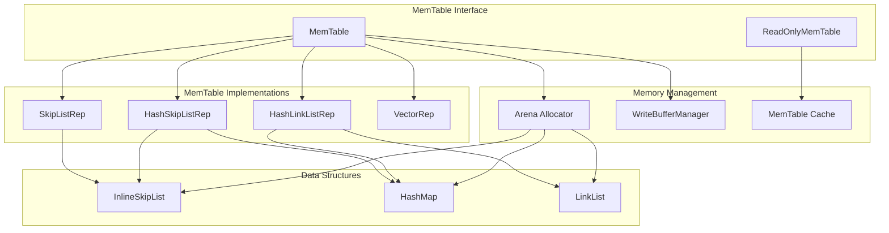
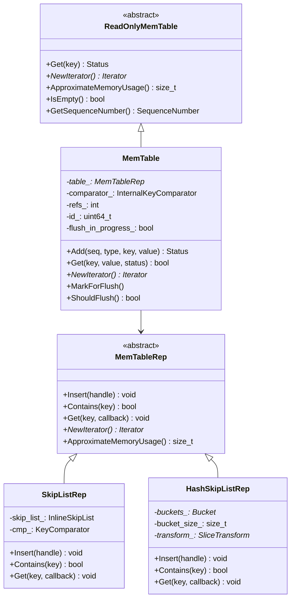
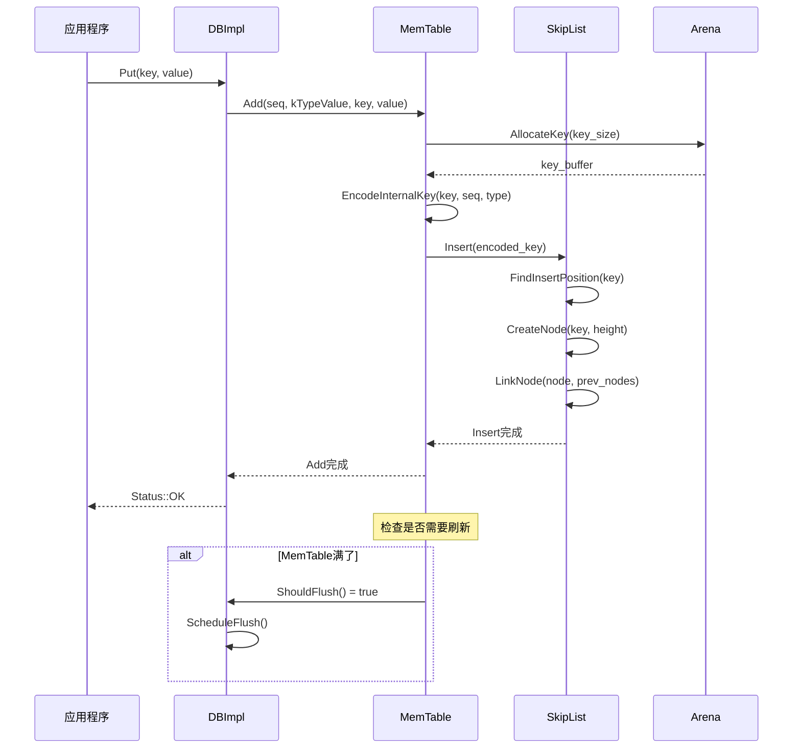
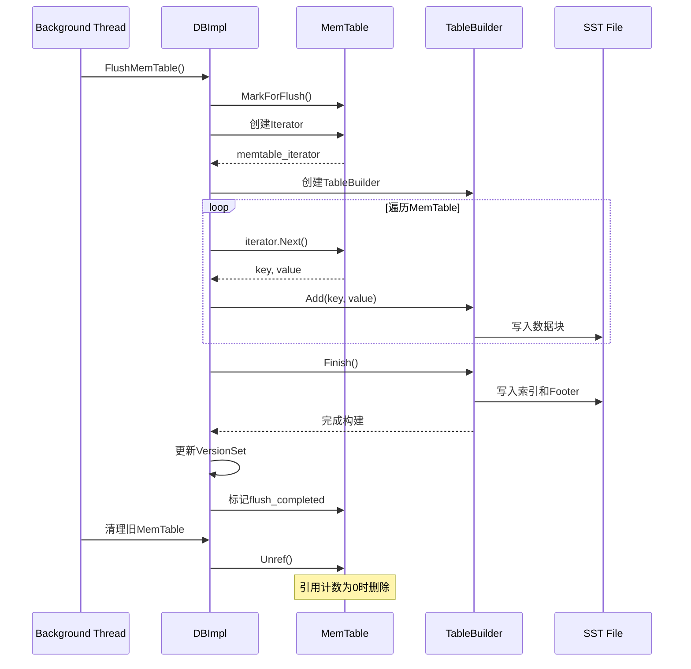

## 1. 模块概述

MemTable是RocksDB中的核心内存数据结构，作为LSM-Tree架构中的第一层，负责缓存最近的写入操作。它提供了高效的插入、查找和迭代功能，是整个写入路径的关键组件。

### 1.1 主要功能

- **写入缓冲**：缓存最近的Put、Delete、Merge操作
- **有序存储**：维护键的有序性，支持范围查询
- **并发访问**：支持多线程并发读取，单线程写入
- **内存管理**：通过WriteBufferManager控制内存使用
- **快照支持**：支持MVCC和一致性读取

### 1.2 核心特性

- **多种实现**：支持跳表、哈希跳表、哈希链表等数据结构
- **内存优化**：使用Arena内存分配器减少碎片
- **原子操作**：保证并发安全性
- **序列号管理**：维护操作的时序关系

## 2. 架构设计

### 2.1 整体架构图



### 2.2 类层次结构



## 3. 核心实现分析

### 3.1 MemTable核心类

**位置**: `db/memtable.h` 和 `db/memtable.cc`

```cpp
// MemTable类：RocksDB的内存表实现
// 继承自ReadOnlyMemTable，提供可写功能
class MemTable final : public ReadOnlyMemTable {
 public:
  // 键比较器：用于内部键的比较
  struct KeyComparator final : public MemTableRep::KeyComparator {
    const InternalKeyComparator comparator;
    explicit KeyComparator(const InternalKeyComparator& c) : comparator(c) {}
    
    // 比较两个内部键
    // @param aptr: 第一个键的指针
    // @param bptr: 第二个键的指针  
    // @return: 比较结果，<0表示a<b，0表示a==b，>0表示a>b
    int operator()(const char* aptr, const char* bptr) const override {
      // 解码内部键长度
      uint32_t a_len = DecodeFixed32(aptr);
      uint32_t b_len = DecodeFixed32(bptr);
      
      // 创建内部键切片
      Slice a_key(aptr + 4, a_len);
      Slice b_key(bptr + 4, b_len);
      
      // 使用内部键比较器进行比较
      return comparator.Compare(a_key, b_key);
    }
    
    const char* Name() const override { return "rocksdb.InternalKeyComparator"; }
  };

  // 构造函数：创建MemTable实例
  // @param cmp: 内部键比较器
  // @param ioptions: 不可变选项
  // @param mutable_cf_options: 可变列族选项
  // @param write_buffer_manager: 写缓冲区管理器
  // @param largest_seqno: 最大序列号
  // @param column_family_id: 列族ID
  explicit MemTable(const InternalKeyComparator& cmp,
                    const ImmutableOptions& ioptions,
                    const MutableCFOptions& mutable_cf_options,
                    WriteBufferManager* write_buffer_manager,
                    SequenceNumber largest_seqno,
                    uint32_t column_family_id);

  // 析构函数：清理资源
  ~MemTable();

  // 添加操作到MemTable
  // @param s: 序列号，用于版本控制和MVCC
  // @param type: 操作类型（kTypeValue=Put, kTypeDeletion=Delete, kTypeMerge=Merge等）
  // @param key: 用户键
  // @param value: 值（对于Delete操作可能为空）
  // @param kv_prot_info: 键值保护信息，用于数据完整性检查
  // @param allow_concurrent: 是否允许并发写入
  // @param post_process_info: 后处理信息
  // @param hint_per_batch: 每批次的提示信息
  // @return: 操作状态
  Status Add(SequenceNumber s, ValueType type, const Slice& key,
             const Slice& value,
             const ProtectionInfoKVOS64* kv_prot_info = nullptr,
             bool allow_concurrent = false,
             MemTablePostProcessInfo* post_process_info = nullptr,
             void** hint_per_batch = nullptr);

  // 从MemTable获取值
  // @param lkey: 查找键，包含用户键和序列号
  // @param value: 输出参数，返回找到的值
  // @param s: 输出参数，返回操作状态
  // @param merge_context: 合并上下文，用于处理Merge操作
  // @param range_del_agg: 范围删除聚合器
  // @param seq: 输出参数，返回找到记录的序列号
  // @param read_opts: 读取选项
  // @param callback: 读取回调函数
  // @param is_blob_index: 输出参数，指示是否为Blob索引
  // @return: 是否找到记录
  bool Get(const LookupKey& lkey, std::string* value, Status* s,
           MergeContext* merge_context,
           RangeDelAggregator* range_del_agg, SequenceNumber* seq,
           const ReadOptions& read_opts, ReadCallback* callback = nullptr,
           bool* is_blob_index = nullptr);

  // 创建MemTable迭代器
  // @param read_opts: 读取选项
  // @param seqno_to_time_mapping: 序列号到时间的映射
  // @param arena: 内存分配器
  // @param prefix_extractor: 前缀提取器
  // @param for_flush: 是否用于刷新操作
  // @return: 迭代器指针
  InternalIterator* NewIterator(const ReadOptions& read_opts,
                                const SeqnoToTimeMapping* seqno_to_time_mapping,
                                Arena* arena,
                                const SliceTransform* prefix_extractor,
                                bool for_flush = false) override;

  // 获取近似内存使用量
  // @return: 内存使用字节数
  size_t ApproximateMemoryUsage() override {
    return arena_.MemoryAllocatedBytes();
  }

  // 获取分配的内存字节数
  // @return: 分配的内存字节数
  size_t MemoryAllocatedBytes() const override {
    return arena_.MemoryAllocatedBytes();
  }

  // 标记为需要刷新
  void MarkForFlush() { 
    marked_for_flush_.StoreRelaxed(true); 
  }

  // 检查是否标记为刷新
  // @return: 是否需要刷新
  bool IsMarkedForFlush() const { 
    return marked_for_flush_.LoadRelaxed(); 
  }

  // 检查是否应该刷新（基于大小）
  // @return: 是否应该刷新
  bool ShouldFlush() const {
    return arena_.MemoryAllocatedBytes() >= write_buffer_size_;
  }

 private:
  friend class MemTableList;
  friend class MemTableListVersion;

  // 内部键比较器
  KeyComparator comparator_;
  
  // 不可变选项的引用
  const ImmutableOptions& ioptions_;
  
  // 可变选项的引用
  const MutableCFOptions& moptions_;
  
  // 写缓冲区大小
  const size_t write_buffer_size_;
  
  // 内存分配器
  mutable Arena arena_;
  
  // 底层数据结构实现
  std::unique_ptr<MemTableRep> table_;
  
  // 引用计数
  std::atomic<int> refs_;
  
  // MemTable ID
  uint64_t id_;
  
  // 刷新状态
  std::atomic<bool> flush_in_progress_;
  std::atomic<bool> flush_completed_;
  
  // 刷新标记
  RelaxedAtomic<bool> marked_for_flush_;
  
  // 版本编辑信息
  VersionEdit edit_;
  
  // 列族ID
  uint32_t column_family_id_;
  
  // 时钟指针
  SystemClock* clock_;
};
```

### 3.2 SkipList实现

**位置**: `memtable/skiplistrep.cc`

```cpp
// SkipListRep：基于跳表的MemTable实现
// 跳表是一种概率性数据结构，提供O(log n)的查找、插入性能
class SkipListRep : public MemTableRep {
  // 内联跳表，优化了内存布局
  InlineSkipList<const MemTableRep::KeyComparator&> skip_list_;
  const MemTableRep::KeyComparator& cmp_;
  const SliceTransform* transform_;
  const size_t lookahead_;

 public:
  // 构造函数
  // @param compare: 键比较器
  // @param allocator: 内存分配器
  // @param transform: 切片转换器，用于前缀提取
  // @param lookahead: 预读大小，用于迭代器优化
  explicit SkipListRep(const MemTableRep::KeyComparator& compare,
                       Allocator* allocator, 
                       const SliceTransform* transform,
                       const size_t lookahead)
      : MemTableRep(allocator),
        skip_list_(compare, allocator),
        cmp_(compare),
        transform_(transform),
        lookahead_(lookahead) {}

  // 分配键空间
  // @param len: 需要分配的长度
  // @param buf: 输出参数，返回分配的缓冲区指针
  // @return: 键句柄
  KeyHandle Allocate(const size_t len, char** buf) override {
    *buf = skip_list_.AllocateKey(len);
    return static_cast<KeyHandle>(*buf);
  }

  // 插入键到跳表
  // @param handle: 键句柄
  // 要求：没有相等的键已经存在于列表中
  void Insert(KeyHandle handle) override {
    skip_list_.Insert(static_cast<char*>(handle));
  }

  // 插入键（带返回值）
  // @param handle: 键句柄
  // @return: 是否成功插入
  bool InsertKey(KeyHandle handle) override {
    return skip_list_.Insert(static_cast<char*>(handle));
  }

  // 带提示的插入
  // @param handle: 键句柄
  // @param hint: 插入提示，用于优化插入位置查找
  void InsertWithHint(KeyHandle handle, void** hint) override {
    skip_list_.InsertWithHint(static_cast<char*>(handle), hint);
  }

  // 并发插入（带提示）
  // @param handle: 键句柄
  // @param hint: 插入提示
  void InsertWithHintConcurrently(KeyHandle handle, void** hint) override {
    skip_list_.InsertConcurrently(static_cast<char*>(handle));
  }

  // 检查键是否存在
  // @param key: 要查找的键
  // @return: 是否包含该键
  bool Contains(const char* key) const override {
    return skip_list_.Contains(key);
  }

  // 获取操作：通过回调函数处理找到的条目
  // @param k: 查找键
  // @param callback_args: 回调参数
  // @param callback_func: 回调函数，对每个匹配的条目调用
  void Get(const LookupKey& k, void* callback_args,
           bool (*callback_func)(void* arg, const char* entry)) override {
    SkipListRep::Iterator iter(&skip_list_);
    Slice dummy_slice;
    for (iter.Seek(dummy_slice, k.memtable_key().data());
         iter.Valid() && callback_func(callback_args, iter.key());
         iter.Next()) {
    }
  }

  // 获取近似内存使用量
  // @return: 内存使用字节数
  size_t ApproximateMemoryUsage() override {
    // 跳表节点内存 + Arena开销
    return sizeof(skip_list_) + skip_list_.ApproximateMemoryUsage();
  }

  // 创建迭代器
  // @param arena: 内存分配器（可选）
  // @return: 迭代器指针
  MemTableRep::Iterator* GetIterator(Arena* arena = nullptr) override {
    if (lookahead_ > 0) {
      void* mem = arena ? arena->AllocateAligned(sizeof(LookaheadIterator))
                        : operator new(sizeof(LookaheadIterator));
      return new (mem) LookaheadIterator(*this);
    } else {
      void* mem = arena ? arena->AllocateAligned(sizeof(Iterator))
                        : operator new(sizeof(Iterator));
      return new (mem) Iterator(&skip_list_);
    }
  }
};
```

### 3.3 InlineSkipList核心实现

**位置**: `memtable/inlineskiplist.h`

```cpp
// InlineSkipList：内联跳表实现
// 将键数据直接存储在节点中，减少内存访问次数
template <class Comparator>
class InlineSkipList {
 private:
  struct Node;
  struct Splice;

 public:
  // 构造函数
  // @param cmp: 比较器
  // @param allocator: 内存分配器
  // @param max_height: 最大高度（默认12）
  // @param branching_factor: 分支因子（默认4）
  explicit InlineSkipList(Comparator cmp, Allocator* allocator,
                          int32_t max_height = 12, 
                          int32_t branching_factor = 4);

  // 插入键
  // @param key: 要插入的键
  // @return: 是否成功插入（false表示键已存在）
  bool Insert(const char* key);

  // 并发插入
  // @param key: 要插入的键
  // @return: 是否成功插入
  bool InsertConcurrently(const char* key);

  // 带提示的插入
  // @param key: 要插入的键
  // @param hint: 插入提示，存储上次插入位置信息
  void InsertWithHint(const char* key, void** hint);

  // 检查是否包含键
  // @param key: 要查找的键
  // @return: 是否包含
  bool Contains(const char* key) const;

  // 分配键空间
  // @param key_size: 键大小
  // @return: 分配的内存指针
  char* AllocateKey(size_t key_size);

  // 获取近似内存使用量
  // @return: 内存使用字节数
  size_t ApproximateMemoryUsage() const;

  // 迭代器类
  class Iterator {
   public:
    explicit Iterator(const InlineSkipList* list);
    
    // 检查迭代器是否有效
    bool Valid() const { return node_ != nullptr; }
    
    // 获取当前键
    const char* key() const {
      assert(Valid());
      return node_->Key();
    }
    
    // 移动到下一个元素
    void Next();
    
    // 移动到前一个元素
    void Prev();
    
    // 定位到第一个大于等于target的元素
    void Seek(const char* target);
    
    // 定位到第一个元素
    void SeekToFirst();
    
    // 定位到最后一个元素
    void SeekToLast();

   private:
    const InlineSkipList* list_;
    Node* node_;
  };

 private:
  // 跳表节点结构
  struct Node {
    // 获取键数据
    const char* Key() const {
      return reinterpret_cast<const char*>(this) + sizeof(Node);
    }
    
    // 获取指定层级的下一个节点
    Node* Next(int n) {
      assert(n >= 0);
      return next_[n].load(std::memory_order_acquire);
    }
    
    // 设置指定层级的下一个节点
    void SetNext(int n, Node* x) {
      assert(n >= 0);
      next_[n].store(x, std::memory_order_release);
    }
    
    // 无屏障版本的Next（用于性能优化）
    Node* NoBarrier_Next(int n) {
      assert(n >= 0);
      return next_[n].load(std::memory_order_relaxed);
    }
    
    // 无屏障版本的SetNext
    void NoBarrier_SetNext(int n, Node* x) {
      assert(n >= 0);
      next_[n].store(x, std::memory_order_relaxed);
    }

   private:
    // 下一个节点指针数组（变长）
    std::atomic<Node*> next_[1];
  };

  // 查找键的位置
  // @param key: 要查找的键
  // @param prev: 输出参数，返回前驱节点数组
  // @return: 找到的节点或nullptr
  Node* FindGreaterOrEqual(const char* key, Node** prev) const;

  // 查找小于键的最后一个节点
  // @param key: 要查找的键
  // @return: 找到的节点或nullptr
  Node* FindLessThan(const char* key) const;

  // 查找最后一个节点
  // @return: 最后一个节点或nullptr
  Node* FindLast() const;

  // 生成随机高度
  // @return: 随机高度值
  int RandomHeight();

  // 创建节点
  // @param key: 键数据
  // @param height: 节点高度
  // @return: 创建的节点指针
  Node* NewNode(const char* key, int height);

  // 比较器
  Comparator const compare_;
  
  // 内存分配器
  Allocator* const allocator_;
  
  // 头节点
  Node* const head_;
  
  // 最大高度
  const int32_t max_height_;
  
  // 分支因子
  const int32_t branching_factor_;
  
  // 当前高度
  std::atomic<int> max_height_atomic_;
  
  // 随机数生成器
  Random rnd_;
};
```

## 4. 操作时序图

### 4.1 写入操作时序图



### 4.2 读取操作时序图

```mermaid
sequenceDiagram
    participant App as 应用程序
    participant DB as DBImpl
    participant MT as MemTable
    participant SL as SkipList
    participant Node as SkipList Node
    
    App->>DB: Get(key)
    DB->>MT: Get(lookup_key, value, status)
    
    MT->>SL: 创建Iterator
    SL-->>MT: iterator
    
    MT->>SL: Seek(lookup_key)
    SL->>SL: FindGreaterOrEqual(key)
    
    loop 遍历节点
        SL->>Node: 比较键
        Node-->>SL: 比较结果
        alt 找到匹配
            SL->>Node: 获取值
            Node-->>SL: value_data
            SL-->>MT: 找到记录
            break
        else 继续查找
            SL->>SL: Next()
        end
    end
    
    MT->>MT: 检查序列号和类型
    alt 记录有效
        MT-->>DB: value + OK
        DB-->>App: value
    else 记录无效/已删除
        MT-->>DB: NotFound
        DB-->>App: NotFound
    end
```

### 4.3 刷新操作时序图



## 5. 内存管理机制

### 5.1 Arena内存分配器

```cpp
// Arena：高效的内存分配器
// 特点：
// 1. 批量分配，减少系统调用
// 2. 对齐分配，提高访问效率  
// 3. 统一释放，避免内存碎片
class Arena {
 public:
  Arena();
  ~Arena();

  // 分配指定大小的内存
  // @param bytes: 需要分配的字节数
  // @return: 分配的内存指针
  char* Allocate(size_t bytes);

  // 分配对齐的内存
  // @param bytes: 需要分配的字节数
  // @return: 对齐的内存指针
  char* AllocateAligned(size_t bytes);

  // 获取已分配的内存总量
  // @return: 内存使用字节数
  size_t MemoryAllocatedBytes() const {
    return memory_allocated_bytes_.load(std::memory_order_relaxed);
  }

 private:
  // 当前分配块
  char* alloc_ptr_;
  size_t alloc_bytes_remaining_;
  
  // 内存块列表
  std::vector<char*> blocks_;
  
  // 总分配字节数
  std::atomic<size_t> memory_allocated_bytes_;
  
  // 块大小
  static const size_t kBlockSize = 4096;
};
```

### 5.2 WriteBufferManager

```cpp
// WriteBufferManager：写缓冲区管理器
// 控制所有MemTable的总内存使用量
class WriteBufferManager {
 public:
  // 构造函数
  // @param buffer_size: 总缓冲区大小限制
  // @param cache: 可选的缓存，用于更精确的内存控制
  explicit WriteBufferManager(size_t buffer_size,
                              std::shared_ptr<Cache> cache = {});

  // 检查是否启用了内存管理
  // @return: 是否启用
  bool enabled() const { return buffer_size_ > 0; }

  // 检查是否超过内存限制
  // @return: 是否需要刷新
  bool ShouldFlush() const {
    if (enabled()) {
      return memory_usage() > mutable_limit_;
    }
    return false;
  }

  // 获取当前内存使用量
  // @return: 内存使用字节数
  size_t memory_usage() const {
    return memory_usage_.load(std::memory_order_relaxed);
  }

  // 获取缓冲区大小限制
  // @return: 缓冲区大小
  size_t buffer_size() const { return buffer_size_; }

  // 预留内存
  // @param mem: 要预留的内存大小
  void ReserveMem(size_t mem) {
    if (cache_rep_ != nullptr) {
      ReserveMemWithCache(mem);
    } else if (enabled()) {
      memory_usage_.fetch_add(mem, std::memory_order_relaxed);
    }
  }

  // 释放内存
  // @param mem: 要释放的内存大小
  void FreeMem(size_t mem) {
    if (cache_rep_ != nullptr) {
      FreeMemWithCache(mem);
    } else if (enabled()) {
      memory_usage_.fetch_sub(mem, std::memory_order_relaxed);
    }
  }

 private:
  const size_t buffer_size_;
  mutable std::atomic<size_t> memory_usage_;
  
  // 可变限制（通常是buffer_size的90%）
  size_t mutable_limit_;
  
  // 缓存表示（用于更精确的内存控制）
  std::unique_ptr<CacheReservationManager> cache_rep_;
};
```

## 6. 性能优化技术

### 6.1 跳表优化

1. **内联存储**：键数据直接存储在节点中，减少内存访问
2. **预取优化**：利用CPU缓存预取机制
3. **无锁并发**：使用原子操作实现无锁并发读取
4. **高度优化**：动态调整跳表最大高度

### 6.2 内存优化

1. **Arena分配**：批量分配内存，减少碎片
2. **对齐访问**：保证内存对齐，提高访问效率
3. **引用计数**：精确控制MemTable生命周期
4. **写缓冲管理**：全局控制内存使用量

### 6.3 并发优化

1. **读写分离**：多线程并发读，单线程写
2. **原子操作**：使用原子指针避免锁竞争
3. **内存屏障**：正确的内存序控制
4. **无锁算法**：跳表的无锁查找算法

## 7. 配置调优指南

### 7.1 MemTable大小配置

```cpp
// 基础配置
Options options;
options.write_buffer_size = 64 * 1024 * 1024;  // 64MB MemTable
options.max_write_buffer_number = 3;           // 最多3个MemTable
options.min_write_buffer_number_to_merge = 1;  // 合并阈值

// 高写入负载配置
options.write_buffer_size = 128 * 1024 * 1024; // 128MB
options.max_write_buffer_number = 6;           // 更多缓冲区
```

### 7.2 MemTable实现选择

```cpp
// 跳表实现（默认，适合大多数场景）
options.memtable_factory.reset(new SkipListFactory);

// 哈希跳表（适合点查询多的场景）
options.prefix_extractor.reset(NewFixedPrefixTransform(4));
options.memtable_factory.reset(
    NewHashSkipListRepFactory(16));  // 16个桶

// 哈希链表（适合写多读少的场景）
options.memtable_factory.reset(
    NewHashLinkListRepFactory(4));   // 4个桶
```

### 7.3 内存管理配置

```cpp
// 全局写缓冲区管理
options.db_write_buffer_size = 256 * 1024 * 1024;  // 256MB总限制

// 写缓冲区管理器
auto wbm = std::make_shared<WriteBufferManager>(
    256 * 1024 * 1024,  // 总大小
    cache);             // 共享缓存

options.write_buffer_manager = wbm;
```

## 8. 最佳实践

### 8.1 写入优化

1. **批量写入**：使用WriteBatch减少MemTable操作次数
2. **合理大小**：根据内存大小设置write_buffer_size
3. **并发控制**：避免过多的并发写入线程
4. **预分配**：预估数据大小，减少内存重分配

### 8.2 读取优化

1. **前缀查询**：使用prefix_extractor优化范围查询
2. **迭代器复用**：复用迭代器对象减少创建开销
3. **快照一致性**：合理使用快照避免读取不一致
4. **内存预热**：预先加载热点数据到MemTable

### 8.3 内存管理

1. **监控使用量**：定期检查内存使用情况
2. **及时刷新**：避免MemTable过大影响性能
3. **合理配置**：根据系统内存合理配置缓冲区大小
4. **避免OOM**：设置合理的内存限制和告警

MemTable作为RocksDB的核心组件，其性能直接影响整个系统的读写性能。通过深入理解其实现原理和优化技术，可以更好地调优RocksDB的性能表现。
