## 整体架构图

### TensorFlow完整架构层次图

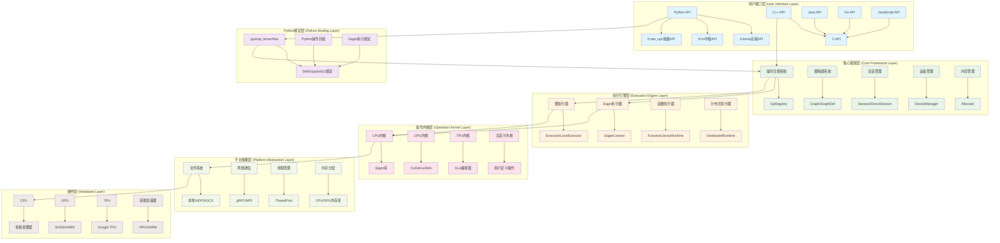

**架构层次说明:**

1. **用户接口层**: 提供多语言API，Python API是主要接口
2. **Python绑定层**: 通过SWIG/pybind11将C++功能暴露给Python
3. **核心框架层**: 包含操作注册、图构建、会话管理等核心功能
4. **执行引擎层**: 负责不同模式下的计算执行
5. **操作内核层**: 针对不同硬件的具体操作实现
6. **平台抽象层**: 提供跨平台的系统服务抽象
7. **硬件层**: 底层的计算硬件支持

## 核心模块交互图

### 模块间依赖关系图

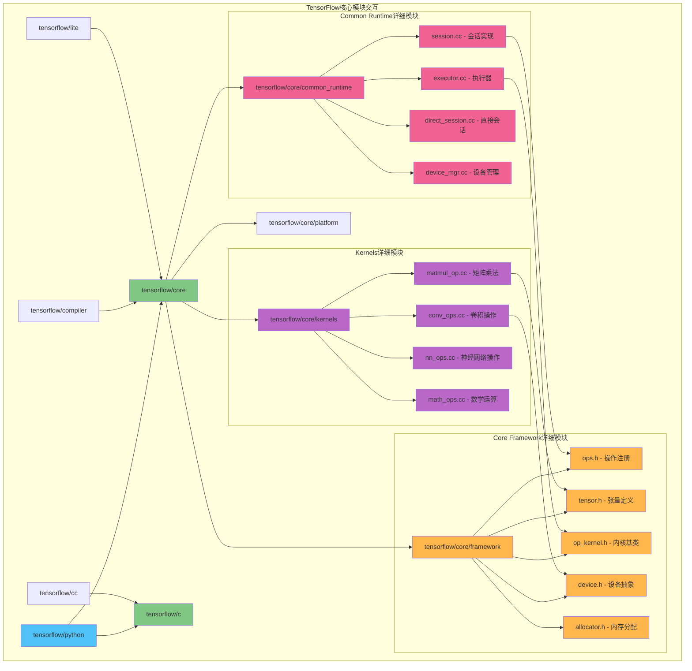

## 执行流程时序图

### Eager执行模式时序图

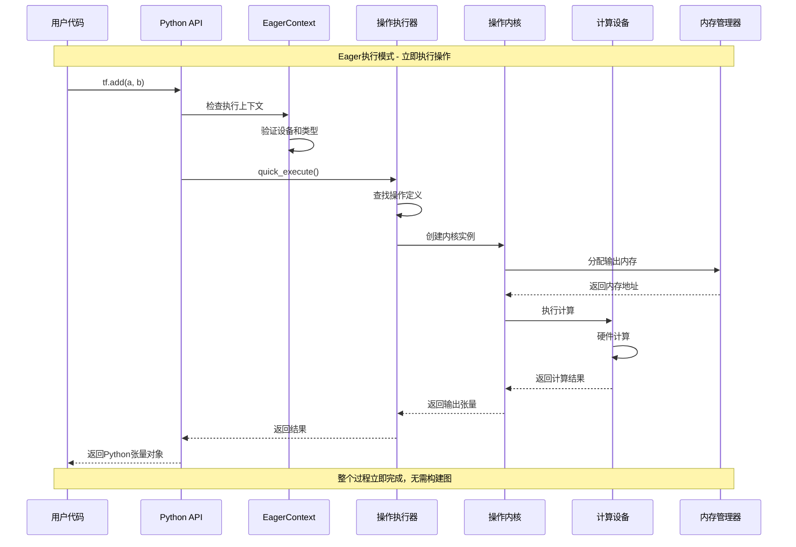

### Graph执行模式时序图

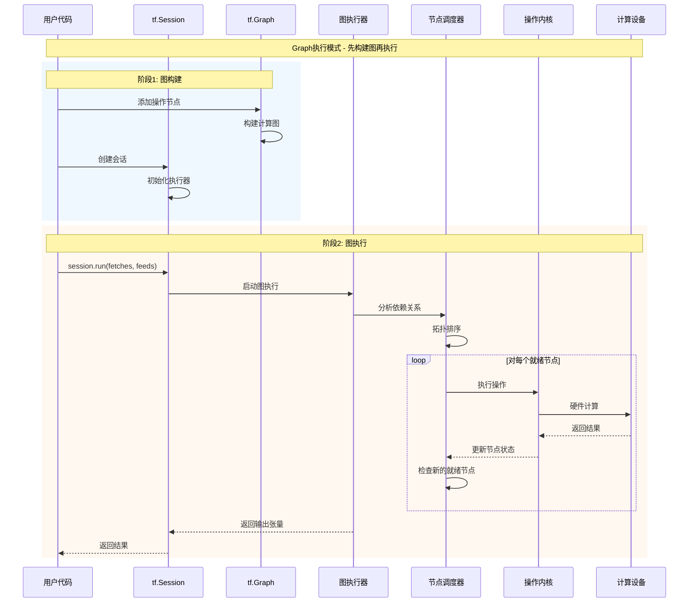

### tf.function执行时序图

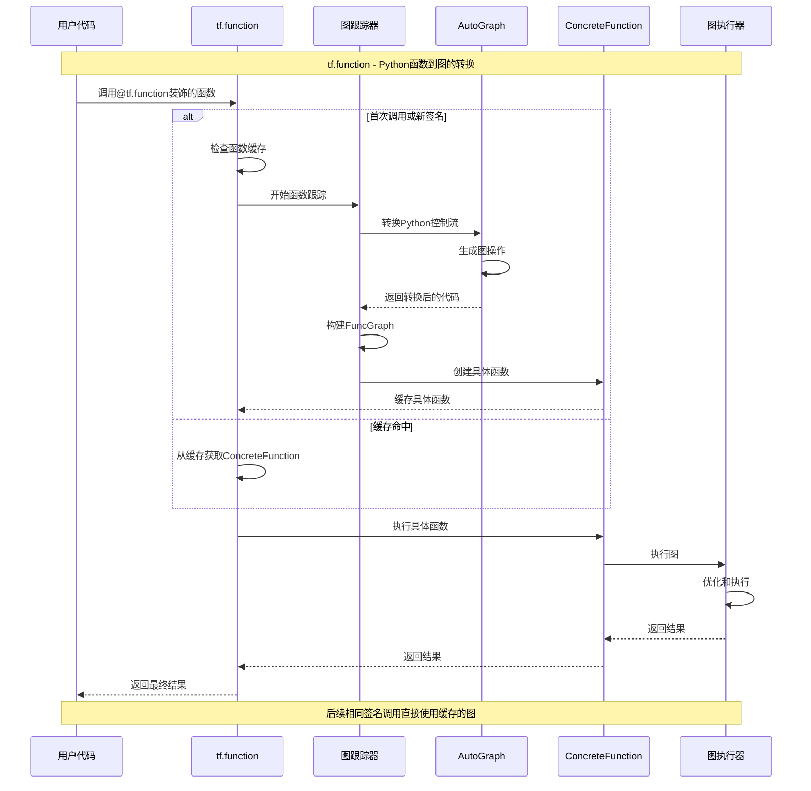

## 关键数据结构UML图

### 张量相关类图

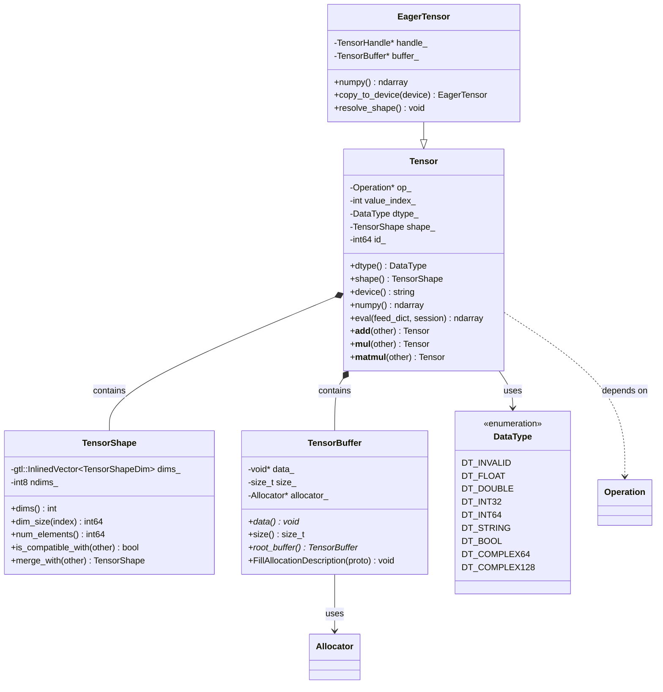

### 操作相关类图

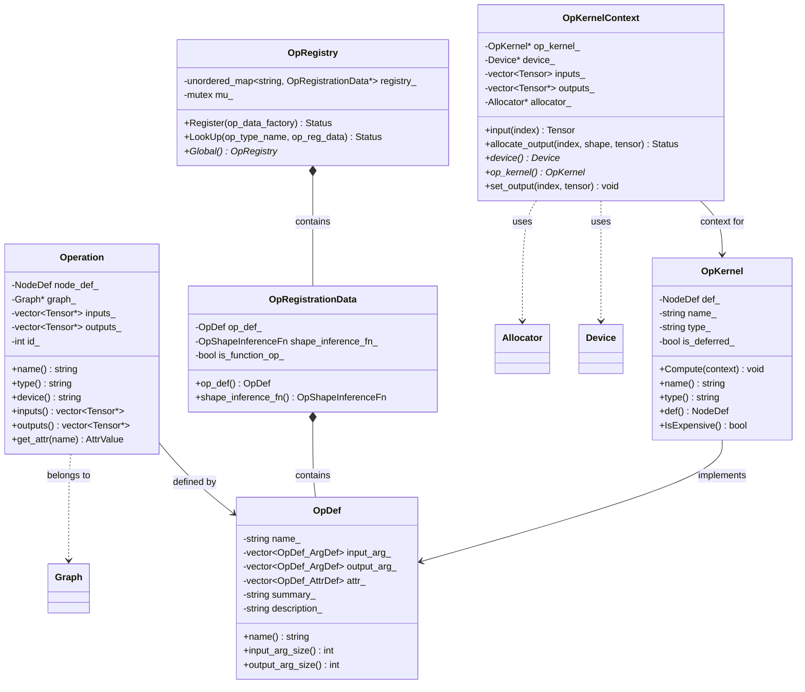

### 会话和执行器类图

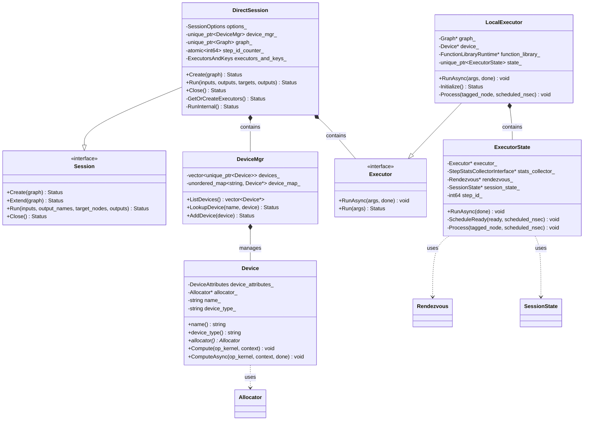

## 设计模式应用

### 工厂模式 - 操作和内核创建

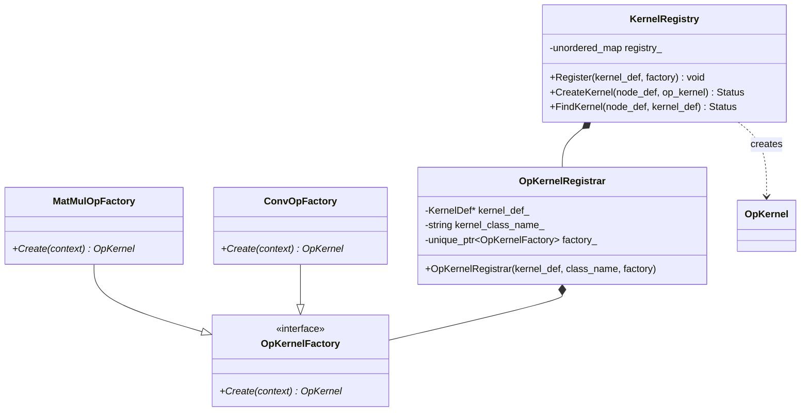

### 观察者模式 - 事件监听

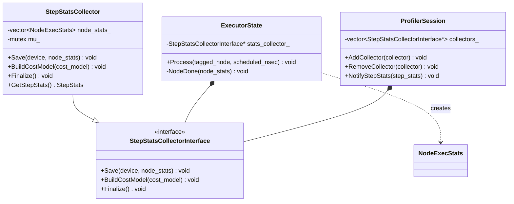

### 策略模式 - 设备选择和优化

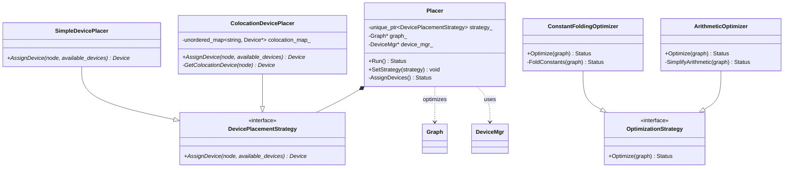

## 分布式架构图

### 分布式训练架构

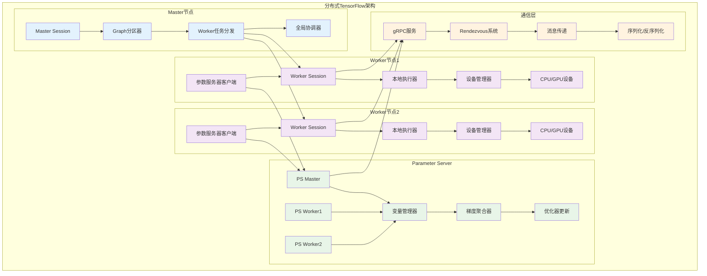

### 数据并行vs模型并行

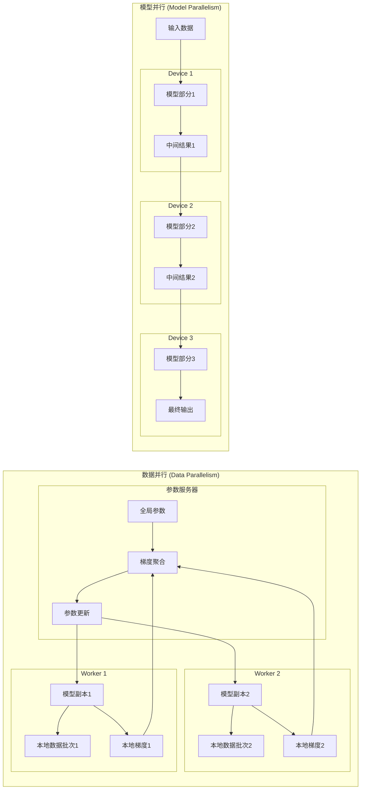

## 总结

本文档通过详细的架构图、时序图和UML图，全面展示了TensorFlow的设计架构：

### 关键架构特点

1. **分层设计**: 从用户接口到硬件层的清晰分层
2. **模块化**: 各模块职责明确，接口清晰
3. **可扩展性**: 支持自定义操作、设备和优化器
4. **跨平台**: 统一的抽象层支持多种硬件和操作系统

### 设计模式应用

1. **工厂模式**: 操作和内核的动态创建
2. **观察者模式**: 事件监听和统计收集
3. **策略模式**: 设备放置和图优化
4. **单例模式**: 全局注册表和上下文管理

### 执行模式

1. **Eager执行**: 立即执行，便于调试
2. **Graph执行**: 延迟执行，性能优化
3. **tf.function**: 结合两者优势的混合模式

### 分布式支持

1. **数据并行**: 适合大数据场景
2. **模型并行**: 适合大模型场景
3. **参数服务器**: 集中式参数管理
4. **All-Reduce**: 去中心化通信

这些架构图帮助开发者深入理解TensorFlow的内部工作机制，为高效使用和扩展框架提供指导。
