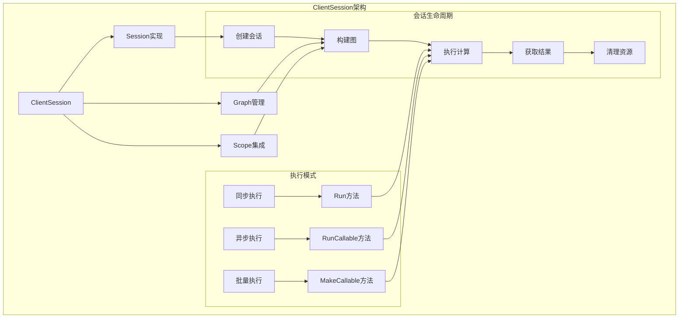
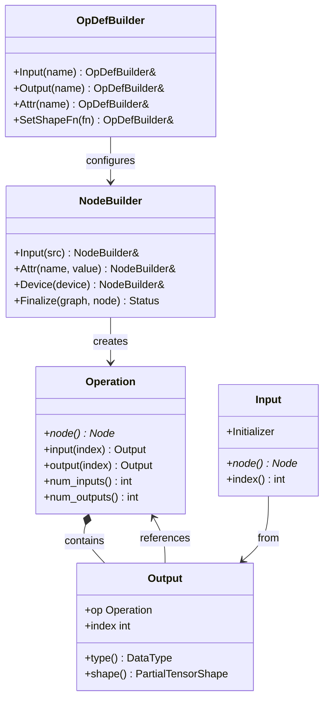
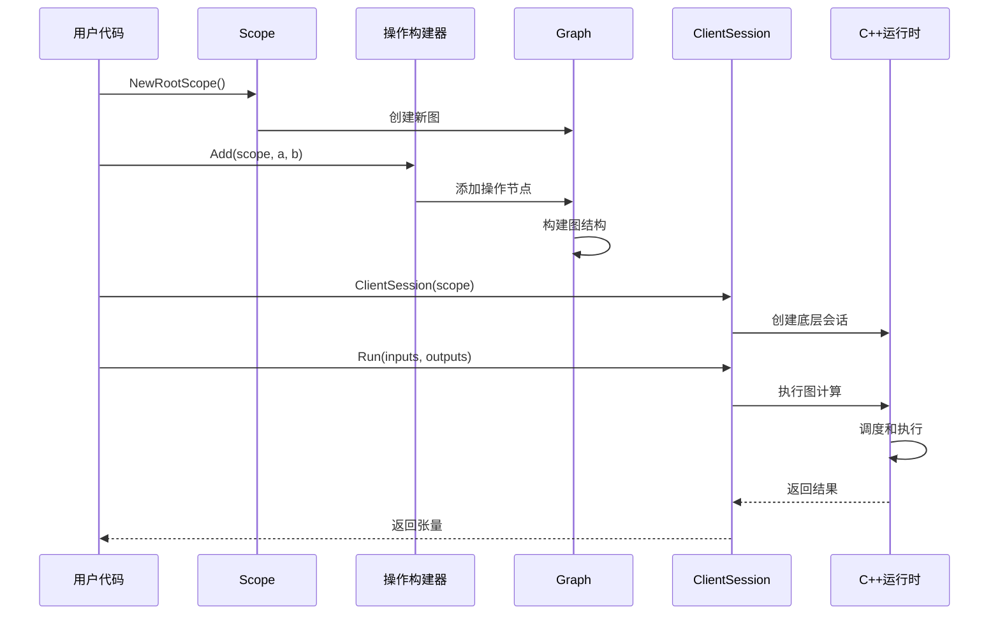
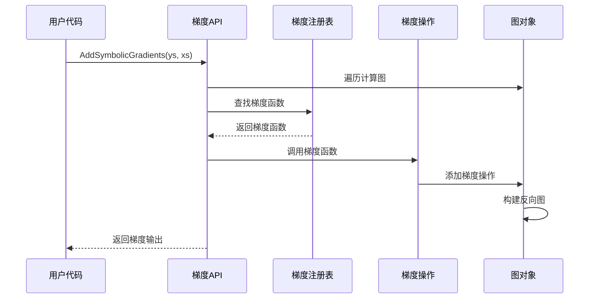

## 模块概述

TensorFlow C++ API模块提供了原生的C++接口，允许开发者直接使用C++构建、训练和部署TensorFlow模型。它设计为高性能、类型安全的API，适合对性能要求较高的生产环境。

### 主要子模块结构

```
tensorflow/cc/
├── client/                 # 客户端接口
│   ├── client_session.h/cc    # 客户端会话
│   └── client_session_test.cc # 会话测试
├── framework/              # 框架基础
│   ├── scope.h/cc             # 作用域管理
│   ├── ops.h                  # 操作定义
│   ├── gradients.h/cc         # 梯度计算
│   └── gradient_checker.h/cc  # 梯度检查器
├── ops/                    # 操作封装
│   ├── standard_ops.h         # 标准操作
│   ├── array_ops.h/cc         # 数组操作
│   ├── math_ops.h/cc          # 数学运算
│   ├── nn_ops.h/cc            # 神经网络操作
│   └── training_ops.h/cc      # 训练操作
├── gradients/              # 梯度实现
│   ├── array_grad.cc          # 数组操作梯度
│   ├── math_grad.cc           # 数学运算梯度
│   ├── nn_grad.cc             # 神经网络梯度
│   └── grad_testutil.h/cc     # 梯度测试工具
├── saved_model/            # SavedModel支持
│   ├── loader.h/cc            # 模型加载器
│   ├── tag_constants.h        # 标签常量
│   └── signature_constants.h  # 签名常量
└── experimental/           # 实验性API
    └── base/                  # 基础实验API
        └── public/            # 公开接口
```

## ClientSession客户端

### 1. ClientSession架构



### 2. ClientSession类实现

```cpp
// tensorflow/cc/client/client_session.h
class ClientSession {
public:
    /**

     * Feed类型定义 - 输入数据映射
     * 将Output对象映射到具体的输入值
     */
    typedef std::unordered_map<Output, Input::Initializer, OutputHash> FeedType;
    
    /**
     * 构造函数 - 从Scope创建会话
     * @param scope 作用域对象，包含要执行的图
     * @param target 目标设备字符串
     */
    ClientSession(const Scope& scope, const string& target);
    
    /**
     * 构造函数 - 使用默认目标
     * @param scope 作用域对象
     */
    explicit ClientSession(const Scope& scope);
    
    /**
     * 构造函数 - 使用会话选项
     * @param scope 作用域对象
     * @param session_options 会话配置选项
     */
    ClientSession(const Scope& scope, const SessionOptions& session_options);
    
    /**
     * 析构函数 - 清理会话资源
     */
    ~ClientSession();
    
    /**
     * 执行计算 - 基础版本
     * @param fetch_outputs 要获取的输出列表
     * @param outputs 输出张量结果
     * @return 执行状态
     */
    absl::Status Run(const std::vector<Output>& fetch_outputs,
                     std::vector<Tensor>* outputs) const;
    
    /**
     * 执行计算 - 带输入数据
     * @param inputs 输入数据映射
     * @param fetch_outputs 要获取的输出列表
     * @param outputs 输出张量结果
     * @return 执行状态
     */
    absl::Status Run(const FeedType& inputs,
                     const std::vector<Output>& fetch_outputs,
                     std::vector<Tensor>* outputs) const;
    
    /**
     * 执行计算 - 完整版本
     * @param inputs 输入数据映射
     * @param fetch_outputs 要获取的输出列表
     * @param run_outputs 要执行但不返回结果的操作
     * @param outputs 输出张量结果
     * @return 执行状态
     */
    absl::Status Run(const FeedType& inputs,
                     const std::vector<Output>& fetch_outputs,
                     const std::vector<Operation>& run_outputs,
                     std::vector<Tensor>* outputs) const;
    
    /**
     * 执行计算 - 带性能分析
     * @param run_options 运行选项，包含性能分析设置
     * @param inputs 输入数据映射
     * @param fetch_outputs 要获取的输出列表
     * @param run_outputs 要执行的操作列表
     * @param outputs 输出张量结果
     * @param run_metadata 运行元数据，包含性能信息
     * @return 执行状态
     */
    absl::Status Run(const RunOptions& run_options,
                     const FeedType& inputs,
                     const std::vector<Output>& fetch_outputs,
                     const std::vector<Operation>& run_outputs,
                     std::vector<Tensor>* outputs,
                     RunMetadata* run_metadata) const;
    
    /**
     * Callable句柄类型 - 用于预编译的子图
     */
    typedef int64_t CallableHandle;
    
    /**
     * 创建可调用子图
     * @param callable_options 可调用选项配置
     * @param out_handle 输出句柄
     * @return 创建状态
     */
    absl::Status MakeCallable(const CallableOptions& callable_options,
                              CallableHandle* out_handle);
    
    /**
     * 执行可调用子图
     * @param handle 可调用句柄
     * @param feed_tensors 输入张量列表
     * @param fetch_tensors 输出张量列表
     * @return 执行状态
     */
    absl::Status RunCallable(CallableHandle handle,
                             const std::vector<Tensor>& feed_tensors,
                             std::vector<Tensor>* fetch_tensors);

private:
    /**

     * 内部实现类 - PIMPL模式
     */
    class Impl;
    std::unique_ptr<Impl> impl_;

};
```

### 3. ClientSession使用示例

```cpp
// 基础使用示例
void BasicClientSessionExample() {
    /**

     * 基础ClientSession使用示例
     *
     * 功能说明:
     * - 创建计算图和会话
     * - 执行简单的数学运算
     * - 获取计算结果
     */
    
    // 创建根作用域
    Scope root = Scope::NewRootScope();
    
    // 构建计算图
    auto a = Placeholder(root, DT_FLOAT);  // 输入占位符
    auto b = Placeholder(root, DT_FLOAT);  // 输入占位符
    auto c = Add(root, a, b);              // 加法操作
    auto d = Multiply(root, c, {2.0f});    // 乘法操作
    
    // 创建客户端会话
    ClientSession session(root);
    
    // 准备输入数据
    Tensor tensor_a(DT_FLOAT, TensorShape({2, 2}));
    tensor_a.matrix<float>()() = {{1.0f, 2.0f}, {3.0f, 4.0f}};
    
    Tensor tensor_b(DT_FLOAT, TensorShape({2, 2}));
    tensor_b.matrix<float>()() = {{0.5f, 1.5f}, {2.5f, 3.5f}};
    
    // 执行计算
    std::vector<Tensor> outputs;
    absl::Status status = session.Run(
        {{a, tensor_a}, {b, tensor_b}},  // 输入映射
        {d},                             // 要获取的输出
        &outputs                         // 输出结果
    );
    
    if (status.ok()) {
        // 处理结果
        auto result = outputs[0].matrix<float>();
        std::cout << "计算结果:\n" << result << std::endl;
    } else {
        std::cerr << "执行失败: " << status.message() << std::endl;
    }

}
```

## Scope作用域系统

### 1. Scope类设计

```cpp
// tensorflow/cc/framework/scope.h
class Scope {
public:
    /**

     * 拷贝构造函数
     * @param other 其他Scope对象
     */
    Scope(const Scope& other);
    
    /**
     * 析构函数
     */
    ~Scope();
    
    /**
     * 赋值操作符
     * @param other 其他Scope对象
     * @return 当前Scope引用
     */
    Scope& operator=(const Scope& other);
    
    /**
     * 创建根作用域
     * @return 新的根作用域
     *
     * 功能说明:
     * - 创建新的图对象
     * - 初始化形状推断器
     * - 设置默认配置
     */
    static Scope NewRootScope();
    
    /**
     * 创建子作用域
     * @param child_scope_name 子作用域名称
     * @return 新的子作用域
     *
     * 功能说明:
     * - 继承父作用域的属性
     * - 添加名称前缀
     * - 共享图和状态对象
     */
    Scope NewSubScope(const string& child_scope_name) const;
    
    /**
     * 设置操作名称
     * @param fragments 名称片段
     * @return 新的作用域，带有指定的操作名称
     *
     * 功能说明:
     * - 支持模板参数，可接受多种类型
     * - 使用StrCat连接名称片段
     * - 创建新的作用域副本
     */
    template <typename... Ty>
    Scope WithOpName(Ty... fragments) const {
        return WithOpNameImpl(absl::StrCat(fragments...));
    }
    
    /**
     * 设置控制依赖
     * @param control_deps 控制依赖操作列表
     * @return 新的作用域，带有控制依赖
     *
     * 功能说明:
     * - 添加控制依赖约束
     * - 确保操作执行顺序
     * - 支持多个依赖操作
     */
    Scope WithControlDependencies(absl::Span<const Operation> control_deps) const;
    
    /**
     * 设置设备放置
     * @param device 设备名称
     * @return 新的作用域，带有设备约束
     *
     * 功能说明:
     * - 指定操作执行设备
     * - 支持CPU、GPU、TPU等设备
     * - 可以是设备名称或设备函数
     */
    Scope WithDevice(const string& device) const;
    
    /**
     * 设置共置约束
     * @param ops 要共置的操作列表
     * @return 新的作用域，带有共置约束
     *
     * 功能说明:
     * - 确保操作在同一设备上执行
     * - 优化数据传输
     * - 减少设备间通信开销
     */
    Scope WithColocateWith(const Operation& op) const;
    
    /**
     * 检查作用域状态
     * @return 作用域是否正常
     */
    bool ok() const;
    
    /**
     * 获取作用域状态
     * @return 状态对象
     */
    absl::Status status() const;
    
    /**
     * 转换为图定义
     * @param gdef 输出图定义
     * @return 转换状态
     *
     * 功能说明:
     * - 将作用域中的图转换为GraphDef
     * - 用于序列化和保存
     * - 包含所有操作和连接信息
     */
    absl::Status ToGraphDef(GraphDef* gdef) const;
    
    /**
     * 获取图对象
     * @return 图指针
     */
    Graph* graph() const;
    
    /**
     * 获取唯一操作名称
     * @param name 基础名称
     * @return 唯一名称
     *
     * 功能说明:
     * - 确保操作名称在图中唯一
     * - 自动添加数字后缀
     * - 处理名称冲突
     */
    string GetUniqueNameForOp(const string& name) const;

private:
    /**

     * 内部实现类
     */
    class Impl;
    std::unique_ptr<Impl> impl_;
    
    /**
     * 私有构造函数
     * @param impl 实现对象
     */
    explicit Scope(Impl* impl);

};
```

### 2. Scope层次结构示例

```cpp
// Scope层次结构使用示例
void ScopeHierarchyExample() {
    /**

     * Scope层次结构示例
     *
     * 功能说明:
     * - 演示作用域的层次结构
     * - 展示名称管理机制
     * - 说明属性继承规则
     */
    
    // 创建根作用域
    Scope root = Scope::NewRootScope();
    
    // 创建线性层子作用域
    Scope linear = root.NewSubScope("linear");
    
    // 在线性层中创建权重变量
    // 名称将是 "linear/W"
    auto W = Variable(linear.WithOpName("W"),
                      {784, 128}, DT_FLOAT);
    
    // 创建带索引的偏置变量
    // 名称将是 "linear/b_1"
    auto b = Variable(linear.WithOpName("b_", 1),
                      {128}, DT_FLOAT);
    
    // 创建输入占位符
    // 名称将是 "linear/Placeholder"
    auto x = Placeholder(linear, DT_FLOAT, Placeholder::Shape({-1, 784}));
    
    // 执行矩阵乘法
    // 名称将是 "linear/MatMul"
    auto matmul = MatMul(linear, x, W);
    
    // 添加偏置
    // 名称将是 "linear/BiasAdd"
    auto output = BiasAdd(linear, matmul, b);
    
    // 创建激活层子作用域
    Scope activation = root.NewSubScope("activation");
    
    // 应用ReLU激活
    // 名称将是 "activation/Relu"
    auto relu_output = Relu(activation, output);
    
    // 设置设备约束的作用域
    Scope gpu_scope = root.WithDevice("/gpu:0");
    
    // 在GPU上执行操作
    // 名称将是 "MatMul_1"，设备为 "/gpu:0"
    auto gpu_matmul = MatMul(gpu_scope, relu_output, W);
    
    // 设置控制依赖
    Scope controlled = root.WithControlDependencies({gpu_matmul.op});
    
    // 这个操作将等待gpu_matmul完成后执行
    auto final_output = Add(controlled, gpu_matmul, b);
    
    // 转换为图定义
    GraphDef graph_def;
    absl::Status status = root.ToGraphDef(&graph_def);
    
    if (status.ok()) {
        std::cout << "图构建成功，包含 " << graph_def.node_size() << " 个节点" << std::endl;
    }

}
```

## 操作构建器

### 1. 操作构建系统



### 2. 标准操作实现

```cpp
// tensorflow/cc/ops/standard_ops.h
namespace ops {

/**

 * 常量操作 - 创建常量张量
 * @param scope 作用域
 * @param value 常量值
 * @return 常量输出

 *

 * 功能说明:
 * - 创建编译时已知的常量张量
 * - 支持多种数据类型
 * - 可以是标量或多维数组

 */
template <typename T>
Output Const(const Scope& scope, const T& value) {
    return Const(scope, Input::Initializer(value));
}

/**

 * 占位符操作 - 创建输入占位符
 * @param scope 作用域
 * @param dtype 数据类型
 * @param attrs 可选属性
 * @return 占位符输出

 *

 * 功能说明:
 * - 为运行时输入创建占位符
 * - 可以指定形状约束
 * - 支持动态形状

 */
Output Placeholder(const Scope& scope, DataType dtype,
                   const Placeholder::Attrs& attrs = Placeholder::Attrs());

/**

 * 变量操作 - 创建可训练变量
 * @param scope 作用域
 * @param shape 变量形状
 * @param dtype 数据类型
 * @param attrs 可选属性
 * @return 变量引用输出

 *

 * 功能说明:
 * - 创建可修改的状态变量
 * - 用于模型参数存储
 * - 支持初始化器

 */
Output Variable(const Scope& scope, const TensorShape& shape, DataType dtype,
                const Variable::Attrs& attrs = Variable::Attrs());

/**

 * 加法操作 - 元素级加法
 * @param scope 作用域
 * @param x 第一个操作数
 * @param y 第二个操作数
 * @return 加法结果输出

 *

 * 功能说明:
 * - 执行元素级加法运算
 * - 支持广播机制
 * - 自动类型推断

 */
Output Add(const Scope& scope, Input x, Input y);

/**

 * 矩阵乘法操作
 * @param scope 作用域
 * @param a 第一个矩阵
 * @param b 第二个矩阵
 * @param attrs 可选属性（转置等）
 * @return 矩阵乘法结果

 *

 * 功能说明:
 * - 执行矩阵乘法运算
 * - 支持转置选项
 * - 优化的BLAS实现

 */
Output MatMul(const Scope& scope, Input a, Input b,
              const MatMul::Attrs& attrs = MatMul::Attrs());

/**

 * ReLU激活函数
 * @param scope 作用域
 * @param features 输入特征
 * @return 激活后的输出

 *

 * 功能说明:
 * - 应用ReLU激活函数
 * - max(0, x)的逐元素计算
 * - 常用于神经网络

 */
Output Relu(const Scope& scope, Input features);

/**

 * Softmax操作
 * @param scope 作用域
 * @param logits 输入logits
 * @param attrs 可选属性
 * @return Softmax概率分布

 *

 * 功能说明:
 * - 计算Softmax概率分布
 * - 用于多分类问题
 * - 数值稳定的实现

 */
Output Softmax(const Scope& scope, Input logits,
               const Softmax::Attrs& attrs = Softmax::Attrs());

} // namespace ops
```

### 3. 自定义操作构建

```cpp
// 自定义操作构建示例
class CustomLinearLayer {
public:
    /**

     * 自定义线性层实现
     *
     * 功能说明:
     * - 封装线性变换逻辑
     * - 提供高级接口
     * - 支持参数初始化
     */
    
    /**
     * 构造函数
     * @param scope 作用域
     * @param input_size 输入维度
     * @param output_size 输出维度
     * @param name 层名称
     */
    CustomLinearLayer(const Scope& scope, int input_size, int output_size,
                      const string& name = "linear")
        : scope_(scope.NewSubScope(name)),
          input_size_(input_size),
          output_size_(output_size) {
        
        // 创建权重变量
        weights_ = Variable(scope_.WithOpName("weights"),
                           {input_size, output_size}, DT_FLOAT);
        
        // 创建偏置变量
        bias_ = Variable(scope_.WithOpName("bias"),
                        {output_size}, DT_FLOAT);
        
        // 权重初始化
        auto weight_init = RandomNormal(scope_.WithOpName("weight_init"),
                                       {input_size, output_size}, DT_FLOAT);
        weight_assign_ = Assign(scope_, weights_, weight_init);
        
        // 偏置初始化为零
        auto bias_init = Zeros(scope_.WithOpName("bias_init"), {output_size}, DT_FLOAT);
        bias_assign_ = Assign(scope_, bias_, bias_init);
    }
    
    /**
     * 前向传播
     * @param input 输入张量
     * @return 线性变换结果
     */
    Output Forward(Input input) {
        // 矩阵乘法: input * weights
        auto matmul_result = MatMul(scope_.WithOpName("matmul"), input, weights_);
        
        // 添加偏置: matmul_result + bias
        auto output = Add(scope_.WithOpName("add_bias"), matmul_result, bias_);
        
        return output;
    }
    
    /**
     * 获取初始化操作
     * @return 初始化操作列表
     */
    std::vector<Operation> GetInitOps() const {
        return {weight_assign_.op, bias_assign_.op};
    }
    
    /**
     * 获取可训练参数
     * @return 参数列表
     */
    std::vector<Output> GetTrainableParams() const {
        return {weights_, bias_};
    }

private:
    Scope scope_;           // 层作用域
    int input_size_;        // 输入维度
    int output_size_;       // 输出维度
    Output weights_;        // 权重变量
    Output bias_;           // 偏置变量
    Output weight_assign_;  // 权重初始化操作
    Output bias_assign_;    // 偏置初始化操作
};

// 使用自定义层
void UseCustomLayer() {
    Scope root = Scope::NewRootScope();
    
    // 创建输入占位符
    auto input = Placeholder(root, DT_FLOAT, Placeholder::Shape({-1, 784}));
    
    // 创建自定义线性层
    CustomLinearLayer layer1(root, 784, 256, "layer1");
    CustomLinearLayer layer2(root, 256, 128, "layer2");
    CustomLinearLayer layer3(root, 128, 10, "output");
    
    // 构建网络
    auto hidden1 = Relu(root, layer1.Forward(input));
    auto hidden2 = Relu(root, layer2.Forward(hidden1));
    auto output = layer3.Forward(hidden2);
    auto predictions = Softmax(root, output);
    
    // 获取所有初始化操作
    std::vector<Operation> init_ops;
    auto layer1_init = layer1.GetInitOps();
    auto layer2_init = layer2.GetInitOps();
    auto layer3_init = layer3.GetInitOps();
    
    init_ops.insert(init_ops.end(), layer1_init.begin(), layer1_init.end());
    init_ops.insert(init_ops.end(), layer2_init.begin(), layer2_init.end());
    init_ops.insert(init_ops.end(), layer3_init.begin(), layer3_init.end());
    
    // 创建会话并初始化
    ClientSession session(root);
    
    // 执行初始化
    std::vector<Tensor> init_outputs;
    absl::Status init_status = session.Run({}, {}, init_ops, &init_outputs);
    
    if (init_status.ok()) {
        std::cout << "模型初始化成功" << std::endl;
    }
}
```

## 梯度计算框架

### 1. 梯度注册系统

```cpp
// tensorflow/cc/framework/gradients.h
namespace ops {

/**

 * 梯度函数类型定义
 * @param scope 作用域
 * @param op 原始操作
 * @param grad_inputs 输入梯度
 * @param grad_outputs 输出梯度
 * @return 计算状态

 */
typedef std::function<absl::Status(const Scope& scope, const Operation& op,
                                   const std::vector<Output>& grad_inputs,
                                   std::vector<Output>* grad_outputs)> GradFunc;

/**

 * 梯度注册宏
 * @param op_name 操作名称
 * @param grad_fn 梯度函数

 */
#define REGISTER_GRADIENT_OP(op_name, grad_fn) \
    REGISTER_GRADIENT_OP_UNIQ_HELPER(__COUNTER__, op_name, grad_fn)

/**

 * 计算梯度
 * @param scope 作用域
 * @param ys 输出张量列表
 * @param xs 输入张量列表
 * @param grad_outputs 输出梯度列表
 * @return 输入梯度列表

 */
absl::Status AddSymbolicGradients(const Scope& scope,
                                  const std::vector<Output>& ys,
                                  const std::vector<Output>& xs,
                                  std::vector<Output>* grad_outputs);

} // namespace ops
```

### 2. 具体梯度实现

```cpp
// tensorflow/cc/gradients/nn_grad.cc
namespace ops {

/**

 * Softmax梯度实现
 * @param scope 作用域
 * @param op 原始Softmax操作
 * @param grad_inputs 上游梯度
 * @param grad_outputs 输出梯度
 * @return 计算状态

 *

 * 数学原理:
 * 对于Softmax函数 p = softmax(x)
 * 梯度公式: dL/dx = (dL/dy - sum(dL/dy * y)) * y
 * 其中 y 是softmax的输出，dL/dy是上游梯度

 */
absl::Status SoftmaxGrad(const Scope& scope, const Operation& op,
                         const std::vector<Output>& grad_inputs,
                         std::vector<Output>* grad_outputs) {
    // 获取前向传播的输出
    auto y = op.output(0);
    
    // 计算 dL/dy * y (逐元素乘法)
    auto dyy = Mul(scope, grad_inputs[0], y);
    
    // 计算 sum(dL/dy * y) 沿最后一个轴求和，保持维度
    auto sum = Sum(scope, dyy, /*axis=*/-1, Sum::KeepDims(true));
    
    // 计算 dL/dy - sum(dL/dy * y)
    auto sub = Sub(scope, grad_inputs[0], sum);
    
    // 计算最终梯度 (dL/dy - sum(dL/dy * y)) * y
    auto dx = Mul(scope, sub, y);
    
    grad_outputs->push_back(dx);
    return scope.status();
}
REGISTER_GRADIENT_OP("Softmax", SoftmaxGrad);

/**

 * ReLU梯度实现
 * @param scope 作用域
 * @param op 原始ReLU操作
 * @param grad_inputs 上游梯度
 * @param grad_outputs 输出梯度
 * @return 计算状态

 *

 * 数学原理:
 * ReLU(x) = max(0, x)
 * 梯度: dReLU/dx = 1 if x > 0, else 0

 */
absl::Status ReluGrad(const Scope& scope, const Operation& op,
                      const std::vector<Output>& grad_inputs,
                      std::vector<Output>* grad_outputs) {
    // 获取原始输入
    auto features = op.input(0);
    
    // 使用ReluGrad操作计算梯度
    // 这是一个专门的梯度操作，比手动实现更高效
    auto grad = internal::ReluGrad(scope, grad_inputs[0], features);
    
    grad_outputs->push_back(grad);
    return scope.status();
}
REGISTER_GRADIENT_OP("Relu", ReluGrad);

/**

 * 矩阵乘法梯度实现
 * @param scope 作用域
 * @param op 原始MatMul操作
 * @param grad_inputs 上游梯度
 * @param grad_outputs 输出梯度
 * @return 计算状态

 *

 * 数学原理:
 * 对于 C = A * B
 * dL/dA = dL/dC * B^T
 * dL/dB = A^T * dL/dC

 */
absl::Status MatMulGrad(const Scope& scope, const Operation& op,
                        const std::vector<Output>& grad_inputs,
                        std::vector<Output>* grad_outputs) {
    // 获取原始输入
    auto a = op.input(0);
    auto b = op.input(1);
    
    // 获取转置属性
    bool transpose_a = false;
    bool transpose_b = false;
    GetNodeAttr(op.node()->attrs(), "transpose_a", &transpose_a);
    GetNodeAttr(op.node()->attrs(), "transpose_b", &transpose_b);
    
    // 计算关于A的梯度
    Output grad_a;
    if (!transpose_a && !transpose_b) {
        // dL/dA = dL/dC * B^T
        grad_a = MatMul(scope, grad_inputs[0], b, MatMul::TransposeB(true));
    } else if (!transpose_a && transpose_b) {
        // dL/dA = dL/dC * B
        grad_a = MatMul(scope, grad_inputs[0], b);
    } else if (transpose_a && !transpose_b) {
        // dL/dA = B * dL/dC^T
        grad_a = MatMul(scope, b, grad_inputs[0], MatMul::TransposeB(true));
    } else {
        // dL/dA = B^T * dL/dC^T
        grad_a = MatMul(scope, b, grad_inputs[0],
                       MatMul::TransposeA(true).TransposeB(true));
    }
    
    // 计算关于B的梯度
    Output grad_b;
    if (!transpose_a && !transpose_b) {
        // dL/dB = A^T * dL/dC
        grad_b = MatMul(scope, a, grad_inputs[0], MatMul::TransposeA(true));
    } else if (!transpose_a && transpose_b) {
        // dL/dB = A^T * dL/dC^T
        grad_b = MatMul(scope, a, grad_inputs[0],
                       MatMul::TransposeA(true).TransposeB(true));
    } else if (transpose_a && !transpose_b) {
        // dL/dB = A * dL/dC
        grad_b = MatMul(scope, a, grad_inputs[0]);
    } else {
        // dL/dB = dL/dC^T * A
        grad_b = MatMul(scope, grad_inputs[0], a, MatMul::TransposeA(true));
    }
    
    grad_outputs->push_back(grad_a);
    grad_outputs->push_back(grad_b);
    return scope.status();
}
REGISTER_GRADIENT_OP("MatMul", MatMulGrad);

} // namespace ops
```

### 3. 梯度计算使用示例

```cpp
// 梯度计算使用示例
void GradientComputationExample() {
    /**

     * 梯度计算示例
     *
     * 功能说明:
     * - 构建前向计算图
     * - 计算损失函数
     * - 自动计算梯度
     * - 应用梯度更新
     */
    
    Scope root = Scope::NewRootScope();
    
    // 创建输入和标签占位符
    auto x = Placeholder(root, DT_FLOAT, Placeholder::Shape({-1, 784}));
    auto y_true = Placeholder(root, DT_FLOAT, Placeholder::Shape({-1, 10}));
    
    // 创建模型参数
    auto W1 = Variable(root.WithOpName("W1"), {784, 256}, DT_FLOAT);
    auto b1 = Variable(root.WithOpName("b1"), {256}, DT_FLOAT);
    auto W2 = Variable(root.WithOpName("W2"), {256, 10}, DT_FLOAT);
    auto b2 = Variable(root.WithOpName("b2"), {10}, DT_FLOAT);
    
    // 前向传播
    auto hidden = Relu(root, Add(root, MatMul(root, x, W1), b1));
    auto logits = Add(root, MatMul(root, hidden, W2), b2);
    auto y_pred = Softmax(root, logits);
    
    // 计算损失 (交叉熵)
    auto cross_entropy = Neg(root, Sum(root,
        Mul(root, y_true, Log(root, y_pred)), {1}));
    auto loss = ReduceMean(root, cross_entropy, {0});
    
    // 计算梯度
    std::vector<Output> grad_outputs;
    absl::Status grad_status = AddSymbolicGradients(
        root, {loss}, {W1, b1, W2, b2}, &grad_outputs);
    
    if (!grad_status.ok()) {
        std::cerr << "梯度计算失败: " << grad_status.message() << std::endl;
        return;
    }
    
    // 应用梯度更新 (简单的梯度下降)
    float learning_rate = 0.01f;
    auto lr = Const(root, learning_rate);
    
    auto update_W1 = AssignSub(root, W1, Mul(root, lr, grad_outputs[0]));
    auto update_b1 = AssignSub(root, b1, Mul(root, lr, grad_outputs[1]));
    auto update_W2 = AssignSub(root, W2, Mul(root, lr, grad_outputs[2]));
    auto update_b2 = AssignSub(root, b2, Mul(root, lr, grad_outputs[3]));
    
    // 创建训练操作组
    auto train_op = NoOp(root.WithControlDependencies(
        {update_W1.op, update_b1.op, update_W2.op, update_b2.op}));
    
    // 创建会话
    ClientSession session(root);
    
    // 初始化变量
    auto init_W1 = Assign(root, W1, RandomNormal(root, {784, 256}, DT_FLOAT));
    auto init_b1 = Assign(root, b1, Zeros(root, {256}, DT_FLOAT));
    auto init_W2 = Assign(root, W2, RandomNormal(root, {256, 10}, DT_FLOAT));
    auto init_b2 = Assign(root, b2, Zeros(root, {10}, DT_FLOAT));
    
    std::vector<Tensor> init_outputs;
    session.Run({}, {}, {init_W1.op, init_b1.op, init_W2.op, init_b2.op},
                &init_outputs);
    
    // 训练循环
    for (int epoch = 0; epoch < 100; ++epoch) {
        // 准备训练数据 (这里使用随机数据作为示例)
        Tensor batch_x(DT_FLOAT, TensorShape({32, 784}));
        Tensor batch_y(DT_FLOAT, TensorShape({32, 10}));
        
        // 填充随机数据
        batch_x.flat<float>().setRandom();
        batch_y.flat<float>().setRandom();
        
        // 执行训练步骤
        std::vector<Tensor> train_outputs;
        absl::Status train_status = session.Run(
            {{x, batch_x}, {y_true, batch_y}},  // 输入数据
            {loss},                              // 获取损失值
            {train_op.op},                       // 执行训练操作
            &train_outputs
        );
        
        if (train_status.ok()) {
            float loss_value = train_outputs[0].scalar<float>()();
            if (epoch % 10 == 0) {
                std::cout << "Epoch " << epoch << ", Loss: " << loss_value << std::endl;
            }
        } else {
            std::cerr << "训练失败: " << train_status.message() << std::endl;
            break;
        }
    }

}
```

## SavedModel API

### 1. SavedModel加载器

```cpp
// tensorflow/cc/saved_model/loader.h
namespace tensorflow {

/**

 * SavedModel加载器类

 *

 * 功能说明:
 * - 加载SavedModel格式的模型
 * - 恢复图定义和变量
 * - 提供推理接口

 */
class SavedModelBundle {
public:
    /**

     * 会话对象 - 用于执行推理
     */
    std::unique_ptr<Session> session;
    
    /**
     * 元图定义 - 包含图结构和签名信息
     */
    MetaGraphDef meta_graph_def;
    
    /**
     * 获取签名定义
     * @param signature_key 签名键
     * @return 签名定义
     */
    const SignatureDef& GetSignature(const string& signature_key = kDefaultServingSignatureDefKey) const;

};

/**

 * 加载SavedModel
 * @param session_options 会话选项
 * @param run_options 运行选项
 * @param export_dir 模型导出目录
 * @param tags 标签集合
 * @param bundle 输出的模型包
 * @return 加载状态

 */
absl::Status LoadSavedModel(const SessionOptions& session_options,
                            const RunOptions& run_options,
                            const string& export_dir,
                            const std::unordered_set<string>& tags,
                            SavedModelBundle* bundle);

/**

 * 简化的加载接口
 * @param export_dir 模型导出目录
 * @param tags 标签集合
 * @param bundle 输出的模型包
 * @return 加载状态

 */
absl::Status LoadSavedModel(const string& export_dir,
                            const std::unordered_set<string>& tags,
                            SavedModelBundle* bundle);

} // namespace tensorflow
```

### 2. SavedModel使用示例

```cpp
// SavedModel使用示例
void SavedModelExample() {
    /**

     * SavedModel加载和推理示例
     *
     * 功能说明:
     * - 加载预训练的SavedModel
     * - 获取输入输出签名
     * - 执行模型推理
     * - 处理推理结果
     */
    
    // 模型路径和标签
    string model_path = "/path/to/saved_model";
    std::unordered_set<string> tags = {kSavedModelTagServe};
    
    // 加载SavedModel
    SavedModelBundle bundle;
    absl::Status load_status = LoadSavedModel(model_path, tags, &bundle);
    
    if (!load_status.ok()) {
        std::cerr << "模型加载失败: " << load_status.message() << std::endl;
        return;
    }
    
    std::cout << "模型加载成功" << std::endl;
    
    // 获取默认签名
    const auto& signature = bundle.GetSignature();
    
    // 打印输入输出信息
    std::cout << "输入信息:" << std::endl;
    for (const auto& input_pair : signature.inputs()) {
        const auto& input_name = input_pair.first;
        const auto& input_info = input_pair.second;
        std::cout << "  " << input_name << ": " << input_info.name()
                  << " (dtype: " << input_info.dtype() << ")" << std::endl;
    }
    
    std::cout << "输出信息:" << std::endl;
    for (const auto& output_pair : signature.outputs()) {
        const auto& output_name = output_pair.first;
        const auto& output_info = output_pair.second;
        std::cout << "  " << output_name << ": " << output_info.name()
                  << " (dtype: " << output_info.dtype() << ")" << std::endl;
    }
    
    // 准备输入数据
    std::vector<std::pair<string, Tensor>> inputs;
    
    // 假设模型有一个名为"input"的输入
    if (signature.inputs().count("input") > 0) {
        const auto& input_info = signature.inputs().at("input");
        
        // 创建示例输入张量 (这里使用随机数据)
        Tensor input_tensor(DT_FLOAT, TensorShape({1, 224, 224, 3}));
        input_tensor.flat<float>().setRandom();
        
        inputs.emplace_back(input_info.name(), input_tensor);
    }
    
    // 准备输出名称
    std::vector<string> output_names;
    for (const auto& output_pair : signature.outputs()) {
        output_names.push_back(output_pair.second.name());
    }
    
    // 执行推理
    std::vector<Tensor> outputs;
    absl::Status run_status = bundle.session->Run(inputs, output_names, {}, &outputs);
    
    if (run_status.ok()) {
        std::cout << "推理成功，输出数量: " << outputs.size() << std::endl;
        
        // 处理输出结果
        for (size_t i = 0; i < outputs.size(); ++i) {
            const auto& output_tensor = outputs[i];
            std::cout << "输出 " << i << " 形状: " << output_tensor.shape().DebugString()
                      << ", 类型: " << DataTypeString(output_tensor.dtype()) << std::endl;
            
            // 如果是分类模型，可能需要找到最大概率的类别
            if (output_tensor.dtype() == DT_FLOAT && output_tensor.dims() == 2) {
                auto output_matrix = output_tensor.matrix<float>();
                for (int batch = 0; batch < output_matrix.dimension(0); ++batch) {
                    float max_prob = output_matrix(batch, 0);
                    int max_class = 0;
                    
                    for (int cls = 1; cls < output_matrix.dimension(1); ++cls) {
                        if (output_matrix(batch, cls) > max_prob) {
                            max_prob = output_matrix(batch, cls);
                            max_class = cls;
                        }
                    }
                    
                    std::cout << "样本 " << batch << " 预测类别: " << max_class
                              << " (概率: " << max_prob << ")" << std::endl;
                }
            }
        }
    } else {
        std::cerr << "推理失败: " << run_status.message() << std::endl;
    }

}
```

## 关键API调用链

### 1. C++ API执行流程



### 2. 梯度计算流程



## 最佳实践

### 1. 高效的C++ API使用

```cpp
// C++ API最佳实践示例
class EfficientModel {
public:
    /**

     * 高效模型实现
     *
     * 最佳实践:
     * - 使用作用域管理命名空间
     * - 预分配变量和操作
     * - 合理使用控制依赖
     * - 优化内存使用
     */
    
    EfficientModel(const Scope& root, int input_dim, int hidden_dim, int output_dim)
        : root_(root), input_dim_(input_dim), hidden_dim_(hidden_dim), output_dim_(output_dim) {
        BuildModel();
    }
    
    void BuildModel() {
        // 使用子作用域组织模型结构
        auto model_scope = root_.NewSubScope("model");
        
        // 输入层
        input_ = Placeholder(model_scope.WithOpName("input"), DT_FLOAT,
                           Placeholder::Shape({-1, input_dim_}));
        
        // 隐藏层
        auto hidden_scope = model_scope.NewSubScope("hidden");
        W1_ = Variable(hidden_scope.WithOpName("weights"), {input_dim_, hidden_dim_}, DT_FLOAT);
        b1_ = Variable(hidden_scope.WithOpName("bias"), {hidden_dim_}, DT_FLOAT);
        
        auto hidden_linear = Add(hidden_scope, MatMul(hidden_scope, input_, W1_), b1_);
        hidden_output_ = Relu(hidden_scope.WithOpName("activation"), hidden_linear);
        
        // 输出层
        auto output_scope = model_scope.NewSubScope("output");
        W2_ = Variable(output_scope.WithOpName("weights"), {hidden_dim_, output_dim_}, DT_FLOAT);
        b2_ = Variable(output_scope.WithOpName("bias"), {output_dim_}, DT_FLOAT);
        
        auto output_linear = Add(output_scope, MatMul(output_scope, hidden_output_, W2_), b2_);
        output_ = Softmax(output_scope.WithOpName("softmax"), output_linear);
        
        // 初始化操作
        BuildInitializers();
        
        // 训练操作
        BuildTrainingOps();
    }
    
    void BuildInitializers() {
        auto init_scope = root_.NewSubScope("initializers");
        
        // Xavier初始化
        float w1_stddev = std::sqrt(2.0f / (input_dim_ + hidden_dim_));
        auto w1_init = Multiply(init_scope,
                               RandomNormal(init_scope, {input_dim_, hidden_dim_}, DT_FLOAT),
                               w1_stddev);
        w1_initializer_ = Assign(init_scope, W1_, w1_init);
        
        float w2_stddev = std::sqrt(2.0f / (hidden_dim_ + output_dim_));
        auto w2_init = Multiply(init_scope,
                               RandomNormal(init_scope, {hidden_dim_, output_dim_}, DT_FLOAT),
                               w2_stddev);
        w2_initializer_ = Assign(init_scope, W2_, w2_init);
        
        // 偏置初始化为零
        b1_initializer_ = Assign(init_scope, b1_, Zeros(init_scope, {hidden_dim_}, DT_FLOAT));
        b2_initializer_ = Assign(init_scope, b2_, Zeros(init_scope, {output_dim_}, DT_FLOAT));
    }
    
    void BuildTrainingOps() {
        auto train_scope = root_.NewSubScope("training");
        
        // 标签占位符
        labels_ = Placeholder(train_scope.WithOpName("labels"), DT_FLOAT,
                            Placeholder::Shape({-1, output_dim_}));
        
        // 损失计算
        auto loss_scope = train_scope.NewSubScope("loss");
        auto cross_entropy = Neg(loss_scope,
                               Sum(loss_scope, Mul(loss_scope, labels_, Log(loss_scope, output_)), {1}));
        loss_ = ReduceMean(loss_scope.WithOpName("mean_loss"), cross_entropy, {0});
        
        // 梯度计算
        std::vector<Output> gradients;
        absl::Status grad_status = AddSymbolicGradients(
            train_scope, {loss_}, {W1_, b1_, W2_, b2_}, &gradients);
        
        if (grad_status.ok()) {
            // 梯度下降更新
            auto update_scope = train_scope.NewSubScope("updates");
            learning_rate_ = Placeholder(update_scope.WithOpName("learning_rate"), DT_FLOAT);
            
            auto w1_update = AssignSub(update_scope, W1_,
                                     Mul(update_scope, learning_rate_, gradients[0]));
            auto b1_update = AssignSub(update_scope, b1_,
                                     Mul(update_scope, learning_rate_, gradients[1]));
            auto w2_update = AssignSub(update_scope, W2_,
                                     Mul(update_scope, learning_rate_, gradients[2]));
            auto b2_update = AssignSub(update_scope, b2_,
                                     Mul(update_scope, learning_rate_, gradients[3]));
            
            // 创建训练操作组
            train_op_ = NoOp(update_scope.WithOpName("train_op")
                           .WithControlDependencies({w1_update.op, b1_update.op,
                                                   w2_update.op, b2_update.op}));
        }
    }
    
    // 访问器方法
    Output input() const { return input_; }
    Output output() const { return output_; }
    Output labels() const { return labels_; }
    Output loss() const { return loss_; }
    Output learning_rate() const { return learning_rate_; }
    Operation train_op() const { return train_op_.op; }
    
    std::vector<Operation> GetInitOps() const {
        return {w1_initializer_.op, b1_initializer_.op,
                w2_initializer_.op, b2_initializer_.op};
    }

private:
    Scope root_;
    int input_dim_, hidden_dim_, output_dim_;
    
    // 网络结构
    Output input_, hidden_output_, output_;
    Output W1_, b1_, W2_, b2_;
    Output labels_, loss_, learning_rate_;
    Output train_op_;
    
    // 初始化操作
    Output w1_initializer_, b1_initializer_;
    Output w2_initializer_, b2_initializer_;
};
```

### 2. 内存和性能优化

```cpp
// 性能优化技巧
void PerformanceOptimization() {
    /**

     * C++ API性能优化技巧
     *
     * 优化策略:
     * - 使用合适的数据类型
     * - 批量处理数据
     * - 预分配张量
     * - 使用设备放置
     */
    
    Scope root = Scope::NewRootScope();
    
    // 1. 使用合适的数据类型
    // 对于推理，可以使用float16减少内存使用
    auto input_fp16 = Placeholder(root, DT_HALF, Placeholder::Shape({-1, 784}));
    
    // 2. 批量处理
    // 使用较大的批次大小提高GPU利用率
    int batch_size = 128;  // 根据GPU内存调整
    auto batched_input = Placeholder(root, DT_FLOAT,
                                   Placeholder::Shape({batch_size, 784}));
    
    // 3. 设备放置优化
    Scope gpu_scope = root.WithDevice("/gpu:0");
    Scope cpu_scope = root.WithDevice("/cpu:0");
    
    // 将计算密集型操作放在GPU上
    auto gpu_weights = Variable(gpu_scope, {784, 256}, DT_FLOAT);
    auto gpu_computation = MatMul(gpu_scope, batched_input, gpu_weights);
    
    // 将内存密集型操作放在CPU上
    auto cpu_large_tensor = Variable(cpu_scope, {10000, 10000}, DT_FLOAT);
    
    // 4. 使用融合操作
    // BiasAdd比Add + Broadcast更高效
    auto bias = Variable(root, {256}, DT_FLOAT);
    auto fused_result = BiasAdd(root, gpu_computation, bias);
    
    // 5. 预编译子图 (使用Callable)
    ClientSession session(root);
    
    CallableOptions callable_options;
    callable_options.add_feed(batched_input.name());
    callable_options.add_fetch(fused_result.name());
    
    ClientSession::CallableHandle callable_handle;
    absl::Status make_callable_status = session.MakeCallable(callable_options, &callable_handle);
    
    if (make_callable_status.ok()) {
        // 使用预编译的子图进行快速推理
        for (int i = 0; i < 100; ++i) {
            Tensor input_batch(DT_FLOAT, TensorShape({batch_size, 784}));
            input_batch.flat<float>().setRandom();
            
            std::vector<Tensor> outputs;
            absl::Status run_status = session.RunCallable(callable_handle, {input_batch}, &outputs);
            
            if (run_status.ok()) {
                // 处理输出
                std::cout << "批次 " << i << " 处理完成" << std::endl;
            }
        }
    }

}
```

## 总结

TensorFlow C++ API模块提供了完整的原生C++接口：

1. **ClientSession** - 高级会话管理，简化图执行流程
2. **Scope系统** - 优雅的作用域管理和命名空间
3. **操作构建器** - 类型安全的操作构建接口
4. **梯度计算** - 自动微分和梯度计算框架
5. **SavedModel支持** - 模型加载和推理能力

通过深入理解C++ API的设计和实现，可以：

- 构建高性能的C++机器学习应用
- 开发自定义的训练和推理系统
- 集成TensorFlow到现有的C++项目中
- 实现对性能要求极高的生产系统
