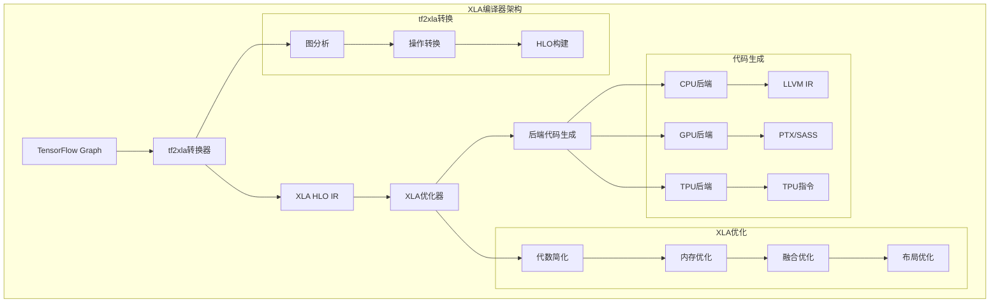
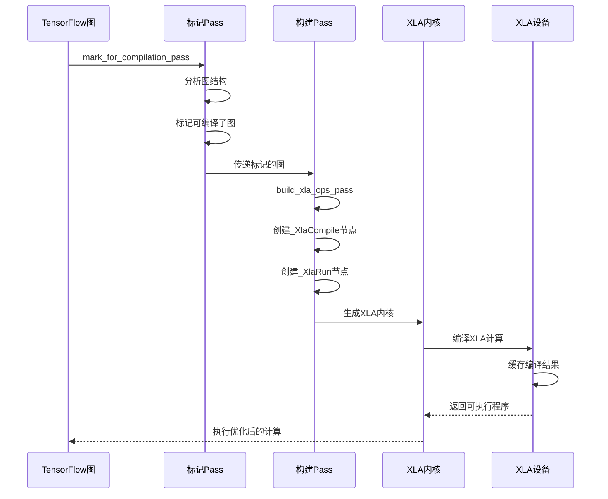
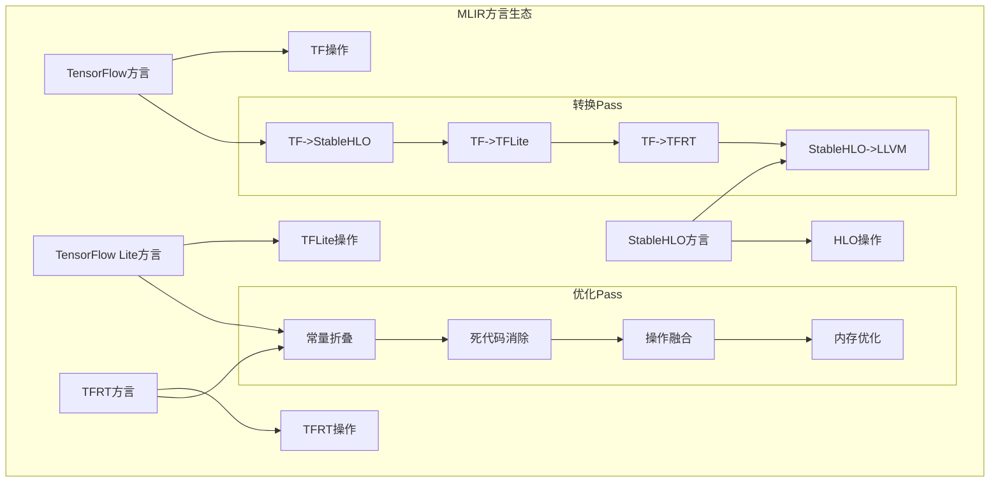
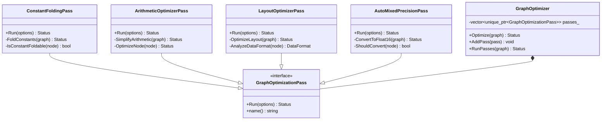
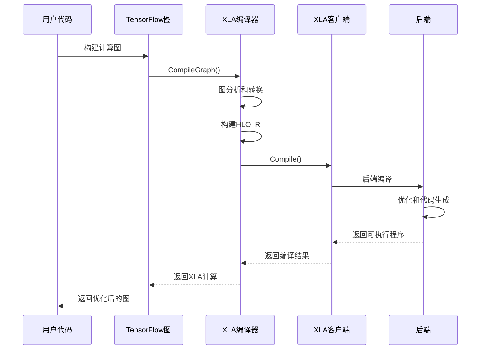
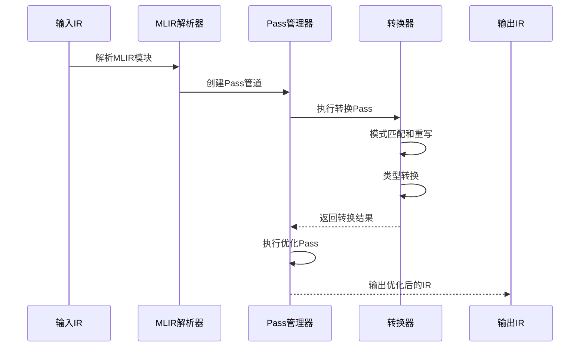

## 模块概述

TensorFlow Compiler模块是框架的编译器基础设施，负责将TensorFlow图转换为高效的可执行代码。它包含多个子系统，从高级的图优化到底层的代码生成。

### 主要子模块结构

```
tensorflow/compiler/
├── aot/            # Ahead-of-Time编译
│   ├── tfcompile.cc    # AOT编译主程序
│   └── compile.cc      # 编译逻辑
├── jit/            # Just-in-Time编译
│   ├── build_xla_ops_pass.cc    # XLA操作构建
│   ├── mark_for_compilation_pass.cc  # 编译标记
│   └── encapsulate_xla_computations_pass.cc  # XLA计算封装
├── mlir/           # MLIR编译器基础设施
│   ├── tensorflow/     # TensorFlow方言
│   ├── lite/          # TensorFlow Lite方言
│   ├── stablehlo/     # StableHLO方言
│   └── tfrt/          # TFRT方言
├── tf2xla/         # TensorFlow到XLA转换
│   ├── xla_compiler.cc    # XLA编译器
│   ├── tf2xla.cc         # 转换主逻辑
│   └── graph_compiler.cc  # 图编译器
└── tf2tensorrt/    # TensorRT集成
    └── convert/        # 转换逻辑
```

## XLA编译器

### 1. XLA编译器架构



### 2. XlaCompiler类 - 核心编译器

```cpp
// tensorflow/compiler/tf2xla/xla_compiler.h
class XlaCompiler {
public:
    /**

     * XLA编译器选项配置
     */
    struct Options {
        xla::Client* client;                    // XLA客户端
        DeviceType device_type;                 // 目标设备类型
        const FunctionLibraryDefinition* flib_def;  // 函数库定义
        int graph_def_version;                  // 图定义版本
        bool allow_cpu_custom_calls = false;   // 是否允许CPU自定义调用
        bool alias_resource_update = true;     // 资源更新别名
    };
    
    /**
     * 编译参数定义
     */
    struct Argument {
        enum Kind {
            kParameter,     // 参数
            kResource,      // 资源
            kConstant,      // 常量
            kInvalid        // 无效
        };
        
        Kind kind;                  // 参数类型
        DataType type;              // 数据类型
        TensorShape shape;          // 张量形状
        std::string name;           // 参数名称
        bool is_same_data_across_replicas = true;  // 跨副本数据一致性
    };
    
    /**
     * 编译结果
     */
    struct CompilationResult {
        std::unique_ptr<xla::XlaComputation> computation;  // XLA计算
        std::vector<OutputDescription> outputs;            // 输出描述
        std::vector<ResourceUpdate> resource_updates;      // 资源更新
        std::vector<int> input_mapping;                    // 输入映射
        bool requires_runtime_context = false;             // 是否需要运行时上下文
    };
    
    /**
     * 构造函数
     * @param options 编译器选项
     */
    explicit XlaCompiler(Options options);
    
    /**
     * 编译TensorFlow图为XLA计算
     * @param options 编译选项
     * @param name 计算名称
     * @param graph 输入图
     * @param args 编译参数
     * @param result 编译结果
     * @return 编译状态
     */
    absl::Status CompileGraph(
        const CompileOptions& options,
        const std::string& name,
        std::unique_ptr<Graph> graph,
        absl::Span<const Argument> args,
        CompilationResult* result);
    
    /**
     * 编译函数为XLA计算
     * @param fn 函数定义
     * @param args 函数参数
     * @param result 编译结果
     * @return 编译状态
     */
    absl::Status CompileFunction(
        const NameAttrList& fn,
        absl::Span<const Argument> args,
        CompilationResult* result);

private:
    /**

     * 获取函数体
     * @param function 函数定义
     * @param fbody 输出函数体
     * @return 查找状态
     */
    absl::Status FindFunctionBody(const NameAttrList& function,
                                  const FunctionBody** fbody);
    
    /**
     * 构建图的XLA表示
     * @param fbody 函数体
     * @return 图对象
     */
    std::unique_ptr<Graph> GetGraph(const FunctionBody* fbody);
    
    Options options_;                           // 编译器选项
    xla::Client* client_;                       // XLA客户端
    FunctionLibraryRuntime* flib_runtime_;      // 函数库运行时
    std::unique_ptr<FunctionLibraryDefinition> local_flib_def_;  // 本地函数库

};
```

### 3. tf2xla转换过程

```cpp
// tensorflow/compiler/tf2xla/tf2xla.cc
/**

 * 将TensorFlow图转换为XLA计算
 * @param graph 输入图
 * @param config 转换配置
 * @param client XLA客户端
 * @param computation 输出XLA计算
 * @return 转换状态

 */
absl::Status ConvertGraphToXla(std::unique_ptr<Graph> graph,
                               const tf2xla::Config& config,
                               xla::Client* client,
                               xla::XlaComputation* computation) {
    // 注册XLA编译内核
    XlaOpRegistry::RegisterCompilationKernels();
    
    // 设置设备名称
    for (Node* node : graph->nodes()) {
        node->set_assigned_device_name(
            absl::StrCat("/device:", DEVICE_CPU_XLA_JIT));
    }
    
    // 创建XLA参数
    std::vector<XlaCompiler::Argument> xla_args;
    TF_RETURN_IF_ERROR(CreateXlaArgs(*graph, &xla_args));
    PopulateXlaArgs(config, &xla_args);
    
    // 配置编译器选项
    XlaCompiler::Options compiler_options;
    compiler_options.client = client;
    compiler_options.device_type = DeviceType(DEVICE_CPU_XLA_JIT);
    compiler_options.flib_def = &graph->flib_def();
    compiler_options.graph_def_version = graph->versions().producer();
    compiler_options.allow_cpu_custom_calls = true;
    
    // 创建编译器并编译
    XlaCompiler compiler(compiler_options);
    XlaCompiler::CompilationResult result;
    XlaCompiler::CompileOptions options;
    options.alias_resource_update = true;
    
    TF_RETURN_IF_ERROR(compiler.CompileGraph(
        options, "tfcompile", std::move(graph), xla_args, &result));
    
    *computation = std::move(*result.computation);
    return absl::OkStatus();
}
```

## JIT编译系统

### 1. JIT编译流程



### 2. 编译标记Pass

```cpp
// tensorflow/compiler/jit/mark_for_compilation_pass.h
class MarkForCompilationPass : public GraphOptimizationPass {
public:
    /**

     * 执行编译标记Pass
     * @param options 图优化选项
     * @return 执行状态
     */
    absl::Status Run(const GraphOptimizationPassOptions& options) override;

private:
    /**

     * 分析图中的集群
     * @param graph 输入图
     * @param clusters 输出集群信息
     * @return 分析状态
     */
    absl::Status AnalyzeClusters(const Graph* graph,
                                 std::vector<Cluster>* clusters);
    
    /**
     * 标记可编译的节点
     * @param node 图节点
     * @return 是否可编译
     */
    bool IsCompilableNode(const Node* node) const;
    
    /**
     * 检查操作是否支持XLA编译
     * @param node_def 节点定义
     * @param device_type 设备类型
     * @return 是否支持
     */
    bool IsXlaCompilableOp(const NodeDef& node_def,
                           const DeviceType& device_type) const;

};
```

### 3. XLA操作构建Pass

```cpp
// tensorflow/compiler/jit/build_xla_ops_pass.h
class BuildXlaOpsPass : public GraphOptimizationPass {
public:
    /**

     * 构造函数
     * @param enable_lazy_compilation 是否启用延迟编译
     */
    explicit BuildXlaOpsPass(
        std::optional<bool> enable_lazy_compilation = std::nullopt);
    
    /**
     * 执行XLA操作构建Pass
     * @param options 图优化选项
     * @return 执行状态
     */
    absl::Status Run(const GraphOptimizationPassOptions& options) override;

private:
    /**

     * 替换函数调用为XLA操作
     * @param graph 输入图
     * @return 替换状态
     */
    absl::Status ReplaceFunctionCallsWithXlaOps(Graph* graph);
    
    /**
     * 创建XLA编译节点
     * @param cluster 集群信息
     * @param graph 图对象
     * @return 创建的节点
     */
    Node* CreateXlaCompileNode(const Cluster& cluster, Graph* graph);
    
    /**
     * 创建XLA运行节点
     * @param cluster 集群信息
     * @param compile_node 编译节点
     * @param graph 图对象
     * @return 创建的节点
     */
    Node* CreateXlaRunNode(const Cluster& cluster,
                           Node* compile_node,
                           Graph* graph);
    
    std::optional<bool> enable_lazy_compilation_;  // 延迟编译选项

};
```

## MLIR基础设施

### 1. MLIR方言架构



### 2. TensorFlow方言定义

```cpp
// tensorflow/compiler/mlir/tensorflow/ir/tf_dialect.h
namespace mlir {
namespace TF {

/**

 * TensorFlow方言定义

 */
class TensorFlowDialect : public Dialect {
public:
    explicit TensorFlowDialect(MLIRContext* context);
    
    /**

     * 获取方言名称
     */
    static StringRef getDialectNamespace() { return "tf"; }
    
    /**
     * 解析类型
     */
    Type parseType(DialectAsmParser& parser) const override;
    
    /**
     * 打印类型
     */
    void printType(Type type, DialectAsmPrinter& printer) const override;
    
    /**
     * 解析属性
     */
    Attribute parseAttribute(DialectAsmParser& parser, Type type) const override;
    
    /**
     * 打印属性
     */
    void printAttribute(Attribute attr, DialectAsmPrinter& printer) const override;

private:
    /**

     * 初始化方言
     */
    void initialize();

};

/**

 * TensorFlow操作基类

 */
class TensorFlowOp : public Op<TensorFlowOp> {
public:
    using Op::Op;
    
    /**

     * 验证操作
     */
    LogicalResult verify();
    
    /**
     * 获取操作名称
     */
    static StringRef getOperationName() { return "tf.op"; }
    
    /**
     * 构建操作
     */
    static void build(OpBuilder& builder, OperationState& state,
                      ArrayRef<Type> resultTypes,
                      ArrayRef<Value> operands,
                      ArrayRef<NamedAttribute> attributes);

};

} // namespace TF
} // namespace mlir
```

### 3. MLIR转换Pass

```cpp
// tensorflow/compiler/mlir/stablehlo/transforms/tf_stablehlo_pass.cc
class TFToStablehloPass : public PassWrapper<TFToStablehloPass, OperationPass<func::FuncOp>> {
public:
    /**

     * 获取Pass名称
     */
    StringRef getArgument() const final { return "tf-to-stablehlo"; }
    StringRef getDescription() const final {
        return "Convert TensorFlow ops to StableHLO ops";
    }
    
    /**
     * 执行转换Pass
     */
    void runOnOperation() override {
        auto func = getOperation();
        MLIRContext* context = func->getContext();
        
        // 创建重写模式
        RewritePatternSet patterns(context);
        odml::PopulateLegalizeTfPatterns(context, &patterns);
        TF::PopulateTFLoweringBeforeHLOPatterns(context, &patterns);
        
        // 配置类型转换器
        mhlo::Tf2XlaTypeConverter converter;
        mhlo::PopulateLegalizeTfWithTf2XlaPatterns(
            "XLA_CPU_JIT", patterns, context, converter, false);
        
        // 添加StableHLO模式
        stablehlo::StablehloToHloTypeConverter hlo_converter;
        chlo::populateChloToHloPatterns(context, &hlo_converter, &patterns);
        
        // 配置转换目标
        ConversionTarget target(*context);
        target.addIllegalDialect<chlo::ChloDialect>();
        target.addLegalDialect<mhlo::MhloDialect>();
        target.addLegalDialect<arith::ArithDialect>();
        target.addLegalDialect<func::FuncDialect>();
        
        // 执行转换
        FrozenRewritePatternSet frozen_patterns(std::move(patterns));
        if (failed(applyPartialConversion(func, target, frozen_patterns))) {
            return signalPassFailure();
        }
    }

};
```

### 4. MLIR Pass管道

```cpp
// tensorflow/compiler/mlir/tfrt/transforms/mlrt/passes.cc
/**

 * 创建TF到MLRT的转换管道
 * @param pm Pass管理器
 * @param options 管道选项
 * @param fallback_state 回退状态
 * @param cost_recorder 成本记录器

 */
void CreateTfToMlrtPipeline(mlir::OpPassManager& pm,
                            const TfrtPipelineOptions& options,
                            const tfrt_stub::FallbackState* fallback_state,
                            const tfrt_stub::CostRecorder* cost_recorder) {
    // 预并行化转换
    pm.addPass(mlrt_compiler::CreateTfToMlrtPreParallelizationConversionPass(options));
    
    // TPU主机分配器设置
    if (options.use_tpu_host_allocator_for_inputs) {
        pm.addNestedPass<mlir::func::FuncOp>(
            mlrt_compiler::CreateIfrtSetTpuHostAllocatorPass());
    }
    
    // 重写IFRT加载变量
    pm.addPass(mlrt_compiler::CreateRewriteIfrtLoadVariablePass());
    
    // 异步while循环
    if (options.enable_while_parallel_iterations) {
        pm.addPass(mlrt_compiler::CreateAsyncWhilePass());
    }
    
    // 并行化Pass
    pm.addPass(mlrt_compiler::CreateParallelizationPass(
        options.cost_threshold,
        options.merge_inter_dependent_streams,
        cost_recorder));
    
    // TF到MLRT转换
    pm.addPass(mlrt_compiler::CreateTfToMlrtConversionPass(options, fallback_state));
    
    // 优化Pass
    pm.addNestedPass<mlir::func::FuncOp>(mlrt_compiler::CreateFuseMlrtOpPass());
    pm.addNestedPass<mlir::func::FuncOp>(mlir::createCanonicalizerPass());
    pm.addPass(mlir::createInlinerPass());
    pm.addNestedPass<mlir::func::FuncOp>(mlir::createCSEPass());
}
```

## 图优化框架

### 1. 图优化Pass架构



### 2. 常量折叠优化

```cpp
// tensorflow/core/grappler/optimizers/constant_folding.h
class ConstantFolding : public GraphOptimizer {
public:
    /**

     * 构造函数
     * @param cpu_device CPU设备
     */
    explicit ConstantFolding(DeviceBase* cpu_device = nullptr);
    
    /**
     * 获取优化器名称
     */
    string name() const override { return "constant_folding"; }
    
    /**
     * 执行常量折叠优化
     * @param item 图项目
     * @param optimized_graph 优化后的图
     * @return 优化状态
     */
    absl::Status Optimize(Cluster* cluster, const GrapplerItem& item,
                          GraphDef* optimized_graph) override;

private:
    /**

     * 检查节点是否可以常量折叠
     * @param node 图节点
     * @return 是否可折叠
     */
    bool IsConstantFoldable(const NodeDef& node) const;
    
    /**
     * 折叠常量节点
     * @param node 节点
     * @param graph 图对象
     * @return 折叠状态
     */
    absl::Status FoldNode(NodeDef* node, GraphDef* graph);
    
    /**
     * 评估常量表达式
     * @param node 节点
     * @param output_tensors 输出张量
     * @return 评估状态
     */
    absl::Status EvaluateNode(const NodeDef& node,
                              std::vector<Tensor>* output_tensors);
    
    DeviceBase* cpu_device_;                    // CPU设备
    std::unique_ptr<ProcessFunctionLibraryRuntime> pflr_;  // 函数库运行时
    std::unique_ptr<FunctionLibraryDefinition> function_library_;  // 函数库定义

};
```

### 3. 算术优化器

```cpp
// tensorflow/core/grappler/optimizers/arithmetic_optimizer.h
class ArithmeticOptimizer : public GraphOptimizer {
public:
    ArithmeticOptimizer() = default;
    
    /**

     * 获取优化器名称
     */
    string name() const override { return "arithmetic_optimizer"; }
    
    /**
     * 执行算术优化
     * @param cluster 集群
     * @param item 图项目
     * @param optimized_graph 优化后的图
     * @return 优化状态
     */
    absl::Status Optimize(Cluster* cluster, const GrapplerItem& item,
                          GraphDef* optimized_graph) override;

private:
    /**

     * 优化节点
     * @param node 节点
     * @param graph 图对象
     * @return 优化状态
     */
    absl::Status OptimizeNode(NodeDef* node, GraphDef* graph);
    
    /**
     * 简化算术表达式
     * @param node 节点
     * @return 是否简化成功
     */
    bool SimplifyArithmeticExpression(NodeDef* node);
    
    /**
     * 合并相邻的算术操作
     * @param node 节点
     * @return 是否合并成功
     */
    bool CombineAdjacentArithmeticOps(NodeDef* node);
    
    /**
     * 消除冗余操作
     * @param node 节点
     * @return 是否消除成功
     */
    bool EliminateRedundantOps(NodeDef* node);

};
```

## AOT编译

### 1. tfcompile工具

```cpp
// tensorflow/compiler/aot/tfcompile.cc
/**

 * AOT编译主函数
 * @param argc 参数个数
 * @param argv 参数数组
 * @return 执行状态

 */
int main(int argc, char** argv) {
    // 解析命令行参数
    MainFlags flags;
    ParseFlags(argc, argv, &flags);
    
    // 读取配置文件
    tf2xla::Config config;
    TF_CHECK_OK(ReadConfigFile(flags.config, &config));
    
    // 读取图定义
    GraphDef graph_def;
    TF_CHECK_OK(ReadGraphDefFile(flags.graph, &graph_def));
    
    // 执行编译
    CompileResult result;
    TF_CHECK_OK(CompileGraph(config, graph_def, flags, &result));
    
    // 生成输出文件
    TF_CHECK_OK(WriteOutputFiles(flags, result));
    
    return 0;
}

/**

 * 编译图为AOT代码
 * @param config 编译配置
 * @param graph_def 图定义
 * @param flags 编译标志
 * @param result 编译结果
 * @return 编译状态

 */
absl::Status CompileGraph(const tf2xla::Config& config,
                          const GraphDef& graph_def,
                          const MainFlags& flags,
                          CompileResult* result) {
    // 创建XLA客户端
    xla::LocalClientOptions client_options;
    client_options.set_platform(xla::PlatformUtil::GetPlatform("cpu").value());
    std::unique_ptr<xla::LocalClient> client =
        xla::ClientLibrary::GetOrCreateLocalClient(client_options).value();
    
    // 转换图为XLA计算
    xla::XlaComputation computation;
    TF_RETURN_IF_ERROR(ConvertGraphToXla(
        std::make_unique<Graph>(OpRegistry::Global()),
        config, client.get(), &computation));
    
    // 编译XLA计算
    std::vector<const xla::Shape*> argument_layouts;
    TF_ASSIGN_OR_RETURN(
        std::unique_ptr<xla::LocalExecutable> executable,
        client->Compile(computation, argument_layouts,
                        xla::ExecutableBuildOptions()));
    
    // 生成AOT代码
    TF_RETURN_IF_ERROR(GenerateAOTCode(executable.get(), flags, result));
    
    return absl::OkStatus();
}
```

### 2. AOT代码生成

```cpp
// tensorflow/compiler/aot/compile.h
/**

 * AOT编译结果

 */
struct CompileResult {
    string header_text;         // 头文件内容
    string source_text;         // 源文件内容
    string object_file_data;    // 目标文件数据
    string metadata_text;       // 元数据内容
    
    // 程序形状信息
    xla::ProgramShape program_shape;
    
    // 入口点信息
    string entry_point;
    string class_name;
};

/**

 * 生成AOT C++代码
 * @param executable XLA可执行程序
 * @param flags 编译标志
 * @param result 编译结果
 * @return 生成状态

 */
absl::Status GenerateAOTCode(const xla::LocalExecutable* executable,
                             const MainFlags& flags,
                             CompileResult* result) {
    // 获取程序形状
    result->program_shape = executable->executable()->module().entry_computation()->ComputeProgramShape();
    
    // 生成头文件
    TF_RETURN_IF_ERROR(GenerateHeader(flags, result->program_shape, &result->header_text));
    
    // 生成源文件
    TF_RETURN_IF_ERROR(GenerateSource(flags, executable, &result->source_text));
    
    // 生成目标文件
    TF_RETURN_IF_ERROR(GenerateObjectFile(executable, &result->object_file_data));
    
    // 生成元数据
    TF_RETURN_IF_ERROR(GenerateMetadata(flags, result->program_shape, &result->metadata_text));
    
    return absl::OkStatus();
}
```

## 关键API和调用链

### 1. XLA编译调用链



### 2. MLIR转换调用链



## 最佳实践

### 1. XLA编译优化

```python
# 启用XLA编译
import tensorflow as tf

# 全局启用XLA
tf.config.optimizer.set_jit(True)

# 函数级别启用XLA
@tf.function(jit_compile=True)
def optimized_function(x, y):
    """使用XLA编译的函数
    
    功能说明:

    - 自动进行操作融合
    - 优化内存使用
    - 生成高效的机器代码
    """
    z = tf.matmul(x, y)
    return tf.nn.relu(z)

# 模型级别启用XLA
model = tf.keras.Sequential([
    tf.keras.layers.Dense(128, activation='relu'),
    tf.keras.layers.Dense(64, activation='relu'),
    tf.keras.layers.Dense(10, activation='softmax')
])

# 编译时启用XLA
model.compile(
    optimizer='adam',
    loss='sparse_categorical_crossentropy',
    metrics=['accuracy'],
    jit_compile=True  # 启用XLA编译
)
```

### 2. 自定义MLIR Pass

```cpp
// 自定义MLIR优化Pass
class CustomOptimizationPass : public PassWrapper<CustomOptimizationPass,
                                                  OperationPass<func::FuncOp>> {
public:
    StringRef getArgument() const final { return "custom-optimization"; }
    StringRef getDescription() const final { return "Custom optimization pass"; }
    
    void runOnOperation() override {
        auto func = getOperation();
        
        // 遍历函数中的所有操作
        func.walk([&](Operation* op) {
            // 自定义优化逻辑
            if (auto addOp = dyn_cast<TF::AddOp>(op)) {
                optimizeAddOperation(addOp);
            }
        });
    }

private:
    void optimizeAddOperation(TF::AddOp addOp) {
        // 检查是否可以优化
        if (canOptimize(addOp)) {
            // 执行优化变换
            OpBuilder builder(addOp);
            auto optimizedOp = builder.create<TF::OptimizedAddOp>(
                addOp.getLoc(),
                addOp.getType(),
                addOp.getOperands()
            );
            
            // 替换原操作
            addOp.replaceAllUsesWith(optimizedOp.getResult());
            addOp.erase();
        }
    }
    
    bool canOptimize(TF::AddOp addOp) {
        // 优化条件检查
        return addOp.getOperands().size() == 2 &&
               addOp.getType().isa<TensorType>();
    }
};
```

### 3. 图优化配置

```python
# 配置图优化选项
def configure_graph_optimization():
    """配置TensorFlow图优化
    
    功能说明:

    - 启用各种图优化Pass
    - 配置优化级别
    - 设置设备特定优化
    """
    
    # 获取默认配置
    config = tf.compat.v1.ConfigProto()
    
    # 启用图优化
    config.graph_options.optimizer_options.global_jit_level = (
        tf.compat.v1.OptimizerOptions.ON_1)
    
    # 配置重写器选项
    rewriter_config = config.graph_options.rewrite_options
    rewriter_config.arithmetic_optimization = (
        tf.compat.v1.RewriterConfig.ON)
    rewriter_config.constant_folding = (
        tf.compat.v1.RewriterConfig.ON)
    rewriter_config.layout_optimizer = (
        tf.compat.v1.RewriterConfig.ON)
    rewriter_config.memory_optimization = (
        tf.compat.v1.RewriterConfig.ON_1)
    
    # 启用自动混合精度
    rewriter_config.auto_mixed_precision = (
        tf.compat.v1.RewriterConfig.ON)
    
    return config

# 使用优化配置
config = configure_graph_optimization()
with tf.compat.v1.Session(config=config) as sess:
    # 执行优化后的计算
    result = sess.run(optimized_graph)
```

### 4. 性能分析和调试

```python
# XLA编译性能分析
def analyze_xla_performance():
    """分析XLA编译性能
    
    功能说明:

    - 比较编译前后性能
    - 分析编译开销
    - 识别优化瓶颈
    """
    
    # 创建测试数据
    x = tf.random.normal((1000, 1000))
    y = tf.random.normal((1000, 1000))
    
    # 未编译版本
    @tf.function
    def uncompiled_function(a, b):
        c = tf.matmul(a, b)
        return tf.nn.relu(c)
    
    # XLA编译版本
    @tf.function(jit_compile=True)
    def compiled_function(a, b):
        c = tf.matmul(a, b)
        return tf.nn.relu(c)
    
    # 性能测试
    import time
    
    # 预热
    _ = uncompiled_function(x, y)
    _ = compiled_function(x, y)
    
    # 测试未编译版本
    start_time = time.time()
    for _ in range(100):
        _ = uncompiled_function(x, y)
    uncompiled_time = time.time() - start_time
    
    # 测试编译版本
    start_time = time.time()
    for _ in range(100):
        _ = compiled_function(x, y)
    compiled_time = time.time() - start_time
    
    print(f"未编译时间: {uncompiled_time:.4f}s")
    print(f"XLA编译时间: {compiled_time:.4f}s")
    print(f"加速比: {uncompiled_time / compiled_time:.2f}x")

```

## 总结

TensorFlow Compiler模块提供了完整的编译器基础设施：

1. **XLA编译器** - 高性能的跨平台编译器，支持CPU、GPU、TPU
2. **JIT编译系统** - 运行时编译优化，自动识别和编译热点代码
3. **MLIR基础设施** - 现代化的编译器框架，支持多种方言和转换
4. **图优化框架** - 丰富的图级优化Pass，提升模型性能
5. **AOT编译** - 提前编译工具，生成独立的可执行代码

通过深入理解编译器模块的设计和实现，可以：

- 更好地利用XLA编译优化模型性能
- 开发自定义的图优化Pass
- 使用MLIR扩展编译器功能
- 进行AOT编译部署优化模型
