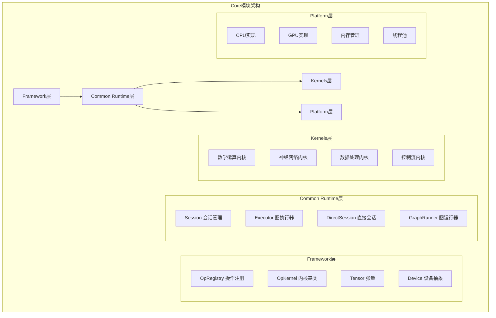
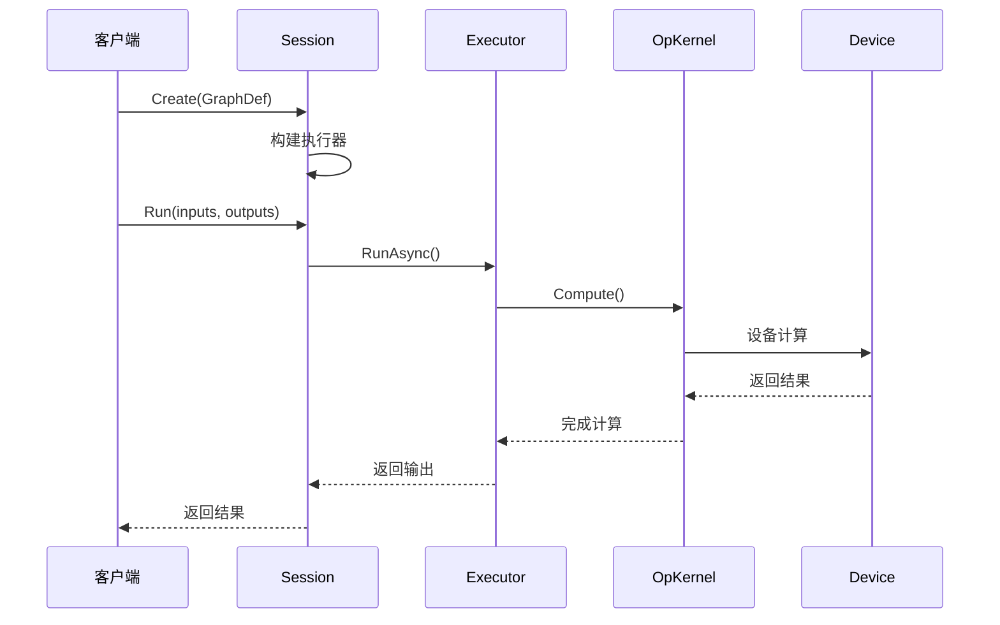
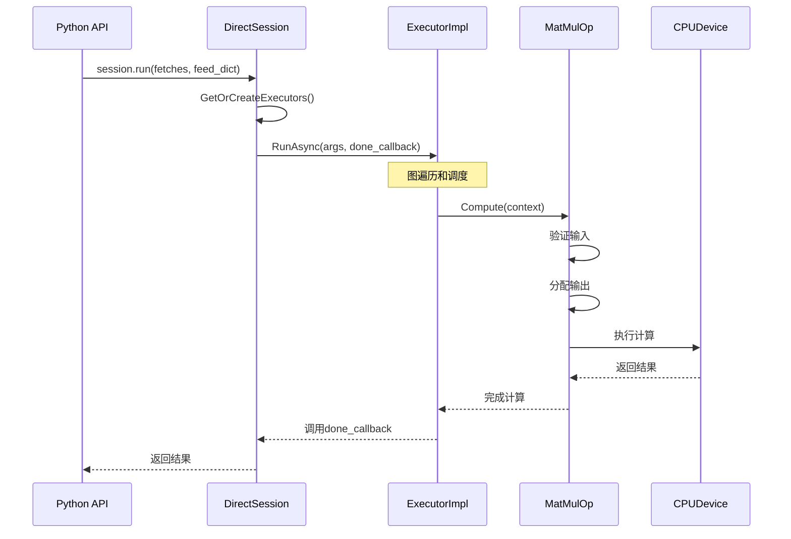
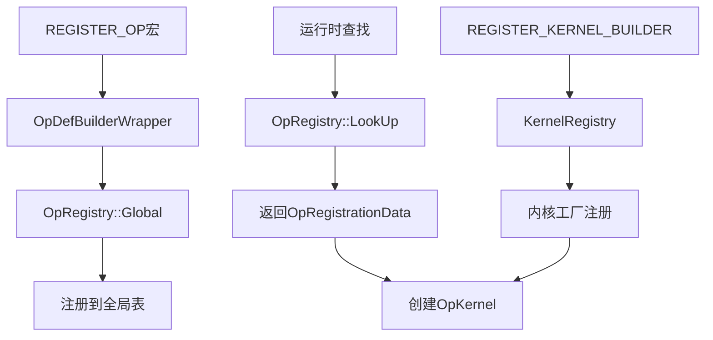
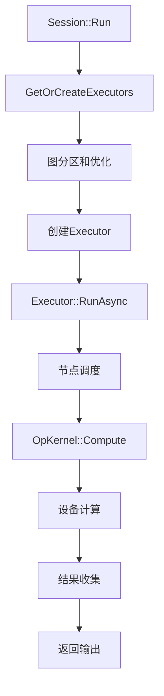

## 模块概述

TensorFlow Core模块是整个框架的核心，包含了运行时系统、操作定义、内核实现等关键组件。它提供了TensorFlow的基础设施，支撑着上层的Python API和其他语言绑定。

### 主要子模块

```
tensorflow/core/
├── framework/          # 框架基础设施
│   ├── op.h/cc         # 操作注册和管理
│   ├── op_kernel.h/cc  # 操作内核基类
│   ├── tensor.h/cc     # 张量实现
│   └── device.h/cc     # 设备抽象
├── common_runtime/     # 通用运行时
│   ├── session.cc      # 会话实现
│   ├── executor.h/cc   # 图执行器
│   └── direct_session.h/cc # 直接会话
├── kernels/           # 操作内核实现
│   ├── matmul_op.cc   # 矩阵乘法
│   ├── conv_ops.cc    # 卷积操作
│   └── ...
├── ops/              # 操作定义
├── platform/         # 平台抽象层
└── graph/           # 图相关实现
```

## 核心架构

### 整体架构图



### 模块交互时序图



## Framework子模块

### 1. 操作注册系统

#### OpRegistry类 - 操作注册中心

```cpp
// tensorflow/core/framework/op.h
class OpRegistry : public OpRegistryInterface {
public:
    /**
     * 注册操作到全局注册表
     * @param op_data_factory 操作数据工厂函数
     * @return 注册状态
     */
    absl::Status Register(const OpRegistrationDataFactory& op_data_factory) const;
    
    /**
     * 查找已注册的操作
     * @param op_type_name 操作类型名称
     * @param op_reg_data 输出参数，返回操作注册数据
     * @return 查找状态
     */
    absl::Status LookUp(const std::string& op_type_name,
                        const OpRegistrationData** op_reg_data) const override;
    
    /**
     * 获取全局操作注册表实例
     * @return 全局注册表指针
     */
    static OpRegistry* Global();

private:
    // 操作注册表，使用线程安全的映射
    mutable std::unordered_map<std::string, 
                               std::unique_ptr<OpRegistrationData>> registry_;
    mutable mutex mu_;  // 保护注册表的互斥锁
};
```

#### 操作注册宏

```cpp
// tensorflow/core/framework/op.h
#define REGISTER_OP(name)        \
  TF_ATTRIBUTE_ANNOTATE("tf:op") \
  TF_NEW_ID_FOR_INIT(REGISTER_OP_IMPL, name, false)

// 使用示例
REGISTER_OP("MatMul")
    .Input("a: T")
    .Input("b: T")
    .Output("product: T")
    .Attr("transpose_a: bool = false")
    .Attr("transpose_b: bool = false")
    .Attr("T: {half, float, double, int32, int64, complex64, complex128}")
    .SetShapeFn(shape_inference::MatMulShape);
```

### 2. OpKernel基类 - 操作内核

```cpp
// tensorflow/core/framework/op_kernel.h
class OpKernel {
public:
    /**
     * 构造函数，从OpKernelConstruction获取配置信息
     * @param context 内核构造上下文
     */
    explicit OpKernel(OpKernelConstruction* context);
    
    virtual ~OpKernel();
    
    /**
     * 同步计算接口，子类必须实现
     * @param context 操作内核上下文，包含输入输出等信息
     */
    virtual void Compute(OpKernelContext* context) = 0;
    
    /**
     * 获取操作定义
     * @return 操作定义的常量引用
     */
    const NodeDef& def() const { return def_; }
    
    /**
     * 获取操作名称
     * @return 操作名称字符串
     */
    const std::string& name() const;
    
    /**
     * 获取操作类型
     * @return 操作类型字符串
     */
    const std::string& type_string() const;

private:
    const std::unique_ptr<const NodeDef> def_;  // 节点定义
    const std::string name_;                    // 操作名称
    const std::string type_;                    // 操作类型
};
```

#### 异步操作内核

```cpp
// tensorflow/core/framework/op_kernel.h
class AsyncOpKernel : public OpKernel {
public:
    typedef std::function<void()> DoneCallback;
    
    /**
     * 异步计算接口
     * @param context 操作内核上下文
     * @param done 完成回调函数
     */
    virtual void ComputeAsync(OpKernelContext* context, 
                              DoneCallback done) = 0;
    
    // 同步Compute接口的默认实现，调用ComputeAsync
    void Compute(OpKernelContext* context) final;
};
```

### 3. Tensor类 - 张量实现

```cpp
// tensorflow/core/framework/tensor.h
class Tensor {
public:
    /**
     * 默认构造函数，创建空张量
     */
    Tensor();
    
    /**
     * 构造指定类型和形状的张量
     * @param type 数据类型
     * @param shape 张量形状
     */
    Tensor(DataType type, const TensorShape& shape);
    
    /**
     * 获取张量的数据类型
     * @return 数据类型枚举
     */
    DataType dtype() const { return shape_.dtype(); }
    
    /**
     * 获取张量形状
     * @return 张量形状对象
     */
    const TensorShape& shape() const { return shape_; }
    
    /**
     * 获取张量元素总数
     * @return 元素数量
     */
    int64_t NumElements() const { return shape_.num_elements(); }
    
    /**
     * 获取张量数据的平坦视图
     * @return 平坦张量视图
     */
    template<typename T>
    typename TTypes<T>::Flat flat() {
        return typename TTypes<T>::Flat(base<T>(), NumElements());
    }

private:
    TensorShape shape_;      // 张量形状
    TensorBuffer* buf_;      // 数据缓冲区
};
```

## Common Runtime子模块

### 1. Session类 - 会话管理

#### Session基类接口

```cpp
// tensorflow/core/public/session.h
class Session {
public:
    Session();
    virtual ~Session();
    
    /**
     * 创建计算图
     * @param graph 图定义
     * @return 创建状态
     */
    virtual absl::Status Create(const GraphDef& graph) = 0;
    
    /**
     * 扩展现有图
     * @param graph 要添加的图定义
     * @return 扩展状态
     */
    virtual absl::Status Extend(const GraphDef& graph) = 0;
    
    /**
     * 执行计算图
     * @param inputs 输入张量对
     * @param output_tensor_names 输出张量名称列表
     * @param target_tensor_names 目标节点名称列表
     * @param outputs 输出张量列表
     * @return 执行状态
     */
    virtual absl::Status Run(
        const std::vector<std::pair<std::string, Tensor>>& inputs,
        const std::vector<std::string>& output_tensor_names,
        const std::vector<std::string>& target_tensor_names,
        std::vector<Tensor>* outputs) = 0;
    
    /**
     * 关闭会话，释放资源
     * @return 关闭状态
     */
    virtual absl::Status Close() = 0;
};
```

#### DirectSession实现

```cpp
// tensorflow/core/common_runtime/direct_session.h
class DirectSession : public Session {
public:
    /**
     * 构造函数
     * @param options 会话选项
     * @param device_mgr 设备管理器
     * @param factory 会话工厂
     */
    DirectSession(const SessionOptions& options, 
                  const DeviceMgr* device_mgr,
                  DirectSessionFactory* factory);
    
    // 实现Session接口
    absl::Status Create(const GraphDef& graph) override;
    absl::Status Run(const NamedTensorList& inputs,
                     const std::vector<string>& output_names,
                     const std::vector<string>& target_nodes,
                     std::vector<Tensor>* outputs) override;

private:
    /**
     * 获取或创建执行器
     * @param input_tensor_names 输入张量名称
     * @param output_names 输出名称
     * @param target_nodes 目标节点
     * @param executors_and_keys 输出参数，执行器和键
     * @param run_state_args 运行状态参数
     * @return 获取状态
     */
    absl::Status GetOrCreateExecutors(
        gtl::ArraySlice<string> input_tensor_names,
        gtl::ArraySlice<string> output_names,
        gtl::ArraySlice<string> target_nodes,
        ExecutorsAndKeys** executors_and_keys,
        RunStateArgs* run_state_args);
    
    const SessionOptions options_;           // 会话选项
    const std::unique_ptr<const DeviceMgr> device_mgr_;  // 设备管理器
    std::unique_ptr<Graph> graph_;          // 计算图
    std::atomic<int64_t> step_id_counter_;  // 步骤ID计数器
};
```

### 2. Executor类 - 图执行器

```cpp
// tensorflow/core/common_runtime/executor.h
class Executor {
public:
    virtual ~Executor() {}
    
    /**
     * 异步执行图计算
     * @param args 执行参数
     * @param done 完成回调
     */
    virtual void RunAsync(const Args& args, DoneCallback done) = 0;
    
    /**
     * 同步执行图计算
     * @param args 执行参数
     * @return 执行状态
     */
    absl::Status Run(const Args& args) {
        Notification n;
        absl::Status s;
        RunAsync(args, [&n, &s](const absl::Status& status) {
            s = status;
            n.Notify();
        });
        n.WaitForNotification();
        return s;
    }
    
    // 执行参数结构
    struct Args {
        int64_t step_id = 0;                    // 步骤ID
        Rendezvous* rendezvous = nullptr;       // 数据交换点
        StepStatsCollectorInterface* stats_collector = nullptr;  // 统计收集器
        CallFrameInterface* call_frame = nullptr;  // 调用帧
        CancellationManager* cancellation_manager = nullptr;  // 取消管理器
        SessionState* session_state = nullptr;   // 会话状态
        std::function<void(std::function<void()>)> runner = nullptr;  // 任务运行器
    };
};
```

#### 执行器工厂

```cpp
// tensorflow/core/common_runtime/executor_factory.h
/**
 * 创建本地执行器
 * @param params 本地执行器参数
 * @param graph 计算图
 * @param executor 输出参数，创建的执行器
 * @return 创建状态
 */
absl::Status NewLocalExecutor(const LocalExecutorParams& params,
                              const Graph& graph,
                              Executor** executor);

// 本地执行器参数
struct LocalExecutorParams {
    Device* device;                          // 设备
    FunctionLibraryRuntime* function_library; // 函数库运行时
    
    // 内核创建函数
    std::function<absl::Status(const std::shared_ptr<const NodeProperties>&,
                               OpKernel**)> create_kernel;
    
    // 内核删除函数  
    std::function<void(OpKernel*)> delete_kernel;
};
```

## Kernels子模块

### 1. 内核注册系统

```cpp
// tensorflow/core/framework/op_kernel.h
#define REGISTER_KERNEL_BUILDER(kernel_builder, op_class) \
  REGISTER_KERNEL_BUILDER_UNIQ_HELPER(__COUNTER__, kernel_builder, op_class)

// 使用示例
REGISTER_KERNEL_BUILDER(
    Name("MatMul").Device(DEVICE_CPU).TypeConstraint<float>("T"),
    MatMulOp<CPUDevice, float>);
```

### 2. 矩阵乘法内核实现

```cpp
// tensorflow/core/kernels/matmul_op.cc
template <typename Device, typename T>
class MatMulOp : public OpKernel {
public:
    explicit MatMulOp(OpKernelConstruction* ctx) : OpKernel(ctx) {
        // 获取属性
        OP_REQUIRES_OK(ctx, ctx->GetAttr("transpose_a", &transpose_a_));
        OP_REQUIRES_OK(ctx, ctx->GetAttr("transpose_b", &transpose_b_));
    }
    
    void Compute(OpKernelContext* ctx) override {
        // 获取输入张量
        const Tensor& a = ctx->input(0);
        const Tensor& b = ctx->input(1);
        
        // 验证输入形状
        OP_REQUIRES(ctx, a.dims() >= 2,
                    errors::InvalidArgument("Input 'a' must have at least 2 dimensions"));
        OP_REQUIRES(ctx, b.dims() >= 2,
                    errors::InvalidArgument("Input 'b' must have at least 2 dimensions"));
        
        // 计算输出形状
        TensorShape output_shape;
        OP_REQUIRES_OK(ctx, GetOutputShape(a.shape(), b.shape(), &output_shape));
        
        // 分配输出张量
        Tensor* output = nullptr;
        OP_REQUIRES_OK(ctx, ctx->allocate_output(0, output_shape, &output));
        
        // 执行矩阵乘法
        LaunchMatMul<Device, T>::launch(ctx, a, b, transpose_a_, transpose_b_, output);
    }

private:
    bool transpose_a_;  // 是否转置矩阵a
    bool transpose_b_;  // 是否转置矩阵b
    
    /**
     * 计算输出形状
     * @param a_shape 矩阵a的形状
     * @param b_shape 矩阵b的形状  
     * @param output_shape 输出形状
     * @return 计算状态
     */
    absl::Status GetOutputShape(const TensorShape& a_shape,
                                const TensorShape& b_shape,
                                TensorShape* output_shape);
};
```

## 关键API和调用链

### 1. 操作执行调用链



### 2. 操作注册和查找流程



## 执行流程分析

### 1. 会话创建和图构建

```cpp
// 会话创建示例
SessionOptions options;
std::unique_ptr<Session> session(NewSession(options));

// 图构建
GraphDef graph_def;
// ... 构建图定义 ...
Status s = session->Create(graph_def);
```

### 2. 图执行流程



### 3. 内存管理

```cpp
// tensorflow/core/framework/allocator.h
class Allocator {
public:
    /**
     * 分配内存
     * @param size 分配大小
     * @param alignment 内存对齐
     * @return 分配的内存指针
     */
    virtual void* AllocateRaw(size_t alignment, size_t size) = 0;
    
    /**
     * 释放内存
     * @param ptr 内存指针
     */
    virtual void DeallocateRaw(void* ptr) = 0;
    
    /**
     * 分配张量
     * @param size 张量大小
     * @param proto 张量原型
     * @return 分配状态
     */
    absl::Status AllocateTensor(size_t size, Tensor* tensor);
};
```

## 最佳实践

### 1. 自定义操作开发

```cpp
// 1. 注册操作
REGISTER_OP("MyCustomOp")
    .Input("input: T")
    .Output("output: T")
    .Attr("T: {float, double}")
    .Attr("my_attr: int = 1")
    .SetShapeFn([](::tensorflow::shape_inference::InferenceContext* c) {
        c->set_output(0, c->input(0));
        return absl::OkStatus();
    });

// 2. 实现内核
template <typename Device, typename T>
class MyCustomOp : public OpKernel {
public:
    explicit MyCustomOp(OpKernelConstruction* context) : OpKernel(context) {
        OP_REQUIRES_OK(context, context->GetAttr("my_attr", &my_attr_));
    }
    
    void Compute(OpKernelContext* context) override {
        const Tensor& input_tensor = context->input(0);
        
        Tensor* output_tensor = nullptr;
        OP_REQUIRES_OK(context, context->allocate_output(0, input_tensor.shape(), 
                                                         &output_tensor));
        
        // 实现具体计算逻辑
        auto input = input_tensor.flat<T>();
        auto output = output_tensor->flat<T>();
        
        for (int i = 0; i < input.size(); ++i) {
            output(i) = input(i) * my_attr_;
        }
    }

private:
    int my_attr_;
};

// 3. 注册内核
REGISTER_KERNEL_BUILDER(
    Name("MyCustomOp").Device(DEVICE_CPU).TypeConstraint<float>("T"),
    MyCustomOp<CPUDevice, float>);
```

### 2. 性能优化建议

1. **内存管理优化**
   - 使用内存池减少分配开销
   - 避免不必要的内存拷贝
   - 合理使用in-place操作

2. **并行计算优化**
   - 利用多线程并行处理
   - 使用SIMD指令加速
   - 合理划分工作负载

3. **设备特定优化**
   - CPU：利用缓存友好的内存访问模式
   - GPU：最大化并行度，减少内存传输

### 3. 调试和性能分析

```cpp
// 启用性能分析
RunOptions run_options;
run_options.set_trace_level(RunOptions::FULL_TRACE);

RunMetadata run_metadata;
session->Run(run_options, inputs, output_names, target_nodes, 
             &outputs, &run_metadata);

// 分析性能数据
const StepStats& step_stats = run_metadata.step_stats();
for (const auto& dev_stats : step_stats.dev_stats()) {
    for (const auto& node_stats : dev_stats.node_stats()) {
        LOG(INFO) << "Node: " << node_stats.node_name()
                  << " Time: " << node_stats.all_end_rel_micros();
    }
}
```

## 总结

TensorFlow Core模块是整个框架的基石，提供了：

1. **灵活的操作注册系统** - 支持动态注册和查找操作
2. **高效的图执行引擎** - 支持并行执行和优化
3. **可扩展的内核架构** - 支持多设备和自定义操作
4. **完善的资源管理** - 内存、设备、会话的统一管理

通过深入理解Core模块的设计和实现，可以更好地：
- 开发自定义操作和内核
- 优化模型性能
- 调试运行时问题
- 扩展TensorFlow功能
