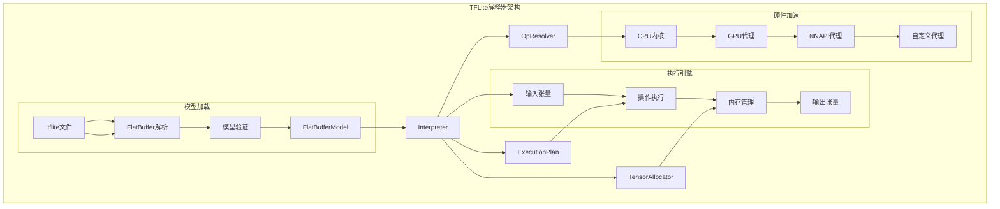
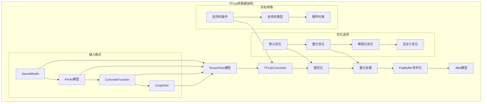
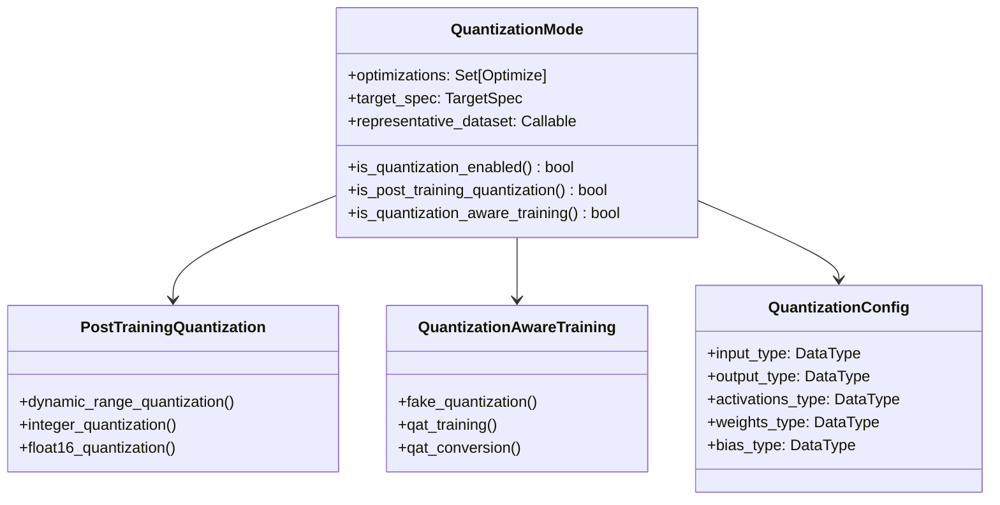
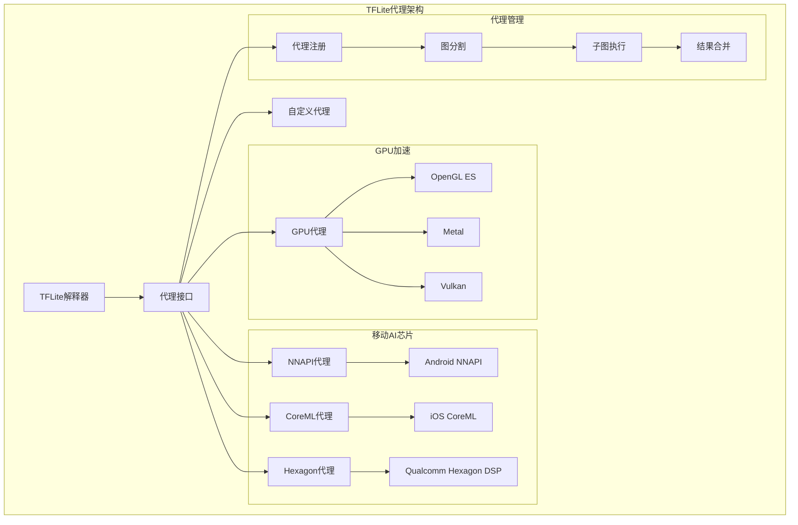
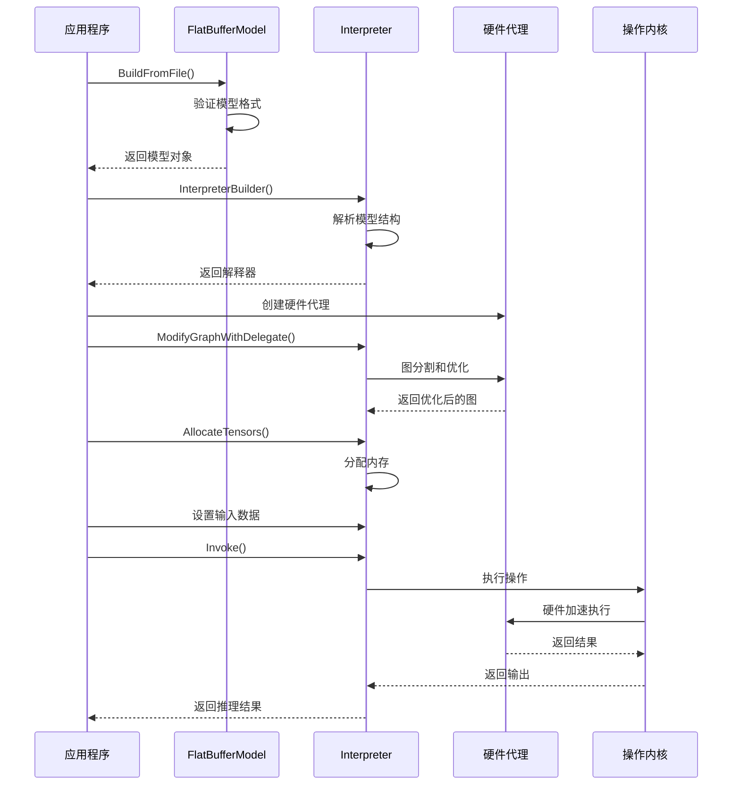
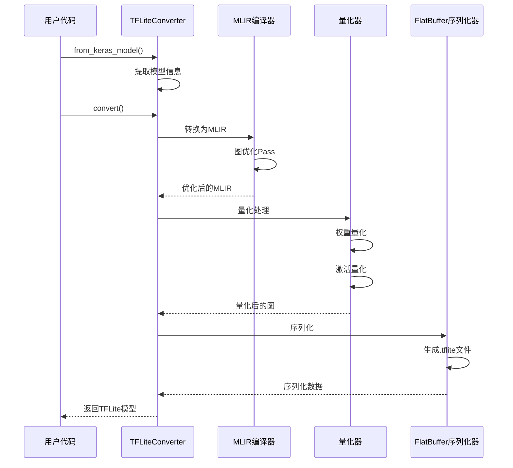

## 模块概述

TensorFlow Lite是TensorFlow的轻量级解决方案，专为移动设备和嵌入式设备上的机器学习推理而设计。它提供了低延迟、小模型大小和低功耗的特性，适合在资源受限的环境中部署机器学习模型。

### 主要子模块结构

```
tensorflow/lite/
├── core/                   # 核心运行时
│   ├── interpreter.h/cc       # 解释器实现
│   ├── model.h/cc            # 模型加载器
│   ├── kernels/              # 内核实现
│   └── c/                    # C API接口
├── python/                 # Python接口
│   ├── interpreter.py        # Python解释器
│   ├── lite.py              # 转换器实现
│   └── convert.py           # 转换逻辑
├── java/                   # Java/Android接口
│   └── src/main/java/org/tensorflow/lite/
├── swift/                  # Swift/iOS接口
│   └── Sources/
├── delegates/              # 硬件代理
│   ├── gpu/                 # GPU代理
│   ├── nnapi/              # Android NNAPI
│   ├── coreml/             # iOS CoreML
│   └── hexagon/            # Qualcomm Hexagon
├── tools/                  # 工具集
│   ├── benchmark/           # 性能基准测试
│   ├── optimize/           # 模型优化
│   └── visualize/          # 模型可视化
├── examples/               # 示例代码
│   ├── minimal/            # 最小示例
│   ├── label_image/        # 图像分类
│   └── android/            # Android示例
└── experimental/           # 实验性功能
    ├── acceleration/        # 加速服务
    └── microfrontend/      # 微前端
```

## TFLite解释器

### 1. 解释器架构



### 2. Interpreter类实现

```cpp
// tensorflow/lite/core/interpreter.h
namespace tflite {

/**

 * TensorFlow Lite解释器类

 *

 * 功能说明:
 * - 加载和执行TFLite模型
 * - 管理张量内存分配
 * - 提供推理接口
 * - 支持硬件加速

 */
class Interpreter {
public:
    /**

     * 构造函数
     * @param error_reporter 错误报告器
     */
    explicit Interpreter(ErrorReporter* error_reporter = DefaultErrorReporter());
    
    /**
     * 析构函数 - 清理资源
     */
    ~Interpreter();
    
    /**
     * 设置输入数量
     * @param inputs 输入张量索引列表
     * @return 设置状态
     */
    TfLiteStatus SetInputs(std::vector<int> inputs);
    
    /**
     * 设置输出数量
     * @param outputs 输出张量索引列表
     * @return 设置状态
     */
    TfLiteStatus SetOutputs(std::vector<int> outputs);
    
    /**
     * 设置变量数量
     * @param variables 变量张量索引列表
     * @return 设置状态
     */
    TfLiteStatus SetVariables(std::vector<int> variables);
    
    /**
     * 分配张量内存
     * @return 分配状态
     *
     * 功能说明:
     * - 根据模型定义分配内存
     * - 优化内存布局
     * - 支持动态形状
     */
    TfLiteStatus AllocateTensors();
    
    /**
     * 执行推理
     * @return 执行状态
     *
     * 功能说明:
     * - 按执行计划运行操作
     * - 处理输入输出数据
     * - 调用硬件加速器
     */
    TfLiteStatus Invoke();
    
    /**
     * 获取输入张量数量
     * @return 输入张量数量
     */
    size_t inputs_size() const { return inputs_.size(); }
    
    /**
     * 获取输出张量数量
     * @return 输出张量数量
     */
    size_t outputs_size() const { return outputs_.size(); }
    
    /**
     * 获取输入张量索引
     * @param input_index 输入索引
     * @return 张量索引
     */
    int inputs(int input_index) const {
        return inputs_[input_index];
    }
    
    /**
     * 获取输出张量索引
     * @param output_index 输出索引
     * @return 张量索引
     */
    int outputs(int output_index) const {
        return outputs_[output_index];
    }
    
    /**
     * 获取张量数量
     * @return 张量总数
     */
    size_t tensors_size() const { return tensors_.size(); }
    
    /**
     * 获取张量对象
     * @param tensor_index 张量索引
     * @return 张量指针
     */
    TfLiteTensor* tensor(int tensor_index) {
        if (tensor_index < 0 || tensor_index >= tensors_size()) {
            return nullptr;
        }
        return &tensors_[tensor_index];
    }
    
    /**
     * 获取类型化输入张量
     * @param input_index 输入索引
     * @return 类型化张量指针
     */
    template <class T>
    T* typed_input_tensor(int input_index) {
        int tensor_index = inputs_[input_index];
        TfLiteTensor* tensor_ptr = tensor(tensor_index);
        return tensor_ptr ? reinterpret_cast<T*>(tensor_ptr->data.raw) : nullptr;
    }
    
    /**
     * 获取类型化输出张量
     * @param output_index 输出索引
     * @return 类型化张量指针
     */
    template <class T>
    T* typed_output_tensor(int output_index) {
        int tensor_index = outputs_[output_index];
        TfLiteTensor* tensor_ptr = tensor(tensor_index);
        return tensor_ptr ? reinterpret_cast<T*>(tensor_ptr->data.raw) : nullptr;
    }
    
    /**
     * 调整张量大小
     * @param tensor_index 张量索引
     * @param dims 新的维度
     * @return 调整状态
     */
    TfLiteStatus ResizeInputTensor(int tensor_index, std::vector<int> dims);
    
    /**
     * 添加节点和注册
     * @param builtin_code 内置操作码
     * @param custom_code 自定义操作码
     * @param version 操作版本
     * @return 节点索引
     */
    int AddNodeWithParameters(const std::vector<int>& inputs,
                              const std::vector<int>& outputs,
                              const char* init_data,
                              size_t init_data_size,
                              void* builtin_data,
                              const TfLiteRegistration* registration);
    
    /**
     * 设置线程数
     * @param num_threads 线程数量
     * @return 设置状态
     */
    TfLiteStatus SetNumThreads(int num_threads);
    
    /**
     * 使用NNAPI代理
     * @param use_nnapi 是否使用NNAPI
     * @return 设置状态
     */
    TfLiteStatus UseNNAPI(bool use_nnapi);
    
    /**
     * 修改图以使用代理
     * @param delegate 代理对象
     * @return 修改状态
     */
    TfLiteStatus ModifyGraphWithDelegate(TfLiteDelegate* delegate);

private:
    /**

     * 执行计划准备
     * @return 准备状态
     */
    TfLiteStatus PrepareOpsStartingAt(int first_execution_plan_index,
                                      const std::vector<int>& execution_plan,
                                      int* last_execution_plan_index_prepared);
    
    /**
     * 调用操作
     * @param node 节点信息
     * @param registration 操作注册
     * @return 调用状态
     */
    TfLiteStatus Invoke(const TfLiteNode& node,
                        const TfLiteRegistration& registration);
    
    // 成员变量
    std::unique_ptr<MemoryArena> arena_;        // 内存分配器
    std::vector<TfLiteTensor> tensors_;         // 张量数组
    std::vector<TfLiteNode> nodes_;             // 节点数组
    std::vector<int> inputs_;                   // 输入索引
    std::vector<int> outputs_;                  // 输出索引
    std::vector<int> variables_;                // 变量索引
    std::vector<int> execution_plan_;           // 执行计划
    ErrorReporter* error_reporter_;             // 错误报告器
    bool allow_fp32_relax_to_fp16_;            // 允许FP32降级到FP16
    bool has_dynamic_tensors_;                  // 是否有动态张量
    std::vector<std::unique_ptr<TfLiteDelegate, void(*)(TfLiteDelegate*)>> owned_delegates_;

};

} // namespace tflite
```

### 3. 基础使用示例

```cpp
// TFLite基础使用示例
void BasicTFLiteExample() {
    /**

     * TensorFlow Lite基础使用示例
     *
     * 功能说明:
     * - 加载TFLite模型
     * - 设置输入数据
     * - 执行推理
     * - 获取输出结果
     */
    
    // 1. 加载模型
    std::unique_ptr<tflite::FlatBufferModel> model =
        tflite::FlatBufferModel::BuildFromFile("model.tflite");
    
    if (!model) {
        std::cerr << "Failed to load model" << std::endl;
        return;
    }
    
    // 2. 创建操作解析器
    tflite::ops::builtin::BuiltinOpResolver resolver;
    
    // 3. 构建解释器
    std::unique_ptr<tflite::Interpreter> interpreter;
    tflite::InterpreterBuilder builder(*model, resolver);
    builder(&interpreter);
    
    if (!interpreter) {
        std::cerr << "Failed to create interpreter" << std::endl;
        return;
    }
    
    // 4. 分配张量内存
    if (interpreter->AllocateTensors() != kTfLiteOk) {
        std::cerr << "Failed to allocate tensors" << std::endl;
        return;
    }
    
    // 5. 获取输入张量信息
    int input_index = interpreter->inputs()[0];
    TfLiteTensor* input_tensor = interpreter->tensor(input_index);
    
    std::cout << "Input tensor info:" << std::endl;
    std::cout << "  Name: " << input_tensor->name << std::endl;
    std::cout << "  Type: " << TfLiteTypeGetName(input_tensor->type) << std::endl;
    std::cout << "  Dims: ";
    for (int i = 0; i < input_tensor->dims->size; ++i) {
        std::cout << input_tensor->dims->data[i] << " ";
    }
    std::cout << std::endl;
    
    // 6. 设置输入数据
    float* input_data = interpreter->typed_input_tensor<float>(0);
    if (input_data) {
        // 填充输入数据 (这里使用随机数据作为示例)
        int input_size = 1;
        for (int i = 0; i < input_tensor->dims->size; ++i) {
            input_size *= input_tensor->dims->data[i];
        }
        
        for (int i = 0; i < input_size; ++i) {
            input_data[i] = static_cast<float>(rand()) / RAND_MAX;
        }
    }
    
    // 7. 执行推理
    auto start_time = std::chrono::high_resolution_clock::now();
    
    if (interpreter->Invoke() != kTfLiteOk) {
        std::cerr << "Failed to invoke interpreter" << std::endl;
        return;
    }
    
    auto end_time = std::chrono::high_resolution_clock::now();
    auto duration = std::chrono::duration_cast<std::chrono::microseconds>(
        end_time - start_time);
    
    std::cout << "Inference time: " << duration.count() << " microseconds" << std::endl;
    
    // 8. 获取输出结果
    int output_index = interpreter->outputs()[0];
    TfLiteTensor* output_tensor = interpreter->tensor(output_index);
    float* output_data = interpreter->typed_output_tensor<float>(0);
    
    std::cout << "Output tensor info:" << std::endl;
    std::cout << "  Name: " << output_tensor->name << std::endl;
    std::cout << "  Type: " << TfLiteTypeGetName(output_tensor->type) << std::endl;
    
    if (output_data) {
        int output_size = 1;
        for (int i = 0; i < output_tensor->dims->size; ++i) {
            output_size *= output_tensor->dims->data[i];
        }
        
        std::cout << "Output values: ";
        for (int i = 0; i < std::min(output_size, 10); ++i) {
            std::cout << output_data[i] << " ";
        }
        std::cout << std::endl;
    }

}
```

## 模型转换器

### 1. TFLiteConverter架构



### 2. TFLiteConverter类实现

```python
# tensorflow/lite/python/lite.py
class TFLiteConverterV2(TFLiteFrozenGraphConverterV2):
    """TensorFlow Lite转换器V2版本
    
    功能说明:

    - 将TensorFlow模型转换为TFLite格式
    - 支持多种输入格式
    - 提供丰富的优化选项
    - 支持量化和稀疏化
    """
    
    def __init__(self, funcs, trackable_obj=None):
        """
        构造函数
        
        参数:
            funcs: 要转换的函数列表
            trackable_obj: 可跟踪对象(如Keras模型)
        """
        super(TFLiteConverterV2, self).__init__(funcs, trackable_obj)
        
        # 优化选项
        self.optimizations = None  # 优化类型集合
        self.representative_dataset = None  # 代表性数据集
        self.target_spec = None  # 目标规格
        
        # 数据类型选项
        self.inference_input_type = dtypes.float32  # 推理输入类型
        self.inference_output_type = dtypes.float32  # 推理输出类型
        
        # 转换选项
        self.allow_custom_ops = False  # 是否允许自定义操作
        self.exclude_conversion_metadata = False  # 是否排除转换元数据
        
        # 实验性选项
        self.experimental_new_converter = True  # 使用新转换器
        self.experimental_new_quantizer = True  # 使用新量化器
        self.experimental_enable_resource_variables = True  # 启用资源变量
    
    @classmethod
    def from_saved_model(cls, saved_model_dir, signature_keys=None, tags=None):
        """
        从SavedModel创建转换器
        
        参数:
            saved_model_dir: SavedModel目录路径
            signature_keys: 签名键列表
            tags: 标签集合
            
        返回:
            TFLiteConverter实例
        """
        # 加载SavedModel
        saved_model = load.load(saved_model_dir, tags)
        
        # 获取ConcreteFunction
        if signature_keys:
            funcs = []
            for signature_key in signature_keys:
                if signature_key in saved_model.signatures:
                    funcs.append(saved_model.signatures[signature_key])
        else:
            # 使用默认签名
            funcs = [saved_model.signatures[signature_constants.DEFAULT_SERVING_SIGNATURE_DEF_KEY]]
        
        return cls(funcs, saved_model)
    
    @classmethod
    def from_keras_model(cls, model):
        """
        从Keras模型创建转换器
        
        参数:
            model: Keras模型实例
            
        返回:
            TFLiteConverter实例
        """
        # 获取ConcreteFunction
        if hasattr(model, 'save_spec'):
            # 使用保存规格
            funcs = [model.save_spec]
        else:
            # 创建ConcreteFunction
            input_signature = []
            for input_spec in model.inputs:
                input_signature.append(tensor_spec.TensorSpec(
                    shape=input_spec.shape,
                    dtype=input_spec.dtype,
                    name=input_spec.name
                ))
            
            concrete_func = model.__call__.get_concrete_function(input_signature)
            funcs = [concrete_func]
        
        return cls(funcs, model)
    
    @classmethod
    def from_concrete_functions(cls, funcs, trackable_obj=None):
        """
        从ConcreteFunction创建转换器
        
        参数:
            funcs: ConcreteFunction列表
            trackable_obj: 可跟踪对象
            
        返回:
            TFLiteConverter实例
        """
        return cls(funcs, trackable_obj)
    
    def convert(self):
        """
        执行模型转换
        
        返回:
            序列化的TFLite模型数据
            
        功能说明:
        - 执行图优化
        - 应用量化
        - 生成FlatBuffer
        """
        # 验证输入
        if not self._funcs:
            raise ValueError("No functions to convert")
        
        # 创建量化模式
        quant_mode = QuantizationMode(
            optimizations=self.optimizations,
            target_spec=self.target_spec,
            representative_dataset=self.representative_dataset
        )
        
        # 转换为MLIR
        mlir_data = self._convert_to_mlir()
        
        # 优化MLIR
        optimized_mlir = self._optimize_mlir(mlir_data, quant_mode)
        
        # 转换为TFLite
        tflite_model = self._convert_to_tflite(optimized_mlir, quant_mode)
        
        return tflite_model
    
    def _convert_to_mlir(self):
        """
        转换为MLIR表示
        
        返回:
            MLIR数据
        """
        # 获取GraphDef
        graph_def, input_tensors, output_tensors = (
            self._get_graph_def_and_tensors())
        
        # 转换为MLIR
        mlir_data = convert_graphdef_to_mlir(
            graph_def=graph_def,
            input_tensors=input_tensors,
            output_tensors=output_tensors,
            control_output_arrays=[]
        )
        
        return mlir_data
    
    def _optimize_mlir(self, mlir_data, quant_mode):
        """
        优化MLIR表示
        
        参数:
            mlir_data: MLIR数据
            quant_mode: 量化模式
            
        返回:
            优化后的MLIR数据
        """
        # 应用TF到TFLite的转换Pass
        optimized_mlir = run_pass_pipeline(
            mlir_data,
            "tf-to-tflite-pipeline",
            enable_quantization=quant_mode.is_quantization_enabled(),
            enable_sparsification=self._should_sparsify()
        )
        
        return optimized_mlir
    
    def _convert_to_tflite(self, mlir_data, quant_mode):
        """
        转换为TFLite格式
        
        参数:
            mlir_data: MLIR数据
            quant_mode: 量化模式
            
        返回:
            TFLite模型数据
        """
        # 转换为FlatBuffer
        tflite_model = convert_mlir_to_tflite(
            mlir_data,
            enable_quantization=quant_mode.is_quantization_enabled(),
            inference_input_type=self.inference_input_type,
            inference_output_type=self.inference_output_type,
            allow_custom_ops=self.allow_custom_ops
        )
        
        return tflite_model

```

### 3. 转换使用示例

```python
# TFLite转换使用示例
def conversion_examples():
    """
    TensorFlow Lite转换示例
    
    功能说明:

    - 演示不同的转换方式
    - 展示优化选项
    - 说明量化配置
    """
    
    # 1. 从Keras模型转换
    def convert_keras_model():
        # 创建简单的Keras模型
        model = tf.keras.Sequential([
            tf.keras.layers.Dense(128, activation='relu', input_shape=(784,)),
            tf.keras.layers.Dropout(0.2),
            tf.keras.layers.Dense(10, activation='softmax')
        ])
        
        # 编译模型
        model.compile(optimizer='adam',
                      loss='sparse_categorical_crossentropy',
                      metrics=['accuracy'])
        
        # 创建转换器
        converter = tf.lite.TFLiteConverter.from_keras_model(model)
        
        # 基础转换
        tflite_model = converter.convert()
        
        # 保存模型
        with open('model.tflite', 'wb') as f:
            f.write(tflite_model)
        
        print(f"Keras模型转换完成，大小: {len(tflite_model)} bytes")
    
    # 2. 从SavedModel转换
    def convert_saved_model():
        # 假设已有SavedModel
        saved_model_dir = '/path/to/saved_model'
        
        # 创建转换器
        converter = tf.lite.TFLiteConverter.from_saved_model(saved_model_dir)
        
        # 设置优化选项
        converter.optimizations = [tf.lite.Optimize.DEFAULT]
        
        # 转换
        tflite_model = converter.convert()
        
        # 保存模型
        with open('saved_model.tflite', 'wb') as f:
            f.write(tflite_model)
        
        print(f"SavedModel转换完成，大小: {len(tflite_model)} bytes")
    
    # 3. 量化转换
    def convert_with_quantization():
        # 创建模型
        model = tf.keras.applications.MobileNetV2(
            weights='imagenet',
            input_shape=(224, 224, 3)
        )
        
        # 创建转换器
        converter = tf.lite.TFLiteConverter.from_keras_model(model)
        
        # 设置优化选项
        converter.optimizations = [tf.lite.Optimize.DEFAULT]
        
        # 创建代表性数据集
        def representative_dataset():
            for _ in range(100):
                # 生成随机输入数据
                data = np.random.random((1, 224, 224, 3)).astype(np.float32)
                yield [data]
        
        # 设置代表性数据集
        converter.representative_dataset = representative_dataset
        
        # 设置目标规格
        converter.target_spec.supported_ops = [tf.lite.OpsSet.TFLITE_BUILTINS_INT8]
        converter.inference_input_type = tf.int8
        converter.inference_output_type = tf.int8
        
        # 转换
        quantized_model = converter.convert()
        
        # 保存量化模型
        with open('quantized_model.tflite', 'wb') as f:
            f.write(quantized_model)
        
        print(f"量化模型转换完成，大小: {len(quantized_model)} bytes")
        
        # 比较模型大小
        converter_fp32 = tf.lite.TFLiteConverter.from_keras_model(model)
        fp32_model = converter_fp32.convert()
        
        print(f"FP32模型大小: {len(fp32_model)} bytes")
        print(f"INT8模型大小: {len(quantized_model)} bytes")
        print(f"压缩比: {len(fp32_model) / len(quantized_model):.2f}x")
    
    # 4. 自定义操作转换
    def convert_with_custom_ops():
        # 创建包含自定义操作的模型
        @tf.function
        def custom_model(x):
            # 使用一些可能不被TFLite支持的操作
            y = tf.nn.l2_normalize(x, axis=-1)
            z = tf.nn.top_k(y, k=5)
            return z.values
        
        # 创建ConcreteFunction
        concrete_func = custom_model.get_concrete_function(
            tf.TensorSpec(shape=[None, 1000], dtype=tf.float32))
        
        # 创建转换器
        converter = tf.lite.TFLiteConverter.from_concrete_functions([concrete_func])
        
        # 允许自定义操作
        converter.allow_custom_ops = True
        
        # 转换
        try:
            custom_model_tflite = converter.convert()
            print(f"自定义操作模型转换完成，大小: {len(custom_model_tflite)} bytes")
        except Exception as e:
            print(f"转换失败: {e}")
    
    # 执行示例
    convert_keras_model()
    convert_saved_model()
    convert_with_quantization()
    convert_with_custom_ops()

```

## 量化系统

### 1. 量化类型和策略



### 2. 量化实现

```python
# 量化实现示例
class QuantizationHelper:
    """
    TensorFlow Lite量化辅助类
    
    功能说明:

    - 提供各种量化方法
    - 支持不同的量化策略
    - 优化模型大小和性能
    """
    
    @staticmethod
    def dynamic_range_quantization(model):
        """
        动态范围量化
        
        参数:
            model: 输入模型
            
        返回:
            量化后的模型
            
        功能说明:
        - 仅量化权重为INT8
        - 激活保持FP32
        - 减少模型大小约4倍
        - 推理时动态计算激活范围
        """
        converter = tf.lite.TFLiteConverter.from_keras_model(model)
        
        # 启用默认优化(包括动态范围量化)
        converter.optimizations = [tf.lite.Optimize.DEFAULT]
        
        # 转换
        quantized_model = converter.convert()
        
        return quantized_model
    
    @staticmethod
    def integer_quantization(model, representative_dataset):
        """
        整数量化
        
        参数:
            model: 输入模型
            representative_dataset: 代表性数据集
            
        返回:
            量化后的模型
            
        功能说明:
        - 权重和激活都量化为INT8
        - 需要代表性数据集校准
        - 最大程度减少模型大小
        - 可能有精度损失
        """
        converter = tf.lite.TFLiteConverter.from_keras_model(model)
        
        # 设置优化选项
        converter.optimizations = [tf.lite.Optimize.DEFAULT]
        
        # 设置代表性数据集
        converter.representative_dataset = representative_dataset
        
        # 强制使用整数量化
        converter.target_spec.supported_ops = [tf.lite.OpsSet.TFLITE_BUILTINS_INT8]
        converter.inference_input_type = tf.int8
        converter.inference_output_type = tf.int8
        
        # 转换
        quantized_model = converter.convert()
        
        return quantized_model
    
    @staticmethod
    def float16_quantization(model):
        """
        Float16量化
        
        参数:
            model: 输入模型
            
        返回:
            量化后的模型
            
        功能说明:
        - 将FP32权重量化为FP16
        - 保持较高精度
        - 减少模型大小约2倍
        - 在支持FP16的硬件上加速
        """
        converter = tf.lite.TFLiteConverter.from_keras_model(model)
        
        # 启用Float16量化
        converter.optimizations = [tf.lite.Optimize.DEFAULT]
        converter.target_spec.supported_types = [tf.float16]
        
        # 转换
        quantized_model = converter.convert()
        
        return quantized_model
    
    @staticmethod
    def mixed_precision_quantization(model, representative_dataset):
        """
        混合精度量化
        
        参数:
            model: 输入模型
            representative_dataset: 代表性数据集
            
        返回:
            量化后的模型
            
        功能说明:
        - 部分层使用INT8，部分层使用FP32
        - 平衡精度和性能
        - 自动选择最佳量化策略
        """
        converter = tf.lite.TFLiteConverter.from_keras_model(model)
        
        # 设置优化选项
        converter.optimizations = [tf.lite.Optimize.DEFAULT]
        converter.representative_dataset = representative_dataset
        
        # 允许混合精度
        converter.target_spec.supported_ops = [
            tf.lite.OpsSet.TFLITE_BUILTINS,
            tf.lite.OpsSet.TFLITE_BUILTINS_INT8
        ]
        
        # 转换
        quantized_model = converter.convert()
        
        return quantized_model
    
    @staticmethod
    def evaluate_quantization_impact(original_model, quantized_model, test_data):
        """
        评估量化影响
        
        参数:
            original_model: 原始模型
            quantized_model: 量化模型
            test_data: 测试数据
            
        返回:
            评估结果字典
        """
        # 加载量化模型
        interpreter = tf.lite.Interpreter(model_content=quantized_model)
        interpreter.allocate_tensors()
        
        # 获取输入输出详情
        input_details = interpreter.get_input_details()
        output_details = interpreter.get_output_details()
        
        # 测试数据
        test_images, test_labels = test_data
        
        # 原始模型预测
        original_predictions = original_model.predict(test_images)
        original_accuracy = np.mean(
            np.argmax(original_predictions, axis=1) == test_labels)
        
        # 量化模型预测
        quantized_predictions = []
        for image in test_images:
            # 设置输入
            interpreter.set_tensor(input_details[0]['index'],
                                 np.expand_dims(image, axis=0).astype(input_details[0]['dtype']))
            
            # 执行推理
            interpreter.invoke()
            
            # 获取输出
            output = interpreter.get_tensor(output_details[0]['index'])
            quantized_predictions.append(output[0])
        
        quantized_predictions = np.array(quantized_predictions)
        quantized_accuracy = np.mean(
            np.argmax(quantized_predictions, axis=1) == test_labels)
        
        # 计算模型大小
        original_size = len(tf.lite.TFLiteConverter.from_keras_model(original_model).convert())
        quantized_size = len(quantized_model)
        
        return {
            'original_accuracy': original_accuracy,
            'quantized_accuracy': quantized_accuracy,
            'accuracy_drop': original_accuracy - quantized_accuracy,
            'original_size': original_size,
            'quantized_size': quantized_size,
            'compression_ratio': original_size / quantized_size
        }

# 量化使用示例
def quantization_example():
    """量化使用示例"""
    
    # 创建示例模型
    model = tf.keras.Sequential([
        tf.keras.layers.Conv2D(32, 3, activation='relu', input_shape=(28, 28, 1)),
        tf.keras.layers.MaxPooling2D(),
        tf.keras.layers.Conv2D(64, 3, activation='relu'),
        tf.keras.layers.MaxPooling2D(),
        tf.keras.layers.Flatten(),
        tf.keras.layers.Dense(64, activation='relu'),
        tf.keras.layers.Dense(10, activation='softmax')
    ])
    
    # 创建代表性数据集
    def representative_dataset():
        for _ in range(100):
            data = np.random.random((1, 28, 28, 1)).astype(np.float32)
            yield [data]
    
    # 创建量化辅助器
    quantizer = QuantizationHelper()
    
    # 1. 动态范围量化
    dynamic_model = quantizer.dynamic_range_quantization(model)
    print(f"动态范围量化模型大小: {len(dynamic_model)} bytes")
    
    # 2. 整数量化
    integer_model = quantizer.integer_quantization(model, representative_dataset)
    print(f"整数量化模型大小: {len(integer_model)} bytes")
    
    # 3. Float16量化
    float16_model = quantizer.float16_quantization(model)
    print(f"Float16量化模型大小: {len(float16_model)} bytes")
    
    # 4. 混合精度量化
    mixed_model = quantizer.mixed_precision_quantization(model, representative_dataset)
    print(f"混合精度量化模型大小: {len(mixed_model)} bytes")
```

## 代理和加速

### 1. 硬件代理架构



### 2. GPU代理实现

```cpp
// GPU代理使用示例
class GPUDelegateHelper {
public:
    /**

     * GPU代理辅助类
     *
     * 功能说明:
     * - 创建和配置GPU代理
     * - 管理GPU内存
     * - 优化GPU执行
     */
    
    /**
     * 创建GPU代理
     * @param precision 精度设置
     * @param enable_quantization 是否启用量化
     * @return GPU代理指针
     */
    static TfLiteDelegate* CreateGPUDelegate(
        TfLiteGpuDelegatePrecision precision = TFLITE_GPU_PRECISION_DEFAULT,
        bool enable_quantization = false) {
        
        // 创建GPU代理选项
        TfLiteGpuDelegateOptionsV2 options = TfLiteGpuDelegateOptionsV2Default();
        
        // 设置精度
        options.inference_precision = precision;
        
        // 设置量化支持
        options.enable_quantization = enable_quantization;
        
        // 设置内存策略
        options.experimental_flags = TFLITE_GPU_EXPERIMENTAL_FLAGS_NONE;
        
        // 创建代理
        return TfLiteGpuDelegateV2Create(&options);
    }
    
    /**
     * 使用GPU代理的推理示例
     */
    static void InferenceWithGPU(const std::string& model_path) {
        // 加载模型
        std::unique_ptr<tflite::FlatBufferModel> model =
            tflite::FlatBufferModel::BuildFromFile(model_path.c_str());
        
        if (!model) {
            std::cerr << "Failed to load model" << std::endl;
            return;
        }
        
        // 创建解释器
        tflite::ops::builtin::BuiltinOpResolver resolver;
        std::unique_ptr<tflite::Interpreter> interpreter;
        tflite::InterpreterBuilder(*model, resolver)(&interpreter);
        
        if (!interpreter) {
            std::cerr << "Failed to create interpreter" << std::endl;
            return;
        }
        
        // 创建GPU代理
        TfLiteDelegate* gpu_delegate = CreateGPUDelegate(
            TFLITE_GPU_PRECISION_FLOAT16, true);
        
        if (!gpu_delegate) {
            std::cerr << "Failed to create GPU delegate" << std::endl;
            return;
        }
        
        // 应用GPU代理
        if (interpreter->ModifyGraphWithDelegate(gpu_delegate) != kTfLiteOk) {
            std::cerr << "Failed to apply GPU delegate" << std::endl;
            TfLiteGpuDelegateV2Delete(gpu_delegate);
            return;
        }
        
        // 分配张量
        if (interpreter->AllocateTensors() != kTfLiteOk) {
            std::cerr << "Failed to allocate tensors" << std::endl;
            TfLiteGpuDelegateV2Delete(gpu_delegate);
            return;
        }
        
        // 设置输入数据
        float* input_data = interpreter->typed_input_tensor<float>(0);
        if (input_data) {
            // 填充输入数据
            TfLiteTensor* input_tensor = interpreter->tensor(interpreter->inputs()[0]);
            int input_size = 1;
            for (int i = 0; i < input_tensor->dims->size; ++i) {
                input_size *= input_tensor->dims->data[i];
            }
            
            for (int i = 0; i < input_size; ++i) {
                input_data[i] = static_cast<float>(rand()) / RAND_MAX;
            }
        }
        
        // 执行推理
        auto start_time = std::chrono::high_resolution_clock::now();
        
        if (interpreter->Invoke() != kTfLiteOk) {
            std::cerr << "Failed to invoke interpreter" << std::endl;
            TfLiteGpuDelegateV2Delete(gpu_delegate);
            return;
        }
        
        auto end_time = std::chrono::high_resolution_clock::now();
        auto duration = std::chrono::duration_cast<std::chrono::microseconds>(
            end_time - start_time);
        
        std::cout << "GPU inference time: " << duration.count() << " microseconds" << std::endl;
        
        // 获取输出
        float* output_data = interpreter->typed_output_tensor<float>(0);
        if (output_data) {
            TfLiteTensor* output_tensor = interpreter->tensor(interpreter->outputs()[0]);
            int output_size = 1;
            for (int i = 0; i < output_tensor->dims->size; ++i) {
                output_size *= output_tensor->dims->data[i];
            }
            
            std::cout << "GPU inference output: ";
            for (int i = 0; i < std::min(output_size, 5); ++i) {
                std::cout << output_data[i] << " ";
            }
            std::cout << std::endl;
        }
        
        // 清理GPU代理
        TfLiteGpuDelegateV2Delete(gpu_delegate);
    }

};
```

### 3. NNAPI代理实现

```cpp
// NNAPI代理使用示例
class NNAPIDelegateHelper {
public:
    /**

     * NNAPI代理辅助类
     *
     * 功能说明:
     * - 使用Android NNAPI加速
     * - 支持多种AI芯片
     * - 自动设备选择
     */
    
    /**
     * 创建NNAPI代理
     * @param accelerator_name 加速器名称
     * @param cache_dir 缓存目录
     * @return NNAPI代理指针
     */
    static TfLiteDelegate* CreateNNAPIDelegate(
        const char* accelerator_name = nullptr,
        const char* cache_dir = nullptr) {
        
        // 创建NNAPI代理选项
        tflite::StatefulNnApiDelegate::Options options;
        
        // 设置加速器
        if (accelerator_name) {
            options.accelerator_name = accelerator_name;
        }
        
        // 设置缓存目录
        if (cache_dir) {
            options.cache_dir = cache_dir;
        }
        
        // 设置其他选项
        options.allow_fp16 = true;  // 允许FP16精度
        options.use_burst_computation = true;  // 使用突发计算
        
        // 创建代理
        return new tflite::StatefulNnApiDelegate(options);
    }
    
    /**
     * 使用NNAPI代理的推理示例
     */
    static void InferenceWithNNAPI(const std::string& model_path) {
        // 加载模型
        std::unique_ptr<tflite::FlatBufferModel> model =
            tflite::FlatBufferModel::BuildFromFile(model_path.c_str());
        
        if (!model) {
            std::cerr << "Failed to load model" << std::endl;
            return;
        }
        
        // 创建解释器
        tflite::ops::builtin::BuiltinOpResolver resolver;
        std::unique_ptr<tflite::Interpreter> interpreter;
        tflite::InterpreterBuilder(*model, resolver)(&interpreter);
        
        if (!interpreter) {
            std::cerr << "Failed to create interpreter" << std::endl;
            return;
        }
        
        // 创建NNAPI代理
        TfLiteDelegate* nnapi_delegate = CreateNNAPIDelegate();
        
        if (!nnapi_delegate) {
            std::cerr << "Failed to create NNAPI delegate" << std::endl;
            return;
        }
        
        // 应用NNAPI代理
        if (interpreter->ModifyGraphWithDelegate(nnapi_delegate) != kTfLiteOk) {
            std::cerr << "Failed to apply NNAPI delegate" << std::endl;
            delete nnapi_delegate;
            return;
        }
        
        // 分配张量
        if (interpreter->AllocateTensors() != kTfLiteOk) {
            std::cerr << "Failed to allocate tensors" << std::endl;
            delete nnapi_delegate;
            return;
        }
        
        // 执行推理 (类似GPU代理的推理过程)
        // ... 推理代码 ...
        
        std::cout << "NNAPI inference completed" << std::endl;
        
        // 清理NNAPI代理
        delete nnapi_delegate;
    }

};
```

## 多平台支持

### 1. 平台特定实现

```python
# 多平台支持示例
class MultiPlatformTFLite:
    """
    多平台TensorFlow Lite支持
    
    功能说明:

    - 支持Android、iOS、Linux等平台
    - 自动选择最佳加速方案
    - 提供统一的API接口
    """
    
    def __init__(self, model_path):
        """
        初始化多平台TFLite
        
        参数:
            model_path: 模型文件路径
        """
        self.model_path = model_path
        self.interpreter = None
        self.delegate = None
        self.platform = self._detect_platform()
        
    def _detect_platform(self):
        """检测运行平台"""
        import platform
        system = platform.system().lower()
        
        if system == 'android':
            return 'android'
        elif system == 'darwin':
            # 进一步检测是否为iOS
            if 'iphone' in platform.platform().lower():
                return 'ios'
            else:
                return 'macos'
        elif system == 'linux':
            return 'linux'
        elif system == 'windows':
            return 'windows'
        else:
            return 'unknown'
    
    def initialize(self, use_acceleration=True):
        """
        初始化解释器
        
        参数:
            use_acceleration: 是否使用硬件加速
        """
        # 加载模型
        self.interpreter = tf.lite.Interpreter(model_path=self.model_path)
        
        # 根据平台选择加速方案
        if use_acceleration:
            self._setup_acceleration()
        
        # 分配张量
        self.interpreter.allocate_tensors()
        
        print(f"TFLite initialized on {self.platform} platform")
    
    def _setup_acceleration(self):
        """设置硬件加速"""
        try:
            if self.platform == 'android':
                # Android平台使用NNAPI
                self._setup_nnapi()
            elif self.platform == 'ios':
                # iOS平台使用CoreML
                self._setup_coreml()
            elif self.platform in ['linux', 'macos', 'windows']:
                # 桌面平台使用GPU
                self._setup_gpu()
            else:
                print(f"No acceleration available for {self.platform}")
        except Exception as e:
            print(f"Failed to setup acceleration: {e}")
    
    def _setup_nnapi(self):
        """设置NNAPI加速"""
        try:
            import tensorflow.lite.python.interpreter as tflite_interpreter
            
            # 创建NNAPI代理
            nnapi_delegate = tflite_interpreter.load_delegate('libnnapi_delegate.so')
            
            # 重新创建带代理的解释器
            self.interpreter = tf.lite.Interpreter(
                model_path=self.model_path,
                experimental_delegates=[nnapi_delegate]
            )
            
            self.delegate = nnapi_delegate
            print("NNAPI acceleration enabled")
            
        except Exception as e:
            print(f"Failed to enable NNAPI: {e}")
    
    def _setup_coreml(self):
        """设置CoreML加速"""
        try:
            import tensorflow.lite.python.interpreter as tflite_interpreter
            
            # 创建CoreML代理
            coreml_delegate = tflite_interpreter.load_delegate('libcoreml_delegate.dylib')
            
            # 重新创建带代理的解释器
            self.interpreter = tf.lite.Interpreter(
                model_path=self.model_path,
                experimental_delegates=[coreml_delegate]
            )
            
            self.delegate = coreml_delegate
            print("CoreML acceleration enabled")
            
        except Exception as e:
            print(f"Failed to enable CoreML: {e}")
    
    def _setup_gpu(self):
        """设置GPU加速"""
        try:
            import tensorflow.lite.python.interpreter as tflite_interpreter
            
            # 创建GPU代理
            gpu_delegate = tflite_interpreter.load_delegate('libgpu_delegate.so')
            
            # 重新创建带代理的解释器
            self.interpreter = tf.lite.Interpreter(
                model_path=self.model_path,
                experimental_delegates=[gpu_delegate]
            )
            
            self.delegate = gpu_delegate
            print("GPU acceleration enabled")
            
        except Exception as e:
            print(f"Failed to enable GPU: {e}")
    
    def predict(self, input_data):
        """
        执行预测
        
        参数:
            input_data: 输入数据
            
        返回:
            预测结果
        """
        if self.interpreter is None:
            raise RuntimeError("Interpreter not initialized")
        
        # 获取输入输出详情
        input_details = self.interpreter.get_input_details()
        output_details = self.interpreter.get_output_details()
        
        # 设置输入数据
        self.interpreter.set_tensor(input_details[0]['index'], input_data)
        
        # 执行推理
        self.interpreter.invoke()
        
        # 获取输出数据
        output_data = self.interpreter.get_tensor(output_details[0]['index'])
        
        return output_data
    
    def benchmark(self, input_data, num_runs=100):
        """
        性能基准测试
        
        参数:
            input_data: 输入数据
            num_runs: 运行次数
            
        返回:
            性能统计信息
        """
        import time
        
        times = []
        
        # 预热
        for _ in range(10):
            self.predict(input_data)
        
        # 基准测试
        for _ in range(num_runs):
            start_time = time.time()
            self.predict(input_data)
            end_time = time.time()
            times.append((end_time - start_time) * 1000)  # 转换为毫秒
        
        # 计算统计信息
        avg_time = np.mean(times)
        min_time = np.min(times)
        max_time = np.max(times)
        std_time = np.std(times)
        
        return {
            'platform': self.platform,
            'acceleration': self.delegate is not None,
            'avg_time_ms': avg_time,
            'min_time_ms': min_time,
            'max_time_ms': max_time,
            'std_time_ms': std_time,
            'num_runs': num_runs
        }

# 使用示例
def multi_platform_example():
    """多平台使用示例"""
    
    # 创建多平台TFLite实例
    tflite_runner = MultiPlatformTFLite('model.tflite')
    
    # 初始化(自动选择加速方案)
    tflite_runner.initialize(use_acceleration=True)
    
    # 创建测试数据
    input_data = np.random.random((1, 224, 224, 3)).astype(np.float32)
    
    # 执行预测
    result = tflite_runner.predict(input_data)
    print(f"Prediction result shape: {result.shape}")
    
    # 性能基准测试
    benchmark_result = tflite_runner.benchmark(input_data, num_runs=100)
    
    print("Benchmark Results:")
    print(f"  Platform: {benchmark_result['platform']}")
    print(f"  Acceleration: {benchmark_result['acceleration']}")
    print(f"  Average time: {benchmark_result['avg_time_ms']:.2f} ms")
    print(f"  Min time: {benchmark_result['min_time_ms']:.2f} ms")
    print(f"  Max time: {benchmark_result['max_time_ms']:.2f} ms")
    print(f"  Std deviation: {benchmark_result['std_time_ms']:.2f} ms")
```

## 关键API调用链

### 1. TFLite推理流程



### 2. 模型转换流程



## 最佳实践

### 1. 模型优化策略

```python
# TFLite模型优化最佳实践
class TFLiteOptimizer:
    """
    TensorFlow Lite模型优化器
    
    功能说明:

    - 提供全面的优化策略
    - 平衡精度、大小和性能
    - 支持不同的部署场景
    """
    
    @staticmethod
    def optimize_for_mobile(model, target_platform='android'):
        """
        移动设备优化
        
        参数:
            model: 输入模型
            target_platform: 目标平台
            
        返回:
            优化后的模型
        """
        converter = tf.lite.TFLiteConverter.from_keras_model(model)
        
        # 基础优化
        converter.optimizations = [tf.lite.Optimize.DEFAULT]
        
        # 根据平台选择优化策略
        if target_platform == 'android':
            # Android优化：支持NNAPI
            converter.target_spec.supported_ops = [
                tf.lite.OpsSet.TFLITE_BUILTINS,
                tf.lite.OpsSet.SELECT_TF_OPS
            ]
        elif target_platform == 'ios':
            # iOS优化：支持CoreML
            converter.target_spec.supported_ops = [tf.lite.OpsSet.TFLITE_BUILTINS]
            converter.target_spec.supported_types = [tf.float16]
        
        # 转换
        optimized_model = converter.convert()
        
        return optimized_model
    
    @staticmethod
    def optimize_for_edge_device(model, memory_limit_mb=50):
        """
        边缘设备优化
        
        参数:
            model: 输入模型
            memory_limit_mb: 内存限制(MB)
            
        返回:
            优化后的模型
        """
        converter = tf.lite.TFLiteConverter.from_keras_model(model)
        
        # 激进的优化策略
        converter.optimizations = [tf.lite.Optimize.DEFAULT]
        
        # 创建代表性数据集
        def representative_dataset():
            for _ in range(100):
                # 根据模型输入形状生成数据
                input_shape = model.input_shape[1:]  # 去掉batch维度
                data = np.random.random((1,) + input_shape).astype(np.float32)
                yield [data]
        
        converter.representative_dataset = representative_dataset
        
        # 强制整数量化
        converter.target_spec.supported_ops = [tf.lite.OpsSet.TFLITE_BUILTINS_INT8]
        converter.inference_input_type = tf.int8
        converter.inference_output_type = tf.int8
        
        # 转换
        edge_model = converter.convert()
        
        # 检查模型大小
        model_size_mb = len(edge_model) / (1024 * 1024)
        if model_size_mb > memory_limit_mb:
            print(f"Warning: Model size ({model_size_mb:.2f}MB) exceeds limit ({memory_limit_mb}MB)")
        
        return edge_model
    
    @staticmethod
    def optimize_for_inference_speed(model):
        """
        推理速度优化
        
        参数:
            model: 输入模型
            
        返回:
            优化后的模型
        """
        converter = tf.lite.TFLiteConverter.from_keras_model(model)
        
        # 速度优先的优化
        converter.optimizations = [tf.lite.Optimize.DEFAULT]
        
        # 使用Float16以平衡速度和精度
        converter.target_spec.supported_types = [tf.float16]
        
        # 允许更多的操作类型以避免回退到CPU
        converter.target_spec.supported_ops = [
            tf.lite.OpsSet.TFLITE_BUILTINS,
            tf.lite.OpsSet.SELECT_TF_OPS
        ]
        
        # 转换
        speed_model = converter.convert()
        
        return speed_model
    
    @staticmethod
    def compare_optimization_strategies(model, test_data):
        """
        比较不同优化策略
        
        参数:
            model: 原始模型
            test_data: 测试数据
            
        返回:
            比较结果
        """
        optimizer = TFLiteOptimizer()
        
        # 不同优化策略
        strategies = {
            'mobile_android': lambda m: optimizer.optimize_for_mobile(m, 'android'),
            'mobile_ios': lambda m: optimizer.optimize_for_mobile(m, 'ios'),
            'edge_device': lambda m: optimizer.optimize_for_edge_device(m),
            'inference_speed': lambda m: optimizer.optimize_for_inference_speed(m)
        }
        
        results = {}
        
        for strategy_name, strategy_func in strategies.items():
            try:
                # 应用优化策略
                optimized_model = strategy_func(model)
                
                # 评估模型
                evaluation = TFLiteOptimizer._evaluate_model(
                    model, optimized_model, test_data)
                
                results[strategy_name] = evaluation
                
            except Exception as e:
                print(f"Failed to apply {strategy_name}: {e}")
                results[strategy_name] = None
        
        return results
    
    @staticmethod
    def _evaluate_model(original_model, tflite_model, test_data):
        """
        评估模型性能
        
        参数:
            original_model: 原始模型
            tflite_model: TFLite模型
            test_data: 测试数据
            
        返回:
            评估结果
        """
        import time
        
        # 加载TFLite模型
        interpreter = tf.lite.Interpreter(model_content=tflite_model)
        interpreter.allocate_tensors()
        
        input_details = interpreter.get_input_details()
        output_details = interpreter.get_output_details()
        
        test_images, test_labels = test_data
        
        # 原始模型预测
        original_start = time.time()
        original_predictions = original_model.predict(test_images)
        original_time = time.time() - original_start
        
        # TFLite模型预测
        tflite_predictions = []
        tflite_start = time.time()
        
        for image in test_images:
            interpreter.set_tensor(input_details[0]['index'],
                                 np.expand_dims(image, axis=0).astype(input_details[0]['dtype']))
            interpreter.invoke()
            output = interpreter.get_tensor(output_details[0]['index'])
            tflite_predictions.append(output[0])
        
        tflite_time = time.time() - tflite_start
        tflite_predictions = np.array(tflite_predictions)
        
        # 计算精度
        original_accuracy = np.mean(
            np.argmax(original_predictions, axis=1) == test_labels)
        tflite_accuracy = np.mean(
            np.argmax(tflite_predictions, axis=1) == test_labels)
        
        return {
            'model_size_bytes': len(tflite_model),
            'model_size_mb': len(tflite_model) / (1024 * 1024),
            'original_accuracy': original_accuracy,
            'tflite_accuracy': tflite_accuracy,
            'accuracy_drop': original_accuracy - tflite_accuracy,
            'original_inference_time': original_time,
            'tflite_inference_time': tflite_time,
            'speedup': original_time / tflite_time
        }

# 使用示例
def optimization_best_practices():
    """优化最佳实践示例"""
    
    # 创建示例模型
    model = tf.keras.applications.MobileNetV2(
        weights='imagenet',
        input_shape=(224, 224, 3),
        classes=1000
    )
    
    # 创建测试数据
    test_images = np.random.random((100, 224, 224, 3)).astype(np.float32)
    test_labels = np.random.randint(0, 1000, 100)
    test_data = (test_images, test_labels)
    
    # 比较不同优化策略
    optimizer = TFLiteOptimizer()
    comparison_results = optimizer.compare_optimization_strategies(model, test_data)
    
    # 打印比较结果
    print("Optimization Strategy Comparison:")
    print("-" * 80)
    
    for strategy, result in comparison_results.items():
        if result:
            print(f"\n{strategy.upper()}:")
            print(f"  Model Size: {result['model_size_mb']:.2f} MB")
            print(f"  Accuracy: {result['tflite_accuracy']:.4f}")
            print(f"  Accuracy Drop: {result['accuracy_drop']:.4f}")
            print(f"  Speedup: {result['speedup']:.2f}x")
        else:
            print(f"\n{strategy.upper()}: Failed")
```

## 总结

TensorFlow Lite模块提供了完整的移动和嵌入式设备机器学习解决方案：

1. **TFLite解释器** - 轻量级、高效的推理引擎
2. **模型转换器** - 灵活的模型转换和优化工具
3. **量化系统** - 多种量化策略，平衡精度和性能
4. **硬件代理** - 支持GPU、NNAPI、CoreML等硬件加速
5. **多平台支持** - 统一的API，支持Android、iOS、Linux等平台

通过深入理解TensorFlow Lite的设计和实现，可以：

- 高效地将TensorFlow模型部署到移动设备
- 选择合适的优化策略平衡精度和性能
- 利用硬件加速提升推理速度
- 开发跨平台的机器学习应用
