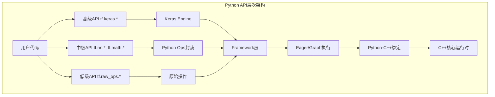
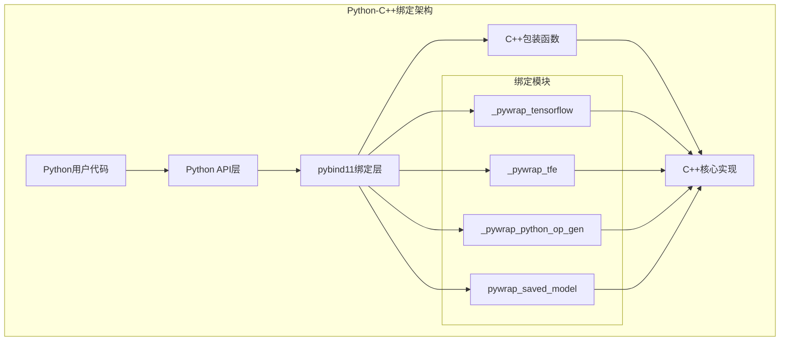
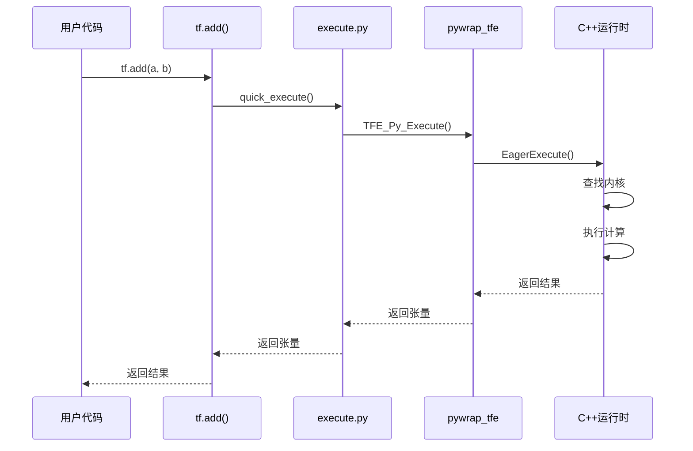
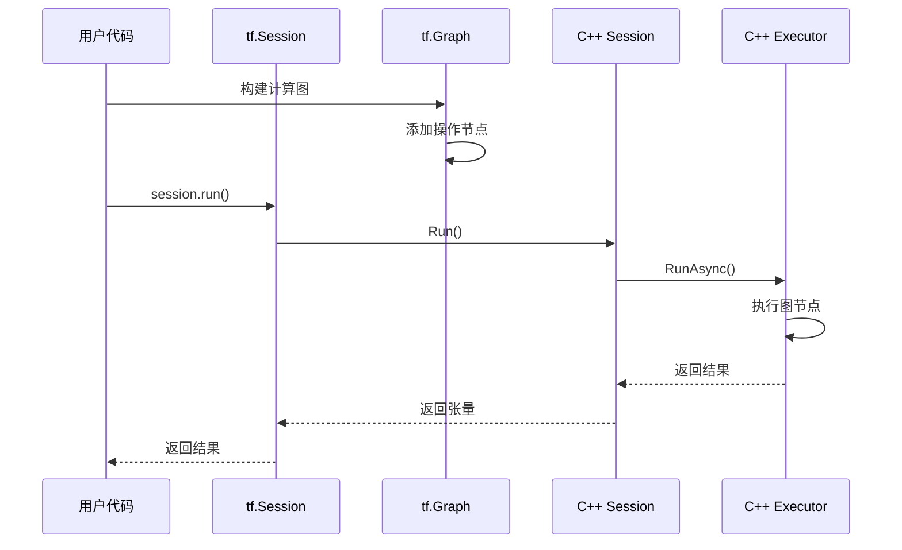
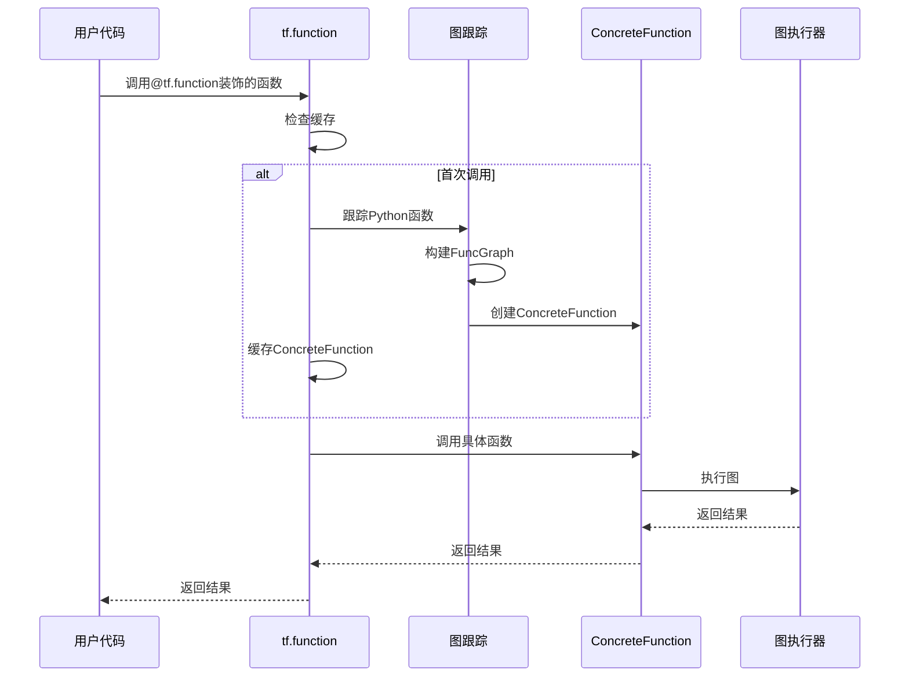

## 模块概述

TensorFlow Python模块是用户最常接触的接口层，提供了从高级的Keras API到底层操作的完整Python接口。它通过pybind11和SWIG等技术将C++核心功能暴露给Python用户。

### 主要子模块结构

```
tensorflow/python/
├── framework/          # 框架核心
│   ├── ops.py         # 操作和图构建
│   ├── tensor.py      # 张量Python实现
│   └── dtypes.py      # 数据类型
├── eager/             # 动态执行
│   ├── context.py     # 执行上下文
│   ├── execute.py     # 操作执行
│   └── polymorphic_function/ # tf.function实现
├── keras/             # 高级API
│   ├── engine/        # 核心引擎
│   ├── layers/        # 层实现
│   └── models.py      # 模型API
├── ops/               # 操作封装
│   ├── math_ops.py    # 数学运算
│   ├── nn_ops.py      # 神经网络操作
│   └── array_ops.py   # 数组操作
├── client/            # 客户端接口
│   └── session.py     # 会话管理
└── lib/               # 底层库
    └── core/          # 核心绑定
```

## Python API架构

### 整体架构图



### API层次说明

1. **高级API**: Keras提供的模型构建和训练接口
2. **中级API**: 神经网络、数学运算等功能性API
3. **低级API**: 直接对应C++操作的Python封装
4. **Framework层**: 图构建、张量管理等核心功能
5. **执行层**: Eager和Graph两种执行模式
6. **绑定层**: Python到C++的接口绑定

## Framework子模块

### 1. ops.py - 操作和图构建

#### Graph类 - 计算图

```python
# tensorflow/python/framework/ops.py
class Graph(object):
    """TensorFlow计算图，包含操作和张量的集合
    
    功能说明:
    - 管理操作节点和张量边
    - 提供图构建的上下文环境
    - 支持图的序列化和反序列化
    - 管理设备放置和作用域
    """
    
    def __init__(self):
        """初始化空的计算图"""
        self._nodes_by_id = {}          # 按ID索引的节点
        self._nodes_by_name = {}        # 按名称索引的节点
        self._version = 0               # 图版本号
        self._next_id_counter = 0       # 下一个节点ID
        self._device_function_stack = []  # 设备函数栈
        self._colocation_stack = []     # 共置约束栈
        
    def as_default(self):
        """将此图设置为默认图的上下文管理器
        
        返回:
            上下文管理器，在其中此图为默认图
        """
        return _default_graph_stack.get_controller(self)
    
    def create_op(self, op_type, inputs, dtypes, input_types=None,
                  name=None, attrs=None, op_def=None, compute_device=True):
        """在图中创建操作节点
        
        参数:
            op_type: 操作类型字符串
            inputs: 输入张量列表
            dtypes: 输出数据类型列表
            name: 操作名称
            attrs: 操作属性字典
            
        返回:
            创建的Operation对象
        """
        # 生成唯一的操作名称
        if name is None:
            name = op_type
        name = self.unique_name(name)
        
        # 创建节点定义
        node_def = _NodeDef()
        node_def.name = name
        node_def.op = op_type
        
        # 设置输入
        for inp in inputs:
            if isinstance(inp, Tensor):
                node_def.input.append(inp._as_node_def_input())
        
        # 创建操作对象
        op = Operation(node_def, self, inputs, dtypes)
        self._add_op(op)
        return op
    
    def get_operations(self):
        """获取图中所有操作的列表
        
        返回:
            Operation对象列表
        """
        return list(self._nodes_by_id.values())
```

#### Operation类 - 操作节点

```python
# tensorflow/python/framework/ops.py
class Operation(object):
    """表示图中的一个操作节点
    
    功能说明:
    - 封装操作的输入、输出和属性
    - 提供操作执行的接口
    - 管理操作的设备放置
    """
    
    def __init__(self, node_def, graph, inputs=None, output_types=None):
        """初始化操作对象
        
        参数:
            node_def: 节点定义protobuf
            graph: 所属的图对象
            inputs: 输入张量列表
            output_types: 输出类型列表
        """
        self._node_def = node_def
        self._graph = graph
        self._inputs = inputs or []
        self._id = graph._next_id_counter
        graph._next_id_counter += 1
        
        # 创建输出张量
        self._outputs = []
        if output_types:
            for i, dtype in enumerate(output_types):
                tensor = Tensor(self, i, dtype)
                self._outputs.append(tensor)
    
    @property
    def name(self):
        """操作名称"""
        return self._node_def.name
    
    @property
    def type(self):
        """操作类型"""
        return self._node_def.op
    
    @property
    def inputs(self):
        """输入张量列表"""
        return self._inputs
    
    @property
    def outputs(self):
        """输出张量列表"""
        return self._outputs
    
    def get_attr(self, name):
        """获取操作属性
        
        参数:
            name: 属性名称
            
        返回:
            属性值
        """
        return self._node_def.attr[name]
```

### 2. tensor.py - 张量实现

#### Tensor类 - 张量对象

```python
# tensorflow/python/framework/tensor.py
@tf_export("Tensor", "experimental.numpy.ndarray", v1=["Tensor"])
class Tensor(internal.NativeObject, core_tf_types.Symbol):
    """TensorFlow张量，表示多维数组
    
    功能说明:
    - 表示计算图中的数据流
    - 支持各种数学运算重载
    - 提供numpy兼容接口
    - 支持设备间数据传输
    """
    
    def __init__(self, op, value_index, dtype):
        """初始化张量对象
        
        参数:
            op: 产生此张量的操作
            value_index: 在操作输出中的索引
            dtype: 数据类型
        """
        self._op = op
        self._value_index = value_index
        self._dtype = dtype
        self._shape = tensor_shape.unknown_shape()
        self._id = ops.uid()
    
    @property
    def op(self):
        """产生此张量的操作"""
        return self._op
    
    @property
    def dtype(self):
        """张量的数据类型"""
        return self._dtype
    
    @property
    def shape(self):
        """张量的形状"""
        return self._shape
    
    @property
    def device(self):
        """张量所在的设备"""
        return self._op.device
    
    def numpy(self):
        """将张量转换为numpy数组
        
        返回:
            numpy.ndarray对象
            
        注意:
            只能在eager模式下使用
        """
        if not context.executing_eagerly():
            raise RuntimeError("numpy() is only available when eager execution is enabled.")
        return self._numpy()
    
    def eval(self, feed_dict=None, session=None):
        """在会话中评估张量值
        
        参数:
            feed_dict: 输入数据字典
            session: 会话对象
            
        返回:
            张量的numpy值
        """
        return _eval_using_default_session(self, feed_dict, self.graph, session)
    
    # 运算符重载
    def __add__(self, other):
        """加法运算重载"""
        return math_ops.add(self, other)
    
    def __mul__(self, other):
        """乘法运算重载"""
        return math_ops.multiply(self, other)
    
    def __matmul__(self, other):
        """矩阵乘法运算重载"""
        return math_ops.matmul(self, other)
```

## Eager Execution

### 1. context.py - 执行上下文

#### Context类 - Eager执行上下文

```python
# tensorflow/python/eager/context.py
class Context:
    """Eager执行环境上下文
    
    功能说明:
    - 管理eager执行状态
    - 控制设备放置策略
    - 管理内存和资源
    - 提供执行配置选项
    """
    
    def __init__(self, config=None, device_policy=None, execution_mode=None):
        """初始化执行上下文
        
        参数:
            config: 配置选项
            device_policy: 设备放置策略
            execution_mode: 执行模式(同步/异步)
        """
        self._device_policy = device_policy or DEVICE_PLACEMENT_SILENT
        self._execution_mode = execution_mode or SYNC
        self._config = config or config_pb2.ConfigProto()
        
        # 创建C++上下文
        self._context_handle = pywrap_tfe.TFE_NewContext(self._config)
        self._thread_local_data = threading.local()
    
    def executing_eagerly(self):
        """检查是否在eager模式下执行
        
        返回:
            bool: True表示eager模式
        """
        return self._thread_local_data.is_eager
    
    def device(self, name):
        """设置默认设备的上下文管理器
        
        参数:
            name: 设备名称
            
        返回:
            设备上下文管理器
        """
        return _device_stack.get_controller(name)
    
    def ensure_initialized(self):
        """确保上下文已初始化"""
        if self._context_handle is None:
            self._initialize_handle_and_devices()

@tf_export("executing_eagerly", v1=[])
def executing_eagerly():
    """检查当前线程是否启用了eager执行
    
    返回:
        bool: True表示启用eager执行
        
    示例:
        >>> print(tf.executing_eagerly())
        True
        
        >>> @tf.function
        ... def fn():
        ...     print(tf.executing_eagerly())
        >>> fn()
        False
    """
    ctx = context_safe()
    if ctx is None:
        return default_execution_mode == EAGER_MODE
    return ctx.executing_eagerly()
```

### 2. execute.py - 操作执行

#### 快速执行函数

```python
# tensorflow/python/eager/execute.py
def quick_execute(op_name, num_outputs, inputs, attrs, ctx, name=None):
    """快速执行eager操作
    
    参数:
        op_name: 操作名称
        num_outputs: 输出数量
        inputs: 输入张量列表
        attrs: 操作属性
        ctx: 执行上下文
        name: 操作实例名称
        
    返回:
        输出张量列表
        
    功能说明:
    - 直接调用C++ eager执行引擎
    - 绕过图构建过程
    - 提供最高的执行效率
    """
    device_name = ctx.device_name
    try:
        # 调用C++ eager执行
        tensors = pywrap_tfe.TFE_Py_Execute(
            ctx._handle,           # 上下文句柄
            device_name,           # 设备名称
            op_name,              # 操作名称
            inputs,               # 输入张量
            attrs,                # 属性
            num_outputs           # 输出数量
        )
    except core._NotOkStatusException as e:
        # 处理执行错误
        if name is not None:
            message = e.message + " name: " + name
        else:
            message = e.message
        raise core._status_to_exception(e.code, message)
    
    return tensors
```

### 3. tf.function实现

#### Function类 - 函数对象

```python
# tensorflow/python/eager/polymorphic_function/polymorphic_function.py
class Function(core.PolymorphicFunction, trackable.Trackable):
    """tf.function装饰器创建的函数对象
    
    功能说明:
    - 将Python函数转换为TensorFlow图
    - 支持多态类型推断
    - 提供自动微分支持
    - 优化执行性能
    """
    
    def __init__(self, python_function, name, input_signature=None,
                 autograph=True, jit_compile=None):
        """初始化函数对象
        
        参数:
            python_function: 要转换的Python函数
            name: 函数名称
            input_signature: 输入签名
            autograph: 是否启用AutoGraph
            jit_compile: 是否JIT编译
        """
        self._python_function = python_function
        self._name = name
        self._input_signature = input_signature
        self._autograph = autograph
        self._jit_compile = jit_compile
        
        # 函数缓存，按输入签名索引
        self._function_cache = {}
        
    def __call__(self, *args, **kwargs):
        """调用函数
        
        参数:
            *args: 位置参数
            **kwargs: 关键字参数
            
        返回:
            函数执行结果
        """
        # 获取输入签名
        signature = self._get_signature(args, kwargs)
        
        # 查找缓存的具体函数
        concrete_function = self._function_cache.get(signature)
        if concrete_function is None:
            # 创建新的具体函数
            concrete_function = self._create_concrete_function(args, kwargs)
            self._function_cache[signature] = concrete_function
        
        # 执行具体函数
        return concrete_function(*args, **kwargs)
    
    def _create_concrete_function(self, args, kwargs):
        """创建具体的图函数
        
        参数:
            args: 函数参数
            kwargs: 关键字参数
            
        返回:
            ConcreteFunction对象
        """
        # 创建函数图
        func_graph = func_graph_module.func_graph_from_py_func(
            self._name,
            self._python_function,
            args, kwargs,
            signature=self._input_signature,
            autograph=self._autograph
        )
        
        # 创建具体函数
        concrete_function = ConcreteFunction(
            func_graph,
            attrs={"jit_compile": self._jit_compile}
        )
        
        return concrete_function

@tf_export("function", v1=[])
def function(func=None, input_signature=None, autograph=True, 
             jit_compile=None, reduce_retracing=False):
    """将Python函数编译为TensorFlow图
    
    参数:
        func: 要装饰的函数
        input_signature: 输入签名规范
        autograph: 是否启用AutoGraph转换
        jit_compile: 是否使用XLA JIT编译
        reduce_retracing: 是否减少重新跟踪
        
    返回:
        装饰后的Function对象
        
    示例:
        >>> @tf.function
        ... def add(a, b):
        ...     return a + b
        >>> result = add(tf.constant(1), tf.constant(2))
        >>> print(result)
        tf.Tensor(3, shape=(), dtype=int32)
    """
    if func is not None:
        return Function(func, input_signature=input_signature,
                       autograph=autograph, jit_compile=jit_compile)
    else:
        def decorator(f):
            return Function(f, input_signature=input_signature,
                           autograph=autograph, jit_compile=jit_compile)
        return decorator
```

## Keras高级API

### 1. Model类 - 模型基类

```python
# tensorflow/python/keras/engine/training.py
class Model(base_layer.Layer, version_utils.ModelVersionSelector):
    """Keras模型基类，提供训练和推理功能
    
    功能说明:
    - 组合多个层构成完整模型
    - 提供训练、评估、预测接口
    - 支持模型保存和加载
    - 集成优化器和损失函数
    """
    
    def __init__(self, inputs=None, outputs=None, name=None, **kwargs):
        """初始化模型
        
        参数:
            inputs: 输入张量或张量列表
            outputs: 输出张量或张量列表
            name: 模型名称
        """
        super(Model, self).__init__(name=name, **kwargs)
        self._inputs = inputs
        self._outputs = outputs
        self.compiled = False
        
    def compile(self, optimizer='rmsprop', loss=None, metrics=None, **kwargs):
        """编译模型，配置训练参数
        
        参数:
            optimizer: 优化器实例或名称
            loss: 损失函数
            metrics: 评估指标列表
            
        功能说明:
        - 设置优化器和损失函数
        - 配置评估指标
        - 构建训练和评估图
        """
        # 设置优化器
        if isinstance(optimizer, str):
            self.optimizer = optimizers.get(optimizer)
        else:
            self.optimizer = optimizer
            
        # 设置损失函数
        if isinstance(loss, str):
            self.loss = losses.get(loss)
        else:
            self.loss = loss
            
        # 设置指标
        self.metrics = metrics or []
        self.compiled = True
    
    def fit(self, x=None, y=None, batch_size=None, epochs=1,
            validation_data=None, callbacks=None, **kwargs):
        """训练模型
        
        参数:
            x: 输入数据
            y: 目标数据
            batch_size: 批次大小
            epochs: 训练轮数
            validation_data: 验证数据
            callbacks: 回调函数列表
            
        返回:
            History对象，包含训练历史
        """
        # 数据预处理
        x, y = self._prepare_data(x, y)
        
        # 创建训练循环
        training_loop = training_utils.TrainingLoop(
            model=self,
            optimizer=self.optimizer,
            loss=self.loss,
            metrics=self.metrics
        )
        
        # 执行训练
        history = training_loop.fit(
            x, y, batch_size=batch_size, epochs=epochs,
            validation_data=validation_data, callbacks=callbacks
        )
        
        return history
    
    def predict(self, x, batch_size=None, **kwargs):
        """模型预测
        
        参数:
            x: 输入数据
            batch_size: 批次大小
            
        返回:
            预测结果数组
        """
        # 数据预处理
        x = self._prepare_predict_data(x)
        
        # 批量预测
        predictions = []
        for batch in self._make_batches(x, batch_size):
            batch_predictions = self(batch, training=False)
            predictions.append(batch_predictions)
        
        return np.concatenate(predictions, axis=0)
```

### 2. Layer类 - 层基类

```python
# tensorflow/python/keras/engine/base_layer.py
class Layer(module.Module, version_utils.LayerVersionSelector):
    """Keras层基类
    
    功能说明:
    - 定义层的基本接口
    - 管理权重和变量
    - 提供前向传播抽象
    - 支持序列化和反序列化
    """
    
    def __init__(self, trainable=True, name=None, **kwargs):
        """初始化层
        
        参数:
            trainable: 是否可训练
            name: 层名称
        """
        super(Layer, self).__init__(name=name)
        self.trainable = trainable
        self._built = False
        self._weights = []
        
    def build(self, input_shape):
        """构建层，创建权重变量
        
        参数:
            input_shape: 输入形状
            
        功能说明:
        - 根据输入形状确定权重形状
        - 创建可训练变量
        - 设置层的built状态
        """
        self._built = True
    
    def call(self, inputs, **kwargs):
        """层的前向传播逻辑
        
        参数:
            inputs: 输入张量
            **kwargs: 其他参数
            
        返回:
            输出张量
            
        注意:
            子类必须实现此方法
        """
        raise NotImplementedError("Layer must implement call method")
    
    def __call__(self, inputs, *args, **kwargs):
        """调用层进行前向传播
        
        参数:
            inputs: 输入张量
            
        返回:
            输出张量
        """
        # 首次调用时构建层
        if not self._built:
            input_shape = inputs.shape
            self.build(input_shape)
            
        # 执行前向传播
        outputs = self.call(inputs, *args, **kwargs)
        return outputs
    
    def add_weight(self, name, shape, dtype=None, initializer='zeros',
                   trainable=True, **kwargs):
        """添加权重变量
        
        参数:
            name: 变量名称
            shape: 变量形状
            dtype: 数据类型
            initializer: 初始化器
            trainable: 是否可训练
            
        返回:
            创建的变量
        """
        weight = self.add_variable(
            name=name,
            shape=shape,
            dtype=dtype,
            initializer=initializer,
            trainable=trainable,
            **kwargs
        )
        self._weights.append(weight)
        return weight
```

## Python-C++绑定机制

### 1. pybind11绑定示例

```cpp
// tensorflow/python/framework/python_tensor_converter_wrapper.cc
#include "pybind11/pybind11.h"
#include "tensorflow/python/framework/python_tensor_converter.h"

namespace py = pybind11;

PYBIND11_MODULE(_pywrap_python_tensor_converter, m) {
    // 绑定PythonTensorConverter类
    py::class_<tensorflow::PythonTensorConverter>(m, "PythonTensorConverter")
        .def(py::init(&tensorflow::MakePythonTensorConverter))
        .def("Convert", [](tensorflow::PythonTensorConverter* self,
                          py::handle obj, py::handle dtype) {
            // 转换Python对象为Tensor
            DataType dtype_enum = static_cast<DataType>(PY_INT_AS_LONG(dtype.ptr()));
            bool used_fallback = false;
            Safe_PyObjectPtr converted = self->Convert(obj.ptr(), dtype_enum, &used_fallback);
            
            if (!converted) throw py::error_already_set();
            
            // 返回转换结果
            PyObject* result = PyTuple_New(3);
            PyTuple_SET_ITEM(result, 0, converted.release());
            PyTuple_SET_ITEM(result, 1, PY_INT_FROM_LONG(dtype_enum));
            PyTuple_SET_ITEM(result, 2, used_fallback ? Py_True : Py_False);
            return result;
        });
}
```

### 2. 绑定架构图



## 关键API调用链

### 1. Eager执行调用链



### 2. Graph执行调用链



### 3. tf.function调用链



## 最佳实践

### 1. 高效的Python代码编写

```python
# 推荐：使用tf.function装饰器
@tf.function
def efficient_computation(x, y):
    """使用tf.function可以获得图执行的性能优势"""
    z = tf.matmul(x, y)
    return tf.nn.relu(z)

# 推荐：批量操作
def batch_processing(data_list):
    """批量处理比循环处理更高效"""
    # 不推荐：循环处理
    # results = [tf.square(x) for x in data_list]
    
    # 推荐：批量处理
    batch_data = tf.stack(data_list)
    results = tf.square(batch_data)
    return tf.unstack(results)

# 推荐：使用tf.data进行数据处理
def create_dataset(data, labels):
    """使用tf.data可以获得更好的性能"""
    dataset = tf.data.Dataset.from_tensor_slices((data, labels))
    dataset = dataset.batch(32)
    dataset = dataset.prefetch(tf.data.AUTOTUNE)
    return dataset
```

### 2. 内存优化技巧

```python
# 推荐：及时释放不需要的张量
def memory_efficient_training():
    """内存高效的训练循环"""
    for batch in dataset:
        with tf.GradientTape() as tape:
            predictions = model(batch['inputs'])
            loss = loss_fn(batch['labels'], predictions)
        
        gradients = tape.gradient(loss, model.trainable_variables)
        optimizer.apply_gradients(zip(gradients, model.trainable_variables))
        
        # 显式删除不需要的变量
        del predictions, loss, gradients

# 推荐：使用混合精度训练
def mixed_precision_training():
    """使用混合精度可以减少内存使用"""
    policy = tf.keras.mixed_precision.Policy('mixed_float16')
    tf.keras.mixed_precision.set_global_policy(policy)
    
    model = create_model()
    # 输出层需要使用float32
    model.add(tf.keras.layers.Dense(num_classes, dtype='float32'))
```

### 3. 调试和性能分析

```python
# 启用eager执行进行调试
def debug_model():
    """在eager模式下调试模型"""
    tf.config.run_functions_eagerly(True)
    
    @tf.function
    def debug_function(x):
        # 可以使用print进行调试
        tf.print("Input shape:", tf.shape(x))
        y = tf.square(x)
        tf.print("Output shape:", tf.shape(y))
        return y
    
    result = debug_function(tf.constant([[1, 2], [3, 4]]))
    tf.config.run_functions_eagerly(False)

# 性能分析
def profile_model():
    """使用TensorFlow Profiler进行性能分析"""
    tf.profiler.experimental.start('logdir')
    
    # 执行要分析的代码
    for step in range(100):
        train_step()
    
    tf.profiler.experimental.stop()
```

## 总结

TensorFlow Python模块提供了完整的机器学习开发接口：

1. **多层次API设计** - 从Keras高级API到底层操作的完整覆盖
2. **高效的执行机制** - Eager和Graph两种执行模式的无缝切换
3. **强大的绑定系统** - 通过pybind11实现Python到C++的高效绑定
4. **丰富的功能支持** - 涵盖模型构建、训练、部署的全流程

通过深入理解Python模块的设计和实现，可以：
- 更高效地使用TensorFlow API
- 开发自定义的Python操作和层
- 优化模型的训练和推理性能
- 解决复杂的工程问题
