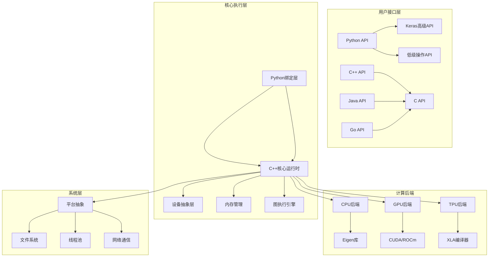
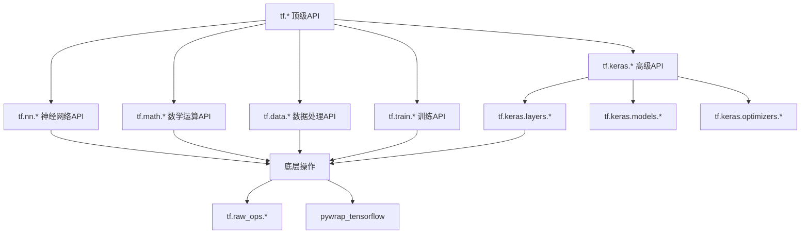
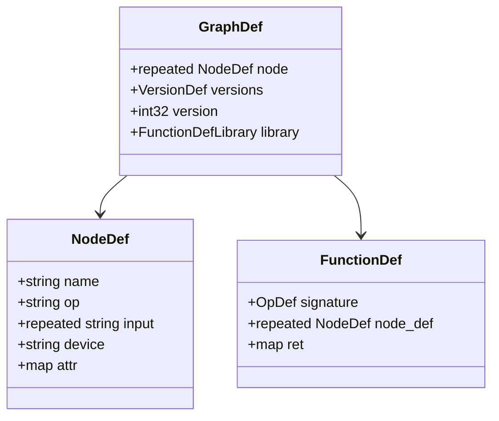
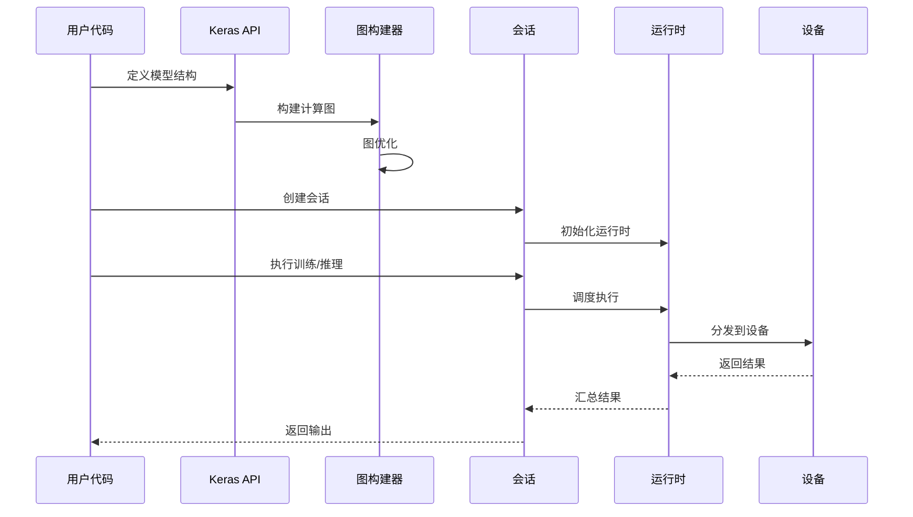

## 项目概述

TensorFlow是Google开发的开源机器学习框架，支持深度学习和传统机器学习算法。其设计目标是提供灵活、高效、可扩展的数值计算平台。

### 核心特性
- **多语言支持**: Python、C++、Java、Go等
- **多平台部署**: CPU、GPU、TPU、移动设备
- **分布式计算**: 支持集群训练和推理
- **图执行模式**: 静态图和动态图（Eager Execution）
- **模型部署**: TensorFlow Serving、TensorFlow Lite

## 整体架构



### 架构层次说明

1. **用户接口层**: 提供多语言API，其中Python API是最主要的接口
2. **核心执行层**: C++实现的核心运行时，负责图构建、优化和执行
3. **计算后端**: 针对不同硬件的优化实现
4. **系统层**: 平台相关的抽象和实现

## 核心模块分析

### 目录结构概览

```
tensorflow/
├── c/              # C API实现
├── cc/             # C++ API
├── compiler/       # 编译器和优化器
│   ├── jit/        # Just-In-Time编译
│   ├── mlir/       # MLIR方言和转换
│   ├── tf2xla/     # TensorFlow到XLA转换
│   └── tf2tensorrt/ # TensorRT集成
├── core/           # 核心运行时
│   ├── common_runtime/  # 通用运行时
│   ├── framework/       # 框架基础设施
│   ├── kernels/         # 操作内核实现
│   ├── ops/            # 操作定义
│   └── platform/       # 平台抽象
├── python/         # Python绑定和API
│   ├── keras/      # Keras高级API
│   ├── ops/        # Python操作封装
│   └── framework/  # Python框架代码
├── lite/           # TensorFlow Lite
└── tools/          # 工具和实用程序
```

## API层次结构

### Python API层次



### 主要API入口点

#### 1. Tensor类 - 核心数据结构
```python
# tensorflow/python/framework/tensor.py
@tf_export("Tensor", "experimental.numpy.ndarray", v1=["Tensor"])
class Tensor(internal.NativeObject, core_tf_types.Symbol):
    """TensorFlow中的多维数组表示
    
    功能说明:
    - 表示多维数组数据
    - 支持多种数据类型(float32, int32, string等)
    - 具有固定的形状(shape)
    - 支持eager和graph两种执行模式
    
    关键属性:
    - dtype: 数据类型
    - shape: 张量形状
    - device: 设备位置
    """
    
    def __init__(self, op, value_index, dtype):
        """初始化Tensor对象
        
        参数:
            op: 产生此tensor的操作
            value_index: 在操作输出中的索引
            dtype: 数据类型
        """
        pass
    
    @property
    def dtype(self):
        """返回tensor的数据类型"""
        return self._dtype
    
    @property 
    def shape(self):
        """返回tensor的形状"""
        return self._shape
```

#### 2. Keras Model类 - 高级模型API
```python
# tensorflow/python/keras/engine/training.py
class Model(base_layer.Layer, version_utils.ModelVersionSelector):
    """Keras模型类，提供训练和推理功能
    
    功能说明:
    - 将多个层组合成可训练的模型
    - 提供compile(), fit(), predict()等高级接口
    - 支持函数式API和子类化两种构建方式
    
    主要方法:
    - compile(): 配置模型的损失函数、优化器和指标
    - fit(): 训练模型
    - predict(): 模型推理
    - save(): 保存模型
    """
    
    def compile(self, optimizer='rmsprop', loss=None, metrics=None, **kwargs):
        """编译模型，配置训练参数
        
        参数:
            optimizer: 优化器实例或字符串名称
            loss: 损失函数
            metrics: 评估指标列表
        """
        pass
    
    def fit(self, x=None, y=None, batch_size=None, epochs=1, **kwargs):
        """训练模型
        
        参数:
            x: 输入数据
            y: 目标数据  
            batch_size: 批次大小
            epochs: 训练轮数
            
        返回:
            History对象，包含训练历史
        """
        pass
```

## 关键数据结构

### 1. GraphDef - 计算图定义



### 2. Session - 执行会话

```cpp
// tensorflow/core/public/session.h
class Session {
public:
    /**
     * 创建计算图
     * @param graph 图定义
     * @return 状态码
     */
    virtual absl::Status Create(const GraphDef& graph) = 0;
    
    /**
     * 执行计算图
     * @param inputs 输入张量对
     * @param output_tensor_names 输出张量名称
     * @param target_tensor_names 目标节点名称  
     * @param outputs 输出张量
     * @return 状态码
     */
    virtual absl::Status Run(
        const std::vector<std::pair<std::string, Tensor>>& inputs,
        const std::vector<std::string>& output_tensor_names,
        const std::vector<std::string>& target_tensor_names,
        std::vector<Tensor>* outputs) = 0;
};
```

## 执行流程

### 1. 模型构建到执行的完整流程



### 2. Eager Execution vs Graph Execution

#### Eager Execution（动态图）
```python
# 立即执行，类似NumPy
import tensorflow as tf

a = tf.constant([1, 2, 3])
b = tf.constant([4, 5, 6])
c = tf.add(a, b)  # 立即计算
print(c)  # 输出: tf.Tensor([5 7 9], shape=(3,), dtype=int32)
```

#### Graph Execution（静态图）
```python
# 构建图后执行
@tf.function
def compute_sum(a, b):
    return tf.add(a, b)

# 首次调用时构建图，后续调用复用图
result = compute_sum(tf.constant([1, 2, 3]), tf.constant([4, 5, 6]))
```

## 模块详细分析

本文档将在以下子文档中详细分析各个模块：

1. [Core模块分析](/posts/core-module-analysis/) - 核心运行时和框架
2. [Python模块分析](/posts/python-module-analysis/) - Python API和绑定
3. [Compiler模块分析](/posts/compiler-module-analysis/) - 编译器和优化
4. [C++ API分析](/posts/cc-module-analysis/) - C++ API
5. [TensorFlow Lite分析](/posts/lite-module-analysis/) - 移动和嵌入式部署
6. [使用示例和最佳实践](/posts/examples-and-best-practices/)

## 总结

TensorFlow采用分层架构设计，从高级的Keras API到底层的设备特定实现，每一层都有明确的职责：

- **接口层**: 提供易用的高级API
- **框架层**: 处理图构建、优化和调度
- **运行时层**: 负责具体的计算执行
- **设备层**: 针对不同硬件的优化实现

这种设计使得TensorFlow既能提供简单易用的接口，又能支持复杂的分布式训练和高性能推理场景。
