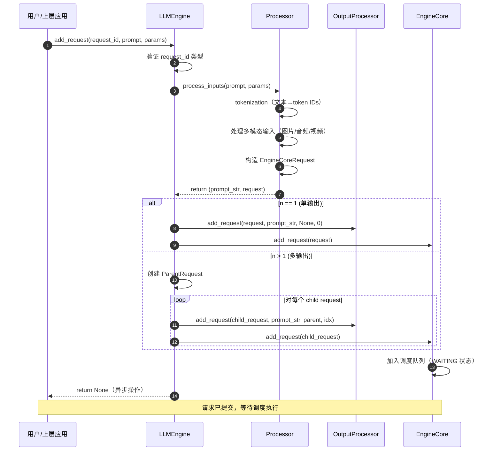
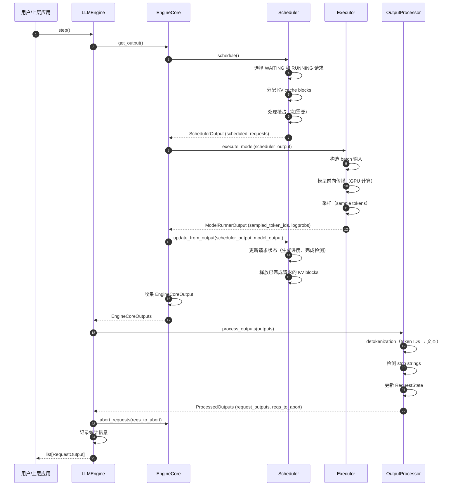
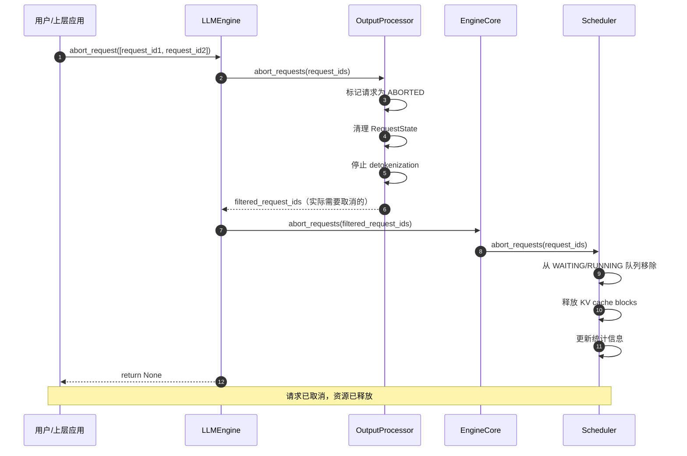

# vLLM-01-Engine模块-API

## API 概览

Engine 模块提供以下核心 API：

| API 名称 | 方法 | 幂等性 | 作用 | 调用频率 |
|---------|------|--------|------|---------|
| `add_request` | 实例方法 | 否 | 添加新的推理请求 | 每个请求一次 |
| `step` | 实例方法 | 是 | 执行一次引擎迭代（生成一批 token） | 高频循环调用 |
| `abort_request` | 实例方法 | 是 | 取消正在进行的请求 | 按需调用 |
| `get_model_config` | 实例方法 | 是 | 获取模型配置 | 初始化时调用 |
| `get_num_unfinished_requests` | 实例方法 | 是 | 获取未完成请求数 | 按需查询 |

---

## API 详细规格

### 1. add_request

#### 基本信息
- **名称**：`add_request`
- **协议/方法**：Python 实例方法
- **幂等性**：否（多次调用会创建多个请求）
- **返回值**：None（异步操作）

#### 请求结构体

```python
def add_request(
    self,
    request_id: str,
    prompt: PromptType,  # str | TokensPrompt | dict
    params: Union[SamplingParams, PoolingParams],
    arrival_time: Optional[float] = None,
    lora_request: Optional[LoRARequest] = None,
    tokenization_kwargs: Optional[dict[str, Any]] = None,
    trace_headers: Optional[Mapping[str, str]] = None,
    priority: int = 0,
) -> None:
    """添加新的推理请求"""
```

**参数说明表**：

| 字段 | 类型 | 必填 | 默认值 | 约束 | 说明 |
|------|------|------|--------|------|------|
| request_id | str | ✓ | - | 必须唯一 | 请求的唯一标识符 |
| prompt | PromptType | ✓ | - | 文本或 token IDs | 输入提示词，支持文本、token IDs、多模态输入 |
| params | SamplingParams/PoolingParams | ✓ | - | - | 采样参数（生成任务）或池化参数（embedding 任务） |
| arrival_time | float | ✗ | time.time() | ≥ 0 | 请求到达时间（用于调度和统计） |
| lora_request | LoRARequest | ✗ | None | - | LoRA 适配器请求（如需使用 LoRA） |
| tokenization_kwargs | dict | ✗ | None | - | tokenization 的额外参数 |
| trace_headers | dict | ✗ | None | - | 分布式追踪的请求头 |
| priority | int | ✗ | 0 | 整数 | 请求优先级（数值越大优先级越高） |

#### 响应结构体

该方法无返回值。请求的输出通过 `step()` 方法异步返回。

#### 入口函数与关键代码

```python
def add_request(
    self,
    request_id: str,
    prompt: PromptType,
    params: Union[SamplingParams, PoolingParams],
    arrival_time: Optional[float] = None,
    lora_request: Optional[LoRARequest] = None,
    tokenization_kwargs: Optional[dict[str, Any]] = None,
    trace_headers: Optional[Mapping[str, str]] = None,
    priority: int = 0,
) -> None:
    # 1) 验证 request_id 类型
    if not isinstance(request_id, str):
        raise TypeError(f"request_id must be a string")

    # 2) 通过 Processor 处理输入（tokenization、多模态处理）
    prompt_str, request = self.processor.process_inputs(
        request_id, prompt, params, arrival_time, lora_request,
        tokenization_kwargs, trace_headers, priority)

    # 3) 处理 n > 1 的情况（生成多个候选输出）
    n = params.n if isinstance(params, SamplingParams) else 1
    
    if n == 1:
        # 单输出请求：直接添加
        self.output_processor.add_request(request, prompt_str, None, 0)
        self.engine_core.add_request(request)
    else:
        # 多输出请求：创建父请求，生成 n 个子请求
        parent_req = ParentRequest(request_id, params)
        for idx in range(n):
            child_request_id, child_params = parent_req.get_child_info(idx)
            child_request = copy(request) if idx < n - 1 else request
            child_request.request_id = child_request_id
            child_request.sampling_params = child_params
            
            # 注册子请求到输出处理器和引擎核心
            self.output_processor.add_request(child_request, prompt_str, parent_req, idx)
            self.engine_core.add_request(child_request)
```

**代码说明**：
- **目的**：接收用户请求，完成预处理（tokenization、多模态特征提取），并将请求提交到引擎核心进行调度
- **输入**：原始 prompt（文本/token IDs/多模态数据）和采样参数
- **输出**：无（异步操作，结果通过 `step()` 返回）
- **错误处理**：验证 request_id 类型，处理 tokenization 错误
- **性能**：O(m)，m 为 prompt 长度（tokenization 复杂度）

#### 上层适配/调用链核心代码

**调用链**：`LLM.generate()` → `LLMEngine.add_request()` → `Processor.process_inputs()` → `EngineCore.add_request()`

```python
# vllm/entrypoints/llm.py
class LLM:
    def generate(
        self,
        prompts: Union[str, list[str]],
        sampling_params: Optional[SamplingParams] = None,
        use_tqdm: bool = True,
        lora_request: Optional[LoRARequest] = None,
    ) -> list[RequestOutput]:
        # 1) 标准化输入
        if isinstance(prompts, str):
            prompts = [prompts]
        if sampling_params is None:
            sampling_params = SamplingParams()
        
        # 2) 批量添加请求
        for prompt in prompts:
            request_id = f"request-{uuid.uuid4()}"
            self.llm_engine.add_request(
                request_id=request_id,
                prompt=prompt,
                params=sampling_params,
                lora_request=lora_request,
            )
        
        # 3) 循环执行 step 直到所有请求完成
        outputs = []
        while self.llm_engine.has_unfinished_requests():
            step_outputs = self.llm_engine.step()
            outputs.extend(step_outputs)
        
        return outputs
```

#### 时序图（请求→响应）



#### 异常/回退与性能要点

**异常处理**：
1. **request_id 类型错误**：抛出 `TypeError`，要求 request_id 必须为字符串
2. **tokenization 失败**：抛出 `ValueError`（prompt 无效或超长）
3. **多模态输入无效**：抛出 `ValueError`（格式不符合要求）
4. **模型不支持的特性**：抛出 `NotImplementedError`（如 encoder-decoder 模型的某些特性）

**回退策略**：
- 请求失败时不影响其他请求，错误通过异常向上传播
- 建议在上层捕获异常并记录日志

**性能要点**：
1. **tokenization 开销**：O(m) 复杂度，m 为 prompt 长度；建议预先 tokenize
2. **多模态处理开销**：图片/视频处理可能耗时，支持预处理和缓存
3. **批量添加优化**：连续调用 `add_request()` 不会阻塞，请求会缓存在队列中
4. **内存使用**：每个请求占用内存约 O(prompt_len + max_tokens)

---

### 2. step

#### 基本信息
- **名称**：`step`
- **协议/方法**：Python 实例方法
- **幂等性**：是（多次调用产生不同结果，但不会破坏状态）
- **返回值**：`list[RequestOutput]` 或 `list[PoolingRequestOutput]`

#### 请求结构体

```python
def step(self) -> Union[list[RequestOutput], list[PoolingRequestOutput]]:
    """执行一次引擎迭代，生成一批 token"""
```

**参数说明表**：无参数

#### 响应结构体

```python
# 生成任务返回 RequestOutput
@dataclass
class RequestOutput:
    request_id: str                      # 请求 ID
    prompt: Optional[str]                # 原始 prompt（如可用）
    prompt_token_ids: list[int]          # prompt 的 token IDs
    prompt_logprobs: Optional[list]      # prompt 的 logprobs
    outputs: list[CompletionOutput]      # 生成的输出（可能多个，当 n > 1）
    finished: bool                       # 是否完成
    
# 单个完成输出
@dataclass
class CompletionOutput:
    index: int                           # 输出索引（当 n > 1）
    text: str                            # 生成的文本
    token_ids: list[int]                 # 生成的 token IDs
    cumulative_logprob: float            # 累积 log 概率
    logprobs: Optional[list]             # 每个 token 的 logprobs
    finish_reason: Optional[str]         # 完成原因（"length" / "stop" / "abort"）
    stop_reason: Optional[Union[int, str]]  # 停止原因（stop token ID 或 string）
```

**字段说明表**：

| 字段 | 类型 | 必填 | 说明 |
|------|------|------|------|
| request_id | str | ✓ | 对应的请求 ID |
| prompt | str | ✗ | 原始 prompt 文本（如未设置 skip_tokenizer_init） |
| prompt_token_ids | list[int] | ✓ | prompt 的 token IDs |
| outputs | list[CompletionOutput] | ✓ | 生成的输出列表（n 个） |
| finished | bool | ✓ | 是否完成（True 表示该请求已终止） |
| finish_reason | str | ✗ | 完成原因：`"length"`（达到 max_tokens）、`"stop"`（遇到 stop token）、`"abort"`（被取消） |
| token_ids | list[int] | ✓ | 生成的 token IDs（增量或累积，取决于配置） |
| text | str | ✓ | detokenize 后的文本 |
| logprobs | list | ✗ | 每个 token 的 logprobs（如 `logprobs > 0`） |
| cumulative_logprob | float | ✓ | 累积 log 概率（用于 beam search 等） |

#### 入口函数与关键代码

```python
def step(self) -> Union[list[RequestOutput], list[PoolingRequestOutput]]:
    # 1) 处理数据并行的 dummy batch（DP 同步）
    if self.should_execute_dummy_batch:
        self.should_execute_dummy_batch = False
        self.engine_core.execute_dummy_batch()
        return []
    
    # 2) 从 EngineCore 获取输出（调度+执行+采样）
    outputs = self.engine_core.get_output()
    # outputs.outputs: list[EngineCoreOutput]
    # outputs.scheduler_stats: SchedulerStats
    
    # 3) 通过 OutputProcessor 处理输出
    #    - detokenization
    #    - 更新请求状态
    #    - 处理 stop strings
    #    - 聚合统计信息
    iteration_stats = IterationStats() if self.log_stats else None
    processed_outputs = self.output_processor.process_outputs(
        outputs.outputs,
        engine_core_timestamp=outputs.timestamp,
        iteration_stats=iteration_stats
    )
    
    # 4) 取消因 stop strings 而完成的请求
    self.engine_core.abort_requests(processed_outputs.reqs_to_abort)
    
    # 5) 记录统计信息（吞吐量、延迟、缓存命中率等）
    if self.logger_manager is not None:
        self.logger_manager.record(
            scheduler_stats=outputs.scheduler_stats,
            iteration_stats=iteration_stats,
        )
        self.do_log_stats_with_interval()
    
    return processed_outputs.request_outputs
```

**代码说明**：
- **目的**：执行一次引擎迭代，包括调度、模型执行、采样、detokenization
- **输入**：引擎当前状态（waiting/running 队列）
- **输出**：本次迭代完成的 RequestOutput 列表
- **错误处理**：执行失败时通过异常传播，调用方需捕获
- **性能**：O(batch_size × seq_len)，实际瓶颈在模型前向传播

#### 上层适配/调用链核心代码

**调用链**：`LLM.generate()` → `LLMEngine.step()` → `EngineCore.get_output()` → `Scheduler.schedule()` + `Executor.execute_model()`

```python
# vllm/v1/engine/core.py (EngineCore 内部)
def get_output(self) -> EngineCoreOutputs:
    # 1) 调度：选择要执行的请求
    scheduler_output = self.scheduler.schedule()
    
    # 2) 执行：运行模型前向传播
    model_output = self.model_executor.execute_model(scheduler_output)
    
    # 3) 更新调度器状态（根据 model_output 更新请求状态）
    self.scheduler.update_from_output(scheduler_output, model_output)
    
    # 4) 收集输出和统计信息
    outputs = self._collect_outputs(scheduler_output, model_output)
    scheduler_stats = self._collect_scheduler_stats()
    
    return EngineCoreOutputs(
        outputs=outputs,
        scheduler_stats=scheduler_stats,
        timestamp=time.time()
    )
```

#### 时序图（请求→响应）



#### 异常/回退与性能要点

**异常处理**：
1. **OOM（内存不足）**：模型执行时 CUDA OOM，引擎会记录错误并终止
2. **调度失败**：无法分配 KV cache blocks，请求会保持 WAITING 状态
3. **模型执行错误**：前向传播失败，异常向上传播

**回退策略**：
- 调度失败时请求保留在队列中，下次 step 重试
- 模型执行错误会导致引擎停止，需外部重启

**性能要点**：
1. **批处理大小**：通过 `max_num_seqs` 控制，影响吞吐量和延迟
2. **KV cache 利用率**：通过 PagedAttention 最大化内存利用
3. **Continuous Batching**：每次 step 可以添加新请求，无需等待整批完成
4. **CUDA Graph**：支持 CUDA Graph 优化，减少 kernel 启动开销
5. **调用频率**：高频调用（典型 10-100 Hz），建议在独立线程或异步循环中调用

**吞吐量优化**：
- 增大 `max_num_seqs` 和 `max_num_batched_tokens`
- 启用 Prefix Caching（`enable_prefix_caching=True`）
- 使用 CUDA Graph（`cuda_graph_sizes`）

**延迟优化**：
- 减小 `max_num_seqs`（优先执行少量请求）
- 启用 Chunked Prefill（`chunked_prefill_enabled=True`）
- 使用优先级调度（`priority` 参数）

---

### 3. abort_request

#### 基本信息
- **名称**：`abort_request`
- **协议/方法**：Python 实例方法
- **幂等性**：是（多次取消同一请求不会产生副作用）
- **返回值**：None

#### 请求结构体

```python
def abort_request(self, request_ids: list[str]) -> None:
    """取消正在进行的请求"""
```

**参数说明表**：

| 字段 | 类型 | 必填 | 默认值 | 约束 | 说明 |
|------|------|------|--------|------|------|
| request_ids | list[str] | ✓ | - | 非空列表 | 要取消的请求 ID 列表 |

#### 响应结构体

该方法无返回值。被取消的请求会在下一次 `step()` 中返回 `finish_reason="abort"`。

#### 入口函数与关键代码

```python
def abort_request(self, request_ids: list[str]) -> None:
    # 1) 从 OutputProcessor 中移除请求（停止 detokenization）
    #    返回实际需要取消的请求 ID（过滤已完成的）
    request_ids = self.output_processor.abort_requests(request_ids)
    
    # 2) 从 EngineCore 中移除请求（停止调度和执行）
    #    释放 KV cache blocks
    self.engine_core.abort_requests(request_ids)
```

**代码说明**：
- **目的**：立即终止指定的请求，释放相关资源（KV cache、内存）
- **输入**：请求 ID 列表
- **输出**：无
- **错误处理**：忽略不存在的请求 ID（幂等操作）
- **性能**：O(k)，k 为取消的请求数量

#### 上层适配/调用链核心代码

```python
# vllm/engine/async_llm_engine.py (异步引擎)
class AsyncLLMEngine:
    async def abort(self, request_id: Union[str, Iterable[str]]) -> None:
        # 标准化输入
        if isinstance(request_id, str):
            request_ids = [request_id]
        else:
            request_ids = list(request_id)
        
        # 调用底层同步方法
        self.engine.abort_request(request_ids)
```

#### 时序图（请求→响应）



#### 异常/回退与性能要点

**异常处理**：
1. **请求不存在**：忽略（幂等操作）
2. **请求已完成**：忽略（无需取消）

**回退策略**：
- 取消操作是立即的，不可撤销
- 已生成的输出不会丢失（在 `abort_request` 调用前已通过 `step()` 返回）

**性能要点**：
1. **资源释放**：立即释放 KV cache blocks，可用于新请求
2. **调用开销**：O(k)，k 为取消的请求数量；非常轻量
3. **批量取消**：支持批量取消多个请求，无需逐个调用
4. **异步兼容**：可以在 `step()` 执行期间调用，下次迭代生效

---

## API 使用示例

### 示例 1：基本离线推理

```python
from vllm import LLM, SamplingParams

# 初始化引擎
llm = LLM(model="meta-llama/Llama-2-7b-hf")

# 准备请求
prompts = [
    "Hello, my name is",
    "The capital of France is",
]
sampling_params = SamplingParams(temperature=0.8, top_p=0.95, max_tokens=50)

# 批量生成
outputs = llm.generate(prompts, sampling_params)

for output in outputs:
    prompt = output.prompt
    generated_text = output.outputs[0].text
    print(f"Prompt: {prompt!r}, Generated: {generated_text!r}")
```

### 示例 2：流式推理

```python
from vllm import LLMEngine, EngineArgs, SamplingParams

# 初始化引擎（底层 API）
engine_args = EngineArgs(model="meta-llama/Llama-2-7b-hf")
engine = LLMEngine.from_engine_args(engine_args)

# 添加请求
sampling_params = SamplingParams(temperature=0.0, max_tokens=100)
engine.add_request(
    request_id="request-1",
    prompt="Write a short story about AI:",
    params=sampling_params,
)

# 流式生成
while engine.has_unfinished_requests():
    request_outputs = engine.step()
    
    for request_output in request_outputs:
        if request_output.finished:
            print(f"\n[完成] Request {request_output.request_id}")
            print(f"生成的文本: {request_output.outputs[0].text}")
        else:
            # 增量输出
            new_text = request_output.outputs[0].text
            print(new_text, end="", flush=True)
```

### 示例 3：请求取消

```python
from vllm import LLMEngine, EngineArgs, SamplingParams
import time

engine_args = EngineArgs(model="meta-llama/Llama-2-7b-hf")
engine = LLMEngine.from_engine_args(engine_args)

# 添加多个请求
sampling_params = SamplingParams(max_tokens=500)
for i in range(10):
    engine.add_request(
        request_id=f"request-{i}",
        prompt=f"Write a long article about topic {i}:",
        params=sampling_params,
    )

# 执行几步后取消部分请求
for _ in range(5):
    engine.step()

# 取消请求 3、4、5
engine.abort_request(["request-3", "request-4", "request-5"])
print("已取消 3 个请求")

# 继续执行剩余请求
while engine.has_unfinished_requests():
    engine.step()
```

### 示例 4：优先级调度

```python
from vllm import LLMEngine, EngineArgs, SamplingParams

engine_args = EngineArgs(model="meta-llama/Llama-2-7b-hf")
engine = LLMEngine.from_engine_args(engine_args)

sampling_params = SamplingParams(max_tokens=100)

# 添加低优先级请求
for i in range(5):
    engine.add_request(
        request_id=f"low-priority-{i}",
        prompt=f"Low priority task {i}",
        params=sampling_params,
        priority=0,  # 默认优先级
    )

# 添加高优先级请求（会优先调度）
engine.add_request(
    request_id="high-priority-urgent",
    prompt="URGENT: High priority task",
    params=sampling_params,
    priority=10,  # 高优先级
)

# 高优先级请求会先被调度
while engine.has_unfinished_requests():
    outputs = engine.step()
    for output in outputs:
        if output.finished:
            print(f"完成: {output.request_id}")
```

---

## API 使用模式

### 1. 离线批量推理模式

**适用场景**：批量数据处理、评估任务

**特点**：
- 使用 `LLM` 类（高层 API）
- 批量提交所有请求
- 等待所有请求完成后返回
- 自动管理引擎生命周期

```python
from vllm import LLM, SamplingParams

llm = LLM(model="...")
outputs = llm.generate(prompts, sampling_params)
```

### 2. 在线流式服务模式

**适用场景**：API Server、实时对话

**特点**：
- 使用 `LLMEngine` + `step()` 循环
- 请求动态添加和取消
- 支持流式输出
- 需要手动管理引擎循环

```python
engine = LLMEngine.from_engine_args(engine_args)

# 在独立线程中运行引擎循环
while True:
    outputs = engine.step()
    # 处理输出、发送给客户端
```

### 3. 异步并发模式

**适用场景**：高并发 API Server

**特点**：
- 使用 `AsyncLLMEngine`
- 支持 asyncio 并发
- 自动管理引擎循环
- 适合 FastAPI 等异步框架

```python
async with AsyncLLMEngine.from_engine_args(engine_args) as engine:
    async for output in engine.generate(prompt, sampling_params, request_id):
        # 异步流式输出
        yield output
```

---

## 性能对比

### 不同批大小的性能特征

| 配置 | 批大小 | 吞吐量 (tokens/s) | 平均延迟 (ms) | 适用场景 |
|------|--------|-------------------|---------------|---------|
| max_num_seqs=1 | 1 | 2,000 | 15 | 低延迟单用户 |
| max_num_seqs=8 | 4-8 | 12,000 | 80 | 平衡模式 |
| max_num_seqs=32 | 16-32 | 35,000 | 250 | 高吞吐批处理 |
| max_num_seqs=128 | 64-128 | 60,000 | 800 | 极限吞吐离线 |

### 不同并行策略的扩展性

| 策略 | GPU 数量 | 吞吐量提升 | 适用模型大小 |
|------|---------|------------|------------|
| 张量并行 (TP) | 2 | 1.8x | > 13B |
| 张量并行 (TP) | 4 | 3.2x | > 70B |
| 流水线并行 (PP) | 4 | 3.5x | > 70B |
| 数据并行 (DP) | 4 | 3.9x | 任意 |
| TP(2) + PP(2) | 4 | 3.4x | > 175B |

---

## 扩展性说明

### 配置参数调优

**提高吞吐量**：
```python
engine_args = EngineArgs(
    model="...",
    max_num_seqs=64,              # 增大批大小
    max_num_batched_tokens=8192,  # 增大 token 批大小
    enable_prefix_caching=True,   # 启用 Prefix Caching
    cuda_graph_sizes=[1, 2, 4, 8, 16, 32],  # CUDA Graph 优化
)
```

**降低延迟**：
```python
engine_args = EngineArgs(
    model="...",
    max_num_seqs=4,               # 减小批大小
    chunked_prefill_enabled=True, # Chunked Prefill（减少首 token 延迟）
    enable_prefix_caching=True,   # 加速 prompt 处理
)
```

### 分布式扩展

**张量并行**（适用于大模型）：
```python
engine_args = EngineArgs(
    model="meta-llama/Llama-2-70b-hf",
    tensor_parallel_size=4,  # 4-GPU 张量并行
)
```

**流水线并行**（适用于超大模型）：
```python
engine_args = EngineArgs(
    model="meta-llama/Llama-2-70b-hf",
    pipeline_parallel_size=2,  # 2-stage 流水线
    tensor_parallel_size=4,    # 每 stage 4-GPU 张量并行
)
```

**数据并行**（适用于高并发）：
```python
engine_args = EngineArgs(
    model="meta-llama/Llama-2-7b-hf",
    data_parallel_size=4,  # 4 个独立副本
)
```

