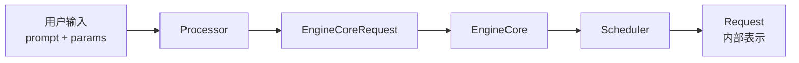
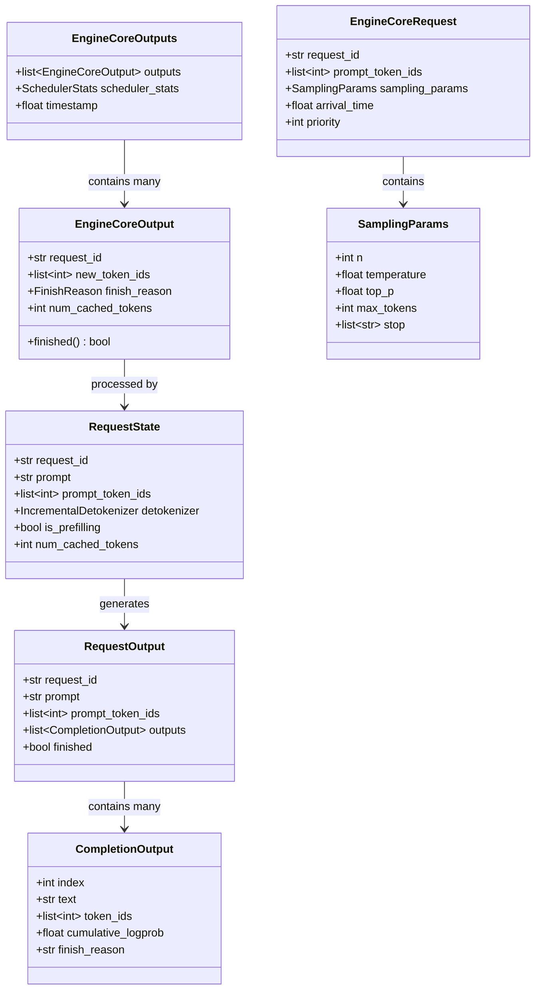
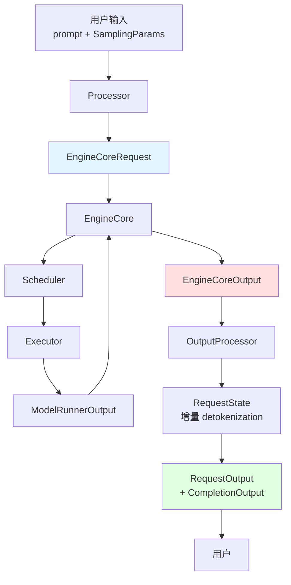
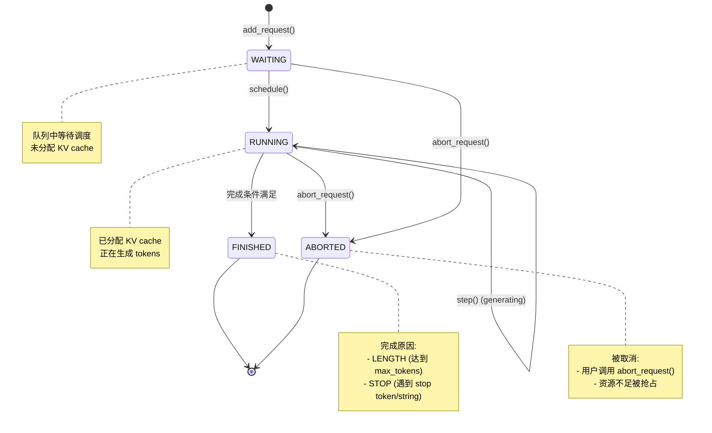

# vLLM-01-Engine模块-数据结构

## 核心数据结构列表

Engine 模块包含以下核心数据结构：

| 数据结构 | 类型 | 用途 | 更新时机 | 文件位置 |
|---------|------|------|---------|---------|
| `EngineCoreRequest` | msgspec.Struct | 引擎内部请求表示 | 请求添加时创建 | vllm/v1/engine/__init__.py |
| `EngineCoreOutput` | msgspec.Struct | 单个请求的输出 | 每次 step 生成 | vllm/v1/engine/__init__.py |
| `EngineCoreOutputs` | dataclass | 批量输出 + 统计信息 | 每次 step 生成 | vllm/v1/engine/__init__.py |
| `RequestState` | class | 请求状态跟踪 | 请求生命周期持续更新 | vllm/v1/engine/output_processor.py |
| `RequestOutput` | class | 返回给用户的输出 | 每次 step 生成 | vllm/outputs.py |
| `CompletionOutput` | class | 单个完成输出 | 每次 step 生成 | vllm/outputs.py |
| `SamplingParams` | class | 采样参数 | 请求创建时设置 | vllm/sampling_params.py |

---

## 数据结构详细说明

### 1. EngineCoreRequest

#### 基本信息

**用途**：表示提交给 EngineCore 的内部请求格式，经过 Processor 处理后的标准化请求表示。

**定义**：

```python
class EngineCoreRequest(
    msgspec.Struct,
    array_like=True,
    omit_defaults=True,
    gc=False
):
    """引擎核心请求结构"""
    
    request_id: str                                    # 请求唯一标识符
    prompt_token_ids: Optional[list[int]]              # prompt 的 token IDs
    mm_features: Optional[list[MultiModalFeatureSpec]] # 多模态特征
    sampling_params: Optional[SamplingParams]          # 采样参数
    pooling_params: Optional[PoolingParams]            # 池化参数（embedding 任务）
    eos_token_id: Optional[int]                        # EOS token ID
    arrival_time: float                                # 请求到达时间
    lora_request: Optional[LoRARequest]                # LoRA 适配器请求
    cache_salt: Optional[str]                          # 缓存盐（用于 cache invalidation）
    data_parallel_rank: Optional[int]                  # 数据并行 rank
    prompt_embeds: Optional[torch.Tensor] = None       # Prompt embeddings（如使用）
    client_index: int = 0                              # 客户端索引（前端扩展）
    current_wave: int = 0                              # 当前波次（DP 模式）
    priority: int = 0                                  # 请求优先级
    trace_headers: Optional[Mapping[str, str]] = None  # 追踪请求头
```

#### 字段说明表

| 字段 | 类型 | 必填 | 默认值 | 约束 | 说明 |
|------|------|------|--------|------|------|
| request_id | str | ✓ | - | 全局唯一 | 请求的唯一标识符，用于跟踪和输出匹配 |
| prompt_token_ids | list[int] | ✗ | None | 长度 ≤ max_model_len | 已 tokenize 的 prompt；与 prompt_embeds 二选一 |
| mm_features | list[MultiModalFeatureSpec] | ✗ | None | - | 多模态输入特征（图片、音频、视频） |
| sampling_params | SamplingParams | ✗ | None | - | 采样参数；与 pooling_params 二选一 |
| pooling_params | PoolingParams | ✗ | None | - | 池化参数（embedding 任务）；与 sampling_params 二选一 |
| eos_token_id | int | ✗ | None | 有效 token ID | EOS token ID，用于判断生成结束 |
| arrival_time | float | ✓ | - | > 0 | 请求到达时间戳（秒），用于调度和统计 |
| lora_request | LoRARequest | ✗ | None | - | LoRA 适配器信息，如需使用 LoRA 推理 |
| cache_salt | str | ✗ | None | - | 缓存盐值，用于区分相同 prompt 的不同缓存版本 |
| data_parallel_rank | int | ✗ | None | 0 ≤ rank < dp_size | 数据并行时的 rank 分配 |
| prompt_embeds | torch.Tensor | ✗ | None | shape: [seq_len, hidden_size] | 预计算的 prompt embeddings（替代 token IDs） |
| client_index | int | ✗ | 0 | ≥ 0 | 客户端索引，用于多前端场景 |
| current_wave | int | ✗ | 0 | ≥ 0 | 当前波次（DP 模式下避免竞态） |
| priority | int | ✗ | 0 | 任意整数 | 请求优先级，数值越大优先级越高 |
| trace_headers | dict | ✗ | None | - | OpenTelemetry 追踪头 |

#### 用途和更新时机

**创建时机**：
- 用户调用 `LLMEngine.add_request()` 时
- 经过 `Processor.process_inputs()` 处理

**更新时机**：
- 不更新（immutable，请求创建后不变）

**使用场景**：
1. Processor 将用户输入转换为 EngineCoreRequest
2. EngineCore 接收 EngineCoreRequest 并加入调度队列
3. Scheduler 根据 EngineCoreRequest 创建内部 Request 对象

#### 数据流向



---

### 2. EngineCoreOutput

#### 基本信息

**用途**：表示单个请求在某次 step 中的输出，包含新生成的 token、logprobs、完成状态等。

**定义**：

```python
class EngineCoreOutput(
    msgspec.Struct,
    array_like=True,
    omit_defaults=True,
    gc=False
):
    """单个请求的引擎输出"""
    
    request_id: str                                    # 请求 ID
    new_token_ids: list[int]                           # 新生成的 token IDs
    new_logprobs: Optional[LogprobsLists] = None       # 新 token 的 logprobs
    new_prompt_logprobs_tensors: Optional[LogprobsTensors] = None  # Prompt logprobs
    pooling_output: Optional[torch.Tensor] = None      # 池化输出（embedding）
    finish_reason: Optional[FinishReason] = None       # 完成原因
    stop_reason: Union[int, str, None] = None          # 停止原因
    events: Optional[list[EngineCoreEvent]] = None     # 事件列表
    kv_transfer_params: Optional[dict[str, Any]] = None # KV 传输参数
    trace_headers: Optional[Mapping[str, str]] = None  # 追踪头
    num_cached_tokens: int = 0                         # 缓存命中的 token 数
    
    @property
    def finished(self) -> bool:
        """是否完成"""
        return self.finish_reason is not None
```

#### 字段说明表

| 字段 | 类型 | 必填 | 默认值 | 说明 |
|------|------|------|--------|------|
| request_id | str | ✓ | - | 对应的请求 ID |
| new_token_ids | list[int] | ✓ | - | 本次 step 新生成的 token IDs（通常 1 个，speculative decoding 可能多个） |
| new_logprobs | LogprobsLists | ✗ | None | 新 token 的 logprobs（如 `logprobs > 0`） |
| new_prompt_logprobs_tensors | LogprobsTensors | ✗ | None | Prompt 的 logprobs（仅 prefill 阶段） |
| pooling_output | torch.Tensor | ✗ | None | 池化输出（embedding 任务），shape: [hidden_size] |
| finish_reason | FinishReason | ✗ | None | 完成原因：`LENGTH` / `STOP` / `ABORT` / `ERROR` |
| stop_reason | int/str | ✗ | None | 停止原因详情：stop token ID 或 stop string |
| events | list[EngineCoreEvent] | ✗ | None | 事件列表（如缓存命中、抢占等） |
| kv_transfer_params | dict | ✗ | None | KV 传输参数（disaggregated serving） |
| trace_headers | dict | ✗ | None | 追踪头（继承自请求） |
| num_cached_tokens | int | ✗ | 0 | Prefix Caching 命中的 token 数量 |

#### 用途和更新时机

**创建时机**：
- 每次 `EngineCore.get_output()` 时为每个活跃请求生成

**更新时机**：
- 每次 step 生成新的 EngineCoreOutput（不复用）

**使用场景**：
1. EngineCore 从 Scheduler 和 Executor 收集输出
2. OutputProcessor 处理 EngineCoreOutput，生成 RequestOutput
3. 用户通过 `step()` 获取最终的 RequestOutput

---

### 3. EngineCoreOutputs

#### 基本信息

**用途**：批量输出 + 统计信息的封装。

**定义**：

```python
@dataclass
class EngineCoreOutputs:
    """引擎核心输出集合"""
    
    outputs: list[EngineCoreOutput]      # 所有请求的输出
    scheduler_stats: Optional[SchedulerStats]  # 调度器统计信息
    timestamp: float                     # 时间戳
```

#### 字段说明表

| 字段 | 类型 | 必填 | 说明 |
|------|------|------|------|
| outputs | list[EngineCoreOutput] | ✓ | 本次 step 所有请求的输出列表 |
| scheduler_stats | SchedulerStats | ✗ | 调度器统计信息（队列长度、缓存命中率等） |
| timestamp | float | ✓ | 输出生成的时间戳（秒） |

---

### 4. RequestState

#### 基本信息

**用途**：跟踪单个请求在 OutputProcessor 中的状态，用于增量 detokenization 和输出聚合。

**定义**：

```python
class RequestState:
    """请求状态（OutputProcessor 内部）"""
    
    def __init__(
        self,
        request_id: str,
        parent_req: Optional[ParentRequest],
        request_index: int,
        lora_name: Optional[str],
        output_kind: RequestOutputKind,
        prompt: Optional[str],
        prompt_token_ids: Optional[list[int]],
        prompt_embeds: Optional[torch.Tensor],
        logprobs_processor: Optional[LogprobsProcessor],
        detokenizer: Optional[IncrementalDetokenizer],
        max_tokens_param: Optional[int],
        arrival_time: float,
        queue: Optional[RequestOutputCollector],
        log_stats: bool,
        top_p: Optional[float] = None,
        n: Optional[int] = None,
        temperature: Optional[float] = None,
    ):
        self.request_id = request_id
        self.parent_req = parent_req                 # 父请求（n > 1 时）
        self.request_index = request_index           # 子请求索引
        self.lora_name = lora_name                   # LoRA 名称
        self.output_kind = output_kind               # 输出类型
        self.prompt = prompt                         # 原始 prompt 文本
        self.prompt_token_ids = prompt_token_ids     # Prompt token IDs
        self.prompt_embeds = prompt_embeds           # Prompt embeddings
        self.prompt_len = ...                        # Prompt 长度
        self.logprobs_processor = logprobs_processor # Logprobs 处理器
        self.detokenizer = detokenizer               # 增量 detokenizer
        self.max_tokens_param = max_tokens_param     # max_tokens 参数
        self.top_p = top_p
        self.n = n
        self.temperature = temperature
        self.is_prefilling = True                    # 是否在 prefill 阶段
        self.queue = queue                           # 输出队列
        self.num_cached_tokens = 0                   # 缓存命中数
        self.stats = RequestStateStats(...)          # 统计信息
```

#### 字段说明表

| 字段 | 类型 | 必填 | 说明 |
|------|------|------|------|
| request_id | str | ✓ | 请求 ID |
| parent_req | ParentRequest | ✗ | 父请求（n > 1 时，用于聚合多个候选） |
| request_index | int | ✓ | 子请求索引（n > 1 时） |
| lora_name | str | ✗ | LoRA 适配器名称 |
| output_kind | RequestOutputKind | ✓ | 输出类型：`COMPLETION` / `POOLING` / `CLASSIFICATION` / `SCORING` |
| prompt | str | ✗ | 原始 prompt 文本 |
| prompt_token_ids | list[int] | ✗ | Prompt 的 token IDs |
| prompt_embeds | torch.Tensor | ✗ | Prompt embeddings |
| prompt_len | int | ✓ | Prompt 长度 |
| logprobs_processor | LogprobsProcessor | ✗ | Logprobs 处理器 |
| detokenizer | IncrementalDetokenizer | ✗ | 增量 detokenizer（流式生成文本） |
| max_tokens_param | int | ✗ | max_tokens 参数（用于进度计算） |
| is_prefilling | bool | ✓ | 是否在 prefill 阶段 |
| queue | RequestOutputCollector | ✗ | 输出队列（流式输出） |
| num_cached_tokens | int | ✓ | 缓存命中的 token 数 |
| stats | RequestStateStats | ✗ | 统计信息（TTFT、TPOT 等） |

#### 用途和更新时机

**创建时机**：
- `LLMEngine.add_request()` 时，通过 `OutputProcessor.add_request()` 创建

**更新时机**：
- 每次 `OutputProcessor.process_outputs()` 时更新
- 更新内容：新 token IDs、detokenization、logprobs、完成状态

**使用场景**：
1. 跟踪请求的 detokenization 状态
2. 增量生成文本（避免重复 detokenize）
3. 收集统计信息（TTFT、TPOT）
4. 检测 stop strings

---

### 5. RequestOutput

#### 基本信息

**用途**：返回给用户的最终输出结构，包含生成的文本、token IDs、logprobs、完成状态等。

**定义**：

```python
class RequestOutput:
    """请求输出（返回给用户）"""
    
    def __init__(
        self,
        request_id: str,
        prompt: Optional[str],
        prompt_token_ids: list[int],
        prompt_logprobs: Optional[PromptLogprobs],
        outputs: list[CompletionOutput],
        finished: bool,
        metadata: Optional[RequestMetadata] = None,
    ):
        self.request_id = request_id
        self.prompt = prompt
        self.prompt_token_ids = prompt_token_ids
        self.prompt_logprobs = prompt_logprobs
        self.outputs = outputs                 # list[CompletionOutput]
        self.finished = finished
        self.metadata = metadata
```

#### 字段说明表

| 字段 | 类型 | 必填 | 说明 |
|------|------|------|------|
| request_id | str | ✓ | 请求 ID |
| prompt | str | ✗ | 原始 prompt 文本 |
| prompt_token_ids | list[int] | ✓ | Prompt 的 token IDs |
| prompt_logprobs | PromptLogprobs | ✗ | Prompt 的 logprobs（如 `prompt_logprobs > 0`） |
| outputs | list[CompletionOutput] | ✓ | 生成的输出列表（n 个候选） |
| finished | bool | ✓ | 是否完成 |
| metadata | RequestMetadata | ✗ | 元数据（统计信息、事件等） |

---

### 6. CompletionOutput

#### 基本信息

**用途**：单个完成输出（当 n > 1 时，RequestOutput 包含多个 CompletionOutput）。

**定义**：

```python
class CompletionOutput:
    """单个完成输出"""
    
    def __init__(
        self,
        index: int,
        text: str,
        token_ids: list[int],
        cumulative_logprob: float,
        logprobs: Optional[list[dict]],
        finish_reason: Optional[str],
        stop_reason: Optional[Union[int, str]],
        lora_request: Optional[LoRARequest] = None,
    ):
        self.index = index
        self.text = text
        self.token_ids = token_ids
        self.cumulative_logprob = cumulative_logprob
        self.logprobs = logprobs
        self.finish_reason = finish_reason
        self.stop_reason = stop_reason
        self.lora_request = lora_request
```

#### 字段说明表

| 字段 | 类型 | 必填 | 说明 |
|------|------|------|------|
| index | int | ✓ | 输出索引（0 到 n-1） |
| text | str | ✓ | 生成的文本 |
| token_ids | list[int] | ✓ | 生成的 token IDs（增量或累积，取决于配置） |
| cumulative_logprob | float | ✓ | 累积 log 概率 |
| logprobs | list[dict] | ✗ | 每个 token 的 logprobs 详细信息 |
| finish_reason | str | ✗ | 完成原因：`"length"` / `"stop"` / `"abort"` |
| stop_reason | int/str | ✗ | 停止原因详情：stop token ID 或 stop string |
| lora_request | LoRARequest | ✗ | 使用的 LoRA 适配器 |

---

### 7. SamplingParams

#### 基本信息

**用途**：控制生成过程的采样参数。

**定义**：

```python
class SamplingParams:
    """采样参数"""
    
    def __init__(
        self,
        n: int = 1,
        best_of: Optional[int] = None,
        presence_penalty: float = 0.0,
        frequency_penalty: float = 0.0,
        repetition_penalty: float = 1.0,
        temperature: float = 1.0,
        top_p: float = 1.0,
        top_k: int = -1,
        min_p: float = 0.0,
        seed: Optional[int] = None,
        use_beam_search: bool = False,
        length_penalty: float = 1.0,
        early_stopping: Union[bool, str] = False,
        stop: Optional[Union[str, list[str]]] = None,
        stop_token_ids: Optional[list[int]] = None,
        include_stop_str_in_output: bool = False,
        ignore_eos: bool = False,
        max_tokens: Optional[int] = None,
        min_tokens: int = 0,
        logprobs: Optional[int] = None,
        prompt_logprobs: Optional[int] = None,
        detokenize: bool = True,
        skip_special_tokens: bool = True,
        spaces_between_special_tokens: bool = True,
        logits_processors: Optional[list[LogitsProcessor]] = None,
    ):
        ...
```

#### 字段说明表（常用字段）

| 字段 | 类型 | 默认值 | 约束 | 说明 |
|------|------|--------|------|------|
| n | int | 1 | > 0 | 生成的候选数量 |
| temperature | float | 1.0 | > 0 | 采样温度（0 = greedy，> 1 = 更随机） |
| top_p | float | 1.0 | 0 < p ≤ 1 | Nucleus sampling 阈值 |
| top_k | int | -1 | -1 或 > 0 | Top-K sampling（-1 = 不限制） |
| max_tokens | int | None | > 0 | 最大生成 token 数（None = 直到 EOS） |
| stop | str/list[str] | None | - | 停止字符串 |
| stop_token_ids | list[int] | None | 有效 token IDs | 停止 token IDs |
| presence_penalty | float | 0.0 | -2.0 ~ 2.0 | 出现惩罚（惩罚重复） |
| frequency_penalty | float | 0.0 | -2.0 ~ 2.0 | 频率惩罚（惩罚高频词） |
| repetition_penalty | float | 1.0 | > 0 | 重复惩罚（> 1 惩罚，< 1 鼓励） |
| logprobs | int | None | > 0 | 返回 Top-N logprobs |
| seed | int | None | - | 随机种子（可复现） |

---

## 数据结构关系图（类图）



---

## 数据流图



**流程说明**：

1. **输入转换**：用户输入 → Processor → EngineCoreRequest
2. **调度与执行**：EngineCoreRequest → EngineCore → Scheduler + Executor
3. **输出生成**：ModelRunnerOutput → EngineCoreOutput
4. **输出处理**：EngineCoreOutput → OutputProcessor → RequestState → RequestOutput
5. **返回用户**：RequestOutput（包含 CompletionOutput）

---

## 状态转换图



---

## 字段映射与版本演进

### EngineCoreRequest 映射

| 用户 API 字段 | EngineCoreRequest 字段 | 转换逻辑 |
|--------------|----------------------|---------|
| `prompt` (str) | `prompt_token_ids` (list[int]) | Tokenizer.encode() |
| `prompt` (dict with multi_modal_data) | `mm_features` | 多模态处理器提取特征 |
| `sampling_params.max_tokens` | `sampling_params.max_tokens` | 直接复制 |
| `arrival_time` | `arrival_time` | 默认 `time.time()` |
| `priority` | `priority` | 直接复制（默认 0） |

### RequestOutput 映射

| EngineCoreOutput 字段 | RequestOutput 字段 | 转换逻辑 |
|----------------------|-------------------|---------|
| `new_token_ids` | `CompletionOutput.token_ids` | 累积或增量（取决于配置） |
| N/A（需 detokenize） | `CompletionOutput.text` | Tokenizer.decode() |
| `finish_reason` | `CompletionOutput.finish_reason` | 枚举转字符串 |
| `num_cached_tokens` | `RequestMetadata.cached_tokens` | 统计信息 |

### 版本兼容

**V0 → V1 变更**：

| V0 类型 | V1 类型 | 变更说明 |
|---------|---------|---------|
| `Sequence` | `Request` | 重命名，字段大幅精简 |
| `SequenceGroup` | N/A | 移除（V1 不使用 SequenceGroup） |
| `SequenceOutput` | `EngineCoreOutput` | 重命名，结构简化 |
| `SequenceGroupOutput` | `RequestOutput` | 重命名，去除 group 概念 |

**兼容性保证**：
- 用户 API（`LLM`、`LLMEngine`）完全兼容
- 内部数据结构不保证兼容（V1 架构重构）

---

## 性能考虑

### 内存占用

| 数据结构 | 内存占用 | 说明 |
|---------|---------|------|
| EngineCoreRequest | ~1 KB | 小对象，主要是字段引用 |
| RequestState | ~2 KB + detokenizer state | 包含增量 detokenization 状态 |
| CompletionOutput | ~4 KB / 1000 tokens | 主要是 token IDs 和 text |

**优化策略**：
1. **零拷贝**：EngineCoreOutput 使用 msgspec.Struct，支持零拷贝序列化
2. **增量 detokenization**：避免重复 detokenize 整个序列
3. **Lazy evaluation**：logprobs 按需计算

### 序列化性能

| 数据结构 | 序列化方式 | 性能 |
|---------|-----------|------|
| EngineCoreRequest | msgspec | ~1 μs / request |
| EngineCoreOutput | msgspec | ~0.5 μs / output |
| RequestOutput | Python dataclass | ~5 μs / output |

**msgspec 优势**：
- 比 pickle 快 10-20x
- 比 JSON 快 5-10x
- 支持零拷贝（array_like=True）

---

## 使用示例

### 创建 EngineCoreRequest

```python
from vllm.v1.engine import EngineCoreRequest
from vllm.sampling_params import SamplingParams
import time

sampling_params = SamplingParams(
    temperature=0.8,
    top_p=0.95,
    max_tokens=100,
    stop=["</s>"]
)

request = EngineCoreRequest(
    request_id="request-123",
    prompt_token_ids=[1, 2345, 678, 90],  # 已 tokenize
    mm_features=None,                      # 无多模态输入
    sampling_params=sampling_params,
    pooling_params=None,
    eos_token_id=2,                       # </s>
    arrival_time=time.time(),
    lora_request=None,
    cache_salt=None,
    data_parallel_rank=None,
    priority=5,  # 高优先级
)
```

### 处理 EngineCoreOutput

```python
from vllm.v1.engine import EngineCoreOutput, FinishReason

output = EngineCoreOutput(
    request_id="request-123",
    new_token_ids=[42],  # 本次生成 1 个 token
    new_logprobs=None,
    finish_reason=None,  # 未完成
    num_cached_tokens=10,  # 10 个 token 来自缓存
)

if output.finished:
    print(f"请求完成，原因：{output.finish_reason}")
else:
    print(f"生成了 {len(output.new_token_ids)} 个 token")
    print(f"缓存命中：{output.num_cached_tokens} tokens")
```

### 构造 RequestOutput

```python
from vllm.outputs import RequestOutput, CompletionOutput

completion = CompletionOutput(
    index=0,
    text="The capital of France is Paris.",
    token_ids=[464, 3139, 310, 3444, 338, 3681, 29889],
    cumulative_logprob=-5.23,
    logprobs=None,
    finish_reason="stop",
    stop_reason="</s>",
)

request_output = RequestOutput(
    request_id="request-123",
    prompt="What is the capital of France?",
    prompt_token_ids=[1, 1724, 338, 278, 7483, 310, 3444, 29973],
    prompt_logprobs=None,
    outputs=[completion],
    finished=True,
)

print(f"生成的文本: {request_output.outputs[0].text}")
print(f"完成原因: {request_output.outputs[0].finish_reason}")
```

