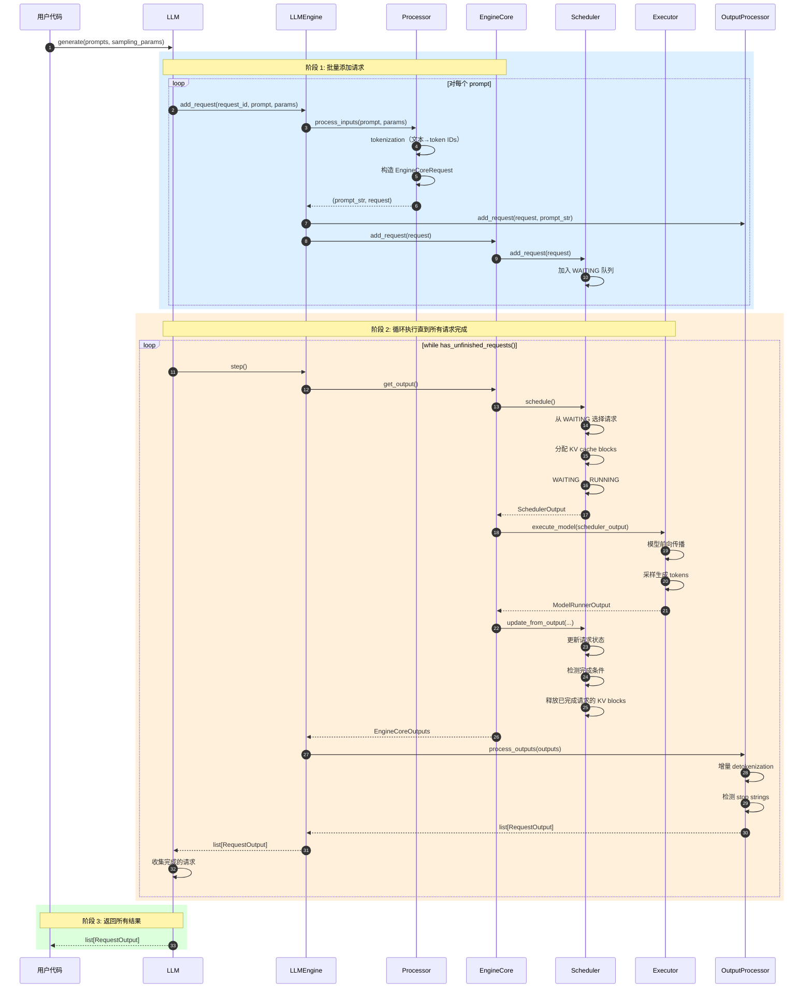
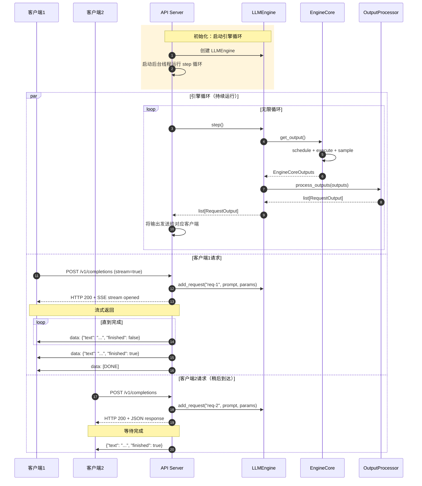
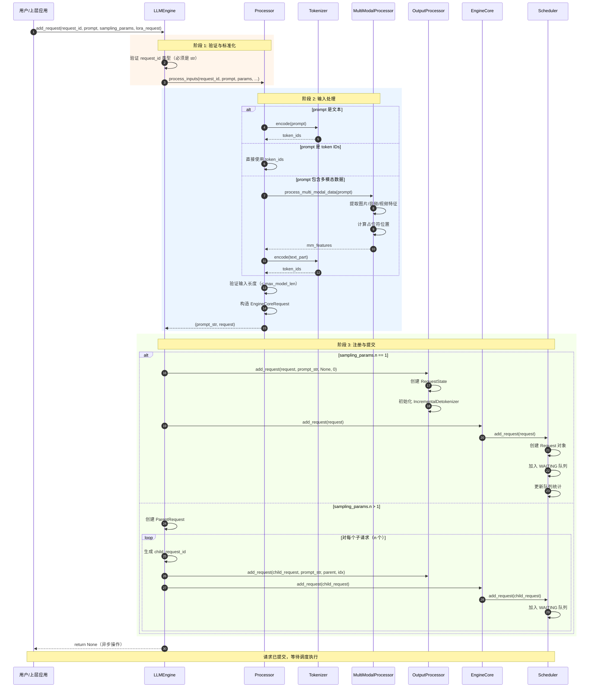
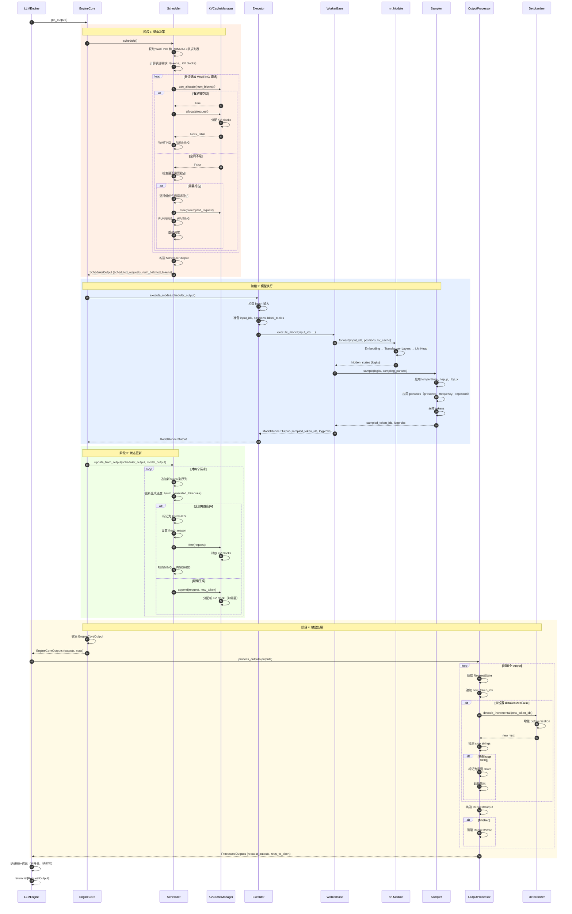
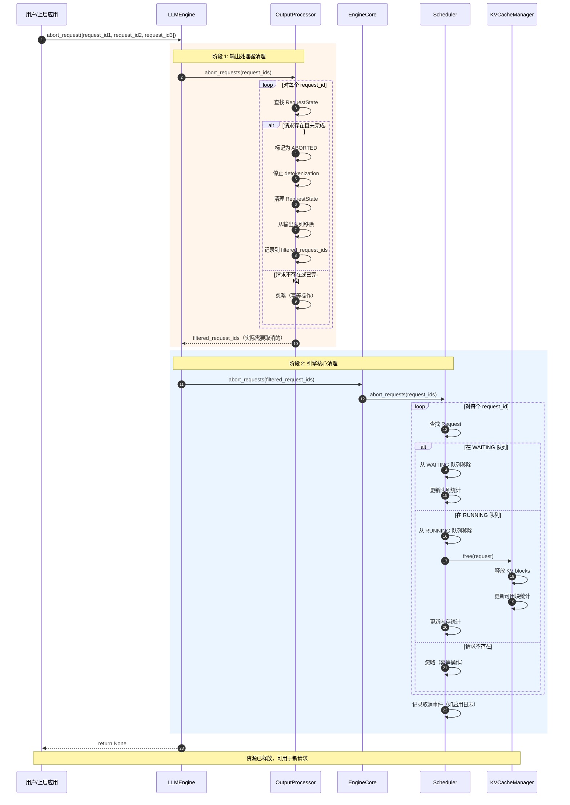

# vLLM-01-Engine模块-时序图

## 典型场景列表

Engine 模块包含以下典型执行场景：

| 场景编号 | 场景名称 | 参与组件 | 关键点 | 适用情况 |
|---------|---------|---------|--------|---------|
| 1 | 离线批量推理 | LLM、Engine、EngineCore | 批量提交、批量执行 | 批处理任务 |
| 2 | 在线流式服务 | Engine、Step循环、OutputProcessor | 持续循环、流式输出 | API Server |
| 3 | 请求添加与调度 | Engine、Processor、EngineCore、Scheduler | Tokenization、队列管理 | 每个新请求 |
| 4 | 单次 Step 执行 | Engine、EngineCore、Scheduler、Executor | 调度→执行→采样→输出 | 每次迭代 |
| 5 | 请求取消 | Engine、OutputProcessor、EngineCore、Scheduler | 资源释放、状态清理 | 用户取消或超时 |

---

## 场景 1：离线批量推理

### 场景描述

**目标**：批量处理多个 prompt，一次性返回所有结果。

**适用场景**：
- 批量数据处理
- 模型评估
- 离线推理任务

**关键特征**：
- 使用 `LLM` 类（高层 API）
- 批量提交所有请求
- 阻塞等待所有请求完成
- 一次性返回所有结果

### 时序图

### 关键点说明

#### 1. 批量提交策略

- **目的**：一次性提交所有请求，利用 Continuous Batching 并发执行
- **优势**：最大化 GPU 利用率，提高吞吐量
- **实现**：循环调用 `add_request()`，请求立即加入 WAITING 队列
- **性能**：批量添加本身是轻量级操作（仅 tokenization），不阻塞

#### 2. 调度与执行循环

- **Continuous Batching**：每次 step 可以同时处理多个请求的不同阶段（prefill + decode）
- **动态批大小**：根据 KV cache 可用性和 `max_num_seqs` 动态调整
- **KV cache 管理**：PagedAttention 按需分配和释放块

#### 3. 边界与约束

- **内存限制**：KV cache 不足时，新请求保持 WAITING 状态
- **超时处理**：无内置超时，用户需自行实现
- **错误处理**：任一请求失败会抛出异常，中断整个批次

#### 4. 异常与回退

- **OOM（内存不足）**：引擎终止，需外部重启
- **模型执行失败**：异常向上传播，捕获后可重试
- **请求失败**：不影响其他请求（isolated failure）

#### 5. 性能特征

- **吞吐量**：取决于批大小和模型大小，典型 10-100 tokens/s/request
- **延迟**：先到先完成，无优先级保证
- **资源利用**：GPU 利用率 > 90%（大批量）

#### 6. 版本兼容

- **V0 兼容**：`LLM.generate()` API 完全兼容
- **V1 优化**：底层使用 V1 架构，性能提升 20-50%

---

## 场景 2：在线流式服务

### 场景描述

**目标**：持续运行引擎循环，动态接收和处理请求，流式返回结果。

**适用场景**：
- OpenAI API Server
- 实时对话系统
- 流式生成服务

**关键特征**：
- 使用 `LLMEngine.step()` 循环
- 请求动态添加和取消
- 流式返回增量输出
- 无限循环（直到服务停止）

### 时序图

### 关键点说明

#### 1. 持续循环架构

- **目的**：保持引擎持续运行，无需等待请求
- **实现**：后台线程 / asyncio 任务运行 `step()` 循环
- **频率**：高频调用（10-100 Hz），取决于负载
- **休眠策略**：无请求时可短暂休眠（避免 CPU 空转）

#### 2. 动态请求管理

- **并发添加**：多个客户端同时调用 `add_request()`，线程安全
- **流式输出**：每次 step 返回增量输出，立即发送给客户端
- **请求取消**：客户端断开连接时调用 `abort_request()`

#### 3. 边界与约束

- **并发限制**：`max_num_seqs` 限制同时处理的请求数
- **队列管理**：WAITING 队列无上限（可能 OOM）
- **公平性**：默认 FCFS，支持优先级调度

#### 4. 异常与回退

- **客户端断开**：调用 `abort_request()` 释放资源
- **引擎失败**：所有客户端返回 500 错误，需重启服务
- **请求超时**：上层实现超时检测和取消

#### 5. 性能特征

- **延迟**：低延迟（5-50 ms TTFT）
- **吞吐量**：高吞吐（100-1000 requests/s，取决于 batch size）
- **资源利用**：动态调整，负载低时 GPU 利用率降低

#### 6. 版本兼容

- **V1 优化**：Zero-downtime 配置更新（V0 不支持）
- **API 兼容**：`step()` 接口保持不变

---

## 场景 3：请求添加与调度

### 场景描述

**目标**：将用户输入转换为内部请求，并加入调度队列。

**适用场景**：每个新请求的初始化流程

**关键特征**：
- 输入预处理（tokenization、多模态处理）
- 请求验证和转换
- 加入调度队列
- 快速返回（异步操作）

### 时序图

### 关键点说明

#### 1. 输入预处理流程

- **Tokenization**：文本转 token IDs，O(prompt_len) 复杂度
- **多模态处理**：提取特征（图片：ResNet/CLIP，音频：Whisper），耗时较长
- **验证**：检查 prompt 长度、参数有效性
- **缓存**：支持预处理结果缓存（多模态特征）

#### 2. n > 1 的处理

- **ParentRequest**：管理多个子请求
- **子请求**：独立调度和执行，共享 prompt 缓存
- **输出聚合**：OutputProcessor 负责聚合子请求输出

#### 3. 边界与约束

- **最大长度**：prompt_len + max_tokens ≤ max_model_len
- **并发限制**：无并发限制（可能导致 WAITING 队列过长）
- **幂等性**：重复调用会创建多个请求（非幂等）

#### 4. 异常与回退

- **Tokenization 失败**：抛出 `ValueError`（无效字符、编码错误）
- **长度超限**：抛出 `ValueError`（prompt 过长）
- **多模态错误**：抛出 `ValueError`（格式错误、特征提取失败）

#### 5. 性能特征

- **Tokenization**：CPU 瓶颈，1-10 ms（取决于 prompt 长度）
- **多模态处理**：GPU 计算，50-500 ms（取决于模态和模型）
- **队列添加**：O(1)，<0.1 ms

#### 6. 优化策略

- **批量 tokenization**：多个请求批量 tokenize
- **多模态缓存**：相同输入复用特征
- **异步处理**：tokenization 和多模态处理可异步

---

## 场景 4：单次 Step 执行

### 场景描述

**目标**：执行一次引擎迭代，完成调度、模型执行、采样、输出处理。

**适用场景**：每次 step 调用的核心流程

**关键特征**：
- 调度决策（选择要执行的请求）
- KV cache 分配
- 模型前向传播
- Token 采样
- 增量 detokenization
- 输出返回

### 时序图

### 关键点说明

#### 1. 调度策略

- **FCFS**：先到先服务，公平但无优先级
- **Priority**：优先级调度，高优先级优先执行
- **抢占**：内存不足时抢占低优先级请求
- **Chunked Prefill**：长 prompt 分块处理，降低首 token 延迟

#### 2. KV Cache 管理

- **按需分配**：每个序列动态分配 KV blocks
- **PagedAttention**：块级内存管理，减少碎片
- **Prefix Caching**：共享前缀块，节省内存
- **抢占与恢复**：SWAP、RECOMPUTE 两种策略

#### 3. 边界与约束

- **批大小**：`max_num_seqs` 限制同时执行的请求数
- **Token 数**：`max_num_batched_tokens` 限制单批 token 总数
- **内存限制**：KV cache 总大小受 GPU 内存限制

#### 4. 异常与回退

- **OOM**：CUDA OOM 导致引擎终止
- **模型错误**：前向传播失败，异常向上传播
- **采样错误**：无效 token ID，回退到默认值

#### 5. 性能特征

- **调度开销**：< 1 ms（O(num_requests)）
- **模型执行**：10-100 ms（取决于模型大小和批大小）
- **采样开销**：< 1 ms（O(vocab_size)）
- **Detokenization**：< 1 ms（O(num_new_tokens)）

#### 6. 优化技术

- **CUDA Graph**：减少 kernel 启动开销（10-20% 提升）
- **FlashAttention**：优化 attention 计算（2-4x 提升）
- **Continuous Batching**：动态批处理（2-10x 吞吐提升）
- **Speculative Decoding**：推测解码（2-3x 延迟降低）

---

## 场景 5：请求取消

### 场景描述

**目标**：立即终止指定请求，释放相关资源。

**适用场景**：
- 用户手动取消
- 客户端断开连接
- 请求超时
- 资源不足时主动取消低优先级请求

**关键特征**：
- 快速响应（< 1 ms）
- 资源立即释放
- 不影响其他请求
- 幂等操作

### 时序图

### 关键点说明

#### 1. 两阶段清理

- **OutputProcessor**：停止 detokenization，清理输出状态
- **EngineCore/Scheduler**：从队列移除，释放 KV cache
- **顺序重要**：先清理输出，避免后续 step 继续处理

#### 2. 幂等性保证

- **重复取消**：多次取消同一请求不会产生副作用
- **不存在的请求**：忽略不存在的 request_id
- **已完成的请求**：忽略已完成的请求

#### 3. 边界与约束

- **并发安全**：可以在 step 执行期间调用
- **生效时机**：下次 step 生效（不会中断当前 step）
- **批量取消**：支持批量取消多个请求

#### 4. 异常与回退

- **无异常**：取消操作不会抛出异常（容错设计）
- **部分失败**：某些请求取消失败不影响其他请求

#### 5. 性能特征

- **开销**：O(k)，k 为取消的请求数量
- **延迟**：< 1 ms（非常快）
- **内存释放**：立即释放 KV cache，可用于新请求

#### 6. 使用场景

- **客户端断开**：HTTP 连接断开时立即取消
- **超时取消**：请求超时后主动取消
- **资源回收**：低优先级请求在高峰期被取消
- **用户操作**：用户手动停止生成

---

## 场景对比表

| 特性 | 离线批量推理 | 在线流式服务 | 请求添加 | 单次 Step | 请求取消 |
|------|------------|------------|---------|----------|---------|
| **调用频率** | 一次性 | 持续循环 | 每个请求 | 高频（10-100 Hz） | 按需 |
| **阻塞性** | 阻塞 | 非阻塞 | 非阻塞 | 阻塞（模型执行） | 非阻塞 |
| **资源使用** | 高（满批） | 动态 | 低 | 高 | 低 |
| **延迟** | 中（批量） | 低（流式） | 低 | 中 | 极低 |
| **吞吐量** | 高 | 高 | N/A | 中 | N/A |
| **复杂度** | 中 | 高 | 中 | 高 | 低 |
| **适用场景** | 批处理 | API Server | 所有 | 所有 | 取消/超时 |

---

## 性能优化建议

### 离线批量推理优化

1. **增大批大小**：`max_num_seqs=64`
2. **启用 CUDA Graph**：`cuda_graph_sizes=[1, 2, 4, 8, 16, 32]`
3. **启用 Prefix Caching**：`enable_prefix_caching=True`
4. **优化 tokenization**：预先 tokenize 所有 prompts

### 在线流式服务优化

1. **减小批大小**：`max_num_seqs=8`
2. **启用 Chunked Prefill**：`chunked_prefill_enabled=True`
3. **优先级调度**：设置 `priority` 参数
4. **异步 API**：使用 `AsyncLLMEngine`

### 内存优化

1. **启用 PagedAttention**：默认启用
2. **启用 Prefix Caching**：`enable_prefix_caching=True`
3. **调整 block_size**：`block_size=16`（默认）
4. **启用抢占**：`swap_space=4GB`（CPU offload）

### 延迟优化

1. **Speculative Decoding**：使用小模型加速
2. **Chunked Prefill**：减少首 token 延迟
3. **Flash Attention**：自动启用（SM 8.0+）
4. **减少批大小**：降低排队延迟

