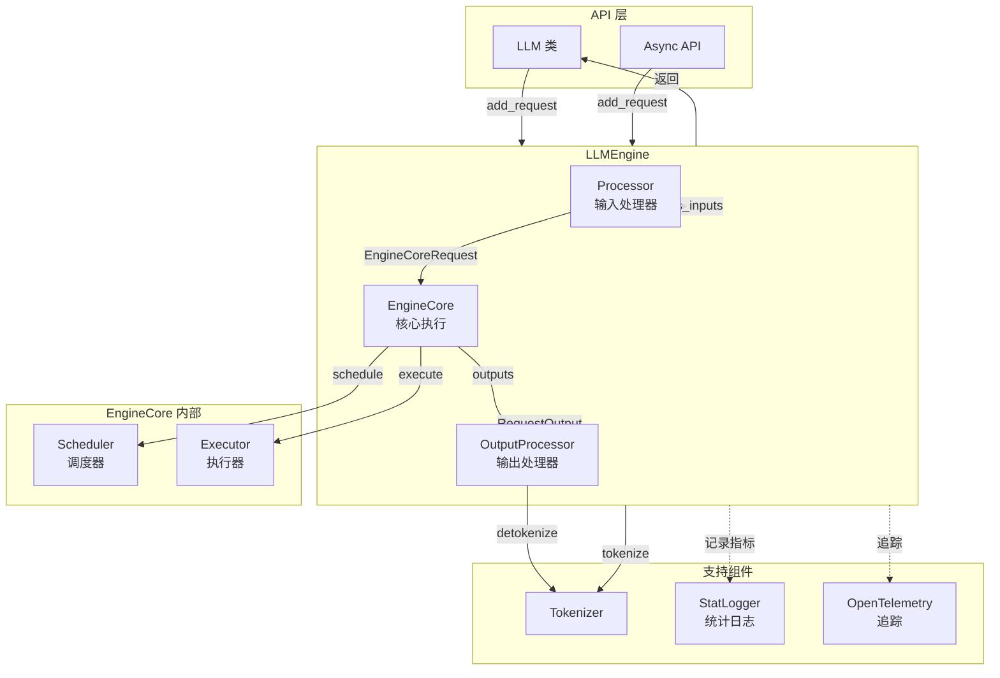

# vLLM-01-Engine模块-概览

## 模块职责

Engine 模块是 vLLM 的核心引擎层，负责：

- 接收和管理推理请求的生命周期
- 协调输入处理（Processor）、核心执行（EngineCore）和输出处理（OutputProcessor）
- 提供离线推理（LLMEngine）和在线服务（AsyncLLMEngine）两种模式
- 管理引擎的初始化、配置和关闭流程
- 收集和报告性能指标

## 输入与输出

### 输入
- **请求信息**：`request_id`（唯一标识）、`prompt`（文本或 token IDs）、`sampling_params`（采样参数）
- **配置信息**：`VllmConfig`（包含模型、缓存、并行等配置）
- **可选参数**：`lora_request`（LoRA 适配器）、`trace_headers`（追踪信息）、`priority`（优先级）

### 输出
- **RequestOutput**：包含生成的 token、logprobs、完成状态
- **PoolingRequestOutput**：用于 embedding 任务
- **性能指标**：吞吐量、延迟、缓存命中率等

## 上下游依赖

### 上游（调用方）
- `vllm.entrypoints.llm.LLM`：离线推理接口
- `vllm.entrypoints.openai.api_server`：OpenAI API Server
- 用户应用程序

### 下游（被调用）
- `Processor`：输入处理，tokenization 和多模态处理
- `EngineCore`：核心执行循环，调度和模型执行
- `OutputProcessor`：输出处理，detokenization
- `Executor`：模型执行器，驱动 Worker

## 生命周期

### 初始化阶段
1. 解析和验证配置（`VllmConfig`）
2. 初始化 tokenizer
3. 创建 `Processor`（输入处理器）
4. 创建 `OutputProcessor`（输出处理器）
5. 创建 `EngineCore`（核心执行器）
6. 初始化统计日志管理器（可选）

### 运行阶段
1. 接收请求（`add_request`）
2. 处理输入（`Processor.process_inputs`）
3. 加入调度队列
4. 执行引擎循环（`step`）
5. 返回结果（流式或批量）

### 关闭阶段
1. 等待所有请求完成
2. 释放 EngineCore 资源
3. 销毁分布式进程组（如果有）
4. 记录最终统计信息

## 架构图



### 架构说明

#### 1. 图意概述
Engine 模块采用三层处理模式：输入处理（Processor）→ 核心执行（EngineCore）→ 输出处理（OutputProcessor）。请求从 API 层进入 LLMEngine，经过 tokenization 后提交给 EngineCore，EngineCore 通过 Scheduler 调度和 Executor 执行，最后通过 OutputProcessor 完成 detokenization 并返回结果。

#### 2. 关键接口

**LLMEngine 核心方法**：
- `add_request(request_id, prompt, params)`: 添加新请求
- `abort_request(request_ids)`: 取消请求
- `step()`: 执行一个引擎步骤
- `get_metrics()`: 获取性能指标

**Processor 接口**：
- `process_inputs(request_id, prompt, params)`: 处理输入，返回 `EngineCoreRequest`

**EngineCore 接口**：
- `add_request(request)`: 添加请求到调度队列
- `step()`: 调度并执行一批请求
- `abort_requests(request_ids)`: 取消请求

**OutputProcessor 接口**：
- `add_request(request, prompt_str, parent_req, index)`: 注册请求
- `process_outputs(outputs)`: 处理输出，返回 `RequestOutput`

#### 3. 边界与约束

**并发限制**：
- 最大并发请求数：`max_num_seqs`（默认 256）
- 最大批次 token 数：`max_num_batched_tokens`（默认 8192）
- 受 KV 缓存容量限制

**超时机制**：
- 请求级超时：通过 `arrival_time` 计算
- 引擎循环超时：`POLLING_TIMEOUT_S = 2.5`秒

**幂等性**：
- 请求通过全局唯一 `request_id` 标识
- 重复添加相同 `request_id` 会被拒绝
- 取消操作幂等（多次取消同一请求无副作用）

**顺序保证**：
- 单个请求的输出按生成顺序返回
- 不同请求之间无顺序保证（并行执行）

#### 4. 异常处理

**输入异常**：
- Tokenization 失败：抛出 `ValueError`
- 无效参数：抛出 `ValidationError`
- 超长序列：抛出或截断（根据配置）

**执行异常**：
- Worker 崩溃：整个引擎不可用，需重启
- OOM：触发抢占或拒绝新请求
- 超时：返回部分结果，标记 `finished=False`

**降级策略**：
- 禁用 CUDA Graph：提高稳定性
- 减小批次大小：降低内存压力
- 禁用 Prefix Caching：简化调度

#### 5. 性能特性

**热路径优化**：
- `step()` 方法是性能关键路径
- Processor 和 OutputProcessor 设计为轻量级
- EngineCore 通过 CUDA Graph 优化 kernel launch
- 输出处理与下一个 step 可并行

**容量规划**：
- KV 缓存容量 = `num_gpu_blocks × block_size × 2 × num_layers × num_heads × head_dim`
- 典型配置：Llama-70B，fp16，90% GPU 内存利用率 → ~2000 个 block（32K tokens）

**可扩展性**：
- 支持张量并行（TP）：线性扩展（通信开销 <10%）
- 支持流水线并行（PP）：近线性扩展（气泡 <15%）
- 支持数据并行（DP）：完全独立，无通信

#### 6. 兼容性

**版本兼容**：
- V0 → V1 API 保持兼容
- `EngineArgs` → `VllmConfig` 平滑迁移
- `LLM` 类接口稳定

**硬件兼容**：
- CUDA: SM 7.0+（V100+）
- ROCm: gfx908+（MI100+）
- CPU: AVX2+
- TPU: v5e+

## 核心算法与流程

### 引擎循环（step）

```python
def step(self) -> list[RequestOutput]:
    # 1. 调度：选择本批次要处理的请求
    scheduler_output = self.scheduler.schedule()
    
    # 2. 执行：运行模型前向传播和采样
    model_output = self.executor.execute_model(scheduler_output)
    
    # 3. 更新：更新请求状态
    engine_outputs = self.scheduler.update_from_output(
        scheduler_output, model_output)
    
    # 4. 输出处理：detokenization 和结果封装
    request_outputs = self.output_processor.process_outputs(engine_outputs)
    
    return request_outputs
```

**算法说明**：
- **目的**：每个 step 执行一次模型前向传播，生成一批 token
- **输入**：调度器状态（waiting/running 队列）
- **输出**：本 step 生成的所有 RequestOutput
- **复杂度**：O(n) for n = 当前运行请求数；实际瓶颈在模型前向传播

### 请求生命周期管理

```python
def add_request(self, request_id, prompt, params):
    # 1. 输入处理
    prompt_str, request = self.processor.process_inputs(
        request_id, prompt, params, ...)
    
    # 2. 注册到输出处理器
    self.output_processor.add_request(request, prompt_str, ...)
    
    # 3. 提交到 EngineCore
    self.engine_core.add_request(request)
```

**算法说明**：
- **目的**：接收用户请求，完成预处理并加入调度队列
- **输入**：原始 prompt 和参数
- **输出**：无（异步操作）
- **复杂度**：O(m) for m = prompt 长度（tokenization）

### 输出流式处理

```python
def process_outputs(self, outputs: list[EngineCoreOutput]) -> list[RequestOutput]:
    for output in outputs:
        # 1. detokenize
        text = self.tokenizer.decode(output.new_token_ids)
        
        # 2. 构造 RequestOutput
        request_output = RequestOutput(
            request_id=output.request_id,
            outputs=[CompletionOutput(text=text, ...)],
            finished=output.finished
        )
        
        yield request_output
```

**算法说明**：
- **目的**：将 token IDs 转换为文本，封装为 RequestOutput
- **输入**：EngineCoreOutput（包含 token IDs、logprobs 等）
- **输出**：RequestOutput（包含文本、状态等）
- **复杂度**：O(k) for k = 新生成的 token 数

## 总结

Engine 模块是 vLLM 的门面和协调者，负责请求的完整生命周期管理。通过 Processor、EngineCore、OutputProcessor 三层架构，实现了输入处理、核心执行、输出处理的解耦。V1 架构进一步优化了引擎循环，支持多进程模式，提升了吞吐量和稳定性。
