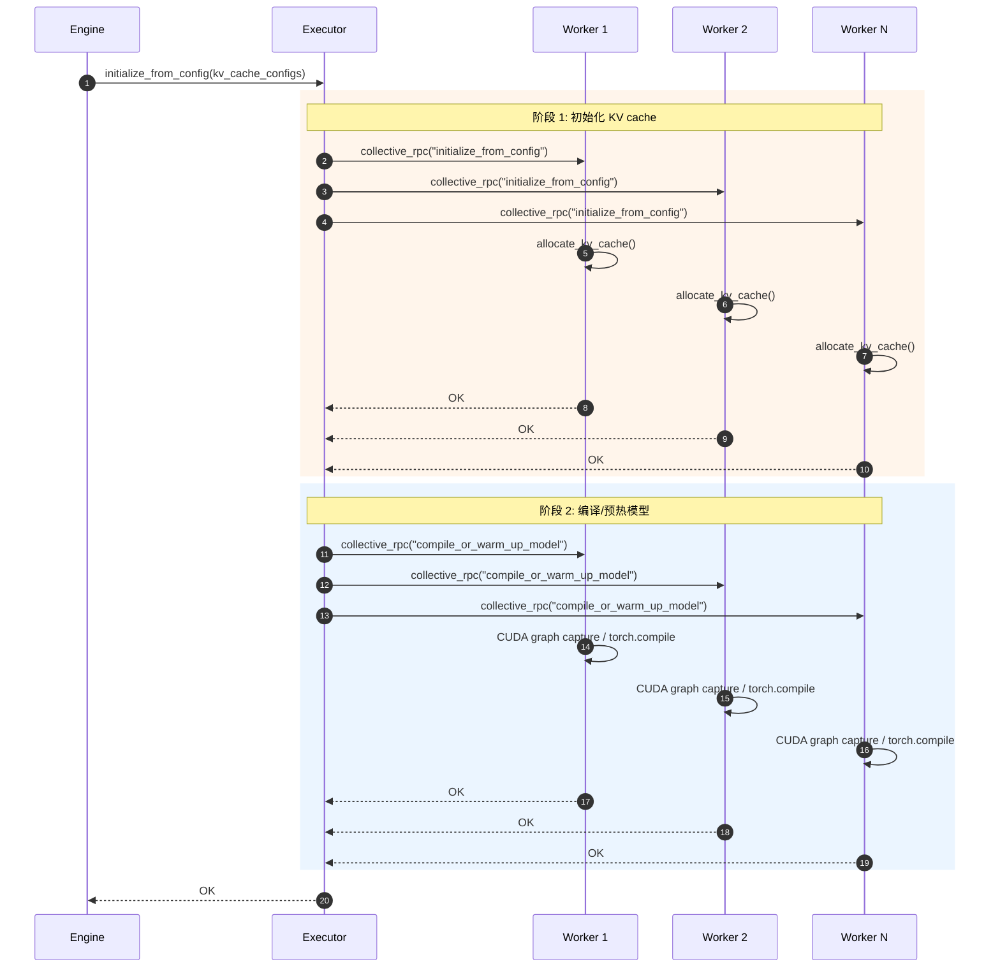
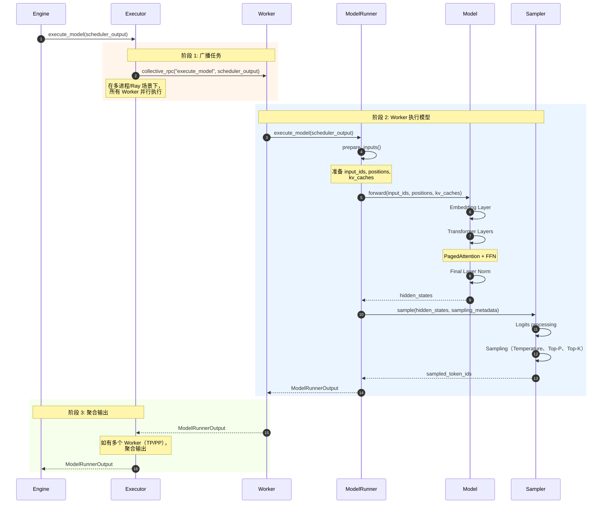

# vLLM-02-ModelExecutor模块-API

## API 概览

ModelExecutor 模块通过 **Executor** 抽象类统一管理模型执行。核心 API 包括：

| API 名称 | 类/接口 | 幂等性 | 作用 | 调用方 |
|---------|---------|--------|------|--------|
| `initialize_from_config` | Executor 方法 | 是 | 初始化 KV cache 和 Worker | Engine |
| `execute_model` | Executor 方法 | 否 | 执行模型前向传播 | Engine |
| `execute_dummy_batch` | Executor 方法 | 否 | 执行空批次（预热） | Engine |
| `determine_available_memory` | Executor 方法 | 是 | 获取可用内存 | Engine |
| `get_kv_cache_specs` | Executor 方法 | 是 | 获取 KV cache 规格 | Engine |
| **Worker.execute_model** | Worker 方法 | 否 | Worker 执行模型 | Executor |
| **ModelRunner.execute_model** | ModelRunner 方法 | 否 | 实际模型前向传播 | Worker |

---

## Executor API

### 1. initialize_from_config

#### 基本信息
- **名称**：`initialize_from_config`
- **协议/方法**：Python 实例方法
- **幂等性**：是（多次调用无副作用）
- **返回值**：`None`

#### 请求结构体

```python
def initialize_from_config(
    self,
    kv_cache_configs: list[KVCacheConfig],
) -> None:
    """初始化 KV cache 和 Worker"""
```

**参数说明表**：

| 字段 | 类型 | 必填 | 说明 |
|------|------|------|------|
| kv_cache_configs | list[KVCacheConfig] | ✓ | KV cache 配置列表（每层一个配置） |

**KVCacheConfig**：

```python
@dataclass
class KVCacheConfig:
    num_blocks: int                      # KV cache 块数量
    block_size: int                      # 块大小（tokens）
    num_heads: int                       # 注意力头数
    head_dim: int                        # 每个头的维度
    layer_id: int                        # 层 ID
```

#### 入口函数与关键代码

```python
def initialize_from_config(
    self,
    kv_cache_configs: list[KVCacheConfig],
) -> None:
    # 1. 通知所有 Worker 初始化 KV cache
    self.collective_rpc(
        "initialize_from_config",
        args=(kv_cache_configs,)
    )
    
    # 2. 编译或预热模型
    self.collective_rpc("compile_or_warm_up_model")
```

**代码说明**：
- **目的**：初始化分布式 Worker 的 KV cache，并预热模型
- **输入**：KV cache 配置列表
- **输出**：None（副作用：Worker 初始化完成）
- **执行流程**：
  1. 广播配置到所有 Worker
  2. Worker 分配 KV cache 内存
  3. 编译/预热模型（CUDA 图、编译优化等）

#### 时序图



#### 异常/回退与性能要点

**异常处理**：
1. **内存不足**：Worker 抛出 OOM，Executor 捕获并传播
2. **Worker 失败**：单个 Worker 失败导致整个初始化失败
3. **超时**：RPC 超时抛出 TimeoutError

**性能要点**：
1. **并行初始化**：所有 Worker 并行初始化，耗时 = max(Worker 初始化时间)
2. **KV cache 分配**：内存分配约 100-500 ms
3. **模型预热**：CUDA 图捕获约 1-10 秒（取决于模型大小）

---

### 2. execute_model

#### 基本信息
- **名称**：`execute_model`
- **协议/方法**：Python 实例方法
- **幂等性**：否（每次执行生成不同结果）
- **返回值**：`Union[ModelRunnerOutput, Future[ModelRunnerOutput]]`

#### 请求结构体

```python
def execute_model(
    self,
    scheduler_output: SchedulerOutput,
    non_block: bool = False,
) -> Union[ModelRunnerOutput, Future[ModelRunnerOutput]]:
    """执行模型前向传播"""
```

**参数说明表**：

| 字段 | 类型 | 必填 | 默认值 | 说明 |
|------|------|------|--------|------|
| scheduler_output | SchedulerOutput | ✓ | - | 调度器输出（包含本次 step 的请求） |
| non_block | bool | ✗ | False | 是否非阻塞执行（Pipeline Parallelism） |

**SchedulerOutput**：

```python
@dataclass
class SchedulerOutput:
    scheduled_new_reqs: list[NewRequestData]    # 新请求（Prefill）
    scheduled_resumed_reqs: list[ResumedReq]    # 恢复的请求（Decode）
    num_scheduled_tokens: dict[str, int]        # 本次 step 的 token 数
    total_num_scheduled_tokens: int             # 总 token 数
    scheduled_encoder_inputs: Optional[EncoderInputs]  # Encoder 输入
```

#### 响应结构体

```python
@dataclass
class ModelRunnerOutput:
    sampled_token_ids: torch.Tensor              # 采样的 token IDs (shape: [num_reqs])
    logprobs: Optional[torch.Tensor]             # Logprobs (shape: [num_reqs, vocab_size])
    num_tokens: int                              # 本次 step 处理的 token 数
    hidden_states: Optional[torch.Tensor]        # Hidden states（Embedding 任务）
```

#### 入口函数与关键代码

```python
def execute_model(
    self,
    scheduler_output: SchedulerOutput,
    non_block: bool = False,
) -> Union[ModelRunnerOutput, Future[ModelRunnerOutput]]:
    # 1. 广播 scheduler_output 到所有 Worker
    output = self.collective_rpc(
        "execute_model",
        args=(scheduler_output,),
        non_block=non_block
    )
    
    # 2. 返回第一个 Worker 的输出（或 Future）
    return output[0]
```

**实现详细解析（MultiprocExecutor）**：

```python
class MultiprocExecutor(Executor):
    def execute_model(
        self,
        scheduler_output: SchedulerOutput,
        non_block: bool = False,
    ) -> Union[ModelRunnerOutput, Future[ModelRunnerOutput]]:
        
        if not self.has_connector:
            # 情况 1: 无 KV connector（标准场景）
            # 只从 output_rank Worker 获取输出
            (output,) = self.collective_rpc(
                "execute_model",
                args=(scheduler_output,),
                unique_reply_rank=self.output_rank,  # 只等待此 rank 的输出
                non_block=non_block,
            )
            return output
        
        # 情况 2: 有 KV connector（需聚合多个 Worker 输出）
        outputs = self.collective_rpc(
            "execute_model",
            args=(scheduler_output,),
            non_block=non_block,
        )
        
        # 聚合所有 Worker 的输出
        if non_block:
            return self.kv_output_aggregator.async_aggregate(
                outputs, self.output_rank
            )
        return self.kv_output_aggregator.aggregate(outputs, self.output_rank)
```

#### 上层调用链核心代码

**Worker.execute_model**：

```python
class Worker:
    def execute_model(
        self,
        scheduler_output: SchedulerOutput,
    ) -> ModelRunnerOutput:
        # 1. 调用 ModelRunner 执行模型
        output = self.model_runner.execute_model(scheduler_output)
        
        # 2. 返回输出
        return output
```

**ModelRunner.execute_model**：

```python
class ModelRunner:
    def execute_model(
        self,
        scheduler_output: SchedulerOutput,
    ) -> ModelRunnerOutput:
        # 1. 准备输入（input_ids, positions, kv_caches）
        input_ids, positions, kv_caches = self.prepare_inputs(scheduler_output)
        
        # 2. 模型前向传播
        hidden_states = self.model(
            input_ids=input_ids,
            positions=positions,
            kv_caches=kv_caches,
        )
        
        # 3. 采样
        sampled_token_ids = self.sampler.sample(
            hidden_states,
            sampling_metadata=scheduler_output.sampling_metadata,
        )
        
        # 4. 返回输出
        return ModelRunnerOutput(
            sampled_token_ids=sampled_token_ids,
            num_tokens=scheduler_output.total_num_scheduled_tokens,
        )
```

#### 时序图



#### 异常/回退与性能要点

**异常处理**：
1. **CUDA OOM**：模型执行时 OOM，Worker 终止
2. **Worker 失败**：单个 Worker 失败导致整个 step 失败
3. **超时**：RPC 超时（默认 60 秒），可配置 `VLLM_EXECUTE_MODEL_TIMEOUT_SECONDS`

**性能要点**：
1. **并行执行**：
   - **Tensor Parallelism (TP)**：所有 Worker 同时执行，时间 ≈ 单 Worker 时间
   - **Pipeline Parallelism (PP)**：流水线执行，吞吐量提高，延迟增加
2. **CUDA 图优化**：小批量（< 512 tokens）使用 CUDA 图，性能提升 20-40%
3. **KV cache 访问**：PagedAttention 优化内存访问，性能提升 30-50%
4. **非阻塞执行**：Pipeline Parallelism 场景下，`non_block=True` 允许并发执行多个批次

---

### 3. determine_available_memory

#### 基本信息
- **名称**：`determine_available_memory`
- **协议/方法**：Python 实例方法
- **幂等性**：是（多次调用返回相同结果，假设无其他进程占用）
- **返回值**：`list[int]`（每个 GPU 的可用内存，单位：字节）

#### 请求结构体

```python
def determine_available_memory(self) -> list[int]:
    """获取每个 GPU 的可用内存"""
```

#### 入口函数与关键代码

```python
def determine_available_memory(self) -> list[int]:
    # 查询所有 Worker 的可用内存
    return self.collective_rpc("determine_available_memory")
```

**Worker 实现**：

```python
class Worker:
    def determine_available_memory(self) -> int:
        # 1. 获取 GPU 总内存
        total_memory = torch.cuda.get_device_properties(self.device).total_memory
        
        # 2. 获取当前已占用内存
        allocated_memory = torch.cuda.memory_allocated(self.device)
        
        # 3. 计算可用内存（考虑 gpu_memory_utilization）
        available_memory = (
            total_memory * self.gpu_memory_utilization - allocated_memory
        )
        
        return int(available_memory)
```

---

### 4. get_kv_cache_specs

#### 基本信息
- **名称**：`get_kv_cache_specs`
- **协议/方法**：Python 实例方法
- **幂等性**：是
- **返回值**：`list[dict[str, KVCacheSpec]]`

#### 响应结构体

```python
@dataclass
class KVCacheSpec:
    num_blocks: int                      # KV cache 块数量
    block_size: int                      # 块大小（tokens）
    num_layers: int                      # 模型层数
    num_heads: int                       # KV heads 数量
    head_dim: int                        # 每个 head 的维度
    dtype: torch.dtype                   # 数据类型
```

#### 入口函数与关键代码

```python
def get_kv_cache_specs(self) -> list[dict[str, KVCacheSpec]]:
    # 查询所有 Worker 的 KV cache 规格
    return self.collective_rpc("get_kv_cache_spec")
```

---

## Worker API

### Worker.execute_model

#### 基本信息

Worker 是 Executor 和 ModelRunner 之间的中间层，负责：
1. 接收 Executor 的 RPC 调用
2. 调用 ModelRunner 执行模型
3. 返回输出给 Executor

#### 入口函数与关键代码

```python
class Worker:
    def __init__(
        self,
        vllm_config: VllmConfig,
        local_rank: int,
        rank: int,
        distributed_init_method: str,
    ):
        self.vllm_config = vllm_config
        self.local_rank = local_rank
        self.rank = rank
        
        # 初始化 ModelRunner
        self.model_runner = ModelRunner(vllm_config, local_rank, rank)
    
    def execute_model(
        self,
        scheduler_output: SchedulerOutput,
    ) -> ModelRunnerOutput:
        # 委托给 ModelRunner
        return self.model_runner.execute_model(scheduler_output)
    
    def initialize_from_config(
        self,
        kv_cache_configs: list[KVCacheConfig],
    ) -> None:
        # 初始化 KV cache
        self.model_runner.initialize_kv_cache(kv_cache_configs)
```

---

## ModelRunner API

### ModelRunner.execute_model

#### 基本信息

ModelRunner 是实际执行模型前向传播的组件，包括：
1. **prepare_inputs**：准备模型输入
2. **model.forward**：模型前向传播
3. **sampler.sample**：采样生成 token

#### 入口函数与关键代码

```python
class ModelRunner:
    def execute_model(
        self,
        scheduler_output: SchedulerOutput,
    ) -> ModelRunnerOutput:
        # 1. 准备输入
        model_input = self.prepare_inputs(scheduler_output)
        
        # 2. 模型前向传播
        hidden_states = self.model(
            input_ids=model_input.input_ids,
            positions=model_input.positions,
            kv_caches=model_input.kv_caches,
            attn_metadata=model_input.attn_metadata,
        )
        
        # 3. 采样
        sampled_token_ids = self.sampler.sample(
            hidden_states=hidden_states,
            sampling_metadata=model_input.sampling_metadata,
        )
        
        # 4. 返回输出
        return ModelRunnerOutput(
            sampled_token_ids=sampled_token_ids,
            num_tokens=scheduler_output.total_num_scheduled_tokens,
        )
    
    def prepare_inputs(
        self,
        scheduler_output: SchedulerOutput,
    ) -> ModelInput:
        # 1. 提取 input_ids
        input_ids = self.extract_input_ids(scheduler_output)
        
        # 2. 计算 positions
        positions = self.compute_positions(scheduler_output)
        
        # 3. 准备 KV cache 指针
        kv_caches = self.get_kv_cache_pointers(scheduler_output)
        
        # 4. 准备 Attention metadata
        attn_metadata = self.prepare_attn_metadata(scheduler_output)
        
        return ModelInput(
            input_ids=input_ids,
            positions=positions,
            kv_caches=kv_caches,
            attn_metadata=attn_metadata,
        )
```

---

## API 使用示例

### 示例 1：Executor 初始化

```python
from vllm.v1.executor.abstract import Executor
from vllm.v1.kv_cache_interface import KVCacheConfig

# 创建 Executor
executor = Executor.get_class(vllm_config)(vllm_config)

# 准备 KV cache 配置
kv_cache_configs = [
    KVCacheConfig(
        num_blocks=1000,
        block_size=16,
        num_heads=32,
        head_dim=128,
        layer_id=i,
    )
    for i in range(num_layers)
]

# 初始化
executor.initialize_from_config(kv_cache_configs)
```

### 示例 2：执行模型

```python
# 获取 scheduler 输出
scheduler_output = scheduler.schedule()

# 执行模型
output = executor.execute_model(scheduler_output)

# 处理输出
print(f"Sampled tokens: {output.sampled_token_ids}")
print(f"Num tokens: {output.num_tokens}")
```

### 示例 3：Pipeline Parallelism（非阻塞）

```python
from concurrent.futures import Future

# 非阻塞执行（返回 Future）
future1 = executor.execute_model(scheduler_output_1, non_block=True)
future2 = executor.execute_model(scheduler_output_2, non_block=True)

# 等待结果
output1 = future1.result()
output2 = future2.result()
```

---

## API 调用链总结

```
Engine.step()
  └─> Executor.execute_model(scheduler_output)
        └─> [collective_rpc] → Worker.execute_model(scheduler_output)
              └─> ModelRunner.execute_model(scheduler_output)
                    ├─> ModelRunner.prepare_inputs()
                    ├─> Model.forward()
                    └─> Sampler.sample()
```

---

## 性能对比

| 场景 | 延迟 (ms) | 吞吐量 (tokens/s) | 说明 |
|------|-----------|------------------|------|
| 单 GPU（batch=1） | 15 | 2,000 | 低延迟 |
| 单 GPU（batch=32） | 200 | 30,000 | 高吞吐 |
| TP=4（batch=32） | 220 | 25,000 | 延迟略增，吞吐略降（通信开销） |
| PP=4（batch=32） | 250 | 35,000 | 延迟增加，吞吐提高（流水线） |
| DP=4（batch=128） | 210 | 120,000 | 线性扩展吞吐 |

---

## 总结

ModelExecutor 模块通过 **Executor → Worker → ModelRunner** 三层架构实现模型执行：

1. **Executor**：管理分布式 Worker，支持 TP/PP/DP
2. **Worker**：封装单个 GPU 上的模型执行
3. **ModelRunner**：实际执行模型前向传播和采样

核心 API：
- `initialize_from_config`：初始化 KV cache 和预热模型
- `execute_model`：执行模型前向传播，支持非阻塞（PP）
- `determine_available_memory`：查询可用内存
- `get_kv_cache_specs`：获取 KV cache 规格

设计特点：
- **分布式支持**：统一的 collective_rpc 接口
- **并行策略**：支持 TP、PP、DP、EP
- **性能优化**：CUDA 图、PagedAttention、非阻塞执行

