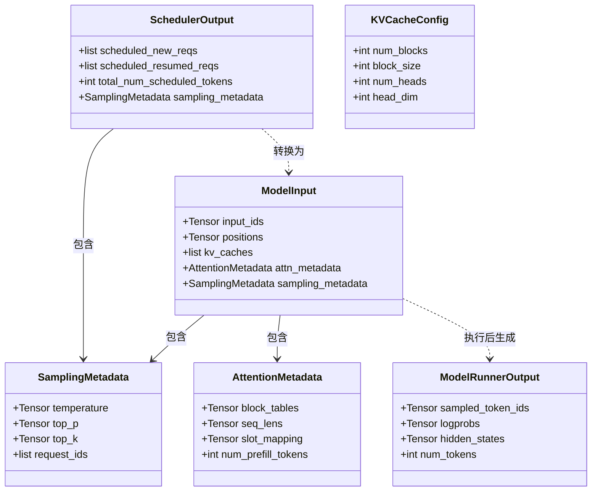
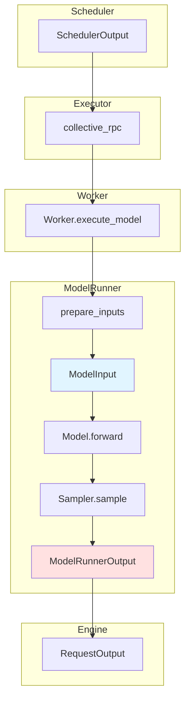

# vLLM-02-ModelExecutor模块-数据结构

## 核心数据结构列表

ModelExecutor 模块包含以下核心数据结构：

| 数据结构 | 类型 | 用途 | 更新时机 | 文件位置 |
|---------|------|------|---------|---------|
| `SchedulerOutput` | dataclass | 调度器输出（execute_model 输入） | 每次 schedule() | vllm/v1/core/sched/output.py |
| `ModelRunnerOutput` | dataclass | 模型执行输出 | 每次 execute_model() | vllm/v1/outputs.py |
| `ModelInput` | dataclass | ModelRunner 输入 | 每次 prepare_inputs() | vllm/v1/worker/model_runner.py |
| `KVCacheConfig` | dataclass | KV cache 配置 | 初始化时 | vllm/v1/kv_cache_interface.py |
| `KVCacheSpec` | dataclass | KV cache 规格 | 初始化后 | vllm/v1/kv_cache_interface.py |
| `AttentionMetadata` | dataclass | Attention 元数据 | 每次 step | vllm/v1/attention/backends/ |
| `SamplingMetadata` | dataclass | 采样元数据 | 每次 step | vllm/v1/sample/metadata.py |

---

## 数据结构详细说明

### 1. SchedulerOutput

#### 基本信息

**用途**：调度器输出，包含本次 step 要执行的所有请求信息。

**定义**：

```python
@dataclass
class SchedulerOutput:
    """调度器输出，传递给 Executor"""
    
    # 新请求（Prefill 阶段）
    scheduled_new_reqs: list[NewRequestData]
    
    # 恢复的请求（Decode 阶段）
    scheduled_resumed_reqs: list[ResumedReqData]
    
    # Token 数统计
    num_scheduled_tokens: dict[str, int]    # 每个请求的 token 数
    total_num_scheduled_tokens: int         # 总 token 数
    
    # Encoder 输入（Encoder-Decoder 模型）
    scheduled_encoder_inputs: Optional[EncoderInputs]
    
    # Sampling metadata
    sampling_metadata: SamplingMetadata
    
    # KV cache 操作
    blocks_to_swap_in: list[tuple[int, int]]     # (CPU block, GPU block)
    blocks_to_swap_out: list[tuple[int, int]]    # (GPU block, CPU block)
    blocks_to_copy: list[tuple[int, int]]        # (src block, dst block)
```

#### 字段说明表

| 字段 | 类型 | 说明 |
|------|------|------|
| scheduled_new_reqs | list[NewRequestData] | 新请求列表，需执行 Prefill |
| scheduled_resumed_reqs | list[ResumedReqData] | 恢复的请求列表，执行 Decode |
| num_scheduled_tokens | dict[str, int] | 每个请求本次处理的 token 数 |
| total_num_scheduled_tokens | int | 本次 step 总 token 数 |
| sampling_metadata | SamplingMetadata | 采样元数据（温度、top_p 等） |
| blocks_to_swap_in | list[tuple] | 需从 CPU 换入 GPU 的块 |
| blocks_to_swap_out | list[tuple] | 需从 GPU 换出 CPU 的块 |
| blocks_to_copy | list[tuple] | 需复制的块（Prefix Caching） |

#### 用途和更新时机

**创建时机**：
- Scheduler.schedule() 每次调用

**使用场景**：
1. 告诉 Executor 本次要执行哪些请求
2. 指导 KV cache 管理（swap、copy）
3. 提供 Sampling 参数

---

### 2. ModelRunnerOutput

#### 基本信息

**用途**：ModelRunner 执行模型后的输出，包含采样的 token 和其他信息。

**定义**：

```python
@dataclass
class ModelRunnerOutput:
    """ModelRunner 输出"""
    
    # 采样结果
    sampled_token_ids: torch.Tensor              # shape: [num_reqs]
    
    # Logprobs（可选）
    logprobs: Optional[torch.Tensor]             # shape: [num_reqs, vocab_size]
    
    # Hidden states（Embedding 任务）
    hidden_states: Optional[torch.Tensor]        # shape: [num_reqs, hidden_size]
    
    # 统计信息
    num_tokens: int                              # 本次处理的 token 数
```

#### 字段说明表

| 字段 | 类型 | 说明 |
|------|------|------|
| sampled_token_ids | torch.Tensor | 采样的 token IDs，每个请求一个 |
| logprobs | Optional[Tensor] | Top-N logprobs（如 SamplingParams.logprobs > 0） |
| hidden_states | Optional[Tensor] | Hidden states（Embedding 模型） |
| num_tokens | int | 本次处理的 token 数（Prefill + Decode） |

#### 用途和更新时机

**创建时机**：
- ModelRunner.execute_model() 每次调用

**使用场景**：
1. 返回采样的 token 给 Engine
2. 提供 logprobs 用于输出
3. Embedding 任务返回向量

---

### 3. ModelInput

#### 基本信息

**用途**：ModelRunner.prepare_inputs() 准备的模型输入，传递给 Model.forward()。

**定义**：

```python
@dataclass
class ModelInput:
    """模型输入"""
    
    # 输入 token IDs
    input_ids: torch.Tensor                      # shape: [total_tokens]
    
    # Position IDs
    positions: torch.Tensor                      # shape: [total_tokens]
    
    # KV cache 指针（PagedAttention）
    kv_caches: list[torch.Tensor]                # 每层一个 KV cache
    
    # Attention metadata
    attn_metadata: AttentionMetadata
    
    # Sampling metadata
    sampling_metadata: SamplingMetadata
    
    # Multi-modal inputs（可选）
    mm_inputs: Optional[MultiModalInputs]
```

#### 字段说明表

| 字段 | 类型 | 说明 |
|------|------|------|
| input_ids | torch.Tensor | 输入 token IDs，形状 [total_tokens] |
| positions | torch.Tensor | Position IDs，形状 [total_tokens] |
| kv_caches | list[Tensor] | KV cache 指针列表，每层一个 |
| attn_metadata | AttentionMetadata | Attention 元数据（block tables、seq_lens 等） |
| sampling_metadata | SamplingMetadata | 采样元数据 |
| mm_inputs | Optional | 多模态输入（图片、音频特征） |

#### 用途和更新时机

**创建时机**：
- ModelRunner.prepare_inputs() 每次调用

**使用场景**：
1. 传递给 Model.forward()
2. PagedAttention 使用 kv_caches 和 attn_metadata
3. Sampler 使用 sampling_metadata

---

### 4. KVCacheConfig

#### 基本信息

**用途**：KV cache 配置，指导 Worker 分配内存。

**定义**：

```python
@dataclass
class KVCacheConfig:
    """KV cache 配置"""
    
    num_blocks: int                              # 块数量
    block_size: int                              # 块大小（tokens）
    num_heads: int                               # KV heads 数量
    head_dim: int                                # 每个 head 的维度
    layer_id: int                                # 层 ID
    dtype: torch.dtype                           # 数据类型
```

#### 字段说明表

| 字段 | 类型 | 说明 |
|------|------|------|
| num_blocks | int | KV cache 块数量（例如 1000） |
| block_size | int | 每块包含的 token 数（例如 16） |
| num_heads | int | KV heads 数量（GQA 时 < Q heads） |
| head_dim | int | 每个 head 的维度（例如 128） |
| layer_id | int | 模型层 ID（0 到 num_layers-1） |
| dtype | torch.dtype | 数据类型（float16/bfloat16/fp8） |

#### 内存计算

```python
# 单个 block 的 KV cache 内存
kv_cache_per_block = (
    2                    # K 和 V
    * block_size         # 每块 token 数
    * num_heads          # KV heads 数量
    * head_dim           # 每个 head 维度
    * dtype_size         # 数据类型大小（2 bytes for fp16）
)

# 单层总内存
kv_cache_per_layer = num_blocks * kv_cache_per_block

# 全模型总内存
total_kv_cache = num_layers * kv_cache_per_layer
```

**示例计算**：
- num_blocks = 1000
- block_size = 16
- num_heads = 32
- head_dim = 128
- num_layers = 32
- dtype = fp16 (2 bytes)

```
kv_cache_per_block = 2 * 16 * 32 * 128 * 2 = 262,144 bytes = 256 KB
kv_cache_per_layer = 1000 * 256 KB = 256 MB
total_kv_cache = 32 * 256 MB = 8 GB
```

---

### 5. AttentionMetadata

#### 基本信息

**用途**：Attention 计算的元数据，包含 block tables、序列长度等。

**定义**：

```python
@dataclass
class AttentionMetadata:
    """Attention 元数据"""
    
    # Block tables（PagedAttention）
    block_tables: torch.Tensor                   # shape: [num_seqs, max_num_blocks_per_seq]
    
    # 序列长度
    seq_lens: torch.Tensor                       # shape: [num_seqs]
    context_lens: torch.Tensor                   # shape: [num_seqs]
    
    # Query 长度（Prefill 时 > 1，Decode 时 = 1）
    query_lens: torch.Tensor                     # shape: [num_seqs]
    
    # Slot mapping（PagedAttention）
    slot_mapping: torch.Tensor                   # shape: [total_tokens]
    
    # Prefill / Decode 分组
    num_prefill_tokens: int
    num_decode_tokens: int
```

#### 字段说明表

| 字段 | 类型 | 说明 |
|------|------|------|
| block_tables | torch.Tensor | Block tables，映射序列到 KV cache 块 |
| seq_lens | torch.Tensor | 每个序列的总长度 |
| context_lens | torch.Tensor | 每个序列的上下文长度（已生成的 token 数） |
| query_lens | torch.Tensor | 每个序列本次查询长度 |
| slot_mapping | torch.Tensor | Slot mapping，映射 token 到 KV cache 位置 |
| num_prefill_tokens | int | Prefill token 数 |
| num_decode_tokens | int | Decode token 数 |

---

### 6. SamplingMetadata

#### 基本信息

**用途**：采样元数据，包含每个请求的采样参数。

**定义**：

```python
@dataclass
class SamplingMetadata:
    """采样元数据"""
    
    # 每个请求的采样参数
    temperature: torch.Tensor                    # shape: [num_reqs]
    top_p: torch.Tensor                          # shape: [num_reqs]
    top_k: torch.Tensor                          # shape: [num_reqs]
    
    # 惩罚参数
    presence_penalty: torch.Tensor               # shape: [num_reqs]
    frequency_penalty: torch.Tensor              # shape: [num_reqs]
    repetition_penalty: torch.Tensor             # shape: [num_reqs]
    
    # 请求 ID
    request_ids: list[str]
    
    # Logprobs
    output_logprobs: list[int]                   # 每个请求需要的 logprobs 数量
```

---

## 数据结构关系图（类图）



---

## 数据流图



---

## 数据大小估算

### SchedulerOutput

| 字段 | 数据大小 | 说明 |
|------|---------|------|
| scheduled_new_reqs | 可变 | 每个请求约 100-1000 bytes |
| sampling_metadata | 约 1 KB | 每个请求约 100 bytes |
| 总计 | < 10 KB | 小型数据结构 |

### ModelRunnerOutput

| 字段 | 数据大小 | 说明 |
|------|---------|------|
| sampled_token_ids | num_reqs * 4 bytes | int32 |
| logprobs | num_reqs * vocab_size * 4 bytes | 可选，较大 |
| hidden_states | num_reqs * hidden_size * 2 bytes | Embedding 任务 |

**示例**：
- num_reqs = 32
- vocab_size = 50,000
- hidden_size = 4096

```
sampled_token_ids: 32 * 4 = 128 bytes
logprobs: 32 * 50,000 * 4 = 6.4 MB （可选）
hidden_states: 32 * 4096 * 2 = 256 KB
```

### ModelInput

| 字段 | 数据大小 | 说明 |
|------|---------|------|
| input_ids | total_tokens * 4 bytes | int32 |
| positions | total_tokens * 4 bytes | int32 |
| kv_caches | 见 KV cache 计算 | 指针，约 8 bytes/层 |
| attn_metadata | 约 1-10 KB | 取决于序列数 |

---

## 版本演进

### V0 → V1

| 数据结构 | V0 | V1 | 变化 |
|---------|----|----|------|
| SchedulerOutput | 多个分散字段 | 统一 dataclass | 简化接口 |
| ModelRunnerOutput | 字典 | dataclass | 类型安全 |
| AttentionMetadata | 分散在多个类 | 统一 dataclass | 易于维护 |

---

## 使用示例

### 创建 KVCacheConfig

```python
from vllm.v1.kv_cache_interface import KVCacheConfig

kv_cache_configs = []
for layer_id in range(num_layers):
    config = KVCacheConfig(
        num_blocks=1000,
        block_size=16,
        num_heads=32,
        head_dim=128,
        layer_id=layer_id,
        dtype=torch.float16,
    )
    kv_cache_configs.append(config)

executor.initialize_from_config(kv_cache_configs)
```

### 解析 ModelRunnerOutput

```python
output = executor.execute_model(scheduler_output)

# 提取采样的 token
sampled_tokens = output.sampled_token_ids.cpu().tolist()

# 如果有 logprobs
if output.logprobs is not None:
    top_logprobs = output.logprobs.topk(5, dim=-1)
    print(f"Top 5 logprobs: {top_logprobs}")

# 如果是 Embedding 任务
if output.hidden_states is not None:
    embeddings = output.hidden_states.cpu().numpy()
    print(f"Embedding shape: {embeddings.shape}")
```

---

## 总结

ModelExecutor 模块的数据结构设计特点：

1. **类型安全**：使用 dataclass，提供类型注解
2. **模块化**：数据结构职责清晰，易于维护
3. **性能优化**：尽量使用 Tensor，减少 Python 对象开销
4. **扩展性**：支持多模态、Encoder-Decoder 等扩展

核心数据结构：
- **SchedulerOutput**：调度器输出，连接 Scheduler 和 Executor
- **ModelRunnerOutput**：模型输出，返回采样结果
- **ModelInput**：模型输入，传递给 Model.forward()
- **AttentionMetadata**：Attention 元数据，支持 PagedAttention
- **SamplingMetadata**：采样元数据，控制生成策略

通过合理设计数据结构，实现了高效的数据传递和处理。

