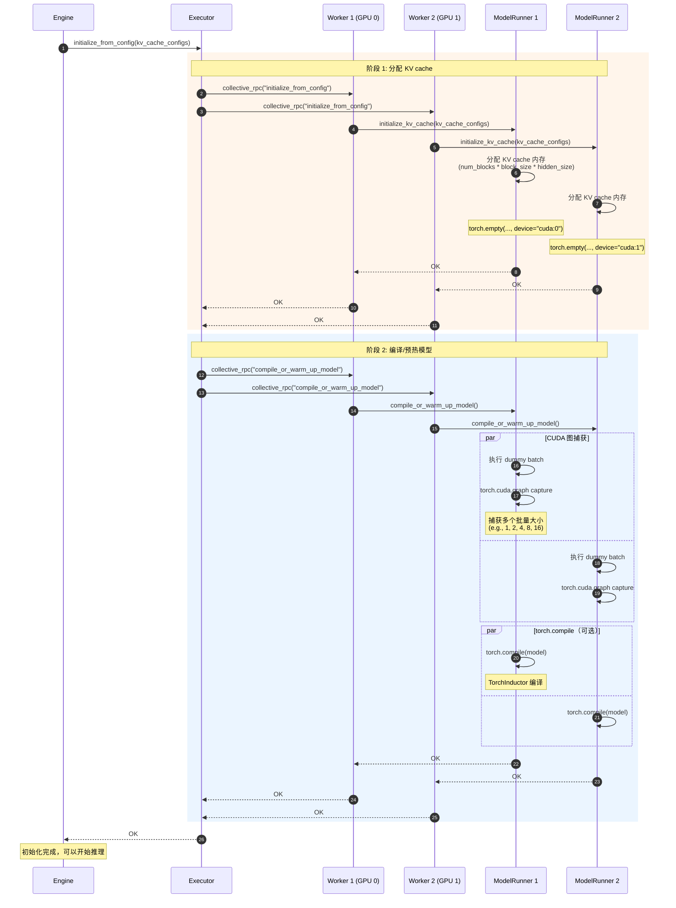
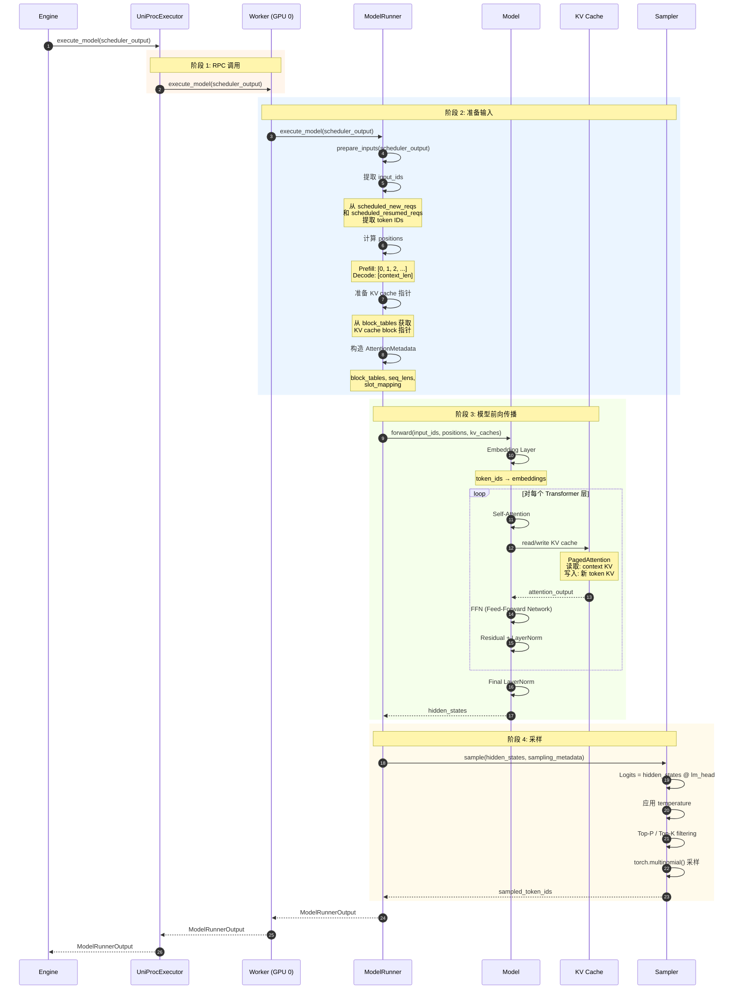
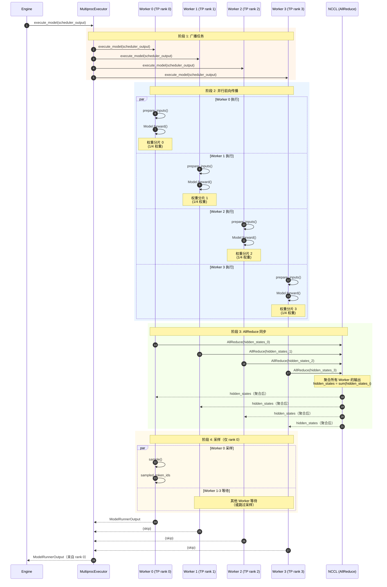
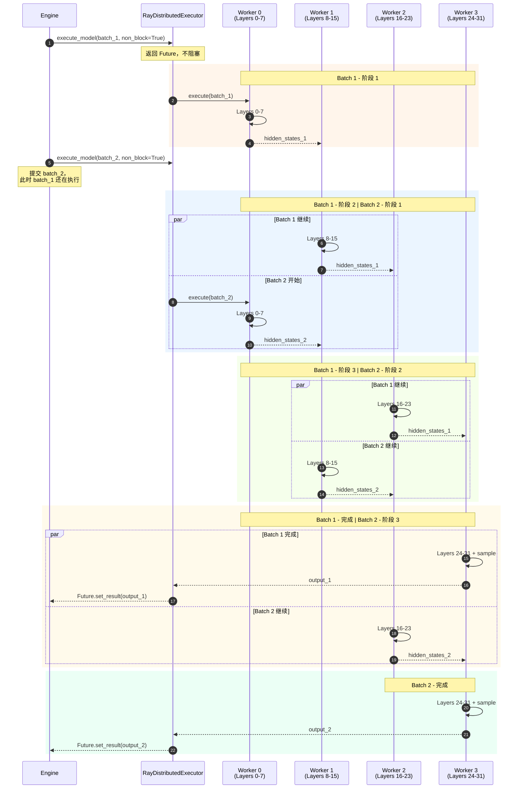
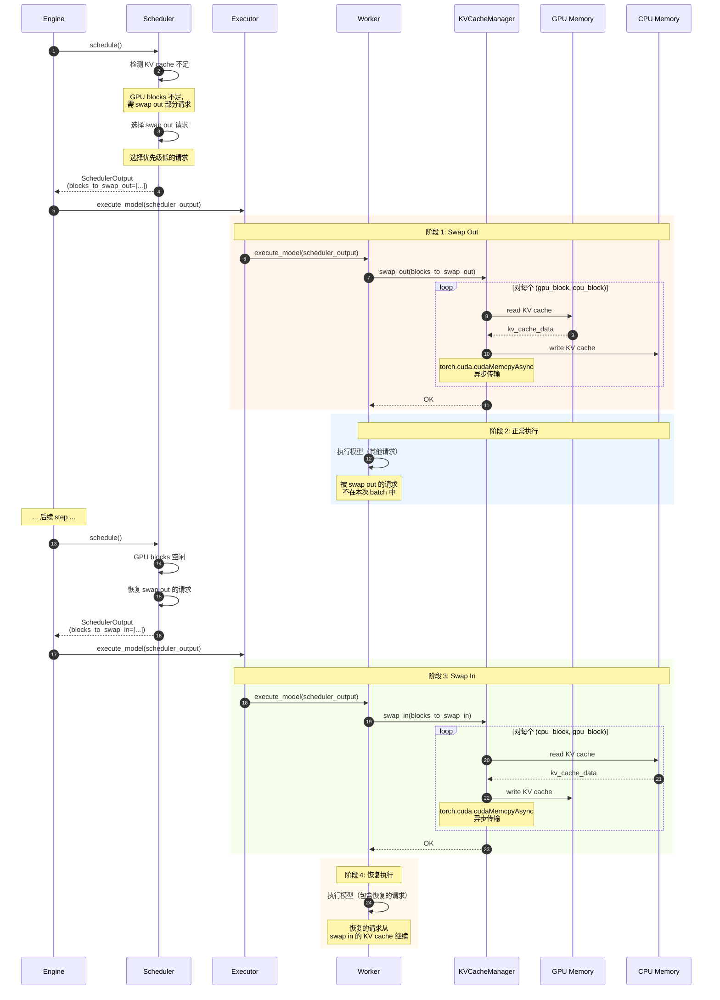

# vLLM-02-ModelExecutor模块-时序图

## 典型场景列表

ModelExecutor 模块包含以下典型执行场景：

| 场景编号 | 场景名称 | 参与组件 | 关键点 | 适用情况 |
|---------|---------|---------|--------|---------|
| 1 | 初始化与预热 | Executor、Worker、ModelRunner | KV cache 分配、CUDA 图捕获 | 启动时 |
| 2 | 单 GPU 执行 | Executor、Worker、ModelRunner、Model | 模型前向传播 | 单卡推理 |
| 3 | Tensor Parallelism 执行 | Executor、多个 Worker、Distributed | AllReduce 同步 | TP > 1 |
| 4 | Pipeline Parallelism 执行 | Executor、多个 Worker（分层） | 非阻塞流水线 | PP > 1 |
| 5 | 内存管理（Swap） | Executor、Worker、KVCacheManager | KV cache swap in/out | 内存不足时 |

---

## 场景 1：初始化与预热

### 场景描述

**目标**：初始化 Executor、分配 KV cache、预热模型（CUDA 图捕获、torch.compile）。

**适用场景**：
- 启动 vLLM 服务时
- 加载新模型时

**关键特征**：
- 分配 GPU 内存（KV cache）
- CUDA 图捕获（性能优化）
- torch.compile 编译（可选）
- 并行初始化多个 Worker

### 时序图

### 关键点说明

#### 1. KV Cache 分配

- **内存大小**：取决于 `num_blocks`、`block_size`、`num_layers`、`hidden_size`
- **内存类型**：GPU 内存（主 KV cache）+ CPU 内存（可选 swap space）
- **分配策略**：预分配大块内存，避免运行时分配

#### 2. CUDA 图捕获

- **目的**：减少 kernel launch 开销，提升小批量性能
- **捕获批量大小**：通常捕获 1, 2, 4, 8, 16, 32 等常见大小
- **性能提升**：20-40% 性能提升（小批量场景）

#### 3. 边界与约束

- **内存限制**：KV cache 分配可能失败（OOM）
- **预热时间**：CUDA 图捕获约 1-10 秒，torch.compile 约 10-60 秒
- **并行初始化**：所有 Worker 并行初始化，时间 = max(Worker 初始化时间)

#### 4. 异常与回退

- **OOM**：减少 `gpu_memory_utilization` 或 `max_num_seqs`
- **CUDA 图捕获失败**：回退到 eager mode
- **torch.compile 失败**：跳过编译，使用原始模型

#### 5. 性能特征

- **初始化时间**：5-30 秒（取决于模型大小）
- **内存占用**：KV cache 通常占 50-90% GPU 内存
- **并行效率**：多 Worker 并行初始化，效率接近线性

---

## 场景 2：单 GPU 执行

### 场景描述

**目标**：单 GPU 上执行模型前向传播和采样。

**适用场景**：
- 单卡推理
- 小模型（< 7B）
- 低并发

**关键特征**：
- 无分布式通信开销
- 最低延迟
- 最简单的执行路径

### 时序图

### 关键点说明

#### 1. 输入准备

- **input_ids 提取**：从 SchedulerOutput 提取所有请求的 input_ids
- **positions 计算**：Prefill 从 0 开始递增，Decode 为 context_len
- **KV cache 指针**：从 block_tables 获取每个 token 对应的 KV cache 位置

#### 2. PagedAttention

- **读取**：从 KV cache 读取已有的 K/V
- **写入**：将新 token 的 K/V 写入 KV cache
- **优势**：内存高效，无碎片

#### 3. 边界与约束

- **批量大小限制**：取决于 KV cache 大小和 `max_num_seqs`
- **序列长度限制**：`max_model_len`（如 4096）
- **内存限制**：KV cache + 激活值 < GPU 内存

#### 4. 异常与回退

- **OOM**：抛出 CUDA OOM 错误
- **Invalid input**：抛出 ValueError
- **Model error**：向上传播

#### 5. 性能特征

- **Prefill 延迟**：5-50 ms（取决于 prompt 长度）
- **Decode 延迟**：10-20 ms（单 token）
- **吞吐量**：1000-5000 tokens/s（取决于模型大小）

---

## 场景 3：Tensor Parallelism 执行

### 场景描述

**目标**：使用 Tensor Parallelism (TP) 在多个 GPU 上并行执行模型。

**适用场景**：
- 大模型（> 13B）
- 单节点多卡
- 低延迟要求

**关键特征**：
- 模型权重分片到多个 GPU
- AllReduce 同步
- 所有 Worker 同步执行

### 时序图

### 关键点说明

#### 1. 模型分片

- **列分片（Column Parallel）**：QKV projection、FFN up projection
- **行分片（Row Parallel）**：Attention output、FFN down projection
- **每个 Worker**：1/TP_size 的权重

#### 2. AllReduce 同步

- **位置**：每个 Transformer 层的输出
- **通信库**：NCCL（GPU）、Gloo（CPU）
- **开销**：约 0.5-2 ms/AllReduce（取决于张量大小）

#### 3. 边界与约束

- **TP size 限制**：通常 ≤ 8（单节点 GPU 数）
- **通信开销**：TP=2 约 10% 开销，TP=8 约 30-40% 开销
- **网络要求**：NVLink > PCIe > 网络

#### 4. 异常与回退

- **单 Worker 失败**：整个 step 失败
- **NCCL 错误**：通信超时或错误
- **内存不足**：单 GPU 内存不足

#### 5. 性能特征

- **延迟**：比单 GPU 增加 10-30%（通信开销）
- **吞吐量**：接近线性扩展（略有损失）
- **内存**：模型内存减少 1/TP_size

---

## 场景 4：Pipeline Parallelism 执行

### 场景描述

**目标**：使用 Pipeline Parallelism (PP) 在多个 GPU 上流水线执行模型。

**适用场景**：
- 超大模型（> 70B）
- 多节点或多卡
- 高吞吐量要求

**关键特征**：
- 模型层分片到多个 GPU
- 非阻塞流水线执行
- 并发执行多个批次

### 时序图

### 关键点说明

#### 1. 流水线执行

- **并发批次**：可并发执行 PP_size 个批次
- **吞吐量提升**：理论上提升 PP_size 倍
- **延迟增加**：每个批次延迟增加 (PP_size - 1) * stage_time

#### 2. 非阻塞执行

- **non_block=True**：立即返回 Future
- **Future.result()**：阻塞等待结果
- **异步调度**：Engine 可继续处理新请求

#### 3. 边界与约束

- **PP size 限制**：通常 ≤ 8
- **内存**：模型内存减少 1/PP_size
- **通信**：P2P 通信（GPU Direct）

#### 4. 异常与回退

- **单 stage 失败**：整个 pipeline 失败
- **bubble**：最后一个 stage 等待时间（浪费）
- **负载不均**：某个 stage 过慢导致 bubble

#### 5. 性能特征

- **延迟**：增加 (PP_size - 1) * stage_time
- **吞吐量**：提升接近 PP_size 倍（考虑 bubble）
- **内存**：模型内存减少 1/PP_size

---

## 场景 5：内存管理（Swap）

### 场景描述

**目标**：当 GPU KV cache 不足时，将部分 KV cache 换出到 CPU，后续需要时再换入。

**适用场景**：
- KV cache 不足
- 高并发场景
- `best_of > 1`（V0）

**关键特征**：
- GPU ↔ CPU 数据传输
- 异步传输（cuMemcpyAsync）
- 对性能有一定影响

### 时序图

### 关键点说明

#### 1. Swap Out 时机

- **KV cache 不足**：无法调度新请求
- **选择策略**：选择优先级低、context 长的请求
- **影响**：被 swap out 的请求暂停执行

#### 2. Swap 性能

- **传输速度**：PCIe 3.0 x16 约 12 GB/s
- **传输时间**：1 GB 约 80 ms
- **异步传输**：与计算重叠，减少影响

#### 3. 边界与约束

- **CPU 内存限制**：`swap_space` 参数（默认 4 GB）
- **Swap 频率**：频繁 swap 严重影响性能
- **不支持场景**：V1 暂不支持 swap（待实现）

#### 4. 异常与回退

- **CPU 内存不足**：无法 swap out，请求被抢占（drop）
- **传输错误**：CUDA 错误，请求失败

#### 5. 性能特征

- **Swap Out**：10-100 ms（取决于数据量）
- **Swap In**：10-100 ms
- **性能损失**：频繁 swap 可损失 50-80% 吞吐

---

## 场景对比表

| 特性 | 单 GPU | TP | PP | Swap |
|------|-------|----|----|------|
| **并行方式** | 无 | 模型并行 | 层并行 | 内存管理 |
| **延迟** | 最低 | +10-30% | +100-200% | +10-50% |
| **吞吐量** | 基准 | 略降（通信） | 提升 2-4x | 略降 |
| **内存** | 最高 | 1/TP_size | 1/PP_size | GPU+CPU |
| **适用场景** | 小模型 | 大模型单节点 | 超大模型 | 内存不足 |

---

## 性能优化建议

### 单 GPU 优化

1. **启用 CUDA 图**：小批量场景性能提升 20-40%
2. **torch.compile**：编译优化，性能提升 10-30%
3. **合适批量大小**：batch_size = 16-32 通常最优

### TP 优化

1. **使用 NVLink**：通信速度提升 5-10x
2. **减少 AllReduce 次数**：合并多个 AllReduce
3. **优化 TP size**：TP=2 或 4 通常最优

### PP 优化

1. **均衡 stage**：每个 stage 计算时间相近
2. **增大批量**：减少 bubble 影响
3. **启用 async scheduling**：并发执行多个批次

### Swap 优化

1. **避免 swap**：增大 `gpu_memory_utilization`
2. **异步传输**：与计算重叠
3. **减少 swap 频率**：调整 `max_num_seqs`

---

## 总结

ModelExecutor 模块支持多种执行模式：

1. **初始化与预热**：分配 KV cache、CUDA 图捕获
2. **单 GPU 执行**：最简单、最低延迟
3. **Tensor Parallelism**：大模型单节点并行
4. **Pipeline Parallelism**：超大模型流水线并行
5. **内存管理（Swap）**：应对内存不足

核心设计理念：
- **灵活性**：支持多种并行策略
- **高性能**：CUDA 图、PagedAttention、异步执行
- **可扩展性**：从单 GPU 到多节点
- **内存高效**：PagedAttention + Swap

通过合理选择执行模式和优化策略，可以在延迟、吞吐量和内存之间取得平衡。

