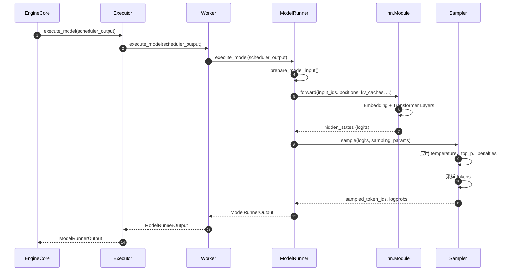

# vLLM-02-ModelExecutor模块-概览

## 模块职责

ModelExecutor 模块（在 V1 架构中实现为 Worker + ModelRunner）负责：

- 加载模型权重到设备（GPU/CPU/TPU）
- 初始化模型结构和 KV Cache
- 执行模型前向传播
- 执行 token 采样
- 管理模型编译和优化（CUDA Graph、torch.compile）
- 支持分布式并行（TP、PP、EP）
- 支持 LoRA 适配器动态加载和切换

## 输入与输出

### 输入
- **ExecuteModelRequest**：包含 batch 输入（input_ids、positions、block_tables）
- **SchedulerOutput**：调度器输出，指定要执行的请求
- **模型配置**：VllmConfig（模型路径、并行策略、量化配置等）

### 输出
- **ModelRunnerOutput**：包含采样的 token IDs、logprobs、hidden states
- **SamplerOutput**：采样器输出（V0 兼容）
- **KV Cache 规格**：KVCacheSpec（用于初始化 KV Cache）

## 上下游依赖

### 上游（调用方）
- `EngineCore`：调用 Worker 执行模型
- `Executor`：协调多个 Worker（分布式场景）

### 下游（被调用）
- `nn.Module`：实际的模型实例（如 LlamaForCausalLM）
- `model_loader`：模型加载器（从 HuggingFace/本地加载权重）
- `Sampler`：采样器（生成 tokens）
- `KVCache`：KV Cache 管理

## 生命周期

### 初始化阶段
1. 创建 Worker 实例（根据设备类型：GPU/CPU/TPU）
2. 初始化设备（init_device）
3. 加载模型（load_model）
4. Profiling 可用内存（determine_num_available_blocks）
5. 初始化 KV Cache（initialize_cache）
6. Warm-up 模型（compile_or_warm_up_model）
7. （可选）构建 CUDA Graph

### 运行阶段
1. 接收 ExecuteModelRequest / SchedulerOutput
2. 准备 batch 输入（input_ids、positions、block_tables）
3. 执行模型前向传播（model.forward）
4. 执行采样（sampler）
5. 返回 ModelRunnerOutput

### 关闭阶段
1. 释放模型内存
2. 销毁 KV Cache
3. 清理设备资源

## 架构图

```mermaid
flowchart TB
    subgraph Executor["Executor 层"]
        Exec[Executor<br/>协调器]
    end
    
    subgraph Workers["Worker 层（多设备）"]
        Worker1[GPU Worker 1]
        Worker2[GPU Worker 2]
        WorkerN[GPU Worker N]
    end
    
    subgraph ModelRunner["ModelRunner 层"]
        GPURunner[GPUModelRunner]
        CPURunner[CPUModelRunner]
        TPURunner[TPUModelRunner]
    end
    
    subgraph Model["模型层"]
        ModelLoader[ModelLoader]
        Model[nn.Module<br/>模型实例]
        Sampler[Sampler<br/>采样器]
        KVCache[KV Cache]
    end
    
    Exec -->|分发请求| Worker1
    Exec -->|分发请求| Worker2
    Exec -->|分发请求| WorkerN
    
    Worker1 -->|execute_model| GPURunner
    Worker2 -->|execute_model| GPURunner
    WorkerN -->|execute_model| CPURunner
    
    GPURunner -->|load_model| ModelLoader
    ModelLoader -->|load_weights| Model
    
    GPURunner -->|forward| Model
    Model -->|logits| GPURunner
    GPURunner -->|sample| Sampler
    Sampler -->|token_ids| GPURunner
    
    Model -.读写.-> KVCache
    
    style Exec fill:#e1f5ff
    style GPURunner fill:#ffe1e1
    style Model fill:#e1ffe1
```

### 架构说明

#### 1. 图意概述
ModelExecutor 模块采用三层架构：Executor（协调层）→ Worker（设备层）→ ModelRunner（执行层）。Executor 负责分发请求到多个 Worker（分布式场景），Worker 管理单个设备，ModelRunner 负责实际的模型加载和执行。

#### 2. 关键接口

**Executor 接口**：
- `get_class(vllm_config)`: 根据配置选择 Executor 类型
- `execute_model(scheduler_output)`: 执行模型
- `initialize_cache(num_gpu_blocks, num_cpu_blocks)`: 初始化 KV Cache
- `determine_available_memory()`: Profiling 可用内存

**Worker 接口**：
- `load_model()`: 加载模型
- `execute_model(execute_model_req)`: 执行模型
- `initialize_cache(num_gpu_blocks, num_cpu_blocks)`: 初始化 KV Cache
- `get_kv_cache_spec()`: 获取 KV Cache 规格

**ModelRunner 接口**：
- `load_model()`: 加载模型权重
- `prepare_model_input(scheduler_output)`: 准备 batch 输入
- `execute_model(model_input, kv_caches)`: 执行前向传播
- `sample(logits, sampling_params)`: 执行采样

#### 3. 边界（并发/超时/幂等/顺序）

**并发**：
- Worker 间并行执行（TP/PP）
- 单 Worker 内串行执行
- CUDA Graph 优化减少 kernel 启动开销

**超时**：
- 无内置超时机制
- 依赖底层 CUDA/framework 超时

**幂等性**：
- `load_model()` 幂等（重复调用覆盖）
- `execute_model()` 非幂等（每次产生新输出）

**顺序**：
- 初始化顺序严格：init_device → load_model → initialize_cache → warm_up
- 执行顺序：forward → sample

#### 4. 异常与回退

**异常类型**：
1. **OOM（内存不足）**：模型加载或执行时 CUDA OOM
2. **模型加载失败**：权重文件损坏、格式不支持
3. **CUDA 错误**：kernel 执行失败、设备不可用
4. **采样错误**：无效 logits、数值不稳定

**回退策略**：
- OOM：降低 batch size 或启用 CPU offload
- 模型加载失败：回退到 CPU 加载
- CUDA 错误：重启 Worker

#### 5. 性能与容量假设

**性能特征**：
- 吞吐量：10-100 tokens/s/request（取决于模型大小和 batch size）
- 延迟：10-100 ms/step（取决于模型大小）
- GPU 利用率：> 90%（大 batch）

**容量假设**：
- 单 GPU：7B 模型 FP16（~14GB）
- 4-GPU TP：70B 模型 FP16（~140GB）
- 最大 batch size：受 KV Cache 可用内存限制

#### 6. 版本兼容/演进

**V0 → V1 变更**：
- Worker 接口简化（移除 SequenceGroup）
- ModelRunner 独立出来（更好的解耦）
- 支持 torch.compile（V1 新增）
- CUDA Graph 优化（V1 默认启用）

**兼容性**：
- 模型格式：完全兼容 HuggingFace Transformers
- 量化格式：兼容 GPTQ、AWQ、FP8

## 核心算法与流程

### 模型加载流程

```python
def load_model(self) -> None:
    # 1. 选择模型加载器（根据格式）
    model_loader = get_model_loader(self.load_config)
    
    # 2. 加载模型结构和权重
    self.model = model_loader.load_model(
        vllm_config=self.vllm_config,
        model_config=self.model_config
    )
    # （此处省略：权重并行切分、量化处理）
    
    # 3. 加载 LoRA 适配器（如需要）
    if self.lora_config:
        self.model = self.load_lora_model(self.model, self.vllm_config, self.device)
    
    # 4. 移动模型到设备
    self.model = self.model.to(self.device)
    
    # 5. 设置为评估模式
    self.model.eval()
```

**算法说明**：
- **目的**：从 HuggingFace Hub 或本地路径加载模型
- **输入**：模型配置（路径、格式、量化设置）
- **输出**：加载完成的 nn.Module
- **复杂度**：O(model_size)，主要是 I/O 时间和内存分配
- **上界**：取决于模型大小，7B 模型约 10-30秒

### 模型执行流程

```python
def execute_model(
    self, 
    scheduler_output: SchedulerOutput
) -> ModelRunnerOutput:
    # 1. 准备 batch 输入
    model_input = self.prepare_model_input(scheduler_output)
    # model_input 包含：input_ids、positions、block_tables、slot_mapping
    
    # 2. 执行前向传播
    with torch.no_grad():
        hidden_states = self.model(
            input_ids=model_input.input_ids,
            positions=model_input.positions,
            kv_caches=self.kv_caches,
            block_tables=model_input.block_tables,
        )
        # （此处省略：hidden states 处理）
    
    # 3. 计算 logits（language model head）
    logits = self.model.lm_head(hidden_states)
    
    # 4. 执行采样
    sampled_token_ids, logprobs = self.sampler.sample(
        logits=logits,
        sampling_params=scheduler_output.sampling_params,
    )
    
    # 5. 返回输出
    return ModelRunnerOutput(
        sampled_token_ids=sampled_token_ids,
        logprobs=logprobs,
    )
```

**算法说明**：
- **目的**：执行一次模型前向传播和采样
- **输入**：SchedulerOutput（包含要执行的请求和 KV block tables）
- **输出**：ModelRunnerOutput（采样的 token IDs 和 logprobs）
- **复杂度**：O(batch_size × seq_len × hidden_dim)，主要是矩阵乘法
- **上界**：取决于模型大小和 batch size，7B 模型单步约 10-50ms

### CUDA Graph 优化流程

```python
def compile_or_warm_up_model(self) -> None:
    # 1. 遍历预定义的 batch sizes
    for batch_size in self.cuda_graph_sizes:
        # 2. 构造 dummy input
        dummy_input = self._create_dummy_input(batch_size)
        
        # 3. Capture CUDA Graph
        graph = torch.cuda.CUDAGraph()
        with torch.cuda.graph(graph):
            self.model(
                input_ids=dummy_input.input_ids,
                positions=dummy_input.positions,
                kv_caches=self.kv_caches,
                block_tables=dummy_input.block_tables,
            )
        
        # 4. 保存 graph
        self.cuda_graphs[batch_size] = graph
    
    # （此处省略：graph replay 逻辑）
```

**算法说明**：
- **目的**：预先捕获 CUDA Graph，减少 kernel 启动开销
- **输入**：预定义的 batch sizes
- **输出**：CUDA Graph 缓存
- **复杂度**：O(num_graph_sizes × model_forward_time)
- **性能提升**：10-20%（小 batch）

---

## 关键数据结构

### ExecuteModelRequest

```python
@dataclass
class ExecuteModelRequest:
    """模型执行请求"""
    seq_group_metadata_list: list[SequenceGroupMetadata]
    blocks_to_swap_in: list[tuple[int, int]]
    blocks_to_swap_out: list[tuple[int, int]]
    blocks_to_copy: list[tuple[int, int]]
    virtual_engine: int
    num_lookahead_slots: int
    running_queue_size: int
```

### ModelRunnerOutput

```python
@dataclass
class ModelRunnerOutput:
    """模型执行输出"""
    sampled_token_ids: torch.Tensor  # [batch_size, num_samples]
    logprobs: Optional[torch.Tensor] # [batch_size, vocab_size]
    hidden_states: Optional[torch.Tensor]  # [batch_size, hidden_dim]
```

### KVCacheSpec

```python
@dataclass
class KVCacheSpec:
    """KV Cache 规格"""
    num_kv_heads: int       # KV heads 数量
    head_dim: int           # Head 维度
    num_layers: int         # Layer 数量
    block_size: int         # Block 大小
    dtype: torch.dtype      # 数据类型
```

---

## 性能优化技术

### 1. CUDA Graph

**原理**：预先捕获 CUDA kernel 序列，减少 CPU-GPU 通信开销

**适用场景**：固定 shape 的 decode 阶段

**性能提升**：10-20%

### 2. FlashAttention

**原理**：优化 attention 计算，减少 HBM 访问

**适用场景**：长序列 attention

**性能提升**：2-4x（长序列）

### 3. Continuous Batching

**原理**：动态批处理，每个请求独立调度

**适用场景**：在线服务

**性能提升**：2-10x 吞吐量

### 4. PagedAttention

**原理**：块级 KV Cache 管理，减少内存碎片

**适用场景**：所有场景

**性能提升**：提高内存利用率 ~2x

### 5. Tensor Parallelism

**原理**：模型参数切分到多个 GPU

**适用场景**：大模型（> 13B）

**性能提升**：接近线性扩展（2-GPU ~1.8x）

---

## 支持的硬件和并行策略

### 硬件支持

| 硬件 | Worker 类型 | ModelRunner 类型 | 特性 |
|------|------------|----------------|------|
| NVIDIA GPU | GPUWorker | GPUModelRunner | FlashAttention、CUDA Graph、FP8 |
| AMD ROCm GPU | GPUWorker | GPUModelRunner | 部分优化 |
| Intel CPU | CPUWorker | CPUModelRunner | AVX512、torch.compile |
| Google TPU | TPUWorker | TPUModelRunner | XLA 编译 |

### 并行策略

| 策略 | 实现方式 | 适用场景 | 扩展性 |
|------|---------|---------|--------|
| Tensor Parallelism (TP) | 模型切分 | 大模型 | 接近线性（2-4 GPU） |
| Pipeline Parallelism (PP) | Layer 切分 | 超大模型 | 良好（< 15% bubble） |
| Data Parallelism (DP) | 副本并行 | 高并发 | 完全线性 |
| Expert Parallelism (EP) | MoE 切分 | MoE 模型 | 接近线性 |

---

## 模块交互时序



---

## 配置示例

### 单 GPU 配置

```python
from vllm import LLM, SamplingParams

llm = LLM(
    model="meta-llama/Llama-2-7b-hf",
    tensor_parallel_size=1,  # 单 GPU
    gpu_memory_utilization=0.9,
    max_num_seqs=32,
)
```

### 多 GPU Tensor Parallelism

```python
llm = LLM(
    model="meta-llama/Llama-2-70b-hf",
    tensor_parallel_size=4,  # 4-GPU TP
    gpu_memory_utilization=0.9,
)
```

### Pipeline Parallelism

```python
llm = LLM(
    model="meta-llama/Llama-2-70b-hf",
    tensor_parallel_size=2,      # 每 stage 2-GPU TP
    pipeline_parallel_size=2,    # 2-stage PP
)
```

### 量化推理

```python
llm = LLM(
    model="TheBloke/Llama-2-7B-GPTQ",
    quantization="gptq",    # 或 "awq"、"fp8"
    gpu_memory_utilization=0.9,
)
```

---

## 总结

ModelExecutor 模块是 vLLM 的核心执行引擎，通过 Worker + ModelRunner 架构实现了高性能的模型推理。关键设计包括：

1. **三层架构**：Executor（协调）→ Worker（设备）→ ModelRunner（执行）
2. **多硬件支持**：GPU、CPU、TPU 统一接口
3. **多并行策略**：TP、PP、DP、EP
4. **性能优化**：CUDA Graph、FlashAttention、Continuous Batching、PagedAttention
5. **灵活性**：支持多种模型格式和量化方案

