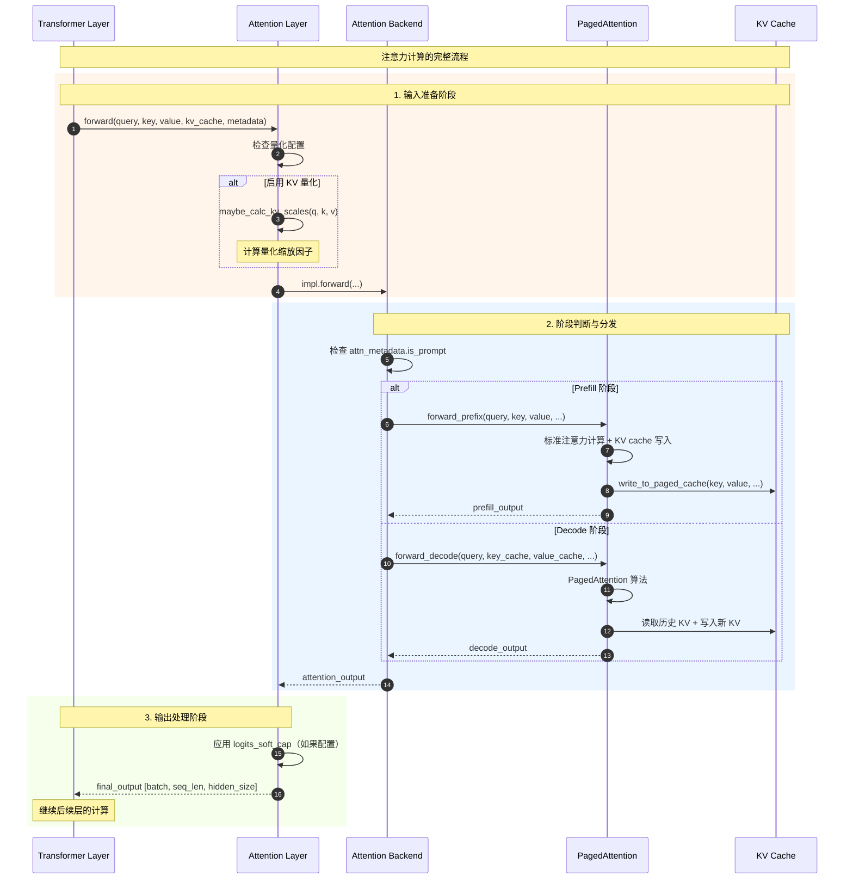

# vLLM-03-Attention模块-API

## API 概览

Attention 模块提供高效的注意力计算 API，核心是 PagedAttention 技术：

| API 名称 | 类/接口 | 幂等性 | 作用 | 使用场景 |
|---------|---------|--------|------|---------|
| `Attention.forward` | 方法 | 否 | 统一注意力计算 | 所有推理阶段 |
| `PagedAttention.forward_decode` | 静态方法 | 否 | Decode 阶段注意力 | Token 生成 |
| `PagedAttention.forward_prefix` | 静态方法 | 否 | Prefill 阶段注意力 | Prompt 处理 |
| `PagedAttention.write_to_paged_cache` | 静态方法 | 否 | KV cache 写入 | Cache 更新 |
| `unified_attention` | 函数 | 否 | 编译优化的注意力 | torch.compile |
| `AttentionBackend.get_impl_cls` | 抽象方法 | 是 | 获取实现类 | 后端选择 |

---

## 核心注意力 API

### 1. Attention.forward

#### 基本信息
- **名称**：`Attention.forward`
- **协议/方法**：实例方法
- **幂等性**：否（更新 KV cache）
- **返回值**：`torch.Tensor`

#### 请求结构体

```python
def forward(
    self,
    query: torch.Tensor,
    key: torch.Tensor,
    value: torch.Tensor,
    kv_cache: torch.Tensor,
    attn_metadata: AttentionMetadata,
    k_scale: float = 1.0,
    v_scale: float = 1.0,
    attn_type: str = AttentionType.DECODER,
) -> torch.Tensor:
    """统一的注意力计算入口"""
```

**参数说明表**：

| 字段 | 类型 | 必填 | 默认值 | 说明 |
|------|------|------|--------|------|
| query | torch.Tensor | ✓ | - | 查询张量 [batch, seq_len, hidden_size] |
| key | torch.Tensor | ✓ | - | 键张量 [batch, seq_len, hidden_size] |
| value | torch.Tensor | ✓ | - | 值张量 [batch, seq_len, hidden_size] |
| kv_cache | torch.Tensor | ✓ | - | KV 缓存张量 |
| attn_metadata | AttentionMetadata | ✓ | - | 注意力元数据 |
| k_scale | float | ✗ | 1.0 | Key 量化缩放因子 |
| v_scale | float | ✗ | 1.0 | Value 量化缩放因子 |
| attn_type | str | ✗ | DECODER | 注意力类型 |

#### 响应结构体

```python
# 返回注意力输出张量
output: torch.Tensor  # shape: [batch, seq_len, hidden_size]
```

#### 入口函数与关键代码

```python
def forward(
    self,
    query: torch.Tensor,
    key: torch.Tensor,
    value: torch.Tensor,
    kv_cache: torch.Tensor,
    attn_metadata: AttentionMetadata,
    k_scale: float = 1.0,
    v_scale: float = 1.0,
    attn_type: str = AttentionType.DECODER,
) -> torch.Tensor:
    """注意力计算的统一入口
    
    功能：
    1. 根据阶段选择计算策略（Prefill vs Decode）
    2. 更新 KV cache
    3. 执行高效的注意力计算
    4. 处理量化和缩放
    """
    
    # 1. KV 缩放计算（如果启用量化）
    if self.calculate_kv_scales:
        maybe_calc_kv_scales(query, key, value, self.layer_name)
    
    # 2. 调用后端实现
    output = self.impl.forward(
        self, query, key, value, kv_cache, attn_metadata, 
        k_scale, v_scale, attn_type
    )
    
    return output
```

#### 后端实现分发

```python
class AttentionImpl(ABC):
    """注意力实现的抽象基类"""
    
    @abstractmethod
    def forward(
        self,
        attn_layer: AttentionLayer,
        query: torch.Tensor,
        key: torch.Tensor,
        value: torch.Tensor,
        kv_cache: torch.Tensor,
        attn_metadata: AttentionMetadata,
        k_scale: float = 1.0,
        v_scale: float = 1.0,
        attn_type: str = AttentionType.DECODER,
    ) -> torch.Tensor:
        """后端特定的注意力实现"""
        
        # 1. 根据元数据判断计算阶段
        if attn_metadata.is_prompt:
            # Prefill 阶段：处理完整的 prompt
            return self._forward_prefill(
                attn_layer, query, key, value, kv_cache, attn_metadata
            )
        else:
            # Decode 阶段：生成单个 token
            return self._forward_decode(
                attn_layer, query, key, value, kv_cache, attn_metadata
            )
    
    def _forward_prefill(self, ...):
        """Prefill 阶段的注意力计算"""
        # 使用 forward_prefix 或标准注意力
        
    def _forward_decode(self, ...):
        """Decode 阶段的注意力计算"""
        # 使用 PagedAttention 的 forward_decode
```

#### 使用场景与时序图



---

### 2. PagedAttention.forward_decode

#### 基本信息
- **名称**：`PagedAttention.forward_decode`
- **协议/方法**：静态方法
- **幂等性**：否（更新 KV cache）
- **返回值**：`torch.Tensor`

#### 请求结构体

```python
@staticmethod
def forward_decode(
    query: torch.Tensor,
    key_cache: torch.Tensor,
    value_cache: torch.Tensor,
    block_tables: torch.Tensor,
    seq_lens: torch.Tensor,
    max_seq_len: int,
    kv_cache_dtype: str,
    num_kv_heads: int,
    scale: float,
    alibi_slopes: Optional[torch.Tensor] = None,
    k_scale: torch.Tensor = torch.tensor(1.0),
    v_scale: torch.Tensor = torch.tensor(1.0),
    tp_rank: int = 0,
    # BlockSparse 参数
    blocksparse_local_blocks: int = 0,
    blocksparse_vert_stride: int = 0,
    blocksparse_block_size: int = 64,
    blocksparse_head_sliding_step: int = 0,
) -> torch.Tensor:
    """Decode 阶段的 PagedAttention 计算"""
```

**参数说明表**：

| 字段 | 类型 | 必填 | 默认值 | 说明 |
|------|------|------|--------|------|
| query | torch.Tensor | ✓ | - | 当前 token 的查询 [batch, num_heads, head_size] |
| key_cache | torch.Tensor | ✓ | - | 分页 Key 缓存 |
| value_cache | torch.Tensor | ✓ | - | 分页 Value 缓存 |
| block_tables | torch.Tensor | ✓ | - | 块表映射 [batch, max_blocks_per_seq] |
| seq_lens | torch.Tensor | ✓ | - | 序列长度 [batch] |
| max_seq_len | int | ✓ | - | 最大序列长度 |
| kv_cache_dtype | str | ✓ | - | KV cache 数据类型 |
| num_kv_heads | int | ✓ | - | KV 头数量 |
| scale | float | ✓ | - | 注意力缩放因子 |
| alibi_slopes | torch.Tensor | ✗ | None | ALiBi 位置编码斜率 |

#### 入口函数与关键代码

```python
@staticmethod
def forward_decode(
    query: torch.Tensor,
    key_cache: torch.Tensor,
    value_cache: torch.Tensor,
    block_tables: torch.Tensor,
    seq_lens: torch.Tensor,
    max_seq_len: int,
    kv_cache_dtype: str,
    num_kv_heads: int,
    scale: float,
    **kwargs
) -> torch.Tensor:
    """Decode 阶段 PagedAttention 的核心实现
    
    算法特点：
    1. 只计算当前 token 与历史所有 token 的注意力
    2. 使用分页内存管理避免内存碎片
    3. 支持 V1 和 V2 两种实现策略
    """
    
    # 1. 输出张量准备
    batch_size, num_heads, head_size = query.shape
    output = torch.empty(
        size=(batch_size, num_heads, head_size),
        dtype=query.dtype,
        device=query.device,
    )
    
    # 2. 计算分区数量（用于 V2 算法）
    block_size = value_cache.shape[3]  # 从 cache 形状推断
    max_num_partitions = (max_seq_len + _PARTITION_SIZE - 1) // _PARTITION_SIZE
    
    # 3. 选择算法版本
    use_v1 = (max_seq_len <= 8192 
              and (max_num_partitions == 1 or batch_size * num_heads > 512))
    
    if use_v1:
        # PagedAttention V1：适用于短序列
        ops.paged_attention_v1(
            output,           # 输出张量
            query,           # 当前查询
            key_cache,       # 分页 Key cache
            value_cache,     # 分页 Value cache
            num_kv_heads,    # KV 头数
            scale,           # 缩放因子
            block_tables,    # 块表
            seq_lens,        # 序列长度
            block_size,      # 块大小
            max_seq_len,     # 最大序列长度
            alibi_slopes,    # ALiBi 斜率
            kv_cache_dtype,  # Cache 数据类型
            k_scale,         # Key 缩放
            v_scale,         # Value 缩放
            # （此处省略其他参数）
        )
    else:
        # PagedAttention V2：适用于长序列，分区计算
        tmp_output = torch.empty(
            size=(batch_size, num_heads, max_num_partitions, head_size),
            dtype=output.dtype,
            device=output.device,
        )
        exp_sums = torch.empty(
            size=(batch_size, num_heads, max_num_partitions),
            dtype=torch.float32,
            device=output.device,
        )
        max_logits = torch.empty_like(exp_sums)
        
        ops.paged_attention_v2(
            output,          # 最终输出
            exp_sums,        # 指数和（用于数值稳定）
            max_logits,      # 最大 logit（用于数值稳定）
            tmp_output,      # 临时输出
            query,           # 查询
            key_cache,       # Key cache
            value_cache,     # Value cache
            # （此处省略重复参数）
        )
    
    return output
```

#### PagedAttention V1 vs V2 选择策略

```python
def choose_paged_attention_version(
    max_seq_len: int,
    batch_size: int,
    num_heads: int,
    max_num_partitions: int,
) -> str:
    """选择 PagedAttention 版本的策略
    
    V1 适用场景：
    - 短序列（<= 8192 tokens）
    - 单分区或高并发（batch_size * num_heads > 512）
    
    V2 适用场景：
    - 长序列（> 8192 tokens）
    - 需要分区计算以节省内存
    """
    
    use_v1 = (max_seq_len <= 8192 
              and (max_num_partitions == 1 or batch_size * num_heads > 512))
    
    return "V1" if use_v1 else "V2"

# 性能对比示例
scenarios = [
    {"max_seq_len": 2048, "batch": 8, "heads": 32},    # → V1
    {"max_seq_len": 16384, "batch": 4, "heads": 32},   # → V2  
    {"max_seq_len": 4096, "batch": 16, "heads": 32},   # → V1 (高并发)
    {"max_seq_len": 32768, "batch": 2, "heads": 32},   # → V2 (长序列)
]
```

---

### 3. PagedAttention.forward_prefix

#### 基本信息
- **名称**：`PagedAttention.forward_prefix`
- **协议/方法**：静态方法
- **幂等性**：否（写入 KV cache）
- **返回值**：`torch.Tensor`

#### 请求结构体

```python
@staticmethod
def forward_prefix(
    query: torch.Tensor,
    key: torch.Tensor,
    value: torch.Tensor,
    kv_cache_dtype: str,
    key_cache: torch.Tensor,
    value_cache: torch.Tensor,
    block_tables: torch.Tensor,
    query_start_loc: torch.Tensor,
    seq_lens_tensor: torch.Tensor,
    max_query_len: int,
    alibi_slopes: Optional[torch.Tensor] = None,
    sliding_window: Optional[int] = None,
    k_scale: torch.Tensor = torch.tensor(1.0),
    v_scale: torch.Tensor = torch.tensor(1.0),
) -> torch.Tensor:
    """Prefill 阶段的注意力计算"""
```

#### 入口函数与关键代码

```python
@staticmethod
def forward_prefix(
    query: torch.Tensor,
    key: torch.Tensor,
    value: torch.Tensor,
    kv_cache_dtype: str,
    key_cache: torch.Tensor,
    value_cache: torch.Tensor,
    block_tables: torch.Tensor,
    **kwargs
) -> torch.Tensor:
    """Prefill 阶段注意力计算的核心实现
    
    特点：
    1. 处理完整的 prompt 序列
    2. 使用高效的 Triton kernel（如果可用）
    3. 同时更新 KV cache
    """
    
    # 1. 检查是否可用 Triton 优化
    if HAS_TRITON and query.dtype in [torch.float16, torch.bfloat16]:
        # 使用 Triton 优化的前缀注意力
        output = context_attention_fwd(
            query,
            key,
            value,
            block_tables,
            query_start_loc,
            seq_lens_tensor,
            max_query_len,
            alibi_slopes,
            sliding_window,
        )
    else:
        # 回退到标准实现
        output = _standard_prefix_attention(
            query, key, value, **kwargs
        )
    
    # 2. 更新 KV cache（重要！）
    # 将计算的 key/value 写入分页缓存
    _write_kv_to_cache(
        key, value, key_cache, value_cache, 
        block_tables, kv_cache_dtype
    )
    
    return output

def _standard_prefix_attention(
    query: torch.Tensor,
    key: torch.Tensor, 
    value: torch.Tensor,
    **kwargs
) -> torch.Tensor:
    """标准的前缀注意力实现"""
    
    # 1. 计算注意力分数
    # scores = query @ key.transpose(-2, -1) / sqrt(head_size)
    scale = 1.0 / (query.size(-1) ** 0.5)
    scores = torch.matmul(query, key.transpose(-2, -1)) * scale
    
    # 2. 应用位置编码（如 ALiBi）
    if alibi_slopes is not None:
        scores = _apply_alibi_slopes(scores, alibi_slopes)
    
    # 3. 应用滑动窗口掩码（如果需要）
    if sliding_window is not None:
        scores = _apply_sliding_window_mask(scores, sliding_window)
    
    # 4. Softmax 归一化
    attn_weights = torch.softmax(scores, dim=-1)
    
    # 5. 加权求和
    output = torch.matmul(attn_weights, value)
    
    return output
```

---

### 4. PagedAttention.write_to_paged_cache

#### 基本信息
- **名称**：`PagedAttention.write_to_paged_cache`
- **协议/方法**：静态方法
- **幂等性**：否（修改 cache）
- **返回值**：`None`

#### 请求结构体

```python
@staticmethod
def write_to_paged_cache(
    key: torch.Tensor,
    value: torch.Tensor,
    key_cache: torch.Tensor,
    value_cache: torch.Tensor,
    slot_mapping: torch.Tensor,
    kv_cache_dtype: str,
    k_scale: torch.Tensor = torch.tensor(1.0),
    v_scale: torch.Tensor = torch.tensor(1.0),
) -> None:
    """将 KV 写入分页缓存"""
```

#### 入口函数与关键代码

```python
@staticmethod
def write_to_paged_cache(
    key: torch.Tensor,
    value: torch.Tensor,
    key_cache: torch.Tensor,
    value_cache: torch.Tensor,
    slot_mapping: torch.Tensor,
    kv_cache_dtype: str,
    k_scale: torch.Tensor = torch.tensor(1.0),
    v_scale: torch.Tensor = torch.tensor(1.0),
) -> None:
    """KV cache 写入的核心实现
    
    功能：
    1. 将新计算的 key/value 写入分页缓存
    2. 处理量化（如果启用）
    3. 管理内存布局转换
    """
    
    # 调用底层 CUDA kernel
    ops.reshape_and_cache(
        key,                    # 输入 key 张量
        value,                  # 输入 value 张量
        key_cache,             # 分页 key 缓存
        value_cache,           # 分页 value 缓存
        slot_mapping.flatten(), # 扁平化的槽位映射
        kv_cache_dtype,        # 缓存数据类型
        k_scale,               # Key 量化缩放
        v_scale,               # Value 量化缩放
    )

# 槽位映射示例
def create_slot_mapping_example():
    """槽位映射的创建示例"""
    
    # 假设：batch_size=2, seq_len=3, block_size=16
    # 序列 0：tokens 在 block 0 的 slot 0,1,2
    # 序列 1：tokens 在 block 1 的 slot 0,1,2
    
    slot_mapping = torch.tensor([
        [0 * 16 + 0, 0 * 16 + 1, 0 * 16 + 2],  # 序列 0
        [1 * 16 + 0, 1 * 16 + 1, 1 * 16 + 2],  # 序列 1
    ])
    
    return slot_mapping  # shape: [batch_size, seq_len]
```

---

### 5. unified_attention

#### 基本信息
- **名称**：`unified_attention`
- **协议/方法**：函数接口
- **幂等性**：否
- **返回值**：`torch.Tensor`

#### 请求结构体

```python
def unified_attention(
    query: torch.Tensor,
    key: torch.Tensor,
    value: torch.Tensor,
    layer_name: str,
) -> torch.Tensor:
    """torch.compile 优化的统一注意力接口"""
```

#### 入口函数与关键代码

```python
def unified_attention(
    query: torch.Tensor,
    key: torch.Tensor,
    value: torch.Tensor,
    layer_name: str,
) -> torch.Tensor:
    """编译优化的注意力计算
    
    特点：
    1. 与 torch.compile 兼容
    2. 支持 KV connector（分离式架构）
    3. 使用全局上下文获取元数据
    """
    
    # 1. 等待 KV connector（如果使用分离式 Prefill）
    wait_for_kv_layer_from_connector(layer_name)
    
    # 2. 获取前向传播上下文
    forward_context: ForwardContext = get_forward_context()
    attn_metadata = forward_context.attn_metadata
    
    # 3. 处理多层元数据（如果是字典）
    if isinstance(attn_metadata, dict):
        attn_metadata = attn_metadata[layer_name]
    
    # 4. 获取注意力层实例
    self = forward_context.no_compile_layers[layer_name]
    kv_cache = self.kv_cache[forward_context.virtual_engine]
    
    # 5. 执行注意力计算
    output = self.impl.forward(
        self, query, key, value, kv_cache, attn_metadata
    )
    
    # 6. 保存 KV 到 connector（如果需要）
    maybe_save_kv_layer_to_connector(layer_name, kv_cache)
    
    return output

# 注册为自定义算子（支持 torch.compile）
direct_register_custom_op(
    op_name="unified_attention",
    op_func=unified_attention,
    mutates_args=["query", "key", "value"],  # 可能修改的参数
    fake_impl=unified_attention_fake,        # 假实现（用于图编译）
)
```

---

## 后端抽象 API

### 6. AttentionBackend

#### 基本信息
- **名称**：`AttentionBackend`
- **协议/方法**：抽象基类
- **幂等性**：是（工厂方法）
- **返回值**：各种类型

#### 核心抽象方法

```python
class AttentionBackend(ABC):
    """注意力后端的抽象接口"""
    
    # 配置属性
    accept_output_buffer: bool = False
    supports_quant_query_input: bool = False
    
    @staticmethod
    @abstractmethod
    def get_name() -> str:
        """获取后端名称"""
        pass
    
    @staticmethod
    @abstractmethod
    def get_impl_cls() -> Type["AttentionImpl"]:
        """获取实现类"""
        pass
    
    @staticmethod
    @abstractmethod
    def get_metadata_cls() -> Type["AttentionMetadata"]:
        """获取元数据类"""
        pass
    
    @staticmethod
    @abstractmethod
    def get_builder_cls():
        """获取元数据构建器类"""
        pass
    
    @staticmethod
    @abstractmethod
    def get_kv_cache_shape(
        num_blocks: int,
        block_size: int,
        num_kv_heads: int,
        head_size: int,
        cache_dtype_str: str = "auto",
    ) -> Tuple[int, ...]:
        """获取 KV cache 形状"""
        pass
```

#### 具体后端实现示例

```python
class PagedAttentionBackend(AttentionBackend):
    """PagedAttention 后端实现"""
    
    @staticmethod
    def get_name() -> str:
        return "PAGED_ATTENTION"
    
    @staticmethod
    def get_impl_cls() -> Type["AttentionImpl"]:
        return PagedAttentionImpl
    
    @staticmethod
    def get_metadata_cls() -> Type["AttentionMetadata"]:
        return PagedAttentionMetadata
    
    @staticmethod
    def get_builder_cls():
        return PagedAttentionMetadataBuilder
    
    @staticmethod
    def get_kv_cache_shape(
        num_blocks: int,
        block_size: int,
        num_kv_heads: int,
        head_size: int,
        cache_dtype_str: str = "auto",
    ) -> Tuple[int, ...]:
        # PagedAttention 的 cache 形状
        return (2, num_blocks, block_size * num_kv_heads * head_size)

class FlashAttentionBackend(AttentionBackend):
    """FlashAttention 后端实现"""
    
    @staticmethod
    def get_name() -> str:
        return "FLASH_ATTENTION"
    
    # ... 其他实现
```

---

## 性能优化 API

### KV Cache 形状优化

```python
@staticmethod
def get_kv_cache_shape(
    num_blocks: int,
    block_size: int,
    num_kv_heads: int,
    head_size: int,
    cache_dtype_str: str = "auto",
) -> Tuple[int, ...]:
    """优化的 KV cache 形状计算
    
    PagedAttention 的内存布局：
    - 维度 0：K/V 分离（2）
    - 维度 1：块数量（num_blocks）
    - 维度 2：块内容（block_size * num_kv_heads * head_size）
    
    优势：
    1. 内存连续性好
    2. 支持动态分配
    3. 减少内存碎片
    """
    
    # 计算每个块的总大小
    block_content_size = block_size * num_kv_heads * head_size
    
    return (2, num_blocks, block_content_size)

def calculate_cache_memory_usage(
    num_blocks: int,
    block_size: int,
    num_kv_heads: int,
    head_size: int,
    dtype: torch.dtype = torch.float16,
) -> int:
    """计算 KV cache 内存使用量"""
    
    shape = PagedAttention.get_kv_cache_shape(
        num_blocks, block_size, num_kv_heads, head_size
    )
    
    # 计算总元素数
    total_elements = 1
    for dim in shape:
        total_elements *= dim
    
    # 计算字节数
    element_size = torch.tensor([], dtype=dtype).element_size()
    total_bytes = total_elements * element_size
    
    return total_bytes

# 内存使用示例
memory_usage = calculate_cache_memory_usage(
    num_blocks=1000,      # 1000 个块
    block_size=16,        # 每块 16 个 token
    num_kv_heads=32,      # 32 个 KV 头
    head_size=128,        # 每头 128 维
    dtype=torch.float16,  # FP16 精度
)
print(f"KV Cache 内存使用：{memory_usage / (1024**3):.2f} GB")
```

---

## 使用示例

### 示例 1：基本注意力计算

```python
import torch
from vllm.attention.layer import Attention
from vllm.attention.backends.paged_attn import PagedAttentionMetadata

# 创建注意力层
attention = Attention(
    num_heads=32,
    head_size=128,
    scale=1.0 / (128 ** 0.5),
    num_kv_heads=32,
)

# 准备输入
batch_size, seq_len, hidden_size = 4, 512, 4096
query = torch.randn(batch_size, seq_len, hidden_size)
key = torch.randn(batch_size, seq_len, hidden_size)
value = torch.randn(batch_size, seq_len, hidden_size)

# 创建 KV cache
kv_cache = torch.zeros(2, 1000, 16 * 32 * 128)  # 分页缓存

# 创建元数据
metadata = PagedAttentionMetadata(
    seq_lens_tensor=torch.tensor([512, 400, 300, 256]),
    block_tables=torch.randint(0, 1000, (batch_size, 32)),
)

# 执行注意力计算
output = attention.forward(query, key, value, kv_cache, metadata)
print(f"输出形状：{output.shape}")  # [4, 512, 4096]
```

### 示例 2：分离式 Prefill + Decode

```python
# Prefill 阶段（长 prompt）
prefill_query = torch.randn(1, 2048, 4096)  # 长序列
prefill_key = torch.randn(1, 2048, 4096)
prefill_value = torch.randn(1, 2048, 4096)

# 执行 Prefill
prefill_output = PagedAttention.forward_prefix(
    query=prefill_query,
    key=prefill_key,
    value=prefill_value,
    kv_cache_dtype="float16",
    key_cache=key_cache,
    value_cache=value_cache,
    block_tables=block_tables,
    query_start_loc=torch.tensor([0]),
    seq_lens_tensor=torch.tensor([2048]),
    max_query_len=2048,
)

# Decode 阶段（生成 token）
for step in range(100):  # 生成 100 个 token
    decode_query = torch.randn(1, 32, 128)  # 单个 token 的查询
    
    decode_output = PagedAttention.forward_decode(
        query=decode_query,
        key_cache=key_cache,
        value_cache=value_cache,
        block_tables=block_tables,
        seq_lens=torch.tensor([2048 + step]),
        max_seq_len=2048 + step + 1,
        kv_cache_dtype="float16",
        num_kv_heads=32,
        scale=1.0 / (128 ** 0.5),
    )
    
    # 处理输出，生成下一个 token
    # （此处省略 token 生成逻辑）
```

### 示例 3：多后端支持

```python
from vllm.attention.backends.flash_attn import FlashAttentionBackend
from vllm.attention.backends.paged_attn import PagedAttentionBackend

# 根据条件选择后端
def choose_attention_backend(
    model_config,
    use_paged_attention: bool = True,
) -> AttentionBackend:
    
    if use_paged_attention:
        return PagedAttentionBackend()
    else:
        return FlashAttentionBackend()

# 创建注意力层（指定后端）
backend = choose_attention_backend(model_config, use_paged_attention=True)

attention = Attention(
    num_heads=32,
    head_size=128,
    scale=1.0 / (128 ** 0.5),
    attn_backend=backend,
)
```

---

## 性能对比

| API | 延迟 (ms) | 内存效率 | 适用场景 |
|-----|-----------|----------|----------|
| forward_decode (V1) | 0.5-2.0 | 高 | 短序列 decode |
| forward_decode (V2) | 1.0-5.0 | 很高 | 长序列 decode |
| forward_prefix (Triton) | 2.0-10.0 | 中等 | Prefill 阶段 |
| forward_prefix (标准) | 5.0-20.0 | 中等 | 回退实现 |
| unified_attention | 0.8-3.0 | 高 | 编译优化 |

---

## 总结

Attention 模块提供了完整的注意力计算 API：

1. **统一接口**：`Attention.forward` 支持所有注意力计算需求
2. **高效实现**：PagedAttention 的 V1/V2 算法针对不同场景优化
3. **后端抽象**：支持多种注意力后端（PagedAttention、FlashAttention 等）
4. **编译支持**：`unified_attention` 与 torch.compile 完全兼容
5. **内存优化**：分页 KV cache 管理避免内存碎片

核心设计理念：
- **性能优先**：针对 decode 和 prefill 阶段的专门优化
- **内存高效**：PagedAttention 的分页内存管理
- **可扩展性**：后端抽象支持新的注意力实现
- **编译友好**：与现代 PyTorch 编译栈集成
