# vLLM-03-Attention模块-数据结构

## 关键数据结构概览

Attention 模块的数据结构设计围绕高效的注意力计算和内存管理展开，包括核心类定义、元数据管理和缓存结构三个层次。

```mermaid
classDiagram
    class AttentionType {
        +String DECODER
        +String ENCODER
        +String ENCODER_ONLY
        +String ENCODER_DECODER
    }
    
    class AttentionBackend {
        <<abstract>>
        +bool accept_output_buffer
        +bool supports_quant_query_input
        +get_name()* String
        +get_impl_cls()* Type
        +get_metadata_cls()* Type
        +get_builder_cls()* Type
        +get_kv_cache_shape()* Tuple
        +make_metadata() AttentionMetadata
    }
    
    class AttentionMetadata {
        <<abstract>>
    }
    
    class Attention {
        -num_heads: int
        -head_size: int
        -scale: float
        -num_kv_heads: int
        -sliding_window: Optional[int]
        -kv_cache_dtype: String
        -block_size: int
        -calculate_kv_scales: bool
        -impl: AttentionImpl
        -kv_cache: List[torch.Tensor]
        +forward(query, key, value) torch.Tensor
        +load_weights(weights) None
    }
    
    class PagedAttentionMetadata {
        +seq_lens_tensor: torch.Tensor
        +max_decode_seq_len: int
        +block_tables: torch.Tensor
    }
    
    class AttentionImpl {
        <<abstract>>
        +can_return_lse: bool
        +forward()* torch.Tensor
    }
    
    class AttentionLayer {
        <<protocol>>
        +_q_scale: torch.Tensor
        +_k_scale: torch.Tensor
        +_v_scale: torch.Tensor
        +forward() torch.Tensor
    }
    
    AttentionBackend --> AttentionMetadata : creates
    AttentionBackend --> AttentionImpl : creates
    Attention --> AttentionImpl : uses
    Attention --> AttentionBackend : configured by
    PagedAttentionMetadata --|> AttentionMetadata
    AttentionLayer <|.. Attention : implements
```



## 核心类定义

### 1. Attention 主类

```python
class Attention(nn.Module, AttentionLayerBase):
    """
    多头注意力计算的主要实现类
    支持各种注意力变体和优化后端
    """
    
    def __init__(
        self,
        num_heads: int,                    # 注意力头数
        head_size: int,                    # 每个头的维度大小
        scale: float,                      # 注意力缩放因子 (1/sqrt(head_size))
        num_kv_heads: Optional[int] = None,  # KV 头数（支持 GQA/MQA）
        alibi_slopes: Optional[List[float]] = None,  # ALiBi 位置编码斜率
        cache_config: Optional[CacheConfig] = None,  # 缓存配置
        quant_config: Optional[QuantizationConfig] = None,  # 量化配置
        logits_soft_cap: Optional[float] = None,     # Logits 软限制
        per_layer_sliding_window: Optional[int] = None,  # 滑动窗口大小
        use_mla: bool = False,             # 是否使用 MLA (Multi-Level Attention)
        use_sparse: bool = False,          # 是否使用稀疏注意力
        prefix: str = "",                  # 层名前缀
        attn_type: str = AttentionType.DECODER,  # 注意力类型
        kv_sharing_target_layer_name: Optional[str] = None,  # KV 共享目标层
        attn_backend: Optional[type[AttentionBackend]] = None,  # 指定后端
        **extra_impl_args,                # 额外实现参数
    ) -> None
```

**字段语义与约束**：

| 字段 | 类型 | 约束 | 默认值 | 说明 |
|------|------|------|--------|------|
| `num_heads` | int | > 0 | 必填 | 查询头数，决定并行度 |
| `head_size` | int | {32,64,80,96,112,120,128,192,256} | 必填 | 每个头的维度，受硬件优化限制 |
| `scale` | float | > 0 | 必填 | 注意力缩放因子，通常为 1/√head_size |
| `num_kv_heads` | int | ≤ num_heads | num_heads | KV 头数，支持分组查询注意力 |
| `sliding_window` | int | > 0 或 None | None | 滑动窗口大小，限制注意力范围 |
| `block_size` | int | 2^n, 通常 16 | 16 | KV 缓存块大小，影响内存分配粒度 |

### 2. AttentionBackend 抽象基类

```python
class AttentionBackend(ABC):
    """
    注意力后端的抽象基类
    定义了所有后端必须实现的接口
    """
    
    # 类属性
    accept_output_buffer: bool = False      # 是否接受预分配的输出缓冲区
    supports_quant_query_input: bool = False  # 是否支持量化查询输入
    
    @staticmethod
    @abstractmethod
    def get_name() -> str:
        """返回后端名称"""
        raise NotImplementedError
    
    @staticmethod
    @abstractmethod
    def get_impl_cls() -> Type["AttentionImpl"]:
        """返回具体实现类"""
        raise NotImplementedError
    
    @staticmethod
    @abstractmethod
    def get_metadata_cls() -> Type["AttentionMetadata"]:
        """返回元数据类"""
        raise NotImplementedError
    
    @staticmethod
    @abstractmethod
    def get_kv_cache_shape(
        num_blocks: int,
        block_size: int,
        num_kv_heads: int,
        head_size: int,
        cache_dtype_str: str = "auto",
    ) -> Tuple[int, ...]:
        """计算 KV 缓存的张量形状"""
        raise NotImplementedError
```

### 3. AttentionType 枚举类

```python
class AttentionType:
    """
    注意力类型定义
    兼容 torch.compile 的字符串枚举
    """
    DECODER = "decoder"           # 解码器自注意力
    ENCODER = "encoder"           # 编码器自注意力
    ENCODER_ONLY = "encoder_only" # 仅编码器模型的注意力
    ENCODER_DECODER = "encoder_decoder"  # 编码器-解码器交叉注意力
```

## 元数据结构

### 1. AttentionMetadata 基类

```python
class AttentionMetadata:
    """
    注意力计算的元数据基类
    具体子类由各个后端实现
    """
    pass  # 基类为空，由子类扩展
```

### 2. PagedAttentionMetadata 结构

```python
@dataclass
class PagedAttentionMetadata:
    """
    PagedAttention 专用元数据
    管理分页内存布局和序列信息
    """
    
    # 序列长度信息
    seq_lens_tensor: Optional[torch.Tensor]  # 形状: (batch_size,)
    max_decode_seq_len: int                  # 批次中最大解码序列长度
    
    # 内存块映射表
    block_tables: Optional[torch.Tensor]     # 形状: (batch_size, max_blocks_per_seq)
```

**字段详细说明**：

| 字段 | 形状 | 数据类型 | 说明 |
|------|------|----------|------|
| `seq_lens_tensor` | `(batch_size,)` | torch.int32 | 每个序列的累计长度 |
| `max_decode_seq_len` | 标量 | int | 当前批次中解码序列的最大长度 |
| `block_tables` | `(batch_size, max_blocks_per_seq)` | torch.int32 | 物理块地址映射表 |

### 3. 前向上下文结构

```python
class ForwardContext:
    """
    前向传播的全局上下文
    通过上下文管理器在层间传递信息
    """
    
    attn_metadata: Union[AttentionMetadata, Dict[str, AttentionMetadata]]
    # 注意力元数据，可以是单个对象或按层索引的字典
    
    virtual_engine: int = 0
    # 虚拟引擎索引，用于多引擎并行
    
    no_compile_layers: Dict[str, "Attention"]
    # 不参与编译的层映射，用于 torch.compile 优化
```

## KV 缓存数据结构

### 1. 缓存张量布局

```python
# KV 缓存张量的典型形状组织
kv_cache_shape = (
    num_blocks,          # 总块数
    2,                   # Key 和 Value 两个张量
    block_size,          # 每块的 token 数
    num_kv_heads,        # KV 头数
    head_size            # 每个头的维度
)
```

### 2. 块管理结构

```python
class BlockTable:
    """
    逻辑到物理块的映射表
    支持动态分配和释放
    """
    
    def __init__(self):
        self.logical_to_physical: Dict[int, int] = {}  # 逻辑块 -> 物理块
        self.physical_to_logical: Dict[int, int] = {}  # 物理块 -> 逻辑块
        self.free_blocks: Set[int] = set()             # 空闲物理块集合
        self.allocated_blocks: Set[int] = set()        # 已分配物理块集合
```

## 量化相关结构

### 1. 量化参数

```python
class QuantizationScales:
    """
    注意力计算中的量化缩放参数
    """
    
    # 输入量化缩放
    _q_scale: torch.Tensor     # Query 量化缩放因子
    _k_scale: torch.Tensor     # Key 量化缩放因子  
    _v_scale: torch.Tensor     # Value 量化缩放因子
    
    # 浮点版本（用于某些计算）
    _q_scale_float: float
    _k_scale_float: float
    _v_scale_float: float
    
    # 概率量化缩放
    _prob_scale: torch.Tensor  # 注意力概率的量化缩放
```

### 2. 量化配置集成

```python
def setup_quantization(self, quant_config: QuantizationConfig):
    """
    根据量化配置设置量化参数
    """
    if quant_config is not None and quant_config.enable_kv_cache_quantization:
        # 启用 KV 缓存量化
        self.kv_cache_dtype = quant_config.kv_cache_dtype
        self.calculate_kv_scales = True
        
        # 设置量化算子
        self.query_quant = quant_config.get_query_quantizer()
        
    else:
        # 禁用量化
        self.kv_cache_dtype = "auto"
        self.calculate_kv_scales = False
        self.query_quant = None
```

## 数据流映射关系

### 1. 输入到缓存的映射

```python
def store_kv_mapping(
    key: torch.Tensor,      # 输入 Key 张量 [batch_size, seq_len, num_kv_heads, head_size]
    value: torch.Tensor,    # 输入 Value 张量 [batch_size, seq_len, num_kv_heads, head_size]
    block_tables: torch.Tensor,  # 块映射表 [batch_size, max_blocks_per_seq]
    kv_cache: torch.Tensor  # KV 缓存 [num_blocks, 2, block_size, num_kv_heads, head_size]
) -> None:
    """
    将输入的 Key/Value 张量存储到分页的 KV 缓存中
    
    映射规则：
    1. 根据 block_tables 确定每个序列的物理块位置
    2. 将 Key/Value 按 block_size 切分并存储到对应块中
    3. 处理跨块的序列，确保连续性
    """
```

### 2. 版本演进说明

| 版本 | 变更内容 | 兼容性 | 迁移建议 |
|------|----------|--------|----------|
| v0.1.x | 基础注意力实现 | 不兼容 | 已废弃 |
| v0.2.x | 引入 PagedAttention | 向后兼容 | 建议升级 |
| v0.3.x | 多后端架构 | 部分兼容 | 配置需调整 |
| v0.4.x | 量化支持 | 向后兼容 | 新增配置选项 |
| 当前版本 | 统一前向上下文 | 向后兼容 | 推荐最新特性 |

## 内存布局优化

### 1. 缓存内存对齐

```python
# 内存对齐策略
CACHE_ALIGNMENT = 16  # 字节对齐边界

def align_cache_size(size: int) -> int:
    """将缓存大小对齐到指定边界"""
    return (size + CACHE_ALIGNMENT - 1) // CACHE_ALIGNMENT * CACHE_ALIGNMENT
```

### 2. 批处理内存布局

```python
# 批处理优化的内存布局
batch_attention_layout = {
    "query": [batch_size, num_heads, seq_len, head_size],      # 查询张量
    "key_cache": [num_blocks, num_kv_heads, block_size, head_size],    # Key 缓存
    "value_cache": [num_blocks, num_kv_heads, head_size, block_size],  # Value 缓存（转置）
    "output": [batch_size, num_heads, seq_len, head_size],     # 输出张量
}
```

**性能考虑**：
- Key 缓存使用标准布局便于写入
- Value 缓存转置布局优化矩阵乘法
- 对齐边界减少内存访问延迟
- 块大小选择平衡内存利用率和计算效率
