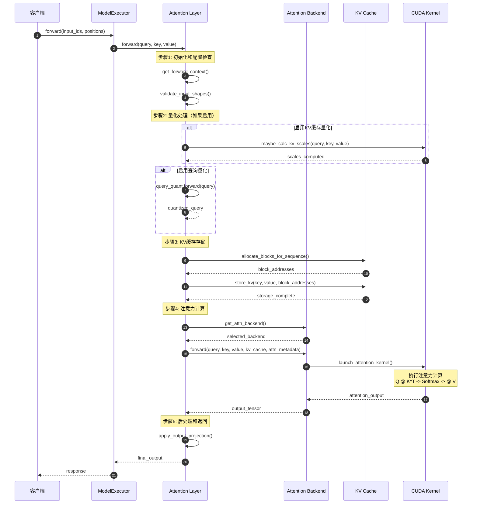
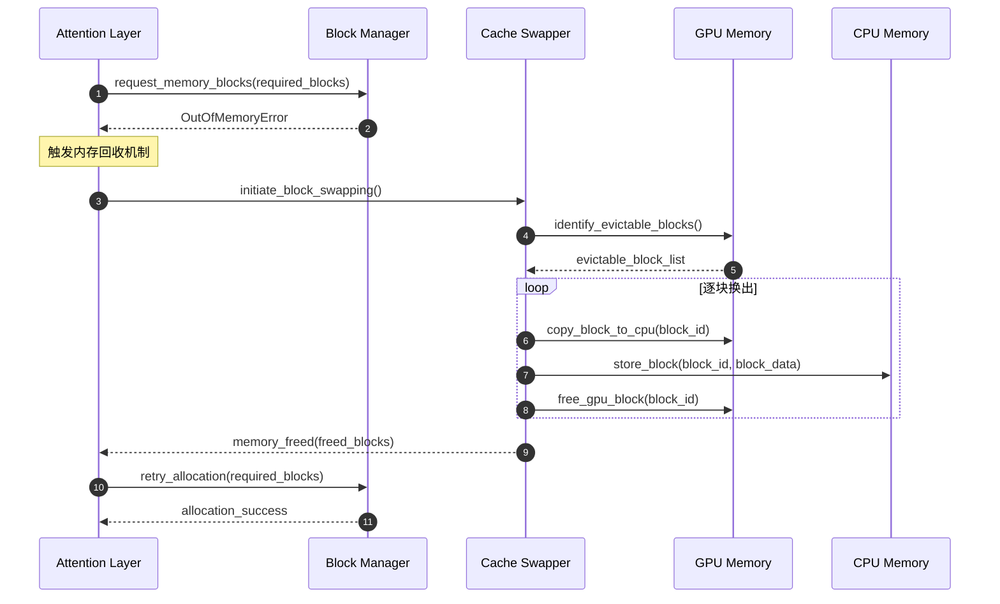
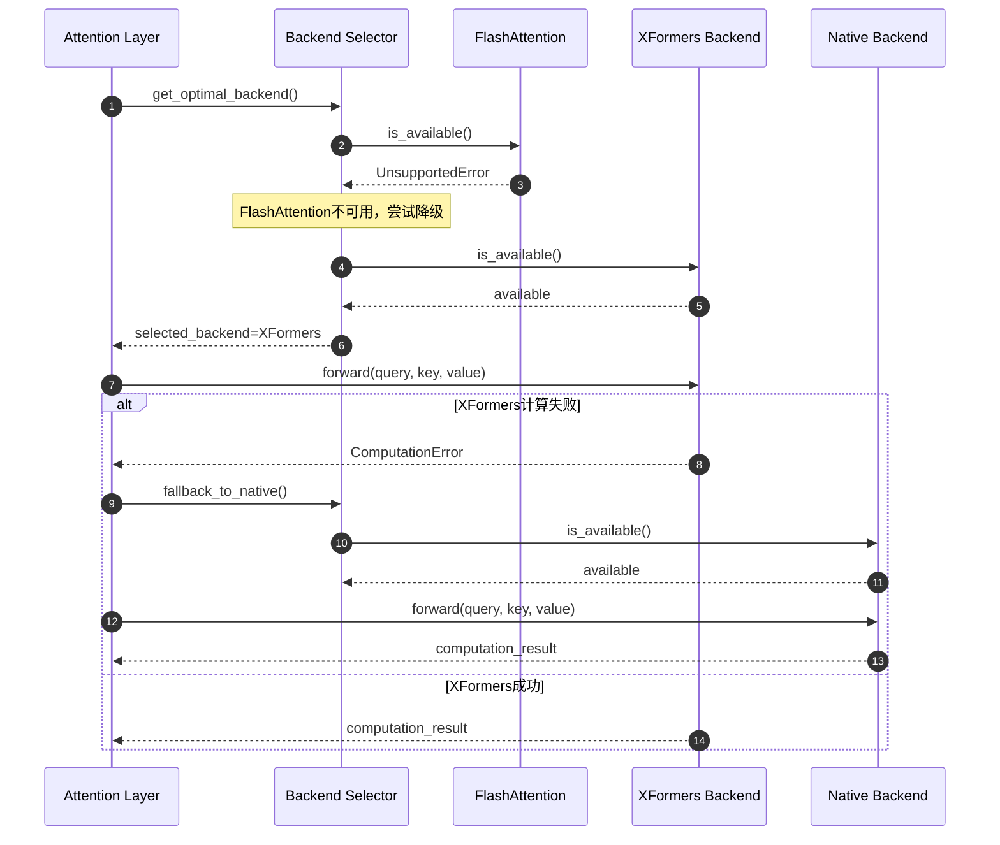
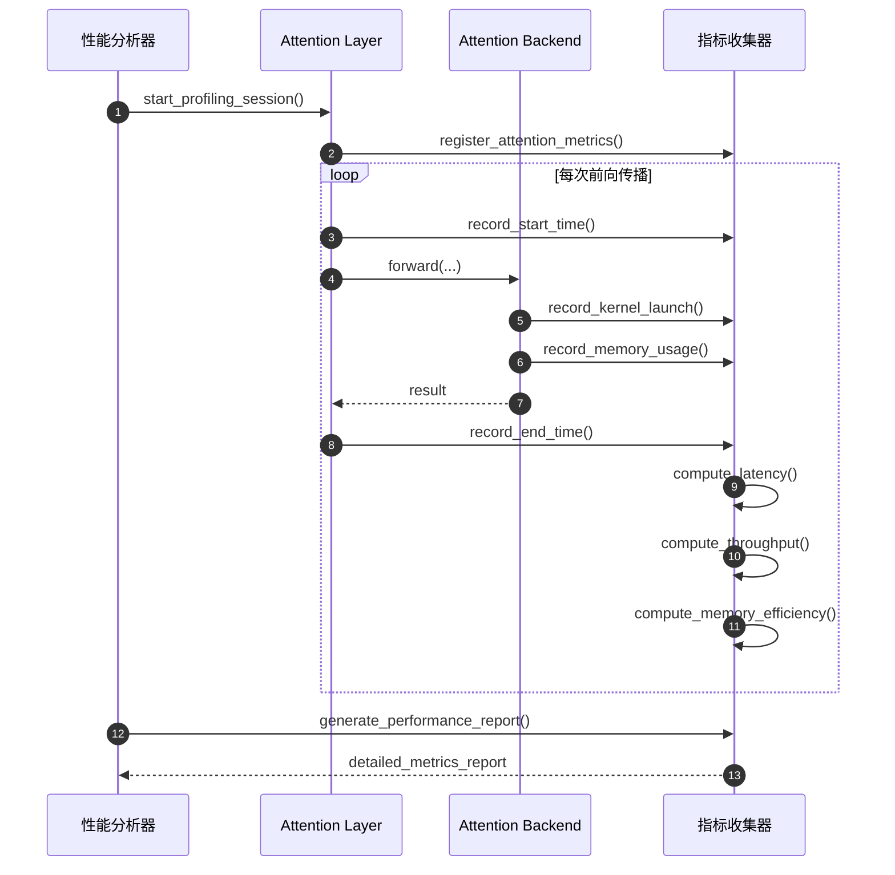

# vLLM-03-Attention模块-时序图

## 典型场景时序图分析

本文档展示 Attention 模块在不同使用场景下的详细时序图，涵盖预填充、解码和批处理等关键操作流程。

## 场景1：单序列预填充（Prefill）注意力计算

### 时序图



### 详细说明

**图意概述**：展示了预填充阶段注意力计算的完整流程，从输入处理到输出生成的全过程。

**关键步骤分解**：

1. **输入验证**（步骤1-2）：
   - 验证输入张量形状和数据类型
   - 获取前向上下文和注意力元数据
   - 检查量化配置并应用相应的量化操作

2. **KV缓存管理**（步骤3-6）：
   - 为新序列分配内存块
   - 将Key和Value张量存储到PagedAttention缓存中
   - 更新块映射表和序列元数据

3. **注意力计算**（步骤7-10）：
   - 选择最优的注意力后端（FlashAttention/XFormers/Native）
   - 启动CUDA内核执行矩阵运算
   - 应用Softmax和缩放操作

4. **输出处理**（步骤11-12）：
   - 应用输出投影层
   - 返回最终的注意力输出

**边界条件**：
- **并发控制**：单序列预填充不涉及并发，顺序执行
- **超时处理**：依赖ModelExecutor的超时控制机制  
- **幂等性**：预填充过程对相同输入产生相同输出
- **内存限制**：受GPU显存大小限制，长序列可能触发OOM

**异常情况**：
- CUDA内核启动失败时回退到CPU计算
- 内存不足时触发缓存块回收机制
- 量化计算溢出时降级到FP16精度

**性能特征**：
- 计算复杂度：O(n²·d)，其中n为序列长度
- 内存使用：O(n²)用于注意力矩阵，O(n·d)用于KV缓存
- 典型延迟：2-50ms（取决于序列长度和硬件）

## 场景2：批量解码（Decode）注意力计算

### 时序图

```mermaid
sequenceDiagram
    autonumber
    participant Scheduler as 调度器
    participant ModelExec as ModelExecutor  
    participant AttnLayer as Attention Layer
    participant Backend as Attention Backend
    participant KVCache as KV Cache
    participant BlockMgr as Block Manager
    
    Note over Scheduler: 批处理调度阶段
    Scheduler->>ModelExec: execute_model(batch_requests)
    ModelExec->>AttnLayer: forward(query_batch, key_batch, value_batch)
    
    Note over AttnLayer: 步骤1: 批处理元数据准备
    AttnLayer->>AttnLayer: prepare_batch_metadata()
    AttnLayer->>BlockMgr: get_block_tables(sequence_ids)
    BlockMgr-->>AttnLayer: block_tables[batch_size, max_blocks]
    
    Note over AttnLayer: 步骤2: 动态KV缓存更新
    loop 对每个序列
        AttnLayer->>KVCache: append_new_token_kv(seq_id, key, value)
        alt 需要新块
            KVCache->>BlockMgr: allocate_block()
            BlockMgr-->>KVCache: new_block_id
        end
        KVCache-->>AttnLayer: cache_updated
    end
    
    Note over AttnLayer: 步骤3: 批量注意力计算
    AttnLayer->>Backend: create_attention_metadata(block_tables, seq_lens)
    Backend-->>AttnLayer: batch_attn_metadata
    
    AttnLayer->>Backend: batch_decode_attention(
        query_batch, kv_cache, batch_attn_metadata)
    
    Note over Backend: 并行处理多个序列<br/>使用PagedAttention优化
    Backend->>Backend: launch_paged_attention_kernels()
    Backend-->>AttnLayer: attention_outputs[batch_size, num_heads, 1, head_size]
    
    Note over AttnLayer: 步骤4: 输出整理和返回  
    AttnLayer->>AttnLayer: reshape_batch_outputs()
    AttnLayer-->>ModelExec: batch_attention_results
    ModelExec-->>Scheduler: generation_outputs
```

### 详细说明

**图意概述**：展示了解码阶段多序列并行处理的批量注意力计算流程，重点关注内存管理和并发优化。

**关键特征**：

1. **动态内存管理**：
   - 根据序列长度动态分配和释放内存块
   - 支持不同长度序列的混合批处理
   - 内存块复用减少分配开销

2. **并行计算优化**：
   - PagedAttention支持非连续内存访问
   - GPU内核并行处理多个序列
   - 批量操作降低内核启动开销

3. **缓存一致性**：
   - 确保KV缓存的原子性更新
   - 维护序列间的内存隔离
   - 支持序列的动态添加和移除

**性能指标**：
- 批处理吞吐量：100-1000 tokens/second（取决于批大小）
- 内存利用率：85-95%（相比传统方法）
- 延迟开销：<1ms（批处理调度开销）

## 场景3：编码器-解码器交叉注意力

### 时序图

```mermaid
sequenceDiagram
    autonumber
    participant EncoderModel as Encoder Model
    participant DecoderModel as Decoder Model
    participant CrossAttn as Cross Attention Layer
    participant EncoderCache as Encoder KV Cache
    participant DecoderCache as Decoder KV Cache
    participant Backend as Attention Backend
    
    Note over EncoderModel: 编码阶段
    EncoderModel->>CrossAttn: encode_forward(encoder_input)
    CrossAttn->>EncoderCache: store_encoder_kv(encoder_keys, encoder_values)
    EncoderCache-->>CrossAttn: encoder_cache_ready
    CrossAttn-->>EncoderModel: encoder_representations
    
    Note over DecoderModel: 解码阶段开始
    DecoderModel->>CrossAttn: decode_forward(decoder_query, step=0)
    
    Note over CrossAttn: 步骤1: 跨注意力元数据构建
    CrossAttn->>CrossAttn: create_cross_attention_metadata()
    CrossAttn->>EncoderCache: get_encoder_kv_cache()
    EncoderCache-->>CrossAttn: encoder_kv_tensors
    
    Note over CrossAttn: 步骤2: 交叉注意力计算
    CrossAttn->>Backend: cross_attention_forward(
        decoder_query, encoder_keys, encoder_values, cross_attn_metadata)
    
    Backend->>Backend: compute_cross_attention()
    Note over Backend: Q_dec @ K_enc^T -> Softmax -> @ V_enc
    Backend-->>CrossAttn: cross_attention_output
    
    Note over CrossAttn: 步骤3: 自注意力计算
    CrossAttn->>DecoderCache: get_decoder_kv_cache()
    DecoderCache-->>CrossAttn: decoder_kv_tensors
    
    CrossAttn->>Backend: self_attention_forward(
        decoder_query, decoder_kv_tensors, self_attn_metadata)
    Backend-->>CrossAttn: self_attention_output
    
    Note over CrossAttn: 步骤4: 多头注意力融合
    CrossAttn->>CrossAttn: fuse_attention_outputs(cross_output, self_output)
    CrossAttn-->>DecoderModel: fused_attention_result
    
    Note over DecoderModel: 后续解码步骤
    loop 生成剩余tokens
        DecoderModel->>CrossAttn: decode_forward(decoder_query, step=i)
        Note over CrossAttn: 重复步骤2-4，但跳过编码器KV缓存更新
        CrossAttn-->>DecoderModel: attention_result
    end
```

### 详细说明

**图意概述**：展示了编码器-解码器架构中交叉注意力的完整计算流程，包括编码器KV缓存的复用和多类型注意力的协调。

**关键设计**：

1. **缓存分离管理**：
   - 编码器KV缓存在编码完成后保持不变
   - 解码器KV缓存随生成过程动态更新
   - 两类缓存独立管理，避免相互干扰

2. **注意力类型协调**：
   - 交叉注意力：解码器查询关注编码器键值
   - 自注意力：解码器内部的因果注意力
   - 多头融合：两种注意力结果的加权组合

3. **计算优化策略**：
   - 编码器KV缓存一次计算，多次复用
   - 解码步骤间的增量KV缓存更新
   - 并行计算交叉注意力和自注意力

**边界条件**：
- **序列长度限制**：编码器和解码器序列长度独立限制
- **内存管理**：编码器缓存常驻，解码器缓存动态分配
- **并发安全**：多个解码序列共享编码器缓存的读取

**性能考虑**：
- 编码器缓存复用显著减少重复计算
- 交叉注意力计算复杂度：O(n_dec × n_enc × d)
- 内存占用：编码器缓存 + 解码器缓存 + 注意力临时张量

## 异常处理和容错机制

### 内存不足处理流程



### 后端降级处理流程



## 性能监控和调试时序

### 性能追踪流程



**监控指标说明**：

1. **延迟指标**：
   - 端到端注意力计算延迟
   - 内核启动开销
   - 内存分配/释放时间

2. **吞吐量指标**：
   - 每秒处理的token数
   - 批处理效率
   - GPU利用率

3. **内存指标**：
   - KV缓存内存使用量
   - 内存碎片率
   - 缓存命中率

4. **质量指标**：
   - 数值精度损失
   - 量化误差
   - 计算结果一致性

这些时序图全面展示了Attention模块在不同场景下的工作流程，为性能调优和问题诊断提供了详细的参考依据。
