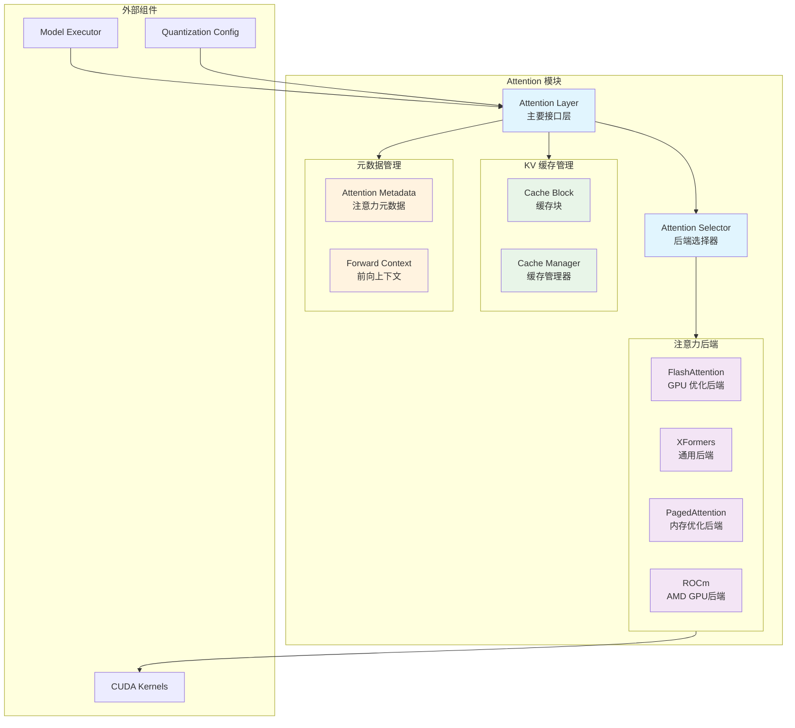

# vLLM-03-Attention模块-概览

## 摘要

Attention 模块是 vLLM 的核心计算组件，负责实现大语言模型的注意力计算机制。该模块支持多种注意力后端，包括 FlashAttention、XFormers 和自定义的 PagedAttention，为不同的硬件平台和性能需求提供优化的注意力计算实现。

**模块职责**：
- 实现多头注意力（Multi-Head Attention）、多查询注意力（Multi-Query Attention）和分组查询注意力（Grouped-Query Attention）
- 管理 KV 缓存的存储和访问
- 提供统一的注意力接口，支持多种后端实现
- 处理注意力元数据和上下文信息
- 支持不同的注意力类型（解码器、编码器、编码器-解码器）

**输入/输出**：
- 输入：查询（Query）、键（Key）、值（Value）张量
- 输出：注意力计算结果张量
- 边界：KV 缓存管理、注意力元数据处理

**上下游依赖**：
- 上游：ModelExecutor 模块、Layer 层
- 下游：CUDA 内核、注意力后端实现
- 关联：Cache 模块、QuantizationConfig

**生命周期**：
- 初始化：配置注意力参数和后端
- 运行时：执行注意力计算和 KV 缓存管理
- 销毁：清理缓存和释放资源

## 整体架构



### 架构说明

1. **图意概述**：展示了 Attention 模块的分层架构，包括接口层、后端选择、KV 缓存管理和元数据处理四个核心部分。

2. **关键接口**：
   - `Attention` 类：主要的注意力层接口
   - `AttentionBackend` 抽象类：后端实现基类
   - `get_attn_backend()` 函数：后端选择逻辑

3. **边界说明**：
   - **并发性**：支持多个序列并行处理，通过 batch_size 控制
   - **超时控制**：依赖上层调度器的超时管理
   - **幂等性**：注意力计算本身是幂等的，但 KV 缓存更新有状态
   - **顺序性**：严格按照序列顺序处理 token

4. **异常与回退**：
   - 后端不可用时自动降级到可用后端
   - OOM 时通过块交换机制释放内存
   - 量化失败时回退到原精度计算

5. **性能特征**：
   - FlashAttention：内存效率高，计算速度快
   - PagedAttention：支持动态批处理，内存利用率高
   - 典型延迟：1-10ms（取决于序列长度和硬件）

6. **版本兼容**：
   - 支持 PyTorch 1.13+ 
   - CUDA 11.8+ 或 ROCm 5.7+
   - 向后兼容旧版本注意力接口

## 核心算法与流程

### 注意力计算核心流程

```python
def forward(self, query: torch.Tensor, key: torch.Tensor, value: torch.Tensor) -> torch.Tensor:
    # 1) 获取前向上下文和注意力元数据
    forward_context = get_forward_context()
    attn_metadata = forward_context.attn_metadata
    
    # 2) KV 缓存量化计算（如果启用）
    if self.calculate_kv_scales:
        torch.ops.vllm.maybe_calc_kv_scales(query, key, value, self.layer_name)
    
    # 3) 查询量化（如果启用）
    if self.query_quant is not None:
        query, _ = self.query_quant(query, self._q_scale)
    
    # 4) 统一注意力计算入口
    return torch.ops.vllm.unified_attention(
        query, key, value, self.layer_name
    )
```

**算法目的**：实现高效的注意力计算，支持动态批处理和内存优化。

**输入输出**：
- 输入：Query [batch_size, seq_len, hidden_size]、Key、Value 张量
- 输出：注意力结果 [batch_size, seq_len, hidden_size]

**复杂度**：
- 时间复杂度：O(n²·d)，其中 n 为序列长度，d 为隐藏维度
- 空间复杂度：O(n²) 用于注意力矩阵存储
- PagedAttention 优化后空间复杂度降为 O(n)

### KV 缓存管理流程

```python
def _store_kv_cache(self, key: torch.Tensor, value: torch.Tensor):
    # 1) 获取当前虚拟引擎的 KV 缓存
    forward_context = get_forward_context()
    kv_cache = self.kv_cache[forward_context.virtual_engine]
    
    # 2) 将 KV 存储到对应的缓存块中
    # 具体实现由后端决定（内存块分配、页面管理等）
    
    # 3) 更新缓存元数据
    # 包括块索引、序列长度、注意力掩码等
```

**目的**：高效管理大语言模型推理过程中的键值缓存。

**核心机制**：
- **块分配**：将 KV 缓存分割为固定大小的块
- **动态分配**：根据序列长度动态分配和释放块
- **内存池**：使用内存池减少分配/释放开销

## 关键设计决策

### 1. 多后端架构设计

**设计动机**：不同硬件平台和使用场景需要不同的注意力实现优化。

**实现方案**：
- 抽象 `AttentionBackend` 基类定义统一接口
- 运行时根据硬件和配置选择最优后端
- 支持后端之间的无缝切换

**权衡考虑**：
- 统一性 vs 性能优化：通过抽象层保证接口一致性，同时允许后端特定优化
- 复杂性 vs 灵活性：增加了代码复杂性，但提供了更好的扩展性

### 2. PagedAttention 内存优化

**设计动机**：传统注意力计算需要连续的 KV 缓存内存，限制了批处理能力。

**核心创新**：
- 将 KV 缓存分割为固定大小的页面（通常 64 或 128 tokens）
- 支持非连续内存分配，提高内存利用率
- 动态批处理：不同长度的序列可以高效并行处理

**性能影响**：
- 内存利用率提升 2-4x
- 支持更大的批处理大小
- 轻微的计算开销（<5%）

### 3. 统一前向上下文管理

**设计目标**：简化注意力计算的上下文传递，支持复杂的推理场景。

**实现机制**：
- `ForwardContext` 全局上下文管理器
- 层级化的注意力元数据组织
- 支持投机解码、并行采样等高级特性

## 配置与调优

### 关键配置项

| 配置项 | 默认值 | 说明 | 调优建议 |
|--------|--------|------|----------|
| `block_size` | 16 | KV 缓存块大小 | GPU 内存大时可增加到 32 |
| `max_num_seqs` | 256 | 最大并行序列数 | 根据 GPU 内存调整 |
| `sliding_window` | None | 滑动窗口大小 | 长序列场景可设置为 4096 |
| `use_v2_block_manager` | True | 使用新版块管理器 | 推荐开启 |

### 性能调优指南

1. **内存优化**：
   - 启用 KV 缓存量化：`kv_cache_dtype="fp8"`
   - 调整块大小：平衡内存碎片和计算效率
   - 使用滑动窗口：限制长序列的内存使用

2. **计算优化**：
   - 选择合适的注意力后端：FlashAttention > XFormers > Native
   - 启用查询量化：减少计算精度，提升速度
   - 批处理调优：增加 `max_num_seqs` 直到 GPU 利用率饱和
