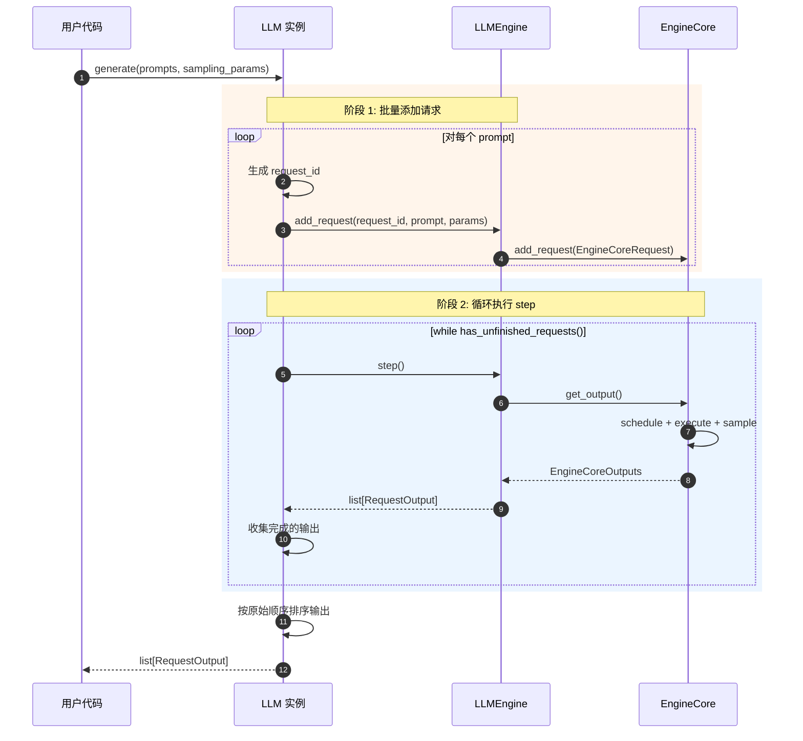
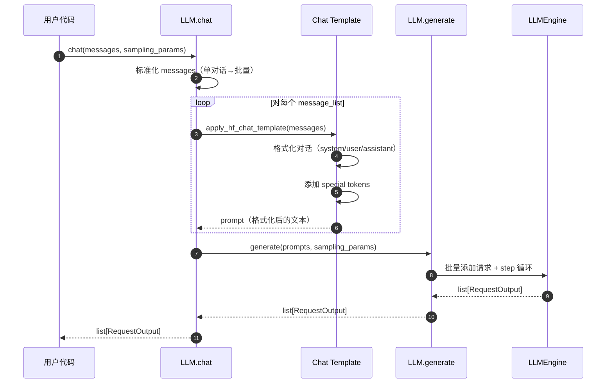

# vLLM-04-Entrypoints模块-API

## API 概览

Entrypoints 模块提供以下核心 API：

| API 名称 | 类/接口 | 幂等性 | 作用 | 使用场景 |
|---------|---------|--------|------|---------|
| `generate` | LLM 实例方法 | 否 | 批量文本生成 | 离线推理、批处理 |
| `chat` | LLM 实例方法 | 否 | 对话生成 | 聊天机器人 |
| `encode` | LLM 实例方法 | 是 | 生成 Embedding | 文本检索、相似度计算 |
| `beam_search` | LLM 实例方法 | 否 | Beam Search 生成 | 高质量生成 |
| `score` | LLM 实例方法 | 是 | 文本打分 | 重排序、相似度评分 |
| **OpenAI API** | HTTP 接口 | 否 | OpenAI 兼容 API | 在线服务 |

---

## LLM 类 API

### 1. generate

#### 基本信息
- **名称**：`generate`
- **协议/方法**：Python 实例方法
- **幂等性**：否（多次调用生成不同结果，除非固定 seed）
- **返回值**：`list[RequestOutput]`

#### 请求结构体

```python
def generate(
    self,
    prompts: Union[PromptType, Sequence[PromptType]],
    sampling_params: Optional[Union[SamplingParams, Sequence[SamplingParams]]] = None,
    *,
    use_tqdm: Union[bool, Callable[..., tqdm]] = True,
    lora_request: Optional[Union[list[LoRARequest], LoRARequest]] = None,
    priority: Optional[list[int]] = None,
) -> list[RequestOutput]:
    """生成文本补全"""
```

**参数说明表**：

| 字段 | 类型 | 必填 | 默认值 | 约束 | 说明 |
|------|------|------|--------|------|------|
| prompts | PromptType/Sequence | ✓ | - | 非空 | 输入 prompt，支持单个或批量 |
| sampling_params | SamplingParams/Sequence | ✗ | None | - | 采样参数，None 使用默认参数 |
| use_tqdm | bool/Callable | ✗ | True | - | 是否显示进度条 |
| lora_request | LoRARequest/list | ✗ | None | - | LoRA 适配器请求 |
| priority | list[int] | ✗ | None | 整数列表 | 请求优先级（需启用优先级调度） |

**PromptType 支持格式**：
- **str**：简单文本 `"Hello, my name is"`
- **list[int]**：Token IDs `[1, 15043, 29892]`
- **TextPrompt**：字典 `{"prompt": "...", "multi_modal_data": {...}}`
- **TokensPrompt**：字典 `{"prompt_token_ids": [...], "multi_modal_data": {...}}`

#### 响应结构体

```python
# 返回 list[RequestOutput]
@dataclass
class RequestOutput:
    request_id: str                      # 请求 ID（自动生成）
    prompt: Optional[str]                # 原始 prompt 文本
    prompt_token_ids: list[int]          # Prompt token IDs
    prompt_logprobs: Optional[list]      # Prompt logprobs
    outputs: list[CompletionOutput]      # 生成的输出列表
    finished: bool                       # 是否完成
    
@dataclass
class CompletionOutput:
    index: int                           # 输出索引
    text: str                            # 生成的文本
    token_ids: list[int]                 # 生成的 token IDs
    cumulative_logprob: float            # 累积 log 概率
    logprobs: Optional[list]             # Logprobs
    finish_reason: Optional[str]         # 完成原因
```

#### 入口函数与关键代码

```python
def generate(
    self,
    prompts: Union[PromptType, Sequence[PromptType]],
    sampling_params: Optional[Union[SamplingParams, Sequence[SamplingParams]]] = None,
    *,
    use_tqdm: Union[bool, Callable[..., tqdm]] = True,
    lora_request: Optional[Union[list[LoRARequest], LoRARequest]] = None,
    priority: Optional[list[int]] = None,
) -> list[RequestOutput]:
    # 1. 标准化输入
    if isinstance(prompts, (str, dict)) or is_list_of(prompts, int):
        # 单个 prompt
        prompts = [prompts]
    
    # 2. 标准化 sampling_params
    if sampling_params is None:
        sampling_params = self.get_default_sampling_params()
    if isinstance(sampling_params, SamplingParams):
        sampling_params = [sampling_params] * len(prompts)
    
    # 3. 批量添加请求到引擎
    for i, (prompt, params) in enumerate(zip(prompts, sampling_params)):
        request_id = f"llm-{next(self.request_counter)}"
        self.llm_engine.add_request(
            request_id=request_id,
            prompt=prompt,
            params=params,
            lora_request=lora_request[i] if lora_request else None,
            priority=priority[i] if priority else 0,
        )
    
    # 4. 循环执行 step 直到所有请求完成
    outputs: list[RequestOutput] = []
    with tqdm(...) if use_tqdm else nullcontext():
        while self.llm_engine.has_unfinished_requests():
            step_outputs = self.llm_engine.step()
            for output in step_outputs:
                if output.finished:
                    outputs.append(output)
                    # （此处省略进度条更新）
    
    # 5. 按原始顺序排序输出
    outputs = sorted(outputs, key=lambda x: int(x.request_id.split('-')[1]))
    
    return outputs
```

**代码说明**：
- **目的**：批量生成文本，自动管理引擎循环
- **输入**：prompts 和 sampling_params
- **输出**：RequestOutput 列表（按输入顺序）
- **性能**：O(num_prompts × avg_tokens)，主要取决于模型大小和生成长度

#### 时序图



#### 异常/回退与性能要点

**异常处理**：
1. **Prompt 无效**：抛出 `ValueError`
2. **参数不匹配**：抛出 `ValueError`（prompts 和 sampling_params 长度不一致）
3. **引擎错误**：向上传播（OOM、CUDA 错误等）

**性能要点**：
1. **批量处理**：一次性提交所有 prompts 以提高吞吐量
2. **进度条开销**：`use_tqdm=False` 可减少开销（约 1-2%）
3. **内存管理**：大批量时注意 KV cache 内存限制

---

### 2. chat

#### 基本信息
- **名称**：`chat`
- **协议/方法**：Python 实例方法
- **幂等性**：否
- **返回值**：`list[RequestOutput]`

#### 请求结构体

```python
def chat(
    self,
    messages: Union[
        list[ChatCompletionMessageParam],
        list[list[ChatCompletionMessageParam]],
    ],
    sampling_params: Optional[Union[SamplingParams, Sequence[SamplingParams]]] = None,
    *,
    use_tqdm: bool = True,
    lora_request: Optional[Union[list[LoRARequest], LoRARequest]] = None,
    chat_template: Optional[str] = None,
    chat_template_kwargs: Optional[dict[str, Any]] = None,
    priority: Optional[list[int]] = None,
) -> list[RequestOutput]:
    """生成对话补全"""
```

**参数说明表**：

| 字段 | 类型 | 必填 | 默认值 | 说明 |
|------|------|------|--------|------|
| messages | list/list[list] | ✓ | - | 对话消息列表，OpenAI 格式 |
| sampling_params | SamplingParams/Sequence | ✗ | None | 采样参数 |
| use_tqdm | bool | ✗ | True | 是否显示进度条 |
| lora_request | LoRARequest/list | ✗ | None | LoRA 适配器 |
| chat_template | str | ✗ | None | 自定义 chat template |
| chat_template_kwargs | dict | ✗ | None | Chat template 参数 |
| priority | list[int] | ✗ | None | 请求优先级 |

**ChatCompletionMessageParam 格式**：

```python
# 消息格式（OpenAI 兼容）
{
    "role": "user",                    # "system" / "user" / "assistant"
    "content": "What is the capital of France?",
}

# 或多模态消息
{
    "role": "user",
    "content": [
        {"type": "text", "text": "What is in this image?"},
        {"type": "image_url", "image_url": {"url": "https://..."}},
    ],
}
```

#### 入口函数与关键代码

```python
def chat(
    self,
    messages: Union[list[ChatCompletionMessageParam], list[list[ChatCompletionMessageParam]]],
    sampling_params: Optional[Union[SamplingParams, Sequence[SamplingParams]]] = None,
    *,
    use_tqdm: bool = True,
    lora_request: Optional[Union[list[LoRARequest], LoRARequest]] = None,
    chat_template: Optional[str] = None,
    chat_template_kwargs: Optional[dict[str, Any]] = None,
    priority: Optional[list[int]] = None,
) -> list[RequestOutput]:
    # 1. 标准化输入：单对话 → 批量对话
    if is_list_of(messages, dict):
        # 单个对话
        messages = [messages]
    
    # 2. 应用 chat template（将 messages 转换为 prompt）
    tokenizer = self.get_tokenizer()
    prompts = []
    for message_list in messages:
        prompt = apply_hf_chat_template(
            tokenizer,
            conversation=message_list,
            chat_template=chat_template,
            chat_template_kwargs=chat_template_kwargs or {},
            add_generation_prompt=True,
        )
        prompts.append(prompt)
    
    # 3. 调用 generate
    return self.generate(
        prompts=prompts,
        sampling_params=sampling_params,
        use_tqdm=use_tqdm,
        lora_request=lora_request,
        priority=priority,
    )
```

**代码说明**：
- **目的**：简化对话生成，自动应用 chat template
- **输入**：OpenAI 格式的 messages
- **输出**：RequestOutput 列表
- **实现**：内部调用 `generate()`

#### 时序图



#### 异常/回退与性能要点

**异常处理**：
1. **messages 格式错误**：抛出 `ValueError`
2. **不支持的 role**：抛出 `ValueError`（只支持 system/user/assistant）
3. **Chat template 错误**：抛出 `TemplateError`

**性能要点**：
1. **模板开销**：Chat template 应用通常 < 1 ms
2. **批量处理**：批量对话比逐个调用快 10-100x

---

### 3. encode

#### 基本信息
- **名称**：`encode`
- **协议/方法**：Python 实例方法
- **幂等性**：是（相同输入生成相同 embedding）
- **返回值**：`list[EmbeddingRequestOutput]`

#### 请求结构体

```python
def encode(
    self,
    prompts: Union[PromptType, Sequence[PromptType]],
    pooling_params: Optional[Union[PoolingParams, Sequence[PoolingParams]]] = None,
    *,
    use_tqdm: bool = True,
    lora_request: Optional[Union[list[LoRARequest], LoRARequest]] = None,
    priority: Optional[list[int]] = None,
) -> list[EmbeddingRequestOutput]:
    """生成 Embedding 向量"""
```

**参数说明表**：

| 字段 | 类型 | 必填 | 默认值 | 说明 |
|------|------|------|--------|------|
| prompts | PromptType/Sequence | ✓ | - | 输入文本 |
| pooling_params | PoolingParams/Sequence | ✗ | None | 池化参数 |
| use_tqdm | bool | ✗ | True | 是否显示进度条 |
| lora_request | LoRARequest/list | ✗ | None | LoRA 适配器 |
| priority | list[int] | ✗ | None | 请求优先级 |

#### 响应结构体

```python
@dataclass
class EmbeddingRequestOutput:
    request_id: str                      # 请求 ID
    outputs: EmbeddingOutput             # Embedding 输出
    prompt_token_ids: list[int]          # Prompt token IDs
    finished: bool                       # 是否完成

@dataclass
class EmbeddingOutput:
    embedding: list[float]               # Embedding 向量（e.g., 768 维）
```

#### 入口函数与关键代码

```python
def encode(
    self,
    prompts: Union[PromptType, Sequence[PromptType]],
    pooling_params: Optional[Union[PoolingParams, Sequence[PoolingParams]]] = None,
    *,
    use_tqdm: bool = True,
    lora_request: Optional[Union[list[LoRARequest], LoRARequest]] = None,
    priority: Optional[list[int]] = None,
) -> list[EmbeddingRequestOutput]:
    # 1. 验证模型类型（必须是 embedding 模型）
    if self.llm_engine.model_config.task != "embed":
        raise ValueError("encode() requires an embedding model")
    
    # 2. 标准化输入
    if isinstance(prompts, (str, dict)) or is_list_of(prompts, int):
        prompts = [prompts]
    
    # 3. 标准化 pooling_params
    if pooling_params is None:
        pooling_params = PoolingParams()
    if isinstance(pooling_params, PoolingParams):
        pooling_params = [pooling_params] * len(prompts)
    
    # 4. 批量添加请求
    for i, (prompt, params) in enumerate(zip(prompts, pooling_params)):
        request_id = f"embd-{next(self.request_counter)}"
        self.llm_engine.add_request(
            request_id=request_id,
            prompt=prompt,
            params=params,
            # （此处省略其他参数）
        )
    
    # 5. 循环执行 step
    outputs: list[EmbeddingRequestOutput] = []
    while self.llm_engine.has_unfinished_requests():
        step_outputs = self.llm_engine.step()
        outputs.extend(step_outputs)
    
    return outputs
```

#### 异常/回退与性能要点

**异常处理**：
1. **模型类型错误**：抛出 `ValueError`（非 embedding 模型）
2. **Prompt 过长**：抛出 `ValueError`

**性能要点**：
1. **批量处理**：批量 encode 可提高 10-100x 吞吐量
2. **固定长度**：Embedding 模型输出固定长度，无生成循环
3. **速度**：比生成任务快 10-100x（无自回归）

---

### 4. beam_search

#### 基本信息
- **名称**：`beam_search`
- **协议/方法**：Python 实例方法
- **幂等性**：否
- **返回值**：`list[BeamSearchOutput]`

#### 请求结构体

```python
def beam_search(
    self,
    prompts: Union[PromptType, Sequence[PromptType]],
    params: Union[BeamSearchParams, Sequence[BeamSearchParams]],
    *,
    use_tqdm: bool = True,
) -> list[BeamSearchOutput]:
    """Beam Search 生成"""
```

**BeamSearchParams**：

```python
@dataclass
class BeamSearchParams:
    beam_width: int = 4                  # Beam 宽度
    max_tokens: int = 16                 # 最大生成 token 数
    ignore_eos: bool = False             # 是否忽略 EOS token
    temperature: float = 1.0             # 温度
    length_penalty: float = 1.0          # 长度惩罚
```

#### 响应结构体

```python
@dataclass
class BeamSearchOutput:
    sequences: list[BeamSearchSequence]  # Beam 序列列表
    
@dataclass
class BeamSearchSequence:
    text: str                            # 生成的文本
    token_ids: list[int]                 # Token IDs
    cumulative_logprob: float            # 累积 log 概率
```

---

### 5. score

#### 基本信息
- **名称**：`score`
- **协议/方法**：Python 实例方法
- **幂等性**：是
- **返回值**：`list[ScoringRequestOutput]`

#### 请求结构体

```python
def score(
    self,
    text_1: Union[str, list[str]],
    text_2: Union[str, list[str]],
    *,
    truncate_prompt_tokens: Optional[int] = None,
) -> list[ScoringRequestOutput]:
    """计算两个文本的相似度得分"""
```

#### 响应结构体

```python
@dataclass
class ScoringRequestOutput:
    request_id: str
    outputs: ScoringOutput
    finished: bool

@dataclass
class ScoringOutput:
    score: float                         # 相似度得分（-1 到 1）
```

---

## OpenAI API（HTTP 接口）

### POST /v1/completions

#### 请求 Body

```json
{
  "model": "meta-llama/Llama-2-7b-hf",
  "prompt": "Hello, my name is",
  "max_tokens": 50,
  "temperature": 0.8,
  "top_p": 0.95,
  "n": 1,
  "stream": false,
  "stop": ["\n"],
  "logprobs": null
}
```

**字段说明表**：

| 字段 | 类型 | 必填 | 默认值 | 说明 |
|------|------|------|--------|------|
| model | str | ✓ | - | 模型名称 |
| prompt | str/list | ✓ | - | 输入 prompt |
| max_tokens | int | ✗ | 16 | 最大生成 token 数 |
| temperature | float | ✗ | 1.0 | 采样温度 |
| top_p | float | ✗ | 1.0 | Nucleus sampling |
| n | int | ✗ | 1 | 生成候选数量 |
| stream | bool | ✗ | false | 是否流式输出 |
| stop | str/list | ✗ | None | 停止字符串 |
| logprobs | int | ✗ | None | 返回 top-N logprobs |

#### 响应（非流式）

```json
{
  "id": "cmpl-12345",
  "object": "text_completion",
  "created": 1677652288,
  "model": "meta-llama/Llama-2-7b-hf",
  "choices": [
    {
      "text": " John and I am a software engineer.",
      "index": 0,
      "logprobs": null,
      "finish_reason": "length"
    }
  ],
  "usage": {
    "prompt_tokens": 5,
    "completion_tokens": 10,
    "total_tokens": 15
  }
}
```

### POST /v1/chat/completions

#### 请求 Body

```json
{
  "model": "meta-llama/Llama-2-7b-hf",
  "messages": [
    {"role": "system", "content": "You are a helpful assistant."},
    {"role": "user", "content": "What is the capital of France?"}
  ],
  "temperature": 0.7,
  "max_tokens": 100,
  "stream": false
}
```

#### 响应

```json
{
  "id": "chatcmpl-12345",
  "object": "chat.completion",
  "created": 1677652288,
  "model": "meta-llama/Llama-2-7b-hf",
  "choices": [
    {
      "index": 0,
      "message": {
        "role": "assistant",
        "content": "The capital of France is Paris."
      },
      "finish_reason": "stop"
    }
  ],
  "usage": {
    "prompt_tokens": 20,
    "completion_tokens": 8,
    "total_tokens": 28
  }
}
```

### POST /v1/embeddings

#### 请求 Body

```json
{
  "model": "sentence-transformers/all-MiniLM-L6-v2",
  "input": "Hello, world!",
  "encoding_format": "float"
}
```

#### 响应

```json
{
  "object": "list",
  "data": [
    {
      "object": "embedding",
      "embedding": [0.123, -0.456, 0.789, ...],
      "index": 0
    }
  ],
  "model": "sentence-transformers/all-MiniLM-L6-v2",
  "usage": {
    "prompt_tokens": 3,
    "total_tokens": 3
  }
}
```

---

## API 使用示例

### 示例 1：基本生成

```python
from vllm import LLM, SamplingParams

llm = LLM(model="meta-llama/Llama-2-7b-hf")
prompts = ["Hello, my name is", "The capital of France is"]
sampling_params = SamplingParams(temperature=0.8, max_tokens=50)

outputs = llm.generate(prompts, sampling_params)

for output in outputs:
    print(f"Prompt: {output.prompt}")
    print(f"Generated: {output.outputs[0].text}")
```

### 示例 2：对话生成

```python
from vllm import LLM, SamplingParams

llm = LLM(model="meta-llama/Llama-2-7b-chat-hf")

messages = [
    {"role": "system", "content": "You are a helpful assistant."},
    {"role": "user", "content": "What is the capital of France?"},
]

outputs = llm.chat(messages, SamplingParams(temperature=0.7, max_tokens=100))

for output in outputs:
    print(output.outputs[0].text)
```

### 示例 3：Embedding 生成

```python
from vllm import LLM

llm = LLM(model="sentence-transformers/all-MiniLM-L6-v2", task="embed")

prompts = ["Hello, world!", "This is a test."]
outputs = llm.encode(prompts)

for output in outputs:
    print(f"Embedding shape: {len(output.outputs.embedding)}")
    print(f"First 5 dims: {output.outputs.embedding[:5]}")
```

### 示例 4：多模态生成

```python
from vllm import LLM, SamplingParams
from PIL import Image

llm = LLM(model="llava-hf/llava-1.5-7b-hf")

image = Image.open("image.jpg")
prompt = {
    "prompt": "USER: <image>\nWhat is in this image?\nASSISTANT:",
    "multi_modal_data": {"image": image}
}

outputs = llm.generate(prompt, SamplingParams(max_tokens=100))
print(outputs[0].outputs[0].text)
```

---

## API 使用模式

### 离线批量推理

```python
llm = LLM(model="...")
outputs = llm.generate(large_prompt_list, sampling_params)
```

**适用场景**：批处理、数据处理、评估

### 交互式对话

```python
llm = LLM(model="...-chat")
conversation_history = []

while True:
    user_input = input("User: ")
    conversation_history.append({"role": "user", "content": user_input})
    
    outputs = llm.chat(conversation_history)
    assistant_response = outputs[0].outputs[0].text
    
    conversation_history.append({"role": "assistant", "content": assistant_response})
    print(f"Assistant: {assistant_response}")
```

**适用场景**：聊天机器人、交互式应用

### 文本检索

```python
llm = LLM(model="sentence-transformers/...", task="embed")

# 生成文档 embeddings
doc_embeddings = llm.encode(documents)

# 生成查询 embedding
query_embedding = llm.encode(query)[0]

# 计算相似度
similarities = cosine_similarity(query_embedding, doc_embeddings)
```

**适用场景**：语义搜索、文档检索

---

## 性能对比

| API | 吞吐量 (tokens/s) | 延迟 (ms) | 适用场景 |
|-----|------------------|-----------|---------|
| generate (batch=1) | 2,000 | 15 | 低延迟单用户 |
| generate (batch=32) | 35,000 | 250 | 高吞吐批处理 |
| chat | 同 generate | 同 generate + 模板开销 | 对话生成 |
| encode (batch=32) | 300,000 | 50 | Embedding 生成 |
| beam_search (width=4) | 500 | 200 | 高质量生成 |

---

## 总结

Entrypoints 模块提供了丰富的 API：

1. **LLM 类**：5 个核心方法（generate、chat、encode、beam_search、score）
2. **OpenAI API**：完全兼容 OpenAI API v1
3. **灵活输入**：支持文本、Token IDs、多模态
4. **批量处理**：自动优化批处理性能

核心设计理念：
- **易用性**：简单的 Python API
- **灵活性**：支持多种输入格式和任务类型
- **高性能**：自动批处理和内存管理
- **兼容性**：OpenAI API 完全兼容

