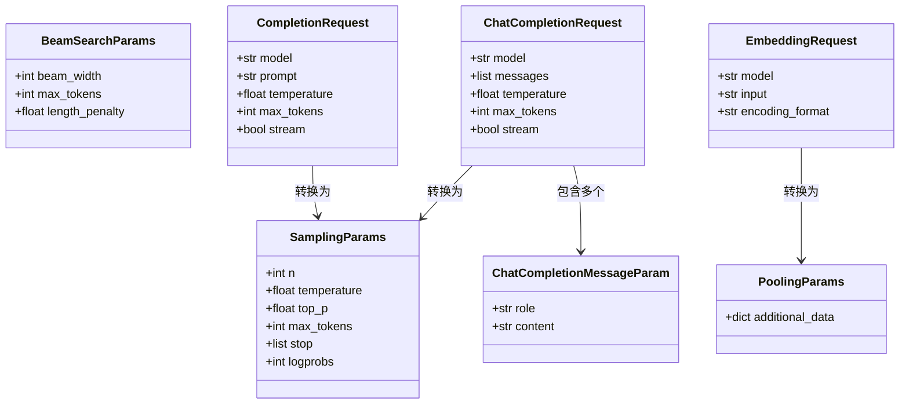
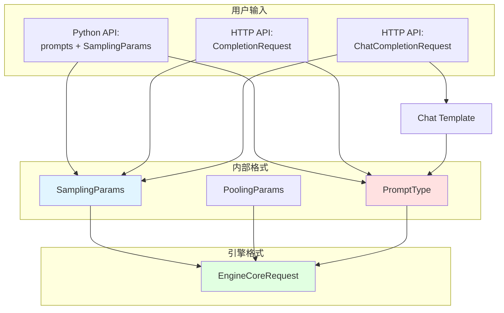

# vLLM-04-Entrypoints模块-数据结构

## 核心数据结构列表

Entrypoints 模块包含以下核心数据结构：

| 数据结构 | 类型 | 用途 | 更新时机 | 文件位置 |
|---------|------|------|---------|---------|
| `SamplingParams` | dataclass | 采样参数配置 | 请求创建时 | vllm/sampling_params.py |
| `BeamSearchParams` | dataclass | Beam Search 参数 | 请求创建时 | vllm/sampling_params.py |
| `PoolingParams` | dataclass | 池化参数（Embedding） | 请求创建时 | vllm/pooling_params.py |
| `ChatCompletionMessageParam` | TypedDict | 对话消息格式 | 用户输入 | vllm/entrypoints/chat_utils.py |
| `CompletionRequest` | BaseModel | HTTP Completions 请求 | HTTP 请求时 | vllm/entrypoints/openai/protocol.py |
| `ChatCompletionRequest` | BaseModel | HTTP Chat 请求 | HTTP 请求时 | vllm/entrypoints/openai/protocol.py |
| `EmbeddingRequest` | BaseModel | HTTP Embeddings 请求 | HTTP 请求时 | vllm/entrypoints/openai/protocol.py |

---

## 数据结构详细说明

### 1. SamplingParams

#### 基本信息

**用途**：控制文本生成的采样策略和参数。

**定义**：

```python
@dataclass
class SamplingParams:
    """文本生成采样参数"""
    
    # 基本参数
    n: int = 1                           # 生成候选数量
    best_of: Optional[int] = None        # 从 best_of 个候选中选择 n 个（V0 only）
    
    # 采样控制
    temperature: float = 1.0             # 采样温度（0 = greedy，> 1 = 更随机）
    top_p: float = 1.0                   # Nucleus sampling 阈值
    top_k: int = -1                      # Top-K sampling（-1 = 不限制）
    min_p: float = 0.0                   # Minimum probability threshold
    
    # 惩罚参数
    presence_penalty: float = 0.0        # 出现惩罚（-2.0 到 2.0）
    frequency_penalty: float = 0.0       # 频率惩罚（-2.0 到 2.0）
    repetition_penalty: float = 1.0      # 重复惩罚（> 1 惩罚）
    
    # 停止条件
    max_tokens: Optional[int] = None     # 最大生成 token 数（None = 直到 EOS）
    min_tokens: int = 0                  # 最小生成 token 数
    stop: Optional[Union[str, list[str]]] = None  # 停止字符串
    stop_token_ids: Optional[list[int]] = None    # 停止 token IDs
    include_stop_str_in_output: bool = False      # 输出是否包含 stop string
    ignore_eos: bool = False             # 是否忽略 EOS token
    
    # Logprobs
    logprobs: Optional[int] = None       # 返回 top-N logprobs
    prompt_logprobs: Optional[int] = None  # 返回 prompt logprobs
    
    # 输出控制
    detokenize: bool = True              # 是否 detokenize（转为文本）
    skip_special_tokens: bool = True     # Detokenize 时跳过 special tokens
    spaces_between_special_tokens: bool = True  # Special tokens 之间加空格
    
    # 高级参数
    seed: Optional[int] = None           # 随机种子（可复现）
    use_beam_search: bool = False        # 是否使用 beam search
    length_penalty: float = 1.0          # 长度惩罚（beam search）
    early_stopping: Union[bool, str] = False  # Beam search 早停
    logits_processors: Optional[list] = None  # 自定义 logits processors
```

#### 字段说明表

| 字段 | 类型 | 默认值 | 约束 | 说明 |
|------|------|--------|------|------|
| n | int | 1 | > 0 | 生成候选数量，每个 prompt 生成 n 个输出 |
| temperature | float | 1.0 | > 0 | 采样温度，0 = greedy，< 1 更确定，> 1 更随机 |
| top_p | float | 1.0 | 0 < p ≤ 1 | Nucleus sampling，保留累积概率 ≥ top_p 的 tokens |
| top_k | int | -1 | -1 或 > 0 | Top-K sampling，保留概率最高的 k 个 tokens |
| max_tokens | int | None | > 0 或 None | 最大生成 token 数，None = 直到 EOS |
| presence_penalty | float | 0.0 | -2.0 ~ 2.0 | 出现惩罚，惩罚已出现的 tokens |
| frequency_penalty | float | 0.0 | -2.0 ~ 2.0 | 频率惩罚，根据出现频率惩罚 |
| repetition_penalty | float | 1.0 | > 0 | 重复惩罚，> 1 惩罚重复，< 1 鼓励重复 |
| stop | str/list[str] | None | - | 停止字符串，遇到时停止生成 |
| logprobs | int | None | > 0 或 None | 返回每个 token 的 top-N logprobs |
| seed | int | None | ≥ 0 或 None | 随机种子，相同 seed 产生相同结果 |

#### 用途和更新时机

**创建时机**：
- 用户调用 `llm.generate()` 时
- API Server 接收 HTTP 请求时

**更新时机**：
- 不更新（immutable）

**使用场景**：
1. 控制生成的随机性（temperature、top_p）
2. 避免重复（presence_penalty、repetition_penalty）
3. 控制生成长度（max_tokens、min_tokens）
4. 指定停止条件（stop、stop_token_ids）

---

### 2. BeamSearchParams

#### 基本信息

**用途**：Beam Search 生成参数。

**定义**：

```python
@dataclass
class BeamSearchParams:
    """Beam Search 参数"""
    
    beam_width: int = 4                  # Beam 宽度
    max_tokens: int = 16                 # 最大生成 token 数
    ignore_eos: bool = False             # 是否忽略 EOS token
    temperature: float = 1.0             # 温度（beam search 通常用 1.0）
    length_penalty: float = 1.0          # 长度惩罚（< 1 偏好短序列，> 1 偏好长序列）
    include_stop_str_in_output: bool = False  # 输出是否包含 stop string
```

#### 字段说明表

| 字段 | 类型 | 默认值 | 说明 |
|------|------|--------|------|
| beam_width | int | 4 | Beam 宽度，同时保持的候选序列数 |
| max_tokens | int | 16 | 最大生成 token 数 |
| length_penalty | float | 1.0 | 长度惩罚，score = log_prob / (length ** length_penalty) |
| temperature | float | 1.0 | 温度，beam search 通常用 1.0 |

---

### 3. PoolingParams

#### 基本信息

**用途**：Embedding 任务的池化参数。

**定义**：

```python
@dataclass
class PoolingParams:
    """池化参数（Embedding 任务）"""
    
    additional_data: Optional[dict] = None  # 额外数据（扩展用）
```

**说明**：
- Embedding 任务通常无需额外参数
- Pooling 策略由模型配置决定（mean、max、cls 等）

---

### 4. ChatCompletionMessageParam

#### 基本信息

**用途**：定义对话消息格式（OpenAI 兼容）。

**定义**：

```python
# 基本消息格式
class ChatCompletionMessageParam(TypedDict):
    """对话消息"""
    role: str                            # "system" / "user" / "assistant"
    content: str                         # 消息内容
    
# 多模态消息格式
class ChatCompletionContentPartParam(TypedDict):
    """消息内容部分"""
    type: str                            # "text" / "image_url" / "audio_url"
    text: Optional[str]                  # 文本内容
    image_url: Optional[dict]            # 图片 URL
    audio_url: Optional[dict]            # 音频 URL
```

#### 字段说明表

| 字段 | 类型 | 必填 | 说明 |
|------|------|------|------|
| role | str | ✓ | 消息角色："system"（系统提示）/ "user"（用户）/ "assistant"（助手） |
| content | str/list | ✓ | 消息内容，可以是纯文本或多模态内容列表 |

#### 用途和更新时机

**创建时机**：
- 用户调用 `llm.chat()` 时
- API Server 接收 `/v1/chat/completions` 请求时

**使用场景**：
1. 构建对话历史
2. 多模态对话（文本 + 图片/音频）
3. 系统提示设置

---

### 5. CompletionRequest

#### 基本信息

**用途**：HTTP `/v1/completions` API 的请求格式。

**定义**：

```python
class CompletionRequest(BaseModel):
    """Completions API 请求"""
    
    # 必填字段
    model: str                           # 模型名称
    prompt: Union[str, list[int], list[str], list[list[int]]]  # Prompt
    
    # 采样参数
    temperature: Optional[float] = 1.0
    top_p: Optional[float] = 1.0
    n: Optional[int] = 1
    max_tokens: Optional[int] = 16
    stop: Optional[Union[str, list[str]]] = None
    
    # 输出控制
    stream: Optional[bool] = False
    logprobs: Optional[int] = None
    echo: Optional[bool] = False
    
    # 高级参数
    presence_penalty: Optional[float] = 0.0
    frequency_penalty: Optional[float] = 0.0
    best_of: Optional[int] = None
    logit_bias: Optional[dict[str, float]] = None
    user: Optional[str] = None
    
    # vLLM 扩展参数
    best_of: Optional[int] = None
    use_beam_search: bool = False
    top_k: int = -1
    min_p: float = 0.0
    repetition_penalty: float = 1.0
    length_penalty: float = 1.0
```

---

### 6. ChatCompletionRequest

#### 基本信息

**用途**：HTTP `/v1/chat/completions` API 的请求格式。

**定义**：

```python
class ChatCompletionRequest(BaseModel):
    """Chat Completions API 请求"""
    
    # 必填字段
    model: str                           # 模型名称
    messages: list[ChatCompletionMessageParam]  # 对话消息列表
    
    # 采样参数
    temperature: Optional[float] = 1.0
    top_p: Optional[float] = 1.0
    n: Optional[int] = 1
    max_tokens: Optional[int] = None
    stop: Optional[Union[str, list[str]]] = None
    
    # 输出控制
    stream: Optional[bool] = False
    logprobs: Optional[bool] = False
    top_logprobs: Optional[int] = None
    
    # 高级参数
    presence_penalty: Optional[float] = 0.0
    frequency_penalty: Optional[float] = 0.0
    user: Optional[str] = None
    
    # vLLM 扩展参数
    best_of: Optional[int] = None
    use_beam_search: bool = False
    top_k: int = -1
    min_p: float = 0.0
    repetition_penalty: float = 1.0
```

---

### 7. EmbeddingRequest

#### 基本信息

**用途**：HTTP `/v1/embeddings` API 的请求格式。

**定义**：

```python
class EmbeddingRequest(BaseModel):
    """Embeddings API 请求"""
    
    # 必填字段
    model: str                           # 模型名称
    input: Union[str, list[str], list[int], list[list[int]]]  # 输入文本
    
    # 可选字段
    encoding_format: Optional[str] = "float"  # 编码格式："float" / "base64"
    user: Optional[str] = None
    
    # vLLM 扩展参数
    additional_data: Optional[Any] = None
```

---

## 数据结构关系图（类图）



---

## 数据流图



---

## 参数验证

### SamplingParams 验证

```python
def validate_sampling_params(params: SamplingParams) -> None:
    """验证采样参数"""
    # 1. temperature 范围
    if params.temperature <= 0:
        raise ValueError("temperature must be positive")
    
    # 2. top_p 范围
    if not 0 < params.top_p <= 1:
        raise ValueError("top_p must be in (0, 1]")
    
    # 3. n 和 best_of
    if params.best_of is not None:
        if params.best_of < params.n:
            raise ValueError("best_of must be >= n")
    
    # 4. logprobs 范围
    if params.logprobs is not None:
        if params.logprobs < 0:
            raise ValueError("logprobs must be non-negative")
        if params.logprobs > 10:
            # 限制 logprobs 数量（避免输出过大）
            logger.warning("logprobs > 10 may cause large outputs")
    
    # 5. penalty 范围
    if not -2.0 <= params.presence_penalty <= 2.0:
        raise ValueError("presence_penalty must be in [-2.0, 2.0]")
```

### ChatCompletionMessageParam 验证

```python
def validate_chat_messages(messages: list[ChatCompletionMessageParam]) -> None:
    """验证对话消息"""
    # 1. 非空
    if not messages:
        raise ValueError("messages cannot be empty")
    
    # 2. role 有效性
    valid_roles = {"system", "user", "assistant"}
    for msg in messages:
        if msg["role"] not in valid_roles:
            raise ValueError(f"Invalid role: {msg['role']}")
    
    # 3. content 非空
    for msg in messages:
        if not msg.get("content"):
            raise ValueError("message content cannot be empty")
```

---

## 默认值与常用配置

### 高质量生成配置

```python
SamplingParams(
    temperature=0.7,                     # 中等随机性
    top_p=0.9,                           # Nucleus sampling
    repetition_penalty=1.2,              # 避免重复
    max_tokens=200,
)
```

### 确定性生成配置

```python
SamplingParams(
    temperature=0.0,                     # Greedy decoding
    max_tokens=100,
    seed=42,                             # 固定种子
)
```

### 创意生成配置

```python
SamplingParams(
    temperature=1.5,                     # 高随机性
    top_k=50,                            # Top-K sampling
    max_tokens=500,
)
```

### Embedding 配置

```python
PoolingParams()                          # 默认配置即可
```

---

## 性能考虑

### 内存使用

| 参数 | 内存影响 | 说明 |
|------|---------|------|
| n | 线性增长 | n 个候选，内存增加 n 倍 |
| max_tokens | 线性增长 | 生成越长，占用越多 |
| logprobs | 中等增长 | 存储 logprobs 数据 |
| best_of | 高增长 | V0 only，需存储 best_of 个候选 |

### 计算开销

| 参数 | 计算影响 | 说明 |
|------|---------|------|
| temperature | 极小 | 仅影响 softmax |
| top_p / top_k | 小 | 需排序 logits |
| presence_penalty | 中等 | 需跟踪出现的 tokens |
| repetition_penalty | 中等 | 需计算频率 |
| beam_search | 高 | 计算量增加 beam_width 倍 |

---

## 使用示例

### 创建 SamplingParams

```python
from vllm import SamplingParams

# 基本配置
params = SamplingParams(
    temperature=0.8,
    top_p=0.95,
    max_tokens=50,
)

# 高级配置
params = SamplingParams(
    temperature=0.7,
    top_p=0.9,
    top_k=40,
    repetition_penalty=1.2,
    presence_penalty=0.5,
    max_tokens=200,
    stop=["\n\n", "###"],
    logprobs=5,
    seed=42,
)
```

### 构建 Chat Messages

```python
from vllm import LLM

llm = LLM(model="...-chat")

# 基本对话
messages = [
    {"role": "system", "content": "You are a helpful assistant."},
    {"role": "user", "content": "What is the capital of France?"},
]

outputs = llm.chat(messages)

# 多轮对话
conversation = []
conversation.append({"role": "system", "content": "You are a helpful assistant."})

# 第一轮
conversation.append({"role": "user", "content": "What is AI?"})
outputs = llm.chat(conversation)
conversation.append({"role": "assistant", "content": outputs[0].outputs[0].text})

# 第二轮
conversation.append({"role": "user", "content": "How does it work?"})
outputs = llm.chat(conversation)
```

### 多模态消息

```python
from PIL import Image

messages = [
    {
        "role": "user",
        "content": [
            {"type": "text", "text": "What is in this image?"},
            {
                "type": "image_url",
                "image_url": {"url": "https://example.com/image.jpg"}
            },
        ],
    },
]

outputs = llm.chat(messages)
```

---

## 总结

Entrypoints 模块的数据结构设计特点：

1. **类型安全**：使用 dataclass 和 TypedDict
2. **灵活性**：支持多种输入格式和参数组合
3. **兼容性**：OpenAI API 完全兼容
4. **验证**：完善的参数验证
5. **扩展性**：支持 vLLM 特有扩展参数

核心数据结构：
- **SamplingParams**：控制生成策略
- **ChatCompletionMessageParam**：对话消息格式
- **HTTP Request Models**：API 请求格式

通过合理配置参数，可以实现从确定性生成到创意生成的各种需求。

