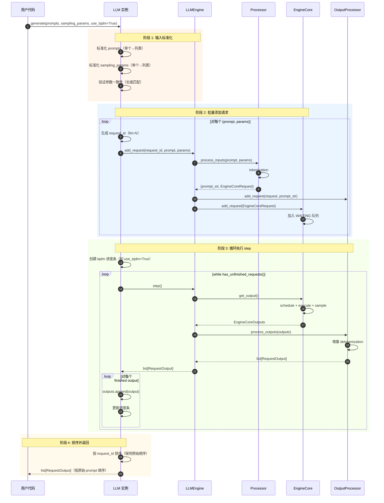
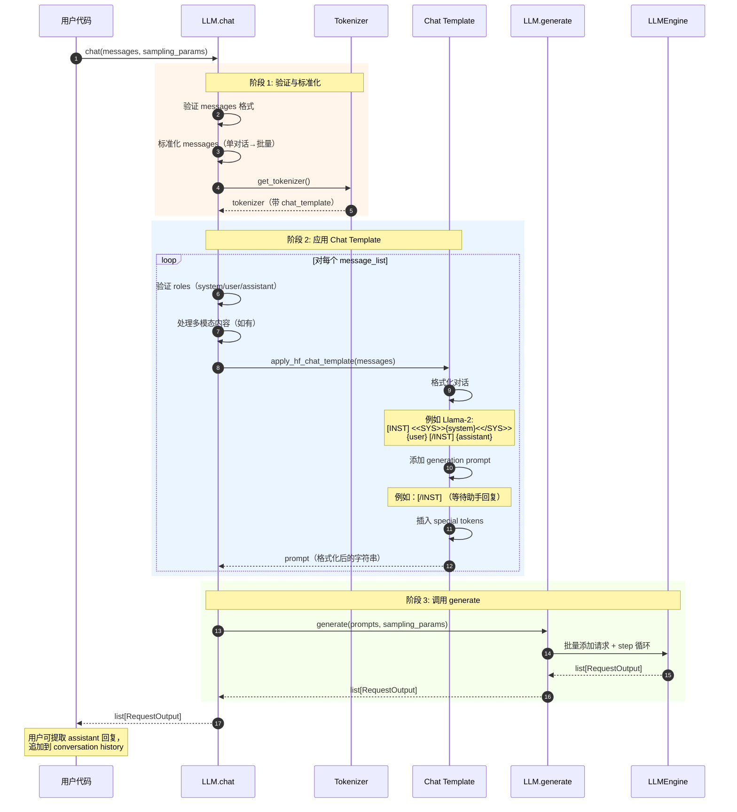
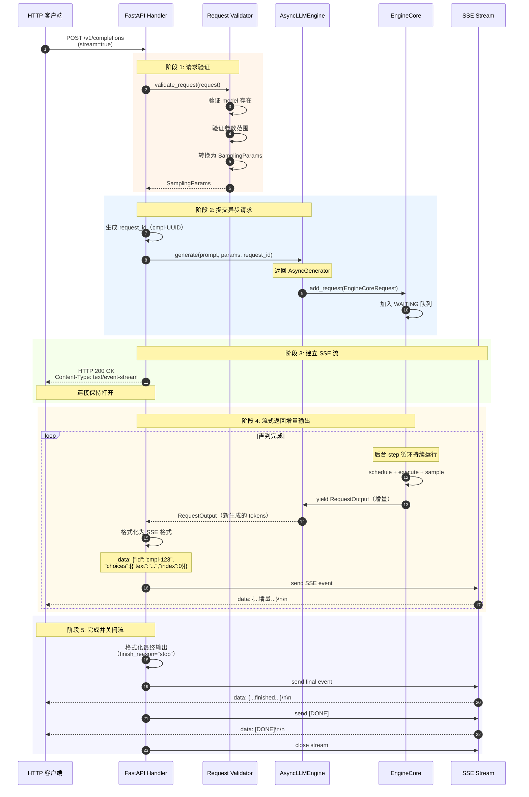
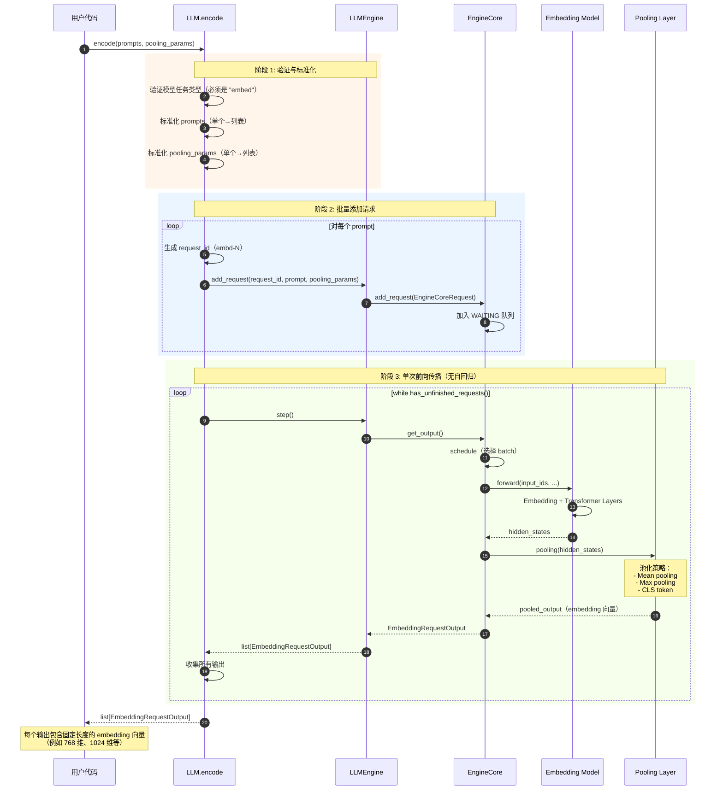
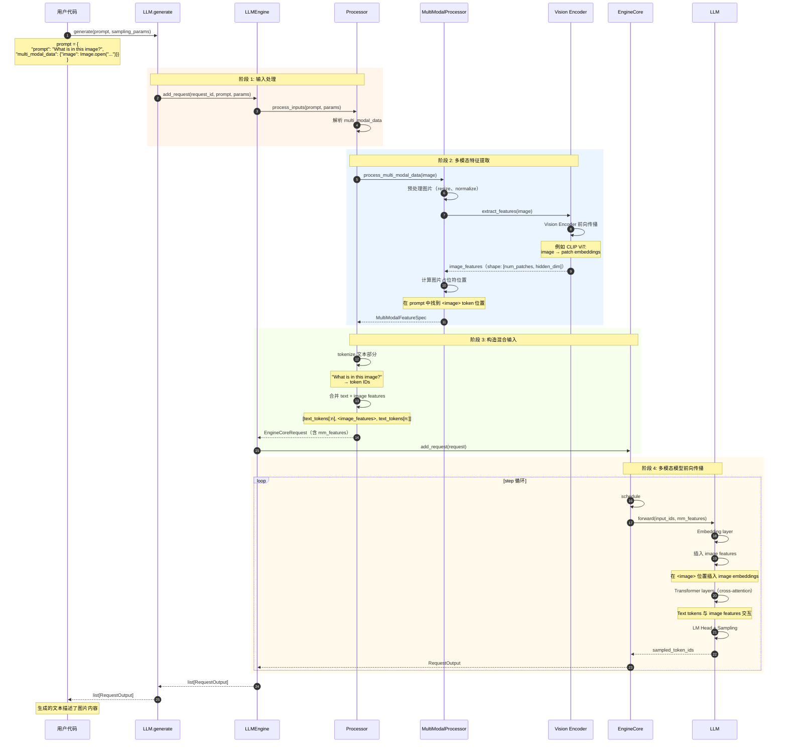

# vLLM-04-Entrypoints模块-时序图

## 典型场景列表

Entrypoints 模块包含以下典型执行场景：

| 场景编号 | 场景名称 | 参与组件 | 关键点 | 适用情况 |
|---------|---------|---------|--------|---------|
| 1 | LLM 批量生成 | LLM、Engine、OutputProcessor | 批量提交、循环执行 | 离线推理 |
| 2 | Chat 对话生成 | LLM、ChatTemplate、Engine | Chat template 应用 | 聊天应用 |
| 3 | HTTP 流式生成 | API Server、AsyncEngine、SSE | 异步流式输出 | 在线服务 |
| 4 | Embedding 生成 | LLM、Engine（Pooling Model） | 无自回归循环 | 文本检索 |
| 5 | 多模态生成 | LLM、MultiModalProcessor、Engine | 多模态特征提取 | 图文理解 |

---

## 场景 1：LLM 批量生成

### 场景描述

**目标**：使用 `LLM.generate()` 批量生成文本。

**适用场景**：
- 离线批处理
- 数据集评估
- 批量推理任务

**关键特征**：
- 批量提交所有 prompts
- 阻塞等待所有请求完成
- 按原始顺序返回结果
- 显示进度条（可选）

### 时序图

### 关键点说明

#### 1. 批量提交策略

- **目的**：一次性提交所有请求，最大化 GPU 利用率
- **实现**：循环调用 `engine.add_request()`，请求立即加入 WAITING 队列
- **优势**：Continuous Batching 可并发处理多个请求
- **注意**：大批量时注意 KV cache 内存限制

#### 2. 阻塞等待模式

- **特点**：`generate()` 方法阻塞直到所有请求完成
- **适用场景**：离线推理、批处理任务
- **不适用场景**：在线服务（应使用 AsyncLLMEngine）

#### 3. 边界与约束

- **内存限制**：KV cache 不足时，部分请求保持 WAITING 状态
- **顺序保证**：输出按原始 prompt 顺序排序
- **错误处理**：任一请求失败会抛出异常，中断整个批次

#### 4. 异常与回退

- **OOM**：CUDA OOM 导致引擎终止
- **Tokenization 错误**：无效 prompt 抛出 ValueError
- **参数错误**：sampling_params 验证失败抛出 ValueError

#### 5. 性能特征

- **吞吐量**：取决于批大小和模型大小，典型 10-100 tokens/s/request
- **延迟**：先提交的请求不一定先完成（取决于长度）
- **进度条开销**：tqdm 约 1-2% 开销

#### 6. 版本兼容

- **V0 → V1**：API 完全兼容
- **V1 优化**：底层使用 V1 架构，性能提升 20-50%

---

## 场景 2：Chat 对话生成

### 场景描述

**目标**：使用 `LLM.chat()` 生成对话回复。

**适用场景**：
- 聊天机器人
- 对话系统
- 交互式应用

**关键特征**：
- 自动应用 chat template
- 支持多轮对话
- 支持 system/user/assistant roles
- 支持多模态消息

### 时序图

### 关键点说明

#### 1. Chat Template 应用

- **目的**：将 OpenAI 格式的 messages 转换为模型特定的 prompt 格式
- **实现**：使用 tokenizer 内置的 `chat_template`（Jinja2 模板）
- **常见模板**：
  - Llama-2: `[INST] <<SYS>>{system}<</SYS>> {user} [/INST]`
  - ChatGLM: `[Round 1]\n问：{user}\n答：{assistant}`
  - Mistral: `<s>[INST] {user} [/INST]`

#### 2. 多轮对话管理

- **对话历史**：用户需自行管理 conversation history
- **追加回复**：将 assistant 回复追加到 messages 列表
- **上下文长度**：注意累积对话长度不超过 `max_model_len`

#### 3. 边界与约束

- **role 限制**：只支持 "system"、"user"、"assistant"
- **顺序要求**：通常 system（可选）→ user ↔ assistant 交替
- **模板兼容性**：不同模型的 chat_template 不同

#### 4. 异常与回退

- **无 chat_template**：部分模型无内置 template，需手动指定
- **role 错误**：无效 role 抛出 ValueError
- **content 为空**：空消息抛出 ValueError

#### 5. 性能特征

- **模板开销**：chat_template 应用约 < 1 ms
- **多轮开销**：对话越长，prompt 越长，首 token 延迟越高
- **建议**：定期截断对话历史（保留最近 N 轮）

#### 6. 多模态支持

- **图片**：`{"type": "image_url", "image_url": {"url": "..."}}`
- **音频**：`{"type": "audio_url", "audio_url": {"url": "..."}}`
- **处理**：自动提取特征并插入到合适位置

---

## 场景 3：HTTP 流式生成

### 场景描述

**目标**：通过 HTTP API 实现流式文本生成（Server-Sent Events）。

**适用场景**：
- API Server
- 在线服务
- 实时对话

**关键特征**：
- 异步处理（AsyncLLMEngine）
- 流式输出（SSE）
- 高并发支持
- 增量返回

### 时序图

### 关键点说明

#### 1. 异步处理架构

- **AsyncLLMEngine**：异步引擎，支持高并发
- **asyncio**：使用 Python asyncio 框架
- **AsyncGenerator**：`generate()` 返回异步生成器，逐步 yield 输出

#### 2. Server-Sent Events (SSE)

- **协议**：HTTP 长连接，单向推送
- **格式**：`data: {...}\n\n`（每个事件以双换行结束）
- **终止**：发送 `data: [DONE]\n\n` 表示完成
- **优势**：简单、HTTP 兼容、无需 WebSocket

#### 3. 边界与约束

- **并发限制**：`max_num_seqs` 限制同时处理的请求数
- **超时**：客户端可设置超时，服务器无内置超时
- **重连**：客户端断开后，服务器自动取消请求

#### 4. 异常与回退

- **客户端断开**：服务器检测到连接关闭，调用 `abort_request()`
- **引擎错误**：返回 HTTP 500，SSE 流中发送错误信息
- **验证失败**：返回 HTTP 400，不建立 SSE 流

#### 5. 性能特征

- **首 token 延迟（TTFT）**：5-50 ms（不含模型执行）
- **增量延迟**：每个 token 约 10-50 ms
- **吞吐量**：1000+ 并发连接（取决于 `max_num_seqs`）

#### 6. OpenAI 兼容性

- **完全兼容**：格式与 OpenAI API 一致
- **扩展参数**：支持 vLLM 特有参数（`best_of`、`use_beam_search` 等）

---

## 场景 4：Embedding 生成

### 场景描述

**目标**：使用 `LLM.encode()` 生成文本 Embedding 向量。

**适用场景**：
- 语义搜索
- 文本相似度计算
- 文档检索

**关键特征**：
- 使用 Embedding 模型（如 sentence-transformers）
- 无自回归生成（单次前向传播）
- 固定长度输出
- 高吞吐量

### 时序图

### 关键点说明

#### 1. Embedding 模型特性

- **无自回归**：单次前向传播即可得到结果（不需要逐 token 生成）
- **固定输出**：输出固定长度的向量（如 768 维）
- **高效**：比生成任务快 10-100x

#### 2. Pooling 策略

- **Mean Pooling**：对所有 token embeddings 求平均
- **Max Pooling**：取每个维度的最大值
- **CLS Token**：使用 [CLS] token 的 embedding
- **Last Token**：使用最后一个 token 的 embedding

#### 3. 边界与约束

- **模型限制**：必须使用 Embedding 模型（task="embed"）
- **长度限制**：输入长度不超过 `max_model_len`
- **批大小**：embedding 任务通常可用更大的 batch

#### 4. 异常与回退

- **模型类型错误**：非 embedding 模型调用 encode() 抛出 ValueError
- **输入过长**：超过 max_model_len 抛出 ValueError

#### 5. 性能特征

- **吞吐量**：300,000+ tokens/s（比生成任务快 100x）
- **延迟**：50-200 ms（batch=32）
- **批量优势**：批量 encode 比逐个快 10-100x

#### 6. 使用建议

- **批量处理**：尽可能批量 encode
- **缓存**：对相同文本缓存 embedding
- **归一化**：根据需要对 embedding 进行归一化

---

## 场景 5：多模态生成

### 场景描述

**目标**：使用多模态模型（如 LLaVA）生成文本，输入包含图片。

**适用场景**：
- 图片描述生成
- 视觉问答（VQA）
- 文档理解

**关键特征**：
- 支持图片、音频、视频输入
- 自动特征提取
- 与文本 token 混合处理

### 时序图

### 关键点说明

#### 1. 多模态输入格式

- **图片**：PIL Image 对象或 URL
- **音频**：音频文件路径或 URL
- **视频**：视频文件路径或 URL
- **混合**：可包含多个图片/音频/视频

#### 2. 特征提取

- **Vision Encoder**：CLIP ViT、SigLIP 等
- **Audio Encoder**：Whisper Encoder 等
- **输出**：固定维度的特征向量（如 768 维）

#### 3. 边界与约束

- **模型支持**：只有多模态模型支持（如 LLaVA、Qwen-VL）
- **特征缓存**：相同输入的特征可缓存
- **内存开销**：图片特征占用额外内存

#### 4. 异常与回退

- **模型不支持**：非多模态模型接收多模态输入抛出错误
- **格式错误**：无效图片格式抛出 ValueError
- **特征提取失败**：图片损坏或处理失败抛出异常

#### 5. 性能特征

- **首 token 延迟**：比纯文本高（需提取特征）
- **特征提取**：50-500 ms（取决于编码器大小）
- **生成速度**：与纯文本相同

#### 6. 优化建议

- **预提取特征**：提前提取并缓存图片特征
- **批量处理**：批量处理多个图片
- **压缩图片**：降低图片分辨率以减少计算

---

## 场景对比表

| 特性 | LLM 批量生成 | Chat 对话 | HTTP 流式 | Embedding | 多模态 |
|------|------------|----------|-----------|----------|--------|
| **调用方式** | Python API | Python API | HTTP API | Python API | Python API |
| **阻塞性** | 阻塞 | 阻塞 | 非阻塞（异步） | 阻塞 | 阻塞 |
| **输出方式** | 批量返回 | 批量返回 | 流式（SSE） | 批量返回 | 批量返回 |
| **并发支持** | 低 | 低 | 高（1000+） | 低 | 低 |
| **吞吐量** | 中 | 中 | 高 | 极高 | 中 |
| **延迟** | 中 | 中 | 低（流式） | 低 | 中偏高 |
| **适用场景** | 离线批处理 | 聊天应用 | 在线服务 | 文本检索 | 图文理解 |

---

## 性能优化建议

### LLM 批量生成优化

1. **增大批量**：尽可能批量提交 prompts
2. **关闭进度条**：`use_tqdm=False` 减少开销
3. **预分配内存**：设置合适的 `gpu_memory_utilization`

### Chat 对话优化

1. **截断历史**：定期截断对话历史（保留最近 N 轮）
2. **缓存 template**：相同模板复用
3. **批量对话**：批量处理多个对话

### HTTP 流式优化

1. **连接池**：使用 HTTP/2 连接池
2. **缓冲**：适当缓冲 SSE 事件（减少网络往返）
3. **压缩**：启用 gzip 压缩

### Embedding 优化

1. **批量 encode**：批量处理可提高 10-100x 吞吐
2. **缓存**：缓存常见文本的 embedding
3. **归一化**：提前归一化 embedding

### 多模态优化

1. **预提取特征**：提前提取并缓存图片特征
2. **批量处理**：批量处理多个图片
3. **降低分辨率**：根据需要降低图片分辨率

---

## 总结

Entrypoints 模块提供了丰富的使用场景：

1. **LLM 批量生成**：离线推理的最佳选择
2. **Chat 对话**：简化对话生成，自动应用 chat template
3. **HTTP 流式**：在线服务的标准方案
4. **Embedding 生成**：高效的文本向量化
5. **多模态生成**：支持图文混合输入

核心设计理念：
- **易用性**：简单的 API，自动处理复杂逻辑
- **灵活性**：支持多种使用模式
- **高性能**：自动批处理和优化
- **兼容性**：OpenAI API 完全兼容

通过合理选择使用场景和优化策略，可以满足从离线批处理到在线实时服务的各类需求。

