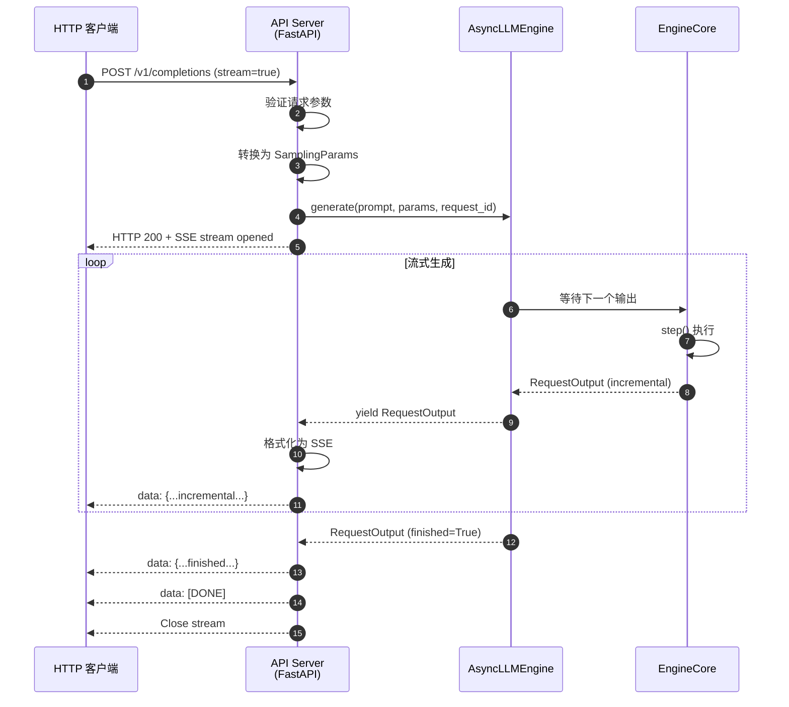

# vLLM-04-Entrypoints模块-概览

## 模块职责

Entrypoints 模块提供 vLLM 的用户接口层，负责：

- 提供离线推理接口（`LLM` 类）
- 提供 OpenAI 兼容的 API Server
- 处理 HTTP/gRPC 请求和响应
- 管理流式输出（Server-Sent Events）
- 提供 CLI 工具（serve、run 等）
- 支持多种 API 协议（Completions、Chat、Embeddings）
- 集成认证和限流

## 输入与输出

### 输入
- **离线推理**：Python 函数调用（prompts + SamplingParams）
- **API Server**：HTTP POST 请求（JSON body）
- **CLI**：命令行参数

### 输出
- **离线推理**：`list[RequestOutput]`（Python 对象）
- **API Server**：HTTP 响应（JSON 或 SSE 流）
- **CLI**：标准输出或日志

## 上下游依赖

### 上游（调用方）
- 用户 Python 脚本
- HTTP 客户端（curl、requests、OpenAI SDK）
- CLI 命令行

### 下游（被调用）
- `LLMEngine` / `AsyncLLMEngine`
- `Tokenizer`
- `SamplingParams` / `PoolingParams`

## 生命周期

### 初始化阶段
1. 解析配置（EngineArgs）
2. 创建 Engine（LLMEngine 或 AsyncLLMEngine）
3. 启动 HTTP Server（FastAPI，如为 API Server）
4. 注册路由和中间件

### 运行阶段
1. 接收请求
2. 验证和转换参数
3. 调用 Engine 执行
4. 格式化输出
5. 返回响应

### 关闭阶段
1. 等待未完成请求
2. 关闭 Engine
3. 停止 HTTP Server

## 架构图

```mermaid
flowchart TB
    subgraph Users["用户层"]
        PyUser[Python 用户]
        HTTPUser[HTTP 客户端]
        CLI[CLI 用户]
    end
    
    subgraph Entrypoints["Entrypoints 模块"]
        LLM[LLM 类<br/>离线接口]
        APIServer[API Server<br/>FastAPI]
        CLITools[CLI 工具]
        
        subgraph OpenAI["OpenAI API"]
            Completions[/v1/completions]
            Chat[/v1/chat/completions]
            Embeddings[/v1/embeddings]
            Models[/v1/models]
        end
    end
    
    subgraph Engine["Engine 层"]
        LLMEngine[LLMEngine]
        AsyncEngine[AsyncLLMEngine]
    end
    
    PyUser -->|generate| LLM
    HTTPUser -->|POST| Completions
    HTTPUser -->|POST| Chat
    HTTPUser -->|POST| Embeddings
    CLI -->|vllm serve| CLITools
    
    LLM -->|同步调用| LLMEngine
    Completions -->|异步调用| AsyncEngine
    Chat -->|异步调用| AsyncEngine
    Embeddings -->|异步调用| AsyncEngine
    CLITools -->|启动| APIServer
    
    style LLM fill:#e1f5ff
    style APIServer fill:#ffe1e1
    style AsyncEngine fill:#e1ffe1
```

### 架构说明

#### 1. 图意概述
Entrypoints 模块提供三种接口：LLM 类（离线推理）、API Server（在线服务）、CLI 工具（命令行）。离线接口直接调用同步 LLMEngine，在线接口使用异步 AsyncLLMEngine 支持高并发。

#### 2. 关键接口

**LLM 类**：
- `generate(prompts, sampling_params)`: 批量生成
- `chat(messages, sampling_params)`: 对话生成
- `encode(prompts, pooling_params)`: Embedding 生成

**API Server**：
- `POST /v1/completions`: 文本补全
- `POST /v1/chat/completions`: 对话补全
- `POST /v1/embeddings`: 文本 embedding
- `GET /v1/models`: 列出模型

**CLI 工具**：
- `vllm serve`: 启动 API Server
- `vllm run`: 运行单次推理
- `vllm chat`: 交互式对话

#### 3. 边界（并发/超时/幂等/顺序）

**并发**：
- LLM 类：串行处理
- API Server：高并发（asyncio + FastAPI）
- 并发限制：通过 `max_num_seqs` 控制

**超时**：
- API Server：支持 client 侧超时（timeout 参数）
- 无 server 侧超时（需上层实现）

**幂等性**：
- 非幂等（每次调用生成不同结果，除非固定 seed）

**顺序**：
- LLM 类：按提交顺序执行
- API Server：FCFS 或优先级调度

#### 4. 异常与回退

**异常类型**：
1. **参数错误**：400 Bad Request
2. **模型未找到**：404 Not Found
3. **服务器错误**：500 Internal Server Error
4. **请求超时**：408 Request Timeout（client 侧）

**回退策略**：
- 参数错误：返回详细错误信息
- 引擎错误：返回 500，记录日志
- 连接断开：自动取消请求

#### 5. 性能与容量假设

**性能特征**：
- LLM 类：取决于 batch size，单机吞吐 10-100 requests/s
- API Server：高并发，1000+ concurrent connections
- 延迟：5-50 ms（不含模型执行）

**容量假设**：
- 单机：100-1000 requests/s（取决于模型大小）
- 最大并发：受 `max_num_seqs` 限制

#### 6. 版本兼容/演进

**OpenAI API 兼容**：
- 完全兼容 OpenAI API v1
- 扩展参数：`best_of`、`use_beam_search` 等

**V0 → V1**：
- LLM 类接口不变
- API Server 性能提升 20-50%

## 核心功能与流程

### LLM 类使用流程

```python
from vllm import LLM, SamplingParams

# 1. 初始化 LLM
llm = LLM(model="meta-llama/Llama-2-7b-hf")

# 2. 准备输入
prompts = [
    "Hello, my name is",
    "The capital of France is",
]
sampling_params = SamplingParams(temperature=0.8, top_p=0.95)

# 3. 批量生成
outputs = llm.generate(prompts, sampling_params)

# 4. 处理输出
for output in outputs:
    prompt = output.prompt
    generated_text = output.outputs[0].text
    print(f"Prompt: {prompt!r}, Generated: {generated_text!r}")
```

**流程说明**：
- **目的**：提供简单的离线推理接口
- **输入**：prompts 和 sampling_params
- **输出**：RequestOutput 列表
- **复杂度**：O(num_prompts × avg_tokens)

### API Server 启动流程

```bash
# 命令行启动
vllm serve meta-llama/Llama-2-7b-hf \
    --host 0.0.0.0 \
    --port 8000 \
    --tensor-parallel-size 4 \
    --max-num-seqs 256
```

```python
# Python 代码启动
import uvicorn
from vllm.entrypoints.openai.api_server import app, init_app

# 初始化 app
init_app(
    engine_args=EngineArgs(
        model="meta-llama/Llama-2-7b-hf",
        tensor_parallel_size=4,
    )
)

# 启动服务器
uvicorn.run(app, host="0.0.0.0", port=8000)
```

### API 请求流程（Completions）

```python
# 客户端请求
import requests

response = requests.post(
    "http://localhost:8000/v1/completions",
    json={
        "model": "meta-llama/Llama-2-7b-hf",
        "prompt": "Hello, my name is",
        "max_tokens": 50,
        "temperature": 0.8,
        "stream": True,  # 流式输出
    },
    stream=True
)

# 处理流式响应
for line in response.iter_lines():
    if line:
        print(line.decode('utf-8'))
```

**服务器端处理流程**：

```python
@app.post("/v1/completions")
async def create_completion(request: CompletionRequest):
    # 1. 验证请求参数
    validate_request(request)
    
    # 2. 转换为 SamplingParams
    sampling_params = SamplingParams(
        temperature=request.temperature,
        top_p=request.top_p,
        max_tokens=request.max_tokens,
        # ...
    )
    
    # 3. 生成 request_id
    request_id = f"cmpl-{random_uuid()}"
    
    # 4. 提交到 AsyncEngine
    results_generator = engine.generate(
        prompt=request.prompt,
        sampling_params=sampling_params,
        request_id=request_id,
    )
    
    # 5. 流式返回结果
    if request.stream:
        return StreamingResponse(
            stream_results(results_generator),
            media_type="text/event-stream"
        )
    else:
        # 6. 等待完成，返回完整结果
        final_output = await results_generator.__anext__()
        return create_completion_response(final_output)
```

### Chat API 流程

```python
# 客户端请求
import openai

client = openai.OpenAI(
    base_url="http://localhost:8000/v1",
    api_key="EMPTY",  # vLLM 不需要 API key
)

response = client.chat.completions.create(
    model="meta-llama/Llama-2-7b-hf",
    messages=[
        {"role": "system", "content": "You are a helpful assistant."},
        {"role": "user", "content": "What is the capital of France?"},
    ],
    temperature=0.7,
    max_tokens=100,
)

print(response.choices[0].message.content)
```

**服务器端处理**：

```python
@app.post("/v1/chat/completions")
async def create_chat_completion(request: ChatCompletionRequest):
    # 1. 验证 messages 格式
    validate_messages(request.messages)
    
    # 2. 应用 chat template（将 messages 转换为 prompt）
    prompt = tokenizer.apply_chat_template(
        request.messages,
        tokenize=False,
        add_generation_prompt=True,
    )
    
    # 3. 转换为 SamplingParams
    sampling_params = create_sampling_params(request)
    
    # 4. 提交到 AsyncEngine
    results_generator = engine.generate(
        prompt=prompt,
        sampling_params=sampling_params,
        request_id=request_id,
    )
    
    # 5. 返回结果
    # （与 Completions 类似，支持流式和非流式）
```

---

## API 规格

### POST /v1/completions

#### 请求 Body

```json
{
  "model": "meta-llama/Llama-2-7b-hf",
  "prompt": "Hello, my name is",
  "max_tokens": 50,
  "temperature": 0.8,
  "top_p": 0.95,
  "n": 1,
  "stream": false,
  "stop": ["\n"],
  "presence_penalty": 0.0,
  "frequency_penalty": 0.0,
  "logprobs": null,
  "echo": false
}
```

#### 响应（非流式）

```json
{
  "id": "cmpl-12345",
  "object": "text_completion",
  "created": 1677652288,
  "model": "meta-llama/Llama-2-7b-hf",
  "choices": [
    {
      "text": " John and I am a software engineer.",
      "index": 0,
      "logprobs": null,
      "finish_reason": "length"
    }
  ],
  "usage": {
    "prompt_tokens": 5,
    "completion_tokens": 10,
    "total_tokens": 15
  }
}
```

#### 响应（流式）

```
data: {"id":"cmpl-12345","object":"text_completion","created":1677652288,"choices":[{"text":" John","index":0,"logprobs":null,"finish_reason":null}]}

data: {"id":"cmpl-12345","object":"text_completion","created":1677652288,"choices":[{"text":" and","index":0,"logprobs":null,"finish_reason":null}]}

data: {"id":"cmpl-12345","object":"text_completion","created":1677652288,"choices":[{"text":" I","index":0,"logprobs":null,"finish_reason":"length"}]}

data: [DONE]
```

### POST /v1/chat/completions

#### 请求 Body

```json
{
  "model": "meta-llama/Llama-2-7b-hf",
  "messages": [
    {"role": "system", "content": "You are a helpful assistant."},
    {"role": "user", "content": "What is the capital of France?"}
  ],
  "temperature": 0.7,
  "max_tokens": 100,
  "stream": false
}
```

#### 响应

```json
{
  "id": "chatcmpl-12345",
  "object": "chat.completion",
  "created": 1677652288,
  "model": "meta-llama/Llama-2-7b-hf",
  "choices": [
    {
      "index": 0,
      "message": {
        "role": "assistant",
        "content": "The capital of France is Paris."
      },
      "finish_reason": "stop"
    }
  ],
  "usage": {
    "prompt_tokens": 20,
    "completion_tokens": 8,
    "total_tokens": 28
  }
}
```

### POST /v1/embeddings

#### 请求 Body

```json
{
  "model": "sentence-transformers/all-MiniLM-L6-v2",
  "input": "Hello, world!",
  "encoding_format": "float"
}
```

#### 响应

```json
{
  "object": "list",
  "data": [
    {
      "object": "embedding",
      "embedding": [0.123, -0.456, 0.789, ...],
      "index": 0
    }
  ],
  "model": "sentence-transformers/all-MiniLM-L6-v2",
  "usage": {
    "prompt_tokens": 3,
    "total_tokens": 3
  }
}
```

---

## 时序图（API Server 流式输出）



---

## 配置参数

### LLM 类参数

```python
llm = LLM(
    model="meta-llama/Llama-2-7b-hf",       # 模型路径
    tokenizer=None,                         # Tokenizer 路径（默认同 model）
    tensor_parallel_size=1,                  # TP 大小
    dtype="auto",                           # 数据类型
    quantization=None,                      # 量化方式
    max_model_len=None,                     # 最大序列长度
    gpu_memory_utilization=0.9,             # GPU 内存利用率
    trust_remote_code=False,                # 是否信任远程代码
    download_dir=None,                      # 下载目录
    max_num_seqs=256,                       # 最大并发请求数
)
```

### API Server 参数

```bash
vllm serve MODEL_PATH \
    --host 0.0.0.0 \
    --port 8000 \
    --tensor-parallel-size 4 \
    --dtype auto \
    --max-model-len 4096 \
    --max-num-seqs 256 \
    --gpu-memory-utilization 0.9 \
    --enable-prefix-caching \
    --disable-log-requests \
    --api-key YOUR_API_KEY
```

---

## 最佳实践

### 离线推理最佳实践

1. **批量处理**：尽可能批量提交 prompts
2. **固定 seed**：需要可复现时设置 seed
3. **预分配内存**：设置合适的 `gpu_memory_utilization`

### API Server 最佳实践

1. **负载均衡**：使用 Nginx/HAProxy 进行负载均衡
2. **监控**：启用 Prometheus metrics
3. **限流**：使用 `--max-num-seqs` 限制并发
4. **认证**：设置 `--api-key` 启用认证

### 性能调优

1. **提高吞吐量**：增大 `--max-num-seqs`
2. **降低延迟**：减小 `--max-num-seqs`，启用 Chunked Prefill
3. **节省内存**：启用 `--enable-prefix-caching`

---

## 总结

Entrypoints 模块提供了三种用户接口：

1. **LLM 类**：简单易用的离线推理接口
2. **API Server**：OpenAI 兼容的在线服务接口
3. **CLI 工具**：命令行工具

核心特性：
- OpenAI API 完全兼容
- 支持流式和非流式输出
- 高并发（asyncio + FastAPI）
- 易于集成和部署

