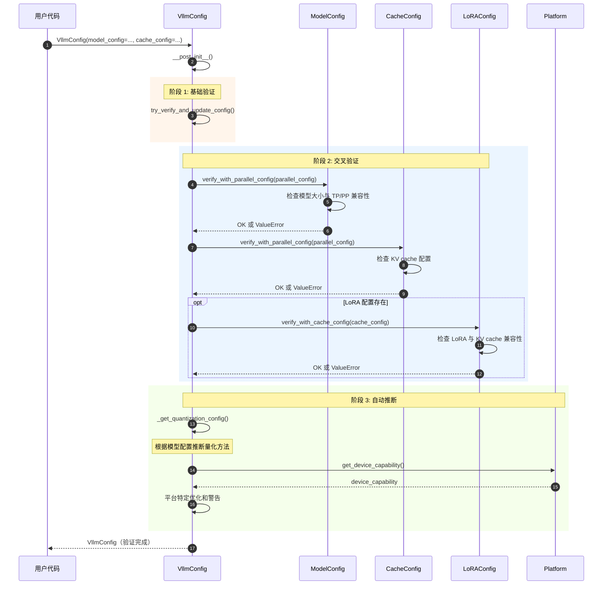

# vLLM-05-Config模块-API

## API 概览

Config 模块提供统一的配置管理 API，核心是 `VllmConfig` 类和各种子配置类：

| API 名称 | 类/接口 | 幂等性 | 作用 | 使用场景 |
|---------|---------|--------|------|---------|
| `VllmConfig.__post_init__` | 初始化方法 | 是 | 配置验证和一致性检查 | 配置创建时 |
| `VllmConfig.with_hf_config` | 实例方法 | 是 | 结合 HuggingFace 配置 | 模型加载时 |
| `update_config` | 工具函数 | 是 | 更新配置字段 | 配置修改时 |
| `get_field` | 工具函数 | 是 | 获取配置字段信息 | CLI 参数生成 |
| **各子配置类初始化** | 构造函数 | 是 | 创建具体配置 | 各模块初始化 |

---

## 核心 API

### 1. VllmConfig.__post_init__

#### 基本信息
- **名称**：`__post_init__`
- **协议/方法**：dataclass 后初始化方法
- **幂等性**：是（多次调用结果相同）
- **返回值**：`None`（副作用：验证和修改配置）

#### 功能描述

**目的**：验证所有配置的有效性，并确保不同配置之间的一致性。

#### 入口函数与关键代码

```python
def __post_init__(self):
    """验证配置的有效性和一致性"""
    
    # 1. 尝试验证和更新配置
    self.try_verify_and_update_config()
    
    # 2. 模型配置验证
    if self.model_config is not None:
        # 验证与并行配置的兼容性
        self.model_config.verify_with_parallel_config(self.parallel_config)
        
        # 验证双块注意力配置
        self.model_config.verify_dual_chunk_attention_config(
            self.load_config
        )
    
    # 3. 缓存配置验证
    self.cache_config.verify_with_parallel_config(self.parallel_config)
    
    # 4. LoRA 配置验证
    if self.lora_config is not None:
        self.lora_config.verify_with_cache_config(self.cache_config)
        self.lora_config.verify_with_model_config(self.model_config)
    
    # 5. 自动推断量化配置
    if self.quant_config is None and self.model_config is not None:
        self.quant_config = VllmConfig._get_quantization_config(
            self.model_config, self.load_config
        )
    
    # 6. 平台特定检查
    from vllm.platforms import current_platform
    if (self.model_config is not None and 
        self.scheduler_config.chunked_prefill_enabled and 
        self.model_config.dtype == torch.float32 and 
        current_platform.get_device_capability() == (7, 5)):
        logger.warning_once(
            "Turing devices tensor cores do not support float32 matmul. "
            "To workaround this limitation, vLLM will set 'ieee' input "
            "precision for chunked prefill triton kernels."
        )
    
    # 7. 编译配置自动设置（如果未显式指定）
    if not hasattr(self, '_compilation_level_set'):
        # 根据其他配置自动推断编译级别
        self._auto_set_compilation_level()
```

#### 验证规则表

| 验证项 | 检查内容 | 失败后果 |
|--------|----------|----------|
| model_config ↔ parallel_config | 模型大小与并行度匹配 | ValueError |
| cache_config ↔ parallel_config | KV cache 与并行配置兼容 | ValueError |
| lora_config ↔ model_config | LoRA 与模型架构兼容 | ValueError |
| device_config ↔ platform | 设备与平台兼容 | Warning 或 ValueError |
| scheduler_config ↔ model_config | 调度与模型参数匹配 | Warning 或 ValueError |

#### 时序图



#### 异常/回退与性能要点

**异常处理**：
1. **配置不兼容**：抛出 `ValueError` 并提供详细错误信息
2. **配置缺失**：自动使用默认值或推断值
3. **平台不支持**：发出警告并应用兼容性修复

**性能要点**：
1. **验证开销**：< 1 ms（主要是字段检查）
2. **自动推断**：量化配置推断约 1-5 ms
3. **缓存**：部分验证结果会被缓存

---

### 2. VllmConfig.with_hf_config

#### 基本信息
- **名称**：`with_hf_config`
- **协议/方法**：实例方法
- **幂等性**：是
- **返回值**：`VllmConfig`（新实例）

#### 请求结构体

```python
def with_hf_config(
    self,
    hf_config: PretrainedConfig,
    architectures: Optional[list[str]] = None,
) -> "VllmConfig":
    """结合 HuggingFace 配置创建新的 VllmConfig"""
```

**参数说明表**：

| 字段 | 类型 | 必填 | 说明 |
|------|------|------|------|
| hf_config | PretrainedConfig | ✓ | HuggingFace 模型配置 |
| architectures | list[str] | ✗ | 支持的模型架构列表 |

#### 入口函数与关键代码

```python
def with_hf_config(
    self,
    hf_config: PretrainedConfig,
    architectures: Optional[list[str]] = None,
) -> "VllmConfig":
    # 1. 更新 ModelConfig
    model_config = self.model_config.with_hf_config(
        hf_config, architectures
    )
    
    # 2. 创建新的 VllmConfig 实例
    return replace(self, model_config=model_config)
```

**使用场景**：
1. 从 HuggingFace Hub 加载模型时
2. 本地模型配置与 vLLM 配置合并
3. 动态模型切换

---

### 3. update_config

#### 基本信息
- **名称**：`update_config`
- **协议/方法**：工具函数
- **幂等性**：是
- **返回值**：更新后的配置对象

#### 请求结构体

```python
def update_config(config: ConfigT, overrides: dict[str, Any]) -> ConfigT:
    """递归更新配置对象"""
```

**参数说明表**：

| 字段 | 类型 | 必填 | 说明 |
|------|------|------|------|
| config | ConfigT | ✓ | 要更新的配置对象 |
| overrides | dict[str, Any] | ✓ | 覆盖的字段值 |

#### 入口函数与关键代码

```python
def update_config(config: ConfigT, overrides: dict[str, Any]) -> ConfigT:
    processed_overrides = {}
    
    for field_name, value in overrides.items():
        # 1. 验证字段存在
        assert hasattr(config, field_name), (
            f"{type(config)} has no field `{field_name}`"
        )
        
        current_value = getattr(config, field_name)
        
        # 2. 递归更新嵌套配置
        if is_dataclass(current_value) and not is_dataclass(value):
            assert isinstance(value, dict), (
                f"Overrides to {type(config)}.{field_name} must be a dict "
                f"or {type(current_value)}, but got {type(value)}"
            )
            value = update_config(current_value, value)
        
        processed_overrides[field_name] = value
    
    # 3. 创建新实例
    return replace(config, **processed_overrides)
```

**使用示例**：

```python
# 更新简单字段
config = update_config(config, {"max_model_len": 4096})

# 更新嵌套字段
config = update_config(config, {
    "parallel_config": {"tensor_parallel_size": 4},
    "cache_config": {"block_size": 32}
})
```

---

## 子配置类 API

### ModelConfig API

#### create_dummy_config
```python
@classmethod
def create_dummy_config(
    cls,
    model: str,
    seq_len: int = 1024,
    num_layers: int = 1,
) -> "ModelConfig":
    """创建用于测试的虚拟配置"""
```

#### verify_with_parallel_config
```python
def verify_with_parallel_config(self, parallel_config: ParallelConfig) -> None:
    """验证与并行配置的兼容性"""
    
    # 检查 TP 是否支持
    if parallel_config.tensor_parallel_size > 1:
        if not self.supports_tensor_parallel:
            raise ValueError(f"Model {self.model} does not support TP")
    
    # 检查 PP 是否支持
    if parallel_config.pipeline_parallel_size > 1:
        if not self.supports_pipeline_parallel:
            raise ValueError(f"Model {self.model} does not support PP")
```

---

### CacheConfig API

#### verify_with_parallel_config
```python
def verify_with_parallel_config(self, parallel_config: ParallelConfig) -> None:
    """验证缓存配置与并行配置的兼容性"""
    
    # 检查 KV cache 分片
    if parallel_config.tensor_parallel_size > 1:
        if self.block_size % parallel_config.tensor_parallel_size != 0:
            raise ValueError(
                f"Block size {self.block_size} must be divisible by "
                f"tensor_parallel_size {parallel_config.tensor_parallel_size}"
            )
```

---

### SchedulerConfig API

#### get_max_num_batched_tokens
```python
def get_max_num_batched_tokens(self) -> int:
    """获取最大批处理 token 数"""
    if self.max_num_batched_tokens is not None:
        return self.max_num_batched_tokens
    
    # 自动推断
    if self.chunked_prefill_enabled:
        return self.max_num_seqs * self.max_model_len
    else:
        return self.max_num_seqs * 16  # 估算 decode tokens
```

---

## CLI 集成 API

### get_kwargs
```python
def get_kwargs(
    cls: ConfigType,
    prefix: str = "",
    exclude: Optional[set[str]] = None,
) -> dict[str, Any]:
    """获取配置类的 CLI 参数"""
    
    kwargs = {}
    for field in fields(cls):
        if exclude and field.name in exclude:
            continue
        
        # 生成 CLI 参数名
        arg_name = f"--{prefix}{field.name.replace('_', '-')}"
        
        # 获取类型和默认值
        field_type = field.type
        default_value = field.default
        
        # 生成 argparse 参数
        kwargs[arg_name] = {
            "type": field_type,
            "default": default_value,
            "help": field.metadata.get("help", ""),
        }
    
    return kwargs
```

---

## 使用示例

### 示例 1：基本配置创建

```python
from vllm.config import VllmConfig, ModelConfig, CacheConfig

# 创建基本配置
config = VllmConfig(
    model_config=ModelConfig(model="meta-llama/Llama-2-7b-hf"),
    cache_config=CacheConfig(block_size=16),
)

# 配置会自动验证和补全
print(f"Model: {config.model_config.model}")
print(f"Vocab size: {config.model_config.vocab_size}")
```

### 示例 2：配置更新

```python
# 更新配置
new_config = update_config(config, {
    "parallel_config": {
        "tensor_parallel_size": 4,
    },
    "scheduler_config": {
        "max_num_seqs": 256,
    }
})

# 验证新配置
print(f"TP size: {new_config.parallel_config.tensor_parallel_size}")
```

### 示例 3：HuggingFace 配置集成

```python
from transformers import AutoConfig

# 加载 HF 配置
hf_config = AutoConfig.from_pretrained("meta-llama/Llama-2-7b-hf")

# 结合 HF 配置
config = config.with_hf_config(hf_config)

print(f"Hidden size: {config.model_config.hidden_size}")
print(f"Num layers: {config.model_config.num_layers}")
```

### 示例 4：配置验证错误处理

```python
try:
    # 不兼容的配置
    config = VllmConfig(
        model_config=ModelConfig(model="small-model"),
        parallel_config=ParallelConfig(tensor_parallel_size=8),  # 过大
    )
except ValueError as e:
    print(f"Configuration error: {e}")
    # 调整配置
    config = VllmConfig(
        model_config=ModelConfig(model="small-model"),
        parallel_config=ParallelConfig(tensor_parallel_size=2),
    )
```

---

## 配置组合模式

### 高性能配置
```python
high_perf_config = VllmConfig(
    model_config=ModelConfig(model="meta-llama/Llama-2-70b-hf"),
    parallel_config=ParallelConfig(
        tensor_parallel_size=8,
        pipeline_parallel_size=2,
    ),
    cache_config=CacheConfig(
        block_size=32,
        gpu_memory_utilization=0.95,
    ),
    compilation_config=CompilationConfig(level=3),
)
```

### 内存优化配置
```python
memory_opt_config = VllmConfig(
    model_config=ModelConfig(
        model="meta-llama/Llama-2-7b-hf",
        dtype="float16",
    ),
    cache_config=CacheConfig(
        block_size=16,
        gpu_memory_utilization=0.8,
        swap_space=4.0,  # 4GB swap
    ),
    scheduler_config=SchedulerConfig(
        max_num_seqs=128,
        chunked_prefill_enabled=True,
    ),
)
```

### 调试配置
```python
debug_config = VllmConfig(
    model_config=ModelConfig(model="facebook/opt-125m"),  # 小模型
    compilation_config=CompilationConfig(level=0),  # 不编译
    observability_config=ObservabilityConfig(
        collect_model_forward_time=True,
        collect_model_execute_time=True,
    ),
)
```

---

## 总结

Config 模块提供了完整的配置管理 API：

1. **VllmConfig**：顶层配置容器，自动验证一致性
2. **子配置类**：专门的配置领域（模型、缓存、并行等）
3. **工具函数**：配置更新、字段获取、CLI 集成
4. **验证机制**：交叉验证、自动推断、错误处理

核心设计理念：
- **类型安全**：使用 dataclass 和类型注解
- **验证完整**：多层验证确保配置正确
- **易于使用**：合理的默认值和自动推断
- **可扩展**：模块化设计，易于添加新配置
