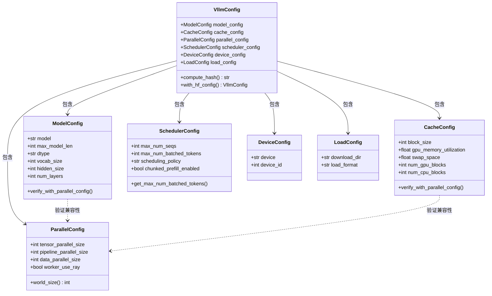
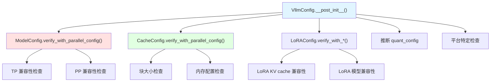

# vLLM-05-Config模块-数据结构

## 核心数据结构列表

Config 模块包含以下核心数据结构：

| 数据结构 | 类型 | 用途 | 更新时机 | 文件位置 |
|---------|------|------|---------|---------|
| `VllmConfig` | dataclass | 顶层配置容器 | 初始化时 | vllm/config/vllm.py |
| `ModelConfig` | dataclass | 模型配置 | 模型加载时 | vllm/config/model.py |
| `CacheConfig` | dataclass | KV cache 配置 | 内存管理时 | vllm/config/cache.py |
| `ParallelConfig` | dataclass | 并行配置 | 分布式设置时 | vllm/config/parallel.py |
| `SchedulerConfig` | dataclass | 调度器配置 | 调度策略时 | vllm/config/scheduler.py |
| `DeviceConfig` | dataclass | 设备配置 | 硬件检测时 | vllm/config/device.py |
| `LoadConfig` | dataclass | 模型加载配置 | 模型加载时 | vllm/config/load.py |

---

## 数据结构详细说明

### 1. VllmConfig

#### 基本信息

**用途**：顶层配置容器，包含所有 vLLM 相关的配置。

**定义**：

```python
@config
@dataclass(config=ConfigDict(arbitrary_types_allowed=True))
class VllmConfig:
    """包含所有 vLLM 相关配置的数据类"""
    
    # 核心配置
    model_config: ModelConfig = None
    cache_config: CacheConfig = field(default_factory=CacheConfig)
    parallel_config: ParallelConfig = field(default_factory=ParallelConfig)
    scheduler_config: SchedulerConfig = field(default_factory=SchedulerConfig)
    device_config: DeviceConfig = field(default_factory=DeviceConfig)
    load_config: LoadConfig = field(default_factory=LoadConfig)
    
    # 可选配置
    lora_config: Optional[LoRAConfig] = None
    speculative_config: Optional[SpeculativeConfig] = None
    structured_outputs_config: StructuredOutputsConfig = field(
        default_factory=StructuredOutputsConfig)
    observability_config: Optional[ObservabilityConfig] = None
    quant_config: Optional[QuantizationConfig] = None
    compilation_config: CompilationConfig = field(
        default_factory=CompilationConfig)
    
    # 分布式配置
    kv_transfer_config: Optional[KVTransferConfig] = None
    kv_events_config: Optional[KVEventsConfig] = None
    
    # 辅助配置
    additional_config: Union[dict, SupportsHash] = field(default_factory=dict)
    instance_id: str = ""
```

#### 字段说明表

| 字段 | 类型 | 必填 | 说明 |
|------|------|------|------|
| model_config | ModelConfig | ✓ | 模型配置（架构、参数等） |
| cache_config | CacheConfig | ✗ | KV cache 配置 |
| parallel_config | ParallelConfig | ✗ | 并行策略配置 |
| scheduler_config | SchedulerConfig | ✗ | 调度器配置 |
| device_config | DeviceConfig | ✗ | 设备和硬件配置 |
| load_config | LoadConfig | ✗ | 模型加载配置 |
| lora_config | LoRAConfig | ✗ | LoRA 适配器配置 |
| speculative_config | SpeculativeConfig | ✗ | 推测解码配置 |
| compilation_config | CompilationConfig | ✗ | 编译优化配置 |
| quant_config | QuantizationConfig | ✗ | 量化配置（自动推断） |

#### 用途和更新时机

**创建时机**：
- LLM 类初始化时
- API Server 启动时
- CLI 工具解析参数后

**使用场景**：
1. 配置验证和一致性检查
2. 传递给各个模块
3. 配置序列化和哈希计算

---

### 2. ModelConfig

#### 基本信息

**用途**：模型相关的配置，包括模型架构、参数、数据类型等。

**定义**：

```python
@config
@dataclass
class ModelConfig:
    """模型配置"""
    
    # 基本信息
    model: str                               # 模型名称或路径
    tokenizer: Optional[str] = None          # Tokenizer 名称或路径
    tokenizer_mode: str = "auto"             # Tokenizer 模式
    trust_remote_code: bool = False          # 是否信任远程代码
    
    # 模型参数
    max_model_len: Optional[int] = None      # 最大模型长度
    dtype: str = "auto"                      # 数据类型
    seed: int = 0                            # 随机种子
    revision: Optional[str] = None           # 模型版本
    
    # 推断参数（自动填充）
    vocab_size: int = -1                     # 词汇表大小
    hidden_size: int = -1                    # 隐藏层大小
    num_layers: int = -1                     # 层数
    num_attention_heads: int = -1            # 注意力头数
    num_key_value_heads: Optional[int] = None  # KV 头数（GQA）
    
    # 架构特性
    sliding_window: Optional[int] = None     # 滑动窗口大小
    rope_theta: Optional[float] = None       # RoPE theta 参数
    rope_scaling: Optional[dict] = None      # RoPE 缩放参数
    
    # 多模态
    multimodal_config: Optional[MultiModalConfig] = None
    
    # 量化
    quantization: Optional[str] = None       # 量化方法
    quantization_param_path: Optional[str] = None
    
    # 其他
    enforce_eager: bool = False              # 强制 eager 模式
    max_context_len_to_capture: Optional[int] = None  # CUDA 图捕获上下文长度
    max_seq_len_to_capture: int = 8192       # CUDA 图捕获序列长度
    
    # 内部使用
    hf_config: Any = field(default=None, init=False)
    hf_text_config: Any = field(default=None, init=False)
```

#### 字段说明表

| 字段 | 类型 | 默认值 | 说明 |
|------|------|--------|------|
| model | str | 必填 | 模型名称（HF Hub）或本地路径 |
| max_model_len | int | 自动推断 | 最大序列长度（包含 prompt + generation） |
| dtype | str | "auto" | 模型数据类型：auto/float16/bfloat16/float32 |
| vocab_size | int | 自动推断 | 词汇表大小，从模型配置获取 |
| hidden_size | int | 自动推断 | 隐藏层维度 |
| num_layers | int | 自动推断 | Transformer 层数 |
| num_attention_heads | int | 自动推断 | 注意力头数 |
| num_key_value_heads | int | 自动推断 | KV 头数（GQA 时 < attention heads） |
| sliding_window | int | None | 滑动窗口大小（如 Mistral 4096） |
| multimodal_config | MultiModalConfig | None | 多模态配置（视觉、音频等） |
| enforce_eager | bool | False | 禁用 CUDA 图优化，强制 eager 执行 |

#### 自动推断逻辑

```python
def _verify_and_get_model_config(self, parallel_config: ParallelConfig) -> None:
    """从 HuggingFace 配置自动推断模型参数"""
    
    # 1. 加载 HF 配置
    if self.hf_config is None:
        self.hf_config = get_config(
            self.model, 
            trust_remote_code=self.trust_remote_code,
            revision=self.revision
        )
    
    # 2. 推断基本参数
    if self.vocab_size == -1:
        self.vocab_size = getattr(self.hf_config, 'vocab_size', 50257)
    
    if self.hidden_size == -1:
        self.hidden_size = getattr(self.hf_config, 'hidden_size', 768)
    
    if self.num_layers == -1:
        self.num_layers = getattr(self.hf_config, 'num_hidden_layers', 12)
    
    if self.num_attention_heads == -1:
        self.num_attention_heads = getattr(self.hf_config, 'num_attention_heads', 12)
    
    # 3. 推断 KV 头数（GQA）
    if self.num_key_value_heads is None:
        self.num_key_value_heads = getattr(
            self.hf_config, 'num_key_value_heads', self.num_attention_heads
        )
    
    # 4. 推断最大长度
    if self.max_model_len is None:
        possible_keys = ['max_position_embeddings', 'max_sequence_length', 'seq_length']
        for key in possible_keys:
            if hasattr(self.hf_config, key):
                self.max_model_len = getattr(self.hf_config, key)
                break
        else:
            self.max_model_len = 2048  # 默认值
```

---

### 3. CacheConfig

#### 基本信息

**用途**：KV cache 相关配置，控制内存使用和缓存策略。

**定义**：

```python
@config
@dataclass
class CacheConfig:
    """KV cache 配置"""
    
    # 内存配置
    block_size: int = 16                     # KV cache 块大小（tokens）
    gpu_memory_utilization: float = 0.9     # GPU 内存利用率
    swap_space: float = 4.0                  # CPU swap 空间（GB）
    cpu_offload_gb: float = 0                # CPU offload 大小（GB）
    
    # 缓存策略
    cache_dtype: str = "auto"                # KV cache 数据类型
    num_gpu_blocks: Optional[int] = None     # GPU 块数量（自动计算）
    num_cpu_blocks: Optional[int] = None     # CPU 块数量（自动计算）
    
    # 高级选项
    sliding_window: Optional[int] = None     # 滑动窗口缓存
    enable_prefix_caching: bool = False      # 启用前缀缓存
    
    # V1 特有配置
    num_kv_heads: Optional[int] = None       # KV 头数
    head_size: Optional[int] = None          # 头大小
    num_layers: Optional[int] = None         # 层数
```

#### 字段说明表

| 字段 | 类型 | 默认值 | 说明 |
|------|------|--------|------|
| block_size | int | 16 | 每个 KV cache 块包含的 token 数 |
| gpu_memory_utilization | float | 0.9 | GPU 内存使用比例（0.0-1.0） |
| swap_space | float | 4.0 | CPU swap 空间大小（GB） |
| cache_dtype | str | "auto" | KV cache 数据类型（通常与模型相同） |
| num_gpu_blocks | int | 自动计算 | GPU KV cache 块数量 |
| num_cpu_blocks | int | 自动计算 | CPU KV cache 块数量 |
| enable_prefix_caching | bool | False | 是否启用前缀缓存优化 |

#### 内存计算

```python
def _get_cache_block_size(
    self,
    model_config: ModelConfig,
    parallel_config: ParallelConfig,
) -> int:
    """计算单个 KV cache 块的内存大小"""
    
    head_size = model_config.get_head_size()
    num_heads = model_config.get_num_kv_heads(parallel_config)
    num_layers = model_config.get_num_layers(parallel_config)
    
    # 单个 token 的 KV cache 大小
    key_cache_block = self.block_size * num_heads * head_size
    value_cache_block = self.block_size * num_heads * head_size
    total = num_layers * (key_cache_block + value_cache_block)
    
    # 数据类型大小
    dtype_size = torch.dtype(self.cache_dtype).itemsize
    
    return total * dtype_size

def _get_num_gpu_blocks(
    self,
    gpu_memory: int,
    model_memory: int,
    parallel_config: ParallelConfig,
) -> int:
    """计算 GPU 可分配的 KV cache 块数量"""
    
    available_memory = gpu_memory * self.gpu_memory_utilization - model_memory
    cache_block_size = self._get_cache_block_size(model_config, parallel_config)
    
    num_gpu_blocks = available_memory // cache_block_size
    return max(0, num_gpu_blocks)
```

---

### 4. ParallelConfig

#### 基本信息

**用途**：并行执行配置，包括 TP、PP、DP 等并行策略。

**定义**：

```python
@config  
@dataclass
class ParallelConfig:
    """并行配置"""
    
    # 并行维度
    pipeline_parallel_size: int = 1         # Pipeline 并行大小
    tensor_parallel_size: int = 1           # Tensor 并行大小
    worker_use_ray: bool = False             # 是否使用 Ray
    max_parallel_loading_workers: Optional[int] = None  # 最大并行加载 Worker 数
    
    # 通信配置
    disable_custom_all_reduce: bool = False  # 禁用自定义 AllReduce
    tokenizer_pool_size: int = 0             # Tokenizer 池大小
    tokenizer_pool_type: str = "ray"         # Tokenizer 池类型
    tokenizer_pool_extra_config: Optional[dict] = None
    
    # 分布式后端
    distributed_executor_backend: Optional[str] = None
    
    # Ray 特定配置
    ray_workers_use_nsight: bool = False     # Ray Worker 使用 Nsight
    placement_group: Optional["PlacementGroup"] = None
    
    # Data Parallelism (实验性)
    data_parallel_size: int = 1              # Data 并行大小
    
    # Expert Parallelism (MoE)
    expert_parallel_size: int = 1            # Expert 并行大小
```

#### 字段说明表

| 字段 | 类型 | 默认值 | 说明 |
|------|------|--------|------|
| tensor_parallel_size | int | 1 | TP 大小，分片模型权重到多个 GPU |
| pipeline_parallel_size | int | 1 | PP 大小，分片模型层到多个 GPU |
| data_parallel_size | int | 1 | DP 大小，复制模型到多个设备 |
| expert_parallel_size | int | 1 | EP 大小，分片 MoE 专家到多个 GPU |
| worker_use_ray | bool | False | 是否使用 Ray 作为分布式后端 |
| disable_custom_all_reduce | bool | False | 禁用 vLLM 自定义 AllReduce 优化 |

#### 并行约束检查

```python
def verify_config(self, model_config: ModelConfig) -> None:
    """验证并行配置的有效性"""
    
    # 1. TP 约束
    if self.tensor_parallel_size > 1:
        if model_config.hidden_size % self.tensor_parallel_size != 0:
            raise ValueError(
                f"Hidden size {model_config.hidden_size} is not divisible by "
                f"tensor_parallel_size {self.tensor_parallel_size}"
            )
        
        if model_config.num_attention_heads % self.tensor_parallel_size != 0:
            raise ValueError(
                f"Number of attention heads {model_config.num_attention_heads} "
                f"is not divisible by tensor_parallel_size {self.tensor_parallel_size}"
            )
    
    # 2. PP 约束
    if self.pipeline_parallel_size > 1:
        if model_config.num_layers % self.pipeline_parallel_size != 0:
            logger.warning(
                f"Number of layers {model_config.num_layers} is not evenly "
                f"divisible by pipeline_parallel_size {self.pipeline_parallel_size}. "
                f"This may lead to load imbalance."
            )
    
    # 3. 总并行度约束
    total_parallel_size = (
        self.tensor_parallel_size * 
        self.pipeline_parallel_size * 
        self.data_parallel_size
    )
    
    if total_parallel_size > torch.cuda.device_count():
        raise ValueError(
            f"Total parallel size {total_parallel_size} exceeds "
            f"available GPUs {torch.cuda.device_count()}"
        )
```

---

### 5. SchedulerConfig

#### 基本信息

**用途**：调度器配置，控制请求调度策略和批处理行为。

**定义**：

```python
@config
@dataclass  
class SchedulerConfig:
    """调度器配置"""
    
    # 批处理配置
    max_num_batched_tokens: Optional[int] = None    # 最大批处理 token 数
    max_num_seqs: int = 256                         # 最大序列数
    max_model_len: Optional[int] = None             # 最大模型长度
    
    # 调度策略
    scheduling_policy: str = "fcfs"                 # 调度策略：fcfs/priority
    delay_factor: float = 0.0                       # 延迟因子
    enable_chunked_prefill: bool = False            # 启用分块 prefill
    
    # Prefill 配置
    max_num_batched_tokens_for_prefill: Optional[int] = None
    chunked_prefill_enabled: bool = False
    
    # 抢占配置
    preemption_mode: str = "swap"                   # 抢占模式：swap/recompute
    preemption_check_period: float = 1.0           # 抢占检查周期
    preemption_tolerance: float = 2.0               # 抢占容忍度
    
    # 其他
    send_delta_data: bool = False                   # 发送增量数据
    policy: str = "fcfs"                            # 策略别名
    
    # V1 特有配置  
    use_v2_block_manager: bool = False              # 使用 V2 块管理器
    enable_prefix_caching: bool = False             # 启用前缀缓存
```

#### 字段说明表

| 字段 | 类型 | 默认值 | 说明 |
|------|------|--------|------|
| max_num_seqs | int | 256 | 同时处理的最大序列数 |
| max_num_batched_tokens | int | 自动计算 | 单次 step 最大 token 数 |
| scheduling_policy | str | "fcfs" | 调度策略：fcfs（先到先服务）/priority（优先级） |
| chunked_prefill_enabled | bool | False | 启用分块 prefill 优化 |
| preemption_mode | str | "swap" | 抢占模式：swap（换出）/recompute（重计算） |
| enable_prefix_caching | bool | False | 启用前缀缓存 |

#### 自动计算逻辑

```python
def get_max_num_batched_tokens(self, model_config: ModelConfig) -> int:
    """计算最大批处理 token 数"""
    
    if self.max_num_batched_tokens is not None:
        return self.max_num_batched_tokens
    
    max_model_len = self.max_model_len or model_config.max_model_len
    
    if self.chunked_prefill_enabled:
        # Chunked prefill: 支持更多 token
        return max(512, self.max_num_seqs * 16)
    else:
        # 传统模式: 保守估计
        return min(self.max_num_seqs * max_model_len, 2048)
```

---

### 6. DeviceConfig

#### 基本信息

**用途**：设备和硬件相关配置。

**定义**：

```python
@config
@dataclass
class DeviceConfig:
    """设备配置"""
    
    device: str = "auto"                     # 设备类型：cuda/cpu/auto
    device_id: int = 0                       # 设备 ID
    
    # CUDA 特定
    cuda_visible_devices: Optional[str] = None  # CUDA 可见设备
    
    # 其他设备
    xpu_device_id: int = 0                   # XPU 设备 ID (Intel GPU)
    npu_device_id: int = 0                   # NPU 设备 ID (华为昇腾)
```

---

### 7. LoadConfig

#### 基本信息

**用途**：模型加载相关配置。

**定义**：

```python
@config
@dataclass
class LoadConfig:
    """模型加载配置"""
    
    # 下载配置
    download_dir: Optional[str] = None       # 下载目录
    load_format: str = "auto"                # 加载格式：auto/pt/safetensors
    
    # 权重加载
    ignore_patterns: Optional[list[str]] = None  # 忽略的权重模式
    
    # 其他
    dual_chunk_attention: bool = False       # 双块注意力
```

---

## 数据结构关系图（类图）



---

## 配置验证依赖图



---

## 内存占用估算

### ModelConfig 内存占用

| 字段 | 内存大小 | 说明 |
|------|---------|------|
| 基本字段 | ~1 KB | 字符串、整数、布尔值 |
| hf_config | ~10-50 KB | HuggingFace 配置对象 |
| 总计 | ~50 KB | 轻量级配置 |

### CacheConfig 内存占用

| 字段 | 内存大小 | 说明 |
|------|---------|------|
| 基本字段 | ~1 KB | 数值配置 |
| 块信息 | ~1 KB | 块数量等计算结果 |
| 总计 | ~2 KB | 轻量级配置 |

### 实际 KV Cache 内存占用（由 CacheConfig 控制）

**示例计算**：
- model: Llama-2-7B (hidden_size=4096, num_layers=32, num_heads=32, head_dim=128)
- block_size: 16
- num_gpu_blocks: 1000
- dtype: float16 (2 bytes)

```
单块内存 = 2 * block_size * num_heads * head_dim * dtype_size
        = 2 * 16 * 32 * 128 * 2 = 262,144 bytes = 256 KB

单层内存 = num_gpu_blocks * 单块内存 = 1000 * 256 KB = 256 MB

总内存 = num_layers * 单层内存 = 32 * 256 MB = 8 GB
```

---

## 配置组合示例

### 高性能配置组合

```python
high_perf_config = VllmConfig(
    model_config=ModelConfig(
        model="meta-llama/Llama-2-70b-hf",
        dtype="float16",
        max_model_len=4096,
    ),
    parallel_config=ParallelConfig(
        tensor_parallel_size=8,
        pipeline_parallel_size=2,
    ),
    cache_config=CacheConfig(
        block_size=32,
        gpu_memory_utilization=0.95,
    ),
    scheduler_config=SchedulerConfig(
        max_num_seqs=512,
        chunked_prefill_enabled=True,
    ),
)
```

### 内存优化配置组合

```python
memory_opt_config = VllmConfig(
    model_config=ModelConfig(
        model="meta-llama/Llama-2-7b-hf", 
        dtype="float16",
        max_model_len=2048,
    ),
    cache_config=CacheConfig(
        block_size=16,
        gpu_memory_utilization=0.8,
        swap_space=8.0,  # 8GB swap
    ),
    scheduler_config=SchedulerConfig(
        max_num_seqs=128,
        preemption_mode="swap",
    ),
)
```

### 调试配置组合

```python
debug_config = VllmConfig(
    model_config=ModelConfig(
        model="facebook/opt-125m",  # 小模型
        dtype="float32",
        enforce_eager=True,  # 禁用优化
    ),
    compilation_config=CompilationConfig(level=0),  # 无编译
    scheduler_config=SchedulerConfig(
        max_num_seqs=16,
        scheduling_policy="fcfs",
    ),
)
```

---

## 总结

Config 模块的数据结构设计特点：

1. **层次化设计**：VllmConfig 作为顶层容器，包含各专门配置
2. **类型安全**：使用 dataclass 和类型注解
3. **自动推断**：合理的默认值和自动计算逻辑
4. **交叉验证**：配置之间的一致性检查
5. **扩展性**：易于添加新的配置字段和验证规则

核心数据结构：
- **VllmConfig**：顶层配置容器，统一管理
- **ModelConfig**：模型相关配置，自动推断参数
- **CacheConfig**：KV cache 配置，控制内存使用
- **ParallelConfig**：并行策略配置，支持多种并行模式
- **SchedulerConfig**：调度器配置，控制批处理行为

通过合理的配置组合，可以在性能、内存使用和功能之间取得平衡。
