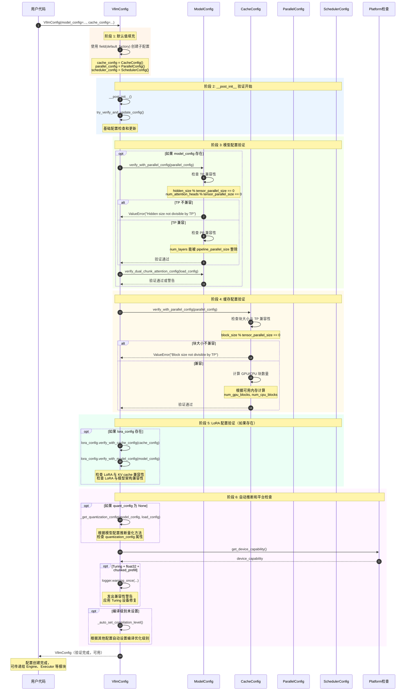
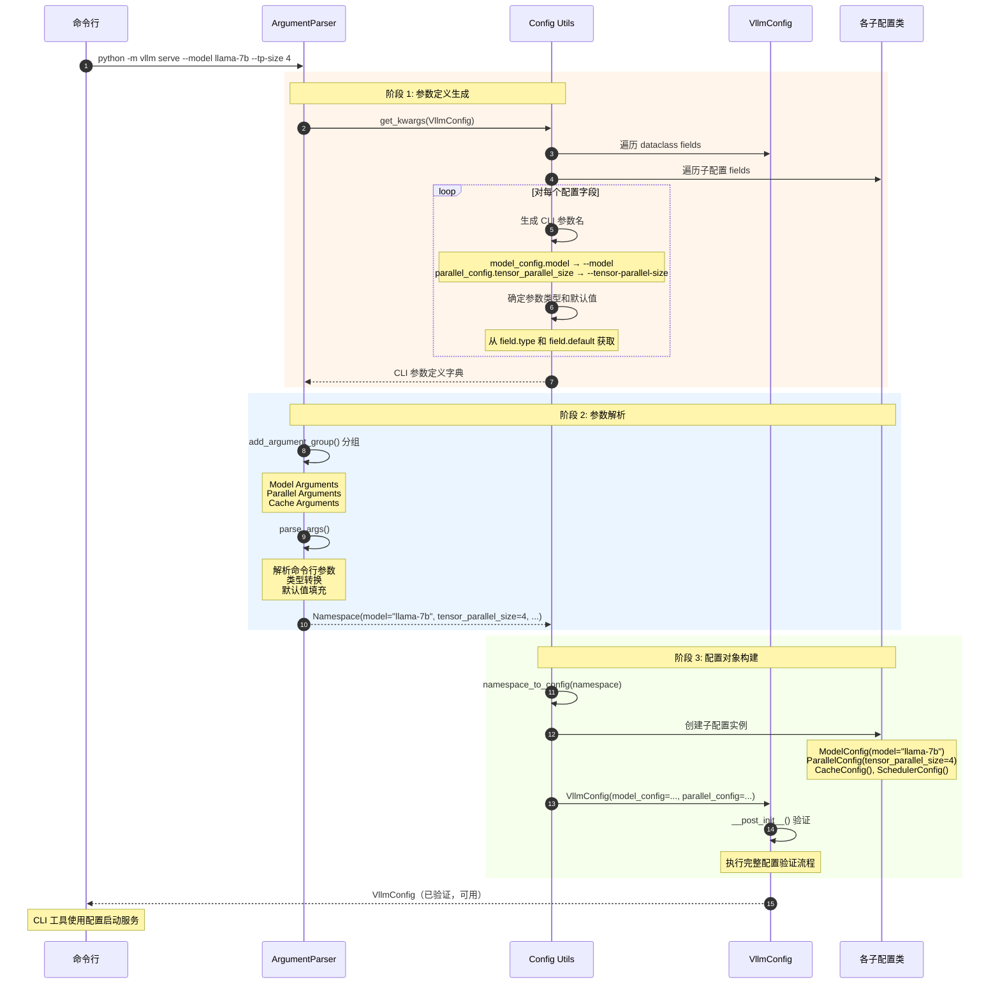
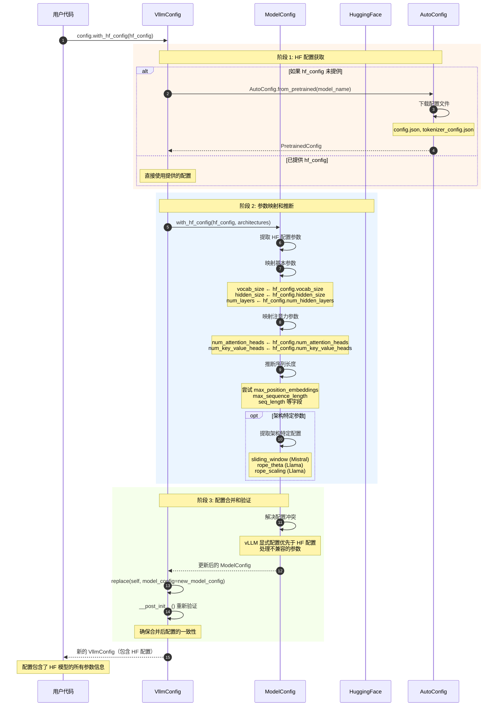
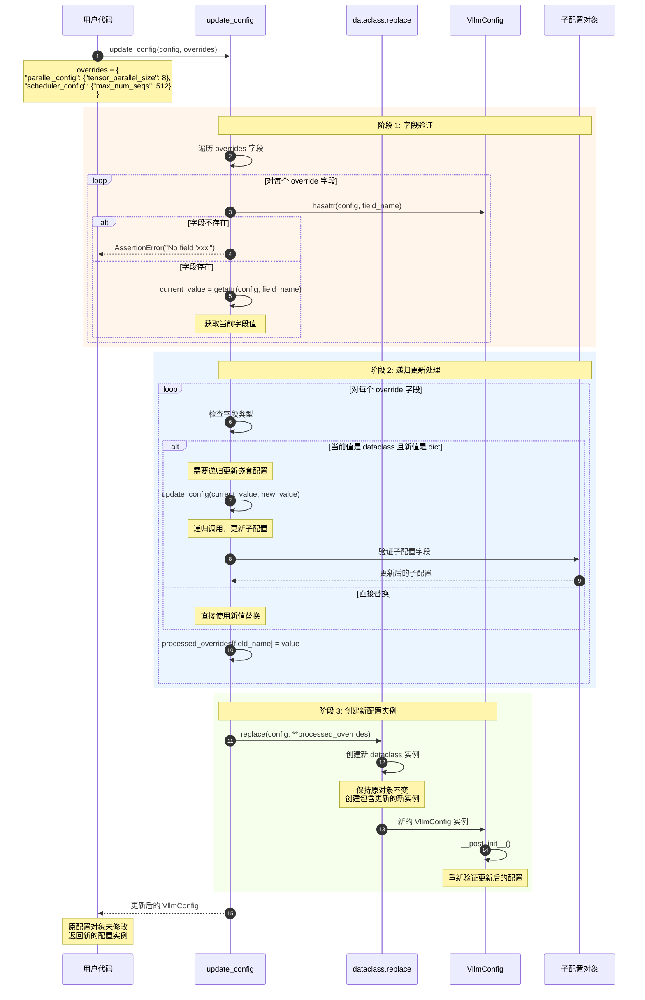
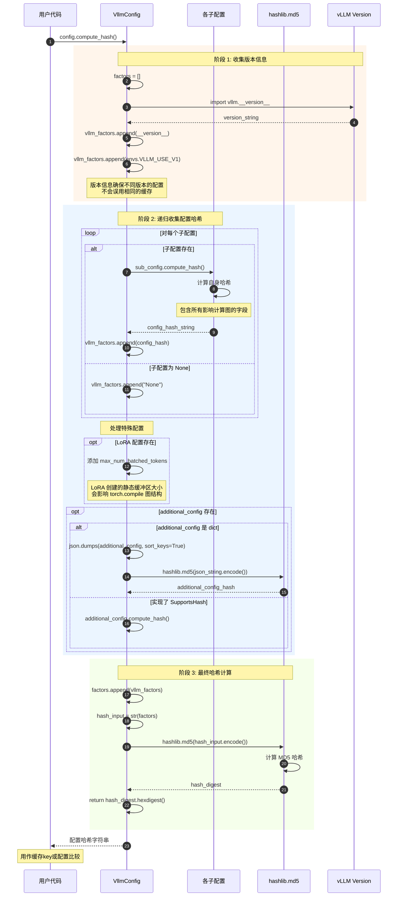

# vLLM-05-Config模块-时序图

## 典型场景列表

Config 模块包含以下典型执行场景：

| 场景编号 | 场景名称 | 参与组件 | 关键点 | 适用情况 |
|---------|---------|---------|--------|---------|
| 1 | 配置创建与验证 | VllmConfig、各子配置类 | 交叉验证、自动推断 | 系统启动时 |
| 2 | CLI 参数解析 | ArgumentParser、各Config类 | 参数映射、类型转换 | 命令行启动 |
| 3 | HuggingFace 配置集成 | ModelConfig、HF Config | 配置合并、参数推断 | 模型加载时 |
| 4 | 配置更新与覆盖 | update_config 函数 | 递归更新、类型检查 | 运行时配置修改 |
| 5 | 配置哈希计算 | VllmConfig.compute_hash | 缓存key生成、变更检测 | 编译缓存时 |

---

## 场景 1：配置创建与验证

### 场景描述

**目标**：创建 VllmConfig 实例并进行完整的配置验证。

**适用场景**：
- LLM 类初始化
- API Server 启动
- 测试环境配置

**关键特征**：
- 自动填充默认值
- 交叉验证配置一致性
- 自动推断缺失参数
- 平台特定优化

### 时序图



### 关键点说明

#### 1. 默认值填充策略

- **field(default_factory)**：使用工厂函数创建默认实例
- **延迟初始化**：ModelConfig 延迟到有具体模型时初始化
- **合理默认值**：每个配置都有生产可用的默认值

#### 2. 交叉验证逻辑

**模型 ↔ 并行验证**：
```python
# TP 兼容性检查
if hidden_size % tensor_parallel_size != 0:
    raise ValueError("Hidden size must be divisible by TP size")

# 注意力头分片检查  
if num_attention_heads % tensor_parallel_size != 0:
    raise ValueError("Attention heads must be divisible by TP size")
```

**缓存 ↔ 并行验证**：
```python
# KV cache 块大小检查
if block_size % tensor_parallel_size != 0:
    raise ValueError("Block size must be divisible by TP size")
```

#### 3. 自动推断机制

- **量化配置**：从模型配置的 `quantization_config` 属性推断
- **编译级别**：根据模型大小和硬件能力自动选择
- **内存配置**：根据 GPU 内存自动计算块数量

#### 4. 边界与约束

- **内存限制**：GPU 内存不足时减少 `max_num_seqs` 或 `gpu_memory_utilization`
- **并行限制**：并行度不能超过可用 GPU 数量
- **模型限制**：模型架构必须支持指定的并行策略

#### 5. 异常与回退

- **配置不兼容**：抛出详细的 `ValueError`
- **内存不足**：自动调整配置或提供建议
- **平台不支持**：发出警告并应用兼容性修复

#### 6. 性能特征

- **验证时间**：< 10 ms（主要是字段检查）
- **自动推断开销**：量化配置推断约 1-5 ms
- **缓存**：验证结果部分缓存，避免重复计算

---

## 场景 2：CLI 参数解析

### 场景描述

**目标**：将命令行参数解析为 VllmConfig 实例。

**适用场景**：
- vllm serve 命令
- vllm generate 工具
- 自定义 CLI 工具

**关键特征**：
- 自动生成 argparse 参数
- 类型转换和验证
- 嵌套配置展平

### 时序图



### 关键点说明

#### 1. 参数名映射规则

```python
def field_name_to_cli_arg(field_name: str, prefix: str = "") -> str:
    """将字段名转换为 CLI 参数名"""
    # model_config.model → --model
    # parallel_config.tensor_parallel_size → --tensor-parallel-size
    return f"--{prefix}{field_name.replace('_', '-')}"
```

#### 2. 类型转换处理

```python
def get_cli_type(field_type: type) -> type:
    """获取 CLI 参数类型"""
    if field_type == bool:
        return lambda x: x.lower() in ('true', '1', 'yes')
    elif field_type == Optional[int]:
        return lambda x: None if x == 'None' else int(x)
    elif field_type == list[str]:
        return lambda x: x.split(',')
    else:
        return field_type
```

#### 3. 嵌套配置展平

- **前缀添加**：子配置字段添加前缀以避免冲突
- **分组显示**：相关参数在 help 中分组显示
- **默认值继承**：CLI 默认值从配置类默认值继承

---

## 场景 3：HuggingFace 配置集成

### 场景描述

**目标**：将 HuggingFace 模型配置与 vLLM 配置合并。

**适用场景**：
- 从 HF Hub 加载模型
- 本地模型配置合并
- 模型配置自动推断

**关键特征**：
- 自动下载 HF 配置
- 参数映射和转换
- 配置冲突处理

### 时序图



### 关键点说明

#### 1. 参数映射表

| HF 配置字段 | vLLM 字段 | 转换逻辑 |
|------------|----------|----------|
| vocab_size | vocab_size | 直接复制 |
| hidden_size | hidden_size | 直接复制 |
| num_hidden_layers | num_layers | 直接复制 |
| num_attention_heads | num_attention_heads | 直接复制 |
| num_key_value_heads | num_key_value_heads | 可能为 None（MHA） |
| max_position_embeddings | max_model_len | 优先级最高 |
| max_sequence_length | max_model_len | 备选 |
| torch_dtype | dtype | 转换为字符串 |

#### 2. 架构特定处理

```python
def extract_architecture_specific_config(hf_config, model_type):
    """提取架构特定配置"""
    if model_type == "llama":
        return {
            "rope_theta": getattr(hf_config, "rope_theta", 10000.0),
            "rope_scaling": getattr(hf_config, "rope_scaling", None),
        }
    elif model_type == "mistral":
        return {
            "sliding_window": getattr(hf_config, "sliding_window", None),
        }
    # ... 其他架构
```

#### 3. 配置冲突解决

- **显式优先**：用户显式设置的配置优先于 HF 配置
- **兼容性检查**：确保 HF 配置与 vLLM 兼容
- **警告机制**：不兼容时发出警告并使用安全默认值

---

## 场景 4：配置更新与覆盖

### 场景描述

**目标**：运行时更新配置的部分字段。

**适用场景**：
- 动态配置调整
- A/B 测试配置切换
- 配置热更新

**关键特征**：
- 递归配置更新
- 类型安全检查
- 不可变性保证

### 时序图



### 关键点说明

#### 1. 不可变性保证

- **dataclass.replace()**：创建新实例而不修改原实例
- **递归复制**：嵌套配置也创建新实例
- **线程安全**：多线程环境下安全使用

#### 2. 类型安全检查

```python
def validate_override_type(current_value, new_value, field_name):
    """验证覆盖值的类型"""
    if is_dataclass(current_value) and not is_dataclass(new_value):
        if not isinstance(new_value, dict):
            raise TypeError(
                f"Override for {field_name} must be dict or {type(current_value)}"
            )
    # 其他类型检查...
```

#### 3. 递归更新逻辑

```python
def recursive_update(config, overrides):
    """递归更新嵌套配置"""
    for field_name, value in overrides.items():
        current = getattr(config, field_name)
        
        if is_dataclass(current) and isinstance(value, dict):
            # 递归更新嵌套配置
            value = recursive_update(current, value)
        
        processed[field_name] = value
    
    return replace(config, **processed)
```

---

## 场景 5：配置哈希计算

### 场景描述

**目标**：计算配置的唯一哈希值，用于缓存key和变更检测。

**适用场景**：
- 编译缓存key生成
- 配置变更检测
- 模型缓存管理

**关键特征**：
- 递归哈希计算
- 仅包含影响计算图的配置
- 版本兼容性处理

### 时序图



### 关键点说明

#### 1. 哈希包含的配置

**包含的配置**（影响计算图）：
- model_config：模型架构参数
- parallel_config：并行策略
- compilation_config：编译设置
- lora_config：LoRA 适配器配置
- quant_config：量化配置（通过 model_config）

**不包含的配置**（不影响计算图）：
- observability_config：监控配置
- device_config：设备选择
- load_config：加载配置

#### 2. 子配置哈希示例

```python
# ModelConfig.compute_hash()
def compute_hash(self) -> str:
    factors = [
        self.model,
        self.max_model_len, 
        self.dtype,
        self.vocab_size,
        self.hidden_size,
        self.num_layers,
        self.num_attention_heads,
        # ... 其他影响模型结构的参数
    ]
    return hashlib.md5(str(factors).encode()).hexdigest()
```

#### 3. 版本兼容性

- **vLLM 版本**：确保不同版本不共享缓存
- **V0/V1 标识**：V0 和 V1 架构使用不同缓存
- **平台信息**：CUDA 版本、驱动版本等

#### 4. 特殊处理

**LoRA 配置**：
```python
if self.lora_config:
    # LoRA 创建静态缓冲区，大小影响计算图
    vllm_factors.append(str(self.scheduler_config.max_num_batched_tokens))
```

**Additional Config**：
```python
if isinstance(additional_config, dict):
    # 确保字典序列化的确定性
    json_str = json.dumps(additional_config, sort_keys=True)
    hash_val = hashlib.md5(json_str.encode()).hexdigest()
```

---

## 场景对比表

| 特性 | 配置创建 | CLI 解析 | HF 集成 | 配置更新 | 哈希计算 |
|------|---------|---------|---------|---------|---------|
| **触发时机** | 系统启动 | 命令行启动 | 模型加载 | 运行时 | 缓存需要 |
| **主要操作** | 验证一致性 | 参数映射 | 配置合并 | 字段更新 | 哈希生成 |
| **性能开销** | 中等 | 低 | 中等 | 低 | 极低 |
| **错误处理** | 抛出异常 | 参数错误 | 警告 | 类型错误 | 无 |
| **结果** | 验证配置 | 解析配置 | 合并配置 | 新配置 | 哈希值 |

---

## 性能优化建议

### 配置创建优化

1. **延迟验证**：仅在必要时进行昂贵的验证
2. **缓存结果**：缓存量化配置推断结果
3. **批量验证**：批量处理多个配置对象

### CLI 解析优化

1. **参数分组**：按功能分组减少解析复杂度
2. **类型转换缓存**：缓存常用类型转换函数
3. **延迟加载**：延迟加载不常用的配置类

### HF 集成优化

1. **配置缓存**：缓存已下载的 HF 配置
2. **增量更新**：仅更新变更的字段
3. **并行下载**：并行下载配置和模型文件

### 哈希计算优化

1. **哈希缓存**：缓存子配置的哈希值
2. **增量计算**：仅重新计算变更的部分
3. **哈希算法选择**：使用更快的哈希算法（如 xxhash）

---

## 总结

Config 模块的时序设计体现了以下特点：

1. **配置创建与验证**：完整的交叉验证确保配置正确性
2. **CLI 参数解析**：自动化的参数映射和类型转换
3. **HuggingFace 集成**：无缝的配置合并和参数推断
4. **配置更新**：类型安全的递归更新机制
5. **哈希计算**：高效的配置指纹生成

核心设计理念：
- **验证完整性**：多层验证确保配置正确
- **类型安全**：静态类型检查和运行时验证
- **不可变性**：配置对象不可变，更新创建新实例
- **自动化**：尽可能自动推断和填充配置

通过合理的时序设计，Config 模块实现了灵活、安全、高效的配置管理。
