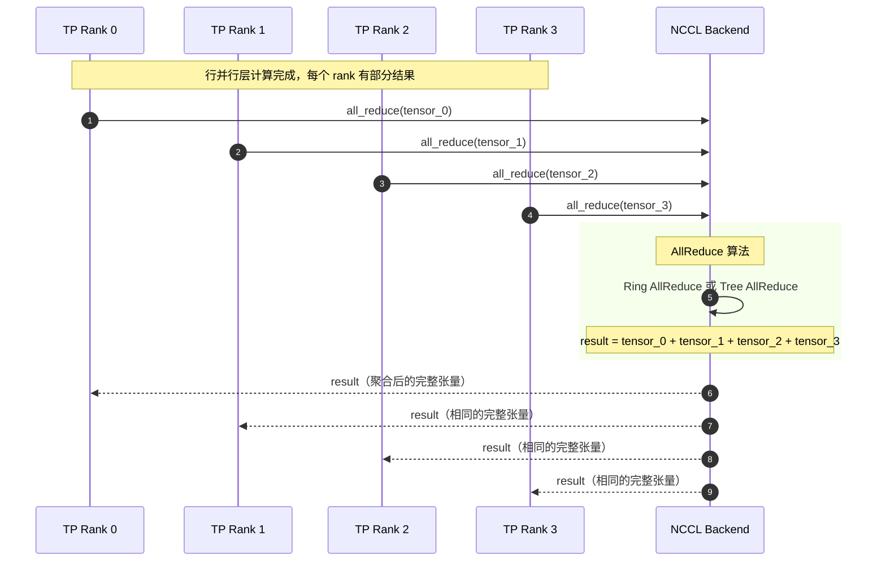
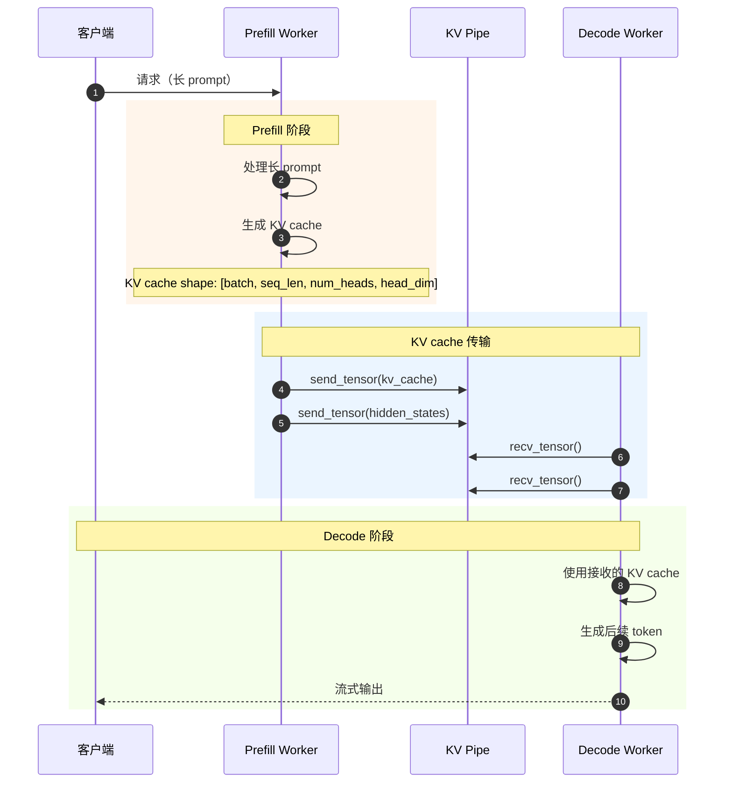
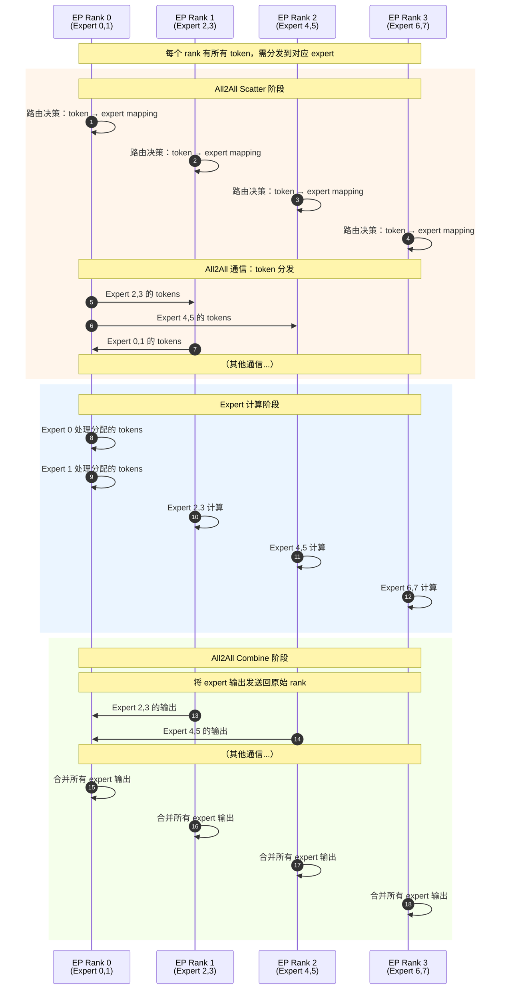

# vLLM-06-Distributed模块-API

## API 概览

Distributed 模块提供完整的分布式通信 API，支持多种并行策略：

| API 名称 | 类/接口 | 幂等性 | 作用 | 使用场景 |
|---------|---------|--------|------|---------|
| `tensor_model_parallel_all_reduce` | 函数 | 否 | TP AllReduce 通信 | 模型并行计算 |
| `tensor_model_parallel_all_gather` | 函数 | 否 | TP AllGather 通信 | 权重收集 |
| `tensor_model_parallel_reduce_scatter` | 函数 | 否 | TP ReduceScatter 通信 | 梯度分发 |
| `broadcast_tensor_dict` | 函数 | 否 | 字典广播 | 配置/状态同步 |
| **DeviceCommunicator** | 抽象基类 | - | 设备特定通信 | 硬件优化 |
| **KVPipe** | 抽象接口 | - | KV cache 传输 | 分离式 Prefill |
| **All2AllManager** | 管理器 | - | Expert 并行通信 | MoE 模型 |

---

## 核心通信 API

### 1. tensor_model_parallel_all_reduce

#### 基本信息
- **名称**：`tensor_model_parallel_all_reduce`
- **协议/方法**：函数接口
- **幂等性**：否（通信操作）
- **返回值**：`torch.Tensor`

#### 请求结构体

```python
def tensor_model_parallel_all_reduce(input_: torch.Tensor) -> torch.Tensor:
    """在模型并行组内进行 AllReduce 操作"""
```

**参数说明表**：

| 字段 | 类型 | 必填 | 说明 |
|------|------|------|------|
| input_ | torch.Tensor | ✓ | 输入张量，在所有 TP rank 间求和 |

#### 入口函数与关键代码

```python
def tensor_model_parallel_all_reduce(input_: torch.Tensor) -> torch.Tensor:
    """在模型并行组内进行 AllReduce 操作
    
    用途：
    - 行并行层（如 Attention output、FFN down projection）的输出聚合
    - 将分片计算结果合并为完整结果
    
    通信模式：所有 TP rank 参与，结果在所有 rank 上相同
    """
    # 1. 获取 TP 通信组
    tp_group = get_tp_group()
    
    # 2. 执行 AllReduce 操作
    return tp_group.all_reduce(input_)
```

**底层实现**：

```python
class DeviceCommunicatorBase:
    def all_reduce(self, input_: torch.Tensor) -> torch.Tensor:
        # 标准 PyTorch 分布式 AllReduce
        torch.distributed.all_reduce(input_, group=self.device_group)
        return input_
```

#### 使用场景与时序图



#### 性能特征

- **通信量**：每个 rank 发送和接收 tensor_size 数据
- **时间复杂度**：O(N * tensor_size / bandwidth)，N = TP_size
- **带宽利用率**：接近理论峰值（Ring AllReduce）
- **典型延迟**：0.1-2 ms（取决于张量大小和网络）

---

### 2. tensor_model_parallel_all_gather

#### 基本信息
- **名称**：`tensor_model_parallel_all_gather`
- **协议/方法**：函数接口
- **幂等性**：否
- **返回值**：`torch.Tensor`（拼接后的完整张量）

#### 请求结构体

```python
def tensor_model_parallel_all_gather(
    input_: torch.Tensor,
    dim: int = -1
) -> torch.Tensor:
    """在模型并行组内进行 AllGather 操作"""
```

**参数说明表**：

| 字段 | 类型 | 必填 | 默认值 | 说明 |
|------|------|------|--------|------|
| input_ | torch.Tensor | ✓ | - | 输入张量（每个 rank 的分片） |
| dim | int | ✗ | -1 | 拼接维度 |

#### 入口函数与关键代码

```python
def tensor_model_parallel_all_gather(
    input_: torch.Tensor,
    dim: int = -1
) -> torch.Tensor:
    """在模型并行组内进行 AllGather 操作
    
    用途：
    - 列并行层（如 QKV projection、FFN up projection）收集分片权重
    - 将每个 rank 的部分结果拼接为完整张量
    
    通信模式：每个 rank 贡献一个分片，接收所有分片的拼接
    """
    # 1. 获取 TP 通信组
    tp_group = get_tp_group()
    
    # 2. 执行 AllGather 操作
    return tp_group.all_gather(input_, dim)
```

**底层实现示例**：

```python
class DeviceCommunicatorBase:
    def all_gather(self, input_: torch.Tensor, dim: int = -1) -> torch.Tensor:
        world_size = self.world_size
        
        # 1. 准备输出张量
        gather_list = [torch.empty_like(input_) for _ in range(world_size)]
        
        # 2. 执行 AllGather
        torch.distributed.all_gather(gather_list, input_, group=self.device_group)
        
        # 3. 拼接结果
        return torch.cat(gather_list, dim=dim)
```

#### 使用场景

**QKV Projection AllGather**：
```python
# 每个 TP rank 计算部分 QKV
# Rank 0: Q[:, :head_dim], K[:, :head_dim], V[:, :head_dim]
# Rank 1: Q[:, head_dim:2*head_dim], K[:, head_dim:2*head_dim], V[:, head_dim:2*head_dim]
# ...

qkv_output = self.qkv_proj(hidden_states)  # 分片输出
full_qkv = tensor_model_parallel_all_gather(qkv_output, dim=-1)  # 收集完整 QKV
```

---

### 3. tensor_model_parallel_reduce_scatter

#### 基本信息
- **名称**：`tensor_model_parallel_reduce_scatter`
- **协议/方法**：函数接口
- **幂等性**：否
- **返回值**：`torch.Tensor`（每个 rank 的分片结果）

#### 请求结构体

```python
def tensor_model_parallel_reduce_scatter(
    input_: torch.Tensor,
    dim: int = -1
) -> torch.Tensor:
    """在模型并行组内进行 ReduceScatter 操作"""
```

#### 入口函数与关键代码

```python
def tensor_model_parallel_reduce_scatter(
    input_: torch.Tensor,
    dim: int = -1
) -> torch.Tensor:
    """在模型并行组内进行 ReduceScatter 操作
    
    用途：
    - 将完整张量按维度分片并在每个分片上求和
    - 梯度反向传播中的分布式计算
    
    通信模式：输入完整张量，输出每个 rank 负责的分片
    """
    # 1. 获取 TP 通信组
    tp_group = get_tp_group()
    
    # 2. 执行 ReduceScatter 操作
    return tp_group.reduce_scatter(input_, dim)
```

**算法示例**：
```python
# 输入：每个 rank 都有完整的 [batch_size, hidden_size] 张量
# 输出：每个 rank 得到 [batch_size, hidden_size/tp_size] 的分片

# Rank 0 得到：input_[:, :hidden_size//tp_size] 的所有 rank 求和
# Rank 1 得到：input_[:, hidden_size//tp_size:2*hidden_size//tp_size] 的所有 rank 求和
```

---

### 4. broadcast_tensor_dict

#### 基本信息
- **名称**：`broadcast_tensor_dict`
- **协议/方法**：函数接口
- **幂等性**：否
- **返回值**：`dict[Any, Union[torch.Tensor, Any]]`

#### 请求结构体

```python
def broadcast_tensor_dict(
    tensor_dict: Optional[dict[Any, Union[torch.Tensor, Any]]] = None,
    src: int = 0
) -> dict:
    """广播张量字典到所有 rank"""
```

**参数说明表**：

| 字段 | 类型 | 必填 | 默认值 | 说明 |
|------|------|------|--------|------|
| tensor_dict | dict | ✗ | None | 要广播的字典（仅 src rank 需要） |
| src | int | ✗ | 0 | 源 rank ID |

#### 入口函数与关键代码

```python
def broadcast_tensor_dict(
    tensor_dict: Optional[dict[Any, Union[torch.Tensor, Any]]] = None,
    src: int = 0
):
    """广播张量字典到所有 rank
    
    用途：
    - 模型权重广播
    - 配置参数同步
    - 状态信息分发
    """
    # 1. 检查分布式环境
    if not torch.distributed.is_initialized():
        return tensor_dict
    
    # 2. 获取 TP 通信组
    tp_group = get_tp_group()
    
    # 3. 执行字典广播
    return tp_group.broadcast_tensor_dict(tensor_dict, src)
```

**使用场景**：
```python
# Rank 0 加载模型权重
if rank == 0:
    model_weights = {
        "layer1.weight": torch.load("layer1.pt"),
        "layer1.bias": torch.load("layer1_bias.pt"),
        # ... more weights
    }
else:
    model_weights = None

# 广播到所有 rank
model_weights = broadcast_tensor_dict(model_weights, src=0)
```

---

## 设备通信器 API

### DeviceCommunicatorBase

#### 基本信息

**用途**：设备特定通信的抽象基类，支持不同硬件的优化实现。

#### 核心方法

```python
class DeviceCommunicatorBase:
    def __init__(
        self,
        cpu_group: ProcessGroup,
        device: Optional[torch.device] = None,
        device_group: Optional[ProcessGroup] = None,
        unique_name: str = "",
    ):
        """初始化设备通信器"""
        self.device = device or torch.device("cpu")
        self.cpu_group = cpu_group
        self.device_group = device_group
        self.rank = torch.distributed.get_rank(cpu_group)
        self.world_size = torch.distributed.get_world_size(cpu_group)
    
    def all_reduce(self, input_: torch.Tensor) -> torch.Tensor:
        """AllReduce 操作"""
        torch.distributed.all_reduce(input_, group=self.device_group)
        return input_
    
    def all_gather(self, input_: torch.Tensor, dim: int = -1) -> torch.Tensor:
        """AllGather 操作"""
        # 实现细节...
    
    def reduce_scatter(self, input_: torch.Tensor, dim: int = -1) -> torch.Tensor:
        """ReduceScatter 操作"""
        # 实现细节...
```

#### 设备特定实现

**CUDA Communicator**：
```python
class CudaCommunicator(DeviceCommunicatorBase):
    def __init__(self, *args, **kwargs):
        super().__init__(*args, **kwargs)
        # NCCL 后端优化
        self.nccl_backend = True
    
    def all_reduce(self, input_: torch.Tensor) -> torch.Tensor:
        # 使用 NCCL 优化的 AllReduce
        return super().all_reduce(input_)
```

**CPU Communicator**：
```python
class CpuCommunicator(DeviceCommunicatorBase):
    def __init__(self, *args, **kwargs):
        super().__init__(*args, **kwargs)
        # Gloo 后端或共享内存优化
```

---

## KV Transfer API

### KVPipeBase

#### 基本信息

**用途**：KV cache 分布式传输的抽象接口，支持分离式 Prefill。

#### 核心接口

```python
class KVPipeBase(ABC):
    """KV cache 传输管道抽象接口"""
    
    @abstractmethod
    def send_tensor(self, tensor: Optional[torch.Tensor]) -> None:
        """发送张量到管道"""
        pass
    
    @abstractmethod
    def recv_tensor(self) -> Optional[torch.Tensor]:
        """从管道接收张量"""
        pass
    
    @abstractmethod
    def close(self) -> None:
        """关闭管道"""
        pass
```

#### 实现示例

```python
class TCPKVPipe(KVPipeBase):
    """基于 TCP 的 KV cache 传输"""
    
    def __init__(self, host: str, port: int):
        self.socket = socket.socket(socket.AF_INET, socket.SOCK_STREAM)
        self.socket.connect((host, port))
    
    def send_tensor(self, tensor: Optional[torch.Tensor]) -> None:
        if tensor is None:
            # 发送 None 标记
            self.socket.sendall(b"NONE")
        else:
            # 序列化并发送张量
            tensor_bytes = tensor.cpu().numpy().tobytes()
            header = f"{tensor.shape}:{tensor.dtype}:{len(tensor_bytes)}".encode()
            self.socket.sendall(header + b"\n" + tensor_bytes)
    
    def recv_tensor(self) -> Optional[torch.Tensor]:
        # 接收并反序列化张量
        data = self.socket.recv(4096)
        if data == b"NONE":
            return None
        # 解析 header 和 tensor data...
```

### 分离式 Prefill 时序图



---

## Expert 并行 API

### All2AllManager

#### 基本信息

**用途**：管理 MoE（Mixture of Experts）模型中的 Expert 并行通信。

#### 核心接口

```python
class All2AllManagerBase(ABC):
    """Expert 并行 All2All 通信管理器"""
    
    @abstractmethod
    def scatter(
        self,
        input_: torch.Tensor,
        expert_capacity: int,
        is_sequence_parallel: bool = False
    ) -> torch.Tensor:
        """将 token 分发到对应的 expert"""
        pass
    
    @abstractmethod
    def combine(
        self,
        hidden_states: torch.Tensor,
        is_sequence_parallel: bool = False
    ) -> torch.Tensor:
        """合并各 expert 的输出"""
        pass
```

#### Expert 并行时序图



---

## 自定义 AllReduce 优化 API

### CustomAllReduceOp

vLLM 实现了自定义的 AllReduce 算子以优化小张量通信：

```python
def custom_all_reduce(
    input_: torch.Tensor,
    use_custom: bool = True
) -> torch.Tensor:
    """自定义优化的 AllReduce"""
    
    if not use_custom or input_.numel() > CUSTOM_ALLREDUCE_THRESHOLD:
        # 大张量使用标准 NCCL
        return tensor_model_parallel_all_reduce(input_)
    
    # 小张量使用自定义实现
    return _custom_all_reduce_kernel(input_)

def _custom_all_reduce_kernel(input_: torch.Tensor) -> torch.Tensor:
    """自定义 AllReduce kernel
    
    优化：
    1. 减少 kernel launch 开销
    2. 融合多个小张量
    3. 使用共享内存优化
    """
    # 具体实现...
```

---

## 使用示例

### 示例 1：基本 TP 通信

```python
import torch
from vllm.distributed import (
    tensor_model_parallel_all_reduce,
    tensor_model_parallel_all_gather,
)

# 列并行层（如 QKV projection）
class ColumnParallelLinear(nn.Module):
    def forward(self, x):
        # 每个 TP rank 计算部分输出
        output = F.linear(x, self.weight, self.bias)
        
        # AllGather 收集所有分片
        return tensor_model_parallel_all_gather(output, dim=-1)

# 行并行层（如 Attention output）
class RowParallelLinear(nn.Module):
    def forward(self, x):
        # 每个 TP rank 计算部分输出
        output = F.linear(x, self.weight, self.bias)
        
        # AllReduce 聚合结果
        return tensor_model_parallel_all_reduce(output)
```

### 示例 2：配置同步

```python
# Rank 0 加载配置
if torch.distributed.get_rank() == 0:
    config_dict = {
        "max_seq_len": 4096,
        "hidden_size": 4096,
        "model_weights": model.state_dict(),
    }
else:
    config_dict = None

# 广播配置到所有 rank
config_dict = broadcast_tensor_dict(config_dict, src=0)

# 所有 rank 现在都有相同的配置
max_seq_len = config_dict["max_seq_len"]
```

### 示例 3：分离式 Prefill

```python
# Prefill Worker
kv_pipe = TCPKVPipe("decode_worker_host", 8080)

# 处理长 prompt
hidden_states = model.forward_prefill(input_ids)
kv_cache = model.get_kv_cache()

# 发送到 Decode Worker
kv_pipe.send_tensor(kv_cache)
kv_pipe.send_tensor(hidden_states)

# Decode Worker
kv_pipe = TCPKVPipe("localhost", 8080)

# 接收来自 Prefill Worker 的 KV cache
kv_cache = kv_pipe.recv_tensor()
hidden_states = kv_pipe.recv_tensor()

# 使用接收的 KV cache 进行 decode
output = model.forward_decode(new_token_ids, kv_cache, hidden_states)
```

---

## 性能对比

| 通信原语 | 延迟 (μs) | 带宽利用率 | 适用场景 |
|---------|-----------|------------|----------|
| AllReduce | 50-500 | 95%+ | 行并行层输出聚合 |
| AllGather | 30-300 | 90%+ | 列并行层权重收集 |
| ReduceScatter | 40-400 | 90%+ | 梯度分布式计算 |
| Broadcast | 20-200 | 80%+ | 配置/权重分发 |
| All2All | 100-1000 | 85% | Expert 并行 |
| Custom AllReduce | 10-50 | 70% | 小张量优化 |

---

## 总结

Distributed 模块提供了完整的分布式通信 API：

1. **基础通信原语**：AllReduce、AllGather、ReduceScatter、Broadcast
2. **设备特定优化**：CUDA/CPU/Ray 等不同后端实现  
3. **高级功能**：KV cache 传输、Expert 并行、自定义优化
4. **易用接口**：简单的函数调用，隐藏复杂的分布式细节

核心设计理念：
- **性能优化**：针对不同场景的专门优化
- **硬件抽象**：统一的接口支持多种硬件
- **可扩展性**：模块化设计易于扩展新功能
- **易用性**：简洁的 API 隐藏分布式复杂性
