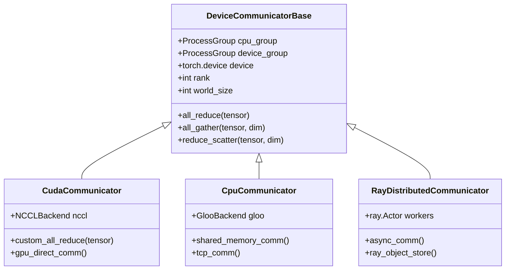
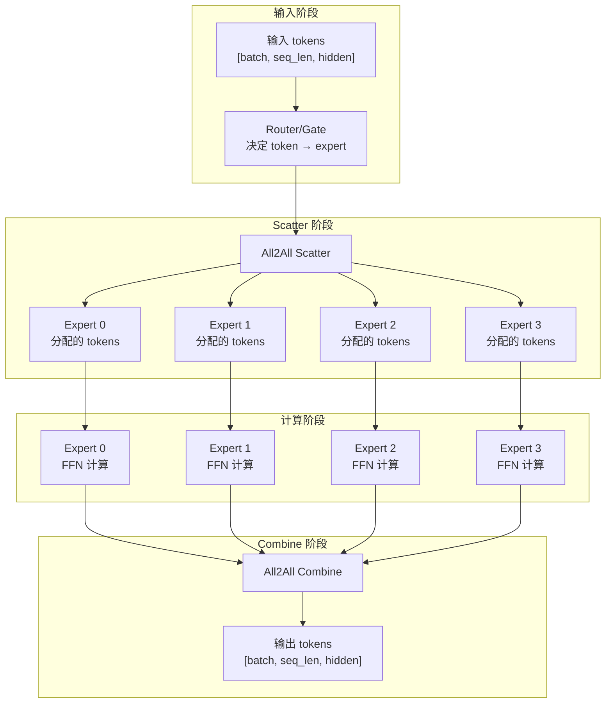
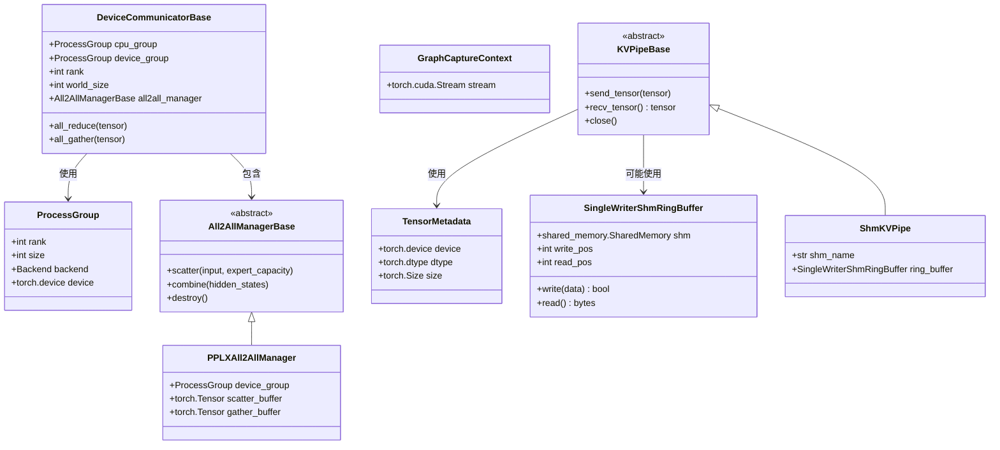

# vLLM-06-Distributed模块-数据结构

## 核心数据结构列表

Distributed 模块包含以下核心数据结构：

| 数据结构 | 类型 | 用途 | 更新时机 | 文件位置 |
|---------|------|------|---------|---------|
| `ProcessGroup` | PyTorch 类 | 通信组管理 | 分布式初始化时 | torch.distributed |
| `DeviceCommunicatorBase` | 抽象基类 | 设备通信抽象 | 通信器创建时 | device_communicators/base.py |
| `TensorMetadata` | namedtuple | 张量元数据 | 通信时 | parallel_state.py |
| `GraphCaptureContext` | dataclass | CUDA 图捕获上下文 | 图捕获时 | parallel_state.py |
| `All2AllManagerBase` | 抽象基类 | Expert 并行管理 | MoE 初始化时 | device_communicators/base.py |
| `KVPipeBase` | 抽象接口 | KV cache 传输 | 分离式 Prefill 时 | kv_transfer/kv_pipe/base.py |
| `SingleWriterShmRingBuffer` | 类 | 共享内存环形缓冲区 | 跨进程通信时 | shm_object_storage.py |

---

## 数据结构详细说明

### 1. ProcessGroup

#### 基本信息

**用途**：PyTorch 分布式通信组，定义参与通信的进程集合。

**定义**（PyTorch 内置）：

```python
# PyTorch 分布式进程组（内置类）
class ProcessGroup:
    """分布式进程组
    
    vLLM 中的用途：
    - TP group: Tensor Parallel 通信组
    - PP group: Pipeline Parallel 通信组  
    - DP group: Data Parallel 通信组
    - EP group: Expert Parallel 通信组
    """
    pass
```

#### vLLM 中的进程组层次结构

```python
# 全局进程组结构示例（8 个 GPU，TP=2, PP=2, DP=2）
GLOBAL_WORLD_SIZE = 8

# Tensor Parallel Groups (每 2 个 GPU 一组)
TP_GROUPS = [
    [0, 1],  # TP group 0
    [2, 3],  # TP group 1  
    [4, 5],  # TP group 2
    [6, 7],  # TP group 3
]

# Pipeline Parallel Groups (跨 TP group)
PP_GROUPS = [
    [0, 2],  # PP group 0 (stage 0 → stage 1)
    [1, 3],  # PP group 1
    [4, 6],  # PP group 2  
    [5, 7],  # PP group 3
]

# Data Parallel Groups
DP_GROUPS = [
    [0, 4],  # DP group 0
    [1, 5],  # DP group 1
    [2, 6],  # DP group 2
    [3, 7],  # DP group 3
]
```

#### 字段说明表

| 属性 | 类型 | 说明 |
|------|------|------|
| rank | int | 当前进程在组内的排序（0 到 size-1） |
| size | int | 组内进程总数 |
| backend | Backend | 通信后端（NCCL/Gloo/MPI） |
| device | torch.device | 通信设备（cuda:0/cpu） |

#### 进程组创建

```python
def initialize_model_parallel(
    tensor_model_parallel_size: int = 1,
    pipeline_model_parallel_size: int = 1,
    data_parallel_size: int = 1,
) -> None:
    """初始化模型并行组"""
    
    world_size = torch.distributed.get_world_size()
    rank = torch.distributed.get_rank()
    
    # 1. 创建 Tensor Parallel Groups
    for i in range(0, world_size, tensor_model_parallel_size):
        ranks = list(range(i, i + tensor_model_parallel_size))
        group = torch.distributed.new_group(ranks)
        if rank in ranks:
            _TP_GROUP = group
    
    # 2. 创建 Pipeline Parallel Groups
    for i in range(tensor_model_parallel_size):
        ranks = list(range(i, world_size, tensor_model_parallel_size))
        group = torch.distributed.new_group(ranks)
        if rank in ranks:
            _PP_GROUP = group
    
    # 3. 创建 Data Parallel Groups
    # （如果启用数据并行）
```

---

### 2. DeviceCommunicatorBase

#### 基本信息

**用途**：设备特定通信器的抽象基类，封装不同硬件的通信优化。

**定义**：

```python
class DeviceCommunicatorBase:
    """设备通信器基类"""
    
    def __init__(
        self,
        cpu_group: ProcessGroup,
        device: Optional[torch.device] = None,
        device_group: Optional[ProcessGroup] = None,
        unique_name: str = "",
    ):
        # 基本属性
        self.device = device or torch.device("cpu")
        self.cpu_group = cpu_group
        self.device_group = device_group
        self.unique_name = unique_name
        
        # 进程信息
        self.rank = torch.distributed.get_rank(cpu_group)
        self.world_size = torch.distributed.get_world_size(cpu_group)
        self.ranks = torch.distributed.get_process_group_ranks(cpu_group)
        self.global_rank = torch.distributed.get_rank()
        self.global_world_size = torch.distributed.get_world_size()
        
        # Expert Parallel 管理器
        self.is_ep_communicator = "ep" in unique_name
        self.use_all2all = self.is_ep_communicator and self._should_use_ep()
        self.all2all_manager: Optional[All2AllManagerBase] = None
```

#### 字段说明表

| 字段 | 类型 | 说明 |
|------|------|------|
| device | torch.device | 通信设备（cuda:0、cpu 等） |
| cpu_group | ProcessGroup | CPU 通信组（用于初始化） |
| device_group | ProcessGroup | 设备通信组（实际通信） |
| rank | int | 在通信组内的 rank |
| world_size | int | 通信组大小 |
| global_rank | int | 全局 rank |
| unique_name | str | 通信器唯一标识（如 "tp", "pp", "ep"） |
| all2all_manager | All2AllManagerBase | Expert 并行管理器 |

#### 设备特定实现层次



#### 通信器工厂模式

```python
def create_device_communicator(
    device_type: str,
    cpu_group: ProcessGroup,
    device_group: ProcessGroup,
) -> DeviceCommunicatorBase:
    """创建设备特定的通信器"""
    
    if device_type == "cuda":
        return CudaCommunicator(cpu_group, device_group)
    elif device_type == "cpu":
        return CpuCommunicator(cpu_group, device_group)
    elif device_type == "ray":
        return RayDistributedCommunicator(cpu_group, device_group)
    else:
        raise ValueError(f"Unsupported device type: {device_type}")
```

---

### 3. TensorMetadata

#### 基本信息

**用途**：张量元数据，用于分布式通信中的张量描述。

**定义**：

```python
TensorMetadata = namedtuple("TensorMetadata", ["device", "dtype", "size"])
```

#### 字段说明表

| 字段 | 类型 | 说明 |
|------|------|------|
| device | torch.device | 张量所在设备 |
| dtype | torch.dtype | 张量数据类型 |
| size | torch.Size | 张量形状 |

#### 使用场景

```python
def serialize_tensor_for_transmission(tensor: torch.Tensor) -> tuple:
    """序列化张量用于网络传输"""
    
    # 1. 提取元数据
    metadata = TensorMetadata(
        device=tensor.device,
        dtype=tensor.dtype,
        size=tensor.size()
    )
    
    # 2. 转换为字节数据
    tensor_bytes = tensor.cpu().numpy().tobytes()
    
    return metadata, tensor_bytes

def deserialize_tensor_from_transmission(
    metadata: TensorMetadata,
    tensor_bytes: bytes
) -> torch.Tensor:
    """从网络传输数据反序列化张量"""
    
    # 1. 从字节重建 numpy 数组
    np_array = np.frombuffer(tensor_bytes, dtype=metadata.dtype.numpy_dtype)
    np_array = np_array.reshape(metadata.size)
    
    # 2. 转换为 PyTorch 张量
    tensor = torch.from_numpy(np_array)
    
    # 3. 移动到目标设备
    return tensor.to(metadata.device)
```

---

### 4. GraphCaptureContext

#### 基本信息

**用途**：CUDA 图捕获的上下文信息，用于分布式环境下的图优化。

**定义**：

```python
@dataclass
class GraphCaptureContext:
    """CUDA 图捕获上下文"""
    stream: torch.cuda.Stream
```

#### 字段说明表

| 字段 | 类型 | 说明 |
|------|------|------|
| stream | torch.cuda.Stream | CUDA 流，用于同步图执行 |

#### 使用场景

```python
def capture_distributed_graph(
    model_callable: Callable,
    sample_input: torch.Tensor,
    tp_group: ProcessGroup,
) -> torch.cuda.CUDAGraph:
    """捕获包含分布式通信的 CUDA 图"""
    
    # 1. 创建捕获上下文
    stream = torch.cuda.Stream()
    context = GraphCaptureContext(stream=stream)
    
    # 2. 预热运行（建立通信缓冲区）
    with torch.cuda.stream(stream):
        for _ in range(3):  # 预热次数
            output = model_callable(sample_input)
            torch.cuda.synchronize()
    
    # 3. 捕获计算图
    graph = torch.cuda.CUDAGraph()
    with torch.cuda.graph(graph, stream=stream):
        captured_output = model_callable(sample_input)
    
    return graph, captured_output
```

---

### 5. All2AllManagerBase

#### 基本信息

**用途**：Expert 并行（MoE）中 All2All 通信的管理器。

**定义**：

```python
class All2AllManagerBase(ABC):
    """Expert 并行 All2All 管理器基类"""
    
    @abstractmethod
    def scatter(
        self,
        input_: torch.Tensor,
        expert_capacity: int,
        is_sequence_parallel: bool = False,
    ) -> torch.Tensor:
        """将 token 分散到对应的 expert"""
        pass
    
    @abstractmethod  
    def combine(
        self,
        hidden_states: torch.Tensor,
        is_sequence_parallel: bool = False,
    ) -> torch.Tensor:
        """合并各 expert 的输出"""
        pass
    
    def destroy(self):
        """清理资源"""
        pass
```

#### 实现示例：PPLXAll2AllManager

```python
class PPLXAll2AllManager(All2AllManagerBase):
    """基于 PPLX 优化的 All2All 管理器"""
    
    def __init__(self, device_group: ProcessGroup):
        self.device_group = device_group
        self.world_size = torch.distributed.get_world_size(device_group)
        
        # 预分配通信缓冲区
        self.scatter_buffer = None
        self.gather_buffer = None
    
    def scatter(
        self,
        input_: torch.Tensor,
        expert_capacity: int,
        is_sequence_parallel: bool = False,
    ) -> torch.Tensor:
        """Token 到 Expert 的分发"""
        
        batch_size, seq_len, hidden_size = input_.shape
        
        # 1. 重塑为 [total_tokens, hidden_size]
        flat_input = input_.view(-1, hidden_size)
        
        # 2. 执行 All2All scatter
        if self.scatter_buffer is None:
            self.scatter_buffer = torch.empty_like(flat_input)
        
        torch.distributed.all_to_all_single(
            self.scatter_buffer,
            flat_input,
            group=self.device_group
        )
        
        return self.scatter_buffer
    
    def combine(
        self,
        hidden_states: torch.Tensor,
        is_sequence_parallel: bool = False,
    ) -> torch.Tensor:
        """Expert 输出的合并"""
        
        # 1. 执行 All2All gather
        if self.gather_buffer is None:
            self.gather_buffer = torch.empty_like(hidden_states)
        
        torch.distributed.all_to_all_single(
            self.gather_buffer,
            hidden_states,
            group=self.device_group
        )
        
        return self.gather_buffer
```

#### Expert 并行数据流



---

### 6. KVPipeBase

#### 基本信息

**用途**：KV cache 分布式传输的管道抽象，用于分离式 Prefill。

**定义**：

```python
class KVPipeBase(ABC):
    """KV cache 传输管道接口"""
    
    @abstractmethod
    def send_tensor(self, tensor: Optional[torch.Tensor]) -> None:
        """发送张量到管道
        
        Args:
            tensor: 要发送的张量，可以是 None（用于错误处理）
        """
        raise NotImplementedError
    
    @abstractmethod
    def recv_tensor(self) -> Optional[torch.Tensor]:
        """从管道接收张量
        
        Returns:
            接收到的张量，可能是 None
        """
        raise NotImplementedError
    
    @abstractmethod
    def close(self) -> None:
        """关闭管道，清理资源"""
        raise NotImplementedError
```

#### 实现示例：共享内存管道

```python
class ShmKVPipe(KVPipeBase):
    """基于共享内存的 KV cache 传输管道"""
    
    def __init__(self, shm_name: str, buffer_size: int):
        self.shm_name = shm_name
        self.buffer_size = buffer_size
        
        # 创建共享内存区域
        try:
            self.shm = shared_memory.SharedMemory(name=shm_name)
        except FileNotFoundError:
            self.shm = shared_memory.SharedMemory(
                name=shm_name, create=True, size=buffer_size
            )
        
        # 环形缓冲区管理
        self.ring_buffer = SingleWriterShmRingBuffer(self.shm)
    
    def send_tensor(self, tensor: Optional[torch.Tensor]) -> None:
        if tensor is None:
            # 发送空标记
            self.ring_buffer.write(b"NULL_TENSOR")
        else:
            # 序列化张量
            tensor_data = self._serialize_tensor(tensor)
            self.ring_buffer.write(tensor_data)
    
    def recv_tensor(self) -> Optional[torch.Tensor]:
        # 从环形缓冲区读取
        data = self.ring_buffer.read()
        
        if data == b"NULL_TENSOR":
            return None
        
        return self._deserialize_tensor(data)
    
    def _serialize_tensor(self, tensor: torch.Tensor) -> bytes:
        """序列化张量为字节"""
        metadata = TensorMetadata(tensor.device, tensor.dtype, tensor.size())
        tensor_bytes = tensor.cpu().numpy().tobytes()
        
        # 简单的序列化格式：metadata + tensor_bytes
        import pickle
        return pickle.dumps((metadata, tensor_bytes))
    
    def _deserialize_tensor(self, data: bytes) -> torch.Tensor:
        """从字节反序列化张量"""
        import pickle
        metadata, tensor_bytes = pickle.loads(data)
        
        # 重建张量
        np_array = np.frombuffer(tensor_bytes, dtype=metadata.dtype.numpy_dtype)
        np_array = np_array.reshape(metadata.size)
        tensor = torch.from_numpy(np_array)
        
        return tensor.to(metadata.device)
```

---

### 7. SingleWriterShmRingBuffer

#### 基本信息

**用途**：单写者多读者的共享内存环形缓冲区，用于跨进程高效通信。

**定义**：

```python
class SingleWriterShmRingBuffer:
    """单写者共享内存环形缓冲区"""
    
    def __init__(self, shm: shared_memory.SharedMemory):
        self.shm = shm
        self.buffer = np.ndarray(
            (len(shm.buf),), dtype=np.uint8, buffer=shm.buf
        )
        
        # 环形缓冲区状态（存储在共享内存开头）
        self.header_size = 32  # 头部大小（字节）
        self.write_pos = 0     # 写指针
        self.read_pos = 0      # 读指针
        self.data_size = len(shm.buf) - self.header_size
        
        # 从共享内存加载状态
        self._load_state()
    
    def write(self, data: bytes) -> bool:
        """写入数据到环形缓冲区"""
        data_len = len(data)
        
        # 检查空间是否足够
        if not self._has_space(data_len + 4):  # +4 for length prefix
            return False
        
        # 写入长度前缀
        self._write_int(data_len)
        
        # 写入数据
        for byte in data:
            self.buffer[self.header_size + self.write_pos] = byte
            self.write_pos = (self.write_pos + 1) % self.data_size
        
        self._save_state()
        return True
    
    def read(self) -> Optional[bytes]:
        """从环形缓冲区读取数据"""
        if self.read_pos == self.write_pos:
            return None  # 缓冲区为空
        
        # 读取长度前缀
        data_len = self._read_int()
        if data_len == 0:
            return None
        
        # 读取数据
        data = bytearray(data_len)
        for i in range(data_len):
            data[i] = self.buffer[self.header_size + self.read_pos]
            self.read_pos = (self.read_pos + 1) % self.data_size
        
        self._save_state()
        return bytes(data)
    
    def _has_space(self, size: int) -> bool:
        """检查是否有足够空间"""
        used_space = (self.write_pos - self.read_pos) % self.data_size
        available_space = self.data_size - used_space - 1  # -1 to avoid full==empty
        return available_space >= size
    
    def _write_int(self, value: int) -> None:
        """写入 4 字节整数"""
        for i in range(4):
            self.buffer[self.header_size + self.write_pos] = (value >> (i * 8)) & 0xFF
            self.write_pos = (self.write_pos + 1) % self.data_size
    
    def _read_int(self) -> int:
        """读取 4 字节整数"""
        value = 0
        for i in range(4):
            byte_val = self.buffer[self.header_size + self.read_pos]
            value |= byte_val << (i * 8)
            self.read_pos = (self.read_pos + 1) % self.data_size
        return value
```

---

## 数据结构关系图（类图）



---

## 通信拓扑数据结构

### 进程组拓扑

```python
@dataclass
class ParallelTopology:
    """并行拓扑结构"""
    
    # 全局信息
    world_size: int
    global_rank: int
    
    # TP 信息
    tp_size: int
    tp_rank: int
    tp_group: ProcessGroup
    
    # PP 信息  
    pp_size: int
    pp_rank: int
    pp_group: ProcessGroup
    
    # DP 信息
    dp_size: int
    dp_rank: int
    dp_group: ProcessGroup
    
    # EP 信息（可选）
    ep_size: Optional[int] = None
    ep_rank: Optional[int] = None
    ep_group: Optional[ProcessGroup] = None
    
    def get_coordinate(self) -> tuple[int, int, int]:
        """获取在 3D 拓扑中的坐标 (dp, pp, tp)"""
        return (self.dp_rank, self.pp_rank, self.tp_rank)
    
    def get_neighbor_ranks(self, dim: str) -> list[int]:
        """获取指定维度的邻居 rank"""
        if dim == "tp":
            return torch.distributed.get_process_group_ranks(self.tp_group)
        elif dim == "pp":
            return torch.distributed.get_process_group_ranks(self.pp_group)
        elif dim == "dp":
            return torch.distributed.get_process_group_ranks(self.dp_group)
        else:
            raise ValueError(f"Unknown dimension: {dim}")
```

### 通信模式枚举

```python
from enum import Enum

class CommunicationPattern(Enum):
    """通信模式枚举"""
    
    # 基本集合通信
    ALL_REDUCE = "all_reduce"           # 所有进程参与，结果相同
    ALL_GATHER = "all_gather"           # 所有进程参与，收集所有数据
    REDUCE_SCATTER = "reduce_scatter"   # 分发聚合结果
    BROADCAST = "broadcast"             # 一对多广播
    
    # 点对点通信
    SEND_RECV = "send_recv"            # 点对点发送接收
    
    # 高级通信
    ALL_TO_ALL = "all_to_all"          # Expert 并行
    PIPELINE = "pipeline"               # Pipeline 并行
    
    # 自定义优化
    CUSTOM_ALL_REDUCE = "custom_all_reduce"  # vLLM 优化版本

class CommunicationBackend(Enum):
    """通信后端枚举"""
    
    NCCL = "nccl"        # NVIDIA GPU
    GLOO = "gloo"        # CPU/通用
    MPI = "mpi"          # 高性能计算
    UCC = "ucc"          # 统一通信
    CUSTOM = "custom"    # vLLM 自定义
```

---

## 内存布局和对齐

### 通信缓冲区布局

```python
@dataclass
class CommunicationBuffer:
    """通信缓冲区管理"""
    
    # 缓冲区信息
    buffer: torch.Tensor
    size: int
    alignment: int  # 内存对齐（通常 128 字节）
    
    # 使用状态
    allocated_size: int
    free_size: int
    
    def allocate(self, size: int) -> torch.Tensor:
        """从缓冲区分配内存"""
        if self.free_size < size:
            raise RuntimeError("Buffer overflow")
        
        # 对齐分配
        aligned_size = (size + self.alignment - 1) // self.alignment * self.alignment
        
        start = self.allocated_size
        end = start + aligned_size
        
        self.allocated_size += aligned_size
        self.free_size -= aligned_size
        
        return self.buffer[start:end]
    
    def reset(self):
        """重置缓冲区"""
        self.allocated_size = 0
        self.free_size = self.size
```

---

## 性能指标数据结构

### 通信性能统计

```python
@dataclass
class CommunicationStats:
    """通信性能统计"""
    
    # 延迟统计（毫秒）
    avg_latency: float
    min_latency: float
    max_latency: float
    p95_latency: float
    p99_latency: float
    
    # 带宽统计（GB/s）
    avg_bandwidth: float
    peak_bandwidth: float
    
    # 通信次数
    call_count: int
    total_bytes: int
    
    # 错误统计
    timeout_count: int
    error_count: int
    
    def update(self, latency: float, bytes_transferred: int):
        """更新统计信息"""
        self.call_count += 1
        self.total_bytes += bytes_transferred
        
        # 更新延迟统计
        if self.call_count == 1:
            self.min_latency = self.max_latency = self.avg_latency = latency
        else:
            self.min_latency = min(self.min_latency, latency)
            self.max_latency = max(self.max_latency, latency)
            # 滑动平均
            alpha = 0.1
            self.avg_latency = alpha * latency + (1 - alpha) * self.avg_latency
        
        # 更新带宽
        bandwidth = bytes_transferred / (latency / 1000) / (1024**3)  # GB/s
        self.peak_bandwidth = max(self.peak_bandwidth, bandwidth)
        self.avg_bandwidth = alpha * bandwidth + (1 - alpha) * self.avg_bandwidth
```

---

## 总结

Distributed 模块的数据结构设计特点：

1. **层次化抽象**：从 ProcessGroup 到设备特定实现的清晰层次
2. **高性能优化**：环形缓冲区、内存对齐、缓冲区管理
3. **跨进程通信**：共享内存、网络传输、管道抽象
4. **可扩展性**：抽象接口支持新的通信后端和优化
5. **监控和调试**：性能统计、错误处理、状态跟踪

核心数据结构：
- **ProcessGroup**：PyTorch 分布式通信组，定义通信拓扑
- **DeviceCommunicatorBase**：设备通信抽象，支持多种硬件
- **All2AllManagerBase**：Expert 并行通信管理
- **KVPipeBase**：KV cache 传输管道抽象
- **SingleWriterShmRingBuffer**：高效的跨进程共享内存

通过合理的数据结构设计，Distributed 模块实现了高效、可扩展的分布式通信。
