# vLLM-06-Distributed模块-时序图

## 时序图概览

本文档展示 Distributed 模块在不同场景下的通信时序，涵盖：

| 场景 | 通信模式 | 参与方 | 关键特征 |
|------|----------|--------|----------|
| TP AllReduce | 集合通信 | 所有 TP rank | 行并行层聚合 |
| TP AllGather | 集合通信 | 所有 TP rank | 列并行层收集 |
| Expert 并行 | All2All | 所有 EP rank | MoE 模型通信 |
| 分离式 Prefill | 点对点 | Prefill ↔ Decode | KV cache 传输 |
| 分布式初始化 | 组播 | 所有 rank | 进程组建立 |
| Pipeline 并行 | 点对点 | 相邻 PP stage | 流水线传输 |

---

## 场景 1：Tensor 并行 AllReduce 通信

### 业务场景
行并行层（如 Attention Output、FFN Down Projection）的输出需要在所有 TP rank 之间聚合。

### 时序图

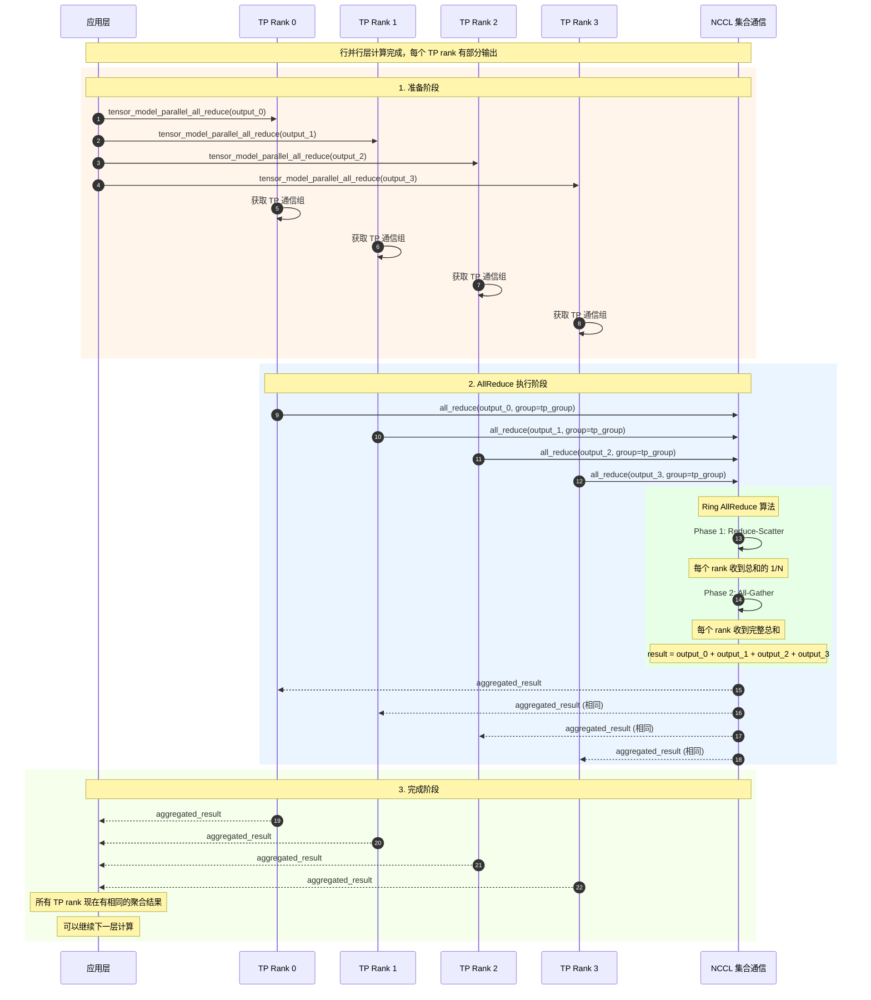

### 关键要点说明

1. **同步性**：所有 TP rank 必须同时调用 `all_reduce`，这是同步操作
2. **NCCL 优化**：使用 Ring AllReduce 算法，通信复杂度为 O(N)，带宽利用率接近最优
3. **内存效率**：原地操作，不需要额外内存分配
4. **错误处理**：如果任何 rank 失败，整个操作会超时并报错

### 性能特征

- **延迟**：10-100 μs（取决于张量大小）
- **带宽利用率**：90%+（NCCL 优化）
- **扩展性**：随 TP size 线性扩展

---

## 场景 2：Tensor 并行 AllGather 通信

### 业务场景
列并行层（如 QKV Projection、FFN Up Projection）需要收集所有 TP rank 的分片输出。

### 时序图

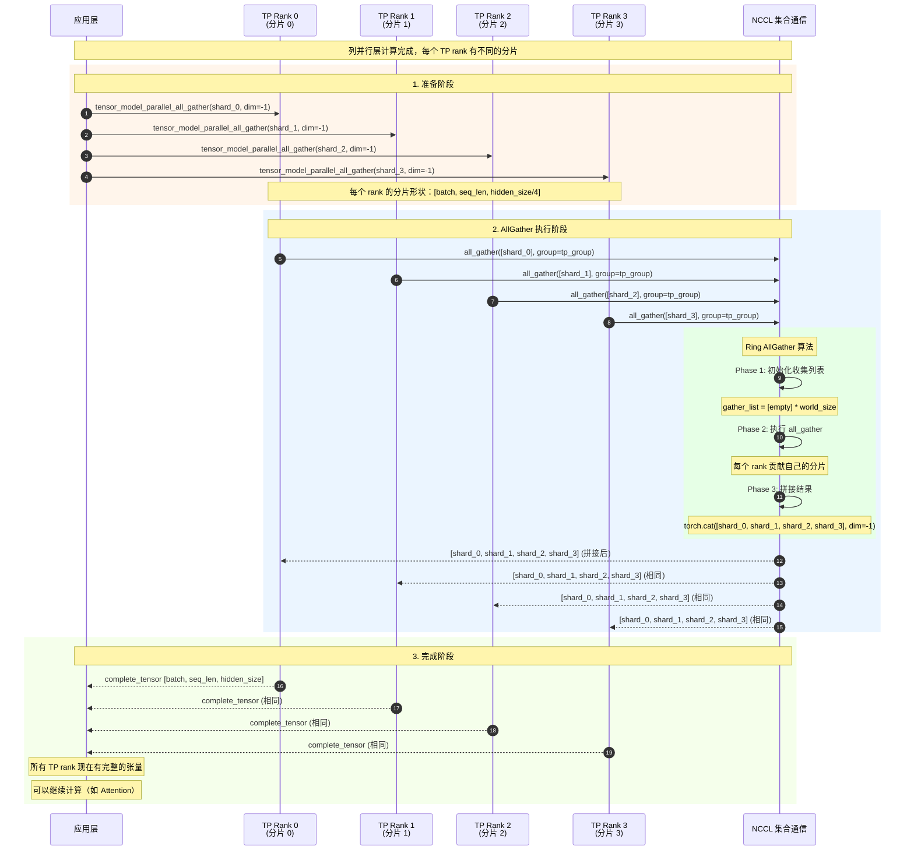

### QKV Projection 的具体示例

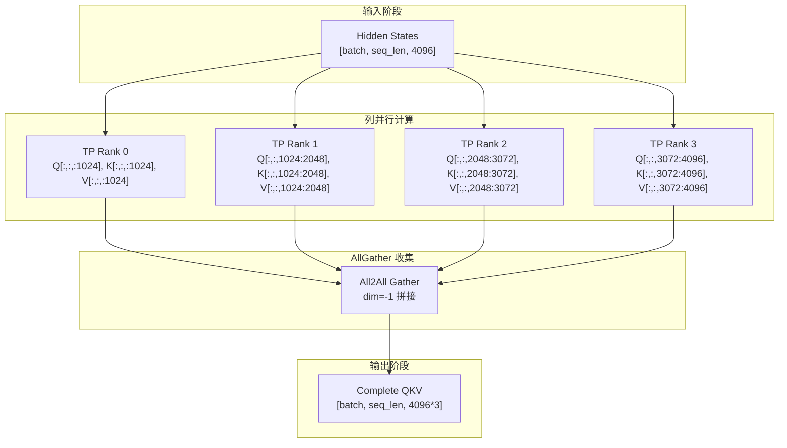

---

## 场景 3：Expert 并行 All2All 通信

### 业务场景
MoE（Mixture of Experts）模型中，token 需要根据路由决策分发到不同的 expert 进行计算。

### 时序图

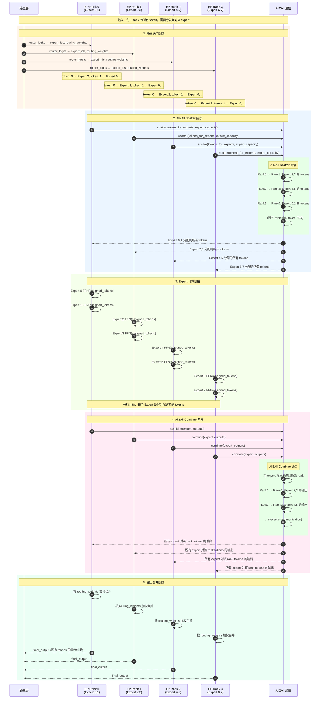

### Expert 路由决策详解

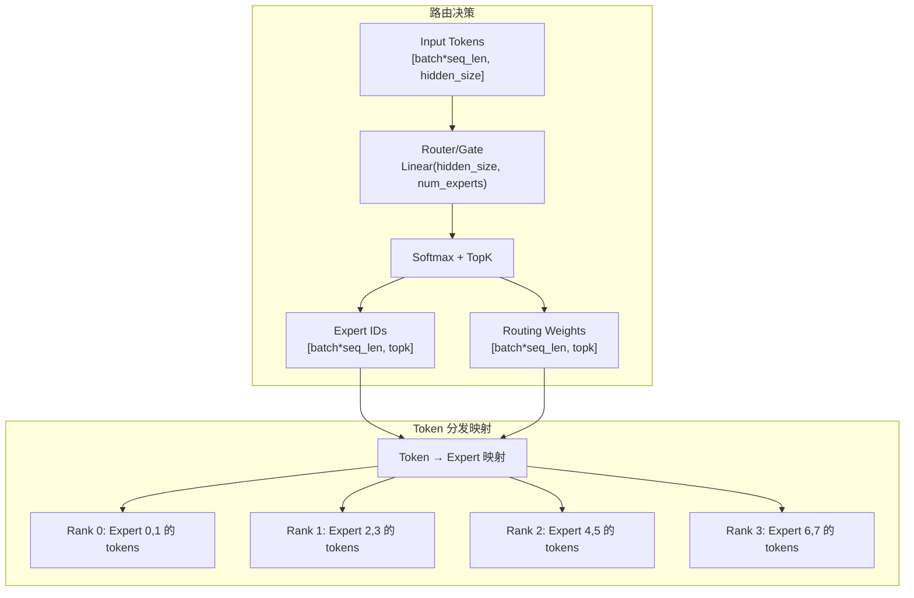

---

## 场景 4：分离式 Prefill KV Cache 传输

### 业务场景
在分离式架构中，Prefill Worker 处理长 prompt 并生成 KV cache，需要传输给 Decode Worker 进行后续 token 生成。

### 时序图

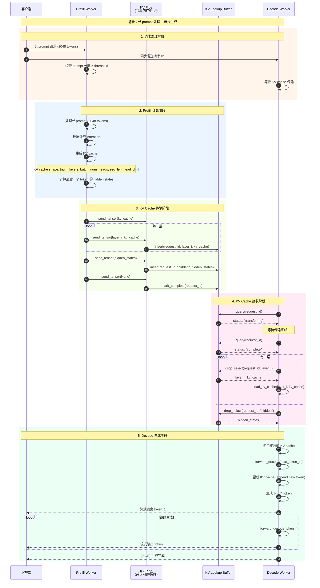

### KV Cache 传输详细流程

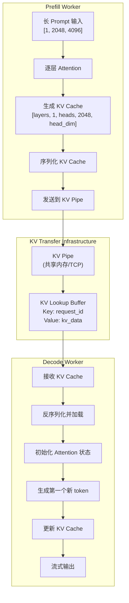

---

## 场景 5：分布式环境初始化

### 业务场景
vLLM 启动时需要初始化分布式环境，建立各种并行组。

### 时序图

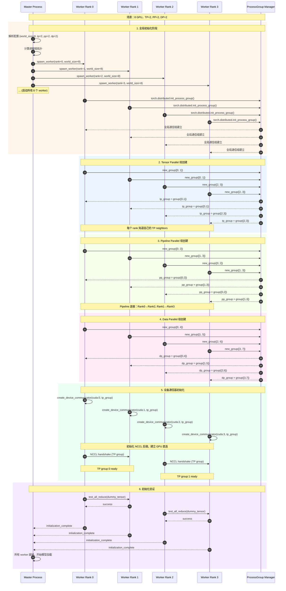

### 进程组拓扑图

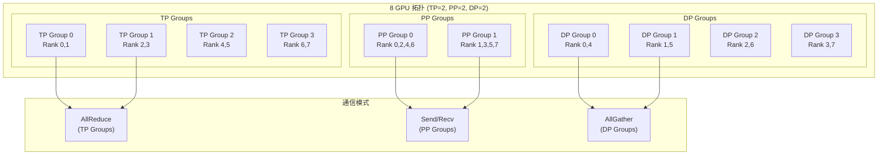

---

## 场景 6：Pipeline 并行通信

### 业务场景
Pipeline 并行中，不同 stage 之间需要传递中间激活值。

### 时序图

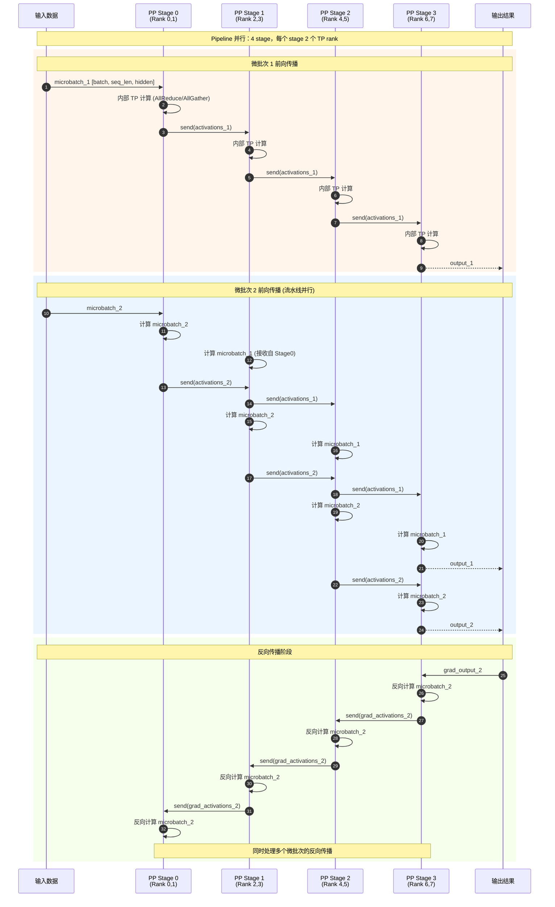

### Pipeline 调度详解

```mermaid
gantt
    title Pipeline 并行调度时序
    dateFormat X
    axisFormat %L
    
    section Stage 0
    MB1 Forward    :active, mb1f0, 0, 100
    MB2 Forward    :active, mb2f0, 100, 200
    MB3 Forward    :active, mb3f0, 200, 300
    MB1 Backward   :crit, mb1b0, 600, 700
    MB2 Backward   :crit, mb2b0, 700, 800
    
    section Stage 1
    MB1 Forward    :active, mb1f1, 100, 200
    MB2 Forward    :active, mb2f1, 200, 300
    MB3 Forward    :active, mb3f1, 300, 400
    MB1 Backward   :crit, mb1b1, 500, 600
    MB2 Backward   :crit, mb2b1, 600, 700
    
    section Stage 2
    MB1 Forward    :active, mb1f2, 200, 300
    MB2 Forward    :active, mb2f2, 300, 400
    MB3 Forward    :active, mb3f2, 400, 500
    MB1 Backward   :crit, mb1b2, 400, 500
    MB2 Backward   :crit, mb2b2, 500, 600
    
    section Stage 3
    MB1 Forward    :active, mb1f3, 300, 400
    MB2 Forward    :active, mb2f3, 400, 500
    MB3 Forward    :active, mb3f3, 500, 600
    MB1 Backward   :crit, mb1b3, 300, 400
    MB2 Backward   :crit, mb2b3, 400, 500
```

---

## 性能优化时序分析

### 通信与计算重叠

```mermaid
gantt
    title 通信计算重叠优化
    dateFormat X
    axisFormat %L
    
    section GPU 计算
    Layer 1 Compute    :active, l1c, 0, 100
    Layer 2 Compute    :active, l2c, 150, 250
    Layer 3 Compute    :active, l3c, 300, 400
    Layer 4 Compute    :active, l4c, 450, 550
    
    section TP 通信
    Layer 1 AllReduce  :crit, l1ar, 80, 130
    Layer 2 AllGather  :crit, l2ag, 230, 280
    Layer 3 AllReduce  :crit, l3ar, 380, 430
    Layer 4 AllGather  :crit, l4ag, 530, 580
    
    section 优化效果
    重叠计算          :done, overlap, 100, 500
    总体加速          :milestone, speedup, 580
```

---

## 错误处理时序

### 通信超时和恢复

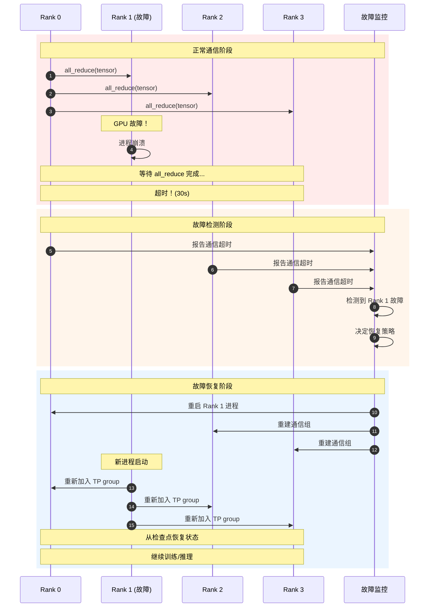

---

## 总结

Distributed 模块的时序图展示了：

1. **基础通信原语**：AllReduce、AllGather、All2All 的详细执行流程
2. **复杂场景**：Expert 并行、分离式 Prefill、Pipeline 并行的多方协调
3. **系统初始化**：分布式环境建立的完整过程
4. **性能优化**：通信计算重叠、故障恢复机制

**关键设计要点**：
- **同步协调**：确保所有参与方在正确时机执行通信
- **错误处理**：超时检测、故障恢复、状态一致性
- **性能优化**：重叠执行、缓冲区管理、算法选择
- **可扩展性**：支持不同规模和拓扑的分布式部署

通过这些时序图，可以深入理解 vLLM 分布式系统的运行机制和优化策略。
