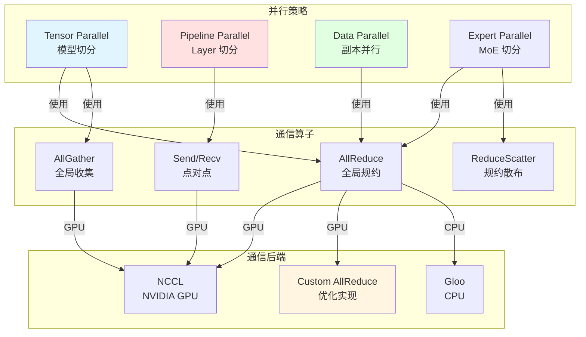
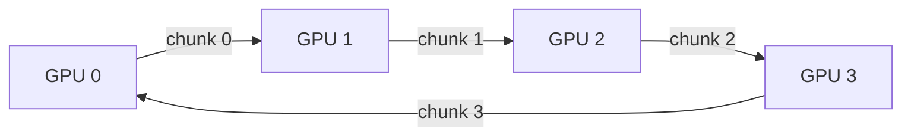
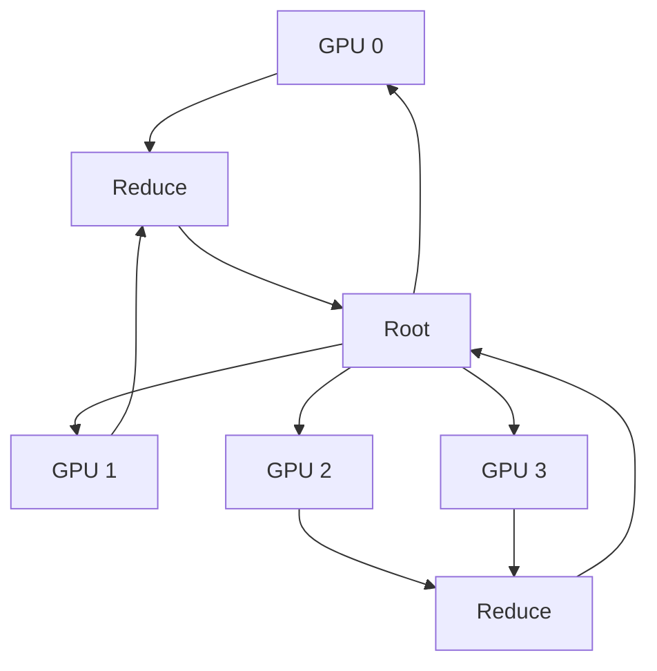

# vLLM-06-Distributed模块-概览

## 模块职责

Distributed 模块负责 vLLM 的分布式通信和并行策略实现，包括：

- 初始化分布式进程组（torch.distributed）
- 实现张量并行（Tensor Parallelism, TP）
- 实现流水线并行（Pipeline Parallelism, PP）
- 实现数据并行（Data Parallelism, DP）
- 实现专家并行（Expert Parallelism, EP，用于 MoE 模型）
- 提供高效的集合通信算子（AllReduce、AllGather、ReduceScatter 等）
- 实现自定义通信优化（Custom AllReduce）
- 支持多种通信后端（NCCL、Gloo）

## 输入与输出

### 输入
- **初始化参数**：world_size、rank、backend、master_addr、master_port
- **通信数据**：torch.Tensor（需要通信的张量）
- **并行配置**：ParallelConfig

### 输出
- **通信结果**：torch.Tensor（通信后的张量）
- **进程组**：torch.distributed.ProcessGroup

## 上下游依赖

### 上游（调用方）
- `ModelExecutor`：模型并行切分和通信
- `EngineCore`：数据并行同步
- `Worker`：设备间通信

### 下游（被调用）
- `torch.distributed`：PyTorch 分布式通信
- `NCCL`：NVIDIA 集合通信库
- `Custom CUDA kernels`：自定义高效通信实现

## 生命周期

### 初始化阶段
1. 设置环境变量（MASTER_ADDR、MASTER_PORT、WORLD_SIZE、RANK）
2. 初始化进程组（`torch.distributed.init_process_group`）
3. 创建并行状态（TP、PP、DP 的进程组）
4. （可选）初始化自定义 AllReduce

### 运行阶段
1. 模型前向传播时进行 TP/PP 通信
2. 梯度同步时进行 DP 通信（训练场景）
3. KV Cache 传输时进行设备间通信

### 关闭阶段
1. 销毁进程组（`torch.distributed.destroy_process_group`）
2. 清理通信资源

## 架构图



### 架构说明

#### 1. 图意概述
Distributed 模块实现四种并行策略（TP、PP、DP、EP），每种策略使用不同的集合通信算子，底层通过 NCCL/Gloo/Custom 后端执行实际通信。

#### 2. 关键接口

**初始化接口**：
- `initialize_model_parallel(tp_size, pp_size)`: 初始化模型并行
- `get_tensor_model_parallel_group()`: 获取 TP 进程组
- `get_pipeline_model_parallel_group()`: 获取 PP 进程组

**通信接口**：
- `tensor_model_parallel_all_reduce(tensor)`: TP AllReduce
- `tensor_model_parallel_all_gather(tensor)`: TP AllGather
- `broadcast(tensor, src)`: 广播

**状态查询**：
- `get_tensor_model_parallel_rank()`: 获取 TP rank
- `get_tensor_model_parallel_world_size()`: 获取 TP world size

#### 3. 边界（并发/超时/幂等/顺序）

**并发**：
- 集合通信是阻塞的（同步点）
- 点对点通信支持异步

**超时**：
- NCCL 默认超时：30 分钟
- 可通过 `NCCL_TIMEOUT_S` 环境变量配置

**幂等性**：
- 通信操作非幂等（每次产生新结果）

**顺序**：
- 集合通信要求所有 rank 按相同顺序调用

#### 4. 异常与回退

**异常类型**：
1. **通信超时**：NCCL timeout
2. **进程崩溃**：某个 rank 挂掉
3. **网络故障**：通信失败

**回退策略**：
- 通信失败通常无法恢复，需重启所有进程
- NCCL 错误会导致整个作业失败

#### 5. 性能与容量假设

**性能特征**：
- AllReduce 延迟：~100 µs（小张量），~1 ms（大张量）
- 带宽：接近理论带宽（NVLink：300 GB/s，IB：100 GB/s）
- 扩展性：TP 2-8 GPU 接近线性

**容量假设**：
- TP：最多 8 GPU（受 NVLink 限制）
- PP：理论无限，实际 2-16 stage
- DP：理论无限

#### 6. 版本兼容/演进

**V0 → V1 变更**：
- V1 简化了并行状态管理
- V1 支持更灵活的并行组合

**兼容性**：
- PyTorch ≥ 2.0
- NCCL ≥ 2.10

## 核心算法与流程

### Tensor Parallelism（张量并行）

**原理**：将模型参数按列或行切分到多个 GPU。

**实现**：

```python
# 列并行 Linear
class ColumnParallelLinear(nn.Module):
    def forward(self, input: torch.Tensor) -> torch.Tensor:
        # 1. input 在所有 TP rank 上相同（或已通过 AllGather 同步）
        # 2. 权重 W 按列切分：W = [W0, W1, ..., W_{tp-1}]
        # 3. 计算 output_parallel = input @ W_i（本地计算）
        output_parallel = F.linear(input, self.weight)
        
        # 4. （可选）根据需要进行 AllReduce 或延迟同步
        return output_parallel

# 行并行 Linear
class RowParallelLinear(nn.Module):
    def forward(self, input: torch.Tensor) -> torch.Tensor:
        # 1. input 已被切分（来自上层 ColumnParallel）
        # 2. 权重 W 按行切分：W = [W0; W1; ...; W_{tp-1}]
        # 3. 计算 output_parallel = input_i @ W_i（本地计算）
        output_parallel = F.linear(input, self.weight)
        
        # 4. AllReduce 汇总结果
        output = tensor_model_parallel_all_reduce(output_parallel)
        return output
```

**通信开销**：
- ColumnParallel：通常无通信（延迟到 RowParallel）
- RowParallel：一次 AllReduce（size = batch_size × seq_len × hidden_dim）

### Pipeline Parallelism（流水线并行）

**原理**：将模型层切分到多个 stage，每个 stage 在不同 GPU。

**实现**：

```python
# Stage 0 (Rank 0)
hidden_states = embedding(input_ids)
hidden_states = layers[0:4](hidden_states)
send(hidden_states, dst=1)  # 发送到 Stage 1

# Stage 1 (Rank 1)
hidden_states = recv(src=0)  # 接收来自 Stage 0
hidden_states = layers[4:8](hidden_states)
send(hidden_states, dst=2)  # 发送到 Stage 2

# Stage 2 (Rank 2)
hidden_states = recv(src=1)
hidden_states = layers[8:12](hidden_states)
logits = lm_head(hidden_states)
```

**通信开销**：
- 每个 micro-batch：PP_size - 1 次点对点通信
- Pipeline bubble：~(PP_size - 1) / num_micro_batches

### Data Parallelism（数据并行）

**原理**：每个 GPU 持有完整模型副本，处理不同数据。

**实现**：

```python
# 每个 DP rank 处理不同的请求
for dp_rank in range(dp_size):
    if rank == dp_rank:
        # 处理分配给本 rank 的请求
        outputs = model(inputs[dp_rank])
    
# （训练场景）梯度同步
# all_reduce(grads)  # vLLM 推理场景无需梯度同步
```

**通信开销**：
- 推理：无通信（完全独立）
- 训练：每个 backward 一次 AllReduce（模型参数大小）

### Expert Parallelism（专家并行，用于 MoE）

**原理**：将 MoE 的专家（Experts）切分到多个 GPU。

**实现**：

```python
# 假设 8 个 experts，EP=4，每个 GPU 持有 2 个 experts
class MoELayer(nn.Module):
    def forward(self, hidden_states, routing_weights):
        # 1. 根据 routing 分配 tokens 到 experts
        # 2. AllToAll 通信：将 tokens 发送到对应的 GPU
        expert_input = all_to_all(hidden_states, routing_weights)
        
        # 3. 本地计算 expert 输出
        expert_output = self.experts(expert_input)
        
        # 4. AllToAll 通信：将输出发回原 GPU
        output = all_to_all(expert_output, routing_weights)
        return output
```

**通信开销**：
- 两次 AllToAll（size = batch_size × seq_len × hidden_dim）

## 自定义 AllReduce 优化

vLLM 实现了自定义 AllReduce，绕过 NCCL 的开销：

```python
# 使用 IPC (Inter-Process Communication) 直接访问 GPU 内存
def custom_all_reduce(tensor: torch.Tensor) -> torch.Tensor:
    # 1. 每个 GPU 将 tensor 写入共享内存
    ipc_handle = cuda_ipc_get_handle(tensor)
    
    # 2. 所有 GPU 读取其他 GPU 的 tensor
    for rank in range(world_size):
        remote_tensor = cuda_ipc_open_handle(ipc_handles[rank])
        tensor += remote_tensor  # 原地累加
    
    # 3. 无需额外同步（已在共享内存中完成）
    return tensor
```

**性能提升**：
- 小张量（< 1 MB）：2-3x 速度提升
- 适用于频繁的小规模 AllReduce

## 通信模式

### Ring AllReduce



**步骤**：
1. **Reduce-Scatter**：每个 GPU 收集一部分数据的 reduce 结果
2. **AllGather**：每个 GPU 广播其 reduce 结果

**通信量**：2 × (N-1)/N × data_size（N = GPU 数量）

### Tree AllReduce



**步骤**：
1. **树形 Reduce**：层层汇总到 root
2. **树形 Broadcast**：从 root 广播到所有 GPU

**通信量**：2 × log(N) × data_size

## 配置示例

### Tensor Parallelism

```python
from vllm import LLM

llm = LLM(
    model="meta-llama/Llama-2-70b-hf",
    tensor_parallel_size=4,  # 4-GPU TP
)
```

### Pipeline Parallelism

```python
llm = LLM(
    model="meta-llama/Llama-2-70b-hf",
    pipeline_parallel_size=2,  # 2-stage PP
    tensor_parallel_size=4,    # 每 stage 4-GPU TP
    # 总共 2 × 4 = 8 GPU
)
```

### Data Parallelism

```python
llm = LLM(
    model="meta-llama/Llama-2-7b-hf",
    data_parallel_size=4,  # 4 个模型副本
)
```

## 性能对比

| 并行策略 | 扩展性 | 通信开销 | 内存效率 | 适用场景 |
|---------|--------|---------|---------|---------|
| TP | 1.8-3.5x (2-4 GPU) | 中（每层 AllReduce） | 高（参数切分） | 大模型 |
| PP | 3.0-3.8x (4 GPU) | 低（只在 stage 边界） | 高（层切分） | 超大模型 |
| DP | 接近线性 | 无（推理） | 低（完整副本） | 高并发 |
| EP | 接近线性 | 高（AllToAll） | 高（expert 切分） | MoE 模型 |

## 总结

Distributed 模块实现了 vLLM 的并行策略，支持：

1. **四种并行策略**：TP、PP、DP、EP
2. **高效通信**：NCCL、Custom AllReduce
3. **灵活组合**：支持 TP+PP、TP+DP 等
4. **良好扩展性**：接近线性扩展（2-8 GPU）

通过合理选择并行策略，可以支持从 7B 到 70B+ 的各类模型规模。

