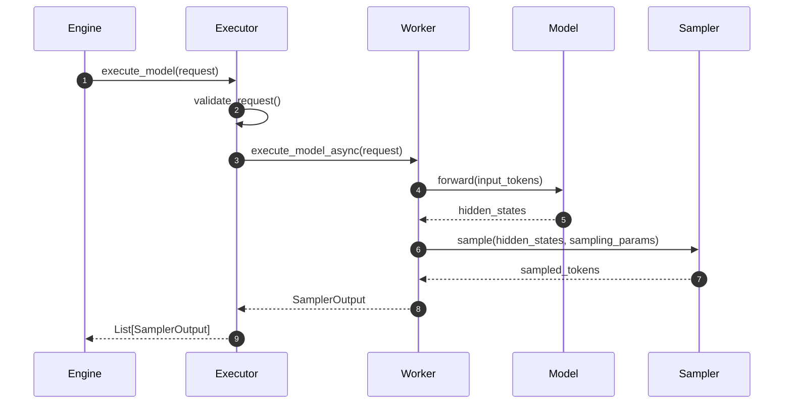
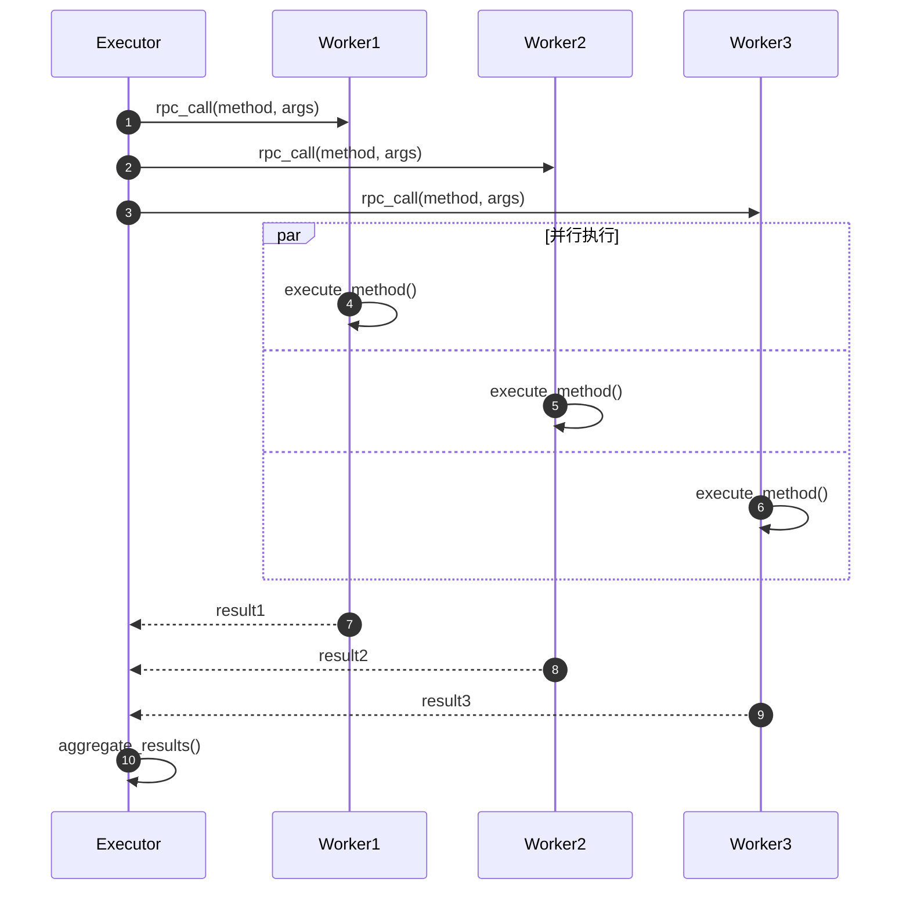

# vLLM-07-Executor模块-API

## 模块API概览

Executor 模块提供了统一的模型执行接口，支持单进程、多进程和分布式等多种执行模式。本文档详细描述了各个执行器类的 API 接口，包括初始化、执行、通信和管理等关键方法。

## ExecutorBase 基类API

### 基本信息
- **类名**：`ExecutorBase`
- **类型**：抽象基类
- **继承关系**：无父类，被具体执行器继承

### 初始化方法

#### `__init__`

**基本信息**
- **方法名**：`__init__`
- **类型**：构造方法
- **可见性**：public

**请求结构体**
```python
def __init__(
    self,
    vllm_config: VllmConfig,
) -> None:
    """
    初始化执行器基类
    
    Args:
        vllm_config: vLLM配置对象，包含所有模块配置
    """
```

| 参数 | 类型 | 必填 | 默认值 | 约束 | 说明 |
|------|------|------|--------|------|------|
| `vllm_config` | VllmConfig | 是 | 无 | 非空 | 完整的vLLM配置对象 |

**响应结构体**
- **返回类型**：None
- **异常**：可能抛出配置验证异常

**入口函数与关键代码**
```python
def __init__(self, vllm_config: VllmConfig) -> None:
    # 1) 提取各模块配置
    self.vllm_config = vllm_config
    self.model_config = vllm_config.model_config
    self.cache_config = vllm_config.cache_config
    self.lora_config = vllm_config.lora_config
    self.parallel_config = vllm_config.parallel_config
    self.scheduler_config = vllm_config.scheduler_config
    self.device_config = vllm_config.device_config
    
    # 2) 初始化执行器状态
    self._init_executor()
    self.is_sleeping = False
    self.sleeping_tags: set[str] = set()
    self.kv_output_aggregator = None
```

**异常处理与性能要点**
- **配置验证**：检查配置兼容性，如并行度与硬件匹配
- **资源检查**：验证内存、GPU等资源可用性
- **初始化开销**：约1-5秒（取决于模型大小和硬件）

### 核心执行方法

#### `execute_model`

**基本信息**
- **方法名**：`execute_model`
- **协议/方法**：Python 方法调用
- **幂等性**：否（有状态更新）

**请求结构体**
```python
@abstractmethod
def execute_model(
    self,
    execute_model_req: ExecuteModelRequest,
) -> List[SamplerOutput]:
    """
    执行模型推理请求
    
    Args:
        execute_model_req: 包含序列、采样参数等的请求对象
        
    Returns:
        采样输出列表，每个元素对应一个输入序列
    """
```

| 字段 | 类型 | 必填 | 默认值 | 约束 | 说明 |
|------|------|------|--------|------|------|
| `seq_group_metadata_list` | List[SequenceGroupMetadata] | 是 | 无 | 非空 | 序列组元数据列表 |
| `blocks_to_swap_in` | Dict[int, int] | 否 | {} | 键值非负 | 换入的内存块映射 |
| `blocks_to_swap_out` | Dict[int, int] | 否 | {} | 键值非负 | 换出的内存块映射 |
| `blocks_to_copy` | Dict[int, List[int]] | 否 | {} | 列表非空 | 复制的内存块映射 |
| `num_lookahead_slots` | int | 否 | 0 | ≥ 0 | 预读槽位数量 |

**响应结构体**
```python
class SamplerOutput:
    """采样器输出结果"""
    outputs: List[CompletionSequenceGroupOutput]  # 完成的序列组输出
    sampled_token_probs: Optional[SampledTokensProbs]  # 采样token概率
    sampled_token_ids: List[int]  # 采样的token ID
    spec_decode_worker_metrics: Optional[SpecDecodeWorkerMetrics]  # 推测解码指标
```

| 字段 | 类型 | 必填 | 约束 | 说明 |
|------|------|------|------|------|
| `outputs` | List[CompletionSequenceGroupOutput] | 是 | 非空 | 序列组的完成输出 |
| `sampled_token_probs` | Optional[SampledTokensProbs] | 否 | 无 | 采样概率（调试用）|
| `sampled_token_ids` | List[int] | 是 | 有效token范围 | 采样的token标识 |

**入口函数与关键代码**
```python
def execute_model(self, execute_model_req: ExecuteModelRequest) -> List[SamplerOutput]:
    # 1) 预处理请求
    self._validate_execute_model_request(execute_model_req)
    
    # 2) 执行内存管理操作
    self._perform_memory_operations(execute_model_req)
    
    # 3) 调用模型前向传播
    model_output = self._execute_model_impl(execute_model_req)
    
    # 4) 后处理和采样
    sampler_outputs = self._process_model_outputs(model_output)
    
    return sampler_outputs
```

**上层适配/调用链核心代码**
```python
# LLMEngine中的调用示例
class LLMEngine:
    def step(self) -> List[RequestOutput]:
        # 1) 调度决策
        scheduler_outputs = self.scheduler.schedule()
        
        # 2) 构建执行请求
        execute_model_req = ExecuteModelRequest(
            seq_group_metadata_list=scheduler_outputs.scheduled_seq_groups,
            blocks_to_swap_in=scheduler_outputs.blocks_to_swap_in,
            blocks_to_swap_out=scheduler_outputs.blocks_to_swap_out,
            blocks_to_copy=scheduler_outputs.blocks_to_copy,
        )
        
        # 3) 执行模型推理
        output = self.model_executor.execute_model(execute_model_req)
        
        return self._process_model_outputs(output, scheduler_outputs)
```

**时序图（请求→响应）**


**异常/回退与性能要点**
- **错误处理**：内存不足时自动调整批大小，模型加载失败时重试
- **性能优化**：启用CUDA Graph减少内核启动开销，批处理优化提升吞吐量
- **超时控制**：支持执行超时设置，防止长时间阻塞

#### `collective_rpc`

**基本信息**
- **方法名**：`collective_rpc`
- **协议/方法**：分布式RPC调用
- **幂等性**：取决于调用的具体方法

**请求结构体**
```python
@abstractmethod
def collective_rpc(
    self,
    method: Union[str, Callable[[WorkerBase], _R]],
    timeout: Optional[float] = None,
    args: tuple = (),
    kwargs: Optional[dict[str, Any]] = None
) -> list[_R]:
    """
    在所有Worker节点上执行集合RPC调用
    
    Args:
        method: 要调用的方法名或可调用对象
        timeout: 超时时间（秒）
        args: 位置参数元组
        kwargs: 关键字参数字典
        
    Returns:
        所有Worker节点的返回结果列表
    """
```

| 参数 | 类型 | 必填 | 默认值 | 约束 | 说明 |
|------|------|------|--------|------|------|
| `method` | Union[str, Callable] | 是 | 无 | 有效方法 | 要执行的方法 |
| `timeout` | Optional[float] | 否 | None | > 0 | 超时时间 |
| `args` | tuple | 否 | () | 无 | 位置参数 |
| `kwargs` | Optional[dict] | 否 | None | 无 | 关键字参数 |

**响应结构体**
```python
# 返回类型：list[_R]，其中_R是方法的返回类型
# 例如调用 "get_memory_usage" 方法
返回示例: [
    {"gpu_memory": 8192, "cpu_memory": 16384},  # Worker 0
    {"gpu_memory": 8192, "cpu_memory": 16384},  # Worker 1  
    {"gpu_memory": 8192, "cpu_memory": 16384},  # Worker 2
]
```

**入口函数与关键代码**
```python
def collective_rpc(self, method, timeout=None, args=(), kwargs=None):
    # 1) 参数预处理
    if kwargs is None:
        kwargs = {}
        
    # 2) 构建RPC调用
    rpc_request = {
        "method": method,
        "args": args, 
        "kwargs": kwargs,
        "timeout": timeout
    }
    
    # 3) 并行调用所有Worker
    futures = []
    for worker in self.workers:
        future = worker.execute_method_async(rpc_request)
        futures.append(future)
    
    # 4) 收集结果
    results = []
    for future in futures:
        try:
            result = future.get(timeout=timeout)
            results.append(result)
        except Exception as e:
            # 处理单个Worker的异常
            results.append({"error": str(e)})
    
    return results
```

**时序图（RPC调用）**


**异常/回退与性能要点**
- **故障容错**：单个Worker失败不影响其他节点，支持部分结果返回
- **超时机制**：防止慢节点影响整体性能
- **性能优化**：异步并行调用，减少等待时间

## UniProcExecutor 单进程执行器API

### 基本信息
- **类名**：`UniProcExecutor`
- **父类**：`ExecutorBase`
- **用途**：单进程模型执行，适合小模型和调试

### 初始化相关API

#### `_init_executor`

**基本信息**
- **方法名**：`_init_executor`
- **类型**：内部初始化方法
- **可见性**：protected

**入口函数与关键代码**
```python
def _init_executor(self) -> None:
    # 1) 创建驱动Worker
    self.driver_worker = self._create_worker(
        local_rank=0,
        rank=0,
        distributed_init_method=None,
    )
    
    # 2) 初始化模型
    self.driver_worker.init_device()
    self.driver_worker.load_model()
    
    # 3) 设置执行环境
    self.workers = [self.driver_worker]
```

#### `determine_num_available_blocks`

**基本信息**
- **方法名**：`determine_num_available_blocks`
- **协议/方法**：内存估算接口
- **幂等性**：是

**响应结构体**
```python
def determine_num_available_blocks(self) -> Tuple[int, int]:
    """
    确定可用的GPU和CPU内存块数量
    
    Returns:
        (num_gpu_blocks, num_cpu_blocks): GPU和CPU可用块数
    """
```

**入口函数与关键代码**
```python
def determine_num_available_blocks(self) -> Tuple[int, int]:
    # 1) 调用Worker的内存估算方法
    return self.driver_worker.determine_num_available_blocks()
```

## RayDistributedExecutor 分布式执行器API

### 基本信息
- **类名**：`RayDistributedExecutor`
- **父类**：`DistributedExecutorBase`
- **用途**：基于Ray的大规模分布式执行

### 分布式通信API

#### `_run_workers`

**基本信息**
- **方法名**：`_run_workers`
- **类型**：分布式协调方法
- **可见性**：protected

**请求结构体**
```python
def _run_workers(
    self,
    method: str,
    *args,
    async_run_tensor_parallel_workers_only: bool = False,
    all_args: Optional[List[Tuple[Any, ...]]] = None,
    all_kwargs: Optional[List[Dict[str, Any]]] = None,
    use_dummy_driver: bool = False,
    max_concurrent_workers: Optional[int] = None,
    **kwargs,
) -> Any:
    """
    在分布式Worker节点上运行方法
    """
```

| 参数 | 类型 | 必填 | 默认值 | 说明 |
|------|------|------|--------|------|
| `method` | str | 是 | 无 | 要执行的方法名 |
| `async_run_tensor_parallel_workers_only` | bool | 否 | False | 是否仅异步运行张量并行Worker |
| `all_args` | Optional[List[Tuple]] | 否 | None | 每个Worker的参数列表 |
| `max_concurrent_workers` | Optional[int] | 否 | None | 最大并发Worker数 |

**入口函数与关键代码**
```python
def _run_workers(self, method: str, *args, **kwargs) -> Any:
    # 1) 构建Ray任务
    all_worker_args = self._get_worker_args_from_ray()
    
    # 2) 异步提交任务到所有Worker
    ray_worker_outputs = []
    for worker, worker_args in zip(self.workers, all_worker_args):
        ray_worker_output = worker.execute_method.remote(method, *args, **kwargs)
        ray_worker_outputs.append(ray_worker_output)
    
    # 3) 等待所有任务完成
    return ray.get(ray_worker_outputs)
```

#### `_driver_execute_model`

**基本信息**
- **方法名**：`_driver_execute_model`
- **类型**：驱动节点执行方法
- **可见性**：protected

**请求结构体**
```python
def _driver_execute_model(
    self,
    execute_model_req: Optional[ExecuteModelRequest]
) -> Optional[List[SamplerOutput]]:
    """
    在驱动节点执行模型推理
    
    Args:
        execute_model_req: 执行请求，None表示停止执行
        
    Returns:
        采样输出或None（停止信号）
    """
```

**入口函数与关键代码**
```python
def _driver_execute_model(self, execute_model_req):
    # 1) 检查停止信号
    if execute_model_req is None:
        return None
        
    # 2) 广播执行请求到所有Worker
    self._broadcast_tensor_dict(execute_model_req.as_dict())
    
    # 3) 在驱动Worker上执行
    output = self.driver_worker.execute_model(execute_model_req)
    
    return output
```

## 工具和辅助API

### 健康检查API

#### `check_health`

**基本信息**
- **方法名**：`check_health`
- **协议/方法**：健康检查接口
- **幂等性**：是

**入口函数与关键代码**
```python
@abstractmethod
def check_health(self) -> None:
    """
    检查执行器健康状态
    如果不健康则抛出异常
    """
    # 1) 检查Worker节点状态
    for worker in self.workers:
        worker.check_health()
    
    # 2) 检查通信连接
    self._check_communication_health()
    
    # 3) 检查资源状态
    self._check_resource_health()
```

### 资源管理API

#### `save_sharded_state`

**基本信息**
- **方法名**：`save_sharded_state`
- **协议/方法**：模型状态保存接口
- **幂等性**：否（文件系统操作）

**请求结构体**
```python
def save_sharded_state(
    self,
    path: str,
    pattern: Optional[str] = None,
    max_size: Optional[int] = None,
) -> None:
    """
    保存分片模型状态
    
    Args:
        path: 保存路径
        pattern: 文件命名模式
        max_size: 最大文件大小
    """
```

**入口函数与关键代码**
```python
def save_sharded_state(self, path: str, pattern=None, max_size=None):
    # 1) 并行保存各Worker的状态
    ray_worker_outputs = []
    for i, worker in enumerate(self.workers):
        shard_path = f"{path}/shard_{i}"
        output = worker.save_sharded_state.remote(shard_path, pattern, max_size)
        ray_worker_outputs.append(output)
    
    # 2) 等待所有保存操作完成
    ray.get(ray_worker_outputs)
```

## 异常处理和错误码

### 常见异常类型

| 异常类型 | 错误码 | 说明 | 处理建议 |
|----------|--------|------|----------|
| `OutOfMemoryError` | E001 | GPU内存不足 | 减少批大小或启用CPU交换 |
| `WorkerCrashedError` | E002 | Worker节点崩溃 | 重启Worker或替换节点 |
| `CommunicationTimeoutError` | E003 | 通信超时 | 检查网络连接，调整超时设置 |
| `ModelLoadError` | E004 | 模型加载失败 | 检查模型文件和权限 |
| `ConfigurationError` | E005 | 配置参数错误 | 验证配置兼容性 |

### 异常处理最佳实践

```python
# 推荐的异常处理模式
try:
    outputs = executor.execute_model(request)
except OutOfMemoryError:
    # 降级处理：减少批大小
    request.reduce_batch_size()
    outputs = executor.execute_model(request)
except WorkerCrashedError:
    # 故障恢复：重启Worker
    executor.restart_failed_workers()
    outputs = executor.execute_model(request)
except CommunicationTimeoutError:
    # 重试机制：延长超时时间
    executor.set_timeout(timeout * 2)
    outputs = executor.execute_model(request)
```

## 性能监控API

### 指标收集接口

```python
def get_performance_metrics(self) -> Dict[str, Any]:
    """
    获取执行器性能指标
    
    Returns:
        性能指标字典，包含延迟、吞吐量、资源利用率等
    """
    metrics = {}
    
    # 收集执行延迟
    metrics["latency"] = self._collect_latency_metrics()
    
    # 收集吞吐量统计
    metrics["throughput"] = self._collect_throughput_metrics()
    
    # 收集资源利用率
    metrics["resource_utilization"] = self._collect_resource_metrics()
    
    return metrics
```

这些API提供了完整的执行器功能接口，支持从单机到大规模分布式的各种部署场景。
