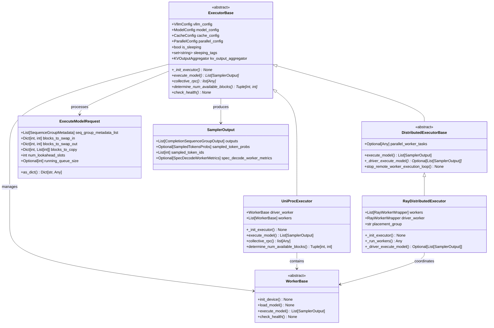

# vLLM-07-Executor模块-数据结构

## 关键数据结构概览

Executor 模块的数据结构设计围绕分布式执行和资源管理展开，包括执行器基类、请求响应结构、Worker 管理和通信协议四个层次。



## 核心类定义

### 1. ExecutorBase 抽象基类

```python
class ExecutorBase(ABC):
    """
    所有执行器的抽象基类
    定义统一的执行接口和资源管理
    """
    
    # 类属性
    uses_ray: bool = False      # 是否使用Ray框架
    supports_pp: bool = False   # 是否支持管道并行
    
    def __init__(self, vllm_config: VllmConfig) -> None:
        # 配置管理
        self.vllm_config: VllmConfig = vllm_config
        self.model_config: ModelConfig = vllm_config.model_config
        self.cache_config: CacheConfig = vllm_config.cache_config
        self.lora_config: LoRAConfig = vllm_config.lora_config
        self.load_config: LoadConfig = vllm_config.load_config
        self.parallel_config: ParallelConfig = vllm_config.parallel_config
        self.scheduler_config: SchedulerConfig = vllm_config.scheduler_config
        self.device_config: DeviceConfig = vllm_config.device_config
        self.speculative_config: SpeculativeConfig = vllm_config.speculative_config
        self.observability_config: ObservabilityConfig = vllm_config.observability_config
        
        # 运行时状态
        self.is_sleeping: bool = False              # 是否处于休眠状态
        self.sleeping_tags: set[str] = set()        # 休眠标签集合
        self.kv_output_aggregator: Optional[KVOutputAggregator] = None  # KV输出聚合器
```

**字段语义与约束**：

| 字段 | 类型 | 约束 | 默认值 | 说明 |
|------|------|------|--------|------|
| `vllm_config` | VllmConfig | 非空 | 必填 | 完整的vLLM配置对象 |
| `model_config` | ModelConfig | 模型存在 | 从config提取 | 模型相关配置 |
| `cache_config` | CacheConfig | 内存大小>0 | 从config提取 | 缓存配置 |
| `parallel_config` | ParallelConfig | 并行度≥1 | 从config提取 | 并行执行配置 |
| `is_sleeping` | bool | 无 | False | 执行器休眠状态 |
| `sleeping_tags` | set[str] | 无 | 空集合 | 休眠相关标签 |

### 2. ExecuteModelRequest 请求结构

```python
@dataclass
class ExecuteModelRequest:
    """
    模型执行请求的数据结构
    包含推理所需的所有信息
    """
    
    # 核心序列数据
    seq_group_metadata_list: List[SequenceGroupMetadata]
    # 序列组元数据列表，每个元素包含一个请求的所有序列
    
    # 内存管理操作
    blocks_to_swap_in: Dict[int, int] = field(default_factory=dict)
    # 从CPU换入GPU的内存块映射 {逻辑块ID: 物理块ID}
    
    blocks_to_swap_out: Dict[int, int] = field(default_factory=dict)
    # 从GPU换出到CPU的内存块映射 {逻辑块ID: 物理块ID}
    
    blocks_to_copy: Dict[int, List[int]] = field(default_factory=dict)
    # 内存块复制操作 {源块ID: [目标块ID列表]}
    
    # 推测执行相关
    num_lookahead_slots: int = 0
    # 预读槽位数量，用于推测解码
    
    running_queue_size: Optional[int] = None
    # 运行队列大小，用于调度优化
    
    def as_dict(self) -> Dict[str, Any]:
        """将请求转换为字典格式，便于序列化"""
        return {
            "seq_group_metadata_list": [sgm.as_dict() for sgm in self.seq_group_metadata_list],
            "blocks_to_swap_in": self.blocks_to_swap_in,
            "blocks_to_swap_out": self.blocks_to_swap_out,
            "blocks_to_copy": self.blocks_to_copy,
            "num_lookahead_slots": self.num_lookahead_slots,
            "running_queue_size": self.running_queue_size,
        }
```

**字段详细说明**：

| 字段 | 形状/类型 | 数据类型 | 说明 |
|------|-----------|----------|------|
| `seq_group_metadata_list` | List[SequenceGroupMetadata] | 对象列表 | 包含序列ID、采样参数、位置信息等 |
| `blocks_to_swap_in` | Dict[int, int] | 整数映射 | 键值都必须是有效的块ID |
| `blocks_to_swap_out` | Dict[int, int] | 整数映射 | 用于内存压力释放 |
| `blocks_to_copy` | Dict[int, List[int]] | 整数到列表映射 | 支持beam search等场景 |
| `num_lookahead_slots` | int | 非负整数 | 推测解码的预读深度 |

### 3. SamplerOutput 响应结构

```python
@dataclass
class SamplerOutput:
    """
    采样器输出结果
    包含生成的token和相关元数据
    """
    
    # 主要输出结果
    outputs: List[CompletionSequenceGroupOutput]
    # 完成的序列组输出，每个元素对应一个请求
    
    # 调试和分析信息
    sampled_token_probs: Optional[SampledTokensProbs] = None
    # 采样token的概率分布（可选，用于调试）
    
    sampled_token_ids: List[int] = field(default_factory=list)
    # 采样得到的token ID列表
    
    spec_decode_worker_metrics: Optional[SpecDecodeWorkerMetrics] = None
    # 推测解码的性能指标（可选）
    
    def __len__(self) -> int:
        """返回输出序列组的数量"""
        return len(self.outputs)
    
    def __iter__(self):
        """支持迭代访问输出"""
        return iter(self.outputs)
```

### 4. CompletionSequenceGroupOutput 输出详情

```python
@dataclass
class CompletionSequenceGroupOutput:
    """
    单个序列组的完成输出
    """
    
    # 序列标识
    request_id: str                    # 请求唯一标识
    prompt_token_ids: List[int]        # 输入提示的token ID
    prompt_logprobs: Optional[PromptLogprobs]  # 提示token的对数概率
    
    # 生成结果
    outputs: List[CompletionOutput]    # 完成输出列表（支持多个候选）
    finished: bool                     # 是否完成生成
    
    # 元数据
    metrics: Optional[RequestMetrics] = None  # 请求性能指标
    lora_request: Optional[LoRARequest] = None  # LoRA请求信息
```

## Worker 管理数据结构

### 1. WorkerBase 抽象基类

```python
class WorkerBase(ABC):
    """
    Worker节点的抽象基类
    定义节点的基本接口和生命周期
    """
    
    def __init__(
        self,
        model_config: ModelConfig,
        parallel_config: ParallelConfig,
        scheduler_config: SchedulerConfig,
        device_config: DeviceConfig,
        cache_config: CacheConfig,
        load_config: LoadConfig,
        local_rank: int,
        rank: int,
        distributed_init_method: Optional[str],
        lora_config: Optional[LoRAConfig] = None,
        vision_language_config: Optional[VisionLanguageConfig] = None,
        is_driver_worker: bool = False,
    ):
        # 配置存储
        self.model_config = model_config
        self.parallel_config = parallel_config
        self.scheduler_config = scheduler_config
        self.device_config = device_config
        self.cache_config = cache_config
        self.load_config = load_config
        
        # 分布式配置
        self.local_rank = local_rank        # 节点内排名
        self.rank = rank                    # 全局排名
        self.distributed_init_method = distributed_init_method  # 分布式初始化方法
        self.is_driver_worker = is_driver_worker  # 是否为驱动节点
        
        # 可选配置
        self.lora_config = lora_config
        self.vision_language_config = vision_language_config
```

### 2. RayWorkerWrapper Ray包装器

```python
class RayWorkerWrapper:
    """
    Ray远程Worker的本地包装器
    提供统一的接口访问远程Worker节点
    """
    
    def __init__(self, ray_remote_worker):
        self.worker = ray_remote_worker     # Ray远程对象引用
        self.node_id = None                 # 节点ID
        self.node_ip = None                 # 节点IP地址
        self.gpu_ids = []                   # 分配的GPU ID列表
        
    def execute_method(self, method_name: str, *args, **kwargs):
        """执行远程方法调用"""
        return getattr(self.worker, method_name).remote(*args, **kwargs)
    
    def execute_method_async(self, method_name: str, *args, **kwargs):
        """异步执行远程方法调用"""
        return self.execute_method(method_name, *args, **kwargs)
    
    def get_node_info(self) -> Dict[str, Any]:
        """获取节点信息"""
        return {
            "node_id": self.node_id,
            "node_ip": self.node_ip,
            "gpu_ids": self.gpu_ids,
            "status": "active"
        }
```

## 分布式通信数据结构

### 1. RPC调用结构

```python
@dataclass
class RPCRequest:
    """
    远程过程调用请求结构
    """
    method: str                        # 方法名
    args: Tuple[Any, ...] = ()        # 位置参数
    kwargs: Dict[str, Any] = field(default_factory=dict)  # 关键字参数
    timeout: Optional[float] = None    # 超时时间
    request_id: str = field(default_factory=lambda: str(uuid.uuid4()))  # 请求ID
    
    def serialize(self) -> bytes:
        """序列化请求为字节流"""
        return pickle.dumps(self)
    
    @classmethod
    def deserialize(cls, data: bytes) -> "RPCRequest":
        """从字节流反序列化请求"""
        return pickle.loads(data)

@dataclass
class RPCResponse:
    """
    远程过程调用响应结构
    """
    request_id: str                    # 对应的请求ID
    result: Any = None                 # 执行结果
    error: Optional[str] = None        # 错误信息
    execution_time: float = 0.0        # 执行时间
    worker_id: Optional[str] = None    # 执行节点ID
    
    @property
    def is_success(self) -> bool:
        """判断调用是否成功"""
        return self.error is None
```

### 2. 集合通信结构

```python
class CollectiveOps:
    """
    集合通信操作的数据结构
    """
    
    @dataclass
    class AllReduceRequest:
        """AllReduce操作请求"""
        tensor_name: str               # 张量名称
        operation: str                 # 操作类型（sum/avg/max/min）
        tensor_data: torch.Tensor      # 张量数据
        
    @dataclass
    class AllGatherRequest:
        """AllGather操作请求"""
        tensor_name: str               # 张量名称
        tensor_data: torch.Tensor      # 本地张量数据
        
    @dataclass
    class BroadcastRequest:
        """Broadcast操作请求"""
        tensor_name: str               # 张量名称
        tensor_data: torch.Tensor      # 广播的张量数据
        root_rank: int                 # 广播源节点排名
```

## 资源管理数据结构

### 1. 内存块管理

```python
@dataclass
class BlockAllocation:
    """
    内存块分配信息
    """
    block_id: int                      # 块ID
    block_size: int                    # 块大小（token数）
    device: str                        # 设备类型（gpu/cpu）
    allocated: bool = False            # 是否已分配
    sequence_id: Optional[str] = None  # 关联的序列ID
    allocation_time: float = field(default_factory=time.time)  # 分配时间
    
    @property
    def memory_usage(self) -> int:
        """计算内存使用量（字节）"""
        # 假设每个token的KV缓存占用固定内存
        bytes_per_token = 4 * 2 * 4096  # 4字节 * 2(K,V) * 隐藏维度
        return self.block_size * bytes_per_token

@dataclass
class MemoryPool:
    """
    内存池管理结构
    """
    total_blocks: int                  # 总块数
    free_blocks: Set[int]              # 空闲块集合
    allocated_blocks: Dict[int, BlockAllocation]  # 已分配块映射
    device: str                        # 设备类型
    
    def allocate_block(self, sequence_id: str) -> Optional[int]:
        """分配一个内存块"""
        if not self.free_blocks:
            return None
            
        block_id = self.free_blocks.pop()
        allocation = BlockAllocation(
            block_id=block_id,
            block_size=16,  # 默认块大小
            device=self.device,
            allocated=True,
            sequence_id=sequence_id
        )
        self.allocated_blocks[block_id] = allocation
        return block_id
    
    def free_block(self, block_id: int) -> bool:
        """释放一个内存块"""
        if block_id in self.allocated_blocks:
            del self.allocated_blocks[block_id]
            self.free_blocks.add(block_id)
            return True
        return False
    
    @property
    def utilization(self) -> float:
        """计算内存利用率"""
        return len(self.allocated_blocks) / self.total_blocks
```

### 2. 性能监控结构

```python
@dataclass
class ExecutorMetrics:
    """
    执行器性能指标
    """
    # 执行统计
    total_requests: int = 0            # 总请求数
    completed_requests: int = 0        # 完成请求数
    failed_requests: int = 0           # 失败请求数
    
    # 延迟统计
    avg_latency: float = 0.0           # 平均延迟（毫秒）
    p50_latency: float = 0.0           # 50分位延迟
    p95_latency: float = 0.0           # 95分位延迟
    p99_latency: float = 0.0           # 99分位延迟
    
    # 吞吐量统计
    requests_per_second: float = 0.0   # 每秒请求数
    tokens_per_second: float = 0.0     # 每秒token数
    
    # 资源利用率
    gpu_utilization: float = 0.0       # GPU利用率
    memory_utilization: float = 0.0    # 内存利用率
    network_bandwidth: float = 0.0     # 网络带宽使用
    
    # Worker状态
    active_workers: int = 0            # 活跃Worker数
    failed_workers: int = 0            # 故障Worker数
    
    def update_latency(self, latency: float):
        """更新延迟统计"""
        # 简化的滑动窗口更新
        self.avg_latency = (self.avg_latency * 0.9) + (latency * 0.1)
    
    def to_dict(self) -> Dict[str, Any]:
        """转换为字典格式"""
        return {
            "requests": {
                "total": self.total_requests,
                "completed": self.completed_requests,
                "failed": self.failed_requests,
            },
            "latency": {
                "avg": self.avg_latency,
                "p50": self.p50_latency,
                "p95": self.p95_latency,
                "p99": self.p99_latency,
            },
            "throughput": {
                "requests_per_second": self.requests_per_second,
                "tokens_per_second": self.tokens_per_second,
            },
            "resources": {
                "gpu_utilization": self.gpu_utilization,
                "memory_utilization": self.memory_utilization,
                "network_bandwidth": self.network_bandwidth,
            },
            "workers": {
                "active": self.active_workers,
                "failed": self.failed_workers,
            }
        }
```

## 数据流映射关系

### 1. 请求到执行的映射

```python
def request_to_execution_mapping(
    llm_request: LLMRequest,          # 用户原始请求
    executor_request: ExecuteModelRequest,  # 执行器请求
    sampler_output: SamplerOutput     # 采样输出
) -> None:
    """
    展示数据在执行过程中的转换映射
    
    映射规则：
    1. LLMRequest -> ExecuteModelRequest：提取执行相关信息
    2. ExecuteModelRequest -> Worker输入：分发到各个Worker节点
    3. Worker输出 -> SamplerOutput：聚合多节点结果
    4. SamplerOutput -> LLMResponse：转换为用户响应格式
    """
    
    # 第1步：请求转换
    seq_group_metadata = SequenceGroupMetadata(
        request_id=llm_request.request_id,
        is_prompt=True,
        seq_data={0: llm_request.inputs},
        sampling_params=llm_request.sampling_params,
        block_tables={0: []},  # 初始为空，后续分配
    )
    
    executor_request.seq_group_metadata_list = [seq_group_metadata]
    
    # 第2步：执行结果聚合
    completion_output = CompletionOutput(
        index=0,
        text=sampler_output.outputs[0].text,
        token_ids=sampler_output.sampled_token_ids,
        cumulative_logprob=sampler_output.outputs[0].cumulative_logprob,
        logprobs=sampler_output.outputs[0].logprobs,
        finish_reason=sampler_output.outputs[0].finish_reason,
    )
```

### 2. 分布式数据同步映射

```python
class DistributedSyncMapping:
    """
    分布式数据同步的映射关系
    """
    
    @staticmethod
    def tensor_parallel_mapping(
        input_tensor: torch.Tensor,     # 输入张量 [batch, seq_len, hidden_size]
        world_size: int,                # 并行度
        rank: int                       # 当前节点排名
    ) -> torch.Tensor:
        """
        张量并行的数据分片映射
        将输入张量按hidden_size维度分片到不同节点
        """
        hidden_size = input_tensor.size(-1)
        chunk_size = hidden_size // world_size
        start_idx = rank * chunk_size
        end_idx = start_idx + chunk_size
        
        return input_tensor[..., start_idx:end_idx]
    
    @staticmethod
    def pipeline_parallel_mapping(
        layer_outputs: List[torch.Tensor],  # 各层输出
        pipeline_stage: int,                # 管道阶段
        num_stages: int                     # 总阶段数
    ) -> torch.Tensor:
        """
        管道并行的层间数据传递映射
        """
        layers_per_stage = len(layer_outputs) // num_stages
        start_layer = pipeline_stage * layers_per_stage
        end_layer = start_layer + layers_per_stage
        
        # 执行当前阶段的层
        output = layer_outputs[start_layer]
        for i in range(start_layer + 1, end_layer):
            output = layer_outputs[i](output)
            
        return output
```

## 版本演进说明

| 版本 | 主要变更 | 数据结构影响 | 兼容性 | 迁移建议 |
|------|----------|--------------|--------|----------|
| v0.1.x | 基础执行器实现 | 简单的请求响应结构 | 不兼容 | 已废弃 |
| v0.2.x | 引入分布式支持 | 添加Worker管理结构 | 向后兼容 | 建议升级 |
| v0.3.x | Ray集成 | 新增Ray包装器类 | 部分兼容 | 配置需调整 |
| v0.4.x | 性能监控 | 添加指标收集结构 | 向后兼容 | 新增监控功能 |
| 当前版本 | 异步执行优化 | 优化请求响应流水线 | 向后兼容 | 推荐异步API |

## 内存布局优化

### 1. 数据结构内存对齐

```python
# 内存友好的数据结构设计
@dataclass
class OptimizedExecuteRequest:
    """
    内存优化的执行请求结构
    使用__slots__减少内存开销
    """
    __slots__ = [
        'seq_group_metadata_list',
        'blocks_to_swap_in', 
        'blocks_to_swap_out',
        'blocks_to_copy',
        'num_lookahead_slots'
    ]
    
    seq_group_metadata_list: List[SequenceGroupMetadata]
    blocks_to_swap_in: Dict[int, int]
    blocks_to_swap_out: Dict[int, int] 
    blocks_to_copy: Dict[int, List[int]]
    num_lookahead_slots: int
```

### 2. 缓存友好的数据访问模式

```python
class CacheOptimizedWorkerPool:
    """
    缓存优化的Worker池结构
    按内存局部性组织数据
    """
    
    def __init__(self, workers: List[WorkerBase]):
        # 按节点分组，提高缓存局部性
        self.workers_by_node: Dict[str, List[WorkerBase]] = {}
        self.worker_status: List[bool] = []  # 连续内存存储状态
        self.worker_metrics: np.ndarray = np.zeros((len(workers), 4))  # 指标数组
        
        for i, worker in enumerate(workers):
            node_id = getattr(worker, 'node_id', 'default')
            if node_id not in self.workers_by_node:
                self.workers_by_node[node_id] = []
            self.workers_by_node[node_id].append(worker)
            self.worker_status.append(True)
```

这些数据结构为Executor模块提供了完整的类型定义和内存管理方案，支持从单机到大规模分布式的各种执行场景。
