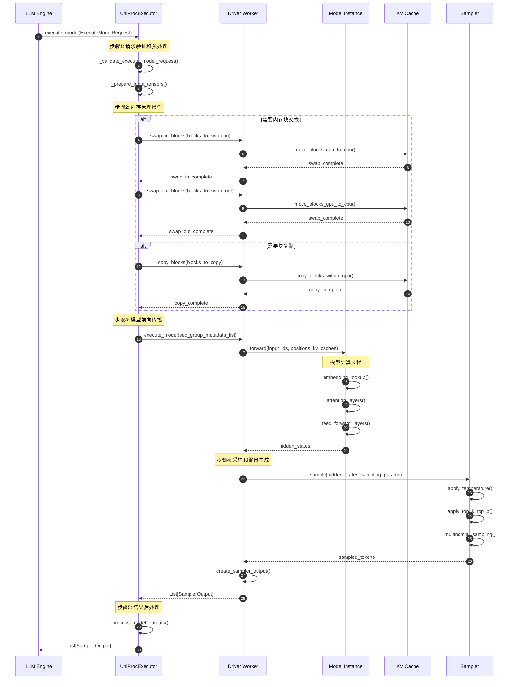
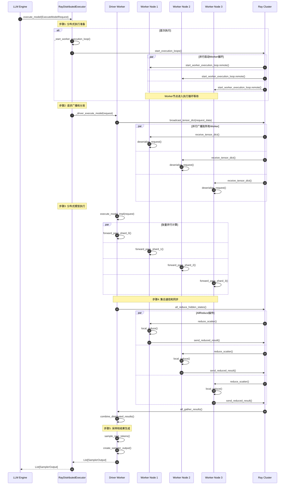
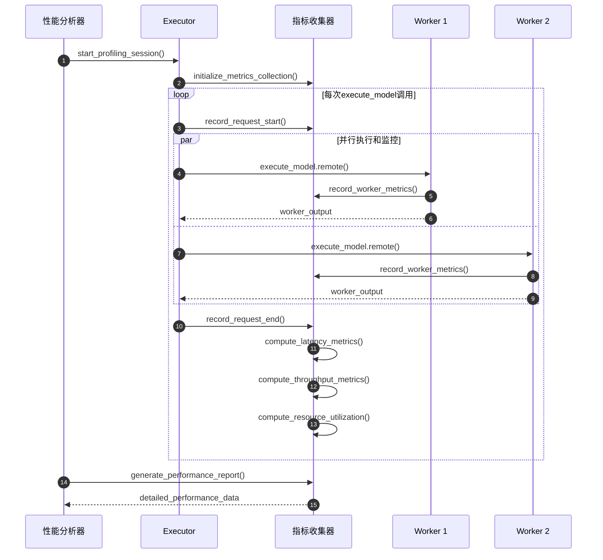

# vLLM-07-Executor模块-时序图

## 典型场景时序图分析

本文档展示 Executor 模块在不同执行模式下的详细时序图，涵盖单进程执行、多进程分布式执行、Ray 分布式执行和故障恢复等关键场景。

## 场景1：单进程执行器（UniProcExecutor）模型推理

### 时序图



### 详细说明

**图意概述**：展示了单进程执行器的完整推理流程，从请求处理到结果生成的各个步骤。

**关键步骤分解**：

1. **请求预处理**（步骤1-2）：
   - 验证输入请求的有效性和完整性
   - 准备模型输入张量，包括token ID和位置编码
   - 检查内存管理操作的必要性

2. **内存管理**（步骤3-8）：
   - 执行内存块换入：将长期未使用的KV缓存从CPU移动到GPU
   - 执行内存块换出：将GPU中的KV缓存移动到CPU释放显存
   - 执行块复制：为beam search等场景复制KV缓存

3. **模型推理**（步骤9-13）：
   - 调用Worker执行模型前向传播
   - 依次执行嵌入层、注意力层、前馈层
   - 生成最终的隐藏状态表示

4. **采样生成**（步骤14-18）：
   - 根据采样参数应用温度缩放
   - 执行top-k和top-p过滤
   - 进行多项式采样生成下一个token

5. **结果处理**（步骤19-20）：
   - 构建SamplerOutput对象
   - 执行必要的后处理和格式转换

**边界条件**：
- **内存限制**：单进程执行受单个GPU显存限制
- **并发度**：不支持跨GPU并行，适合小模型或调试场景
- **故障容错**：无分布式容错机制，进程崩溃导致完全失败

**性能特征**：
- **低延迟**：无分布式通信开销，适合低延迟场景
- **高吞吐量限制**：受单GPU算力限制，适合小批量推理
- **内存效率**：KV缓存交换机制提高内存利用率

## 场景2：Ray分布式执行器多节点推理

### 时序图



### 详细说明

**图意概述**：展示了Ray分布式执行器在多节点环境下的协调执行流程，包括请求分发、并行计算和结果聚合。

**关键特征**：

1. **异步执行循环**：
   - Worker节点运行独立的执行循环
   - 通过Ray的异步消息传递机制通信
   - 支持流水线式的请求处理

2. **张量并行计算**：
   - 模型权重按hidden dimension分片到不同节点
   - 每个节点计算模型的一个分片
   - 通过AllReduce操作聚合各节点的计算结果

3. **通信优化**：
   - 使用Ray的高效通信原语
   - 重叠计算和通信减少等待时间
   - 支持带宽聚合和网络拓扑优化

**性能考虑**：
- **扩展性**：支持数十到数百个节点的大规模部署
- **容错性**：Ray提供自动故障检测和恢复机制
- **通信开销**：AllReduce操作的复杂度为O(log N)
- **内存分布**：各节点独立管理KV缓存，支持更大的总缓存容量

## 场景3：执行器初始化和Worker管理

### 时序图

```mermaid
sequenceDiagram
    autonumber
    participant Config as VllmConfig
    participant Executor as RayDistributedExecutor
    participant RayCluster as Ray Cluster
    participant PlacementGroup as Placement Group
    participant Worker1 as Worker Node 1
    participant Worker2 as Worker Node 2
    participant DriverWorker as Driver Worker
    
    Config->>Executor: __init__(vllm_config)
    
    Note over Executor: 步骤1: 执行器基础初始化
    Executor->>Executor: extract_configs()
    Executor->>Executor: validate_parallel_config()
    Executor->>Executor: _init_executor()
    
    Note over Executor: 步骤2: Ray集群资源准备
    Executor->>RayCluster: initialize_ray_cluster()
    RayCluster->>RayCluster: check_cluster_resources()
    RayCluster-->>Executor: cluster_ready
    
    Executor->>PlacementGroup: create_placement_group(
        bundles, strategy="STRICT_PACK")
    PlacementGroup->>RayCluster: reserve_resources()
    RayCluster-->>PlacementGroup: resources_reserved
    PlacementGroup-->>Executor: placement_group_ready
    
    Note over Executor: 步骤3: Worker节点创建和部署
    loop 对每个Worker节点
        Executor->>RayCluster: create_remote_worker(
            rank, local_rank, placement_group)
        RayCluster->>Worker1: deploy_worker_process()
        Worker1->>Worker1: initialize_process()
        Worker1->>Worker1: setup_distributed_env()
        Worker1-->>RayCluster: worker_ready
        RayCluster-->>Executor: worker_created
    end
    
    Note over Executor: 步骤4: 驱动Worker特殊初始化
    Executor->>DriverWorker: create_driver_worker()
    DriverWorker->>DriverWorker: init_device()
    DriverWorker->>DriverWorker: setup_model_parallel()
    DriverWorker-->>Executor: driver_ready
    
    Note over Executor: 步骤5: 分布式初始化和模型加载
    Executor->>Executor: collective_rpc("init_device")
    
    par 并行设备初始化
        Executor->>Worker1: init_device.remote()
        Worker1->>Worker1: setup_cuda_device()
        Worker1->>Worker1: initialize_torch_distributed()
        Worker1-->>Executor: device_ready
    and
        Executor->>Worker2: init_device.remote()
        Worker2->>Worker2: setup_cuda_device()
        Worker2->>Worker2: initialize_torch_distributed()
        Worker2-->>Executor: device_ready
    and
        Executor->>DriverWorker: init_device()
        DriverWorker->>DriverWorker: setup_cuda_device()
        DriverWorker-->>Executor: device_ready
    end
    
    Executor->>Executor: collective_rpc("load_model")
    
    par 并行模型加载
        Executor->>Worker1: load_model.remote()
        Worker1->>Worker1: load_model_weights()
        Worker1->>Worker1: initialize_kv_cache()
        Worker1-->>Executor: model_loaded
    and
        Executor->>Worker2: load_model.remote()
        Worker2->>Worker2: load_model_weights()
        Worker2->>Worker2: initialize_kv_cache()
        Worker2-->>Executor: model_loaded
    and
        Executor->>DriverWorker: load_model()
        DriverWorker->>DriverWorker: load_model_weights()
        DriverWorker-->>Executor: model_loaded
    end
    
    Note over Executor: 步骤6: 执行器就绪确认
    Executor->>Executor: determine_num_available_blocks()
    Executor->>Executor: setup_health_monitoring()
    Executor-->>Config: executor_initialized
```

### 详细说明

**图意概述**：展示了分布式执行器的完整初始化流程，包括资源准备、Worker部署、分布式设置和模型加载。

**关键阶段**：

1. **资源准备**（步骤1-4）：
   - 验证并行配置的有效性
   - 初始化Ray集群连接
   - 创建资源预留的Placement Group

2. **Worker部署**（步骤5-8）：
   - 在各个节点上创建Worker进程
   - 配置分布式环境和通信后端
   - 设置进程间通信渠道

3. **分布式初始化**（步骤9-14）：
   - 并行初始化各节点的CUDA设备
   - 建立torch.distributed通信组
   - 同步各节点的初始化状态

4. **模型加载**（步骤15-20）：
   - 分布式加载模型权重分片
   - 初始化各节点的KV缓存
   - 验证模型加载的完整性

**时间开销分析**：
- 资源准备：1-5秒（取决于集群规模）
- Worker部署：5-30秒（取决于节点数量和网络延迟）
- 设备初始化：2-10秒（取决于GPU数量）
- 模型加载：30-300秒（取决于模型大小和存储性能）

## 场景4：故障检测和恢复

### 时序图

```mermaid
sequenceDiagram
    autonumber
    participant Monitor as Health Monitor
    participant Executor as RayDistributedExecutor
    participant FailedWorker as Failed Worker
    participant RayCluster as Ray Cluster
    participant NewWorker as Replacement Worker
    participant DriverWorker as Driver Worker
    
    Note over Monitor: 定期健康检查
    loop 每30秒
        Monitor->>Executor: check_health()
        Executor->>Executor: collective_rpc("ping", timeout=5.0)
        
        par 并行ping所有Worker
            Executor->>DriverWorker: ping.remote()
            DriverWorker-->>Executor: pong
        and
            Executor->>FailedWorker: ping.remote()
            Note over FailedWorker: Worker无响应或崩溃
            FailedWorker--xExecutor: timeout/error
        end
        
        Executor-->>Monitor: health_status={failed_workers: [worker_2]}
    end
    
    Note over Monitor: 检测到Worker故障
    Monitor->>Executor: handle_worker_failure(failed_worker_ids=[2])
    
    Note over Executor: 步骤1: 故障隔离和状态保存
    Executor->>Executor: isolate_failed_worker(worker_2)
    Executor->>Executor: save_checkpoint_state()
    
    alt 支持状态恢复
        Executor->>DriverWorker: save_distributed_state()
        DriverWorker->>DriverWorker: serialize_kv_cache()
        DriverWorker->>DriverWorker: save_model_state()
        DriverWorker-->>Executor: state_checkpoint_saved
    end
    
    Note over Executor: 步骤2: 替换Worker节点
    Executor->>RayCluster: create_replacement_worker(
        rank=2, resources=failed_worker_resources)
    RayCluster->>NewWorker: deploy_worker_process()
    NewWorker->>NewWorker: initialize_process()
    NewWorker-->>RayCluster: worker_deployed
    RayCluster-->>Executor: replacement_worker_ready
    
    Note over Executor: 步骤3: 新Worker初始化
    Executor->>NewWorker: init_device.remote()
    NewWorker->>NewWorker: setup_cuda_device()
    NewWorker->>NewWorker: initialize_torch_distributed()
    NewWorker-->>Executor: device_initialized
    
    Executor->>NewWorker: load_model.remote()
    NewWorker->>NewWorker: load_model_weights()
    NewWorker->>NewWorker: initialize_kv_cache()
    NewWorker-->>Executor: model_loaded
    
    Note over Executor: 步骤4: 状态恢复和同步
    alt 从检查点恢复
        Executor->>NewWorker: restore_state.remote(checkpoint_data)
        NewWorker->>NewWorker: deserialize_kv_cache()
        NewWorker->>NewWorker: restore_model_state()
        NewWorker-->>Executor: state_restored
    end
    
    Executor->>Executor: redistribute_sequences()
    Executor->>Executor: update_worker_registry()
    
    Note over Executor: 步骤5: 恢复正常执行
    Executor->>Executor: collective_rpc("resume_execution")
    
    par 恢复所有Worker的执行循环
        Executor->>DriverWorker: resume_execution.remote()
        DriverWorker-->>Executor: execution_resumed
    and
        Executor->>NewWorker: start_execution_loop.remote()
        NewWorker-->>Executor: execution_started
    end
    
    Executor-->>Monitor: recovery_complete
    
    Note over Monitor: 恢复监控循环
    Monitor->>Monitor: reset_failure_counters()
    Monitor->>Monitor: resume_health_monitoring()
```

### 详细说明

**图意概述**：展示了分布式执行器的故障检测、隔离、恢复和重新同步的完整流程。

**故障恢复策略**：

1. **故障检测**：
   - 定期健康检查机制（默认30秒间隔）
   - 超时检测和异常捕获
   - 多层次的故障确认避免误报

2. **故障隔离**：
   - 立即停止向故障节点分发任务
   - 保存当前执行状态和KV缓存
   - 防止故障扩散到其他节点

3. **节点替换**：
   - 自动创建替换Worker节点
   - 保持相同的资源配置和网络拓扑
   - 支持热替换和弹性扩缩容

4. **状态恢复**：
   - 从检查点恢复模型状态
   - 重新分配未完成的序列
   - 同步分布式状态信息

**容错能力**：
- **节点故障**：支持单个或多个节点同时故障
- **网络分区**：检测网络分区并触发重新连接
- **资源不足**：动态调整资源需求和节点分配
- **恢复时间**：通常在1-5分钟内完成故障恢复

## 性能监控和调试时序

### 执行性能追踪



**监控维度**：

1. **执行延迟**：
   - 端到端请求处理时间
   - Worker节点的执行时间分布
   - 通信和同步开销

2. **系统吞吐量**：
   - 每秒处理的请求数
   - Token生成速率
   - 批处理效率

3. **资源利用率**：
   - GPU计算利用率
   - 内存使用率和分布
   - 网络带宽消耗

4. **分布式协调**：
   - 节点间同步时间
   - 负载均衡效果
   - 故障恢复耗时

这些时序图全面展示了Executor模块在不同场景下的执行流程，为系统优化和故障诊断提供了详细的参考依据。
