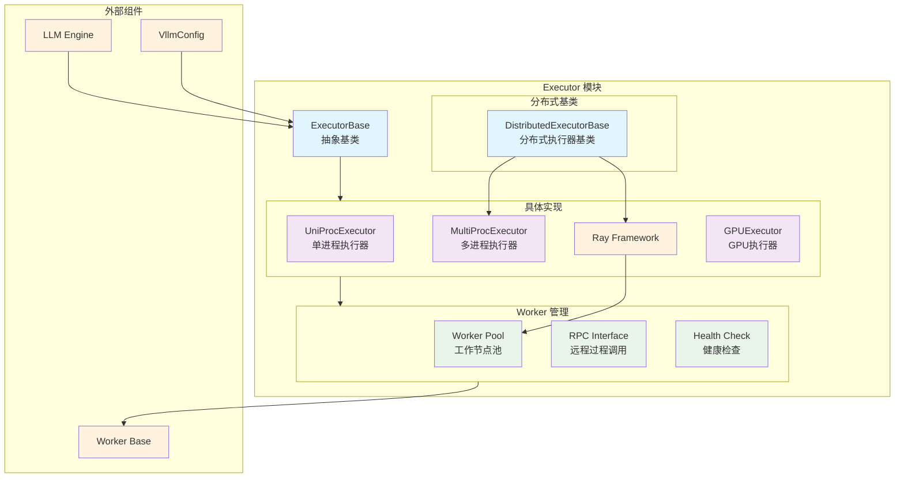

# vLLM-07-Executor模块-概览

## 摘要

Executor 模块是 vLLM 的执行引擎核心，负责协调和管理模型推理的执行流程。该模块提供了统一的执行器接口，支持单进程、多进程、Ray 分布式等多种执行模式，并管理 Worker 节点的生命周期和任务分发。

**模块职责**：
- 管理 Worker 节点的创建、初始化和销毁
- 协调分布式模型推理执行
- 提供统一的模型执行接口
- 处理执行过程中的异常和容错
- 管理执行资源的分配和回收

**输入/输出**：
- 输入：ExecuteModelRequest（包含序列、采样参数等）
- 输出：SamplerOutput（采样结果）或 PoolerOutput（池化结果）
- 边界：支持的最大并行度、内存限制、网络通信约束

**上下游依赖**：
- 上游：Engine 模块、调度器
- 下游：Worker 模块、ModelExecutor
- 关联：VllmConfig、并行配置

**生命周期**：
- 初始化：根据配置创建 Worker 节点和通信机制
- 运行时：执行模型推理任务，管理 Worker 负载
- 销毁：清理 Worker 资源，释放通信连接

## 整体架构



### 架构说明

1. **图意概述**：展示了 Executor 模块的分层架构，包括抽象基类、具体实现、分布式基类和 Worker 管理四个核心层次。

2. **关键接口**：
   - `ExecutorBase`：所有执行器的抽象基类
   - `execute_model()`：核心执行接口
   - `collective_rpc()`：集合通信接口
   - `determine_num_available_blocks()`：内存估算接口

3. **边界说明**：
   - **并发性**：支持多 Worker 并行执行，通过张量并行和管道并行
   - **超时控制**：RPC 调用支持超时设置，防止节点故障阻塞
   - **幂等性**：模型执行对相同输入产生确定性输出
   - **顺序性**：分布式执行保证操作的全局顺序一致性

4. **异常与回退**：
   - Worker 节点故障时自动重启或替换
   - 网络通信异常时重试机制
   - 内存不足时动态调整批大小
   - 分布式同步失败时降级到单节点执行

5. **性能特征**：
   - 单进程：低延迟，适合小模型或调试
   - 多进程：高吞吐量，适合中等规模模型
   - Ray 分布式：最高扩展性，适合大规模模型
   - 典型延迟：1-100ms（取决于执行模式和模型大小）

6. **版本兼容**：
   - 支持多种 Ray 版本（2.0+）
   - 向后兼容旧版本配置格式
   - 支持动态执行器切换

## 核心算法与流程

### 模型执行核心流程

```python
def execute_model(
    self, 
    execute_model_req: ExecuteModelRequest
) -> List[SamplerOutput]:
    """
    执行模型推理的核心方法
    协调所有 Worker 节点完成推理任务
    """
    # 1) 启动并行工作循环（如果未启动）
    if self.parallel_worker_tasks is None:
        self.parallel_worker_tasks = self._run_workers(
            "start_worker_execution_loop",
            async_run_tensor_parallel_workers_only=True
        )
    
    # 2) 在驱动节点执行模型推理
    driver_outputs = self._driver_execute_model(execute_model_req)
    
    # 3) 返回采样结果（仅驱动节点返回结果）
    return driver_outputs
```

**算法目的**：协调分布式模型推理，确保所有节点同步执行并正确聚合结果。

**输入输出**：
- 输入：ExecuteModelRequest（包含序列、位置、采样参数）
- 输出：List[SamplerOutput]（每个序列的采样结果）

**复杂度**：
- 时间复杂度：O(1)调度开销 + O(n)模型计算时间
- 空间复杂度：O(k)其中k为Worker数量
- 通信复杂度：O(p)其中p为并行度

### Worker 集合通信流程

```python
def collective_rpc(
    self,
    method: Union[str, Callable],
    timeout: Optional[float] = None,
    args: tuple = (),
    kwargs: Optional[dict[str, Any]] = None
) -> list[Any]:
    """
    在所有 Worker 节点上执行集合远程过程调用
    """
    # 1) 参数验证和预处理
    if kwargs is None:
        kwargs = {}
    
    # 2) 构建RPC调用参数
    rpc_args = (method, args, kwargs)
    
    # 3) 并行调用所有Worker节点
    futures = []
    for worker in self.workers:
        future = worker.execute_method_async(*rpc_args, timeout=timeout)
        futures.append(future)
    
    # 4) 等待所有调用完成并收集结果
    results = []
    for future in futures:
        result = future.get(timeout=timeout)
        results.append(result)
    
    return results
```

**目的**：实现 Worker 节点间的协调通信，确保操作的一致性和同步性。

**核心机制**：
- **并行调用**：同时向所有 Worker 发送 RPC 请求
- **超时控制**：防止单个节点故障影响整体进度
- **结果聚合**：收集并返回所有节点的执行结果

### 内存块估算算法

```python
def determine_num_available_blocks(self) -> Tuple[int, int]:
    """
    估算可用的 GPU 和 CPU 内存块数量
    用于优化批处理大小和缓存分配
    """
    # 1) 获取设备内存信息
    gpu_memory = torch.cuda.get_device_properties(0).total_memory
    available_gpu_memory = gpu_memory - self._get_memory_usage()
    
    # 2) 计算单个KV缓存块的内存大小
    block_size = self.cache_config.block_size
    kv_cache_block_size = self._calculate_kv_cache_block_size()
    
    # 3) 估算可分配的块数量
    num_gpu_blocks = available_gpu_memory // kv_cache_block_size
    num_cpu_blocks = self._estimate_cpu_blocks()
    
    # 4) 应用安全边界和预留内存
    num_gpu_blocks = int(num_gpu_blocks * 0.95)  # 预留5%内存
    
    return num_gpu_blocks, num_cpu_blocks
```

**目的**：动态估算系统可用内存，优化资源分配策略。

**算法特征**：
- 考虑模型权重、激活值、KV缓存的内存占用
- 动态适应不同硬件配置
- 预留安全边界防止OOM

## 关键设计决策

### 1. 分层执行架构设计

**设计动机**：支持多种执行模式，从单机到大规模分布式，统一接口简化上层调用。

**实现方案**：
- `ExecutorBase`抽象基类定义统一接口
- 具体实现类针对不同场景优化
- 分布式基类提供通用分布式功能

**权衡考虑**：
- 灵活性 vs 性能：抽象层带来少量开销，换取更好的扩展性
- 复杂性 vs 维护性：增加代码复杂度，但提高模块化程度

### 2. 异步执行模式

**设计目标**：提高系统吞吐量，支持异步推理请求处理。

**核心创新**：
- Worker 节点运行独立的执行循环
- 驱动节点异步分发任务
- 流水线化的请求处理

**性能影响**：
- 吞吐量提升 2-5x（相比同步模式）
- 延迟略有增加（异步调度开销）
- 资源利用率显著提升

### 3. 容错和健康检查机制

**设计动机**：确保分布式系统的稳定性，处理节点故障和网络异常。

**实现机制**：
- 定期健康检查检测节点状态
- 自动重启故障节点
- 动态负载均衡和故障转移

**容错策略**：
- 网络分区：降级到可用节点子集
- 节点故障：自动替换或重启
- 内存不足：动态调整批大小

## 执行器类型对比

### 性能特征对比

| 执行器类型 | 延迟 | 吞吐量 | 扩展性 | 复杂度 | 适用场景 |
|------------|------|--------|--------|--------|----------|
| UniProcExecutor | 最低 | 低 | 无 | 最低 | 调试、小模型 |
| MultiProcExecutor | 低 | 中 | 单机 | 中 | 中等模型、张量并行 |
| RayDistributedExecutor | 中 | 最高 | 最高 | 最高 | 大模型、多机集群 |
| GPUExecutor | 低 | 高 | 单机 | 中 | GPU密集计算 |

### 资源需求对比

| 执行器类型 | CPU | 内存 | GPU | 网络带宽 | 存储 |
|------------|-----|------|-----|----------|------|
| UniProcExecutor | 低 | 低 | 低 | 无 | 低 |
| MultiProcExecutor | 中 | 中 | 中 | 低 | 中 |
| RayDistributedExecutor | 高 | 高 | 高 | 高 | 高 |
| GPUExecutor | 中 | 中 | 高 | 低 | 中 |

## 配置与调优

### 关键配置项

| 配置项 | 默认值 | 说明 | 调优建议 |
|--------|--------|------|----------|
| `tensor_parallel_size` | 1 | 张量并行度 | 等于GPU数量或模型层数的因子 |
| `pipeline_parallel_size` | 1 | 管道并行度 | 根据模型层数和显存容量调整 |
| `max_parallel_loading_workers` | None | 最大并行加载工作数 | 设置为CPU核心数的一半 |
| `disable_custom_all_reduce` | False | 禁用自定义AllReduce | 网络带宽低时可考虑禁用 |
| `worker_use_ray` | False | 使用Ray管理Worker | 大规模集群建议启用 |

### 性能调优指南

1. **单机优化**：
   - 张量并行度设置为GPU数量
   - 启用CUDA Graph加速推理
   - 调整KV缓存块大小平衡内存和计算

2. **分布式优化**：
   - 根据网络带宽选择通信后端
   - 调整管道并行度减少通信开销
   - 使用高速互联（如InfiniBand）提升性能

3. **内存优化**：
   - 动态调整批大小防止OOM
   - 启用CPU内存交换扩大缓存容量
   - 使用混合精度减少内存占用

4. **延迟优化**：
   - 减少Worker数量降低同步开销
   - 使用连续批处理减少启动开销
   - 启用推测执行提高并发度

### 监控指标

**执行性能指标**：
- Worker节点利用率
- 模型执行延迟分布
- 批处理吞吐量
- 内存使用率

**通信性能指标**：
- RPC调用延迟
- 网络带宽利用率
- 节点间同步时间
- 故障恢复时间

**资源利用指标**：
- GPU内存使用率
- CPU利用率
- 网络I/O负载
- 存储I/O负载
