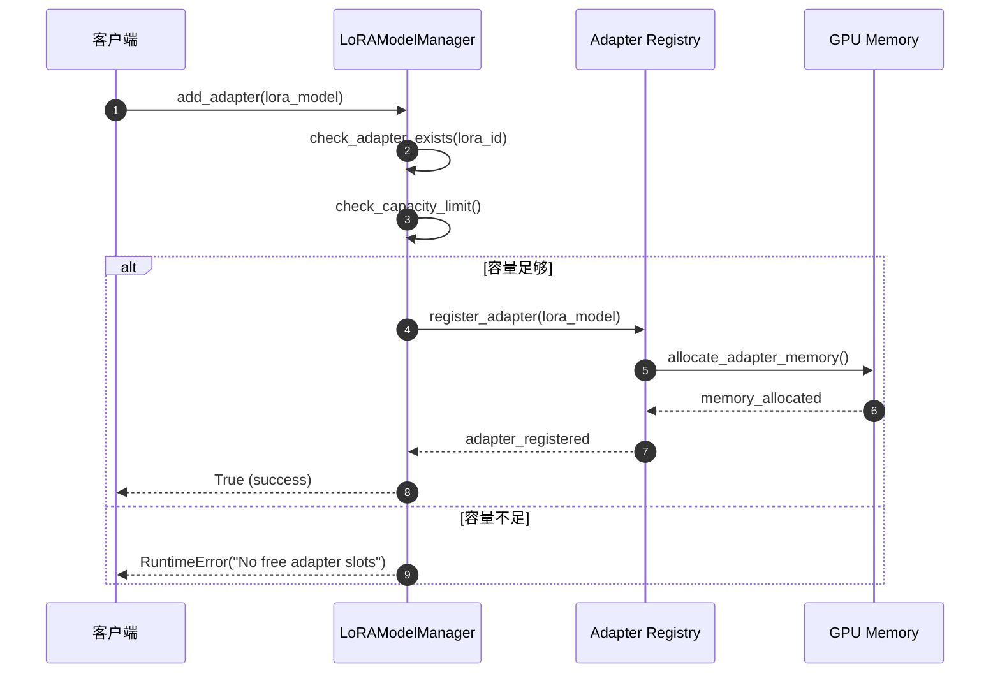
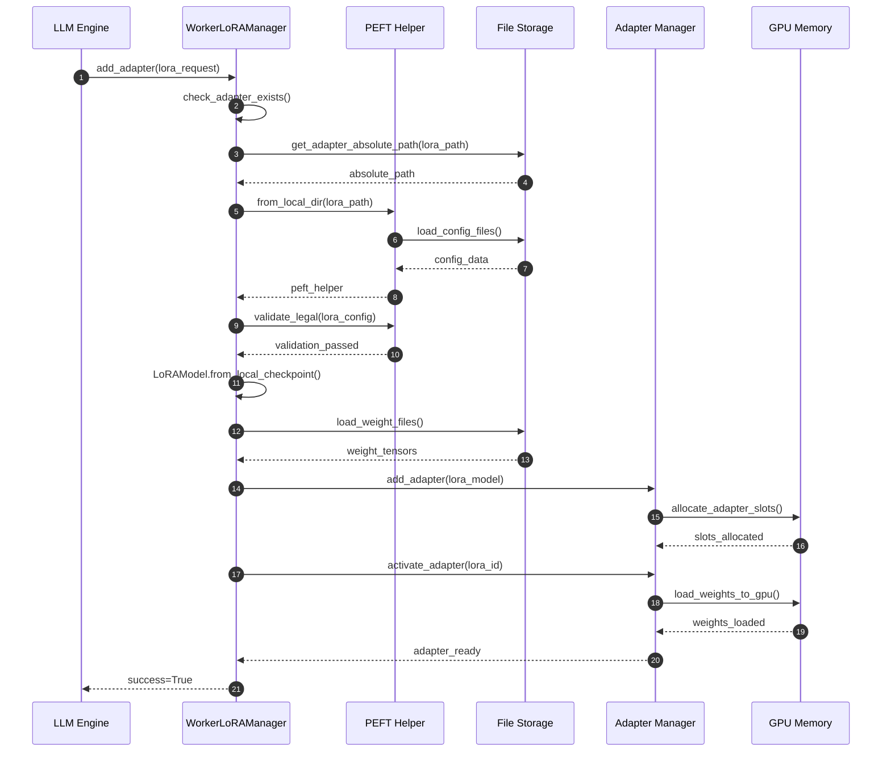

# vLLM-08-LoRA模块-API

## 模块API概览

LoRA 模块提供了完整的低秩适配器管理接口，支持适配器的动态加载、激活、切换和卸载。本文档详细描述了 LoRA 模块的核心 API，包括管理器接口、适配器操作和 Worker 级别的管理功能。

## LoRAModelManager 核心管理器API

### 基本信息
- **类名**：`LoRAModelManager`
- **类型**：LoRA适配器全局管理器
- **继承关系**：无父类，被LRUCacheLoRAModelManager继承

### 初始化方法

#### `__init__`

**基本信息**
- **方法名**：`__init__`
- **类型**：构造方法
- **可见性**：public

**请求结构体**
```python
def __init__(
    self,
    model: SupportsLoRA,
    max_num_seqs: int,
    max_num_batched_tokens: int,
    vocab_size: int,
    lora_config: LoRAConfig,
    device: torch.device,
) -> None:
    """
    创建 LoRA 模型管理器
    
    Args:
        model: 支持LoRA的基础模型
        max_num_seqs: 最大并行序列数
        max_num_batched_tokens: 最大批处理token数
        vocab_size: 词汇表大小
        lora_config: LoRA配置对象
        device: 计算设备
    """
```

| 参数 | 类型 | 必填 | 默认值 | 约束 | 说明 |
|------|------|------|--------|------|------|
| `model` | SupportsLoRA | 是 | 无 | 实现LoRA接口 | 基础模型实例 |
| `max_num_seqs` | int | 是 | 无 | > 0 | 最大并行序列数 |
| `max_num_batched_tokens` | int | 是 | 无 | > 0 | 批处理token上限 |
| `vocab_size` | int | 是 | 无 | > 0 | 模型词汇表大小 |
| `lora_config` | LoRAConfig | 是 | 无 | 非空 | LoRA配置参数 |
| `device` | torch.device | 是 | 无 | CUDA设备 | 计算设备 |

**入口函数与关键代码**
```python
def __init__(self, model, max_num_seqs, max_num_batched_tokens, vocab_size, lora_config, device):
    # 1) 基础配置初始化
    self.model: SupportsLoRA = model
    self.lora_config = lora_config
    self.device = device
    self.max_num_seqs = max_num_seqs
    self.vocab_size = vocab_size
    
    # 2) 适配器管理结构初始化
    self._registered_adapters: dict[int, LoRAModel] = {}
    self._active_adapters: dict[int, None] = {}
    self.lora_index_to_id: list[Optional[int]] = [None] * self.lora_slots
    
    # 3) Punica内核初始化（如果可用）
    self.punica_wrapper = get_punica_wrapper(
        max_num_batched_tokens,
        max_batches=self.max_num_seqs,
        device=self.device,
        max_loras=self.lora_config.max_loras,
    )
    
    # 4) 模型支持的LoRA模块检测
    self.supported_lora_modules = get_supported_lora_modules(self.model)
    self.packed_modules_mapping = get_packed_modules_mapping(self.model)
```

**异常处理与性能要点**
- **模块兼容性检查**：验证模型是否支持LoRA适配
- **内存预分配**：根据配置预分配适配器槽位
- **Punica内核初始化**：自动检测并启用硬件优化

### 适配器管理API

#### `add_adapter`

**基本信息**
- **方法名**：`add_adapter`
- **协议/方法**：Python 方法调用
- **幂等性**：是（重复添加返回False）

**请求结构体**
```python
def add_adapter(self, adapter: LoRAModel) -> bool:
    """
    添加LoRA适配器到管理器
    
    Args:
        adapter: LoRA模型对象
        
    Returns:
        bool: 成功添加返回True，已存在返回False
        
    Raises:
        RuntimeError: 无可用适配器槽位时抛出
    """
```

| 参数 | 类型 | 必填 | 默认值 | 约束 | 说明 |
|------|------|------|--------|------|------|
| `adapter` | LoRAModel | 是 | 无 | 有效LoRA模型 | 要添加的适配器 |

**响应结构体**
```python
# 返回类型：bool
# True: 适配器成功添加
# False: 适配器已存在，未重复添加
```

**入口函数与关键代码**
```python
def add_adapter(self, adapter: LoRAModel) -> bool:
    # 1) 检查适配器是否已存在
    if adapter.id in self._registered_adapters:
        return False
        
    # 2) 检查容量限制
    if len(self._registered_adapters) >= self.capacity:
        raise RuntimeError("No free adapter slots.")
        
    # 3) 添加适配器到注册表
    self._add_adapter(adapter)
    logger.debug("Adding lora. Model id: %d, int id: %d", adapter.id, adapter.id)
    
    return True
```

**时序图（添加适配器）**


**异常/回退与性能要点**
- **容量管理**：自动检查适配器槽位可用性
- **内存分配**：延迟分配GPU内存直到激活时
- **重复检测**：避免重复添加相同适配器

#### `remove_adapter`

**基本信息**
- **方法名**：`remove_adapter`
- **协议/方法**：Python 方法调用
- **幂等性**：是（移除不存在的适配器返回False）

**请求结构体**
```python
def remove_adapter(self, adapter_id: int) -> bool:
    """
    移除LoRA适配器
    
    Args:
        adapter_id: 适配器唯一标识
        
    Returns:
        bool: 成功移除返回True，不存在返回False
    """
```

**入口函数与关键代码**
```python
def remove_adapter(self, adapter_id: int) -> bool:
    # 1) 先停用适配器
    self.deactivate_adapter(adapter_id)
    
    # 2) 检查适配器是否存在
    if adapter_id not in self._registered_adapters:
        return False
        
    # 3) 从注册表中移除
    self._registered_adapters.pop(adapter_id, None)
    
    return True
```

#### `activate_adapter`

**基本信息**
- **方法名**：`activate_adapter`
- **协议/方法**：Python 方法调用
- **幂等性**：否（涉及GPU内存状态变更）

**请求结构体**
```python
def activate_adapter(self, lora_id: int) -> bool:
    """
    激活LoRA适配器，将其加载到GPU内存
    
    Args:
        lora_id: 适配器标识
        
    Returns:
        bool: 激活成功返回True，已激活返回False
    """
```

**入口函数与关键代码**
```python
def activate_adapter(self, lora_id: int) -> bool:
    # 1) 检查是否已激活
    if lora_id in self._active_adapters:
        return False
        
    # 2) 寻找空闲槽位
    first_free_slot = next(
        ((i, lora_id) for i, lora_id in enumerate(self.lora_index_to_id)
         if lora_id is None), None)
    if first_free_slot is None:
        raise ValueError("No free lora slots")
        
    index, _ = first_free_slot
    
    # 3) 激活适配器
    self._active_adapters[lora_id] = None
    lora_model = self._registered_adapters[lora_id]
    self.lora_index_to_id[index] = lora_model.id
    
    # 4) 将权重加载到模型层
    for module_name, module in self.modules.items():
        module_lora = self._get_lora_layer_weights(lora_model, module_name)
        if module_lora:
            module_lora.optimize()
            module.set_lora(index, module_lora.lora_a, module_lora.lora_b,
                          module_lora.embeddings_tensor, module_lora.bias)
        else:
            module.reset_lora(index)
    
    return True
```

#### `list_adapters`

**基本信息**
- **方法名**：`list_adapters`
- **协议/方法**：Python 方法调用
- **幂等性**：是

**响应结构体**
```python
def list_adapters(self) -> dict[int, LoRAModel]:
    """
    列出所有已注册的LoRA适配器
    
    Returns:
        dict[int, LoRAModel]: 适配器ID到模型对象的映射
    """
    return dict(self._registered_adapters)
```

### 批处理管理API

#### `set_adapter_mapping`

**基本信息**
- **方法名**：`set_adapter_mapping`
- **协议/方法**：批处理配置接口
- **幂等性**：是（相同映射跳过处理）

**请求结构体**
```python
def set_adapter_mapping(self, mapping: LoRAMapping) -> None:
    """
    设置批处理的适配器映射关系
    
    Args:
        mapping: LoRA映射配置，指定每个序列使用的适配器
    """
```

| 参数 | 类型 | 必填 | 约束 | 说明 |
|------|------|------|------|------|
| `mapping` | LoRAMapping | 是 | 有效映射 | 序列到适配器的映射关系 |

**入口函数与关键代码**
```python
def set_adapter_mapping(self, mapping: LoRAMapping) -> None:
    # 1) 检查映射是否变更
    if self._last_mapping != mapping:
        # 2) 应用新的映射配置
        self._set_adapter_mapping(mapping)
        self._last_mapping = mapping
```

## WorkerLoRAManager Worker级管理器API

### 基本信息
- **类名**：`WorkerLoRAManager`
- **类型**：Worker节点级别的LoRA管理器
- **职责**：处理单个Worker节点的LoRA适配器管理

### 核心管理方法

#### `add_adapter`

**基本信息**
- **方法名**：`add_adapter`
- **协议/方法**：Worker级适配器添加
- **幂等性**：是

**请求结构体**
```python
def add_adapter(self, adapter_request: LoRARequest) -> bool:
    """
    在Worker节点添加LoRA适配器
    
    Args:
        adapter_request: LoRA请求对象，包含路径和配置
        
    Returns:
        bool: 添加成功返回True
    """
```

**入口函数与关键代码**
```python
def add_adapter(self, adapter_request: LoRARequest) -> bool:
    # 1) 检查适配器是否已存在
    if adapter_request.adapter_id in self.list_adapters():
        return False
        
    # 2) 加载适配器
    loaded_adapter = self._load_adapter(adapter_request)
    
    # 3) 添加到管理器并激活
    loaded = self._adapter_manager.add_adapter(loaded_adapter)
    self._adapter_manager.activate_adapter(loaded_adapter.id)
    
    return loaded
```

#### `_load_adapter`

**基本信息**
- **方法名**：`_load_adapter`
- **协议/方法**：适配器加载方法
- **可见性**：protected

**请求结构体**
```python
def _load_adapter(self, lora_request: LoRARequest) -> LoRAModel:
    """
    从存储加载LoRA适配器
    
    Args:
        lora_request: LoRA请求，包含路径和配置信息
        
    Returns:
        LoRAModel: 加载的LoRA模型对象
    """
```

**入口函数与关键代码**
```python
def _load_adapter(self, lora_request: LoRARequest) -> LoRAModel:
    # 1) 获取期望的LoRA模块列表
    supported_lora_modules = self._adapter_manager.supported_lora_modules
    packed_modules_mapping = self._adapter_manager.packed_modules_mapping
    expected_lora_modules: list[str] = []
    
    for module in supported_lora_modules:
        if module in packed_modules_mapping:
            expected_lora_modules.extend(packed_modules_mapping[module])
        else:
            expected_lora_modules.append(module)
    
    expected_lora_modules = list(set(expected_lora_modules))
    
    # 2) 获取适配器路径并验证
    lora_path = get_adapter_absolute_path(lora_request.lora_path)
    
    # 3) 加载PEFT配置
    peft_helper = PEFTHelper.from_local_dir(
        lora_path, self.max_position_embeddings,
        lora_request.tensorizer_config_dict)
    
    # 4) 验证LoRA配置合法性
    peft_helper.validate_legal(self.lora_config)
    
    # 5) 创建LoRA模型实例
    lora = LoRAModel.from_local_checkpoint(
        lora_path,
        expected_lora_modules,
        peft_helper,
        lora_model_id=lora_request.lora_int_id,
        device=str(self.device),
        dtype=self.dtype,
        target_embedding_padding=self.target_embedding_padding,
        embedding_modules=self.embedding_modules,
        embedding_padding_modules=self.embedding_padding_modules,
        weights_mapper=weights_mapper)
    
    return lora
```

**上层适配/调用链核心代码**
```python
# Engine中调用Worker LoRA管理器的示例
class LLMEngine:
    def add_lora(self, lora_request: LoRARequest) -> None:
        # 1) 广播到所有Worker节点
        self.model_executor.add_lora(lora_request)
        
    def remove_lora(self, lora_id: int) -> None:
        # 2) 从所有Worker节点移除
        self.model_executor.remove_lora(lora_id)

class ModelExecutor:
    def add_lora(self, lora_request: LoRARequest) -> None:
        # 3) 调用Worker的LoRA管理器
        success = self.worker.add_lora(lora_request)
        if not success:
            raise RuntimeError(f"Failed to add LoRA {lora_request.lora_int_id}")
```

**时序图（适配器加载）**


#### `set_active_adapters`

**基本信息**
- **方法名**：`set_active_adapters`
- **协议/方法**：批处理适配器配置
- **幂等性**：否（状态变更）

**请求结构体**
```python
def set_active_adapters(
    self, 
    requests: set[LoRARequest], 
    mapping: Optional[LoRAMapping]
) -> None:
    """
    设置当前批次的活跃适配器
    
    Args:
        requests: LoRA请求集合
        mapping: 适配器映射关系
    """
```

**入口函数与关键代码**
```python
def set_active_adapters(self, requests: set[LoRARequest], mapping: Optional[LoRAMapping]) -> None:
    # 1) 应用适配器请求
    self._apply_adapters(requests)
    
    # 2) 设置映射关系
    if mapping is not None:
        self._adapter_manager.set_adapter_mapping(mapping)
```

## LoRAModel 适配器模型API

### 基本信息
- **类名**：`LoRAModel`
- **类型**：单个LoRA适配器的数据容器
- **职责**：存储和管理单个适配器的权重和配置

### 工厂方法

#### `from_local_checkpoint`

**基本信息**
- **方法名**：`from_local_checkpoint`
- **类型**：类方法工厂
- **协议/方法**：静态工厂方法

**请求结构体**
```python
@classmethod
def from_local_checkpoint(
    cls,
    lora_dir: str,
    expected_lora_modules: list[str],
    peft_helper: PEFTHelper,
    *,
    lora_model_id: Optional[int] = None,
    device: str = "cuda",
    dtype: Optional[torch.dtype] = None,
    target_embedding_padding: Optional[int] = None,
    embedding_modules: Optional[dict[str, str]] = None,
    embedding_padding_modules: Optional[list[str]] = None,
    weights_mapper: Optional[WeightsMapper] = None,
    tensorizer_config_dict: Optional[dict] = None
) -> "LoRAModel":
    """
    从本地检查点创建LoRA模型
    
    Args:
        lora_dir: LoRA权重目录路径
        expected_lora_modules: 期望的LoRA模块列表
        peft_helper: PEFT配置助手
        lora_model_id: 适配器唯一标识
        device: 目标设备
        dtype: 权重数据类型
        target_embedding_padding: 嵌入层填充大小
        embedding_modules: 嵌入模块映射
        embedding_padding_modules: 需要填充的嵌入模块
        weights_mapper: 权重映射器
        tensorizer_config_dict: 张量化配置
        
    Returns:
        LoRAModel: 创建的LoRA模型实例
    """
```

**入口函数与关键代码**
```python
@classmethod
def from_local_checkpoint(cls, lora_dir, expected_lora_modules, peft_helper, **kwargs):
    # 1) 加载权重文件
    weight_files = glob.glob(os.path.join(lora_dir, "*.safetensors"))
    if not weight_files:
        weight_files = glob.glob(os.path.join(lora_dir, "*.bin"))
    
    # 2) 解析权重并创建LoRA层
    lora_layers = {}
    for weight_file in weight_files:
        state_dict = load_weights(weight_file)
        
        for weight_name, weight_tensor in state_dict.items():
            # 解析权重名称 (module.lora_A.weight, module.lora_B.weight等)
            module_name, lora_type = parse_lora_weight_name(weight_name)
            
            if module_name not in lora_layers:
                lora_layers[module_name] = LoRALayerWeights()
            
            # 根据类型设置相应权重
            if lora_type == "lora_A":
                lora_layers[module_name].lora_a = weight_tensor.to(device, dtype)
            elif lora_type == "lora_B":
                lora_layers[module_name].lora_b = weight_tensor.to(device, dtype)
    
    # 3) 创建LoRA模型实例
    return cls(
        lora_model_id or 0,
        rank=peft_helper.r,
        loras=lora_layers,
        scaling=peft_helper.lora_alpha / peft_helper.r
    )
```

## 异常处理和错误码

### 常见异常类型

| 异常类型 | 错误码 | 说明 | 处理建议 |
|----------|--------|------|----------|
| `RuntimeError` | L001 | 适配器槽位不足 | 增加max_loras配置或移除未使用适配器 |
| `FileNotFoundError` | L002 | LoRA权重文件不存在 | 检查lora_path路径和文件权限 |
| `ValueError` | L003 | LoRA配置不兼容 | 验证rank、alpha等参数与基础模型匹配 |
| `OOMError` | L004 | GPU内存不足 | 减少同时激活的适配器数量 |
| `ValidationError` | L005 | PEFT配置验证失败 | 检查适配器与模型架构兼容性 |

### 异常处理最佳实践

```python
# 推荐的异常处理模式
try:
    success = lora_manager.add_adapter(lora_request)
    if not success:
        logger.warning(f"LoRA {lora_request.lora_int_id} already exists")
except RuntimeError as e:
    if "No free adapter slots" in str(e):
        # 自动释放最少使用的适配器
        lora_manager.remove_oldest_adapter()
        success = lora_manager.add_adapter(lora_request)
except FileNotFoundError:
    # 尝试从远程下载适配器
    download_lora_adapter(lora_request.lora_path)
    success = lora_manager.add_adapter(lora_request)
except ValueError as e:
    # 配置不兼容，记录错误并跳过
    logger.error(f"LoRA config incompatible: {e}")
    return False
```

## 性能监控API

### 指标收集接口

```python
def get_lora_metrics(self) -> Dict[str, Any]:
    """
    获取LoRA模块性能指标
    
    Returns:
        性能指标字典，包含适配器状态、内存使用、计算开销等
    """
    metrics = {}
    
    # 适配器统计
    metrics["adapters"] = {
        "registered": len(self._registered_adapters),
        "active": len(self._active_adapters),
        "capacity": self.capacity,
        "utilization": len(self._active_adapters) / self.lora_slots
    }
    
    # 内存使用统计
    metrics["memory"] = {
        "adapter_memory_mb": self._calculate_adapter_memory(),
        "gpu_memory_usage": torch.cuda.memory_allocated() / 1024**2,
        "memory_efficiency": self._calculate_memory_efficiency()
    }
    
    # 性能统计
    metrics["performance"] = {
        "avg_activation_time": self._avg_activation_time,
        "avg_switching_time": self._avg_switching_time,
        "punica_kernel_enabled": self.punica_wrapper is not None
    }
    
    return metrics
```

这些API提供了完整的LoRA适配器管理功能，支持从单适配器到大规模多适配器部署的各种场景。
