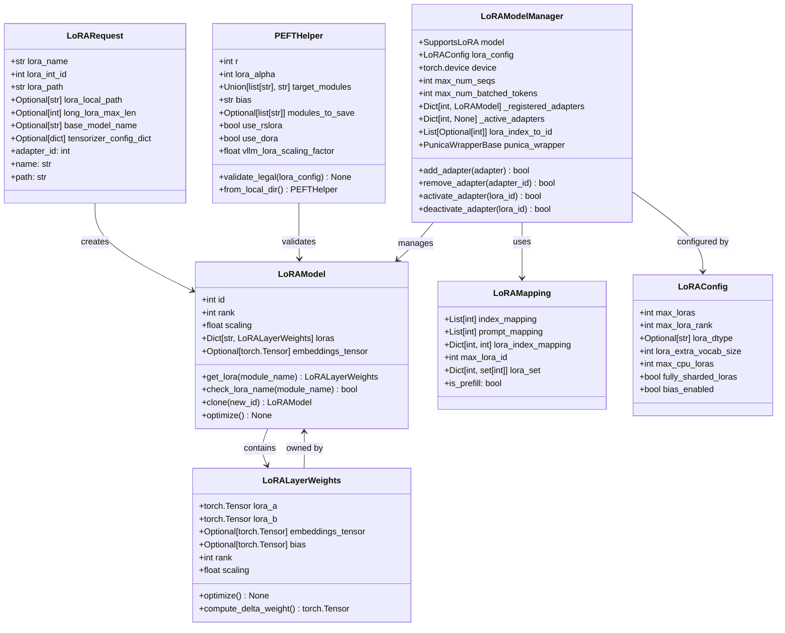

# vLLM-08-LoRA模块-数据结构

## 关键数据结构概览

LoRA 模块的数据结构设计围绕低秩矩阵分解和动态适配器管理展开，包括适配器模型、权重管理、批处理映射和 PEFT 集成四个层次。



## 核心类定义

### 1. LoRAModel 适配器模型

```python
class LoRAModel:
    """
    单个LoRA适配器的完整数据模型
    包含所有层的低秩权重和配置信息
    """
    
    def __init__(
        self,
        lora_model_id: int,
        rank: int,  
        loras: Dict[str, LoRALayerWeights],
        *,
        scaling: float = 1.0,
        embeddings_tensor: Optional[torch.Tensor] = None,
        extra_vocab_size: int = 0,
    ):
        # 基本标识
        self.id: int = lora_model_id                    # 适配器唯一标识
        self.rank: int = rank                           # LoRA秩
        self.scaling: float = scaling                   # 缩放因子 (通常为 alpha/rank)
        
        # 权重数据
        self.loras: Dict[str, LoRALayerWeights] = loras # 各层LoRA权重
        self.embeddings_tensor: Optional[torch.Tensor] = embeddings_tensor  # 嵌入权重
        self.extra_vocab_size: int = extra_vocab_size   # 扩展词汇表大小
        
        # 优化状态
        self._optimized: bool = False                   # 是否已优化
        self._device: Optional[torch.device] = None     # 权重所在设备
```

**字段语义与约束**：

| 字段 | 类型 | 约束 | 默认值 | 说明 |
|------|------|------|--------|------|
| `id` | int | 全局唯一 > 0 | 必填 | 适配器标识符 |
| `rank` | int | 1 ≤ rank ≤ 256 | 必填 | LoRA矩阵的秩 |
| `scaling` | float | > 0 | 1.0 | 适配强度缩放系数 |
| `loras` | Dict[str, LoRALayerWeights] | 非空 | 必填 | 层名到权重映射 |
| `embeddings_tensor` | Optional[torch.Tensor] | 形状匹配 | None | 嵌入层扩展权重 |
| `extra_vocab_size` | int | ≥ 0 | 0 | 新增词汇数量 |

### 2. LoRALayerWeights 层权重结构

```python
class LoRALayerWeights:
    """
    单个层的LoRA权重数据
    实现低秩分解 W + scaling * (A @ B)
    """
    
    def __init__(
        self,
        lora_a: torch.Tensor,           # A矩阵 [input_dim, rank]
        lora_b: torch.Tensor,           # B矩阵 [rank, output_dim]  
        embeddings_tensor: Optional[torch.Tensor] = None,  # 嵌入权重
        bias: Optional[torch.Tensor] = None,               # 偏置项
        *,
        rank: Optional[int] = None,     # 权重秩（自动推导）
        scaling: float = 1.0,          # 缩放因子
    ):
        # 核心权重矩阵
        self.lora_a: torch.Tensor = lora_a
        self.lora_b: torch.Tensor = lora_b
        
        # 可选组件  
        self.embeddings_tensor: Optional[torch.Tensor] = embeddings_tensor
        self.bias: Optional[torch.Tensor] = bias
        
        # 配置参数
        self.rank: int = rank or lora_a.shape[1]
        self.scaling: float = scaling
        
        # 计算属性
        self._delta_weight: Optional[torch.Tensor] = None  # 缓存的权重差
        self._optimized: bool = False                      # 优化状态
    
    def optimize(self) -> None:
        """
        优化权重存储和计算
        预计算常用的权重组合
        """
        if self._optimized:
            return
            
        # 1) 确保权重在同一设备上
        if self.lora_a.device != self.lora_b.device:
            self.lora_b = self.lora_b.to(self.lora_a.device)
            
        # 2) 优化内存布局（连续存储）
        self.lora_a = self.lora_a.contiguous()
        self.lora_b = self.lora_b.contiguous()
        
        # 3) 预计算delta权重（如果内存足够）
        if self._should_precompute_delta():
            self._delta_weight = self.scaling * torch.matmul(self.lora_a, self.lora_b)
            
        self._optimized = True
    
    def compute_delta_weight(self) -> torch.Tensor:
        """
        计算权重增量: scaling * (A @ B)
        
        Returns:
            torch.Tensor: 权重增量矩阵 [input_dim, output_dim]
        """
        if self._delta_weight is not None:
            return self._delta_weight
            
        # 实时计算
        return self.scaling * torch.matmul(self.lora_a, self.lora_b)
```

**权重矩阵形状约束**：

| 权重 | 形状 | 数据类型 | 说明 |
|------|------|----------|------|
| `lora_a` | `[input_dim, rank]` | torch.float16/bfloat16 | 降维投影矩阵 |
| `lora_b` | `[rank, output_dim]` | torch.float16/bfloat16 | 升维投影矩阵 |
| `embeddings_tensor` | `[vocab_size, hidden_dim]` | torch.float16/bfloat16 | 嵌入层扩展 |
| `bias` | `[output_dim]` | torch.float16/bfloat16 | 偏置向量 |

### 3. LoRARequest 请求结构

```python
class LoRARequest(msgspec.Struct):
    """
    LoRA适配器请求的数据结构
    包含加载适配器所需的所有信息
    """
    
    # 基本信息
    lora_name: str                              # 适配器名称
    lora_int_id: int                           # 适配器数值ID
    lora_path: str = ""                        # 适配器路径
    
    # 可选配置
    lora_local_path: Optional[str] = msgspec.field(default=None)  # 本地路径（已废弃）
    long_lora_max_len: Optional[int] = None    # 长LoRA最大长度
    base_model_name: Optional[str] = msgspec.field(default=None)  # 基础模型名
    tensorizer_config_dict: Optional[dict] = None  # 张量化配置
    
    def __post_init__(self):
        # 1) ID验证
        if self.lora_int_id < 1:
            raise ValueError(f"id must be > 0, got {self.lora_int_id}")
            
        # 2) 路径处理
        if self.lora_local_path:
            warnings.warn("lora_local_path is deprecated", DeprecationWarning)
            if not self.lora_path:
                self.lora_path = self.lora_local_path or ""
                
        # 3) 路径验证
        assert self.lora_path, "lora_path cannot be empty"
    
    @property
    def adapter_id(self) -> int:
        """适配器ID属性访问器"""
        return self.lora_int_id
    
    @property
    def name(self) -> str:
        """适配器名称属性访问器"""  
        return self.lora_name
    
    @property
    def path(self) -> str:
        """适配器路径属性访问器"""
        return self.lora_path
```

### 4. LoRAMapping 批处理映射

```python
@dataclass
class LoRAMapping:
    """
    批处理中序列到LoRA适配器的映射关系
    支持混合批处理不同适配器的序列
    """
    
    # 核心映射数据
    index_mapping: List[int]                    # 全局索引到适配器槽位映射
    prompt_mapping: List[int]                   # 提示索引映射
    lora_index_mapping: Dict[int, int]          # LoRA ID到槽位索引映射
    
    # 元数据
    max_lora_id: int                           # 最大LoRA ID
    lora_set: Dict[int, set[int]]              # LoRA组集合
    is_prefill: bool                           # 是否为预填充阶段
    
    def __post_init__(self):
        # 验证映射一致性
        self._validate_mapping_consistency()
    
    def _validate_mapping_consistency(self):
        """验证映射数据的一致性"""
        # 1) 检查索引范围
        for idx in self.index_mapping:
            if idx < 0 or idx >= len(self.lora_index_mapping):
                raise ValueError(f"Invalid index mapping: {idx}")
        
        # 2) 检查LoRA ID有效性
        for lora_id in self.lora_index_mapping.keys():
            if lora_id <= 0:
                raise ValueError(f"Invalid LoRA ID: {lora_id}")
    
    def get_lora_id_for_index(self, index: int) -> Optional[int]:
        """获取指定索引对应的LoRA ID"""
        if index >= len(self.index_mapping):
            return None
        slot_index = self.index_mapping[index]  
        return next((lora_id for lora_id, slot in self.lora_index_mapping.items() 
                    if slot == slot_index), None)
    
    def create_batch_indices(self, batch_size: int) -> torch.Tensor:
        """创建批处理索引张量"""
        indices = []
        for i in range(batch_size):
            lora_id = self.get_lora_id_for_index(i)
            slot_index = self.lora_index_mapping.get(lora_id, 0) if lora_id else 0
            indices.append(slot_index)
        return torch.tensor(indices, dtype=torch.int32)
```

## 配置和管理数据结构

### 1. LoRAConfig 配置结构

```python
@dataclass
class LoRAConfig:
    """
    LoRA模块的全局配置参数
    控制适配器的行为和资源限制
    """
    
    # 核心容量配置
    max_loras: int = 8                          # 最大同时激活的LoRA数量
    max_lora_rank: int = 64                     # 最大LoRA秩
    
    # 数据类型和精度
    lora_dtype: Optional[str] = None            # LoRA权重数据类型 ("auto", "fp16", "bf16")
    
    # 词汇表扩展
    lora_extra_vocab_size: int = 0              # 每个LoRA可扩展的词汇数
    
    # 系统资源配置  
    max_cpu_loras: Optional[int] = None         # CPU上最大LoRA缓存数
    fully_sharded_loras: bool = False           # 是否完全分片LoRA权重
    
    # 功能开关
    bias_enabled: bool = False                  # 是否启用LoRA偏置
    long_lora_scaling_factors: Optional[Tuple[float, ...]] = None  # 长LoRA缩放因子
    
    def __post_init__(self):
        # 配置验证和调整
        self._validate_and_adjust_config()
    
    def _validate_and_adjust_config(self):
        """验证和调整配置参数"""
        # 1) 容量限制检查
        if self.max_loras <= 0:
            raise ValueError("max_loras must be positive")
        if self.max_lora_rank <= 0 or self.max_lora_rank > 512:
            raise ValueError("max_lora_rank must be in range (0, 512]")
            
        # 2) 数据类型标准化
        if self.lora_dtype == "auto":
            self.lora_dtype = None
            
        # 3) CPU缓存配置调整
        if self.max_cpu_loras is None:
            self.max_cpu_loras = self.max_loras * 2  # 默认为GPU的2倍
    
    @property
    def effective_dtype(self) -> torch.dtype:
        """获取有效的数据类型"""
        if self.lora_dtype == "fp16":
            return torch.float16
        elif self.lora_dtype == "bf16":
            return torch.bfloat16
        else:
            return torch.float32  # 默认类型
```

### 2. PEFTHelper PEFT集成助手

```python
@dataclass  
class PEFTHelper:
    """
    PEFT(Parameter-Efficient Fine-Tuning)配置助手
    处理与HuggingFace PEFT库的集成和转换
    """
    
    # 必需字段（从PEFT config加载）
    r: int                                      # LoRA秩参数
    lora_alpha: int                            # LoRA alpha缩放参数
    target_modules: Union[list[str], str]      # 目标模块列表
    
    # 可选字段
    bias: Literal["none", "all", "lora_only"] = field(default="none")  # 偏置策略
    modules_to_save: Optional[list[str]] = field(default=None)         # 需要保存的模块
    use_rslora: bool = field(default=False)                           # 是否使用rsLoRA
    use_dora: bool = field(default=False)                             # 是否使用DoRA
    
    # vLLM扩展字段
    vllm_lora_scaling_factor: float = field(default=1.0)              # vLLM缩放因子
    vllm_max_position_embeddings: Optional[int] = field(default=None) # 最大位置嵌入
    
    @classmethod
    def from_local_dir(
        cls, 
        lora_dir: str, 
        max_position_embeddings: Optional[int] = None,
        tensorizer_config_dict: Optional[dict] = None
    ) -> "PEFTHelper":
        """
        从本地目录加载PEFT配置
        
        Args:
            lora_dir: LoRA配置目录
            max_position_embeddings: 最大位置嵌入数
            tensorizer_config_dict: 张量化配置
            
        Returns:
            PEFTHelper: 配置助手实例
        """
        # 1) 加载adapter_config.json
        config_path = os.path.join(lora_dir, "adapter_config.json")
        if not os.path.exists(config_path):
            raise FileNotFoundError(f"adapter_config.json not found in {lora_dir}")
            
        with open(config_path, 'r') as f:
            config_dict = json.load(f)
        
        # 2) 提取必需参数
        try:
            r = config_dict["r"]
            lora_alpha = config_dict["lora_alpha"]  
            target_modules = config_dict["target_modules"]
        except KeyError as e:
            raise ValueError(f"Required PEFT config field missing: {e}")
        
        # 3) 提取可选参数
        bias = config_dict.get("bias", "none")
        modules_to_save = config_dict.get("modules_to_save", None)
        use_rslora = config_dict.get("use_rslora", False)
        use_dora = config_dict.get("use_dora", False)
        
        # 4) 创建实例
        return cls(
            r=r,
            lora_alpha=lora_alpha,
            target_modules=target_modules,
            bias=bias,
            modules_to_save=modules_to_save,
            use_rslora=use_rslora,
            use_dora=use_dora,
            vllm_max_position_embeddings=max_position_embeddings
        )
    
    def validate_legal(self, lora_config: LoRAConfig) -> None:
        """
        验证PEFT配置与vLLM LoRA配置的兼容性
        
        Args:
            lora_config: vLLM LoRA配置
            
        Raises:
            ValueError: 配置不兼容时抛出
        """
        error_msgs = []
        
        # 1) 检查不支持的特性
        if self.modules_to_save:
            error_msgs.append("vLLM only supports modules_to_save being None.")
        if self.use_dora:
            error_msgs.append("vLLM does not yet support DoRA.")
            
        # 2) 检查参数范围
        if self.r <= 0 or self.r > lora_config.max_lora_rank:
            error_msgs.append(f"r={self.r} exceeds max_lora_rank={lora_config.max_lora_rank}")
        
        if self.lora_alpha <= 0:
            error_msgs.append(f"lora_alpha must be positive, got {self.lora_alpha}")
            
        # 3) 检查偏置兼容性
        if self.bias != "none" and not lora_config.bias_enabled:
            error_msgs.append("LoRA bias requires bias_enabled=True in config")
        
        if error_msgs:
            raise ValueError("LoRA config validation failed:\n" + "\n".join(error_msgs))
    
    @property 
    def scaling_factor(self) -> float:
        """计算缩放因子"""
        if self.use_rslora:
            # Rank-Stabilized LoRA缩放
            return self.lora_alpha / math.sqrt(self.r)
        else:
            # 标准LoRA缩放
            return self.lora_alpha / self.r
```

## 内存和性能数据结构

### 1. LoRAMemoryManager 内存管理器

```python
class LoRAMemoryManager:
    """
    LoRA模块的内存管理器
    负责适配器权重的分配、缓存和回收
    """
    
    def __init__(
        self,
        max_gpu_memory: int,                    # 最大GPU内存限制
        max_cpu_memory: int,                    # 最大CPU内存限制
        device: torch.device,                   # 主设备
    ):
        # 内存限制
        self.max_gpu_memory = max_gpu_memory
        self.max_cpu_memory = max_cpu_memory
        self.device = device
        
        # 内存追踪
        self.gpu_memory_used = 0                # 已使用GPU内存
        self.cpu_memory_used = 0                # 已使用CPU内存
        self.adapter_memory_map: Dict[int, int] = {}  # 适配器内存映射
        
        # 缓存管理
        self.gpu_cache: Dict[int, LoRAModel] = {}     # GPU缓存
        self.cpu_cache: Dict[int, LoRAModel] = {}     # CPU缓存
        self.lru_order: List[int] = []               # LRU访问顺序
    
    def allocate_adapter(self, adapter: LoRAModel) -> bool:
        """
        为适配器分配内存
        
        Args:
            adapter: 要分配内存的适配器
            
        Returns:
            bool: 分配成功返回True
        """
        memory_required = self._calculate_adapter_memory(adapter)
        
        # 1) 尝试GPU分配
        if self.gpu_memory_used + memory_required <= self.max_gpu_memory:
            self.gpu_cache[adapter.id] = adapter
            self.gpu_memory_used += memory_required
            self.adapter_memory_map[adapter.id] = memory_required
            self._update_lru(adapter.id)
            return True
            
        # 2) GPU空间不足，尝试释放空间
        if self._evict_to_cpu(memory_required):
            self.gpu_cache[adapter.id] = adapter  
            self.gpu_memory_used += memory_required
            self.adapter_memory_map[adapter.id] = memory_required
            self._update_lru(adapter.id)
            return True
            
        # 3) 分配失败
        return False
```

### 2. LoRABatchProcessor 批处理器

```python
class LoRABatchProcessor:
    """
    LoRA批处理的数据组织器
    优化混合适配器批次的计算效率
    """
    
    def __init__(self, max_batch_size: int, max_loras: int):
        self.max_batch_size = max_batch_size
        self.max_loras = max_loras
        
        # 批处理缓冲区
        self.batch_lora_indices: torch.Tensor = torch.zeros(
            max_batch_size, dtype=torch.int32)
        self.batch_sequence_lengths: torch.Tensor = torch.zeros(
            max_batch_size, dtype=torch.int32)
        
        # LoRA权重堆栈
        self.lora_a_stack: Optional[torch.Tensor] = None
        self.lora_b_stack: Optional[torch.Tensor] = None
        self.lora_scalings: torch.Tensor = torch.ones(max_loras)
    
    def prepare_batch(
        self, 
        lora_mapping: LoRAMapping,
        active_adapters: Dict[int, LoRAModel]
    ) -> Dict[str, torch.Tensor]:
        """
        准备批处理所需的张量数据
        
        Args:  
            lora_mapping: LoRA映射关系
            active_adapters: 活跃适配器字典
            
        Returns:
            Dict[str, torch.Tensor]: 批处理张量字典
        """
        # 1) 构建索引映射
        self.batch_lora_indices = lora_mapping.create_batch_indices(
            len(lora_mapping.index_mapping))
        
        # 2) 堆叠LoRA权重
        self._stack_lora_weights(active_adapters)
        
        # 3) 准备缩放系数
        self._prepare_scaling_factors(active_adapters)
        
        return {
            "lora_indices": self.batch_lora_indices,
            "lora_a_stack": self.lora_a_stack,
            "lora_b_stack": self.lora_b_stack, 
            "lora_scalings": self.lora_scalings,
        }
```

## 数据流映射关系

### 1. 权重加载到计算的映射

```python
def lora_computation_flow(
    input_tensor: torch.Tensor,           # 输入 [batch, seq_len, hidden]
    lora_request: LoRARequest,            # LoRA请求
    lora_model: LoRAModel,                # 加载的LoRA模型  
    layer_name: str                       # 目标层名
) -> torch.Tensor:                        # 输出 [batch, seq_len, hidden]
    """
    展示从LoRA请求到计算结果的完整数据流映射
    """
    # 第1步：请求到模型加载
    adapter_path = get_adapter_absolute_path(lora_request.lora_path)
    weight_files = glob.glob(os.path.join(adapter_path, "*.safetensors"))
    
    # 第2步：权重文件到张量
    state_dict = load_file(weight_files[0])  # 加载权重文件
    lora_a_key = f"{layer_name}.lora_A.weight"
    lora_b_key = f"{layer_name}.lora_B.weight"
    
    lora_a = state_dict[lora_a_key]       # [hidden_dim, rank]
    lora_b = state_dict[lora_b_key]       # [rank, hidden_dim]
    
    # 第3步：张量到计算
    # input @ A: [batch, seq_len, hidden] @ [hidden, rank] -> [batch, seq_len, rank]
    intermediate = torch.matmul(input_tensor, lora_a)
    
    # intermediate @ B: [batch, seq_len, rank] @ [rank, hidden] -> [batch, seq_len, hidden]
    lora_output = torch.matmul(intermediate, lora_b)
    
    # 第4步：缩放和融合
    scaling = lora_model.scaling
    return input_tensor + scaling * lora_output
```

### 2. 批处理数据组织映射

```python
class BatchLoRADataMapper:
    """
    批处理LoRA数据的组织映射器
    """
    
    @staticmethod
    def map_sequence_to_adapters(
        sequences: List[SequenceData],        # 输入序列列表
        lora_requests: Dict[int, LoRARequest] # LoRA请求映射
    ) -> LoRAMapping:
        """
        将序列映射到对应的LoRA适配器
        
        映射规则：
        1. 每个序列根据其lora_id选择适配器
        2. 相同lora_id的序列可以批处理
        3. None lora_id使用基础模型（适配器槽位0）
        """
        index_mapping = []
        lora_index_mapping = {}
        lora_set = {}
        
        slot_counter = 1  # 槽位0保留给基础模型
        
        for i, seq in enumerate(sequences):
            lora_id = seq.lora_id
            
            if lora_id is None or lora_id == 0:
                # 使用基础模型
                index_mapping.append(0)
            else:
                # 分配LoRA槽位
                if lora_id not in lora_index_mapping:
                    lora_index_mapping[lora_id] = slot_counter
                    lora_set[lora_id] = set()
                    slot_counter += 1
                
                slot_index = lora_index_mapping[lora_id]
                index_mapping.append(slot_index)
                lora_set[lora_id].add(i)
        
        return LoRAMapping(
            index_mapping=index_mapping,
            prompt_mapping=list(range(len(sequences))),
            lora_index_mapping=lora_index_mapping,
            max_lora_id=max(lora_index_mapping.keys()) if lora_index_mapping else 0,
            lora_set=lora_set,
            is_prefill=sequences[0].is_prefill if sequences else False
        )
```

## 版本演进说明

| 版本 | 主要变更 | 数据结构影响 | 兼容性 | 迁移建议 |
|------|----------|--------------|--------|----------|
| v0.1.x | 基础LoRA实现 | 简单权重结构 | 不兼容 | 已废弃 |
| v0.2.x | 批处理支持 | 添加映射结构 | 向后兼容 | 建议升级 |
| v0.3.x | Punica集成 | 优化权重布局 | 部分兼容 | 性能提升 |
| v0.4.x | PEFT标准化 | 标准化配置格式 | 向后兼容 | 推荐新格式 |
| 当前版本 | 多适配器优化 | LRU缓存和内存管理 | 向后兼容 | 启用缓存管理 |

## 内存布局优化

### 1. 权重内存对齐

```python
# LoRA权重的内存友好布局
@dataclass
class OptimizedLoRAWeights:
    """
    内存优化的LoRA权重布局
    """
    __slots__ = ['lora_a', 'lora_b', 'rank', 'scaling']
    
    # 连续内存存储的权重
    lora_a: torch.Tensor    # 行主序，缓存友好
    lora_b: torch.Tensor    # 转置存储，优化矩阵乘法
    rank: int
    scaling: float
    
    def __post_init__(self):
        # 确保内存对齐
        self.lora_a = self.lora_a.contiguous()
        self.lora_b = self.lora_b.contiguous()
        
        # 可选：使用16字节对齐提升SIMD性能
        if self.lora_a.numel() % 4 == 0:
            self.lora_a = align_tensor_16bytes(self.lora_a)
        if self.lora_b.numel() % 4 == 0:
            self.lora_b = align_tensor_16bytes(self.lora_b)
```

### 2. 批处理内存池

```python
class LoRAMemoryPool:
    """
    LoRA计算的内存池管理
    复用临时张量减少分配开销
    """
    
    def __init__(self, max_batch_size: int, max_rank: int, hidden_size: int):
        # 预分配临时缓冲区
        self.intermediate_buffer = torch.empty(
            (max_batch_size, max_rank), 
            dtype=torch.float16,
            device='cuda'
        )
        
        self.output_buffer = torch.empty(
            (max_batch_size, hidden_size),
            dtype=torch.float16, 
            device='cuda'
        )
        
        # 引用计数管理
        self.buffer_refs = {}
    
    def get_intermediate_buffer(self, batch_size: int, rank: int) -> torch.Tensor:
        """获取中间计算缓冲区"""
        if batch_size <= self.intermediate_buffer.shape[0] and rank <= self.intermediate_buffer.shape[1]:
            return self.intermediate_buffer[:batch_size, :rank]
        else:
            # 超出预分配大小，动态分配
            return torch.empty((batch_size, rank), dtype=torch.float16, device='cuda')
```

这些数据结构为LoRA模块提供了完整的类型系统和内存管理方案，支持从单适配器到大规模多适配器服务的各种场景。
