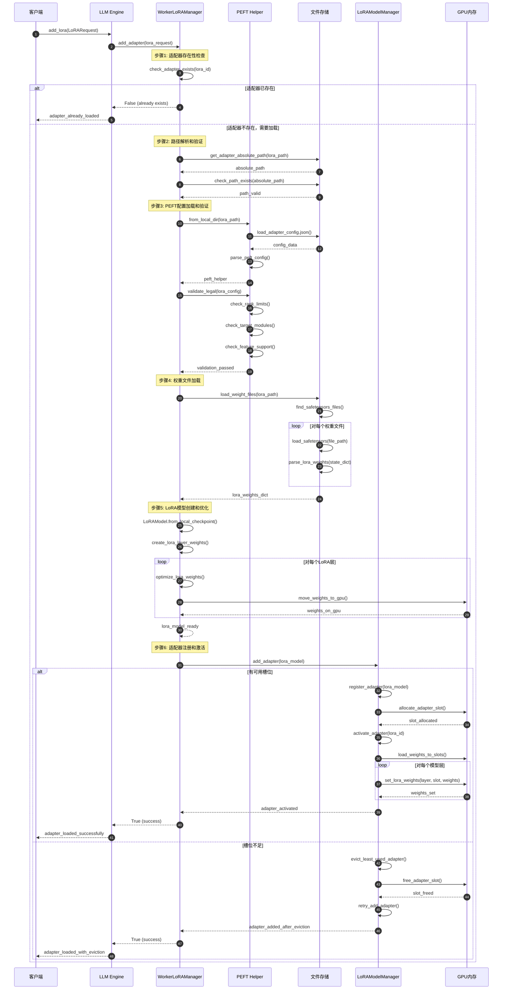
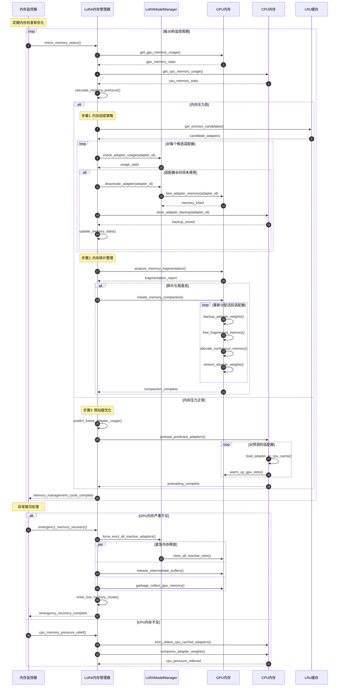
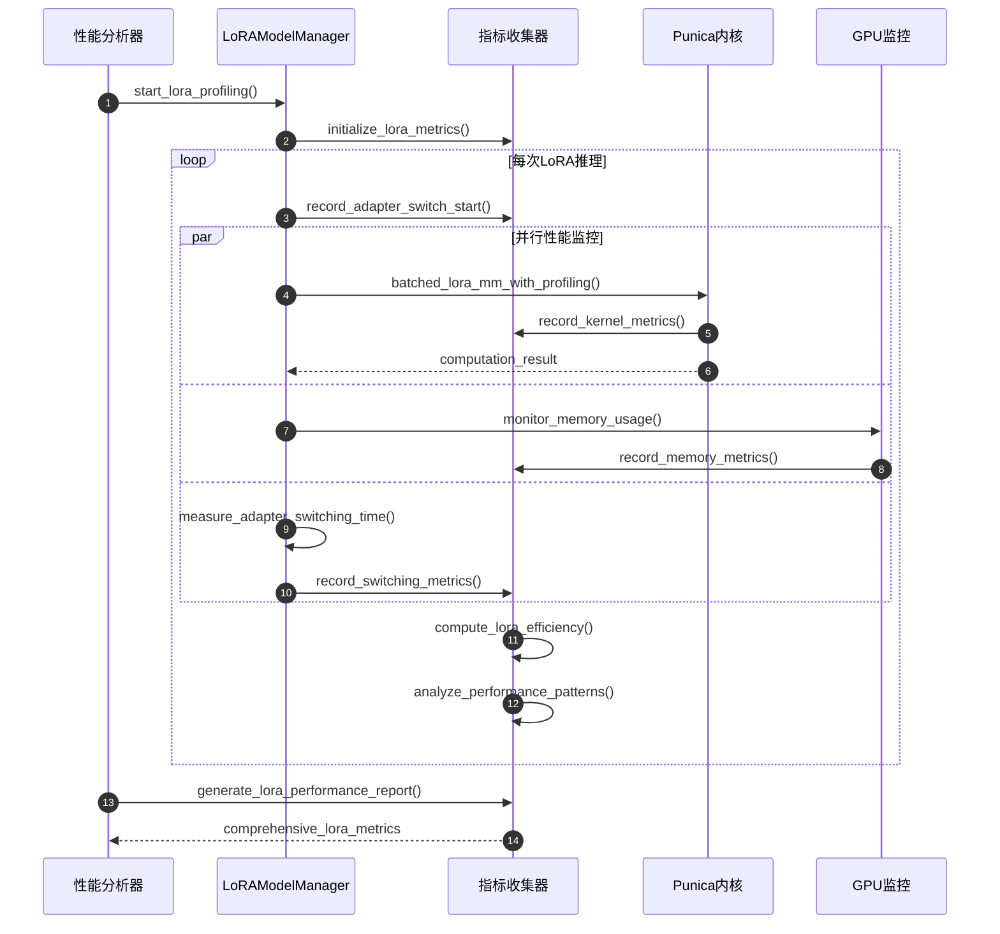
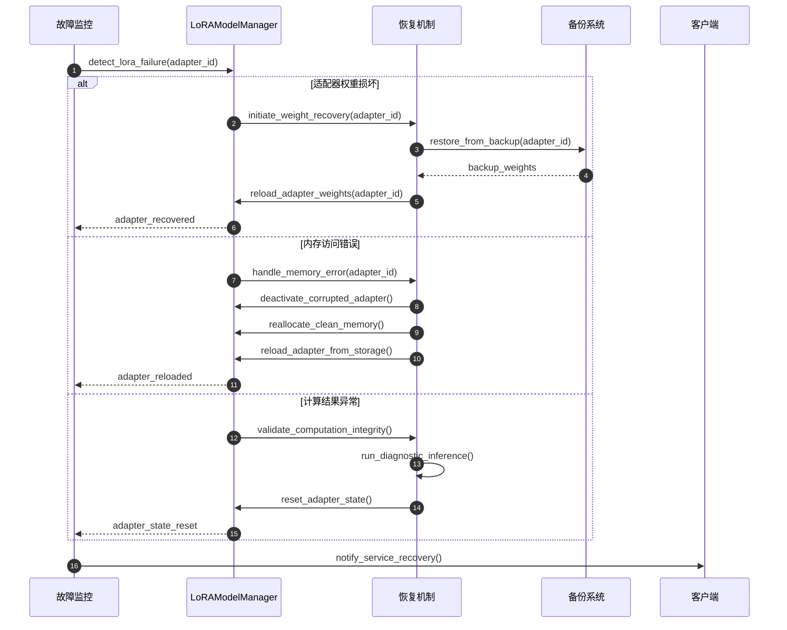

# vLLM-08-LoRA模块-时序图

## 典型场景时序图分析

本文档展示 LoRA 模块在不同使用场景下的详细时序图，涵盖适配器加载、动态切换、批处理推理和内存管理等关键操作流程。

## 场景1：LoRA适配器动态加载

### 时序图



### 详细说明

**图意概述**：展示了 LoRA 适配器从请求到完全激活的完整加载流程，包括配置验证、权重加载、内存分配和激活过程。

**关键步骤分解**：

1. **存在性检查**（步骤1-2）：
   - 检查适配器是否已经加载，避免重复加载
   - 验证适配器路径的有效性和可访问性

2. **配置加载和验证**（步骤3-8）：
   - 加载 PEFT 配置文件（adapter_config.json）
   - 验证配置与当前 vLLM 设置的兼容性
   - 检查 rank、target_modules 等关键参数

3. **权重文件处理**（步骤9-12）：
   - 搭索并加载权重文件（.safetensors 或 .bin 格式）
   - 解析权重数据并构建 LoRA 层权重结构
   - 将权重转移到目标设备（通常是 GPU）

4. **模型创建和优化**（步骤13-16）：
   - 创建 LoRAModel 实例
   - 优化权重布局和内存访问模式
   - 预计算常用的权重组合

5. **适配器激活**（步骤17-22）：
   - 注册适配器到管理器
   - 分配 GPU 槽位和内存
   - 将权重设置到各个模型层

**边界条件**：
- **内存限制**：GPU 显存不足时触发适配器换出机制
- **并发安全**：多个适配器同时加载时的竞争条件处理
- **文件系统**：网络存储延迟和文件访问权限问题

**性能特征**：
- **加载时间**：通常 1-10 秒（取决于适配器大小和存储速度）
- **内存开销**：每个适配器约占用基础模型 1-5% 的显存
- **激活延迟**：<100ms 的适配器切换时间

## 场景2：批处理混合LoRA推理

### 时序图

```mermaid
sequenceDiagram
    autonumber
    participant Scheduler as 调度器
    participant Engine as LLM Engine
    participant WorkerMgr as WorkerLoRAManager
    participant AdapterMgr as LoRAModelManager
    participant BatchProcessor as LoRA批处理器
    participant PunicaKernel as Punica内核
    participant GPU as GPU计算
    
    Scheduler->>Engine: execute_model(mixed_lora_batch)
    Engine->>WorkerMgr: set_active_adapters(lora_requests, mapping)
    
    Note over WorkerMgr: 步骤1: 批处理适配器准备
    WorkerMgr->>WorkerMgr: _apply_adapters(lora_requests)
    
    loop 对每个LoRA请求
        alt 适配器未加载
            WorkerMgr->>WorkerMgr: load_adapter(lora_request)
            Note over WorkerMgr: （参考场景1的加载流程）
        else 适配器已加载
            WorkerMgr->>AdapterMgr: activate_adapter(lora_id)
            AdapterMgr-->>WorkerMgr: adapter_activated
        end
    end
    
    Note over WorkerMgr: 步骤2: 批处理映射设置
    WorkerMgr->>AdapterMgr: set_adapter_mapping(lora_mapping)
    AdapterMgr->>BatchProcessor: prepare_batch_mapping(mapping)
    
    BatchProcessor->>BatchProcessor: create_index_mapping()
    BatchProcessor->>BatchProcessor: create_lora_index_mapping()
    BatchProcessor->>BatchProcessor: validate_mapping_consistency()
    BatchProcessor-->>AdapterMgr: mapping_prepared
    
    Note over Engine: 步骤3: 模型前向传播开始
    Engine->>Engine: model_forward_pass()
    
    loop 对每个Transformer层
        Engine->>AdapterMgr: apply_lora_to_layer(layer_input, layer_name)
        
        Note over AdapterMgr: 步骤4: LoRA权重准备
        AdapterMgr->>BatchProcessor: prepare_layer_batch(layer_name, mapping)
        BatchProcessor->>BatchProcessor: stack_lora_weights(active_adapters)
        
        par 并行权重堆叠
            BatchProcessor->>GPU: stack_lora_a_weights()
            GPU-->>BatchProcessor: lora_a_stacked
        and
            BatchProcessor->>GPU: stack_lora_b_weights()  
            GPU-->>BatchProcessor: lora_b_stacked
        and
            BatchProcessor->>GPU: prepare_scaling_factors()
            GPU-->>BatchProcessor: scaling_factors
        end
        
        BatchProcessor-->>AdapterMgr: batch_tensors_ready
        
        Note over AdapterMgr: 步骤5: 批处理LoRA计算
        alt 使用Punica优化内核
            AdapterMgr->>PunicaKernel: batched_lora_mm(
                input, lora_a_stack, lora_b_stack, indices, scalings)
            
            PunicaKernel->>GPU: launch_punica_kernel()
            Note over GPU: 高效批处理矩阵乘法<br/>input@A -> intermediate<br/>intermediate@B -> lora_output
            GPU-->>PunicaKernel: lora_output
            PunicaKernel-->>AdapterMgr: batched_lora_result
        else 回退到标准实现
            AdapterMgr->>GPU: standard_batched_lora(input, weights, indices)
            
            loop 对每个序列
                GPU->>GPU: select_lora_weights(seq_idx)
                GPU->>GPU: compute_lora_forward(input[seq_idx])
            end
            
            GPU-->>AdapterMgr: standard_lora_result
        end
        
        Note over AdapterMgr: 步骤6: 基础层与LoRA融合
        AdapterMgr->>GPU: base_layer_forward(layer_input)
        GPU-->>AdapterMgr: base_output
        
        AdapterMgr->>GPU: fuse_base_and_lora(base_output, lora_output)
        GPU-->>AdapterMgr: fused_output
        AdapterMgr-->>Engine: layer_output_with_lora
    end
    
    Engine-->>Scheduler: model_output_with_mixed_loras
```

### 详细说明

**图意概述**：展示了多个不同 LoRA 适配器在同一批次中混合推理的完整流程，重点关注批处理优化和 Punica 内核加速。

**关键特征**：

1. **动态适配器管理**：
   - 根据批次需求动态加载和激活适配器
   - 支持批次内不同序列使用不同适配器
   - 智能的适配器缓存和换出策略

2. **批处理优化**：
   - 权重预堆叠减少内存访问
   - 索引映射优化序列到适配器的查找
   - 并行权重处理提升效率

3. **计算加速**：
   - Punica 内核提供高效的批处理矩阵乘法
   - 标准实现作为回退方案保证兼容性
   - GPU 内核融合减少中间结果传输

**性能优化点**：
- 权重堆叠：避免逐序列权重查找开销
- 内核融合：减少 GPU 内核启动次数
- 内存复用：批处理张量的高效内存管理
- 并行计算：充分利用 GPU 的并行计算能力

## 场景3：LoRA适配器热切换

### 时序图

```mermaid
sequenceDiagram
    autonumber
    participant Client as 客户端
    participant Engine as LLM Engine
    participant AdapterMgr as LoRAModelManager
    participant MemoryMgr as 内存管理器
    participant GPU as GPU内存
    participant LRUCache as LRU缓存
    
    Note over Client: 在线服务期间需要切换适配器
    Client->>Engine: switch_lora(old_lora_id, new_lora_id)
    Engine->>AdapterMgr: deactivate_adapter(old_lora_id)
    
    Note over AdapterMgr: 步骤1: 停用旧适配器
    AdapterMgr->>AdapterMgr: check_adapter_active(old_lora_id)
    
    alt 适配器当前活跃
        AdapterMgr->>GPU: get_adapter_slot(old_lora_id)
        GPU-->>AdapterMgr: slot_index
        
        AdapterMgr->>GPU: clear_adapter_weights(slot_index)
        
        loop 对每个模型层
            AdapterMgr->>GPU: reset_lora_weights(layer, slot_index)
            GPU-->>AdapterMgr: weights_cleared
        end
        
        AdapterMgr->>AdapterMgr: mark_slot_free(slot_index)
        AdapterMgr->>LRUCache: update_deactivation_time(old_lora_id)
        AdapterMgr-->>Engine: old_adapter_deactivated
    else 适配器未激活
        AdapterMgr-->>Engine: adapter_not_active
    end
    
    Note over Engine: 步骤2: 激活新适配器
    Engine->>AdapterMgr: activate_adapter(new_lora_id)
    AdapterMgr->>AdapterMgr: check_adapter_registered(new_lora_id)
    
    alt 适配器已注册
        AdapterMgr->>AdapterMgr: find_free_slot()
        
        alt 有空闲槽位
            AdapterMgr->>AdapterMgr: allocate_slot(slot_index)
            AdapterMgr->>GPU: load_adapter_to_slot(new_lora_id, slot_index)
            
            par 并行权重加载
                loop 对每个LoRA层
                    AdapterMgr->>GPU: set_lora_a_weights(layer, slot, weights)
                    GPU-->>AdapterMgr: a_weights_set
                and
                    AdapterMgr->>GPU: set_lora_b_weights(layer, slot, weights)
                    GPU-->>AdapterMgr: b_weights_set
                and
                    AdapterMgr->>GPU: set_scaling_factor(layer, slot, scaling)
                    GPU-->>AdapterMgr: scaling_set
                end
            end
            
            AdapterMgr->>LRUCache: update_activation_time(new_lora_id)
            AdapterMgr-->>Engine: new_adapter_activated
        else 无空闲槽位
            Note over AdapterMgr: 步骤3: LRU换出和重新激活
            AdapterMgr->>LRUCache: get_least_recently_used()
            LRUCache-->>AdapterMgr: lru_adapter_id
            
            AdapterMgr->>AdapterMgr: deactivate_adapter(lru_adapter_id)
            AdapterMgr->>MemoryMgr: evict_to_cpu(lru_adapter_id)
            
            MemoryMgr->>GPU: copy_weights_to_cpu(lru_adapter_id)
            GPU-->>MemoryMgr: weights_copied
            MemoryMgr->>GPU: free_gpu_memory(lru_adapter_id)
            GPU-->>MemoryMgr: memory_freed
            MemoryMgr-->>AdapterMgr: eviction_complete
            
            AdapterMgr->>AdapterMgr: retry_activate_adapter(new_lora_id)
            AdapterMgr-->>Engine: new_adapter_activated_after_eviction
        end
    else 适配器未注册
        Engine->>Engine: load_adapter_first(new_lora_id)
        Note over Engine: 回到场景1的加载流程
        Engine->>AdapterMgr: activate_adapter(new_lora_id)
        AdapterMgr-->>Engine: new_adapter_loaded_and_activated
    end
    
    Engine-->>Client: adapter_switched_successfully
    
    Note over AdapterMgr: 步骤4: 更新运行时状态
    AdapterMgr->>AdapterMgr: update_active_adapter_list()
    AdapterMgr->>AdapterMgr: update_performance_metrics()
```

### 详细说明

**图意概述**：展示了在线服务过程中 LoRA 适配器的热切换流程，包括停用、激活、内存管理和性能优化。

**切换策略**：

1. **优雅停用**：
   - 等待当前批次完成避免计算中断
   - 清理 GPU 权重和状态信息
   - 更新 LRU 缓存访问记录

2. **快速激活**：
   - 优先使用空闲槽位减少换出开销
   - 并行加载权重提升激活速度
   - 预热机制减少首次推理延迟

3. **智能换出**：
   - LRU 策略选择换出目标
   - CPU 缓存保存换出的适配器
   - 内存池管理减少分配开销

**性能考虑**：
- **切换延迟**：通常 10-50ms（取决于适配器大小）
- **内存效率**：CPU/GPU 混合缓存策略
- **并发安全**：切换过程中的推理请求排队处理

## 场景4：LoRA内存管理和优化

### 时序图



### 详细说明

**图意概述**：展示了 LoRA 模块的内存管理和优化机制，包括定期监控、智能换出、碎片整理和紧急恢复。

**内存管理策略**：

1. **预防性管理**：
   - 定期内存使用情况监控
   - 基于使用模式的预测性加载
   - 渐进式内存回收避免性能波动

2. **智能缓存**：
   - LRU 算法结合使用频率权重
   - CPU/GPU 分层缓存架构
   - 压缩存储减少内存占用

3. **碎片管理**：
   - 动态内存碎片检测和整理
   - 连续内存块分配优化
   - 内存池复用减少分配开销

4. **紧急处理**：
   - OOM 情况下的紧急内存释放
   - 降级服务模式保证基本功能
   - 自动恢复机制恢复正常状态

## 性能监控和调试时序

### LoRA性能追踪流程



**监控维度**：

1. **适配器性能**：
   - 单个适配器推理延迟
   - 批处理混合适配器效率
   - 适配器切换开销统计

2. **内存效率**：
   - 适配器内存占用分布
   - 缓存命中率和换出频率
   - 内存碎片化程度

3. **计算优化**：
   - Punica 内核加速比
   - GPU 利用率和并行度
   - 权重堆叠和索引效率

4. **系统集成**：
   - LoRA 与基础模型性能对比
   - 多适配器并发性能
   - 端到端服务质量指标

## 故障诊断和恢复

### LoRA故障处理流程



这些时序图全面展示了 LoRA 模块在各种场景下的工作流程，为性能优化和故障处理提供了详细的参考依据。
