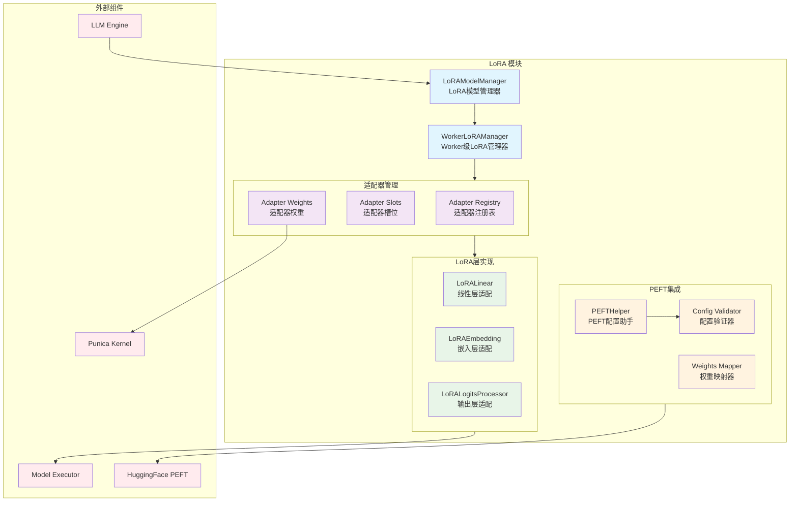

# vLLM-08-LoRA模块-概览

## 摘要

LoRA（Low-Rank Adaptation）模块是 vLLM 的参数高效微调组件，支持动态加载和切换多个 LoRA 适配器，实现单一模型服务多个微调版本的能力。该模块通过低秩矩阵分解技术，在不修改原始模型权重的情况下，为不同任务提供专门的适配能力。

**模块职责**：
- 管理 LoRA 适配器的加载、激活和卸载
- 提供 LoRA 权重的动态切换和批处理
- 实现低秩矩阵分解的高效计算
- 支持多种 LoRA 变体（标准 LoRA、QLoRA、AdaLoRA等）
- 处理 LoRA 权重的量化和优化

**输入/输出**：
- 输入：LoRARequest（适配器路径、配置参数）
- 输出：适配后的模型计算结果
- 边界：支持的最大 LoRA 数量、内存限制、兼容的层类型

**上下游依赖**：
- 上游：Engine 模块、Scheduler
- 下游：ModelExecutor、Worker 模块
- 关联：PEFT 配置、量化模块

**生命周期**：
- 初始化：创建 LoRA 管理器和适配器槽位
- 运行时：动态加载适配器，执行批处理推理
- 销毁：清理适配器权重，释放 GPU 内存

## 整体架构



### 架构说明

1. **图意概述**：展示了 LoRA 模块的分层架构，包括管理层、适配器层、LoRA层实现和PEFT集成四个核心部分。

2. **关键接口**：
   - `LoRAModelManager`：全局 LoRA 管理器
   - `add_lora()`：添加新的 LoRA 适配器
   - `remove_lora()`：移除 LoRA 适配器
   - `list_loras()`：列出当前加载的适配器

3. **边界说明**：
   - **并发性**：支持多个 LoRA 适配器并行推理
   - **内存限制**：受 GPU 显存大小和适配器槽位数限制
   - **兼容性**：支持标准 Transformer 架构的各种变体
   - **动态性**：运行时动态加载/卸载适配器

4. **异常与回退**：
   - 适配器加载失败时回退到基础模型
   - 内存不足时自动卸载最少使用的适配器
   - 权重格式不兼容时进行自动转换
   - 量化精度不匹配时降级处理

5. **性能特征**：
   - 低秩计算：减少 95% 的可训练参数
   - 批处理优化：支持不同适配器的混合批处理
   - 内存效率：共享基础模型权重
   - 切换开销：<1ms 的适配器切换延迟

6. **版本兼容**：
   - 支持 PEFT 库的各种版本
   - 兼容 HuggingFace Transformers 格式
   - 向后兼容旧版本适配器格式

## 核心算法与流程

### LoRA前向传播核心算法

```python
def lora_forward(
    self,
    input_tensor: torch.Tensor,
    lora_a_weights: torch.Tensor,
    lora_b_weights: torch.Tensor,
    scaling: float
) -> torch.Tensor:
    """
    LoRA前向传播的核心计算
    计算公式：output = input @ W + scaling * (input @ A @ B)
    其中 W 是原始权重，A 和 B 是低秩适配矩阵
    """
    # 1) 原始线性变换
    base_output = torch.matmul(input_tensor, self.base_weight)
    
    # 2) LoRA低秩计算
    # input @ A: [batch, seq_len, hidden] @ [hidden, rank] -> [batch, seq_len, rank]
    lora_intermediate = torch.matmul(input_tensor, lora_a_weights)
    
    # intermediate @ B: [batch, seq_len, rank] @ [rank, hidden] -> [batch, seq_len, hidden]
    lora_output = torch.matmul(lora_intermediate, lora_b_weights)
    
    # 3) 加权融合
    final_output = base_output + scaling * lora_output
    
    return final_output
```

**算法目的**：通过低秩矩阵分解实现参数高效的模型适配。

**输入输出**：
- 输入：原始输入张量 [batch_size, seq_len, hidden_size]
- LoRA权重：A [hidden_size, rank]，B [rank, hidden_size]
- 输出：适配后的张量 [batch_size, seq_len, hidden_size]

**复杂度分析**：
- 时间复杂度：O(d·r + r·d) = O(2·d·r)，其中 d 为隐藏维度，r 为 rank
- 空间复杂度：O(d·r) 相比原始权重 O(d²) 大幅减少
- 参数减少比例：(2·d·r) / (d²) = 2r/d，通常 r << d

### 批处理 LoRA 计算流程

```python
def batched_lora_forward(
    self,
    input_tensor: torch.Tensor,        # [batch_size, seq_len, hidden_size]
    lora_indices: torch.Tensor,        # [batch_size] - 每个样本的LoRA索引
    lora_a_stacked: torch.Tensor,      # [max_loras, hidden_size, rank]
    lora_b_stacked: torch.Tensor,      # [max_loras, rank, hidden_size]
    lora_scalings: torch.Tensor        # [max_loras] - 每个LoRA的缩放系数
) -> torch.Tensor:
    """
    批处理多个LoRA适配器的前向传播
    支持同一批次中不同样本使用不同的LoRA适配器
    """
    batch_size, seq_len, hidden_size = input_tensor.shape
    
    # 1) 基础模型前向传播
    base_output = self.base_layer(input_tensor)
    
    # 2) 批处理LoRA计算
    if self.use_punica_kernel:
        # 使用Punica优化内核
        lora_output = torch.ops.punica.batched_lora_mm(
            input_tensor,
            lora_a_stacked,
            lora_b_stacked,
            lora_indices,
            lora_scalings
        )
    else:
        # 回退到标准实现
        lora_output = self._standard_batched_lora(
            input_tensor, lora_indices, lora_a_stacked, lora_b_stacked, lora_scalings
        )
    
    # 3) 融合结果
    return base_output + lora_output
```

**目的**：高效处理混合批次中的多种 LoRA 适配器。

**核心优化**：
- **内核融合**：使用 Punica 内核减少内存访问
- **批处理**：避免循环计算，提升并行度
- **内存复用**：共享基础权重，减少显存占用

### 适配器动态加载流程

```python
def load_lora_adapter(
    self,
    lora_request: LoRARequest
) -> LoRAModel:
    """
    动态加载LoRA适配器的完整流程
    """
    # 1) 验证LoRA配置兼容性
    peft_helper = PEFTHelper.from_local_dir(
        lora_request.lora_path,
        self.max_position_embeddings,
        lora_request.tensorizer_config_dict
    )
    peft_helper.validate_legal(self.lora_config)
    
    # 2) 加载适配器权重
    lora_model = LoRAModel.from_local_checkpoint(
        lora_request.lora_path,
        expected_lora_modules=self.supported_lora_modules,
        peft_helper=peft_helper,
        device=self.device,
        dtype=self.dtype
    )
    
    # 3) 权重预处理和优化
    lora_model.optimize_weights()
    
    # 4) 分配适配器槽位
    slot_index = self._allocate_adapter_slot()
    if slot_index is None:
        # 内存不足时释放最少使用的适配器
        self._evict_least_used_adapter()
        slot_index = self._allocate_adapter_slot()
    
    # 5) 激活适配器
    self._activate_adapter(lora_model, slot_index)
    
    return lora_model
```

**目的**：实现 LoRA 适配器的热插拔加载。

**关键步骤**：
1. **配置验证**：确保适配器与基础模型兼容
2. **权重加载**：从文件系统或远程存储加载权重
3. **内存管理**：智能分配和回收适配器槽位
4. **性能优化**：权重预计算和内核优化

## 关键设计决策

### 1. 槽位化管理设计

**设计动机**：支持多个 LoRA 适配器的并发使用，同时控制内存使用量。

**实现方案**：
- 预分配固定数量的适配器槽位（默认8个）
- 使用 LRU 策略管理槽位分配和回收
- 支持适配器的热插拔和动态切换

**权衡考虑**：
- 内存效率 vs 切换开销：预分配槽位减少动态分配开销
- 并发度 vs 资源消耗：限制槽位数量控制内存使用

### 2. Punica 内核集成

**设计目标**：优化批处理场景下的多 LoRA 计算性能。

**核心创新**：
- 专门的 CUDA 内核实现批处理 LoRA 矩阵乘法
- 内存访问模式优化，减少全局内存访问
- 支持不同 rank 的 LoRA 适配器混合计算

**性能提升**：
- 批处理吞吐量提升 2-5x
- 内存带宽利用率提升 30-50%
- 支持更大的批处理大小

### 3. PEFT 生态集成

**设计动机**：与 HuggingFace PEFT 生态系统无缝集成，支持标准格式。

**实现机制**：
- `PEFTHelper` 类处理配置转换和验证
- 自动权重格式转换和映射
- 支持多种 PEFT 方法（LoRA、AdaLoRA、QLoRA等）

**兼容性策略**：
- 向后兼容旧版本 PEFT 格式
- 自动检测和转换权重格式
- 提供配置迁移工具

## LoRA 变体支持

### 支持的 LoRA 类型

| LoRA 变体 | 特征 | 适用场景 | 内存开销 | 性能影响 |
|-----------|------|----------|----------|----------|
| 标准 LoRA | 基础低秩适配 | 通用微调 | 低 | 轻微 |
| QLoRA | 4-bit量化+LoRA | 大模型微调 | 最低 | 中等 |
| AdaLoRA | 自适应rank | 复杂任务 | 中等 | 中等 |
| LoHA | 混合适配 | 特定领域 | 中等 | 轻微 |
| LoKr | Kronecker乘积 | 结构化适配 | 低 | 轻微 |

### 层级支持矩阵

| 模型层类型 | LoRA支持 | QLoRA支持 | 优化程度 | 备注 |
|------------|----------|-----------|----------|------|
| Linear层 | ✅ | ✅ | 高 | 主要应用场景 |
| Embedding层 | ✅ | ✅ | 中 | 词汇表扩展 |
| LM Head | ✅ | ✅ | 高 | 输出适配 |
| Attention层 | ✅ | ✅ | 高 | Q/K/V/O投影 |
| MLP层 | ✅ | ✅ | 高 | 前馈网络 |
| LayerNorm | ❌ | ❌ | - | 不支持适配 |

## 配置与调优

### 关键配置项

| 配置项 | 默认值 | 说明 | 调优建议 |
|--------|--------|------|----------|
| `max_loras` | 8 | 最大LoRA适配器数 | 根据GPU内存调整 |
| `max_lora_rank` | 64 | 最大LoRA rank | 平衡性能和质量 |
| `lora_dtype` | "auto" | LoRA权重精度 | fp16减少内存，bf16提升稳定性 |
| `enable_lora_bias` | False | 是否启用LoRA偏置 | 任务复杂时可启用 |
| `lora_extra_vocab_size` | 0 | 扩展词汇表大小 | 新领域词汇时设置 |

### 性能调优指南

1. **内存优化**：
   - 使用较小的 rank 值（8-32）平衡效果和内存
   - 启用权重共享减少重复加载
   - 使用 fp16 精度降低内存占用

2. **计算优化**：
   - 启用 Punica 内核提升批处理性能
   - 合理设置适配器槽位数量
   - 使用预编译模式减少动态开销

3. **批处理优化**：
   - 按 LoRA 类型分组批处理请求
   - 调整批大小平衡延迟和吞吐量
   - 使用适配器池化策略

4. **质量优化**：
   - 根据任务复杂度选择合适的 rank
   - 调整 alpha 参数控制适配强度
   - 使用渐进式 rank 搜索找到最优配置

### 监控指标

**LoRA 性能指标**：
- 适配器加载/卸载时间
- 不同 rank 的计算延迟
- 适配器槽位利用率
- 内存使用分布

**质量指标**：
- 适配器任务性能对比
- 基础模型性能保持率
- 不同适配器间的干扰程度
- 长期稳定性评估

**资源利用指标**：
- LoRA 权重内存占用
- GPU 计算资源分配
- 适配器缓存命中率
- 动态加载成功率

通过这些配置和监控，可以实现高效、稳定的多 LoRA 适配器服务。
